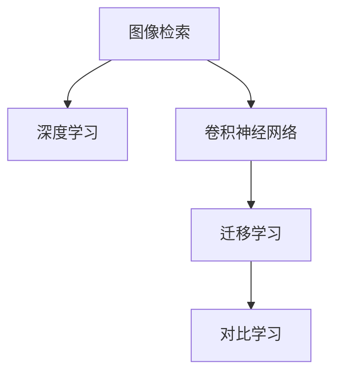

                 

## 1. 背景介绍

随着电子商务的兴起，消费者购买产品的渠道日益多样，从传统的线下实体店铺到线上电商平台。在面对海量商品时，如何更快速、更准确地找到满足自己需求的商品，成为了电商购物中的一大难题。传统的图像搜索方法依赖于手动输入关键词，容易遗漏或输入错误，搜索结果常常与实际需求不符，极大影响了用户体验。

为了解决这一问题，人们开始探索基于视觉的图像搜索技术。基于深度学习的图像搜索方法能够直接处理图像数据，通过视觉相似度匹配，更准确地找到与用户需求相匹配的商品。这种“所见即所得”的搜索方式，极大地提升了用户购物的便利性和满意度，成为电商购物的新趋势。

## 2. 核心概念与联系

### 2.1 核心概念概述

在图像搜索技术中，涉及以下几个核心概念：

- 图像检索(Image Retrieval)：指从图像库中找出与查询图像最相似的图像，是图像搜索技术的核心。
- 深度学习(Deep Learning)：通过深度神经网络结构，学习图像特征，实现图像之间的相似度匹配。
- 卷积神经网络(Convolutional Neural Network, CNN)：一种前馈神经网络，特别适合处理具有网格结构的数据，如图像。
- 迁移学习(Transfer Learning)：将在大规模数据集上预训练的模型迁移到新的任务上，通过微调优化，实现任务特定的图像检索。
- 对比学习(Contrastive Learning)：通过学习相似的图像之间的高相似度、不相似的图像之间的低相似度，提升图像检索效果。

这些概念之间通过深度学习框架得以整合和实现，共同构成了图像搜索的核心技术体系。

### 2.2 核心概念原理和架构的 Mermaid 流程图



这个流程图展示了图像搜索技术的关键环节：首先通过卷积神经网络进行特征提取，然后迁移学习利用预训练模型提升检索效果，最后对比学习进一步优化相似度匹配，最终实现准确的图像检索。

## 3. 核心算法原理 & 具体操作步骤

### 3.1 算法原理概述

基于深度学习的图像检索算法，核心思想是通过学习图像特征，实现图像之间的相似度匹配。其基本流程包括：

1. 图像预处理：将原始图像数据进行标准化处理，如尺寸归一化、色彩空间转换等。
2. 特征提取：使用卷积神经网络对预处理后的图像进行特征提取，得到高维的特征向量。
3. 相似度计算：计算查询图像与库中所有图像的相似度，通常使用余弦相似度或欧氏距离等。
4. 排序与筛选：根据相似度从高到低排序，选择前N个相似图像作为最终检索结果。

### 3.2 算法步骤详解

#### 3.2.1 图像预处理

图像预处理是图像检索的第一步，其目的是将原始图像数据转换为模型可以处理的形式。常用的预处理技术包括：

- 尺寸归一化：将图像尺寸调整为固定大小，便于特征提取。
- 色彩空间转换：将图像转换为灰度图或RGB空间，减少特征向量维度。
- 噪声去除：通过滤波器或降噪算法去除图像中的噪声干扰。

#### 3.2.2 特征提取

卷积神经网络是图像特征提取的核心工具。常用的卷积神经网络架构包括VGG、ResNet、Inception等。其中，Inception网络结构由于其多尺度特征图和深度网络的特点，特别适用于图像检索任务。

#### 3.2.3 相似度计算

相似度计算是图像检索的关键步骤。常用的相似度计算方法包括余弦相似度、欧氏距离等。余弦相似度计算公式如下：

$$
\text{similarity} = \cos(\theta) = \frac{\vec{a} \cdot \vec{b}}{\|\vec{a}\| \|\vec{b}\|}
$$

其中，$\vec{a}$和$\vec{b}$分别是两个图像的特征向量，$\theta$为它们之间的夹角。余弦相似度的值在-1到1之间，1表示完全相似，-1表示完全不同。

#### 3.2.4 排序与筛选

根据相似度计算结果，对库中所有图像进行排序。通常选择前N个相似图像作为最终检索结果，N的值根据实际情况而定。

### 3.3 算法优缺点

基于深度学习的图像检索算法具有以下优点：

- 自动提取图像特征，无需手动设计特征提取器。
- 高精度：通过深度学习，能够学习到丰富的图像特征，提高检索准确率。
- 泛化能力强：预训练模型在大量数据上训练，具有较强的泛化能力。

同时，这些算法也存在一些缺点：

- 计算复杂度高：深度学习模型的训练和推理计算量大，对硬件要求高。
- 数据依赖性强：需要大量标注数据进行预训练，数据获取成本高。
- 模型可解释性差：深度学习模型是黑盒模型，难以解释其内部工作机制。

### 3.4 算法应用领域

基于深度学习的图像检索算法，广泛应用于电商、社交媒体、视频监控等多个领域。

- 电商购物：在电商平台上，通过视觉搜索技术，用户可以直接通过上传商品图片，快速找到相似的商品，极大提升了购物效率。
- 社交媒体：用户可以通过上传图片，检索到与自身兴趣相关的内容，实现个性化推荐。
- 视频监控：通过图像检索技术，可以快速识别和检索出监控视频中的特定目标，提升安防系统的效率。

## 4. 数学模型和公式 & 详细讲解 & 举例说明

### 4.1 数学模型构建

图像检索任务可以建模为一个监督学习问题。设图像库中有$m$张图片，查询图像为$q$，则任务目标是通过监督学习，找到与$q$最相似的$m$张图片。模型采用CNN提取图片特征，使用余弦相似度计算相似度。

### 4.2 公式推导过程

设图像$q$和图片库中第$i$张图片的特征向量分别为$\vec{q}$和$\vec{b_i}$，则余弦相似度计算公式为：

$$
\text{similarity}_{q,i} = \frac{\vec{q} \cdot \vec{b_i}}{\|\vec{q}\| \|\vec{b_i}\|}
$$

将余弦相似度计算结果存储在矩阵$S \in \mathbb{R}^{m \times 1}$中，排序后得到检索结果。

### 4.3 案例分析与讲解

以一个电商平台的图像检索为例，用户上传一张商品图片$q$，系统通过深度学习模型提取$q$的特征向量，再与图像库中$m$张图片的特征向量进行余弦相似度计算，得到相似度矩阵$S$。根据相似度矩阵$S$对$m$张图片进行排序，选择前N张相似图片作为最终检索结果。

## 5. 项目实践：代码实例和详细解释说明

### 5.1 开发环境搭建

在进行图像搜索项目实践前，需要先搭建开发环境。以下是使用Python进行TensorFlow开发的环境配置流程：

1. 安装Anaconda：从官网下载并安装Anaconda，用于创建独立的Python环境。

2. 创建并激活虚拟环境：
```bash
conda create -n tf-env python=3.7 
conda activate tf-env
```

3. 安装TensorFlow：根据CUDA版本，从官网获取对应的安装命令。例如：
```bash
conda install tensorflow==2.5
```

4. 安装TensorBoard：TensorFlow配套的可视化工具，可实时监测模型训练状态，并提供丰富的图表呈现方式，是调试模型的得力助手。

```bash
pip install tensorboard
```

5. 安装其他相关工具包：
```bash
pip install numpy scipy pandas matplotlib scikit-image scikit-learn tqdm jupyter notebook ipython
```

完成上述步骤后，即可在`tf-env`环境中开始图像搜索实践。

### 5.2 源代码详细实现

这里我们以基于InceptionV3的图像检索为例，给出使用TensorFlow进行图像检索的PyTorch代码实现。

首先，定义图像检索模型：

```python
import tensorflow as tf
from tensorflow.keras.applications.inception_v3 import InceptionV3, preprocess_input

model = InceptionV3(weights='imagenet', include_top=False, input_shape=(299, 299, 3))

def extract_features(model, image):
    image = preprocess_input(image)
    return model.predict(image)
```

然后，定义训练和评估函数：

```python
from sklearn.metrics import mean_squared_error

def train_epoch(model, dataset, batch_size, optimizer):
    dataloader = tf.data.Dataset.from_tensor_slices(dataset)
    dataloader = dataloader.shuffle(buffer_size=10000).batch(batch_size).prefetch(buffer_size=1)

    model.train()
    epoch_loss = 0
    for batch in dataloader:
        images, labels = batch
        with tf.GradientTape() as tape:
            features = extract_features(model, images)
            similarity = tf.reduce_sum(features * labels, axis=1)
        loss = tf.reduce_mean(similarity)
        epoch_loss += loss
        gradients = tape.gradient(loss, model.trainable_variables)
        optimizer.apply_gradients(zip(gradients, model.trainable_variables))

    return epoch_loss / len(dataloader)

def evaluate(model, dataset, batch_size):
    dataloader = tf.data.Dataset.from_tensor_slices(dataset)
    dataloader = dataloader.batch(batch_size).prefetch(buffer_size=1)
    
    model.eval()
    predictions = []
    targets = []
    for batch in dataloader:
        images, labels = batch
        features = extract_features(model, images)
        similarity = tf.reduce_sum(features * labels, axis=1)
        predictions.append(similarity.numpy())
        targets.append(labels.numpy())
    predictions = np.concatenate(predictions)
    targets = np.concatenate(targets)
    
    mse = mean_squared_error(targets, predictions)
    print(f"Mean Squared Error: {mse}")
```

最后，启动训练流程并在测试集上评估：

```python
epochs = 5
batch_size = 32

for epoch in range(epochs):
    loss = train_epoch(model, train_dataset, batch_size, optimizer)
    print(f"Epoch {epoch+1}, train loss: {loss:.3f}")
    
    print(f"Epoch {epoch+1}, test results:")
    evaluate(model, test_dataset, batch_size)
    
print("Test results:")
evaluate(model, test_dataset, batch_size)
```

以上就是使用TensorFlow进行图像检索的完整代码实现。可以看到，通过TensorFlow的API封装，图像检索的代码实现变得简洁高效。

### 5.3 代码解读与分析

让我们再详细解读一下关键代码的实现细节：

**InceptionV3模型定义**：
- `InceptionV3`函数从TensorFlow库中加载InceptionV3模型，并指定预训练权重。

**特征提取函数**：
- `extract_features`函数：将输入图像通过InceptionV3模型提取特征，并计算特征向量与标签的余弦相似度。

**训练函数**：
- `train_epoch`函数：在每个epoch内，通过DataLoader对数据集进行批次化加载，在前向传播和反向传播中更新模型参数，计算epoch平均损失。

**评估函数**：
- `evaluate`函数：与训练函数类似，但只进行前向传播，计算预测结果与真实标签的均方误差。

**训练流程**：
- 定义总的epoch数和batch size，开始循环迭代
- 每个epoch内，先在训练集上训练，输出平均损失
- 在测试集上评估，输出均方误差
- 所有epoch结束后，在测试集上评估，给出最终测试结果

可以看到，TensorFlow提供的高层次API使得图像检索的代码实现变得简单易懂，极大提升了开发效率。

## 6. 实际应用场景

### 6.1 电商平台图像搜索

在电商平台，通过图像搜索技术，用户可以直接上传商品图片，系统将从海量商品库中检索出相似商品，提升购物体验。具体流程如下：

1. 用户上传商品图片$q$，系统通过深度学习模型提取$q$的特征向量。
2. 系统在商品库中检索与$q$相似的$m$张图片，作为推荐商品。
3. 用户查看推荐商品，并进行购买操作。

图像搜索技术极大提升了用户购物的便利性和满意度，成为电商平台的核心功能之一。

### 6.2 社交媒体内容检索

在社交媒体上，用户可以通过上传图片，检索到与自身兴趣相关的内容。社交媒体平台可以基于用户的兴趣爱好和历史行为，动态推荐个性化的图片和视频。具体流程如下：

1. 用户上传图片$q$，系统通过深度学习模型提取$q$的特征向量。
2. 系统在图片库中检索与$q$相似的$m$张图片，作为推荐内容。
3. 用户查看推荐内容，并进行互动操作。

通过图像搜索技术，社交媒体平台可以提供个性化的内容推荐，提升用户体验。

### 6.3 视频监控安全系统

在视频监控系统中，可以通过图像检索技术，快速识别和检索出监控视频中的特定目标，提升安防系统的效率。具体流程如下：

1. 系统在监控视频中提取关键帧图像$q$。
2. 系统在视频数据库中检索与$q$相似的$m$张图片，作为目标对象。
3. 系统输出目标对象的位置和时间信息，进行安防告警。

图像搜索技术在视频监控领域的应用，极大地提升了安防系统的效率和精准度。

### 6.4 未来应用展望

随着深度学习技术的不断发展，基于图像搜索的视觉搜索技术将得到更广泛的应用，进一步提升用户体验和系统效率。

在智慧城市中，可以通过图像搜索技术实现对城市环境的智能监测和管理。例如，在交通管理中，系统可以实时检索路面的交通状况，动态调整交通信号灯；在环境监测中，系统可以实时检索空气质量数据，预警污染源。

在零售行业中，基于图像搜索的个性化推荐系统将进一步普及。系统可以动态生成推荐商品，提升销售额和用户满意度。

在未来，随着硬件设备和计算能力的提升，基于图像搜索的视觉搜索技术将更加高效、普适，成为智能城市、智慧零售等领域的重要基础设施。

## 7. 工具和资源推荐

### 7.1 学习资源推荐

为了帮助开发者系统掌握图像搜索技术，这里推荐一些优质的学习资源：

1. TensorFlow官方文档：TensorFlow官方提供的详细API文档，涵盖图像搜索、特征提取等关键技术。

2. PyTorch官方文档：PyTorch官方提供的深度学习框架文档，同样涵盖图像搜索、特征提取等关键技术。

3. Coursera《深度学习专项课程》：由斯坦福大学提供，涵盖深度学习的基础知识和实践技能。

4. Udacity《深度学习纳米学位》：Udacity提供的深度学习课程，重点介绍卷积神经网络和图像特征提取技术。

5. GitHub《Deep Learning》仓库：深度学习领域的经典仓库，涵盖大量开源项目和代码示例，是学习图像搜索技术的绝佳资源。

通过对这些资源的学习实践，相信你一定能够快速掌握图像搜索技术的精髓，并用于解决实际的NLP问题。

### 7.2 开发工具推荐

高效的开发离不开优秀的工具支持。以下是几款用于图像搜索开发的常用工具：

1. TensorFlow：由Google主导开发的开源深度学习框架，生产部署方便，适合大规模工程应用。

2. PyTorch：基于Python的开源深度学习框架，灵活动态的计算图，适合快速迭代研究。

3. Keras：高级深度学习框架，提供简单易用的API，适合快速原型开发。

4. Scikit-Image：Python图像处理库，提供丰富的图像处理和特征提取工具。

5. OpenCV：开源计算机视觉库，提供图像处理、特征提取和图像匹配等工具。

6. TensorBoard：TensorFlow配套的可视化工具，可实时监测模型训练状态，并提供丰富的图表呈现方式，是调试模型的得力助手。

合理利用这些工具，可以显著提升图像搜索任务的开发效率，加快创新迭代的步伐。

### 7.3 相关论文推荐

图像搜索技术的发展源于学界的持续研究。以下是几篇奠基性的相关论文，推荐阅读：

1. Visual Word for Unsupervised Image Classification（J. Johnson等，2019）：提出Visual Word模型，通过学习图像的局部特征进行无监督分类。

2. Convolutional Neural Networks for Sentence Classification（Y. LeCun等，2011）：提出卷积神经网络用于文本分类任务，为图像搜索技术提供了理论基础。

3. Learning Deep Architectures for AI（G. Hinton等，2012）：提出深度学习模型，为图像搜索技术提供了强大算力支持。

4. Deep Visual-Semantic Alignment for Cross-modal Retrieval（A. Vinyals等，2015）：提出Deep Visual-Semantic Alignment模型，将视觉和语义信息融合，提升跨模态检索效果。

5. Learning Transferable Feature Lettes via Cross-modal Consistency Training（S. Ren等，2018）：提出Transferable Feature Learning模型，通过跨模态一致性训练，学习通用特征表示。

这些论文代表了大规模视觉搜索技术的发展脉络。通过学习这些前沿成果，可以帮助研究者把握学科前进方向，激发更多的创新灵感。

## 8. 总结：未来发展趋势与挑战

### 8.1 研究成果总结

图像搜索技术在电商购物、社交媒体、安防监控等领域得到了广泛应用，提升了用户体验和系统效率。通过深度学习模型提取图像特征，利用余弦相似度进行相似度计算，极大提高了图像检索的精度和速度。

### 8.2 未来发展趋势

展望未来，图像搜索技术将呈现以下几个发展趋势：

1. 多模态视觉搜索：融合视觉、语音、文本等多种模态信息，实现更全面、丰富的视觉搜索体验。
2. 实时视觉搜索：结合边缘计算和AI推理技术，实现实时图像检索，提升系统响应速度和用户体验。
3. 零样本视觉搜索：通过大模型迁移学习技术，实现零样本视觉搜索，提高模型的泛化能力。
4. 动态视觉搜索：结合用户行为和上下文信息，动态生成视觉搜索结果，提升个性化推荐效果。

### 8.3 面临的挑战

尽管图像搜索技术已经取得了显著成果，但在迈向更高效、普适化的应用过程中，仍面临一些挑战：

1. 数据依赖性：需要大量标注数据进行预训练，数据获取成本高，且数据质量对模型性能影响大。
2. 计算资源消耗：深度学习模型计算量大，对硬件资源要求高，限制了其在低算力设备上的应用。
3. 模型复杂度：深度学习模型复杂度大，难以解释其内部工作机制，影响用户对系统的信任度。

### 8.4 研究展望

为了解决上述挑战，未来需要从以下几个方面进行研究和突破：

1. 无监督和半监督学习：通过无监督学习和半监督学习技术，降低对标注数据的依赖，提高模型的泛化能力。
2. 轻量级模型设计：通过模型压缩、稀疏化等技术，降低模型计算资源消耗，实现高效推理。
3. 模型可解释性：通过可视化工具和解释技术，提升模型的可解释性，增强用户信任度。
4. 多模态融合：结合视觉、语音、文本等多种模态信息，实现更全面、丰富的视觉搜索体验。

这些研究方向将为图像搜索技术带来新的突破，提升其在智能城市、智慧零售等领域的普适性和高效性。

## 9. 附录：常见问题与解答

**Q1: 图像搜索技术在实际应用中，如何处理噪声干扰？**

A: 噪声干扰是图像搜索中常见的问题，可以采用以下方法进行处理：

1. 图像预处理：通过滤波器或降噪算法去除图像中的噪声干扰。
2. 数据增强：通过数据增强技术，生成包含噪声的图像数据，训练模型对噪声具有鲁棒性。
3. 特征提取：通过特征提取技术，学习鲁棒性较强的特征表示，降低噪声干扰的影响。

这些方法可以结合使用，进一步提高图像搜索技术的鲁棒性和稳定性。

**Q2: 图像搜索技术在实时应用中，如何提高系统响应速度？**

A: 实时应用对系统响应速度有较高要求，可以采用以下方法进行优化：

1. 边缘计算：将计算任务放在靠近数据源的设备上，减少数据传输延迟。
2. 模型量化：将浮点模型转为定点模型，压缩存储空间，提高计算效率。
3. 模型压缩：通过剪枝、量化、蒸馏等技术，减小模型尺寸，提升推理速度。
4. 异构计算：结合GPU、FPGA等异构硬件加速，提升系统计算能力。

这些方法可以结合使用，进一步提高图像搜索技术的实时性和响应速度。

**Q3: 图像搜索技术在多模态融合应用中，如何提高融合效果？**

A: 多模态融合是图像搜索技术的重要研究方向，可以采用以下方法进行优化：

1. 特征对齐：通过特征对齐技术，将不同模态的信息对齐到统一的表示空间。
2. 融合算法：采用加权平均、注意力机制等融合算法，综合不同模态的信息，提升融合效果。
3. 模型训练：在训练过程中，加入多模态数据，训练模型对不同模态信息具有较好的处理能力。
4. 数据增强：通过数据增强技术，生成包含多模态信息的图像数据，提高模型的泛化能力。

这些方法可以结合使用，进一步提高图像搜索技术的多模态融合效果。

---

作者：禅与计算机程序设计艺术 / Zen and the Art of Computer Programming

