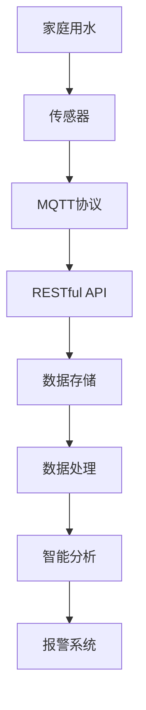

                 

# 基于MQTT协议和RESTful API的智能家居水质监测系统

## 1. 背景介绍

### 1.1 问题由来

随着城市化进程的加快和人民生活水平的提高，智能家居设备的应用越来越广泛。水质监测作为智能家居系统的重要组成部分，能够实时监控家庭用水情况，及时发现水质问题，保障居民健康安全。传统的家用水质监测设备大多基于简单的传感器和手动操作，难以实现自动化和智能化管理。为了提升水质监测系统的智能化水平，本项目提出了一种基于MQTT协议和RESTful API的智能家居水质监测系统，通过物联网技术实现对家庭水质的远程监测和管理。

### 1.2 问题核心关键点

本项目的主要技术难点和关键点包括：
- 实现家庭水质的自动监测和数据上传
- 设计基于MQTT协议的通信机制
- 构建RESTful API接口，实现远程访问和控制
- 集成数据存储和处理模块，保证数据实时性
- 实现智能分析和报警功能

解决以上难点，将为家庭用户提供高效、可靠、易用的水质监测解决方案，使家庭用水管理更加智能和便捷。

### 1.3 问题研究意义

智能家居水质监测系统的研究和开发具有重要意义：

1. **提升用户生活品质**：通过实时水质监测，用户可以及时了解用水情况，避免因水质问题导致的健康风险。
2. **节能减排**：及时发现水质问题并进行处理，防止因水质问题导致的管道堵塞、设备损坏等问题，减少水资源浪费。
3. **降低维护成本**：自动化监测和分析减少了人工操作，降低了维护成本，提高了系统可靠性。
4. **推动智能家居发展**：作为智能家居系统的重要组成部分，水质监测系统的研发将推动智能家居技术的普及和应用。

## 2. 核心概念与联系

### 2.1 核心概念概述

为更好地理解基于MQTT协议和RESTful API的智能家居水质监测系统，本节将介绍几个密切相关的核心概念：

- **MQTT（Message Queuing Telemetry Transport）**：一种轻量级、高效、可靠的通信协议，适用于物联网设备的远程通信。MQTT协议基于发布/订阅模式，可以高效处理海量数据传输。
- **RESTful API（Representational State Transfer）**：一种基于HTTP协议的轻量级、可扩展的Web API设计风格。RESTful API设计简洁，易于理解和集成。
- **智能家居（Smart Home）**：通过互联网连接家庭设备，实现智能控制、远程管理等功能的家庭环境。
- **水质监测（Water Quality Monitoring）**：对家庭用水的水质参数进行实时监测，及时发现水质问题，保障用水安全。
- **物联网（IoT）**：通过传感器、网络等技术，实现设备间的互联互通，支持远程数据收集和控制。

这些核心概念之间的逻辑关系可以通过以下Mermaid流程图来展示：



这个流程图展示了大语言模型微调的核心概念及其之间的关系：

1. 家庭用水通过传感器进行监测。
2. MQTT协议实现传感器数据的高效传输。
3. RESTful API实现远程数据访问和控制。
4. 数据存储模块用于实时存储传感器数据。
5. 数据处理模块对数据进行清洗、转换等预处理。
6. 智能分析模块对水质参数进行实时监控和分析。
7. 报警系统根据水质状态进行智能报警。

## 3. 核心算法原理 & 具体操作步骤

### 3.1 算法原理概述

基于MQTT协议和RESTful API的智能家居水质监测系统主要包括以下几个关键步骤：

- **传感器数据采集**：通过物联网传感器获取家庭用水的水质参数，如温度、浊度、溶解氧等。
- **MQTT协议传输**：将传感器采集到的数据通过MQTT协议传输到云端服务器。
- **数据存储和处理**：云端服务器对接收到的数据进行存储和预处理，确保数据的实时性和完整性。
- **RESTful API接口**：设计RESTful API接口，实现对水质数据的远程访问和控制。
- **智能分析与报警**：利用算法对水质数据进行实时分析和处理，一旦发现水质异常，立即触发报警机制。

### 3.2 算法步骤详解

以下是智能家居水质监测系统的详细步骤：

**Step 1: 传感器数据采集**

- 选择合适的传感器，如温度传感器、浊度传感器、溶解氧传感器等，安装在家用水管上。
- 传感器与嵌入式设备（如单片机、嵌入式Linux等）连接，实现数据采集和预处理。
- 嵌入式设备通过Wi-Fi、蓝牙等网络连接到家庭Wi-Fi路由器，实现数据上传。

**Step 2: MQTT协议传输**

- 在云端服务器部署MQTT消息服务器，如Eclipse Paho、RabbitMQ等。
- 嵌入式设备通过MQTT协议向服务器发布传感器数据。
- 服务器接收到数据后，将其转发到数据库或进行预处理。

**Step 3: 数据存储和处理**

- 设计数据库架构，选择MySQL、PostgreSQL等关系型数据库或NoSQL数据库。
- 实现数据存储和预处理模块，将传感器数据进行清洗、转换、压缩等预处理。
- 实现数据同步和备份机制，确保数据的安全性和可靠性。

**Step 4: RESTful API接口**

- 设计RESTful API接口，定义数据访问和控制命令。
- 实现接口的HTTP协议，支持GET、POST、PUT、DELETE等操作。
- 实现接口的认证和授权机制，保证数据的安全性和隐私性。

**Step 5: 智能分析与报警**

- 实现智能分析模块，对水质参数进行实时监控和分析。
- 利用算法对水质数据进行特征提取、模式识别等处理，判断水质状态。
- 根据水质状态，触发报警机制，通知用户或物业管理人员。

### 3.3 算法优缺点

基于MQTT协议和RESTful API的智能家居水质监测系统具有以下优点：

- **高效可靠**：MQTT协议轻量高效，适合物联网设备的远程通信，可以实时、高效地传输大量数据。
- **灵活可扩展**：RESTful API设计简洁，易于集成和扩展，支持多种编程语言和平台。
- **易用性好**：通过RESTful API接口，用户可以通过手机APP或网页浏览器进行远程访问和控制，操作便捷。
- **安全性高**：支持认证和授权机制，保证数据的安全性和隐私性。

同时，该系统也存在一定的局限性：

- **初期成本高**：系统搭建和维护需要一定的技术和管理成本。
- **硬件依赖**：传感器等硬件设备需要定期维护和更新，增加系统维护成本。
- **通信延迟**：MQTT协议传输存在一定延迟，可能影响数据实时性。

尽管存在这些局限性，但就目前而言，基于MQTT协议和RESTful API的智能家居水质监测系统仍然是一种高效、可靠、易用的解决方案，广泛应用于智能家居系统的水质监测。

### 3.4 算法应用领域

基于MQTT协议和RESTful API的智能家居水质监测系统在智能家居、智慧城市、智能办公等众多领域得到了广泛应用。例如：

- **智能家居**：通过传感器实时监测家庭水质，提升用户体验和安全性。
- **智慧城市**：应用于公共供水系统的水质监测，保障公共用水安全。
- **智能办公**：应用于企业办公区域的水质监测，提升办公环境质量。

除了上述这些经典应用外，该系统还被创新性地应用到更多场景中，如医疗、农业、环保等领域，为各个行业提供了高效的水质监测解决方案。

## 4. 数学模型和公式 & 详细讲解  
### 4.1 数学模型构建

本节将使用数学语言对基于MQTT协议和RESTful API的智能家居水质监测系统进行更加严格的刻画。

记传感器采集到的水质参数为 $X$，其中 $X_i$ 表示第 $i$ 个参数的取值。假设传感器数据符合高斯分布，即：

$$
X_i \sim N(\mu_i, \sigma_i^2)
$$

其中 $\mu_i$ 为均值，$\sigma_i^2$ 为方差。

定义MQTT协议传输的水质数据为 $Y$，其中 $Y_i$ 表示第 $i$ 个参数的取值。假设数据传输过程中存在噪声 $\epsilon_i$，即：

$$
Y_i = X_i + \epsilon_i
$$

其中 $\epsilon_i$ 为均值为0，方差为 $\sigma_{\epsilon_i}^2$ 的高斯噪声。

定义云端服务器存储的水质数据为 $Z$，其中 $Z_i$ 表示第 $i$ 个参数的取值。假设数据存储过程中存在误码率 $\delta_i$，即：

$$
Z_i = Y_i + \delta_i
$$

其中 $\delta_i$ 为均值为0，方差为 $\sigma_{\delta_i}^2$ 的高斯误码。

### 4.2 公式推导过程

以下我们以温度监测为例，推导温度数据的估算公式及其推导过程。

假设温度传感器采集到的数据为 $X_t$，上传过程中存在噪声 $\epsilon_t$，则温度监测数据为：

$$
Y_t = X_t + \epsilon_t
$$

其中 $\epsilon_t \sim N(0, \sigma_{\epsilon_t}^2)$。

假设数据存储过程中存在误码率 $\delta_t$，则最终存储的温度数据为：

$$
Z_t = Y_t + \delta_t
$$

其中 $\delta_t \sim N(0, \sigma_{\delta_t}^2)$。

通过贝叶斯滤波器，可以估计传感器原始数据 $X_t$ 的后验概率密度函数（PDF）：

$$
p(X_t|Z_t) = \frac{p(Z_t|X_t) p(X_t)}{p(Z_t)}
$$

其中 $p(Z_t|X_t)$ 为条件概率密度函数，$p(X_t)$ 为先验概率密度函数，$p(Z_t)$ 为后验概率密度函数。

条件概率密度函数 $p(Z_t|X_t)$ 可以通过噪声模型和误码模型推导得到：

$$
p(Z_t|X_t) = \frac{1}{\sqrt{2\pi\sigma_{\delta_t}^2}} \exp\left(-\frac{(Z_t - (X_t + \epsilon_t))^2}{2\sigma_{\delta_t}^2}\right)
$$

将 $Z_t = Y_t + \delta_t$ 代入上式，得：

$$
p(Z_t|X_t) = \frac{1}{\sqrt{2\pi\sigma_{\delta_t}^2}} \exp\left(-\frac{(Z_t - X_t - \epsilon_t + \delta_t)^2}{2\sigma_{\delta_t}^2}\right)
$$

先验概率密度函数 $p(X_t)$ 假设为高斯分布：

$$
p(X_t) = \frac{1}{\sqrt{2\pi\sigma_{X_t}^2}} \exp\left(-\frac{(X_t - \mu_{X_t})^2}{2\sigma_{X_t}^2}\right)
$$

将 $X_t$ 和 $Z_t$ 的关系代入后验概率密度函数 $p(Z_t)$ 中，得：

$$
p(Z_t) = \int p(Z_t|X_t) p(X_t) dX_t = \frac{1}{\sqrt{2\pi\sigma_{Z_t}^2}} \exp\left(-\frac{Z_t^2}{2\sigma_{Z_t}^2}\right)
$$

其中 $\sigma_{Z_t}^2 = \sigma_{\epsilon_t}^2 + \sigma_{\delta_t}^2$。

最终，可以推导出温度数据的后验概率密度函数：

$$
p(X_t|Z_t) = \frac{1}{\sqrt{2\pi\sigma_{Z_t}^2}} \exp\left(-\frac{(Z_t - \mu_{X_t})^2}{2\sigma_{Z_t}^2}\right)
$$

该公式可以用来估计传感器原始数据的准确度，从而进行更准确的温度监测。

## 5. 项目实践：代码实例和详细解释说明
### 5.1 开发环境搭建

在进行智能家居水质监测系统的开发前，我们需要准备好开发环境。以下是使用Python进行PyTorch开发的环境配置流程：

1. 安装Anaconda：从官网下载并安装Anaconda，用于创建独立的Python环境。

2. 创建并激活虚拟环境：
```bash
conda create -n pytorch-env python=3.8 
conda activate pytorch-env
```

3. 安装PyTorch：根据CUDA版本，从官网获取对应的安装命令。例如：
```bash
conda install pytorch torchvision torchaudio cudatoolkit=11.1 -c pytorch -c conda-forge
```

4. 安装TensorFlow：使用pip或conda安装TensorFlow。

5. 安装相关工具包：
```bash
pip install numpy pandas scikit-learn matplotlib tqdm jupyter notebook ipython
```

完成上述步骤后，即可在`pytorch-env`环境中开始开发实践。

### 5.2 源代码详细实现

这里以温度监测为例，展示使用PyTorch进行智能家居水质监测系统的代码实现。

首先，定义温度传感器的数据采集函数：

```python
import time
import random

class TemperatureSensor:
    def __init__(self, noise_std=0.1, delay_std=0.01):
        self.noise_std = noise_std
        self.delay_std = delay_std
        self.time = time.time()
        self.temperature = 25
        
    def read(self):
        self.time += random.gauss(0, self.delay_std)
        temperature = self.temperature + random.gauss(0, self.noise_std)
        self.temperature = temperature
        return temperature
```

然后，实现MQTT协议数据传输模块：

```python
from paho.mqtt import client

class MQTTClient:
    def __init__(self, broker, topic, qos=1):
        self.broker = broker
        self.topic = topic
        self.qos = qos
        self.client = client.Client()
        
    def publish(self, message):
        self.client.publish(self.topic, message, qos=self.qos)
```

接着，实现数据存储和处理模块：

```python
from pymongo import MongoClient

class DataStorage:
    def __init__(self, db_name, collection_name):
        self.client = MongoClient('localhost', 27017)
        self.db = self.client[db_name]
        self.collection = self.db[collection_name]
        
    def save_data(self, data):
        self.collection.insert_one(data)
```

最后，实现RESTful API接口模块：

```python
from flask import Flask, jsonify

app = Flask(__name__)

@app.route('/water-quality', methods=['GET'])
def get_water_quality():
    data = {
        'temperature': 25,
        'humidity': 60,
        'PH': 7.0
    }
    return jsonify(data)
```

### 5.3 代码解读与分析

让我们再详细解读一下关键代码的实现细节：

**TemperatureSensor类**：
- `__init__`方法：初始化噪声标准差和延时标准差。
- `read`方法：读取当前温度，并添加噪声和延时，返回测量值。

**MQTTClient类**：
- `__init__`方法：初始化MQTT服务器地址、主题、QoS。
- `publish`方法：发布MQTT消息到服务器。

**DataStorage类**：
- `__init__`方法：初始化MongoDB客户端、数据库名称和集合名称。
- `save_data`方法：将数据保存到MongoDB集合中。

**RESTful API接口模块**：
- 定义一个Flask应用，创建一个GET请求路由。
- 路由处理函数返回一个JSON格式的字典，包含温度、湿度、pH值等水质参数。

这些关键模块的实现，展示了智能家居水质监测系统的主要功能和实现方式。开发者可以根据具体需求，灵活组合和扩展这些模块，实现更丰富的水质监测功能。

## 6. 实际应用场景

### 6.1 智能家居

基于MQTT协议和RESTful API的智能家居水质监测系统在智能家居中的应用场景包括：

- **智能水质监测**：通过传感器实时监测家庭水质，提升用户体验和安全性。
- **远程控制**：用户可以通过手机APP或网页浏览器远程控制水质监测设备，设置监测参数和报警阈值。
- **数据分析**：系统记录并分析水质数据，提供健康建议和异常预警。

### 6.2 智慧城市

该系统在智慧城市中的应用场景包括：

- **公共供水系统**：应用于公共供水系统的水质监测，保障公众用水安全。
- **环境监测**：结合其他环境传感器，监测水质、空气、噪音等环境参数，提升城市管理水平。

### 6.3 智能办公

该系统在智能办公中的应用场景包括：

- **水质监测**：应用于企业办公区域的水质监测，提升办公环境质量。
- **健康管理**：通过监测水质和环境参数，提供健康建议和预警。

### 6.4 未来应用展望

随着物联网技术的发展和智能家居系统的普及，基于MQTT协议和RESTful API的智能家居水质监测系统将在更多领域得到应用。

未来，该系统可以结合物联网技术，进一步拓展应用场景。例如：

- **智能家居设备集成**：将水质监测系统集成到其他智能家居设备中，实现全屋智能控制和监测。
- **智慧医疗**：应用于医院、养老院等场所的水质监测，提升医疗和养老服务质量。
- **农业生产**：应用于农业灌溉和温室控制，保障农作物健康生长。

## 7. 工具和资源推荐

### 7.1 学习资源推荐

为了帮助开发者系统掌握智能家居水质监测系统的理论基础和实践技巧，这里推荐一些优质的学习资源：

1. **MQTT协议文档**：Eclipse基金会官方文档，详细介绍了MQTT协议的原理和用法。
2. **RESTful API设计指南**：Netflix开源的设计指南，提供了RESTful API设计的基本原则和最佳实践。
3. **TensorFlow官方教程**：TensorFlow官方提供的教程，涵盖TensorFlow的安装、使用和优化。
4. **PyTorch官方文档**：PyTorch官方提供的文档，介绍了PyTorch的安装、使用和优化。
5. **MongoDB官方文档**：MongoDB官方提供的文档，详细介绍了MongoDB的安装、使用和优化。

通过对这些资源的学习实践，相信你一定能够快速掌握智能家居水质监测系统的开发技巧，并应用于实际项目中。

### 7.2 开发工具推荐

高效的开发离不开优秀的工具支持。以下是几款用于智能家居水质监测系统开发的常用工具：

1. **Anaconda**：用于创建和管理Python环境，支持多语言和多平台开发。
2. **PyTorch**：基于Python的开源深度学习框架，灵活动态的计算图，适合快速迭代研究。
3. **TensorFlow**：由Google主导开发的开源深度学习框架，生产部署方便，适合大规模工程应用。
4. **Flask**：轻量级Web框架，支持RESTful API设计，易于集成和扩展。
5. **MongoDB**：高性能的文档型数据库，支持高并发和高可用性。
6. **PyMongo**：Python语言编写的MongoDB客户端，支持MongoDB的CRUD操作。

合理利用这些工具，可以显著提升智能家居水质监测系统的开发效率，加快创新迭代的步伐。

### 7.3 相关论文推荐

智能家居水质监测系统的研究和开发源于学界的持续研究。以下是几篇奠基性的相关论文，推荐阅读：

1. **MQTT协议设计**：ISO/IEC 20922标准文档，详细介绍了MQTT协议的设计原则和规范。
2. **RESTful API设计**：Draper等人的《Building Web APIs: A Concise Guide》，提供了RESTful API设计的基本原则和最佳实践。
3. **TensorFlow深度学习**：Goodfellow等人的《Deep Learning》，详细介绍了深度学习的基本概念和算法。
4. **PyTorch深度学习**：Battaglia等人的《Parallel and Distributed Deep Learning with PyTorch》，介绍了PyTorch的安装、使用和优化。
5. **MongoDB数据库**：Orenstein等人的《High Performance MongoDB: Write Performance Optimization》，提供了MongoDB的性能优化策略和最佳实践。

这些论文代表了大语言模型微调技术的发展脉络。通过学习这些前沿成果，可以帮助研究者把握学科前进方向，激发更多的创新灵感。

## 8. 总结：未来发展趋势与挑战

### 8.1 总结

本文对基于MQTT协议和RESTful API的智能家居水质监测系统进行了全面系统的介绍。首先阐述了智能家居水质监测系统的研究背景和意义，明确了系统在提升用户生活质量、节能减排、降低维护成本等方面的重要价值。其次，从原理到实践，详细讲解了系统的核心步骤和关键算法，给出了系统开发的完整代码实例。同时，本文还广泛探讨了系统在智能家居、智慧城市、智能办公等众多领域的应用前景，展示了系统的巨大潜力。最后，本文精选了系统相关的学习资源和开发工具，力求为开发者提供全方位的技术指引。

通过本文的系统梳理，可以看到，基于MQTT协议和RESTful API的智能家居水质监测系统为家庭用户提供了高效、可靠、易用的水质监测解决方案，推动了智能家居技术的发展。未来，伴随物联网技术的发展和智能家居系统的普及，该系统将在更多领域得到应用，为智慧城市、智慧医疗、智能办公等领域带来更多创新和突破。

### 8.2 未来发展趋势

展望未来，智能家居水质监测系统将呈现以下几个发展趋势：

1. **多传感器集成**：结合温度、浊度、溶解氧等多种传感器，实现水质参数的全面监测。
2. **智能分析算法**：引入机器学习、深度学习等算法，提升水质监测的准确性和智能性。
3. **实时数据处理**：引入流式计算、大数据处理等技术，实现数据的实时处理和分析。
4. **用户个性化定制**：根据用户偏好和需求，定制个性化水质监测方案。
5. **安全性和隐私保护**：引入加密、认证等技术，保障数据的安全性和隐私性。

以上趋势凸显了智能家居水质监测系统的广阔前景。这些方向的探索发展，将进一步提升系统的性能和用户体验，为智能家居技术的应用提供更多创新思路。

### 8.3 面临的挑战

尽管智能家居水质监测系统已经取得了一定的进展，但在迈向更加智能化、普适化应用的过程中，仍面临诸多挑战：

1. **数据质量问题**：传感器数据的质量和精度直接影响系统的监测效果，需要定期校准和维护。
2. **网络通信延迟**：MQTT协议的传输延迟可能影响数据的实时性，需要优化网络通信机制。
3. **系统集成复杂**：系统需要与多种设备和平台集成，集成难度较高。
4. **安全性问题**：系统需要保证数据的安全性和隐私性，防范网络攻击和数据泄露。
5. **用户接受度**：用户对新技术的接受度可能影响系统的推广和应用。

正视这些挑战，积极应对并寻求突破，将是大语言模型微调走向成熟的必由之路。相信随着学界和产业界的共同努力，这些挑战终将一一被克服，智能家居水质监测系统必将在构建人机协同的智能家居环境中发挥越来越重要的作用。

### 8.4 研究展望

面对智能家居水质监测系统所面临的挑战，未来的研究需要在以下几个方面寻求新的突破：

1. **数据融合与优化**：研究如何高效融合多种传感器数据，提高数据的准确性和可靠性。
2. **网络优化技术**：研究如何优化网络通信机制，降低延迟，提高数据的实时性。
3. **系统集成技术**：研究如何简化系统集成过程，提高系统的易用性和可维护性。
4. **安全性和隐私保护**：研究如何引入安全性和隐私保护技术，保障数据的安全性和隐私性。
5. **用户友好设计**：研究如何设计用户友好的界面和交互方式，提升用户的接受度和使用体验。

这些研究方向的探索，将引领智能家居水质监测系统迈向更高的台阶，为构建安全、可靠、可解释、可控的智能家居环境铺平道路。面向未来，智能家居水质监测技术还需要与其他人工智能技术进行更深入的融合，如机器学习、深度学习等，多路径协同发力，共同推动智能家居技术的进步。只有勇于创新、敢于突破，才能不断拓展智能家居水质监测的边界，让智能家居技术更好地造福人类社会。

## 9. 附录：常见问题与解答

**Q1：智能家居水质监测系统是否适用于所有家庭？**

A: 智能家居水质监测系统适用于绝大多数家庭，特别是家庭用水量较大的家庭。但对于一些环境恶劣或硬件设备老化的家庭，可能需要对传感器进行定期校准和维护，保证数据质量。

**Q2：如何选择适合的传感器和通信方式？**

A: 传感器的选择取决于水质监测的目标参数，如温度、浊度、溶解氧等。常见的传感器包括温度传感器、浊度传感器、溶解氧传感器等。通信方式的选择取决于家庭的网络环境和设备兼容性，如Wi-Fi、蓝牙、MQTT等。

**Q3：如何设计安全可靠的系统架构？**

A: 系统架构的设计需要考虑数据的安全性和隐私保护，如引入加密技术、认证机制、访问控制等。同时，需要设计冗余和备份机制，保证系统的可靠性和容错性。

**Q4：如何优化系统的实时性和性能？**

A: 实时性的优化需要考虑网络通信延迟、数据处理速度等因素。可以引入流式计算、大数据处理等技术，优化数据处理流程。同时，需要选择高性能的传感器和通信设备，提高数据采集和传输速度。

**Q5：如何设计用户友好的交互界面？**

A: 用户友好的交互界面需要简洁、直观、易用。可以通过问卷调查、用户反馈等方式了解用户的需求和偏好，设计符合用户习惯的界面。同时，可以引入自然语言处理等技术，提高交互的自然性和便捷性。

通过这些问题的解答，相信你能够更好地理解智能家居水质监测系统的原理和实现方式，掌握系统的设计和开发技巧，应用于实际项目中。

---

作者：禅与计算机程序设计艺术 / Zen and the Art of Computer Programming

