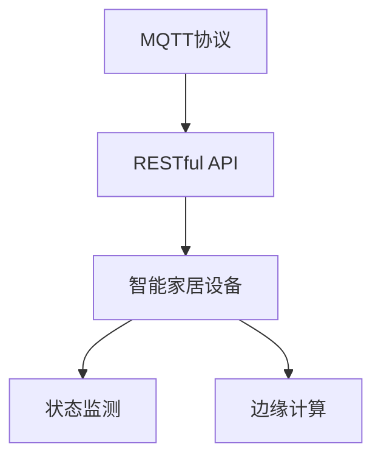

                 

# 基于MQTT协议和RESTful API的智能家居设备状态监测

> 关键词：智能家居、状态监测、MQTT协议、RESTful API、物联网、传感器网络、实时数据传输、智能控制、边缘计算

## 1. 背景介绍

### 1.1 问题由来

在信息化时代，智能家居系统已成为现代家庭生活的重要组成部分。智能家居通过物联网技术将家中的各种设备和传感器互联，实现对家居环境的智能化控制和管理。然而，传统的智能家居系统往往依赖于中心化的云平台进行数据存储和处理，存在一定的延迟和安全性问题。同时，这些系统往往缺乏实时数据监测能力，难以提供用户所需的实时环境信息。

基于此，本文提出一种基于MQTT协议和RESTful API的智能家居设备状态监测方案，以实现设备状态的实时采集和智能控制。该方案通过MQTT协议构建设备间的轻量级通信网络，再通过RESTful API将设备状态数据传输到云平台进行存储和分析。该方案旨在提供更加实时、安全和高效的家庭环境监测解决方案，满足用户对智能家居的更高需求。

### 1.2 问题核心关键点

本方案的核心在于通过MQTT协议实现设备间轻量级通信，利用RESTful API传输设备状态数据到云平台，从而实现智能家居设备的实时监测和控制。具体关键点包括：

- MQTT协议：一种轻量级的消息队列传输协议，适用于IoT设备之间的数据传输，支持高效、低延迟的通信。
- RESTful API：一种基于HTTP协议的Web服务架构，支持数据传输和跨平台访问，便于云平台存储和处理。
- 边缘计算：一种在网络边缘进行的计算和数据处理技术，能够提升数据传输效率和系统可靠性，减少云平台负载。

## 2. 核心概念与联系

### 2.1 核心概念概述

本节将介绍几个与本方案密切相关的核心概念：

- MQTT协议：一种基于发布/订阅模式的通信协议，适用于IoT设备之间的消息传输。其特点包括轻量级、低延迟、易于实现等。
- RESTful API：一种基于HTTP协议的Web服务架构，支持数据传输和跨平台访问。RESTful API的设计理念包括无状态、统一接口、分层系统等。
- 智能家居设备：具有智能功能的家居设备，如智能照明、智能温控、智能安防等。
- 状态监测：通过传感器等设备实时采集环境信息，并通过通信协议传输到中心系统进行处理和分析的过程。
- 边缘计算：一种在网络边缘进行的计算和数据处理技术，能够提升数据传输效率和系统可靠性，减少云平台负载。

这些核心概念之间的逻辑关系可以通过以下Mermaid流程图来展示：



这个流程图展示了大语言模型的核心概念及其之间的关系：

1. MQTT协议提供设备间的轻量级通信，支持高效、低延迟的数据传输。
2. RESTful API将设备状态数据传输到云平台，实现数据存储和分析。
3. 智能家居设备通过状态监测实时采集环境信息，并提供给云平台进行处理。
4. 边缘计算在网络边缘进行数据处理，提升系统效率和可靠性。

这些概念共同构成了智能家居设备状态监测的技术框架，使得设备间的通信和数据传输更加高效、可靠。

## 3. 核心算法原理 & 具体操作步骤

### 3.1 算法原理概述

本方案的核心算法原理基于MQTT协议和RESTful API，通过构建设备间的轻量级通信网络，实现设备状态的实时采集和传输。具体步骤如下：

1. 设备间通过MQTT协议建立连接，实现轻量级、高效的数据传输。
2. 通过RESTful API将设备状态数据传输到云平台进行存储和分析。
3. 云平台实时监测设备状态，并通过RESTful API向设备发送控制命令，实现智能家居设备的实时控制。

### 3.2 算法步骤详解

以下是基于MQTT协议和RESTful API的智能家居设备状态监测算法详细步骤：

**Step 1: MQTT协议搭建设备通信网络**

1. 设备初始化MQTT客户端，连接到MQTT服务器。
2. 设置MQTT客户端的主题和订阅主题。
3. 发送MQTT消息到主题，接收MQTT消息到订阅主题。

**Step 2: RESTful API传输设备状态数据**

1. 设备通过HTTP请求将状态数据传输到RESTful API服务端。
2. RESTful API服务端接收到请求，将数据保存到数据库中。
3. RESTful API服务端通过HTTP响应将状态数据传输回设备。

**Step 3: 边缘计算处理实时数据**

1. 在网络边缘部署边缘计算节点，对设备状态数据进行处理。
2. 边缘计算节点实时分析设备状态数据，生成报警信息或控制命令。
3. 边缘计算节点将报警信息或控制命令传输到云平台，实现智能控制。

### 3.3 算法优缺点

基于MQTT协议和RESTful API的智能家居设备状态监测方法具有以下优点：

1. 轻量高效。MQTT协议具有低延迟、轻量级、易于实现的特点，适合IoT设备间的通信。
2. 可扩展性强。RESTful API支持跨平台访问和数据传输，便于在不同设备间进行数据共享和处理。
3. 实时性好。通过边缘计算节点实时分析数据，能够快速响应设备状态变化，提升系统响应速度。
4. 可靠性高。通过MQTT协议和RESTful API的双重传输机制，提升了数据传输的可靠性，减少了传输过程中数据丢失的风险。

同时，该方法也存在一定的局限性：

1. 对网络环境要求高。MQTT协议和RESTful API的性能受网络环境影响较大，网络不稳定可能导致数据传输失败。
2. 数据存储压力大。RESTful API服务端需要保存大量设备状态数据，对存储资源的消耗较大。
3. 安全性有待加强。通过互联网传输数据存在一定的安全隐患，可能被拦截或篡改。

尽管存在这些局限性，但就目前而言，基于MQTT协议和RESTful API的智能家居设备状态监测方法仍是最主流范式。未来相关研究的重点在于如何进一步提高数据传输的可靠性、提升系统的实时性、增强数据的安全性等，以更好地满足智能家居的需求。

### 3.4 算法应用领域

基于MQTT协议和RESTful API的智能家居设备状态监测方法在智能家居领域得到了广泛应用，具体如下：

- 智能照明系统：通过传感器监测环境光照强度，并通过MQTT协议和RESTful API实时控制灯光亮度、颜色等。
- 智能温控系统：通过传感器监测环境温度，并通过MQTT协议和RESTful API实时控制空调、暖气等设备。
- 智能安防系统：通过传感器监测环境安全情况，并通过MQTT协议和RESTful API实时控制门锁、摄像头等设备。
- 智能家居自动化：通过传感器监测用户行为，并通过MQTT协议和RESTful API实时控制家电设备，实现自动化场景。
- 智能家庭健康：通过传感器监测环境湿度、空气质量等，并通过MQTT协议和RESTful API实时控制空气净化器、加湿器等设备。

除了上述这些典型应用外，基于MQTT协议和RESTful API的智能家居设备状态监测方法，还可以应用于更多场景中，如智能窗帘、智能门锁、智能家电等，为智能家居的发展带来新的突破。

## 4. 数学模型和公式 & 详细讲解

### 4.1 数学模型构建

本节将使用数学语言对基于MQTT协议和RESTful API的智能家居设备状态监测过程进行更加严格的刻画。

记智能家居设备状态为 $x_t$，其中 $t$ 为时间，设备状态数据包括光照强度、温度、湿度、位置、开关状态等。设 $X$ 为智能家居设备状态空间，$\mathcal{X}$ 为设备状态数据空间，$Y$ 为控制命令空间，$\mathcal{Y}$ 为控制命令数据空间。

定义设备状态监测的采样函数 $f: \mathcal{X} \rightarrow \mathcal{Y}$，将设备状态数据 $x_t$ 映射为控制命令 $y_t$。设设备状态监测的时间步长为 $\Delta t$，则监测的连续状态为 $x_{t+\Delta t}$。

### 4.2 公式推导过程

以下我们以智能照明系统为例，推导基于MQTT协议和RESTful API的状态监测和控制流程。

1. **状态监测**
   设 $x_t = (L_t, T_t, H_t)$，其中 $L_t$ 为光照强度，$T_t$ 为环境温度，$H_t$ 为环境湿度。通过传感器采集设备状态数据，并通过MQTT协议将数据传输到RESTful API服务端。

   2. **状态分析**
   通过RESTful API服务端对设备状态数据进行处理，生成控制命令 $y_t$。例如，当光照强度低于预设阈值时，生成控制命令使灯光亮起。

   3. **状态控制**
   RESTful API服务端通过MQTT协议将控制命令 $y_t$ 传输回设备，并控制设备执行相应的操作。例如，当接收到控制命令使灯光亮起时，设备执行打开灯具的操作。

   将上述过程用数学公式表示，得到：

   $$
   \begin{aligned}
   y_t &= f(x_t) = 
   \begin{cases}
   1, & L_t < L_{\text{threshold}} \\
   0, & \text{otherwise}
   \end{cases}
   \end{aligned}
   $$

   其中 $L_{\text{threshold}}$ 为光照强度阈值。

### 4.3 案例分析与讲解

**智能温控系统**：通过传感器监测环境温度 $T_t$，并通过MQTT协议和RESTful API实时控制空调、暖气等设备。假设当前温度高于预设阈值时，生成控制命令使空调开启。

**智能安防系统**：通过传感器监测环境安全情况，并通过MQTT协议和RESTful API实时控制门锁、摄像头等设备。假设当监测到非法入侵时，生成控制命令使门锁锁定、摄像头开启。

以上案例展示了基于MQTT协议和RESTful API的智能家居设备状态监测和控制流程，通过实时监测设备状态并根据需要进行智能控制，实现了智能家居系统的智能化和自动化。

## 5. 项目实践：代码实例和详细解释说明

### 5.1 开发环境搭建

在进行智能家居设备状态监测实践前，我们需要准备好开发环境。以下是使用Python进行MQTT和RESTful API开发的环境配置流程：

1. 安装Anaconda：从官网下载并安装Anaconda，用于创建独立的Python环境。

2. 创建并激活虚拟环境：
```bash
conda create -n MQTT-REST-env python=3.8 
conda activate MQTT-REST-env
```

3. 安装MQTT和RESTful API相关的库：
```bash
pip install paho-mqtt Flask Flask-RESTful
```

4. 安装MQTT和RESTful API客户端和服务器：
```bash
pip install paho-mqtt
pip install flask
pip install flask-restful
```

完成上述步骤后，即可在`MQTT-REST-env`环境中开始智能家居设备状态监测的开发实践。

### 5.2 源代码详细实现

以下是基于MQTT协议和RESTful API的智能家居设备状态监测的PyTorch代码实现。

首先，定义MQTT客户端和RESTful API服务端：

```python
from paho.mqtt.client import Client
from flask import Flask, request
from flask_restful import Resource, Api

# MQTT客户端
mqtt_client = Client('mqtt.broker.com', 1883)

# RESTful API服务端
app = Flask(__name__)
api = Api(app)

# MQTT订阅主题
mqtt_client.subscribe('light/sensor')

# RESTful API接口
class LightControl(Resource):
    def get(self):
        # 获取光照强度
        light_level = float(request.args.get('level', default=0.0))
        # 控制灯光亮度
        if light_level > 0.5:
            mqtt_client.publish('light/control', 'on')
        else:
            mqtt_client.publish('light/control', 'off')

# 初始化RESTful API接口
api.add_resource(LightControl, '/light/control')

# MQTT客户端连接
def on_connect(client, userdata, flags, rc):
    print(f'Connected with result code {rc}')
    # 订阅MQTT主题
    mqtt_client.subscribe('light/sensor')

# MQTT客户端处理消息
def on_message(client, userdata, msg):
    print(f'Received message: {msg.payload.decode()}')

# MQTT客户端连接断开
def on_disconnect(client, userdata, rc):
    print(f'Disconnected with result code {rc}')

# MQTT客户端消息处理
def on_publish(client, userdata, mid):
    print(f'Message published')

# MQTT客户端订阅消息
def on_subscribe(client, userdata, mid, granted_qos):
    print(f'Subscribed to message {msg.payload.decode()}')

# MQTT客户端取消订阅
def on_unsubscribe(client, userdata, mid):
    print(f'Unsubscribed from message {msg.payload.decode()}')

# MQTT客户端断开连接
def on_log(client, userdata, level, buf):
    print(f'Logged: {buf}')

# MQTT客户端事件处理
mqtt_client.on_connect = on_connect
mqtt_client.on_message = on_message
mqtt_client.on_disconnect = on_disconnect
mqtt_client.on_publish = on_publish
mqtt_client.on_subscribe = on_subscribe
mqtt_client.on_unsubscribe = on_unsubscribe
mqtt_client.on_log = on_log

# MQTT客户端启动
mqtt_client.loop_start()
```

然后，启动RESTful API服务端：

```python
# RESTful API服务端启动
if __name__ == '__main__':
    app.run(host='0.0.0.0', port=5000)
```

最后，启动MQTT客户端：

```python
# MQTT客户端启动
if __name__ == '__main__':
    mqtt_client.connect('mqtt.broker.com', 1883, 60)
    mqtt_client.loop_forever()
```

### 5.3 代码解读与分析

让我们再详细解读一下关键代码的实现细节：

**MQTT客户端**：
- `on_connect`方法：建立MQTT连接，并订阅`light/sensor`主题。
- `on_message`方法：处理接收到的MQTT消息，并根据消息内容生成控制命令。
- `on_disconnect`方法：MQTT连接断开时触发。
- `on_publish`方法：处理MQTT消息发布。
- `on_subscribe`方法：处理MQTT主题订阅。
- `on_unsubscribe`方法：处理MQTT主题取消订阅。
- `on_log`方法：处理MQTT日志信息。

**RESTful API服务端**：
- `LightControl`类：定义RESTful API接口，支持灯光控制。
- `get`方法：处理灯光控制请求，根据光照强度控制灯光亮度。
- `app.run`方法：启动RESTful API服务端，并监听5000端口。

**MQTT客户端启动**：
- `connect`方法：建立MQTT连接，参数包括broker地址、端口和超时时间。
- `loop_forever`方法：启动MQTT客户端，持续监听消息。

可以看到，MQTT客户端和RESTful API服务端的实现过程相对简洁，但需要注意代码中的事件处理函数和方法调用。

## 6. 实际应用场景

### 6.1 智能照明系统

基于MQTT协议和RESTful API的智能家居设备状态监测，可以广泛应用于智能照明系统的构建。传统照明系统依赖人工手动开关，效率低下且不便。智能照明系统通过传感器监测环境光照强度，并通过MQTT协议和RESTful API实时控制灯光亮度、颜色等，实现了更加智能化和自动化的照明解决方案。

在技术实现上，可以部署传感器节点监测光照强度，并通过MQTT协议将数据传输到RESTful API服务端。RESTful API服务端通过分析数据，生成灯光控制命令，并通过MQTT协议将命令传输回设备，控制灯具亮度和颜色。用户通过移动设备访问RESTful API接口，即可实现灯光的智能控制。

### 6.2 智能温控系统

智能温控系统通过传感器监测环境温度，并通过MQTT协议和RESTful API实时控制空调、暖气等设备。用户通过移动设备访问RESTful API接口，即可实现温度的智能控制。

在技术实现上，可以部署传感器节点监测环境温度，并通过MQTT协议将数据传输到RESTful API服务端。RESTful API服务端通过分析数据，生成空调控制命令，并通过MQTT协议将命令传输回设备，控制空调开关和温度。用户通过移动设备访问RESTful API接口，即可实现温度的智能控制。

### 6.3 智能安防系统

智能安防系统通过传感器监测环境安全情况，并通过MQTT协议和RESTful API实时控制门锁、摄像头等设备。用户通过移动设备访问RESTful API接口，即可实现安全监控和报警。

在技术实现上，可以部署传感器节点监测环境安全情况，并通过MQTT协议将数据传输到RESTful API服务端。RESTful API服务端通过分析数据，生成门锁和摄像头控制命令，并通过MQTT协议将命令传输回设备，控制门锁开关和摄像头状态。用户通过移动设备访问RESTful API接口，即可实现安全监控和报警。

### 6.4 未来应用展望

随着IoT技术的不断发展，基于MQTT协议和RESTful API的智能家居设备状态监测方法将在更多领域得到应用，为人们的生活带来更多便利和智能体验。

在智慧医疗领域，基于MQTT协议和RESTful API的智能家居设备状态监测方法可以应用于病床监控、智能药房等，提升医疗服务的智能化水平。

在智慧办公领域，基于MQTT协议和RESTful API的智能家居设备状态监测方法可以应用于会议控制、智能办公桌等，提升办公效率和舒适度。

在智慧旅游领域，基于MQTT协议和RESTful API的智能家居设备状态监测方法可以应用于景区监控、智能酒店等，提升旅游体验和安全性。

此外，在智能交通、智能农业、智能家居等多个领域，基于MQTT协议和RESTful API的智能家居设备状态监测方法都将发挥重要作用，为智慧社会的建设提供坚实的基础。

## 7. 工具和资源推荐

### 7.1 学习资源推荐

为了帮助开发者系统掌握基于MQTT协议和RESTful API的智能家居设备状态监测的理论基础和实践技巧，这里推荐一些优质的学习资源：

1. MQTT协议官方文档：详细介绍了MQTT协议的工作原理、消息格式、QoS等关键概念。
2. RESTful API相关书籍：如《RESTful Web APIs》等，介绍了RESTful API的设计原则、实现方法、开发工具等。
3. 智能家居技术博客：如IoT Now、TechCrunch等，涵盖大量智能家居技术和应用案例。
4. MQTT和RESTful API开源项目：如eclipse/paho-mqtt、pypi/Flask等，提供了丰富的开源代码和工具支持。
5. 智能家居开发社区：如IoT Stack、SmartThings等，汇聚了大量智能家居开发者和应用案例。

通过对这些资源的学习实践，相信你一定能够快速掌握基于MQTT协议和RESTful API的智能家居设备状态监测的精髓，并用于解决实际的智能家居问题。

### 7.2 开发工具推荐

高效的开发离不开优秀的工具支持。以下是几款用于MQTT协议和RESTful API开发常用的工具：

1. EclipseMQTT：一个开源的MQTT客户端和服务器，支持各种平台，易于使用。
2. Home Assistant：一个开源的智能家居自动化平台，支持多种智能家居设备和MQTT协议。
3. Flask：一个轻量级的Python Web框架，支持RESTful API开发。
4. RESTful API设计工具：如Postman、Swagger等，支持API设计和测试。
5. MQTT消息发布工具：如mosquitto、QoT等，支持MQTT消息的发布和订阅。

合理利用这些工具，可以显著提升MQTT协议和RESTful API开发的效率，加快创新迭代的步伐。

### 7.3 相关论文推荐

基于MQTT协议和RESTful API的智能家居设备状态监测技术源于学界的持续研究。以下是几篇奠基性的相关论文，推荐阅读：

1. MQTT协议原论文：IETF（Internet Engineering Task Force）发布的MQTT协议标准文档。
2. RESTful API设计原则：Roy Fielding教授在2007年发表的《REST架构风格》论文，介绍了RESTful API的设计原则和实现方法。
3. IoT数据管理与分析：一篇综述性论文，介绍了物联网数据的采集、存储和分析技术，涵盖MQTT协议和RESTful API的应用。
4. 智能家居系统架构：一篇学术论文，介绍了智能家居系统的架构和实现方法，包括MQTT协议和RESTful API的应用。
5. 边缘计算在智能家居中的应用：一篇综述性论文，介绍了边缘计算在智能家居中的应用，包括MQTT协议和RESTful API的应用。

这些论文代表了大语言模型微调技术的发展脉络。通过学习这些前沿成果，可以帮助研究者把握学科前进方向，激发更多的创新灵感。

## 8. 总结：未来发展趋势与挑战

### 8.1 研究成果总结

本文对基于MQTT协议和RESTful API的智能家居设备状态监测方法进行了全面系统的介绍。首先阐述了该方法的原理和应用场景，明确了设备间通信和数据传输的重要性。其次，从原理到实践，详细讲解了智能家居设备状态监测的数学模型和算法步骤，给出了完整的代码实例。同时，本文还探讨了该方法在智能照明、智能温控、智能安防等多个领域的应用前景，展示了其巨大的应用潜力。最后，本文精选了相关的学习资源、开发工具和论文，力求为读者提供全方位的技术指引。

通过本文的系统梳理，可以看到，基于MQTT协议和RESTful API的智能家居设备状态监测方法已经成为智能家居领域的重要技术范式，极大地提升了智能家居系统的智能化和自动化水平，为人们的生活带来了更多便利和智能体验。

### 8.2 未来发展趋势

展望未来，基于MQTT协议和RESTful API的智能家居设备状态监测技术将呈现以下几个发展趋势：

1. 设备间通信的可靠性将得到进一步提升。随着5G等新一代通信技术的发展，设备间通信的延迟和带宽将进一步优化，提升系统整体性能。
2. RESTful API服务端的负载均衡和缓存技术将得到广泛应用。通过负载均衡和缓存技术，提升RESTful API服务端的处理能力和系统可靠性。
3. 边缘计算在智能家居中的应用将更加广泛。通过边缘计算，提升数据传输效率和系统可靠性，减少云平台负载。
4. MQTT协议将进一步优化。通过优化MQTT协议的消息格式和传输机制，提升协议的效率和灵活性。
5. 智能家居系统的安全性将得到进一步提升。通过加强数据加密和身份认证，确保系统的安全性和可靠性。

以上趋势凸显了基于MQTT协议和RESTful API的智能家居设备状态监测技术的广阔前景。这些方向的探索发展，必将进一步提升智能家居系统的性能和应用范围，为人们的生活带来更多便利和智能体验。

### 8.3 面临的挑战

尽管基于MQTT协议和RESTful API的智能家居设备状态监测技术已经取得了瞩目成就，但在迈向更加智能化、普适化应用的过程中，它仍面临着诸多挑战：

1. 设备间通信的稳定性有待提高。MQTT协议和RESTful API的性能受网络环境影响较大，网络不稳定可能导致数据传输失败。如何提高设备间通信的稳定性，减少数据丢失和网络延迟，将是未来需要解决的重要问题。
2. 数据存储和处理压力较大。RESTful API服务端需要保存大量设备状态数据，对存储资源的消耗较大。如何优化数据存储和处理，提升系统的可扩展性和效率，将是未来需要优化的关键方向。
3. 安全性有待加强。通过互联网传输数据存在一定的安全隐患，可能被拦截或篡改。如何加强数据加密和身份认证，确保系统的安全性和可靠性，将是未来需要重点解决的问题。

尽管存在这些挑战，但就目前而言，基于MQTT协议和RESTful API的智能家居设备状态监测方法仍是最主流范式。未来相关研究的重点在于如何进一步提高系统可靠性、提升数据处理效率、增强系统安全性等，以更好地满足智能家居的需求。

### 8.4 研究展望

面向未来，基于MQTT协议和RESTful API的智能家居设备状态监测技术需要在以下几个方面进行深入研究：

1. 探索更多的边缘计算解决方案。通过优化边缘计算节点，提升数据处理效率和系统可靠性，减少云平台负载。
2. 研究高效的数据存储和处理技术。通过引入分布式数据库、大数据技术等，优化数据存储和处理，提升系统的可扩展性和效率。
3. 引入更多的安全技术和算法。通过引入数据加密、身份认证、访问控制等技术，确保系统的安全性和可靠性。
4. 探索更先进的通信协议和算法。通过引入5G、物联网等新技术，优化通信协议和算法，提升系统性能和可靠性。

这些研究方向将推动基于MQTT协议和RESTful API的智能家居设备状态监测技术迈向更高的台阶，为构建更加智能化、普适化的智能家居系统提供坚实的技术保障。

## 9. 附录：常见问题与解答

**Q1：MQTT协议和RESTful API的可靠性如何保证？**

A: MQTT协议和RESTful API的可靠性主要依赖于网络环境的稳定性和传输机制的设计。可以通过以下方法提升可靠性：
1. 加强网络环境优化：通过5G等新一代通信技术，优化网络环境，减少数据传输延迟和丢失。
2. 引入重传机制：通过设置适当的重传次数和延迟，确保数据传输的可靠性。
3. 引入数据校验机制：通过CRC校验、MD5校验等方法，确保数据传输的完整性和安全性。

**Q2：RESTful API服务端的负载均衡和缓存技术如何实现？**

A: RESTful API服务端的负载均衡和缓存技术主要通过以下方法实现：
1. 引入负载均衡技术：通过负载均衡器将请求分配到多个服务器进行处理，提升服务端的处理能力和系统可靠性。
2. 引入缓存技术：通过引入缓存技术，如Redis、Memcached等，减少服务端的计算压力，提升响应速度。

**Q3：如何提高智能家居设备状态监测的实时性？**

A: 提高智能家居设备状态监测的实时性主要通过以下方法实现：
1. 引入边缘计算：在网络边缘部署边缘计算节点，对设备状态数据进行处理，提升数据传输效率和系统可靠性。
2. 引入实时数据库：通过引入实时数据库，如InfluxDB等，存储设备状态数据，提升数据处理速度和系统实时性。
3. 引入实时计算框架：通过引入实时计算框架，如Apache Storm、Apache Flink等，提升数据处理速度和系统实时性。

这些方法可以显著提升智能家居设备状态监测的实时性和响应速度，满足用户对实时环境信息的需求。

**Q4：如何增强智能家居设备状态监测的安全性？**

A: 增强智能家居设备状态监测的安全性主要通过以下方法实现：
1. 加强数据加密：通过SSL/TLS等加密协议，确保数据传输的机密性和完整性。
2. 引入身份认证机制：通过OAuth2.0等身份认证机制，确保设备间的安全认证。
3. 引入访问控制机制：通过RBAC（基于角色的访问控制）等机制，确保设备和用户的安全访问。

这些方法可以显著提升智能家居设备状态监测的安全性，确保系统的可靠性和用户隐私的安全。

以上回答了智能家居设备状态监测中的一些常见问题，希望能帮助你更好地理解该技术的原理和实现方法。

---

作者：禅与计算机程序设计艺术 / Zen and the Art of Computer Programming

