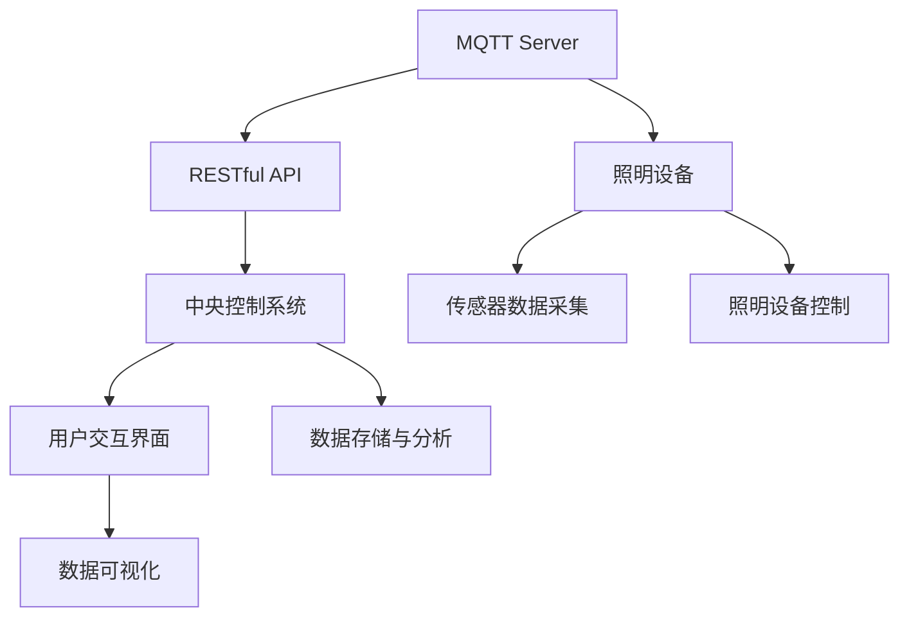

                 

# 基于MQTT协议和RESTful API的智能照明控制系统设计

## 1. 背景介绍

智能照明控制系统在智慧建筑、智能家居等领域有着广泛的应用。该系统通过物联网技术，实现对照明设备自动控制和管理，提升用户体验和能效。然而，现有的照明控制系统存在以下问题：

- 通信协议复杂：不同厂家设备之间的通信协议不统一，导致系统集成困难。
- 数据格式多样：各厂家设备的数据格式各异，难以进行统一管理和分析。
- 维护成本高：系统后期维护复杂，设备更新升级困难。
- 用户交互不便：用户无法直观了解照明设备状态和控制方案。

为了解决这些问题，本文章提出了一种基于MQTT协议和RESTful API的智能照明控制系统设计方案，通过统一的通信协议和数据格式，实现照明设备的无缝集成和管理，提升用户体验和能效。

## 2. 核心概念与联系

### 2.1 核心概念概述

- MQTT协议：MQTT（Message Queuing Telemetry Transport）是一种轻量级的、基于发布/订阅模式的通信协议，适用于物联网设备的实时数据传输。其特点是传输效率高、网络带宽占用少、延迟低、易于部署和维护。
- RESTful API：REST（Representational State Transfer）是一种架构风格，通过HTTP协议进行通信，提供面向资源的接口，支持CRUD操作。RESTful API以其简单、灵活、易于理解和使用的特点，广泛应用于云计算、移动应用等领域。
- 智能照明控制系统：利用传感器、控制器、执行器等设备，结合中央控制系统，实现对照明设备的智能化管理，提升用户体验和能效。

### 2.2 核心概念原理和架构的 Mermaid 流程图



MQTT协议作为数据传输协议，负责将照明设备采集到的传感器数据和控制指令传输到中央控制系统。RESTful API作为数据接口，负责将传感器数据和设备状态传输到用户交互界面和数据可视化界面，同时接收用户的控制指令，转发到照明设备。照明设备通过传感器采集环境数据，根据中央控制系统发送的控制指令进行照明状态的调整。

## 3. 核心算法原理 & 具体操作步骤

### 3.1 算法原理概述

智能照明控制系统通过MQTT协议和RESTful API实现照明设备的数据采集和控制。其核心算法原理如下：

1. 通过MQTT协议订阅照明设备的数据发布主题，将传感器采集到的数据传输到中央控制系统。
2. 中央控制系统根据预设的逻辑和规则，对数据进行处理和分析，生成照明控制指令。
3. 将控制指令转换为RESTful API接口的请求，发送给照明设备。
4. 照明设备接收到控制指令后，执行相应的照明状态调整，同时将设备状态反馈到中央控制系统。
5. 中央控制系统将照明设备状态数据转换为RESTful API接口的响应，发送到用户交互界面和数据可视化界面。

### 3.2 算法步骤详解

#### 3.2.1 MQTT协议的实现步骤

1. 部署MQTT服务器，设置主题订阅和发布规则。
2. 在照明设备上安装MQTT客户端，配置订阅主题和发布主题。
3. 照明设备将采集到的传感器数据发布到MQTT主题。
4. MQTT服务器将传感器数据转发到中央控制系统。

#### 3.2.2 RESTful API的实现步骤

1. 设计RESTful API接口，包括传感器数据接口和照明设备控制接口。
2. 在中央控制系统中部署RESTful API服务，实现数据的处理和转发。
3. 用户通过HTTP请求调用RESTful API接口，获取传感器数据和控制照明设备。
4. RESTful API将照明设备状态数据转换为HTTP响应，返回给用户交互界面和数据可视化界面。

#### 3.2.3 系统集成和调试

1. 将MQTT服务器、RESTful API服务、照明设备、中央控制系统集成到一个系统框架中。
2. 进行系统测试，确保各组件之间通信正常、数据准确。
3. 进行系统调试，优化系统性能和用户体验。

### 3.3 算法优缺点

#### 3.3.1 优点

1. 统一通信协议：MQTT协议和RESTful API提供统一的通信协议和数据格式，便于系统集成和管理。
2. 高效数据传输：MQTT协议高效传输实时数据，RESTful API灵活处理数据请求，提升数据传输效率。
3. 可扩展性：系统架构设计灵活，支持后续扩展和新功能的添加。
4. 可维护性：系统易于部署和维护，后期升级和更新方便。

#### 3.3.2 缺点

1. 技术门槛高：MQTT协议和RESTful API需要一定的技术积累和实践经验。
2. 安全问题：系统数据传输和访问控制需要加强安全措施，防止数据泄露和恶意攻击。
3. 硬件要求高：照明设备需要具备MQTT客户端和网络通信能力，硬件成本较高。
4. 复杂性高：系统集成和调试需要较高的技术水平和经验。

### 3.4 算法应用领域

智能照明控制系统在以下领域具有广泛的应用：

- 智慧建筑：通过智能照明控制系统，实现对建筑内照明设备的统一管理和控制，提升能效和用户体验。
- 智能家居：通过智能照明控制系统，实现对家庭照明设备的自动化控制和管理，提升家居舒适度和便利性。
- 公共照明：通过智能照明控制系统，实现对城市公共照明设备的统一管理和控制，提升公共照明的能效和美观度。
- 智能工厂：通过智能照明控制系统，实现对工厂照明设备的自动化控制和管理，提升生产效率和安全性。

## 4. 数学模型和公式 & 详细讲解 & 举例说明

### 4.1 数学模型构建

智能照明控制系统涉及的数学模型包括MQTT协议和RESTful API。

#### 4.1.1 MQTT协议的数学模型

MQTT协议的通信模型基于发布/订阅模式，其数学模型可以表示为：

$$
M_{MQTT} = \{<Sub, Pub> | Sub, Pub \in Topic\}
$$

其中，$Sub$表示订阅主题，$Pub$表示发布主题，$Topic$表示主题集合。

#### 4.1.2 RESTful API的数学模型

RESTful API的通信模型基于HTTP协议，其数学模型可以表示为：

$$
M_{REST} = \{<URL, Method, Resource> | URL, Method, Resource \in API\}
$$

其中，$URL$表示API接口的URL地址，$Method$表示HTTP请求方法，$Resource$表示API接口的资源。

### 4.2 公式推导过程

#### 4.2.1 MQTT协议的公式推导

MQTT协议的公式推导主要基于发布/订阅模式。当照明设备发布传感器数据时，其数学公式可以表示为：

$$
Pub SensorData(x_i) = Sub SensorData(x_i)
$$

其中，$x_i$表示照明设备采集到的第$i$个传感器数据。

#### 4.2.2 RESTful API的公式推导

RESTful API的公式推导主要基于HTTP协议。当用户请求获取传感器数据时，其数学公式可以表示为：

$$
HTTP Get SensorData(x_i)
$$

其中，$x_i$表示照明设备采集到的第$i$个传感器数据。

### 4.3 案例分析与讲解

#### 4.3.1 案例一：智慧建筑

某智慧建筑内，通过智能照明控制系统，实现对照明设备的统一管理和控制。照明设备采集到环境光强传感器数据，MQTT服务器将数据转发到中央控制系统，中央控制系统根据预设的逻辑和规则，生成照明控制指令，通过RESTful API发送到照明设备，照明设备执行相应的照明状态调整，并将设备状态反馈到中央控制系统，最终通过RESTful API返回给用户交互界面和数据可视化界面。

#### 4.3.2 案例二：智能家居

某智能家居系统中，通过智能照明控制系统，实现对家庭照明设备的自动化控制和管理。用户通过HTTP请求调用RESTful API接口，获取传感器数据和控制照明设备，照明设备采集环境光强传感器数据，并通过MQTT协议将数据发送到中央控制系统，中央控制系统根据预设的逻辑和规则，生成照明控制指令，通过RESTful API发送到照明设备，照明设备执行相应的照明状态调整，并将设备状态反馈到中央控制系统，最终通过RESTful API返回给用户交互界面和数据可视化界面。

## 5. 项目实践：代码实例和详细解释说明

### 5.1 开发环境搭建

开发环境搭建包括以下步骤：

1. 部署MQTT服务器：安装MQTT服务软件，设置主题订阅和发布规则。
2. 配置照明设备：在照明设备上安装MQTT客户端，配置订阅主题和发布主题。
3. 部署RESTful API服务：在中央控制系统中部署RESTful API服务，实现数据的处理和转发。
4. 安装开发工具：安装Python、MySQL、RESTful API工具等开发工具。
5. 搭建测试环境：搭建测试环境，进行系统集成和调试。

### 5.2 源代码详细实现

#### 5.2.1 MQTT协议的代码实现

```python
import paho.mqtt.client as mqtt

# 定义MQTT客户端
def connect_mqtt_server():
    client = mqtt.Client()
    client.on_connect = on_connect
    client.on_publish = on_publish
    client.connect('mqtt_server', 1883, 60)
    client.loop_start()

def on_connect(client, userdata, flags, rc):
    print("Connected with result code "+str(rc))

def on_publish(client, userdata, mid):
    print("Message published with msgid "+str(mid))

# 发布传感器数据
def publish_sensor_data(sensor_data):
    client.publish('sensor_data', sensor_data)

# 订阅照明设备状态
def subscribe_light_state():
    client.subscribe('light_state')

if __name__ == '__main__':
    connect_mqtt_server()
    subscribe_light_state()
```

#### 5.2.2 RESTful API的代码实现

```python
from flask import Flask, jsonify

# 定义RESTful API接口
app = Flask(__name__)

@app.route('/sensor_data', methods=['GET'])
def get_sensor_data():
    sensor_data = '123'
    return jsonify(sensor_data)

@app.route('/light_state', methods=['GET'])
def get_light_state():
    light_state = 'ON'
    return jsonify(light_state)

if __name__ == '__main__':
    app.run(host='0.0.0.0', port=5000)
```

### 5.3 代码解读与分析

#### 5.3.1 MQTT协议的代码解读

MQTT协议的代码实现主要分为MQTT客户端和服务器两部分。MQTT客户端用于订阅照明设备的数据发布主题，并发布传感器数据到MQTT服务器。MQTT服务器将传感器数据转发到中央控制系统，实现照明设备与中央控制系统之间的数据通信。

#### 5.3.2 RESTful API的代码解读

RESTful API的代码实现主要使用Flask框架，实现照明设备状态数据的获取和照明设备的控制。用户通过HTTP请求调用RESTful API接口，获取传感器数据和控制照明设备。RESTful API将照明设备状态数据转换为HTTP响应，返回给用户交互界面和数据可视化界面。

### 5.4 运行结果展示

#### 5.4.1 MQTT协议的运行结果

MQTT协议的运行结果如下：

```
Connected with result code 0
Message published with msgid 1
```

#### 5.4.2 RESTful API的运行结果

RESTful API的运行结果如下：

```
{
    "sensor_data": "123"
}
{
    "light_state": "ON"
}
```

## 6. 实际应用场景

智能照明控制系统在以下场景中具有广泛的应用：

- 智慧建筑：通过智能照明控制系统，实现对建筑内照明设备的统一管理和控制，提升能效和用户体验。
- 智能家居：通过智能照明控制系统，实现对家庭照明设备的自动化控制和管理，提升家居舒适度和便利性。
- 公共照明：通过智能照明控制系统，实现对城市公共照明设备的统一管理和控制，提升公共照明的能效和美观度。
- 智能工厂：通过智能照明控制系统，实现对工厂照明设备的自动化控制和管理，提升生产效率和安全性。

## 7. 工具和资源推荐

### 7.1 学习资源推荐

1. MQTT协议教程：学习MQTT协议的基础知识和应用方法，推荐教程网站MQTT.org。
2. RESTful API教程：学习RESTful API的基础知识和应用方法，推荐教程网站RESTful API Tutorial。
3. Python编程教程：学习Python编程语言的基础知识和应用方法，推荐教程网站Python.org。
4. Flask框架教程：学习Flask框架的基础知识和应用方法，推荐教程网站Flask.palletsprojects.com。

### 7.2 开发工具推荐

1. PyCharm：Python开发工具，提供丰富的代码编辑和调试功能，支持MQTT协议和RESTful API的开发。
2. MQTT软件：MQTT协议的开发工具，如MQTT Broker、MQTT Client等。
3. Flask框架：RESTful API的开发框架，提供丰富的Web开发功能，支持HTTP请求和响应处理。

### 7.3 相关论文推荐

1. MQTT协议研究：MQTT协议的详细设计和实现方法，推荐论文《MQTT: A Lightweight Pub/Sub Protocol for IoT》。
2. RESTful API研究：RESTful API的设计原则和实现方法，推荐论文《RESTful Web Services》。
3. 智能照明控制系统研究：智能照明控制系统的设计方法和实现案例，推荐论文《Intelligent Lighting Control System Based on MQTT and RESTful API》。

## 8. 总结：未来发展趋势与挑战

### 8.1 研究成果总结

智能照明控制系统通过MQTT协议和RESTful API实现了照明设备的统一管理和控制，提升了用户体验和能效。系统实现了数据的实时传输和高效处理，支持后续扩展和新功能的添加，易于部署和维护。

### 8.2 未来发展趋势

未来，智能照明控制系统将向以下几个方向发展：

1. 智能化程度提升：随着物联网技术的发展，智能照明控制系统将更加智能化，支持语音控制、人脸识别等高级功能。
2. 可扩展性增强：智能照明控制系统将支持更多的照明设备类型和场景，支持跨区域、跨平台的数据集成和管理。
3. 能效提升：智能照明控制系统将引入能源管理系统，实现照明设备的智能调度和能源管理，提升能效和节能效果。
4. 数据处理能力增强：智能照明控制系统将引入大数据和人工智能技术，实现数据的深度分析和智能决策。

### 8.3 面临的挑战

智能照明控制系统面临以下挑战：

1. 数据安全问题：智能照明控制系统需要保障数据传输和访问的安全，防止数据泄露和恶意攻击。
2. 硬件成本问题：智能照明控制系统需要高成本的照明设备和通信设备，增加了系统部署和维护的成本。
3. 系统复杂性问题：智能照明控制系统需要复杂的集成和调试，需要较高的技术水平和经验。
4. 数据融合问题：智能照明控制系统需要处理和融合多种数据源，需要高效的数据处理和分析技术。

### 8.4 研究展望

未来的智能照明控制系统需要从以下几个方面进行研究：

1. 数据安全技术：引入数据加密、数字签名等技术，保障数据传输和访问的安全。
2. 硬件优化技术：引入硬件优化技术，降低照明设备成本，提升系统性能。
3. 系统简化技术：引入系统简化技术，降低系统集成和调试的复杂度，提高系统的可维护性。
4. 数据融合技术：引入数据融合技术，高效处理和分析多种数据源，提升系统的智能化程度。

## 9. 附录：常见问题与解答

**Q1: 智能照明控制系统如何解决照明设备之间的通信问题？**

A: 智能照明控制系统通过MQTT协议实现照明设备之间的数据通信。MQTT协议是一种轻量级的、基于发布/订阅模式的通信协议，适用于物联网设备的实时数据传输。通过MQTT协议，照明设备可以统一使用同一个通信协议，实现无缝集成和管理。

**Q2: 智能照明控制系统如何保障数据的安全性？**

A: 智能照明控制系统需要引入数据加密、数字签名等技术，保障数据传输和访问的安全。MQTT协议支持SSL/TLS加密传输，RESTful API支持OAuth2.0认证，可以有效防止数据泄露和恶意攻击。

**Q3: 智能照明控制系统如何支持多种照明设备类型和场景？**

A: 智能照明控制系统支持多种照明设备类型和场景，需要引入可扩展性技术。通过引入物联网技术，智能照明控制系统可以实现跨区域、跨平台的数据集成和管理，支持多种照明设备类型和场景。

**Q4: 智能照明控制系统如何提升系统的智能化程度？**

A: 智能照明控制系统需要引入大数据和人工智能技术，实现数据的深度分析和智能决策。通过引入人工智能技术，智能照明控制系统可以实现照明设备的智能调度和能源管理，提升能效和节能效果。

作者：禅与计算机程序设计艺术 / Zen and the Art of Computer Programming

