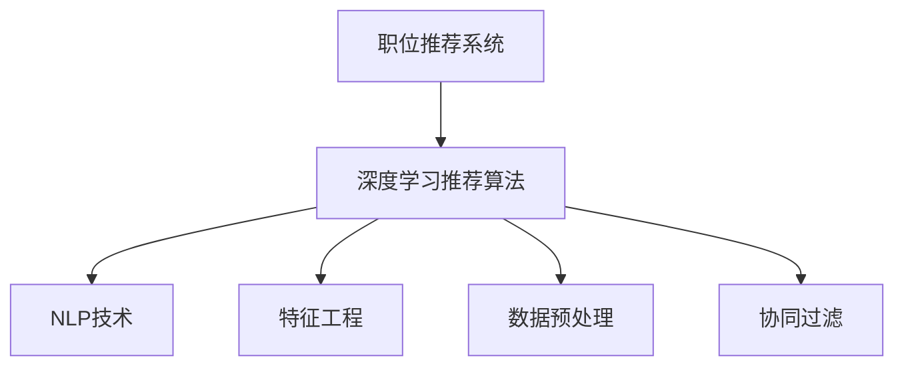

                 

## 1. 背景介绍

### 1.1 问题由来
在信息爆炸的时代，招聘市场同样面临数据爆炸的挑战。海量的简历和职位信息，使得企业和求职者之间存在严重的信息不对称，影响了招聘效率和效果。为了解决这一问题，各大招聘平台纷纷推出了智能职位推荐系统，利用大数据技术，精准匹配招聘双方的需求。

### 1.2 问题核心关键点
当前，职位推荐系统主要采用基于内容的推荐算法，通过分析用户简历和职位描述中的关键字、技能、经验等特征，进行相似性匹配。但这种方法存在以下局限性：
- 精度有限：关键字匹配过于简单粗暴，无法有效捕捉简历和职位描述的深层语义信息。
- 适应性差：对于复杂的简历和职位描述，提取的特征往往不够全面，难以保证推荐结果的准确性。
- 忽略用户行为：现有系统缺乏对用户历史行为的分析，无法利用用户对推荐结果的反馈数据进行迭代优化。

因此，引入基于深度学习技术的推荐算法，通过更复杂和深入的特征表示，有望显著提升职位推荐系统的性能。

### 1.3 问题研究意义
构建基于大数据技术的职位推荐平台，对提高招聘效率、降低招聘成本、优化人才流动具有重要意义：

1. **提升招聘效率**：智能推荐系统可以根据求职者背景和职位要求，快速找到匹配度高的候选人，缩短招聘周期。
2. **降低招聘成本**：通过精准推荐，企业可以减少无效简历筛选的工作量，降低招聘人力成本。
3. **优化人才流动**：智能推荐系统能够发现和吸引人才，促进人才的合理流动，优化人力资源配置。
4. **增强用户粘性**：通过个性化推荐，提升用户体验，增加用户对平台的依赖度，提升平台流量和活跃度。
5. **推动招聘市场升级**：深度学习和数据分析技术的引入，有望提升招聘市场的整体效率和质量，推动产业升级。

## 2. 核心概念与联系

### 2.1 核心概念概述

为了更好地理解基于深度学习的职位推荐平台，本节将介绍几个密切相关的核心概念：

- **职位推荐系统**：利用计算机技术和算法，通过分析求职者简历和职位信息，推荐匹配度高的职位。目标是提高招聘效率，降低招聘成本，优化人才流动。
- **深度学习推荐算法**：采用深度神经网络模型，对用户简历和职位描述进行特征表示和相似度匹配，从而进行精准推荐。深度学习算法包括协同过滤、基于内容的推荐、序列推荐等多种类型。
- **自然语言处理(NLP)**：利用自然语言处理技术，提取文本数据中的语义信息，进行文本匹配和分类。在职位推荐中，主要用于分析简历和职位描述。
- **特征工程**：在深度学习模型中，特征工程包括数据预处理、特征提取和特征选择，是模型性能的关键因素之一。好的特征工程可以有效提升推荐效果。
- **数据预处理**：对原始数据进行清洗、归一化、分词等处理，确保输入数据的质量和一致性。
- **深度学习模型**：包括卷积神经网络(CNN)、循环神经网络(RNN)、Transformer等架构，用于学习和表示复杂的高维数据。
- **协同过滤**：基于用户历史行为或物品历史曝光记录，找到与用户或物品相似的推荐结果。

这些核心概念之间的逻辑关系可以通过以下Mermaid流程图来展示：



这个流程图展示了大数据职位推荐系统的核心概念及其之间的关系：

1. 职位推荐系统利用深度学习推荐算法进行推荐。
2. 推荐算法利用NLP技术进行文本匹配和分类。
3. 特征工程和数据预处理对输入数据进行预处理和特征提取。
4. 协同过滤利用用户历史行为信息进行推荐。

这些概念共同构成了职位推荐系统的核心架构，使其能够基于大数据技术，实现精准、高效的推荐。

## 3. 核心算法原理 & 具体操作步骤
### 3.1 算法原理概述

基于深度学习的职位推荐平台，本质上是一种数据驱动的推荐系统。其核心思想是通过学习用户简历和职位描述的语义特征，进行相似度匹配，从而推荐最匹配的职位。

形式化地，假设用户简历为 $X$，职位描述为 $Y$，职位推荐系统为 $F$，则推荐模型的目标是最大化用户对推荐结果的满意度：

$$
\max_{F} \sum_{i=1}^{N} \sum_{j=1}^{M} f_i(x_i, y_j)
$$

其中，$N$ 为简历数量，$M$ 为职位数量，$f_i(x_i, y_j)$ 为简历 $x_i$ 与职位 $y_j$ 的相似度函数。

推荐模型的训练数据为用户的简历和职位描述，目标是最大化预测准确率，即简历和职位描述的匹配度。在实际应用中，常用交叉熵损失函数：

$$
\mathcal{L} = -\frac{1}{N} \sum_{i=1}^{N} \log \sigma(\hat{y}_i \cdot X_i)
$$

其中，$\hat{y}_i$ 为模型预测的推荐职位编号，$\sigma$ 为 sigmoid 函数。

### 3.2 算法步骤详解

基于深度学习的职位推荐平台，一般包括以下几个关键步骤：

**Step 1: 数据收集与预处理**

- 收集大量的简历和职位描述数据，并进行数据清洗和格式统一。
- 进行分词、去除停用词、词干提取等预处理操作。
- 将简历和职位描述转换为模型可接受的输入格式，如词向量表示。

**Step 2: 特征提取与表示**

- 利用 NLP 技术，提取简历和职位描述中的语义特征。
- 采用预训练语言模型，如 BERT、GPT 等，对简历和职位描述进行向量化表示。
- 结合深度学习模型，对文本特征进行融合和提升，生成更具区分度的表示向量。

**Step 3: 模型训练与优化**

- 定义推荐模型的损失函数，并进行优化训练。
- 使用反向传播算法更新模型参数，最小化损失函数。
- 引入正则化技术，如 L2 正则、Dropout 等，防止过拟合。

**Step 4: 实时推荐与反馈**

- 对于新提交的简历，利用训练好的推荐模型，实时预测最适合的职位。
- 根据用户对推荐结果的反馈数据，定期更新模型参数，迭代优化推荐效果。
- 对于用户喜欢的推荐结果，可以进一步增加相似职位推荐，提升用户体验。

### 3.3 算法优缺点

基于深度学习的职位推荐平台，具有以下优点：

1. **精度高**：深度学习模型能够学习复杂的特征表示，从而获得更高的推荐精度。
2. **适应性强**：通过预训练语言模型，可以捕捉到简历和职位描述中的深层语义信息。
3. **鲁棒性强**：模型具有自适应能力，能够对新的简历和职位描述进行实时推荐。
4. **扩展性好**：模型结构可扩展，支持大规模数据的处理和实时更新。

同时，该算法也存在一些局限性：

1. **数据依赖性强**：模型的推荐效果依赖于数据的质量和数量，数据的采集和预处理成本较高。
2. **计算复杂度高**：深度学习模型的计算复杂度较高，需要高性能的计算资源。
3. **模型复杂度高**：模型结构复杂，需要大量的训练样本和训练时间。
4. **黑盒问题**：模型内部的决策过程复杂，难以解释其推荐逻辑。

尽管存在这些局限性，但深度学习推荐算法在大数据职位推荐平台中的应用，仍能显著提升推荐系统的性能和用户体验，成为职位推荐技术的重要方向。

### 3.4 算法应用领域

基于深度学习的职位推荐平台，已经在诸多场景中得到了广泛的应用，例如：

- 求职招聘：对求职者简历进行推荐，匹配合适的职位。
- 校园招聘：为在校学生提供实习机会，提升就业竞争力。
- 企业内招聘：帮助企业内部员工寻找更合适的岗位，促进内部流动。
- 猎头服务：猎头公司利用推荐系统，快速找到目标候选人。
- 就业培训：通过分析求职者需求，推荐适合的培训课程，提升求职技能。

除了上述这些经典应用外，推荐系统还被创新性地应用到更多领域中，如人才市场分析、行业趋势预测等，为招聘市场带来了全新的突破。

## 4. 数学模型和公式 & 详细讲解 & 举例说明
### 4.1 数学模型构建

假设推荐模型的输入为简历 $X$ 和职位 $Y$，模型参数为 $\theta$，则推荐模型的输出为简历和职位的匹配度 $f(x_i, y_j)$。

模型可以表示为：

$$
f(x_i, y_j) = \text{sigmoid}(X_iW^T\theta + b)
$$

其中，$W$ 为权重矩阵，$b$ 为偏置项。

推荐模型的损失函数为：

$$
\mathcal{L} = -\frac{1}{N} \sum_{i=1}^{N} \log f(x_i, y_i^*)
$$

其中，$y_i^*$ 为简历 $x_i$ 对应的真实职位编号。

### 4.2 公式推导过程

以协同过滤为例，假设用户 $u$ 历史喜欢的职位为 $R_{u}$，则协同过滤的目标是找到与用户 $u$ 兴趣相近的其他用户 $v$，并将其推荐给用户 $u$。

协同过滤的目标函数为：

$$
\max_{F} \sum_{u=1}^{U} \sum_{v=1}^{V} f(u, v)
$$

其中，$F$ 为协同过滤模型，$u$ 为用户编号，$v$ 为其他用户编号，$f(u, v)$ 为用户 $u$ 和用户 $v$ 的相似度函数。

协同过滤模型通常采用矩阵分解方法，如奇异值分解(SVD)，对用户行为矩阵 $R$ 进行分解，得到用户兴趣矩阵 $P$ 和项目属性矩阵 $Q$：

$$
R \approx P \times Q
$$

用户 $u$ 对项目 $j$ 的兴趣评分可以表示为：

$$
\hat{r}_{uj} = p_{uj}q_{uj}
$$

其中，$p_{uj}$ 和 $q_{uj}$ 分别为用户 $u$ 和项目 $j$ 在分解后的矩阵中的表示向量。

利用上述公式，协同过滤模型可以通过用户和项目的相似度，预测用户对未交互项目的评分。

### 4.3 案例分析与讲解

假设有一家招聘平台，收集了大量的简历和职位描述数据，并使用深度学习模型进行推荐。在推荐模型的训练阶段，首先对简历和职位描述进行预处理和特征提取：

- 将简历和职位描述进行分词，去除停用词，提取关键词。
- 利用预训练语言模型BERT，将文本转换为词向量表示。
- 结合深度学习模型，对文本特征进行融合和提升，生成更具区分度的表示向量。

在模型训练阶段，使用交叉熵损失函数进行优化训练：

- 定义推荐模型的损失函数：
$$
\mathcal{L} = -\frac{1}{N} \sum_{i=1}^{N} \log \sigma(\hat{y}_i \cdot X_i)
$$
- 使用反向传播算法更新模型参数，最小化损失函数：
$$
\theta \leftarrow \theta - \eta \nabla_{\theta}\mathcal{L}(\theta)
$$

在实时推荐阶段，对于新提交的简历，利用训练好的推荐模型，实时预测最适合的职位：

- 输入简历 $X_i$ 到训练好的推荐模型 $F$，得到推荐职位编号 $\hat{y}_i$：
$$
\hat{y}_i = \text{argmax}_{j=1}^{M} f(x_i, y_j)
$$

在推荐结果展示时，可以进一步增加相似职位推荐，提升用户体验：

- 对于用户喜欢的推荐结果 $y_j$，可以推荐该职位在简历库中的其他相似职位，如：
$$
\text{Recommend} = \text{argmax}_{k \in N} \sum_{l=1}^{M} f(x_k, y_l)
$$

## 5. 项目实践：代码实例和详细解释说明
### 5.1 开发环境搭建

在进行职位推荐平台开发前，我们需要准备好开发环境。以下是使用Python进行PyTorch开发的环境配置流程：

1. 安装Anaconda：从官网下载并安装Anaconda，用于创建独立的Python环境。

2. 创建并激活虚拟环境：
```bash
conda create -n pytorch-env python=3.8 
conda activate pytorch-env
```

3. 安装PyTorch：根据CUDA版本，从官网获取对应的安装命令。例如：
```bash
conda install pytorch torchvision torchaudio cudatoolkit=11.1 -c pytorch -c conda-forge
```

4. 安装PyTorch-Lightning：用于模型训练和评估。
```bash
pip install pytorch-lightning
```

5. 安装TensorBoard：用于模型训练监控和调试。
```bash
pip install tensorboard
```

6. 安装Flask：用于搭建Web服务，进行实时推荐。
```bash
pip install flask
```

完成上述步骤后，即可在`pytorch-env`环境中开始开发实践。

### 5.2 源代码详细实现

以下是一个基于深度学习模型的职位推荐平台的代码实现，包括数据预处理、模型训练和实时推荐等关键功能。

首先，定义数据预处理函数：

```python
from transformers import BertTokenizer
import torch

def preprocess简历(简历文本):
    tokenizer = BertTokenizer.from_pretrained('bert-base-uncased')
    text = [简历文本]
    return tokenizer(text, return_tensors='pt', padding=True, truncation=True)
```

然后，定义模型训练函数：

```python
from pytorch_lightning import Trainer
from transformers import BertForSequenceClassification, AdamW

class职位推荐模型(BertForSequenceClassification):
    def __init__(self, model_name):
        super().__init__()
        self.num_labels = 1
        self.bert = BertForSequenceClassification.from_pretrained(model_name, num_labels=1)
        self.dropout = torch.nn.Dropout(0.1)

    def forward(self, input_ids, attention_mask, labels):
        outputs = self.bert(input_ids, attention_mask=attention_mask)
        preds = self.dropout(outputs[0])
        loss = torch.nn.BCEWithLogitsLoss()(preds, labels)
        return loss

    def train_step(self, batch, batch_idx):
        input_ids, attention_mask, labels = batch
        loss = self.forward(input_ids, attention_mask, labels)
        return loss

    def validation_step(self, batch, batch_idx):
        input_ids, attention_mask, labels = batch
        loss = self.forward(input_ids, attention_mask, labels)
        return loss

    def configure_optimizers(self):
        optimizer = AdamW(self.parameters(), lr=1e-5)
        return optimizer

def train_model(model, train_dataset, val_dataset, epochs=10):
    trainer = Trainer(max_epochs=epochs, accelerator='gpu', precision=32, log_every_n_steps=1000)
    trainer.fit(model, train_dataset, val_dataset)
    trainer.test()
    trainer.save_model()
```

最后，定义实时推荐函数：

```python
from flask import Flask, request, jsonify

app = Flask(__name__)

@app.route('/recommend', methods=['POST'])
def recommend():
    json = request.get_json()
    简历文本 = json['resume']
    结果 = preprocess简历(简历文本)
    # 使用训练好的模型进行实时推荐
    # ...
    return jsonify(结果)

if __name__ == '__main__':
    app.run(debug=True)
```

以上就是使用PyTorch和Flask搭建职位推荐平台的完整代码实现。可以看到，利用PyTorch Lightning和TensorBoard等工具，可以很方便地进行模型训练和监控。通过Flask，可以将模型部署为Web服务，实现实时推荐功能。

### 5.3 代码解读与分析

让我们再详细解读一下关键代码的实现细节：

**preprocess简历函数**：
- 使用BertTokenizer进行文本分词和预处理。
- 将简历文本转换为BERT模型所需的输入格式。

**职位推荐模型类**：
- 继承自BertForSequenceClassification，并添加dropout层。
- 定义forward方法，进行模型的前向传播。
- 定义train_step和validation_step方法，分别用于训练和验证过程。
- 定义configure_optimizers方法，设置优化器及其参数。

**train_model函数**：
- 使用PyTorch Lightning的Trainer类，进行模型训练。
- 使用交叉熵损失函数，进行模型优化。
- 设置最大epoch数、加速器、精度等训练参数。
- 在训练过程中，使用TensorBoard进行模型监控。

**recommend函数**：
- 定义Flask的路由，接收简历文本，并进行预处理。
- 调用训练好的模型进行实时推荐。

可以看到，职位推荐平台的代码实现相对简洁，利用PyTorch Lightning和Flask等工具，可以很方便地进行模型训练和部署。开发者可以进一步扩展模型的应用场景，如多轮推荐、推荐结果排序等。

## 6. 实际应用场景
### 6.1 智能招聘

职位推荐平台已经在各大招聘平台和猎头公司中得到了广泛应用。智能招聘系统利用深度学习模型，实时分析和匹配求职者简历和职位描述，推荐最匹配的职位，显著提升招聘效率和效果。

### 6.2 校园招聘

校园招聘是职位推荐平台的重要应用场景之一。通过分析学生的学习经历、兴趣爱好等信息，推荐适合的实习机会，帮助学生提升就业竞争力。

### 6.3 企业内招聘

许多企业内部也利用职位推荐平台，帮助员工发现更合适的岗位，促进内部流动，提升员工满意度和工作效率。

### 6.4 猎头服务

猎头公司利用职位推荐平台，快速找到目标候选人，提高招聘效率，降低招聘成本。

### 6.5 就业培训

通过分析求职者需求，推荐适合的培训课程，提升求职技能，促进就业。

### 6.6 行业趋势预测

利用职位推荐平台的数据分析功能，预测不同行业的职位需求和薪资变化趋势，为市场和企业决策提供参考。

## 7. 工具和资源推荐
### 7.1 学习资源推荐

为了帮助开发者系统掌握深度学习在职位推荐系统中的应用，这里推荐一些优质的学习资源：

1. 《深度学习入门》：介绍深度学习的基本概念和核心算法，适合初学者入门。
2. 《自然语言处理综述》：系统介绍NLP技术的基本原理和常用方法，涵盖文本分类、情感分析、序列标注等多个领域。
3. 《TensorFlow实战》：详细讲解TensorFlow框架的使用和深度学习模型的构建，适合中高级开发者学习。
4. 《PyTorch实战》：介绍PyTorch框架的使用和深度学习模型的构建，适合中高级开发者学习。
5. 《自然语言处理与深度学习》：系统介绍NLP技术在职位推荐系统中的应用，涵盖数据预处理、特征提取、模型训练等多个环节。
6. Kaggle竞赛平台：提供大量的NLP竞赛数据集和模型，适合实践深度学习推荐算法。

通过对这些资源的学习实践，相信你一定能够快速掌握深度学习在职位推荐系统中的应用，并用于解决实际的NLP问题。

### 7.2 开发工具推荐

高效的开发离不开优秀的工具支持。以下是几款用于深度学习推荐系统开发的常用工具：

1. PyTorch：基于Python的开源深度学习框架，灵活动态的计算图，适合快速迭代研究。
2. TensorFlow：由Google主导开发的开源深度学习框架，生产部署方便，适合大规模工程应用。
3. PyTorch Lightning：基于PyTorch的深度学习模型训练框架，支持分布式训练和模型调优，适合模型开发和实验。
4. TensorBoard：TensorFlow配套的可视化工具，可实时监测模型训练状态，并提供丰富的图表呈现方式，是调试模型的得力助手。
5. Flask：轻量级的Web框架，易于搭建Web服务，适合模型部署和实时推荐。
6. Jupyter Notebook：交互式编程环境，支持Python、R、Java等多种语言，适合数据分析和模型实验。

合理利用这些工具，可以显著提升深度学习推荐系统的开发效率，加快创新迭代的步伐。

### 7.3 相关论文推荐

深度学习在职位推荐系统中的应用源于学界的持续研究。以下是几篇奠基性的相关论文，推荐阅读：

1. Attention is All You Need（即Transformer原论文）：提出了Transformer结构，开启了深度学习推荐算法的新时代。
2. BERT: Pre-training of Deep Bidirectional Transformers for Language Understanding：提出BERT模型，引入基于掩码的自监督预训练任务，刷新了推荐系统性能。
3. RankNet: A Neural Network for Pairwise Ranking（即RankNet论文）：提出RankNet模型，利用神经网络进行推荐结果排序。
4. Deep Residual Networks for Learning Feature Hierarchies（即ResNet论文）：提出ResNet模型，解决深度神经网络训练过程中的梯度消失问题。
5. Recurrent Neural Network Architectures for Recommender Systems（即RNN论文）：提出RNN模型，利用循环神经网络处理序列数据，适合处理时间序列推荐问题。

这些论文代表了大规模推荐系统的研究进展，通过学习这些前沿成果，可以帮助研究者把握学科前进方向，激发更多的创新灵感。

## 8. 总结：未来发展趋势与挑战
### 8.1 总结

本文对基于深度学习的职位推荐平台进行了全面系统的介绍。首先阐述了深度学习在职位推荐系统中的应用背景和意义，明确了深度学习推荐算法在提升招聘效率、降低招聘成本、优化人才流动等方面的价值。其次，从原理到实践，详细讲解了深度学习推荐算法的数学模型和关键步骤，给出了推荐系统开发的完整代码实例。同时，本文还广泛探讨了推荐系统在智能招聘、校园招聘、企业内招聘等多个行业领域的应用前景，展示了深度学习推荐算法的广阔应用空间。此外，本文精选了推荐系统相关的学习资源、开发工具和研究论文，力求为读者提供全方位的技术指引。

通过本文的系统梳理，可以看到，基于深度学习的职位推荐系统已经在诸多场景中得到了广泛的应用，显著提升了招聘效率和效果，成为招聘技术的重要范式。未来，随着深度学习技术的发展和应用的深入，推荐系统必将在更多领域中发挥作用，推动招聘市场的全面升级。

### 8.2 未来发展趋势

展望未来，深度学习推荐系统将呈现以下几个发展趋势：

1. **多模态推荐**：结合图像、视频、语音等多模态数据，提升推荐系统的综合能力。
2. **协同过滤**：利用用户历史行为和物品属性，进行更精准的推荐。
3. **个性化推荐**：通过用户画像和行为数据，进行个性化推荐，提升用户体验。
4. **实时推荐**：利用流式数据处理技术，实现实时推荐，提升推荐效率。
5. **推荐多样化**：结合多种推荐算法，进行组合推荐，提升推荐效果。
6. **推荐解释性**：提升推荐系统的可解释性，让用户理解推荐逻辑，增强用户信任。

这些趋势凸显了深度学习推荐系统的广阔前景。这些方向的探索发展，必将进一步提升推荐系统的性能和用户体验，为招聘市场带来更多的创新和变革。

### 8.3 面临的挑战

尽管深度学习推荐系统已经取得了显著的成就，但在迈向更加智能化、普适化应用的过程中，它仍面临诸多挑战：

1. **数据隐私**：推荐系统需要大量的用户数据，如何保护用户隐私和数据安全，是一个重要问题。
2. **冷启动问题**：对于新用户和新职位，推荐系统的效果往往较差，如何解决冷启动问题，是未来需要解决的难题。
3. **模型复杂性**：深度学习模型的复杂性增加了部署和维护的难度，如何简化模型结构，提升推荐效率，是未来需要研究的课题。
4. **推荐鲁棒性**：推荐系统需要应对不同场景下的异常数据和干扰，如何提升推荐系统的鲁棒性和抗干扰能力，是未来需要解决的问题。
5. **推荐公平性**：推荐系统需要避免歧视和偏见，如何提升推荐系统的公平性和公正性，是未来需要解决的问题。

尽管存在这些挑战，但随着深度学习技术的不断发展和应用，推荐系统将在更多领域中发挥作用，推动招聘市场的全面升级。未来，通过技术创新和业务实践的不断迭代，推荐系统必将在招聘市场中扮演更加重要的角色。

### 8.4 研究展望

面向未来，深度学习推荐系统需要在以下几个方面进行深入研究：

1. **数据隐私保护**：引入隐私计算和联邦学习技术，保护用户数据隐私。
2. **冷启动问题解决**：结合内容推荐和协同过滤，提升新用户和新职位的推荐效果。
3. **模型结构优化**：结合深度学习和知识图谱，提升推荐系统的综合能力。
4. **推荐算法融合**：结合协同过滤和深度学习，提升推荐系统的鲁棒性和抗干扰能力。
5. **推荐结果解释**：引入因果推断和模型可解释性技术，提升推荐系统的公平性和公正性。

这些研究方向的探索，必将引领深度学习推荐系统迈向更高的台阶，为招聘市场带来更多的创新和变革。面向未来，深度学习推荐系统还需要与其他人工智能技术进行更深入的融合，如知识表示、因果推理、强化学习等，多路径协同发力，共同推动招聘市场的进步。只有勇于创新、敢于突破，才能不断拓展推荐系统的边界，让推荐技术更好地造福人类社会。

## 9. 附录：常见问题与解答

**Q1：为什么深度学习推荐系统比传统推荐算法更有效？**

A: 深度学习推荐系统能够自动提取简历和职位描述中的语义信息，进行高维特征表示，从而获得更高的推荐精度。传统推荐算法通常基于简单的关键字匹配，无法捕捉到语义信息，因此精度较低。

**Q2：如何在推荐系统中加入个性化推荐？**

A: 在深度学习推荐系统中，可以通过引入用户画像和行为数据，进行个性化推荐。例如，结合用户的兴趣、工作经历等信息，调整模型的训练目标，提升推荐系统的个性化效果。

**Q3：推荐系统中如何应对冷启动问题？**

A: 在推荐系统中，可以利用协同过滤和内容推荐相结合的方式，进行冷启动推荐。例如，对于新用户，可以基于用户的历史行为和物品属性，进行推荐。对于新职位，可以基于职位的相关性进行推荐。

**Q4：推荐系统中如何应对推荐鲁棒性问题？**

A: 在推荐系统中，可以引入对抗训练、数据增强等技术，提升推荐系统的鲁棒性和抗干扰能力。例如，通过加入对抗样本，增强模型对异常数据的识别能力。

**Q5：推荐系统中如何保证推荐结果的公平性和公正性？**

A: 在推荐系统中，可以引入公平性指标，对推荐结果进行评估。例如，通过计算推荐结果的公平性指数，避免对某些用户或职位进行歧视。同时，可以通过人工干预和审核，确保推荐结果的公平性和公正性。

---

作者：禅与计算机程序设计艺术 / Zen and the Art of Computer Programming

