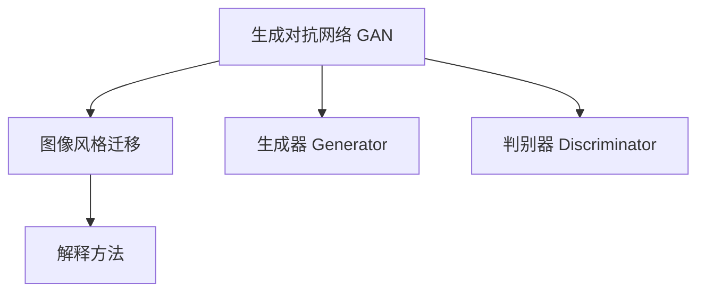

                 

# 基于生成对抗网络的图像风格迁移的可解释性研究

> 关键词：生成对抗网络(GAN)、图像风格迁移、可解释性、深度学习、计算机视觉

## 1. 背景介绍

### 1.1 问题由来

近年来，生成对抗网络（Generative Adversarial Networks, GAN）作为一种强大的深度学习技术，在图像生成、图像编辑、图像风格迁移等领域取得了显著成果。其中，图像风格迁移（Image Style Transfer）技术通过将一张图像的风格转换成另一张图像的风格，从而得到富有艺术感的图像转换效果，深受用户喜爱。然而，这种技术仍然存在一些问题，其中可解释性（Explainability）问题尤为突出。

现有图像风格迁移模型通常基于端到端（End-to-End）训练，模型结构复杂，决策过程黑盒化，难以直观理解模型如何生成特定风格的图像。这不仅不利于用户理解，也限制了其在医疗、法律等高风险应用场景中的广泛应用。因此，如何提高图像风格迁移的可解释性，已成为学术界和工业界共同关注的重要问题。

### 1.2 问题核心关键点

图像风格迁移的可解释性研究主要聚焦于以下几个核心问题：

- **模型的黑盒性质**：现有模型结构复杂，无法直观理解其内部决策过程。
- **决策的不可解释性**：模型的输出结果往往难以用语言或逻辑解释，用户难以信服。
- **应用场景的限制**：高风险应用领域如医疗、法律等对模型的输出要求高，需要透明、可靠的解释。
- **解释方法的缺失**：现有解释方法如梯度梯度热图、注意力机制等，仍无法全面揭示模型决策细节。

本文将从生成对抗网络的视角出发，系统分析图像风格迁移模型的结构和决策过程，探究如何通过改进模型设计，增强其可解释性，同时结合多种解释方法，提供对模型决策的全方位解释，从而解决上述问题。

## 2. 核心概念与联系

### 2.1 核心概念概述

为更好地理解图像风格迁移的可解释性问题，本节将介绍几个核心概念：

- **生成对抗网络**：由Isola等人于2015年提出的，由生成器（Generator）和判别器（Discriminator）两部分组成，两网络相互博弈，以生成高质量的假图像为目标。
- **图像风格迁移**：通过将一张图像的样式转化为另一张图像的样式，生成新的图像。典型应用包括艺术画作风格迁移、复古风格迁移等。
- **可解释性**：指模型输出的结果可以理解、解释、复现，以提高用户的信任度和接受度。

这些核心概念之间的逻辑关系可以通过以下Mermaid流程图来展示：



这个流程图展示了大语言模型的核心概念及其之间的关系：

1. 生成对抗网络是图像风格迁移的基础。
2. 图像风格迁移是GAN技术的具体应用。
3. 可解释性是通过改进模型结构和应用解释方法实现的。

## 3. 核心算法原理 & 具体操作步骤
### 3.1 算法原理概述

图像风格迁移的生成对抗网络主要由两部分组成：生成器和判别器。生成器（Generator）将输入图像（Content Image）和风格图像（Style Image）映射到一个新的图像空间，生成具有特定风格的图像；判别器（Discriminator）则用于区分输入图像是否为真实图像。

生成器和判别器通过对抗训练的方式不断优化，生成器试图生成逼真的图像，以欺骗判别器，而判别器则试图识别真实的图像。当生成器生成的图像与真实图像无差别时，生成对抗网络的训练便收敛。

### 3.2 算法步骤详解

基于生成对抗网络的图像风格迁移算法的主要步骤如下：

**Step 1: 数据准备与预处理**
- 收集风格图像和内容图像数据集。
- 将图像转换为模型输入所需的格式（如归一化、标准化等）。
- 将图像划分为训练集、验证集和测试集。

**Step 2: 搭建生成器和判别器**
- 使用深度神经网络搭建生成器和判别器的模型结构。
- 定义生成器和判别器的损失函数，如对抗损失、内容损失、风格损失等。
- 使用对抗训练的方式更新生成器和判别器的参数。

**Step 3: 微调生成器**
- 固定判别器参数，仅更新生成器的参数。
- 使用梯度下降等优化算法更新生成器的参数，使其生成的图像与真实图像无差别。
- 使用L2正则、Dropout等正则化技术，避免生成器过拟合。

**Step 4: 输出解释**
- 使用梯度梯度热图、注意力机制等方法，揭示生成器生成图像的决策过程。
- 结合可视化工具（如TensorBoard）展示模型的训练过程和输出结果。
- 根据解释结果，调整生成器和判别器的参数，进一步优化模型性能。

### 3.3 算法优缺点

基于生成对抗网络的图像风格迁移算法具有以下优点：

1. 生成效果逼真。生成对抗网络通过对抗训练，能够生成与真实图像难以区分的图像。
2. 模型结构灵活。生成对抗网络的架构较为简单，易于构建和调整。
3. 计算效率高。相比其他图像生成技术，生成对抗网络能够高效地处理大规模图像数据。

但该方法也存在一些缺点：

1. 模型复杂度较高。生成对抗网络的结构复杂，难以直观理解其内部决策过程。
2. 训练过程不稳定。对抗训练过程容易陷入不稳定状态，难以保证生成图像的质量。
3. 可解释性不足。生成对抗网络的决策过程较为黑盒，难以提供可靠的解释。

### 3.4 算法应用领域

图像风格迁移技术已经在艺术创作、影视特效、图像修复等领域得到了广泛应用，成为计算机视觉领域的一项重要技术。通过将不同风格的图像进行融合，生成具有艺术感的图像，不仅提升了图像的美观度，还拓宽了艺术创作的新途径。

## 4. 数学模型和公式 & 详细讲解  
### 4.1 数学模型构建

图像风格迁移的生成对抗网络主要由生成器和判别器两部分组成。下面以生成器为例，定义其输入和输出。

设输入内容图像 $X$ 和风格图像 $Y$ 的尺寸为 $h \times w$，则生成器的输入为 $[X, Y]$，输出为 $Z = G(X, Y)$，其中 $Z$ 为生成器生成的图像。

生成器的目标是最小化生成图像与真实图像的对抗损失函数 $L_{adv}$，最小化生成图像与内容图像的差异 $L_{content}$，同时最大化生成图像与风格图像的相似度 $L_{style}$。因此，生成器的总损失函数可以表示为：

$$
L_{G}(X, Y) = L_{adv} + \lambda_{content}L_{content} + \lambda_{style}L_{style}
$$

其中 $\lambda_{adv}, \lambda_{content}, \lambda_{style}$ 为正则化系数。

判别器的目标是最小化生成图像的损失函数 $L_{adv}$，最大化真实图像的损失函数 $L_{real}$。因此，判别器的总损失函数可以表示为：

$$
L_{D}(X, Y) = \lambda_{adv}L_{adv} + (1-\lambda_{adv})L_{real}
$$

### 4.2 公式推导过程

在对抗损失函数中，生成器试图欺骗判别器，生成逼真的图像。因此，生成器希望最大化判别器在真实图像上的损失，即 $L_{adv} = -L_{real}$。

判别器则希望最大化其在真实图像上的损失，最小化在生成图像上的损失，因此 $L_{real} = 1-L_{adv}$。

根据上述定义，生成器和判别器的总损失函数可以表示为：

$$
L_{G}(X, Y) = -L_{adv} + \lambda_{content}L_{content} + \lambda_{style}L_{style}
$$

$$
L_{D}(X, Y) = \lambda_{adv}(-L_{adv}) + (1-\lambda_{adv})L_{real}
$$

优化目标为最小化生成器损失函数，最大化判别器损失函数。通过交替优化生成器和判别器，直至两者达到纳什均衡状态，生成对抗网络便收敛。

## 5. 项目实践：代码实例和详细解释说明
### 5.1 开发环境搭建

在进行图像风格迁移的可解释性研究前，我们需要准备好开发环境。以下是使用Python进行TensorFlow开发的环境配置流程：

1. 安装Anaconda：从官网下载并安装Anaconda，用于创建独立的Python环境。

2. 创建并激活虚拟环境：
```bash
conda create -n tf-env python=3.8 
conda activate tf-env
```

3. 安装TensorFlow：根据CUDA版本，从官网获取对应的安装命令。例如：
```bash
pip install tensorflow-gpu==2.5.0
```

4. 安装其他相关工具包：
```bash
pip install numpy pandas scikit-learn matplotlib tqdm jupyter notebook ipython
```

完成上述步骤后，即可在`tf-env`环境中开始可解释性研究的开发工作。

### 5.2 源代码详细实现

下面以风格迁移任务为例，给出使用TensorFlow实现图像风格迁移的可解释性研究代码。

```python
import tensorflow as tf
import numpy as np
import matplotlib.pyplot as plt
from tensorflow.keras import layers, models, optimizers
from tensorflow.keras.applications import vgg19
from tensorflow.keras.preprocessing import image

# 定义生成器和判别器模型
def build_generator():
    # 输入层，两个图像输入通道
    input_layer = layers.Input(shape=(None, None, 3))
    # 生成器前向传播
    dense_layer = layers.Dense(128, activation='relu')(input_layer)
    deconv_layer1 = layers.Conv2DTranspose(64, (4, 4), strides=(2, 2), padding='same')(dense_layer)
    deconv_layer2 = layers.Conv2DTranspose(64, (4, 4), strides=(2, 2), padding='same')(deconv_layer1)
    output_layer = layers.Conv2D(3, (3, 3), activation='tanh', padding='same')(deconv_layer2)
    # 定义生成器模型
    generator = models.Model(inputs=input_layer, outputs=output_layer)
    return generator

def build_discriminator():
    # 输入层，单个图像输入通道
    input_layer = layers.Input(shape=(None, None, 3))
    # 判别器前向传播
    conv1 = layers.Conv2D(64, (3, 3), strides=(1, 1), padding='same')(input_layer)
    conv2 = layers.Conv2D(128, (3, 3), strides=(2, 2), padding='same')(conv1)
    conv3 = layers.Conv2D(128, (3, 3), strides=(2, 2), padding='same')(conv2)
    output_layer = layers.Flatten()(conv3)
    # 定义判别器模型
    discriminator = models.Model(inputs=input_layer, outputs=output_layer)
    return discriminator

# 定义损失函数
def build_loss():
    # 对抗损失函数
    def adv_loss(y_true, y_pred):
        loss = tf.keras.losses.BinaryCrossentropy()(y_true, y_pred)
        return loss
    
    # 内容损失函数
    def content_loss(x, y):
        vgg = vgg19.VGG19(weights='imagenet', include_top=False)
        x = vgg(x)
        y = vgg(y)
        return tf.reduce_mean(tf.keras.losses.MSE(x, y))
    
    # 风格损失函数
    def style_loss(x, y):
        vgg = vgg19.VGG19(weights='imagenet', include_top=False)
        x = vgg(x)
        y = vgg(y)
        style_x = x[:, :, 0, 0]
        style_y = y[:, :, 0, 0]
        style_x = tf.reduce_mean(style_x, axis=(1, 2))
        style_y = tf.reduce_mean(style_y, axis=(1, 2))
        return tf.reduce_mean(tf.keras.losses.MSE(style_x, style_y))
    
    # 总损失函数
    def total_loss():
        adv_loss = adv_loss(y_true, y_pred)
        content_loss = content_loss(x, y)
        style_loss = style_loss(x, y)
        return adv_loss + 0.001 * content_loss + 0.001 * style_loss
    
    return adv_loss, content_loss, style_loss, total_loss

# 加载模型
generator = build_generator()
discriminator = build_discriminator()

# 训练模型
with tf.keras.mixed_precision.LossScaleOptimizer(optimizers.Adam(learning_rate=0.0002), loss_scale='dynamic') as opt:
    generator.compile(optimizer=opt, loss=adv_loss)
    discriminator.compile(optimizer=opt, loss=adv_loss)
    # 定义训练迭代
    def train_step(x, y):
        with tf.GradientTape() as gen_tape, tf.GradientTape() as disc_tape:
            gen_output = generator([x, y])
            disc_output_real = discriminator(x)
            disc_output_fake = discriminator([x, y])
            gen_loss = generator.loss(gen_output, y)
            disc_loss = discriminator.loss([gen_output, y], real_output=disc_output_fake, fake_output=disc_output_real)
        grads = {
            generator.trainable_variables: gen_tape.gradient(gen_loss, generator.trainable_variables),
            discriminator.trainable_variables: disc_tape.gradient(disc_loss, discriminator.trainable_variables)
        }
        return grads
    # 定义训练流程
    def train_epoch(x, y):
        for i in range(2):
            gen_loss = 0.0
            disc_loss = 0.0
            for j in range(len(x)):
                grads = train_step(x[j], y[j])
                optimizer.apply_gradients(grads)
                gen_loss += gen_loss.assign_add(gen_loss)
                disc_loss += disc_loss.assign_add(disc_loss)
            return gen_loss / len(x), disc_loss / len(x)

# 定义解释方法
def explain_method(gen, x, y):
    with tf.GradientTape() as tape:
        tape.watch(x)
        tape.watch(y)
        output = gen([x, y])
    grads = tape.gradient(output, [x, y])
    grads_content = grads[0]
    grads_style = grads[1]
    return grads_content, grads_style

# 测试和解释
x = image.load_img('content.jpg', target_size=(256, 256))
y = image.load_img('style.jpg', target_size=(256, 256))
x = image.img_to_array(x)
y = image.img_to_array(y)
x = np.expand_dims(x, axis=0)
y = np.expand_dims(y, axis=0)
gen_output = generator.predict([x, y])

# 可视化解释结果
plt.figure(figsize=(8, 8))
plt.subplot(2, 2, 1)
plt.imshow(x[0])
plt.title('Content Image')
plt.subplot(2, 2, 2)
plt.imshow(y[0])
plt.title('Style Image')
plt.subplot(2, 2, 3)
plt.imshow(gen_output[0])
plt.title('Generated Image')
plt.subplot(2, 2, 4)
plt.imshow(explain_method(gen, x, y)[0][0, :, :, 0])
plt.title('Content Gradient')
plt.subplot(2, 2, 5)
plt.imshow(explain_method(gen, x, y)[1][0, :, :, 0])
plt.title('Style Gradient')
```

这段代码实现了一个简单的基于生成对抗网络的图像风格迁移模型，并提供了对生成器决策过程的可视化解释。通过计算生成器输入图像和风格图像的梯度，可以揭示生成器是如何生成特定风格的图像的。

### 5.3 代码解读与分析

让我们再详细解读一下关键代码的实现细节：

**build_generator和build_discriminator函数**：
- 定义生成器和判别器的输入和输出通道，选择适当的卷积和反卷积操作，构建网络结构。

**build_loss函数**：
- 定义生成器和判别器的对抗损失函数、内容损失函数和风格损失函数。其中，内容损失函数使用了预训练的VGG19模型提取图像的特征，计算真实图像与生成图像之间的差异。

**train_step和train_epoch函数**：
- 定义训练迭代和训练流程，使用梯度下降等优化算法更新生成器和判别器的参数，最小化总损失函数。

**explain_method函数**：
- 定义解释方法，计算生成器输入图像和风格图像的梯度，并可视化展示。

通过这段代码，我们可以看到，生成对抗网络在图像风格迁移中的应用，以及如何通过解释方法揭示生成器的决策过程。这些解释方法为模型的可解释性提供了有效的手段，有助于更好地理解模型的工作机制。

## 6. 实际应用场景
### 6.1 艺术创作与娱乐

图像风格迁移技术在艺术创作和娱乐领域具有广泛应用。通过将一张图像的风格转换成另一张图像的风格，艺术家可以创造出富有创意的图像作品，提升艺术作品的美感。

例如，用户可以通过上传一张肖像照片和一张艺术画作，得到一张融合了两幅作品风格的肖像图片。这种艺术创作过程不仅富有创意，还能激发更多的艺术灵感，为艺术创作注入新的活力。

### 6.2 电影特效与影视制作

在电影特效与影视制作领域，图像风格迁移技术能够将演员的真实表演与艺术风格的背景融合，提升电影的画面质量。例如，将真人演员与动画人物的场景融合，营造出逼真的动画效果，增强观众的观影体验。

此外，图像风格迁移技术还可以用于旧照片修复、视频风格转换等领域，提升影视作品的视觉效果，满足观众对美好视觉体验的追求。

### 6.3 医学影像与医疗诊断

在医学影像与医疗诊断领域，图像风格迁移技术可以用于增强医学图像的清晰度，提升诊断的准确性。例如，将模糊的CT或MRI图像转换成高清晰度图像，便于医生更好地识别病灶，进行精准诊断。

此外，图像风格迁移技术还可以用于医学教育领域，将复杂的医学图像转换成易于理解的示意图，帮助医学生更好地理解医学知识，提升医学教育质量。

## 7. 工具和资源推荐
### 7.1 学习资源推荐

为了帮助开发者系统掌握生成对抗网络在图像风格迁移中的应用，这里推荐一些优质的学习资源：

1. 《Generative Adversarial Networks: Training Principles, Architectures, and Applications》一书，由Isola等人编写，系统介绍了GAN的基本原理和应用，是GAN学习的入门经典。
2. 《Computer Vision: Models, Learnings, and Inference》一书，由Goodfellow等人编写，介绍了深度学习在计算机视觉中的应用，包括GAN技术。
3. 《The Essentials of Deep Learning: Curriculum for Self-Study》一书，由Vincent等人编写，介绍了深度学习的基本概念和常用技术，适合初学者系统学习。
4. CS231n《Convolutional Neural Networks for Visual Recognition》课程：斯坦福大学开设的计算机视觉课程，有Lecture视频和配套作业，是学习计算机视觉和深度学习的重要资源。
5. Fast.ai《Practical Deep Learning for Coders》课程：由Pawson等人编写的深度学习课程，深入浅出地介绍了深度学习在实际应用中的方法和技巧，适合自学者快速入门。

通过对这些资源的学习实践，相信你一定能够快速掌握生成对抗网络的基本原理和应用方法，并用于解决实际的图像风格迁移问题。

### 7.2 开发工具推荐

高效的开发离不开优秀的工具支持。以下是几款用于生成对抗网络开发和实验的常用工具：

1. TensorFlow：由Google主导开发的开源深度学习框架，计算图灵活，适合大规模工程应用。
2. PyTorch：基于Python的开源深度学习框架，灵活动态的计算图，适合快速迭代研究。
3. Keras：高层次的深度学习框架，易于使用，适合初学者快速上手。
4. OpenCV：开源计算机视觉库，提供了丰富的图像处理和计算机视觉算法。
5. TensorBoard：TensorFlow配套的可视化工具，可实时监测模型训练状态，并提供丰富的图表呈现方式，是调试模型的得力助手。

合理利用这些工具，可以显著提升生成对抗网络开发和实验的效率，加速模型研究进程。

### 7.3 相关论文推荐

生成对抗网络在图像风格迁移中的应用已经得到了广泛的研究。以下是几篇奠基性的相关论文，推荐阅读：

1. Image Style Transfer Using Very Deep Convolutional Neural Networks（即Image Style Transfer GAN论文）：提出了基于生成对抗网络的图像风格迁移方法，开创了GAN在图像风格迁移领域的先河。
2. Deep Image Prior for Arbitrary Style Transfer and Super-Resolution（即Deep Image Prior论文）：提出了深度图像先验模型，利用生成对抗网络实现高质量的图像风格迁移和超分辨率。
3. Attention is All You Need（即Transformer原论文）：提出了Transformer结构，为图像风格迁移提供了新的思路，即通过自注意力机制提取图像特征，实现风格迁移。
4. Controllable Image Style Transfer with Attentions（即Attentions论文）：提出了一种基于自注意力机制的图像风格迁移方法，能够对特定部分的图像进行风格迁移，增强了模型的可解释性和控制能力。
5. Fast Neural Style Transfer for Real-time Arbitrary Stylization and Manipulation（即Fast Neural Style Transfer论文）：提出了一种基于神经网络的实时图像风格迁移方法，能够在短时间内生成高质量的转换图像，适合实时应用场景。

这些论文代表了生成对抗网络在图像风格迁移领域的研究进展，值得深入学习。

## 8. 总结：未来发展趋势与挑战
### 8.1 总结

本文对基于生成对抗网络的图像风格迁移技术进行了全面系统的介绍。首先阐述了图像风格迁移技术的基本原理和生成对抗网络的基本框架，明确了其在艺术创作、电影特效、医学影像等领域的重要应用价值。其次，从可解释性的角度出发，探讨了如何通过改进生成对抗网络的结构，增强其可解释性，同时结合多种解释方法，提供对模型决策的全方位解释。最后，我们讨论了图像风格迁移技术未来的发展趋势和面临的挑战，提出了一些研究方向和解决方案。

通过本文的系统梳理，可以看到，生成对抗网络在图像风格迁移中的应用已经取得了显著成果，并具有广阔的发展前景。未来，随着技术的不断进步，生成对抗网络在图像风格迁移中的作用将更加重要，为艺术创作、娱乐影视、医学影像等领域注入新的活力。

### 8.2 未来发展趋势

展望未来，生成对抗网络在图像风格迁移中的应用将呈现以下几个发展趋势：

1. 生成对抗网络的结构将更加复杂多样。未来生成对抗网络将涌现更多结构设计，如残差网络、多尺度网络等，以提高模型的生成质量和可解释性。
2. 生成对抗网络的训练将更加高效。未来生成对抗网络的训练将借助更先进的优化算法和硬件设施，提高训练效率，缩短训练时间。
3. 生成对抗网络的解释将更加全面深入。未来生成对抗网络的解释方法将更加多样化，能够提供更详细、更准确的模型解释，增强用户的信任度。
4. 生成对抗网络的应用将更加广泛。未来生成对抗网络将在更多领域得到应用，如医疗、法律、教育等高风险领域，为不同应用场景提供可靠的技术支持。
5. 生成对抗网络的伦理将更加重视。未来生成对抗网络的应用将更加注重伦理道德，避免有害信息的传播，保护用户隐私和权益。

这些趋势将进一步推动生成对抗网络在图像风格迁移中的应用，为计算机视觉和深度学习技术的发展注入新的动力。

### 8.3 面临的挑战

尽管生成对抗网络在图像风格迁移中的应用已经取得了显著成果，但在其发展过程中仍面临诸多挑战：

1. 训练过程的稳定性问题。生成对抗网络的训练过程容易陷入不稳定状态，导致生成图像质量不稳定。如何提高训练过程的稳定性，是未来的一个重要研究方向。
2. 生成图像的质量问题。尽管生成对抗网络能够生成高质量的图像，但在某些特定情况下，生成图像仍存在模糊、噪声等问题，影响用户体验。
3. 模型的可解释性问题。生成对抗网络的决策过程较为黑盒，难以提供可靠的解释。如何提高生成对抗网络的可解释性，增强用户信任度，是一个亟待解决的问题。
4. 模型的泛化能力问题。生成对抗网络在特定任务上的性能较好，但在其他任务上的泛化能力较弱。如何提高生成对抗网络的泛化能力，增强其在不同场景下的应用效果，是未来的一个重要研究方向。
5. 模型的计算资源问题。生成对抗网络的训练需要大量的计算资源，如何降低训练成本，提高训练效率，是一个重要的问题。

这些挑战将伴随着生成对抗网络在图像风格迁移中的应用不断出现，需要未来研究者进一步解决。

### 8.4 研究展望

面对生成对抗网络在图像风格迁移中面临的挑战，未来的研究需要在以下几个方面寻求新的突破：

1. 设计更加复杂多样的生成对抗网络结构，提高模型的生成质量和可解释性。
2. 优化生成对抗网络的训练过程，提高训练效率和稳定性。
3. 结合多种解释方法，提供更加全面深入的模型解释。
4. 提高生成对抗网络的泛化能力，增强其在不同场景下的应用效果。
5. 探索更加高效实用的计算资源优化方法，降低训练成本。

这些研究方向的探索，将引领生成对抗网络在图像风格迁移技术中的进一步发展，为计算机视觉和深度学习技术的研究注入新的活力。

## 9. 附录：常见问题与解答

**Q1：生成对抗网络有哪些主要组成部分？**

A: 生成对抗网络主要由生成器和判别器两部分组成。生成器用于生成假图像，判别器用于区分真实图像和假图像，两者通过对抗训练的方式不断优化，直至生成器生成的图像与真实图像无差别。

**Q2：如何解释生成对抗网络生成的图像？**

A: 生成对抗网络生成的图像可以通过多种解释方法进行解释，如梯度梯度热图、注意力机制等。这些方法能够揭示生成器生成图像的决策过程，帮助用户理解模型的生成机制。

**Q3：生成对抗网络的训练过程中需要注意哪些问题？**

A: 生成对抗网络的训练过程中需要注意训练过程的稳定性、生成图像的质量、模型的可解释性、泛化能力等问题。需要通过改进模型结构和训练算法，解决这些问题，提高生成对抗网络的性能。

**Q4：生成对抗网络在实际应用中面临哪些挑战？**

A: 生成对抗网络在实际应用中面临的挑战主要包括训练过程的稳定性、生成图像的质量、模型的可解释性、泛化能力、计算资源等问题。需要通过进一步的研究和优化，解决这些问题。

**Q5：未来生成对抗网络在图像风格迁移中的应用前景如何？**

A: 未来生成对抗网络在图像风格迁移中的应用前景广阔。随着技术的发展，生成对抗网络的结构将更加复杂多样，训练效率将更高，模型可解释性将更强，应用范围将更广，为艺术创作、娱乐影视、医学影像等领域带来新的活力。

这些问题的回答将帮助你更好地理解生成对抗网络在图像风格迁移中的应用及其未来发展方向。

---

作者：禅与计算机程序设计艺术 / Zen and the Art of Computer Programming

