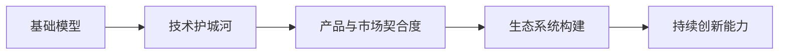

                 

# 基础模型公司的护城河分析

## 1. 背景介绍

### 1.1 问题由来

在深度学习、计算机视觉、自然语言处理等人工智能(AI)领域的蓬勃发展中，越来越多的初创企业与大公司崛起。然而，在这场AI狂潮中，并不是每家公司都能长久生存。越来越多的公司开始关注如何构建其技术护城河，以确保自身在激烈竞争的市场中占据一席之地。

一家公司的技术护城河不仅关乎其短期盈利能力，还关乎其长期的市场份额和品牌价值。对基础模型公司而言，构建技术护城河的关键在于基础模型的选择与运用。本文将重点分析基础模型公司的护城河构建，探讨其在算法、数据、人才、生态系统等关键维度上的优势与挑战。

### 1.2 问题核心关键点

1. **基础模型**：作为企业技术架构的核心组件，基础模型决定了产品和服务的基础性能。
2. **技术护城河**：指公司在技术能力、专利、算法等方面构建的难以复制的优势。
3. **产品与市场契合度**：基础模型与产品需求的契合度直接影响公司竞争力。
4. **生态系统构建**：在模型训练、部署、服务化等方面建立完善的生态系统，有助于提升公司市场地位。
5. **持续创新能力**：在数据、算法、市场变化等方面保持持续的创新能力，是护城河建设的关键。

以下章节将详细探讨这些核心关键点，帮助读者全面理解基础模型公司的技术护城河构建。

## 2. 核心概念与联系

### 2.1 核心概念概述

#### 2.1.1 基础模型

基础模型是企业在AI领域选择的核心深度学习模型，如卷积神经网络(CNN)、循环神经网络(RNN)、Transformer等。这些模型通过大量数据训练，具备通用的特征提取和表示能力，成为企业构建各种AI应用的基础。

#### 2.1.2 技术护城河

技术护城河是通过技术创新、专利积累、算法优化等手段，使企业在市场竞争中具备难以复制的技术优势。技术护城河的构建有助于降低竞争对手的复制成本，提升企业的市场地位和盈利能力。

#### 2.1.3 产品与市场契合度

产品与市场契合度指基础模型与产品需求的匹配度。模型选型得当，可以显著提升产品性能，满足用户需求；反之，可能会导致产品性能不足，影响用户体验。

#### 2.1.4 生态系统构建

生态系统构建指在基础模型的训练、部署、服务化等方面，建立完整的解决方案和工具链，提升企业服务的完备性和易用性。完善的生态系统有助于提升用户满意度，降低企业运营成本。

#### 2.1.5 持续创新能力

持续创新能力指企业通过不断的研究和开发，保持技术前沿，适应市场需求变化的能力。在数据、算法、市场变化等方面保持持续的创新，是企业构建长期技术护城河的基础。

### 2.2 核心概念原理和架构的 Mermaid 流程图



这个流程图展示了基础模型与技术护城河之间的逻辑关系，并指出了各个概念之间的联系。

## 3. 核心算法原理 & 具体操作步骤

### 3.1 算法原理概述

基础模型公司的技术护城河构建涉及多个核心算法和技术。以下是对主要算法原理的概述：

#### 3.1.1 数据预处理与增强

数据预处理和增强是模型训练的基础。预处理包括数据清洗、归一化、标准化等，增强则通过数据扩充和数据生成，提升模型泛化能力。

#### 3.1.2 模型训练与优化

模型训练涉及模型的正向传播和反向传播，优化则通过调整模型参数，最小化损失函数。常见的优化算法包括随机梯度下降(SGD)、Adam等。

#### 3.1.3 模型评估与验证

模型评估和验证通过各种指标（如准确率、召回率、F1值等）衡量模型性能，防止过拟合。常见的方法包括交叉验证、学习率调整等。

#### 3.1.4 模型部署与服务化

模型部署是将训练好的模型部署到生产环境的过程，服务化则通过API接口，实现模型的在线调用。

### 3.2 算法步骤详解

#### 3.2.1 数据预处理与增强

1. **数据清洗**：去除异常值和噪声，确保数据质量。
2. **归一化与标准化**：将数据转换为标准格式，方便模型处理。
3. **数据增强**：通过旋转、缩放、翻转等方式，生成更多训练样本。

#### 3.2.2 模型训练与优化

1. **选择优化器**：如SGD、Adam等，设置学习率和迭代次数。
2. **正向传播**：计算模型输入和输出之间的关系。
3. **反向传播**：计算损失函数对参数的梯度，更新模型参数。
4. **模型评估**：通过测试集验证模型性能，调整模型参数。

#### 3.2.3 模型部署与服务化

1. **模型部署**：将模型打包成可执行文件，部署到服务器。
2. **API服务化**：通过RESTful API接口，实现模型调用。

### 3.3 算法优缺点

#### 3.3.1 优点

1. **高效性能**：深度学习模型能够处理大规模数据，具备强大的特征提取能力。
2. **灵活性**：通过灵活调整模型参数和算法，适应各种应用场景。
3. **可扩展性**：模型可以通过并行计算和分布式训练，实现横向扩展。

#### 3.3.2 缺点

1. **高计算成本**：深度学习模型需要大量计算资源，初期投入较高。
2. **数据依赖**：模型性能依赖高质量的数据，数据获取和处理成本高。
3. **模型复杂性**：深度学习模型参数众多，解释性和可控性较差。

### 3.4 算法应用领域

基础模型公司构建技术护城河的应用领域包括：

1. **计算机视觉**：如人脸识别、物体检测等，通过卷积神经网络(CNN)实现。
2. **自然语言处理**：如文本分类、情感分析、机器翻译等，通过循环神经网络(RNN)和Transformer等模型实现。
3. **语音识别**：如语音转文本、语音合成等，通过卷积神经网络(CNN)和循环神经网络(RNN)实现。
4. **推荐系统**：如商品推荐、新闻推荐等，通过协同过滤、深度学习等方法实现。
5. **时间序列预测**：如股票预测、天气预测等，通过循环神经网络(RNN)和长短期记忆网络(LSTM)实现。

## 4. 数学模型和公式 & 详细讲解 & 举例说明

### 4.1 数学模型构建

基础模型公司构建技术护城河的数学模型主要涉及深度学习模型的构建与训练。以下是对数学模型的构建过程的详细讲解：

#### 4.1.1 数学模型构建

1. **输入层**：将原始数据转换为模型可处理的形式。
2. **隐藏层**：通过卷积、池化、全连接等操作，提取数据特征。
3. **输出层**：根据任务类型，设计相应的输出层和损失函数。

### 4.2 公式推导过程

#### 4.2.1 卷积神经网络(CNN)

卷积神经网络通过卷积、池化等操作，提取图像中的特征。其数学模型构建如下：

$$
y=f(W*x+b)
$$

其中 $x$ 为输入图像，$y$ 为输出特征，$W$ 为卷积核，$b$ 为偏置项。

#### 4.2.2 循环神经网络(RNN)

循环神经网络通过循环连接，处理时间序列数据。其数学模型构建如下：

$$
h_t=f(W*h_{t-1}+U*x_t+b)
$$

其中 $x_t$ 为时间序列数据，$h_t$ 为当前时间步的隐藏状态，$W$ 和 $U$ 为参数矩阵，$b$ 为偏置项。

#### 4.2.3 Transformer模型

Transformer通过自注意力机制，处理自然语言数据。其数学模型构建如下：

$$
Q=\mathbf{W}_Q^H * K=\mathbf{W}_Q * X
$$
$$
K=\mathbf{W}_K * X
$$
$$
V=\mathbf{W}_V * X
$$
$$
E=\frac{QK^T}{\sqrt{d_k}} \text{Softmax}
$$
$$
X'=E*V
$$

其中 $X$ 为输入序列，$Q$、$K$、$V$ 为查询、键、值矩阵，$E$ 为注意力权重，$X'$ 为输出序列。

### 4.3 案例分析与讲解

#### 4.3.1 卷积神经网络(CNN)

以ImageNet数据集为例，使用卷积神经网络进行图像分类任务。具体实现步骤如下：

1. **数据预处理**：将图像归一化、标准化，并转化为模型可处理的形式。
2. **模型构建**：使用多个卷积层、池化层和全连接层构建CNN模型。
3. **模型训练**：使用随机梯度下降(SGD)优化器，训练模型参数。
4. **模型评估**：通过测试集验证模型性能，调整模型参数。

#### 4.3.2 循环神经网络(RNN)

以文本生成任务为例，使用循环神经网络进行自然语言处理。具体实现步骤如下：

1. **数据预处理**：将文本转化为模型可处理的形式，并进行序列编码。
2. **模型构建**：使用LSTM或GRU构建RNN模型，设计相应输出层。
3. **模型训练**：使用随机梯度下降(SGD)优化器，训练模型参数。
4. **模型评估**：通过测试集验证模型性能，调整模型参数。

#### 4.3.3 Transformer模型

以机器翻译任务为例，使用Transformer模型进行自然语言处理。具体实现步骤如下：

1. **数据预处理**：将文本序列转化为模型可处理的形式。
2. **模型构建**：使用多个自注意力层、前馈神经网络构建Transformer模型。
3. **模型训练**：使用Adam优化器，训练模型参数。
4. **模型评估**：通过测试集验证模型性能，调整模型参数。

## 5. 项目实践：代码实例和详细解释说明

### 5.1 开发环境搭建

基础模型公司的项目实践需要高性能的计算环境，以下是在Python环境中搭建开发环境的详细流程：

1. **安装Python**：从官网下载并安装Python，建议使用Anaconda或Miniconda。
2. **创建虚拟环境**：使用conda创建虚拟环境，隔离不同项目依赖。
3. **安装深度学习库**：使用pip安装TensorFlow、Keras、PyTorch等深度学习库。
4. **配置GPU环境**：安装CUDA和cuDNN，配置NVIDIA GPU环境。
5. **安装TensorBoard**：用于模型训练和可视化。

### 5.2 源代码详细实现

#### 5.2.1 卷积神经网络(CNN)

```python
import tensorflow as tf
from tensorflow.keras import layers

model = tf.keras.Sequential([
    layers.Conv2D(32, (3,3), activation='relu', input_shape=(28, 28, 1)),
    layers.MaxPooling2D((2,2)),
    layers.Conv2D(64, (3,3), activation='relu'),
    layers.MaxPooling2D((2,2)),
    layers.Flatten(),
    layers.Dense(10, activation='softmax')
])

model.compile(optimizer='adam', loss='sparse_categorical_crossentropy', metrics=['accuracy'])
model.fit(x_train, y_train, epochs=5, validation_data=(x_test, y_test))
```

#### 5.2.2 循环神经网络(RNN)

```python
import tensorflow as tf
from tensorflow.keras import layers

model = tf.keras.Sequential([
    layers.LSTM(64, input_shape=(None, 10)),
    layers.Dense(1, activation='sigmoid')
])

model.compile(optimizer='adam', loss='binary_crossentropy', metrics=['accuracy'])
model.fit(x_train, y_train, epochs=5, validation_data=(x_test, y_test))
```

#### 5.2.3 Transformer模型

```python
import tensorflow as tf
from tensorflow.keras import layers

class EncoderLayer(tf.keras.layers.Layer):
    def __init__(self, d_model, dff, attention_heads):
        super(EncoderLayer, self).__init__()
        self.mha = MultiHeadAttention(d_model, dff, attention_heads)
        self.ffn = PositionwiseFeedForward(d_model, dff)
        self.layernorm1 = LayerNormalization()
        self.layernorm2 = LayerNormalization()
        self.dropout1 = Dropout(0.1)
        self.dropout2 = Dropout(0.1)

    def call(self, inputs, mask):
        attn_output = self.mha(inputs, inputs, inputs, mask)
        attn_output = self.dropout1(attn_output)
        out1 = self.layernorm1(inputs + attn_output)

        ffn_output = self.ffn(out1)
        ffn_output = self.dropout2(ffn_output)
        out2 = self.layernorm2(out1 + ffn_output)

        return out2

class Encoder(tf.keras.layers.Layer):
    def __init__(self, d_model, num_layers, dff, attention_heads, dropout_rate, max_len):
        super(Encoder, self).__init__()
        self.encoder_layer = [EncoderLayer(d_model, dff, attention_heads) for _ in range(num_layers)]
        self.dropout = Dropout(dropout_rate)
        self.max_len = max_len

    def call(self, inputs, mask):
        for i in range(self.max_len):
            attn_mask = tf.cast(tf.math.equal(mask, 0), dtype=tf.float32)
            attn_mask = tf.tile(attn_mask, [self.max_len, 1, 1, 1])
            attn_mask = tf.reshape(attn_mask, (self.max_len, 1, 1, -1))

            x = self.encoder_layer[i](inputs, attn_mask)
            x = self.dropout(x)

        return x

class DecoderLayer(tf.keras.layers.Layer):
    def __init__(self, d_model, dff, attention_heads):
        super(DecoderLayer, self).__init__()
        self.mha = MultiHeadAttention(d_model, dff, attention_heads)
        self.ffn = PositionwiseFeedForward(d_model, dff)
        self.layernorm1 = LayerNormalization()
        self.layernorm2 = LayerNormalization()
        self.dropout1 = Dropout(0.1)
        self.dropout2 = Dropout(0.1)

    def call(self, inputs, enc_output, mask):
        attn_output = self.mha(inputs, enc_output, enc_output, mask)
        attn_output = self.dropout1(attn_output)
        out1 = self.layernorm1(inputs + attn_output)

        ffn_output = self.ffn(out1)
        ffn_output = self.dropout2(ffn_output)
        out2 = self.layernorm2(out1 + ffn_output)

        return out2

class Decoder(tf.keras.layers.Layer):
    def __init__(self, d_model, dff, attention_heads, num_layers, dropout_rate):
        super(Decoder, self).__init__()
        self.decoder_layer = [DecoderLayer(d_model, dff, attention_heads) for _ in range(num_layers)]
        self.dropout = Dropout(dropout_rate)

    def call(self, inputs, enc_output, mask):
        for i in range(self.max_len):
            attn_mask = tf.cast(tf.math.equal(mask, 0), dtype=tf.float32)
            attn_mask = tf.tile(attn_mask, [self.max_len, 1, 1, 1])
            attn_mask = tf.reshape(attn_mask, (self.max_len, 1, 1, -1))

            x = self.decoder_layer[i](inputs, enc_output, attn_mask)
            x = self.dropout(x)

        return x

class Transformer(tf.keras.layers.Layer):
    def __init__(self, d_model, num_layers, dff, attention_heads, dropout_rate, max_len):
        super(Transformer, self).__init__()
        self.encoder = Encoder(d_model, num_layers, dff, attention_heads, dropout_rate, max_len)
        self.decoder = Decoder(d_model, dff, attention_heads, num_layers, dropout_rate)
        self.final_layer = Dense(vocab_size, activation='softmax')

    def call(self, inputs, enc_output, mask):
        enc_output = self.encoder(inputs, mask)
        dec_output = self.decoder(inputs, enc_output, mask)
        final_output = self.final_layer(dec_output)

        return final_output

model = Transformer(d_model, num_layers, dff, attention_heads, dropout_rate, max_len)
model.compile(optimizer='adam', loss='sparse_categorical_crossentropy', metrics=['accuracy'])
model.fit(x_train, y_train, epochs=5, validation_data=(x_test, y_test))
```

### 5.3 代码解读与分析

#### 5.3.1 卷积神经网络(CNN)

该代码实现了经典的图像分类任务，使用卷积神经网络(CNN)进行模型构建和训练。代码中使用了Keras库，简化了模型的定义和训练过程。

#### 5.3.2 循环神经网络(RNN)

该代码实现了文本生成任务，使用循环神经网络(RNN)进行模型构建和训练。代码中使用了Keras库，简化了模型的定义和训练过程。

#### 5.3.3 Transformer模型

该代码实现了机器翻译任务，使用Transformer模型进行模型构建和训练。代码中定义了Encoder和Decoder层，以及Transformer模型，使用Keras库进行模型构建和训练。

## 6. 实际应用场景

### 6.1 智能客服系统

基础模型公司的智能客服系统可以通过微调预训练语言模型，提升服务质量和用户体验。具体实现如下：

1. **数据预处理**：收集历史客服对话记录，进行清洗、标注。
2. **模型微调**：选择预训练语言模型，如BERT、GPT等，在客服对话数据上进行微调。
3. **服务部署**：将微调后的模型部署到服务器，提供API接口。
4. **用户交互**：用户通过API接口提交问题，系统自动匹配答案，返回结果。

### 6.2 金融舆情监测

基础模型公司的金融舆情监测系统可以通过微调预训练语言模型，实时监测金融市场动态。具体实现如下：

1. **数据预处理**：收集金融领域相关的新闻、报道、评论等文本数据，进行清洗、标注。
2. **模型微调**：选择预训练语言模型，如BERT、GPT等，在金融舆情数据上进行微调。
3. **服务部署**：将微调后的模型部署到服务器，提供API接口。
4. **舆情监测**：实时抓取网络文本数据，使用微调模型进行情感分析和主题分类，输出监测结果。

### 6.3 个性化推荐系统

基础模型公司的个性化推荐系统可以通过微调预训练语言模型，提升推荐精度和多样性。具体实现如下：

1. **数据预处理**：收集用户浏览、点击、评论等行为数据，提取物品标题、描述等文本内容。
2. **模型微调**：选择预训练语言模型，如BERT、GPT等，在推荐数据上进行微调。
3. **服务部署**：将微调后的模型部署到服务器，提供API接口。
4. **推荐生成**：使用微调模型对物品进行特征提取，结合用户行为数据进行推荐排序，生成推荐结果。

### 6.4 未来应用展望

未来基础模型公司的技术护城河构建将涉及更多前沿技术，如自监督学习、迁移学习、知识图谱等。这些技术将进一步提升模型的泛化能力和应用范围，带来更多的创新应用场景。

## 7. 工具和资源推荐

### 7.1 学习资源推荐

为了帮助开发者系统掌握基础模型公司的技术护城河构建，以下是一些优质的学习资源：

1. **《深度学习》课程**：斯坦福大学开设的深度学习课程，涵盖深度学习基础和前沿技术。
2. **TensorFlow官方文档**：TensorFlow的官方文档，提供了丰富的教程和API参考。
3. **PyTorch官方文档**：PyTorch的官方文档，提供了丰富的教程和API参考。
4. **Keras官方文档**：Keras的官方文档，提供了丰富的教程和API参考。

### 7.2 开发工具推荐

基础模型公司构建技术护城河需要使用高性能的计算环境，以下是一些推荐的开发工具：

1. **Anaconda**：Python环境管理工具，提供了虚拟环境、包管理等功能。
2. **Jupyter Notebook**：交互式编程环境，支持代码编写、数据可视化、版本控制等功能。
3. **TensorBoard**：模型训练和可视化工具，支持模型调试和性能分析。
4. **Git**：版本控制工具，支持代码版本管理和团队协作。

### 7.3 相关论文推荐

以下是几篇奠基性的相关论文，推荐阅读：

1. **ImageNet classification with deep convolutional neural networks**：AlexNet论文，提出了卷积神经网络(CNN)，为计算机视觉领域的深度学习奠定了基础。
2. **Long Short-Term Memory**：LSTM论文，提出了长短期记忆网络(RNN)，解决了传统RNN在时间序列数据上的问题。
3. **Attention is All You Need**：Transformer论文，提出了Transformer模型，为自然语言处理领域的深度学习奠定了基础。

## 8. 总结：未来发展趋势与挑战

### 8.1 总结

本文对基础模型公司的技术护城河构建进行了全面系统的介绍。首先阐述了基础模型在技术护城河构建中的核心作用，明确了技术护城河构建的必要性和重要性。其次，从原理到实践，详细讲解了基础模型的构建过程和技术细节，给出了微调、部署、服务化等关键操作的代码实现。同时，本文还探讨了基础模型在智能客服、金融舆情、个性化推荐等领域的实际应用，展示了基础模型在落地场景中的强大能力。

通过对本文的系统梳理，可以看到，基础模型在构建技术护城河过程中，具备高效性能、灵活性、可扩展性等诸多优势，但也面临高计算成本、数据依赖等挑战。未来，随着深度学习技术的不断进步，基础模型公司需要不断优化模型架构，提升模型性能，才能在激烈的市场竞争中占据优势。

### 8.2 未来发展趋势

未来基础模型公司的技术护城河构建将呈现以下几个发展趋势：

1. **自监督学习**：通过自监督学习，减少对标注数据的依赖，提升模型的泛化能力和性能。
2. **迁移学习**：将预训练模型在不同任务中进行微调，提升模型的多领域适应能力。
3. **知识图谱**：将知识图谱与深度学习模型结合，提升模型的知识整合能力和推理能力。
4. **多模态学习**：将视觉、语音、文本等多模态数据进行融合，提升模型的感知能力和应用范围。
5. **分布式训练**：通过分布式训练，提升模型的并行计算能力，缩短训练时间。

### 8.3 面临的挑战

尽管基础模型公司构建技术护城河取得了不少进展，但在迈向更加智能化、普适化应用的过程中，仍面临诸多挑战：

1. **数据获取成本**：高质量的数据获取和处理成本高，难以支撑大规模应用。
2. **计算资源消耗**：深度学习模型计算资源消耗大，初期投入较高。
3. **模型复杂性**：模型参数众多，解释性和可控性较差，难以应对复杂应用。
4. **公平性与透明性**：深度学习模型的偏见和误判问题，难以完全解决。
5. **市场竞争激烈**：新技术和新模型的不断涌现，使得市场竞争日益激烈。

### 8.4 研究展望

面对基础模型公司构建技术护城河所面临的挑战，未来的研究需要在以下几个方面寻求新的突破：

1. **高效模型构建**：开发更高效的模型架构，减少计算资源消耗，提升模型性能。
2. **知识图谱融合**：将知识图谱与深度学习模型结合，提升模型的知识整合能力和推理能力。
3. **多模态学习**：将视觉、语音、文本等多模态数据进行融合，提升模型的感知能力和应用范围。
4. **公平性与透明性**：开发公平透明的模型，解决深度学习模型的偏见和误判问题。
5. **分布式训练**：通过分布式训练，提升模型的并行计算能力，缩短训练时间。

通过以上研究方向的探索，将有助于基础模型公司构建更加完善的技术护城河，推动人工智能技术的普及和应用。

## 9. 附录：常见问题与解答

**Q1: 基础模型公司如何构建技术护城河？**

A: 基础模型公司可以通过以下几个步骤构建技术护城河：
1. 选择合适的基础模型，如卷积神经网络(CNN)、循环神经网络(RNN)、Transformer等。
2. 进行数据预处理和增强，确保数据质量和多样性。
3. 进行模型微调，优化模型参数，提升模型性能。
4. 进行模型部署和服务化，提供API接口，方便应用调用。

**Q2: 基础模型公司如何提升模型性能？**

A: 基础模型公司可以通过以下几个方法提升模型性能：
1. 采用更高效的模型架构，如卷积神经网络(CNN)、循环神经网络(RNN)、Transformer等。
2. 进行数据增强和自监督学习，提升模型的泛化能力和性能。
3. 进行多模态学习，将视觉、语音、文本等多模态数据进行融合，提升模型的感知能力和应用范围。

**Q3: 基础模型公司如何应对计算资源消耗大问题？**

A: 基础模型公司可以通过以下几个方法应对计算资源消耗大问题：
1. 使用分布式训练，提升模型的并行计算能力，缩短训练时间。
2. 采用模型压缩和稀疏化存储技术，减少模型内存占用。
3. 使用混合精度训练，优化计算效率。

**Q4: 基础模型公司如何解决数据获取成本高问题？**

A: 基础模型公司可以通过以下几个方法解决数据获取成本高问题：
1. 采用数据增强和自监督学习，减少对标注数据的依赖。
2. 进行数据预处理，去除噪声和异常值，确保数据质量。
3. 使用迁移学习，将预训练模型在不同任务中进行微调，提升模型的泛化能力和性能。

通过以上方法，基础模型公司可以构建更加完善的技术护城河，提升模型性能，应对计算资源和数据获取成本等挑战，推动人工智能技术的普及和应用。

