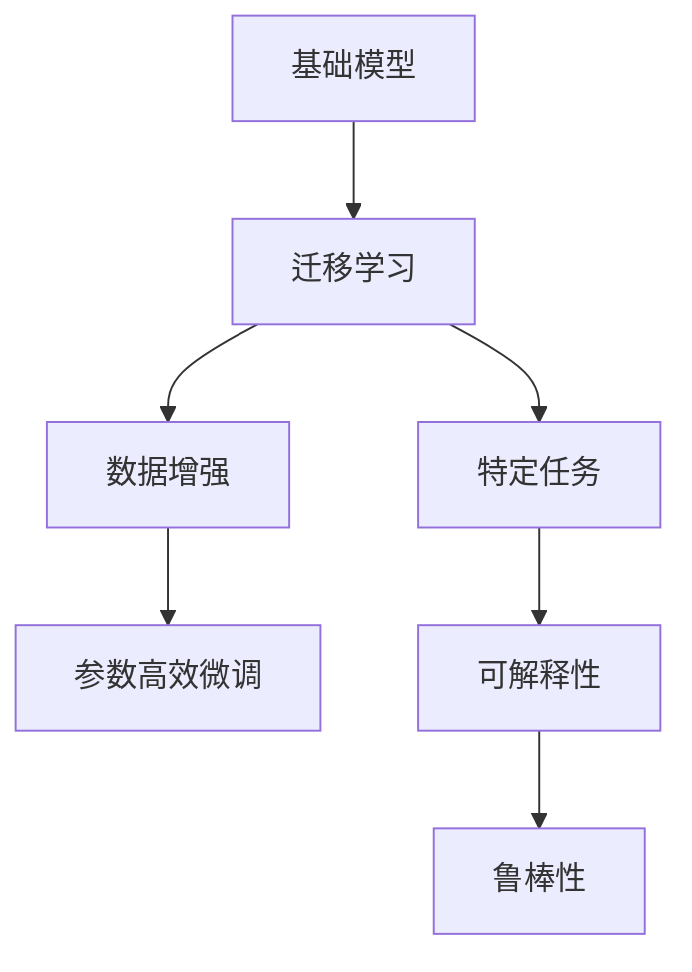

                 

# 基础模型的垂直领域应用

> 关键词：
> 基础模型, 
> 垂直领域, 
> 迁移学习, 
> 数据增强, 
> 参数高效微调, 
> 特定任务, 
> 可解释性

## 1. 背景介绍

### 1.1 问题由来
在人工智能领域，模型应用的最常见场景是将一个模型的知识迁移到另一个领域或特定任务。这一过程被称为迁移学习。预训练的大模型（如BERT、GPT、RoBERTa等）已经成为迁移学习的重要工具。这些模型通过在大量无标签文本数据上预训练，学习到通用的语言表示，然后在特定任务上微调（fine-tuning）以获得更好的性能。

垂直领域应用是迁移学习的一种具体形式，它涉及到将预训练模型应用于特定的领域或任务，而不是通用的NLP任务。这种做法可以显著减少数据和计算资源的需求，提高模型在特定任务上的准确性和效率。

### 1.2 问题核心关键点
垂直领域应用的核心关键点包括：
- 选择合适的预训练模型和任务适配层
- 数据集的选择与处理
- 微调的策略与技巧
- 模型性能评估与调优
- 模型的可解释性与鲁棒性

这些关键点决定了模型在特定领域的应用效果。下面将详细讨论这些问题。

## 2. 核心概念与联系

### 2.1 核心概念概述

在垂直领域应用中，核心概念主要包括：

- **基础模型**：预训练的大规模语言模型，如BERT、GPT-2、RoBERTa等。
- **迁移学习**：通过将模型在通用数据上训练的知识迁移到特定任务上，以减少训练时间和标注数据需求。
- **数据增强**：通过对训练数据进行扩充和处理，提高模型泛化能力。
- **参数高效微调**：只微调模型的一部分参数，保持大部分参数不变，以提高计算效率。
- **特定任务**：如问答、命名实体识别、情感分析等，模型需要针对这些任务进行微调。
- **可解释性**：模型的决策过程需要可解释，以便于理解和使用。
- **鲁棒性**：模型在面对噪声数据、异常情况时，仍能保持较高的准确性。

这些概念通过以下Mermaid流程图来展示：



这个流程图展示了基础模型和迁移学习之间的关系，以及这些概念如何共同作用于特定任务。

## 3. 核心算法原理 & 具体操作步骤

### 3.1 算法原理概述
基于迁移学习的大模型垂直领域应用，其核心思想是通过预训练模型在不同任务上的迁移，从而在特定任务上获得更好的性能。具体流程如下：

1. **数据准备**：收集并准备特定任务的数据集。
2. **模型适配**：在预训练模型的基础上，添加或修改任务适配层，以适应特定任务的输出需求。
3. **微调**：使用特定任务的数据集，通过有监督学习微调模型参数，以提高模型在该任务上的性能。
4. **评估与调优**：在验证集上评估模型性能，根据评估结果调整模型参数，重复训练过程，直到模型达到满意的性能。

### 3.2 算法步骤详解

#### 3.2.1 数据准备
- **数据收集**：收集特定领域的数据集，确保数据集的多样性和代表性。
- **数据预处理**：清洗数据，去除噪声和无用信息，进行分词、词性标注等处理。
- **数据划分**：将数据集划分为训练集、验证集和测试集，通常采用70:15:15的比例。

#### 3.2.2 模型适配
- **适配层设计**：根据特定任务，在预训练模型的顶层添加或修改适配层。例如，对于分类任务，通常添加一个全连接层和Softmax层；对于序列生成任务，通常使用Transformer的解码器。
- **输出损失函数**：选择适合特定任务的损失函数，例如交叉熵损失、均方误差损失等。

#### 3.2.3 微调
- **模型初始化**：将预训练模型的参数作为微调模型的初始化参数。
- **学习率设置**：选择合适的学习率，通常比预训练时小，以避免破坏预训练权重。
- **优化器选择**：选择适合特定任务的优化器，例如Adam、SGD等。
- **训练过程**：使用训练集对模型进行有监督学习微调，在每个epoch后评估模型在验证集上的性能，根据性能调整学习率或停止训练。

#### 3.2.4 评估与调优
- **评估指标**：选择适合特定任务的评估指标，例如准确率、F1分数、ROC曲线等。
- **超参数调优**：根据评估指标，调整模型的超参数，例如学习率、批量大小、迭代次数等。
- **模型优化**：使用数据增强、对抗训练等技术，进一步提高模型性能。

### 3.3 算法优缺点

#### 3.3.1 优点
- **高效**：相比于从头训练模型，微调可以显著减少训练时间和标注数据需求。
- **性能提升**：通过微调，模型在特定任务上通常能够获得更好的性能。
- **可解释性**：微调模型通常具有良好的可解释性，便于理解和调试。

#### 3.3.2 缺点
- **依赖标注数据**：微调的效果很大程度上取决于标注数据的质量和数量，标注数据的获取成本较高。
- **泛化能力有限**：当目标任务与预训练数据的分布差异较大时，微调的性能提升有限。
- **负面效果传递**：预训练模型的固有偏见、有害信息等，可能通过微调传递到下游任务，造成负面影响。

## 4. 数学模型和公式 & 详细讲解

### 4.1 数学模型构建

在垂直领域应用中，我们通常使用以下数学模型进行建模：

设预训练模型为 $M_{\theta}$，特定任务的数据集为 $D=\{(x_i,y_i)\}_{i=1}^N$，其中 $x_i$ 为输入数据，$y_i$ 为对应的标签。定义模型在数据样本 $(x,y)$ 上的损失函数为 $\ell(M_{\theta}(x),y)$，则在数据集 $D$ 上的经验风险为：

$$
\mathcal{L}(\theta) = \frac{1}{N}\sum_{i=1}^N \ell(M_{\theta}(x_i),y_i)
$$

微调的优化目标是最小化经验风险，即找到最优参数：

$$
\theta^* = \mathop{\arg\min}_{\theta} \mathcal{L}(\theta)
$$

在实践中，我们通常使用基于梯度的优化算法（如Adam、SGD等）来近似求解上述最优化问题。设 $\eta$ 为学习率，$\lambda$ 为正则化系数，则参数的更新公式为：

$$
\theta \leftarrow \theta - \eta \nabla_{\theta}\mathcal{L}(\theta) - \eta\lambda\theta
$$

其中 $\nabla_{\theta}\mathcal{L}(\theta)$ 为损失函数对参数 $\theta$ 的梯度，可通过反向传播算法高效计算。

### 4.2 公式推导过程

以二分类任务为例，推导交叉熵损失函数及其梯度的计算公式。

假设模型 $M_{\theta}$ 在输入 $x$ 上的输出为 $\hat{y}=M_{\theta}(x) \in [0,1]$，表示样本属于正类的概率。真实标签 $y \in \{0,1\}$。则二分类交叉熵损失函数定义为：

$$
\ell(M_{\theta}(x),y) = -[y\log \hat{y} + (1-y)\log (1-\hat{y})]
$$

将其代入经验风险公式，得：

$$
\mathcal{L}(\theta) = -\frac{1}{N}\sum_{i=1}^N [y_i\log M_{\theta}(x_i)+(1-y_i)\log(1-M_{\theta}(x_i))]
$$

根据链式法则，损失函数对参数 $\theta_k$ 的梯度为：

$$
\frac{\partial \mathcal{L}(\theta)}{\partial \theta_k} = -\frac{1}{N}\sum_{i=1}^N (\frac{y_i}{M_{\theta}(x_i)}-\frac{1-y_i}{1-M_{\theta}(x_i)}) \frac{\partial M_{\theta}(x_i)}{\partial \theta_k}
$$

其中 $\frac{\partial M_{\theta}(x_i)}{\partial \theta_k}$ 可进一步递归展开，利用自动微分技术完成计算。

### 4.3 案例分析与讲解

以命名实体识别（NER）任务为例，分析模型的微调过程。

1. **数据准备**：收集包含命名实体标注的数据集，如CoNLL-2003、CoNLL-2002等，这些数据集通常包括人名、地名、机构名等命名实体的边界信息。
2. **模型适配**：使用BERT等预训练模型，在其顶层添加一个全连接层和Softmax层，用于分类实体的类型。
3. **微调**：使用标注数据集对模型进行微调，通过交叉熵损失函数训练模型，使其能够识别实体边界和类型。
4. **评估与调优**：在验证集上评估模型性能，根据F1分数等指标调整学习率、批量大小等超参数，进一步提高模型准确性。

## 5. 项目实践：代码实例和详细解释说明

### 5.1 开发环境搭建

在进行垂直领域应用实践前，我们需要准备好开发环境。以下是使用Python进行PyTorch开发的环境配置流程：

1. 安装Anaconda：从官网下载并安装Anaconda，用于创建独立的Python环境。

2. 创建并激活虚拟环境：
```bash
conda create -n pytorch-env python=3.8 
conda activate pytorch-env
```

3. 安装PyTorch：根据CUDA版本，从官网获取对应的安装命令。例如：
```bash
conda install pytorch torchvision torchaudio cudatoolkit=11.1 -c pytorch -c conda-forge
```

4. 安装Transformers库：
```bash
pip install transformers
```

5. 安装各类工具包：
```bash
pip install numpy pandas scikit-learn matplotlib tqdm jupyter notebook ipython
```

完成上述步骤后，即可在`pytorch-env`环境中开始垂直领域应用实践。

### 5.2 源代码详细实现

这里我们以命名实体识别（NER）任务为例，给出使用Transformers库对BERT模型进行微调的PyTorch代码实现。

首先，定义NER任务的数据处理函数：

```python
from transformers import BertTokenizer
from torch.utils.data import Dataset
import torch

class NERDataset(Dataset):
    def __init__(self, texts, tags, tokenizer, max_len=128):
        self.texts = texts
        self.tags = tags
        self.tokenizer = tokenizer
        self.max_len = max_len
        
    def __len__(self):
        return len(self.texts)
    
    def __getitem__(self, item):
        text = self.texts[item]
        tags = self.tags[item]
        
        encoding = self.tokenizer(text, return_tensors='pt', max_length=self.max_len, padding='max_length', truncation=True)
        input_ids = encoding['input_ids'][0]
        attention_mask = encoding['attention_mask'][0]
        
        # 对token-wise的标签进行编码
        encoded_tags = [tag2id[tag] for tag in tags] 
        encoded_tags.extend([tag2id['O']] * (self.max_len - len(encoded_tags)))
        labels = torch.tensor(encoded_tags, dtype=torch.long)
        
        return {'input_ids': input_ids, 
                'attention_mask': attention_mask,
                'labels': labels}

# 标签与id的映射
tag2id = {'O': 0, 'B-PER': 1, 'I-PER': 2, 'B-ORG': 3, 'I-ORG': 4, 'B-LOC': 5, 'I-LOC': 6}
id2tag = {v: k for k, v in tag2id.items()}

# 创建dataset
tokenizer = BertTokenizer.from_pretrained('bert-base-cased')

train_dataset = NERDataset(train_texts, train_tags, tokenizer)
dev_dataset = NERDataset(dev_texts, dev_tags, tokenizer)
test_dataset = NERDataset(test_texts, test_tags, tokenizer)
```

然后，定义模型和优化器：

```python
from transformers import BertForTokenClassification, AdamW

model = BertForTokenClassification.from_pretrained('bert-base-cased', num_labels=len(tag2id))

optimizer = AdamW(model.parameters(), lr=2e-5)
```

接着，定义训练和评估函数：

```python
from torch.utils.data import DataLoader
from tqdm import tqdm
from sklearn.metrics import classification_report

device = torch.device('cuda') if torch.cuda.is_available() else torch.device('cpu')
model.to(device)

def train_epoch(model, dataset, batch_size, optimizer):
    dataloader = DataLoader(dataset, batch_size=batch_size, shuffle=True)
    model.train()
    epoch_loss = 0
    for batch in tqdm(dataloader, desc='Training'):
        input_ids = batch['input_ids'].to(device)
        attention_mask = batch['attention_mask'].to(device)
        labels = batch['labels'].to(device)
        model.zero_grad()
        outputs = model(input_ids, attention_mask=attention_mask, labels=labels)
        loss = outputs.loss
        epoch_loss += loss.item()
        loss.backward()
        optimizer.step()
    return epoch_loss / len(dataloader)

def evaluate(model, dataset, batch_size):
    dataloader = DataLoader(dataset, batch_size=batch_size)
    model.eval()
    preds, labels = [], []
    with torch.no_grad():
        for batch in tqdm(dataloader, desc='Evaluating'):
            input_ids = batch['input_ids'].to(device)
            attention_mask = batch['attention_mask'].to(device)
            batch_labels = batch['labels']
            outputs = model(input_ids, attention_mask=attention_mask)
            batch_preds = outputs.logits.argmax(dim=2).to('cpu').tolist()
            batch_labels = batch_labels.to('cpu').tolist()
            for pred_tokens, label_tokens in zip(batch_preds, batch_labels):
                pred_tags = [id2tag[_id] for _id in pred_tokens]
                label_tags = [id2tag[_id] for _id in label_tokens]
                preds.append(pred_tags[:len(label_tags)])
                labels.append(label_tags)
                
    print(classification_report(labels, preds))
```

最后，启动训练流程并在测试集上评估：

```python
epochs = 5
batch_size = 16

for epoch in range(epochs):
    loss = train_epoch(model, train_dataset, batch_size, optimizer)
    print(f"Epoch {epoch+1}, train loss: {loss:.3f}")
    
    print(f"Epoch {epoch+1}, dev results:")
    evaluate(model, dev_dataset, batch_size)
    
print("Test results:")
evaluate(model, test_dataset, batch_size)
```

以上就是使用PyTorch对BERT进行命名实体识别任务微调的完整代码实现。可以看到，得益于Transformers库的强大封装，我们可以用相对简洁的代码完成BERT模型的加载和微调。

### 5.3 代码解读与分析

让我们再详细解读一下关键代码的实现细节：

**NERDataset类**：
- `__init__`方法：初始化文本、标签、分词器等关键组件。
- `__len__`方法：返回数据集的样本数量。
- `__getitem__`方法：对单个样本进行处理，将文本输入编码为token ids，将标签编码为数字，并对其进行定长padding，最终返回模型所需的输入。

**tag2id和id2tag字典**：
- 定义了标签与数字id之间的映射关系，用于将token-wise的预测结果解码回真实的标签。

**训练和评估函数**：
- 使用PyTorch的DataLoader对数据集进行批次化加载，供模型训练和推理使用。
- 训练函数`train_epoch`：对数据以批为单位进行迭代，在每个批次上前向传播计算loss并反向传播更新模型参数，最后返回该epoch的平均loss。
- 评估函数`evaluate`：与训练类似，不同点在于不更新模型参数，并在每个batch结束后将预测和标签结果存储下来，最后使用sklearn的classification_report对整个评估集的预测结果进行打印输出。

**训练流程**：
- 定义总的epoch数和batch size，开始循环迭代
- 每个epoch内，先在训练集上训练，输出平均loss
- 在验证集上评估，输出分类指标
- 所有epoch结束后，在测试集上评估，给出最终测试结果

可以看到，PyTorch配合Transformers库使得BERT微调的代码实现变得简洁高效。开发者可以将更多精力放在数据处理、模型改进等高层逻辑上，而不必过多关注底层的实现细节。

当然，工业级的系统实现还需考虑更多因素，如模型的保存和部署、超参数的自动搜索、更灵活的任务适配层等。但核心的微调范式基本与此类似。

## 6. 实际应用场景

### 6.1 智能客服系统

基于大语言模型垂直领域应用的对话技术，可以广泛应用于智能客服系统的构建。传统客服往往需要配备大量人力，高峰期响应缓慢，且一致性和专业性难以保证。而使用垂直领域应用的对话模型，可以7x24小时不间断服务，快速响应客户咨询，用自然流畅的语言解答各类常见问题。

在技术实现上，可以收集企业内部的历史客服对话记录，将问题和最佳答复构建成监督数据，在此基础上对预训练对话模型进行微调。微调后的对话模型能够自动理解用户意图，匹配最合适的答案模板进行回复。对于客户提出的新问题，还可以接入检索系统实时搜索相关内容，动态组织生成回答。如此构建的智能客服系统，能大幅提升客户咨询体验和问题解决效率。

### 6.2 金融舆情监测

金融机构需要实时监测市场舆论动向，以便及时应对负面信息传播，规避金融风险。传统的人工监测方式成本高、效率低，难以应对网络时代海量信息爆发的挑战。基于大语言模型垂直领域应用的文本分类和情感分析技术，为金融舆情监测提供了新的解决方案。

具体而言，可以收集金融领域相关的新闻、报道、评论等文本数据，并对其进行主题标注和情感标注。在此基础上对预训练语言模型进行微调，使其能够自动判断文本属于何种主题，情感倾向是正面、中性还是负面。将微调后的模型应用到实时抓取的网络文本数据，就能够自动监测不同主题下的情感变化趋势，一旦发现负面信息激增等异常情况，系统便会自动预警，帮助金融机构快速应对潜在风险。

### 6.3 个性化推荐系统

当前的推荐系统往往只依赖用户的历史行为数据进行物品推荐，无法深入理解用户的真实兴趣偏好。基于大语言模型垂直领域应用的个性化推荐系统可以更好地挖掘用户行为背后的语义信息，从而提供更精准、多样的推荐内容。

在实践中，可以收集用户浏览、点击、评论、分享等行为数据，提取和用户交互的物品标题、描述、标签等文本内容。将文本内容作为模型输入，用户的后续行为（如是否点击、购买等）作为监督信号，在此基础上微调预训练语言模型。微调后的模型能够从文本内容中准确把握用户的兴趣点。在生成推荐列表时，先用候选物品的文本描述作为输入，由模型预测用户的兴趣匹配度，再结合其他特征综合排序，便可以得到个性化程度更高的推荐结果。

### 6.4 未来应用展望

随着大语言模型垂直领域应用的发展，基于微调的方法将在更多领域得到应用，为传统行业带来变革性影响。

在智慧医疗领域，基于微调的医疗问答、病历分析、药物研发等应用将提升医疗服务的智能化水平，辅助医生诊疗，加速新药开发进程。

在智能教育领域，微调技术可应用于作业批改、学情分析、知识推荐等方面，因材施教，促进教育公平，提高教学质量。

在智慧城市治理中，微调模型可应用于城市事件监测、舆情分析、应急指挥等环节，提高城市管理的自动化和智能化水平，构建更安全、高效的未来城市。

此外，在企业生产、社会治理、文娱传媒等众多领域，基于大语言模型垂直领域应用的AI应用也将不断涌现，为NLP技术带来了全新的突破。随着预训练语言模型和微调方法的不断进步，相信NLP技术将在更广阔的应用领域大放异彩，深刻影响人类的生产生活方式。

## 7. 工具和资源推荐

### 7.1 学习资源推荐

为了帮助开发者系统掌握大语言模型垂直领域应用的理论基础和实践技巧，这里推荐一些优质的学习资源：

1. 《Transformer from scratch》系列博文：由大模型技术专家撰写，深入浅出地介绍了Transformer原理、BERT模型、垂直领域应用等前沿话题。

2. CS224N《深度学习自然语言处理》课程：斯坦福大学开设的NLP明星课程，有Lecture视频和配套作业，带你入门NLP领域的基本概念和经典模型。

3. 《Natural Language Processing with Transformers》书籍：Transformers库的作者所著，全面介绍了如何使用Transformers库进行NLP任务开发，包括垂直领域应用在内的诸多范式。

4. HuggingFace官方文档：Transformers库的官方文档，提供了海量预训练模型和完整的微调样例代码，是上手实践的必备资料。

5. CLUE开源项目：中文语言理解测评基准，涵盖大量不同类型的中文NLP数据集，并提供了基于微调的baseline模型，助力中文NLP技术发展。

通过对这些资源的学习实践，相信你一定能够快速掌握大语言模型垂直领域应用的技术精髓，并用于解决实际的NLP问题。

### 7.2 开发工具推荐

高效的开发离不开优秀的工具支持。以下是几款用于大语言模型垂直领域应用开发的常用工具：

1. PyTorch：基于Python的开源深度学习框架，灵活动态的计算图，适合快速迭代研究。大部分预训练语言模型都有PyTorch版本的实现。

2. TensorFlow：由Google主导开发的开源深度学习框架，生产部署方便，适合大规模工程应用。同样有丰富的预训练语言模型资源。

3. Transformers库：HuggingFace开发的NLP工具库，集成了众多SOTA语言模型，支持PyTorch和TensorFlow，是进行垂直领域应用开发的利器。

4. Weights & Biases：模型训练的实验跟踪工具，可以记录和可视化模型训练过程中的各项指标，方便对比和调优。与主流深度学习框架无缝集成。

5. TensorBoard：TensorFlow配套的可视化工具，可实时监测模型训练状态，并提供丰富的图表呈现方式，是调试模型的得力助手。

6. Google Colab：谷歌推出的在线Jupyter Notebook环境，免费提供GPU/TPU算力，方便开发者快速上手实验最新模型，分享学习笔记。

合理利用这些工具，可以显著提升大语言模型垂直领域应用开发的效率，加快创新迭代的步伐。

### 7.3 相关论文推荐

大语言模型垂直领域应用的研究源于学界的持续研究。以下是几篇奠基性的相关论文，推荐阅读：

1. Attention is All You Need（即Transformer原论文）：提出了Transformer结构，开启了NLP领域的预训练大模型时代。

2. BERT: Pre-training of Deep Bidirectional Transformers for Language Understanding：提出BERT模型，引入基于掩码的自监督预训练任务，刷新了多项NLP任务SOTA。

3. Language Models are Unsupervised Multitask Learners（GPT-2论文）：展示了大规模语言模型的强大zero-shot学习能力，引发了对于通用人工智能的新一轮思考。

4. Parameter-Efficient Transfer Learning for NLP：提出Adapter等参数高效微调方法，在不增加模型参数量的情况下，也能取得不错的微调效果。

5. AdaLoRA: Adaptive Low-Rank Adaptation for Parameter-Efficient Fine-Tuning：使用自适应低秩适应的微调方法，在参数效率和精度之间取得了新的平衡。

这些论文代表了大语言模型垂直领域应用的发展脉络。通过学习这些前沿成果，可以帮助研究者把握学科前进方向，激发更多的创新灵感。

## 8. 总结：未来发展趋势与挑战

### 8.1 总结

本文对基于迁移学习的大语言模型垂直领域应用进行了全面系统的介绍。首先阐述了垂直领域应用的研究背景和意义，明确了垂直领域应用在特定任务上的性能提升和参数高效的优势。其次，从原理到实践，详细讲解了垂直领域应用的数学模型和算法步骤，给出了具体的代码实现和详细分析。同时，本文还广泛探讨了垂直领域应用在多个行业领域的应用前景，展示了垂直领域应用的巨大潜力。

通过本文的系统梳理，可以看到，基于大语言模型的垂直领域应用正在成为NLP领域的重要范式，极大地拓展了预训练语言模型的应用边界，催生了更多的落地场景。受益于大规模语料的预训练，垂直领域应用在特定任务上通常能够获得更好的性能，显著减少标注数据的需求。未来，伴随预训练语言模型和垂直领域应用的不断发展，NLP技术必将在更广阔的应用领域大放异彩，深刻影响人类的生产生活方式。

### 8.2 未来发展趋势

展望未来，大语言模型垂直领域应用将呈现以下几个发展趋势：

1. **模型规模持续增大**：随着算力成本的下降和数据规模的扩张，预训练语言模型的参数量还将持续增长。超大模型能够提供更丰富的语言知识和表示能力，进一步提升垂直领域应用的性能。

2. **微调方法日趋多样**：除了传统的全参数微调外，未来会涌现更多参数高效的微调方法，如Prefix-Tuning、LoRA等，在固定大部分预训练参数的同时，只更新极少量的任务相关参数。

3. **数据增强技术提升**：数据增强技术不断发展，将进一步丰富训练数据的类型和多样性，提高模型泛化能力。

4. **垂直领域应用普及**：随着模型性能的提升和应用经验的积累，垂直领域应用将不断扩展到更多领域，如金融、医疗、教育等。

5. **跨领域知识整合**：未来的大语言模型将更好地整合不同领域的知识，提供更全面、准确的垂直领域应用。

6. **跨模态融合**：文本、图像、语音等多种模态数据的融合，将使模型能够更全面地理解用户需求和场景。

以上趋势凸显了大语言模型垂直领域应用的广阔前景。这些方向的探索发展，必将进一步提升垂直领域应用的性能和应用范围，为社会带来更大的价值。

### 8.3 面临的挑战

尽管大语言模型垂直领域应用已经取得了瞩目成就，但在迈向更加智能化、普适化应用的过程中，它仍面临着诸多挑战：

1. **标注数据需求**：垂直领域应用的微调效果很大程度上取决于标注数据的质量和数量，获取高质量标注数据的成本较高。如何进一步降低微调对标注样本的依赖，将是一大难题。

2. **泛化能力不足**：当目标任务与预训练数据的分布差异较大时，垂直领域应用的性能提升有限。如何提高模型的泛化能力，避免灾难性遗忘，还需要更多理论和实践的积累。

3. **推理效率低**：超大模型在推理时面临计算资源消耗大的问题。如何优化模型结构，提高推理速度，减少资源占用，将是重要的优化方向。

4. **可解释性不足**：垂直领域应用的模型通常缺乏可解释性，难以对其推理逻辑进行分析和调试。对于医疗、金融等高风险应用，算法的可解释性和可审计性尤为重要。

5. **安全性有待保障**：预训练模型可能学习到有偏见、有害的信息，通过垂直领域应用传递到下游任务，产生误导性、歧视性的输出，给实际应用带来安全隐患。

6. **知识整合能力不足**：现有的垂直领域应用往往局限于任务内数据，难以灵活吸收和运用更广泛的先验知识。如何让垂直领域应用更好地与外部知识库、规则库等专家知识结合，形成更加全面、准确的信息整合能力，还有很大的想象空间。

正视垂直领域应用面临的这些挑战，积极应对并寻求突破，将是大语言模型垂直领域应用走向成熟的必由之路。相信随着学界和产业界的共同努力，这些挑战终将一一被克服，大语言模型垂直领域应用必将在构建人机协同的智能时代中扮演越来越重要的角色。

### 8.4 研究展望

面向未来，大语言模型垂直领域应用的研究需要在以下几个方面寻求新的突破：

1. **无监督和半监督微调方法**：探索更多无监督和半监督微调方法，摆脱对大规模标注数据的依赖，利用自监督学习、主动学习等方法，最大限度利用非结构化数据，实现更加灵活高效的微调。

2. **参数高效微调方法**：开发更加参数高效的微调方法，如Prefix-Tuning、LoRA等，在固定大部分预训练参数的同时，只更新极少量的任务相关参数。

3. **因果分析和博弈论工具**：将因果分析方法引入微调模型，识别出模型决策的关键特征，增强输出解释的因果性和逻辑性。借助博弈论工具刻画人机交互过程，主动探索并规避模型的脆弱点，提高系统稳定性。

4. **融合多种先验知识**：将符号化的先验知识，如知识图谱、逻辑规则等，与神经网络模型进行巧妙融合，引导微调过程学习更准确、合理的语言模型。同时加强不同模态数据的整合，实现视觉、语音等多模态信息与文本信息的协同建模。

5. **跨领域知识整合**：将不同领域的知识进行跨领域融合，实现知识的多样化整合，提升模型的通用性和泛化能力。

6. **伦理道德约束**：在模型训练目标中引入伦理导向的评估指标，过滤和惩罚有偏见、有害的输出倾向。加强人工干预和审核，建立模型行为的监管机制，确保输出符合人类价值观和伦理道德。

这些研究方向和探索，必将引领大语言模型垂直领域应用技术迈向更高的台阶，为构建安全、可靠、可解释、可控的智能系统铺平道路。面向未来，大语言模型垂直领域应用还需要与其他人工智能技术进行更深入的融合，如知识表示、因果推理、强化学习等，多路径协同发力，共同推动自然语言理解和智能交互系统的进步。只有勇于创新、敢于突破，才能不断拓展语言模型的边界，让智能技术更好地造福人类社会。

## 9. 附录：常见问题与解答

**Q1：垂直领域应用是否适用于所有NLP任务？**

A: 垂直领域应用在大多数NLP任务上都能取得不错的效果，特别是对于数据量较小的任务。但对于一些特定领域的任务，如医学、法律等，仅仅依靠通用语料预训练的模型可能难以很好地适应。此时需要在特定领域语料上进一步预训练，再进行微调，才能获得理想效果。此外，对于一些需要时效性、个性化很强的任务，如对话、推荐等，垂直领域方法也需要针对性的改进优化。

**Q2：垂直领域应用如何选择合适的预训练模型和任务适配层？**

A: 选择合适的预训练模型和任务适配层是垂直领域应用成功的关键。通常需要考虑以下因素：
1. 预训练模型的通用性和表现。例如，BERT在多种任务上表现优异，是一个很好的选择。
2. 任务适配层的复杂度和效果。适配层需要根据任务需求设计，如分类任务通常添加一个全连接层和Softmax层，序列生成任务使用Transformer的解码器。
3. 任务的标注数据量和质量。对于标注数据较少的任务，可以选择参数高效微调方法，以减小数据需求。

**Q3：垂直领域应用过程中如何缓解过拟合问题？**

A: 过拟合是垂直领域应用面临的主要挑战之一。缓解过拟合的方法包括：
1. 数据增强：通过回译、近义替换等方式扩充训练集。
2. 正则化：使用L2正则、Dropout、Early Stopping等避免过拟合。
3. 对抗训练：引入对抗样本，提高模型鲁棒性。
4. 参数高效微调：只调整少量参数，保持大部分预训练权重不变。
5. 多模型集成：训练多个垂直领域应用模型，取平均输出，抑制过拟合。

这些策略往往需要根据具体任务和数据特点进行灵活组合。只有在数据、模型、训练、推理等各环节进行全面优化，才能最大限度地发挥垂直领域应用的威力。

**Q4：垂直领域应用在落地部署时需要注意哪些问题？**

A: 将垂直领域应用模型转化为实际应用，还需要考虑以下因素：
1. 模型裁剪：去除不必要的层和参数，减小模型尺寸，加快推理速度。
2. 量化加速：将浮点模型转为定点模型，压缩存储空间，提高计算效率。
3. 服务化封装：将模型封装为标准化服务接口，便于集成调用。
4. 弹性伸缩：根据请求流量动态调整资源配置，平衡服务质量和成本。
5. 监控告警：实时采集系统指标，设置异常告警阈值，确保服务稳定性。
6. 安全防护：采用访问鉴权、数据脱敏等措施，保障数据和模型安全。

合理利用这些工具，可以显著提升垂直领域应用模型的部署效率，加快创新迭代的步伐。

---

作者：禅与计算机程序设计艺术 / Zen and the Art of Computer Programming

