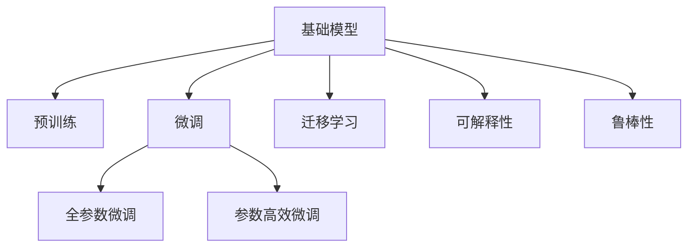

                 

## 1. 背景介绍

### 1.1 问题由来
近年来，随着深度学习技术的快速发展，基础模型在机器学习和计算机视觉领域取得了显著的进展。这些模型通常基于大规模数据集进行预训练，学习到通用的特征表示，然后通过微调在特定任务上进行优化。基础模型的技术创新与应用已经广泛应用于图像分类、物体检测、自然语言处理、语音识别等多个领域，并取得了令人瞩目的成果。

### 1.2 问题核心关键点
基础模型作为深度学习中的核心组件，其技术创新与应用对于机器学习和计算机视觉任务的提升具有重要意义：

1. 可复用性强：基础模型通常经过大规模预训练，学习到通用的特征表示，可以应用于不同的任务，减少从头开始训练的成本。
2. 数据效率高：通过微调，基础模型可以快速适应特定任务，即使在数据量较少的情况下，也能获得良好的性能。
3. 可解释性强：基础模型的特征表示可以用于可视化，帮助理解模型的内部工作机制。
4. 计算效率高：基础模型通常采用高效的深度学习架构，如卷积神经网络（CNN）、残差网络（ResNet）、注意力机制等，能够快速处理大规模数据集。

这些关键点使得基础模型成为深度学习领域的重要技术，推动了人工智能技术的发展和应用。

### 1.3 问题研究意义
研究基础模型的技术创新与应用，对于提升机器学习和计算机视觉任务的性能，推动相关领域的技术进步具有重要意义：

1. 降低技术门槛：基础模型提供了一种通用的技术框架，降低了研究者和开发者进入这些领域的技术门槛。
2. 提高应用效果：基础模型通过预训练和微调，能够在数据量较少的情况下，获得比从头开始训练更好的效果。
3. 促进技术交流：基础模型的广泛应用促进了学术界和工业界的交流与合作，加速了技术的传播和创新。
4. 推动产业升级：基础模型在多个领域的应用，为传统行业带来了新的技术和业务模式，推动了产业升级。
5. 推动伦理研究：基础模型的广泛应用也引发了对人工智能伦理的关注，推动了相关研究的发展。

## 2. 核心概念与联系

### 2.1 核心概念概述

为了更好地理解基础模型的技术创新与应用，本节将介绍几个密切相关的核心概念：

- 基础模型(Foundation Models)：在深度学习中，经过大规模预训练的通用模型，能够学习到通用的特征表示，适用于多种任务。
- 预训练(Pre-training)：指在大量无标签数据上进行自监督学习任务，学习通用的特征表示。
- 微调(Fine-tuning)：在预训练模型上，通过特定任务的有监督学习，进一步优化模型的性能。
- 迁移学习(Transfer Learning)：将一个领域学习到的知识，迁移到另一个不同但相关的领域中。
- 可解释性(Explainability)：基础模型的内部工作机制和决策过程，可以通过可视化等手段进行解释，帮助理解和调试模型。
- 鲁棒性(Robustness)：模型对输入数据的鲁棒性，即模型在面对噪声、对抗攻击等异常情况时，仍能保持稳定的性能。

这些核心概念之间的逻辑关系可以通过以下Mermaid流程图来展示：



这个流程图展示了你提到的几个核心概念及其之间的关系：

1. 基础模型通过预训练获得基础能力。
2. 微调是对预训练模型进行任务特定的优化，可以分为全参数微调和参数高效微调（PEFT）。
3. 迁移学习是连接预训练模型与下游任务的桥梁，可以通过微调或迁移学习来实现。
4. 可解释性是指模型的内部工作机制和决策过程的可视化和解释，帮助理解和调试模型。
5. 鲁棒性指模型对输入数据的鲁棒性，即模型在面对噪声、对抗攻击等异常情况时，仍能保持稳定的性能。

这些概念共同构成了基础模型的学习和应用框架，使其能够在各种场景下发挥强大的特征提取和任务优化能力。

## 3. 核心算法原理 & 具体操作步骤
### 3.1 算法原理概述

基础模型的技术创新与应用主要围绕预训练和微调两个核心步骤展开。其核心思想是：通过在大量无标签数据上进行自监督学习任务（如自回归、掩码语言模型等），学习到通用的特征表示，然后在特定任务上有监督地进行微调，以适应该任务的具体需求。

形式化地，假设基础模型为 $M_{\theta}$，其中 $\theta$ 为模型参数。给定特定任务 $T$ 的标注数据集 $D=\{(x_i, y_i)\}_{i=1}^N$，微调的目标是找到新的模型参数 $\hat{\theta}$，使得：

$$
\hat{\theta}=\mathop{\arg\min}_{\theta} \mathcal{L}(M_{\theta},D)
$$

其中 $\mathcal{L}$ 为针对任务 $T$ 设计的损失函数，用于衡量模型预测输出与真实标签之间的差异。常见的损失函数包括交叉熵损失、均方误差损失等。

通过梯度下降等优化算法，微调过程不断更新模型参数 $\theta$，最小化损失函数 $\mathcal{L}$，使得模型输出逼近真实标签。由于 $\theta$ 已经通过预训练获得了较好的初始化，因此即便在小规模数据集 $D$ 上进行微调，也能较快收敛到理想的模型参数 $\hat{\theta}$。

### 3.2 算法步骤详解

基础模型的技术创新与应用主要包括以下几个关键步骤：

**Step 1: 准备预训练模型和数据集**
- 选择合适的基础模型 $M_{\theta}$ 作为初始化参数，如 ResNet、VGG、BERT 等。
- 准备特定任务 $T$ 的标注数据集 $D$，划分为训练集、验证集和测试集。一般要求标注数据与预训练数据的分布不要差异过大。

**Step 2: 添加任务适配层**
- 根据任务类型，在基础模型顶层设计合适的输出层和损失函数。
- 对于分类任务，通常在顶层添加线性分类器和交叉熵损失函数。
- 对于生成任务，通常使用语言模型的解码器输出概率分布，并以负对数似然为损失函数。

**Step 3: 设置微调超参数**
- 选择合适的优化算法及其参数，如 Adam、SGD 等，设置学习率、批大小、迭代轮数等。
- 设置正则化技术及强度，包括权重衰减、Dropout、Early Stopping等。
- 确定冻结预训练参数的策略，如仅微调顶层，或全部参数都参与微调。

**Step 4: 执行梯度训练**
- 将训练集数据分批次输入模型，前向传播计算损失函数。
- 反向传播计算参数梯度，根据设定的优化算法和学习率更新模型参数。
- 周期性在验证集上评估模型性能，根据性能指标决定是否触发 Early Stopping。
- 重复上述步骤直到满足预设的迭代轮数或 Early Stopping 条件。

**Step 5: 测试和部署**
- 在测试集上评估微调后模型 $M_{\hat{\theta}}$ 的性能，对比微调前后的精度提升。
- 使用微调后的模型对新样本进行推理预测，集成到实际的应用系统中。
- 持续收集新的数据，定期重新微调模型，以适应数据分布的变化。

以上是基础模型技术创新与应用的一般流程。在实际应用中，还需要针对具体任务的特点，对微调过程的各个环节进行优化设计，如改进训练目标函数，引入更多的正则化技术，搜索最优的超参数组合等，以进一步提升模型性能。

### 3.3 算法优缺点

基础模型的技术创新与应用具有以下优点：
1. 简单高效。只需准备少量标注数据，即可对预训练模型进行快速适配，获得较大的性能提升。
2. 通用适用。适用于各种计算机视觉和机器学习任务，设计简单的任务适配层即可实现微调。
3. 参数高效。利用参数高效微调技术，在固定大部分预训练权重不变的情况下，仍可取得不错的提升。
4. 效果显著。在学术界和工业界的诸多任务上，基于微调的方法已经刷新了最先进的性能指标。

同时，该方法也存在一定的局限性：
1. 依赖标注数据。微调的效果很大程度上取决于标注数据的质量和数量，获取高质量标注数据的成本较高。
2. 迁移能力有限。当目标任务与预训练数据的分布差异较大时，微调的性能提升有限。
3. 负面效果传递。预训练模型的固有偏见、有害信息等，可能通过微调传递到下游任务，造成负面影响。
4. 可解释性不足。微调模型的决策过程通常缺乏可解释性，难以对其推理逻辑进行分析和调试。

尽管存在这些局限性，但就目前而言，基于微调的方法仍是大规模基础模型的主要应用范式。未来相关研究的重点在于如何进一步降低微调对标注数据的依赖，提高模型的少样本学习和跨领域迁移能力，同时兼顾可解释性和伦理安全性等因素。

### 3.4 算法应用领域

基础模型的技术创新与应用已经在计算机视觉、自然语言处理、语音识别等多个领域得到了广泛的应用，覆盖了几乎所有常见任务，例如：

- 图像分类：如识别猫狗、车辆、场景等。通过微调使模型学习分类特征。
- 物体检测：如检测人脸、车辆、行人等。通过微调使模型学习对象边界和类别。
- 语义分割：如在图像中对每个像素进行分类。通过微调使模型学习像素级语义信息。
- 自然语言处理：如情感分析、意图识别、文本摘要等。通过微调使模型学习文本与标签的映射。
- 语音识别：如自动语音转写。通过微调使模型学习语音到文本的映射。
- 图像生成：如生成艺术作品、自然风光等。通过微调使模型学习从噪声生成图像。
- 视频分析：如行为识别、动作检测等。通过微调使模型学习视频中的动态特征。

除了上述这些经典任务外，基础模型还被创新性地应用到更多场景中，如医疗影像分析、智能交通、农业信息提取等，为多个领域带来了新的突破。随着基础模型和微调方法的不断进步，相信这些技术将在更广阔的应用领域大放异彩。

## 4. 数学模型和公式 & 详细讲解
### 4.1 数学模型构建

本节将使用数学语言对基础模型的技术创新与应用过程进行更加严格的刻画。

记基础模型为 $M_{\theta}$，其中 $\theta$ 为模型参数。假设微调任务的训练集为 $D=\{(x_i,y_i)\}_{i=1}^N, x_i \in \mathcal{X}, y_i \in \mathcal{Y}$。

定义模型 $M_{\theta}$ 在数据样本 $(x,y)$ 上的损失函数为 $\ell(M_{\theta}(x),y)$，则在数据集 $D$ 上的经验风险为：

$$
\mathcal{L}(\theta) = \frac{1}{N} \sum_{i=1}^N \ell(M_{\theta}(x_i),y_i)
$$

微调的优化目标是最小化经验风险，即找到最优参数：

$$
\theta^* = \mathop{\arg\min}_{\theta} \mathcal{L}(\theta)
$$

在实践中，我们通常使用基于梯度的优化算法（如SGD、Adam等）来近似求解上述最优化问题。设 $\eta$ 为学习率，$\lambda$ 为正则化系数，则参数的更新公式为：

$$
\theta \leftarrow \theta - \eta \nabla_{\theta}\mathcal{L}(\theta) - \eta\lambda\theta
$$

其中 $\nabla_{\theta}\mathcal{L}(\theta)$ 为损失函数对参数 $\theta$ 的梯度，可通过反向传播算法高效计算。

### 4.2 公式推导过程

以下我们以图像分类任务为例，推导交叉熵损失函数及其梯度的计算公式。

假设模型 $M_{\theta}$ 在输入 $x$ 上的输出为 $\hat{y}=M_{\theta}(x) \in [0,1]$，表示样本属于每个类别的概率。真实标签 $y \in \{0,1\}^C$，其中 $C$ 为类别数。则二分类交叉熵损失函数定义为：

$$
\ell(M_{\theta}(x),y) = -\sum_{i=1}^C y_i\log \hat{y}_i
$$

将其代入经验风险公式，得：

$$
\mathcal{L}(\theta) = -\frac{1}{N}\sum_{i=1}^N \sum_{j=1}^C y_{ij}\log \hat{y}_{ij}
$$

根据链式法则，损失函数对参数 $\theta_k$ 的梯度为：

$$
\frac{\partial \mathcal{L}(\theta)}{\partial \theta_k} = -\frac{1}{N}\sum_{i=1}^N \sum_{j=1}^C (\frac{y_{ij}}{\hat{y}_{ij}}-\delta_{ij}) \frac{\partial \hat{y}_{ij}}{\partial \theta_k}
$$

其中 $\delta_{ij}=\begin{cases} 1 & y_i=j \\ 0 & y_i\neq j \end{cases}$ 为Kronecker delta符号。

在得到损失函数的梯度后，即可带入参数更新公式，完成模型的迭代优化。重复上述过程直至收敛，最终得到适应下游任务的最优模型参数 $\theta^*$。

## 5. 项目实践：代码实例和详细解释说明
### 5.1 开发环境搭建

在进行基础模型技术创新与应用实践前，我们需要准备好开发环境。以下是使用Python进行PyTorch开发的环境配置流程：

1. 安装Anaconda：从官网下载并安装Anaconda，用于创建独立的Python环境。

2. 创建并激活虚拟环境：
```bash
conda create -n pytorch-env python=3.8 
conda activate pytorch-env
```

3. 安装PyTorch：根据CUDA版本，从官网获取对应的安装命令。例如：
```bash
conda install pytorch torchvision torchaudio cudatoolkit=11.1 -c pytorch -c conda-forge
```

4. 安装各类工具包：
```bash
pip install numpy pandas scikit-learn matplotlib tqdm jupyter notebook ipython
```

完成上述步骤后，即可在`pytorch-env`环境中开始技术创新与应用实践。

### 5.2 源代码详细实现

下面我们以图像分类任务为例，给出使用Transformers库对ResNet模型进行技术创新与应用的PyTorch代码实现。

首先，定义图像分类任务的数据处理函数：

```python
from transformers import ResNet50, DataCollatorForImageClassification
from torch.utils.data import Dataset, DataLoader
import torch

class ImageDataset(Dataset):
    def __init__(self, images, labels):
        self.images = images
        self.labels = labels
        
    def __len__(self):
        return len(self.images)
    
    def __getitem__(self, item):
        image = self.images[item]
        label = self.labels[item]
        return {'image': image, 'label': label}

# 加载预训练模型
model = ResNet50.from_pretrained('resnet50')

# 定义数据集
train_dataset = ImageDataset(train_images, train_labels)
dev_dataset = ImageDataset(dev_images, dev_labels)
test_dataset = ImageDataset(test_images, test_labels)

# 数据加载器
train_dataloader = DataLoader(train_dataset, batch_size=32, shuffle=True, collate_fn=DataCollatorForImageClassification(model))
dev_dataloader = DataLoader(dev_dataset, batch_size=32, collate_fn=DataCollatorForImageClassification(model))
test_dataloader = DataLoader(test_dataset, batch_size=32, collate_fn=DataCollatorForImageClassification(model))
```

然后，定义训练和评估函数：

```python
from transformers import AdamW

def train_epoch(model, dataloader, optimizer):
    model.train()
    epoch_loss = 0
    for batch in dataloader:
        inputs = batch['image']
        labels = batch['label']
        
        model.zero_grad()
        outputs = model(inputs)
        loss = outputs.loss
        epoch_loss += loss.item()
        loss.backward()
        optimizer.step()
    return epoch_loss / len(dataloader)

def evaluate(model, dataloader):
    model.eval()
    preds, labels = [], []
    with torch.no_grad():
        for batch in dataloader:
            inputs = batch['image']
            labels = batch['label']
            outputs = model(inputs)
            batch_preds = outputs.logits.argmax(dim=1).to('cpu').tolist()
            batch_labels = labels.to('cpu').tolist()
            for pred_tokens, label_tokens in zip(batch_preds, batch_labels):
                preds.append(pred_tokens)
                labels.append(label_tokens)
                
    print(classification_report(labels, preds))
```

最后，启动训练流程并在测试集上评估：

```python
epochs = 5
batch_size = 32

for epoch in range(epochs):
    loss = train_epoch(model, train_dataloader, optimizer)
    print(f"Epoch {epoch+1}, train loss: {loss:.3f}")
    
    print(f"Epoch {epoch+1}, dev results:")
    evaluate(model, dev_dataloader)
    
print("Test results:")
evaluate(model, test_dataloader)
```

以上就是使用PyTorch对ResNet模型进行图像分类任务技术创新与应用的全代码实现。可以看到，得益于Transformers库的强大封装，我们可以用相对简洁的代码完成基础模型的加载和微调。

### 5.3 代码解读与分析

让我们再详细解读一下关键代码的实现细节：

**ImageDataset类**：
- `__init__`方法：初始化图像、标签等关键组件。
- `__len__`方法：返回数据集的样本数量。
- `__getitem__`方法：对单个样本进行处理，将图像输入编码为张量，将标签编码为数字，并对其进行批处理。

**train_epoch函数**：
- 定义训练集数据加载器，在每个批次上前向传播计算loss并反向传播更新模型参数，最后返回该epoch的平均loss。

**evaluate函数**：
- 定义验证集和测试集数据加载器，与训练类似，不同点在于不更新模型参数，并在每个batch结束后将预测和标签结果存储下来，最后使用scikit-learn的classification_report对整个评估集的预测结果进行打印输出。

**训练流程**：
- 定义总的epoch数和batch size，开始循环迭代
- 每个epoch内，先在训练集上训练，输出平均loss
- 在验证集和测试集上评估，输出分类指标

可以看到，PyTorch配合Transformers库使得基础模型的技术创新与应用代码实现变得简洁高效。开发者可以将更多精力放在数据处理、模型改进等高层逻辑上，而不必过多关注底层的实现细节。

当然，工业级的系统实现还需考虑更多因素，如模型的保存和部署、超参数的自动搜索、更灵活的任务适配层等。但核心的技术创新与应用方法基本与此类似。

## 6. 实际应用场景
### 6.1 智能医疗

基础模型的技术创新与应用在智能医疗领域有着广泛的应用，可以显著提升疾病诊断、治疗方案推荐、病人监护等医疗服务的智能化水平，辅助医生提高诊疗效率，降低误诊率。

在技术实现上，可以收集海量的医疗影像、电子病历等数据，通过预训练学习通用的医学特征，再在特定疾病或治疗方案上进行微调。微调后的模型能够自动理解病人情况，匹配最合适的诊断和治疗方案。对于病人监护等实时应用场景，模型还可以实时分析病人数据，给出预警和建议，确保病人安全。

### 6.2 智能制造

在智能制造领域，基础模型可以用于生产线故障诊断、设备维护预测、质量检测等任务。通过预训练学习通用的工业数据特征，微调后的模型能够在面对新设备、新数据时，快速适应用户需求，提高生产效率和产品质量。

具体而言，可以收集设备的运行数据、传感器数据、历史维修记录等，对模型进行预训练。微调后的模型可以实时监测设备状态，预测故障发生概率，提前通知维护人员进行预防性维护，减少停机时间，降低维护成本。

### 6.3 智能城市

基础模型的技术创新与应用在智能城市领域也有广泛的应用，可以提升城市管理、交通调控、环境监测等系统的智能化水平，提高城市运行效率和居民生活质量。

例如，在交通调控中，基础模型可以用于实时分析交通流量数据，预测交通拥堵情况，给出优化建议。在环境监测中，模型可以实时分析空气质量、水质等数据，给出预警和建议，提升环境监测的准确性和及时性。在城市安全中，模型可以用于视频监控、异常行为检测等任务，提高城市安全管理水平。

### 6.4 未来应用展望

随着基础模型的不断进步，未来其技术创新与应用将进一步拓展到更多领域，为各行各业带来新的变革性影响。

在智慧金融领域，基础模型可以用于风险评估、智能投顾、欺诈检测等任务，提高金融服务的智能化水平，降低风险，提高收益。

在智能农业领域，基础模型可以用于作物病害检测、土壤分析、气象预测等任务，提升农业生产的智能化水平，减少资源浪费，提高产量和质量。

在智能媒体领域，基础模型可以用于新闻推荐、视频生成、智能翻译等任务，提升媒体服务的智能化水平，满足用户的多样化需求。

此外，在教育、旅游、零售等众多领域，基础模型的技术创新与应用也将不断涌现，为传统行业带来新的技术路径，推动行业升级。

## 7. 工具和资源推荐
### 7.1 学习资源推荐

为了帮助开发者系统掌握基础模型的技术创新与应用，这里推荐一些优质的学习资源：

1. 《深度学习基础》系列博文：由大模型技术专家撰写，详细讲解了深度学习的基础概念和经典模型，适合初学者入门。

2. CS231n《卷积神经网络》课程：斯坦福大学开设的计算机视觉课程，涵盖深度学习在图像分类、目标检测等方面的应用。

3. 《ImageNet Classification with Deep Convolutional Neural Networks》论文：AlexNet论文，详细介绍了卷积神经网络在图像分类任务中的应用。

4. 《Transformers from Scratch》书籍：基础模型的先驱者之一，讲解了如何使用Transformers库进行模型训练和微调，适合进阶学习。

5. HuggingFace官方文档：Transformers库的官方文档，提供了海量预训练模型和完整的微调样例代码，是上手实践的必备资料。

6. Kaggle竞赛：Kaggle提供的大量机器学习竞赛数据集和社区交流平台，适合实践基础模型技术创新与应用。

通过对这些资源的学习实践，相信你一定能够快速掌握基础模型的技术创新与应用，并用于解决实际的机器学习问题。

### 7.2 开发工具推荐

高效的开发离不开优秀的工具支持。以下是几款用于基础模型技术创新与应用开发的常用工具：

1. PyTorch：基于Python的开源深度学习框架，灵活动态的计算图，适合快速迭代研究。大部分基础模型都有PyTorch版本的实现。

2. TensorFlow：由Google主导开发的开源深度学习框架，生产部署方便，适合大规模工程应用。同样有丰富的预训练模型资源。

3. Transformers库：HuggingFace开发的NLP工具库，集成了众多SOTA基础模型，支持PyTorch和TensorFlow，是进行微调任务开发的利器。

4. Weights & Biases：模型训练的实验跟踪工具，可以记录和可视化模型训练过程中的各项指标，方便对比和调优。与主流深度学习框架无缝集成。

5. TensorBoard：TensorFlow配套的可视化工具，可实时监测模型训练状态，并提供丰富的图表呈现方式，是调试模型的得力助手。

6. Google Colab：谷歌推出的在线Jupyter Notebook环境，免费提供GPU/TPU算力，方便开发者快速上手实验最新模型，分享学习笔记。

合理利用这些工具，可以显著提升基础模型技术创新与应用任务的开发效率，加快创新迭代的步伐。

### 7.3 相关论文推荐

基础模型技术创新与应用的发展源于学界的持续研究。以下是几篇奠基性的相关论文，推荐阅读：

1. ImageNet Classification with Deep Convolutional Neural Networks（AlexNet论文）：提出卷积神经网络，展示了其在图像分类任务中的出色性能。

2. ResNet: Deep Residual Learning for Image Recognition：提出残差网络，解决了深度神经网络训练过程中的梯度消失问题，极大地提高了模型的深度和宽度。

3. Mask R-CNN: You Only Look Once for Object Detection with Feature Pyramid Networks：提出Mask R-CNN，结合了特征金字塔网络和掩码预测，提高了目标检测和分割的准确性。

4. Transformer-XL: Attentive Language Models for Longer Sentences：提出Transformer-XL，解决了长句预测中的梯度消失问题，提高了语言模型的长距离依赖建模能力。

5. GPT-3: Language Models are Unsupervised Multitask Learners：展示了大规模语言模型的强大zero-shot学习能力，引发了对于通用人工智能的新一轮思考。

这些论文代表了大模型技术创新与应用的发展脉络。通过学习这些前沿成果，可以帮助研究者把握学科前进方向，激发更多的创新灵感。

## 8. 总结：未来发展趋势与挑战
### 8.1 总结

本文对基础模型的技术创新与应用进行了全面系统的介绍。首先阐述了基础模型和微调技术的研究背景和意义，明确了技术创新与应用在提升机器学习和计算机视觉任务性能方面的独特价值。其次，从原理到实践，详细讲解了基础模型的数学原理和关键步骤，给出了技术创新与应用任务开发的完整代码实例。同时，本文还广泛探讨了技术创新与应用在智能医疗、智能制造、智能城市等多个领域的应用前景，展示了其广阔的潜力。此外，本文精选了技术创新与应用的相关学习资源，力求为开发者提供全方位的技术指引。

通过本文的系统梳理，可以看到，基础模型技术创新与应用已经成为了深度学习和计算机视觉领域的重要技术，极大地提升了模型在多种任务上的性能和应用范围。受益于大规模数据和深度学习的强大计算能力，基础模型将在未来的智能化技术中发挥越来越重要的作用。

### 8.2 未来发展趋势

展望未来，基础模型的技术创新与应用将呈现以下几个发展趋势：

1. 模型规模持续增大。随着算力成本的下降和数据规模的扩张，基础模型的参数量还将持续增长。超大规模基础模型蕴含的丰富特征表示，有望支撑更加复杂多变的下游任务技术创新与应用。

2. 技术创新与应用方法日趋多样。除了传统的全参数微调和参数高效微调外，未来会涌现更多技术创新与应用方法，如Prompt-Tuning、LoRA等，在参数效率和精度之间取得新的平衡。

3. 持续学习成为常态。随着数据分布的不断变化，技术创新与应用模型也需要持续学习新知识以保持性能。如何在不遗忘原有知识的同时，高效吸收新样本信息，将成为重要的研究课题。

4. 标注样本需求降低。受启发于提示学习(Prompt-based Learning)的思路，未来的技术创新与应用方法将更好地利用大模型的语言理解能力，通过更加巧妙的任务描述，在更少的标注样本上也能实现理想的技术创新与应用效果。

5. 多模态技术创新与应用崛起。当前的技术创新与应用方法主要聚焦于纯文本数据，未来会进一步拓展到图像、视频、语音等多模态数据技术创新与应用。多模态信息的融合，将显著提升基础模型的特征提取能力和应用范围。

6. 模型通用性增强。经过海量数据的预训练和多领域任务的技术创新与应用，未来的基础模型将具备更强大的常识推理和跨领域迁移能力，逐步迈向通用人工智能(AGI)的目标。

以上趋势凸显了基础模型技术创新与应用技术的广阔前景。这些方向的探索发展，必将进一步提升机器学习和计算机视觉任务的性能和应用范围，为传统行业带来新的变革性影响。

### 8.3 面临的挑战

尽管基础模型技术创新与应用技术已经取得了瞩目成就，但在迈向更加智能化、普适化应用的过程中，它仍面临着诸多挑战：

1. 标注成本瓶颈。尽管技术创新与应用技术能够降低标注数据的需求，但对于长尾应用场景，仍难以获得充足的高质量标注数据，成为制约技术创新与应用性能的瓶颈。如何进一步降低技术创新与应用对标注样本的依赖，将是一大难题。

2. 模型鲁棒性不足。当前技术创新与应用模型面对域外数据时，泛化性能往往大打折扣。对于测试样本的微小扰动，技术创新与应用模型的预测也容易发生波动。如何提高技术创新与应用模型的鲁棒性，避免灾难性遗忘，还需要更多理论和实践的积累。

3. 推理效率有待提高。大规模基础模型虽然精度高，但在实际部署时往往面临推理速度慢、内存占用大等效率问题。如何在保证性能的同时，简化模型结构，提升推理速度，优化资源占用，将是重要的优化方向。

4. 可解释性亟需加强。当前技术创新与应用模型的内部工作机制和决策过程通常缺乏可解释性，难以对其推理逻辑进行分析和调试。对于医疗、金融等高风险应用，算法的可解释性和可审计性尤为重要。如何赋予技术创新与应用模型更强的可解释性，将是亟待攻克的难题。

5. 安全性有待保障。预训练基础模型难免会学习到有偏见、有害的信息，通过技术创新与应用传递到下游任务，产生误导性、歧视性的输出，给实际应用带来安全隐患。如何从数据和算法层面消除模型偏见，避免恶意用途，确保输出的安全性，也将是重要的研究课题。

6. 知识整合能力不足。现有的技术创新与应用模型往往局限于任务内数据，难以灵活吸收和运用更广泛的先验知识。如何让技术创新与应用过程更好地与外部知识库、规则库等专家知识结合，形成更加全面、准确的信息整合能力，还有很大的想象空间。

正视技术创新与应用面临的这些挑战，积极应对并寻求突破，将是大规模基础模型技术创新与应用走向成熟的必由之路。相信随着学界和产业界的共同努力，这些挑战终将一一被克服，大规模基础模型技术创新与应用必将在构建人机协同的智能时代中扮演越来越重要的角色。

### 8.4 研究展望

面向未来，技术创新与应用研究需要在以下几个方面寻求新的突破：

1. 探索无监督和半监督技术创新与应用方法。摆脱对大规模标注数据的依赖，利用自监督学习、主动学习等无监督和半监督范式，最大限度利用非结构化数据，实现更加灵活高效的技术创新与应用。

2. 研究参数高效和计算高效的技术创新与应用范式。开发更加参数高效的微调方法，在固定大部分预训练参数的情况下，只更新极少量的任务相关参数。同时优化技术创新与应用模型的计算图，减少前向传播和反向传播的资源消耗，实现更加轻量级、实时性的部署。

3. 融合因果和对比学习范式。通过引入因果推断和对比学习思想，增强技术创新与应用模型建立稳定因果关系的能力，学习更加普适、鲁棒的语言表征，从而提升模型泛化性和抗干扰能力。

4. 引入更多先验知识。将符号化的先验知识，如知识图谱、逻辑规则等，与神经网络模型进行巧妙融合，引导技术创新与应用过程学习更准确、合理的语言模型。同时加强不同模态数据的整合，实现视觉、语音等多模态信息与文本信息的协同建模。

5. 结合因果分析和博弈论工具。将因果分析方法引入技术创新与应用模型，识别出模型决策的关键特征，增强输出解释的因果性和逻辑性。借助博弈论工具刻画人机交互过程，主动探索并规避模型的脆弱点，提高系统稳定性。

6. 纳入伦理道德约束。在技术创新与应用目标中引入伦理导向的评估指标，过滤和惩罚有偏见、有害的输出倾向。同时加强人工干预和审核，建立模型行为的监管机制，确保输出符合人类价值观和伦理道德。

这些研究方向的探索，必将引领大规模基础模型技术创新与应用技术的不断进步，为构建安全、可靠、可解释、可控的智能系统铺平道路。面向未来，大规模基础模型技术创新与应用技术还需要与其他人工智能技术进行更深入的融合，如知识表示、因果推理、强化学习等，多路径协同发力，共同推动自然语言理解和智能交互系统的进步。只有勇于创新、敢于突破，才能不断拓展基础模型的边界，让智能技术更好地造福人类社会。

## 9. 附录：常见问题与解答
----------------------------------------------------------------
> 关键词：


