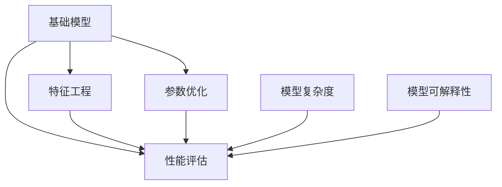

                 

## 1. 背景介绍

### 1.1 问题由来
在人工智能的早期阶段，基础模型的设计与优化是推动技术进步的关键。这些模型往往是基于统计学和概率论构建的，以优化预测和分类准确性为核心目标。从早期简单的线性回归模型，到基于逻辑回归的分类模型，再到复杂的神经网络，每一个模型背后都蕴藏着深厚的理论基础和工程实践。

然而，随着时间的推移，基础模型的应用场景和需求不断扩大，如何构建更具适应性、泛化能力和可解释性的模型，成为新的挑战。随着深度学习和大数据技术的发展，研究人员逐渐发现，更加复杂的模型结构，如深度神经网络，能够在处理复杂问题时展现更强的能力。但这些模型的复杂性和不透明性，也引发了新的疑问：我们是否需要这些“黑盒”模型？或者，能否在保持模型简洁、高效的前提下，仍然取得好的性能？

### 1.2 问题核心关键点
基础模型的早期阶段主要关注模型构建、参数优化和性能评估等核心问题。模型的构建需要基于一定的理论基础，如统计学、概率论等；参数优化依赖于高效的优化算法和策略；性能评估则通过各种指标（如准确率、召回率、F1-score等）进行衡量。在这些问题的基础上，研究人员不断探索新模型，优化算法，提出改进方法，最终推动了人工智能技术的发展。

在早期阶段，模型构建往往依赖于手工设计的特征工程，而参数优化则主要通过梯度下降等传统优化算法实现。性能评估则依赖于训练集和测试集的分割，以确保模型的泛化能力。随着深度学习和大数据技术的成熟，模型结构逐渐复杂化，参数量急剧增加，性能评估也变得更加复杂，但这些技术为后续模型的复杂化和泛化能力奠定了基础。

## 2. 核心概念与联系

### 2.1 核心概念概述

为更好地理解基础模型的早期阶段与潜力，本节将介绍几个密切相关的核心概念：

- 基础模型：包括线性回归、逻辑回归、神经网络等，是早期人工智能的核心组成部分。这些模型通过学习输入和输出之间的关系，用于预测和分类。
- 参数优化：指通过优化算法（如梯度下降）来更新模型参数，最小化损失函数的过程。参数优化是基础模型设计的关键环节，直接影响模型性能。
- 特征工程：指通过手工设计和选择特征，以提升模型的预测和分类能力。特征工程在早期模型设计中占有重要地位。
- 性能评估：通过一系列指标（如准确率、召回率、F1-score等）评估模型在不同数据集上的表现。性能评估是模型优化的重要依据。
- 泛化能力：指模型在未见过的数据上表现良好，即具备较强的泛化能力。泛化能力是模型设计的重要目标。
- 模型复杂度：指模型结构（如层数、节点数等）的复杂性。模型复杂度越高，可能获得的性能越好，但计算复杂度也会相应增加。
- 模型可解释性：指模型输出的可理解性。可解释性在模型设计中逐渐受到重视，特别是在需要做出透明决策的场景中。

这些核心概念之间的逻辑关系可以通过以下Mermaid流程图来展示：



这个流程图展示出基础模型设计的关键环节：

1. 基础模型是核心，通过学习输入和输出之间的关系进行预测和分类。
2. 参数优化通过优化算法调整模型参数，提升模型性能。
3. 特征工程通过手工选择特征，提高模型预测能力。
4. 性能评估通过一系列指标评估模型泛化能力。
5. 模型复杂度影响性能和计算复杂度。
6. 模型可解释性提升决策透明性。

## 3. 核心算法原理 & 具体操作步骤
### 3.1 算法原理概述

早期基础模型的设计往往依赖于统计学和概率论理论，通过最小化损失函数来优化模型参数。核心算法原理包括：

- 线性回归：通过最小化均方误差损失，优化模型参数，用于回归问题。
- 逻辑回归：通过最大化似然函数，优化模型参数，用于分类问题。
- 神经网络：通过反向传播算法，优化模型参数，用于复杂的非线性问题。

这些算法通过不同的方法来优化模型参数，以达到预测和分类的目的。

### 3.2 算法步骤详解

以下是一个使用线性回归模型的详细步骤：

1. 数据准备：收集训练集和测试集，确保数据集的均衡性和多样性。
2. 模型初始化：选择合适的模型结构和初始化参数。
3. 参数优化：通过梯度下降等优化算法，更新模型参数，最小化损失函数。
4. 模型评估：在测试集上评估模型性能，使用准确率、召回率、F1-score等指标衡量。
5. 参数调整：根据评估结果，调整模型参数，以提升模型性能。
6. 模型应用：将训练好的模型应用到新数据上，进行预测或分类。

### 3.3 算法优缺点

早期基础模型的优缺点如下：

优点：

1. 简单易懂：模型结构简单，易于理解和实现。
2. 泛化能力强：通过选择适当的模型复杂度和优化算法，可以较好地泛化到新数据。
3. 可解释性强：模型参数较少，可解释性较高。

缺点：

1. 适应性有限：模型结构固定，无法处理复杂的非线性问题。
2. 数据依赖性高：模型依赖于数据的选择和特征工程，需要大量数据和手工设计。
3. 性能有限：模型复杂度低，无法处理高维数据和复杂结构。

### 3.4 算法应用领域

早期基础模型主要应用于各种回归和分类问题，如股票预测、疾病诊断、信用评分等。例如：

- 股票预测：通过历史价格数据，建立线性回归模型，预测未来股价。
- 疾病诊断：通过病人的症状和实验室检查数据，建立逻辑回归模型，预测患病概率。
- 信用评分：通过贷款历史和信用记录，建立线性回归模型，预测还款能力。

## 4. 数学模型和公式 & 详细讲解 & 举例说明

### 4.1 数学模型构建

早期基础模型大多基于线性代数和概率论理论，数学模型构建如下：

- 线性回归：
  $$
  y = \theta_0 + \sum_{i=1}^n \theta_i x_i
  $$
  其中，$y$ 为输出，$x_i$ 为输入，$\theta_i$ 为模型参数。

- 逻辑回归：
  $$
  \log p(y=1|x) = \theta_0 + \sum_{i=1}^n \theta_i x_i
  $$
  其中，$p(y=1|x)$ 为输出为1的概率，$x$ 为输入，$\theta_i$ 为模型参数。

- 神经网络：
  $$
  \begin{aligned}
  h_l &= g(\sum_{i=1}^m \theta_{l,i} x_{l,i} + b_l) \\
  z_{l+1} &= g(\sum_{i=1}^m \theta_{l+1,i} h_l + b_{l+1})
  \end{aligned}
  $$
  其中，$h_l$ 为第$l$层的输出，$g$ 为激活函数，$\theta_{l,i}$ 为权重，$x_{l,i}$ 为输入，$b_l$ 为偏置。

### 4.2 公式推导过程

以线性回归为例，推导最小化均方误差损失的过程：

假设训练集为 $(x_i,y_i)$，损失函数为：
$$
L(\theta) = \frac{1}{2N} \sum_{i=1}^N (y_i - \hat{y}_i)^2
$$
其中，$\hat{y}_i = \theta_0 + \sum_{i=1}^n \theta_i x_i$ 为预测值。

对 $\theta_0$ 和 $\theta_i$ 求偏导数，得：
$$
\frac{\partial L(\theta)}{\partial \theta_0} = \frac{1}{N} \sum_{i=1}^N (y_i - \hat{y}_i) = \frac{1}{N} \sum_{i=1}^N (y_i - (\theta_0 + \sum_{i=1}^n \theta_i x_i))
$$
$$
\frac{\partial L(\theta)}{\partial \theta_i} = \frac{1}{N} \sum_{i=1}^N (-2x_i(y_i - \hat{y}_i)) = \frac{1}{N} \sum_{i=1}^N (-2x_i(y_i - (\theta_0 + \sum_{i=1}^n \theta_i x_i)))
$$

使用梯度下降算法，得：
$$
\theta_0 \leftarrow \theta_0 - \eta \frac{1}{N} \sum_{i=1}^N (y_i - (\theta_0 + \sum_{i=1}^n \theta_i x_i))
$$
$$
\theta_i \leftarrow \theta_i - \eta \frac{1}{N} \sum_{i=1}^N (-2x_i(y_i - (\theta_0 + \sum_{i=1}^n \theta_i x_i)))
$$

### 4.3 案例分析与讲解

以医学诊断为例，分析线性回归模型的应用：

假设收集了100个病人的症状数据和诊断结果，将其分为训练集和测试集。使用线性回归模型进行建模，训练集上的损失函数如下：
$$
L(\theta) = \frac{1}{100} \sum_{i=1}^{100} (y_i - (\theta_0 + \sum_{i=1}^n \theta_i x_i))^2
$$
其中，$y_i$ 为实际诊断结果，$\theta_0$ 和 $\theta_i$ 为模型参数。

通过梯度下降算法，不断更新参数 $\theta_0$ 和 $\theta_i$，使得模型在测试集上表现良好。最终，模型可以用于新病人的诊断，通过输入症状数据，得到预测的患病概率。

## 5. 项目实践：代码实例和详细解释说明

### 5.1 开发环境搭建

在进行项目实践前，我们需要准备好开发环境。以下是使用Python进行Scikit-learn开发的环境配置流程：

1. 安装Anaconda：从官网下载并安装Anaconda，用于创建独立的Python环境。

2. 创建并激活虚拟环境：
```bash
conda create -n sklearn-env python=3.8 
conda activate sklearn-env
```

3. 安装Scikit-learn：从官网获取对应的安装命令，如：
```bash
conda install scikit-learn
```

4. 安装其他必要的工具包：
```bash
pip install numpy pandas matplotlib tqdm jupyter notebook ipython
```

完成上述步骤后，即可在`sklearn-env`环境中开始项目实践。

### 5.2 源代码详细实现

我们以线性回归模型为例，给出使用Scikit-learn进行数据集处理的代码实现。

```python
from sklearn.linear_model import LinearRegression
from sklearn.model_selection import train_test_split
from sklearn.metrics import mean_squared_error, r2_score
import pandas as pd
import numpy as np

# 数据准备
data = pd.read_csv('data.csv')

# 特征工程
X = data[['age', 'blood_pressure', 'cholesterol', 'smoker']]
y = data['diabetes']

# 划分训练集和测试集
X_train, X_test, y_train, y_test = train_test_split(X, y, test_size=0.2, random_state=42)

# 模型初始化
model = LinearRegression()

# 参数优化
model.fit(X_train, y_train)

# 模型评估
y_pred = model.predict(X_test)
mse = mean_squared_error(y_test, y_pred)
rmse = np.sqrt(mse)
r2 = r2_score(y_test, y_pred)
print(f'RMSE: {rmse:.2f}, R^2: {r2:.2f}')
```

以上代码实现了线性回归模型的构建、参数优化和性能评估。可以看到，Scikit-learn库的封装使得模型训练和评估变得简单易行。

### 5.3 代码解读与分析

让我们再详细解读一下关键代码的实现细节：

- `data`：使用pandas库读取数据集，存储到DataFrame中。
- `X` 和 `y`：从数据集中提取特征和标签，用于模型训练。
- `train_test_split`：将数据集划分为训练集和测试集。
- `LinearRegression`：使用Scikit-learn库中的线性回归模型。
- `fit`：在训练集上拟合模型。
- `predict`：在测试集上进行预测。
- `mean_squared_error` 和 `r2_score`：使用Scikit-learn库中的评估函数，计算均方误差和决定系数。

通过这些代码实现，可以快速完成线性回归模型的训练和评估，验证模型的性能。

## 6. 实际应用场景

### 6.1 股票预测

基础模型在金融领域中，主要用于股票预测等时间序列问题。通过历史价格数据，建立线性回归模型，预测未来股价走势。例如，使用ARIMA模型（自回归积分滑动平均模型）进行股票预测，可以有效捕捉历史数据中的趋势和周期性，提高预测准确性。

### 6.2 信用评分

基础模型在金融领域中，还用于信用评分问题。通过贷款历史和信用记录，建立逻辑回归模型，预测借款人的还款能力和违约风险。例如，使用逻辑回归模型，根据贷款金额、还款期限、信用评分等特征，预测借款人的还款能力，帮助金融机构评估风险。

### 6.3 疾病诊断

基础模型在医学领域中，主要用于疾病诊断问题。通过病人的症状数据和实验室检查数据，建立线性回归模型，预测患病概率。例如，使用逻辑回归模型，根据病人的年龄、血压、胆固醇等特征，预测患有糖尿病的概率，帮助医生做出诊断。

## 7. 工具和资源推荐

### 7.1 学习资源推荐

为了帮助开发者系统掌握基础模型的构建和优化理论基础，这里推荐一些优质的学习资源：

1. 《机器学习基础》课程：斯坦福大学机器学习课程，系统介绍线性回归、逻辑回归等基础模型。

2. 《深度学习》书籍：Ian Goodfellow等人所著，全面介绍深度学习模型的构建和优化，包括线性回归、逻辑回归、神经网络等。

3. Kaggle：数据科学竞赛平台，提供大量数据集和竞赛任务，实践基础模型和优化算法。

4. PyTorch官方文档：深度学习框架PyTorch的官方文档，提供大量模型和算法的实现。

5. Scikit-learn官方文档：机器学习库Scikit-learn的官方文档，提供大量模型和算法的实现。

通过对这些资源的学习实践，相信你一定能够快速掌握基础模型的构建和优化精髓，并用于解决实际的机器学习问题。

### 7.2 开发工具推荐

高效的开发离不开优秀的工具支持。以下是几款用于基础模型开发的常用工具：

1. PyTorch：基于Python的开源深度学习框架，灵活的计算图设计，适合快速迭代研究。

2. TensorFlow：由Google主导开发的开源深度学习框架，生产部署方便，适合大规模工程应用。

3. Scikit-learn：基于Python的机器学习库，提供简单易用的接口和算法实现。

4. Weights & Biases：模型训练的实验跟踪工具，记录和可视化模型训练过程，帮助调试和优化。

5. TensorBoard：TensorFlow配套的可视化工具，实时监测模型训练状态，提供丰富的图表展示。

6. Google Colab：谷歌提供的在线Jupyter Notebook环境，免费提供GPU/TPU算力，方便开发者快速上手实验。

合理利用这些工具，可以显著提升基础模型的开发效率，加快创新迭代的步伐。

### 7.3 相关论文推荐

基础模型的早期阶段和潜力已经通过众多研究论文进行了深入探索。以下是几篇奠基性的相关论文，推荐阅读：

1. Linear Regression（线性回归）：由Fisher提出，是机器学习中最基础的模型之一。

2. Logistic Regression（逻辑回归）：由Coursera教授Andrew Ng等人提出，广泛应用于二分类问题。

3. Neural Networks（神经网络）：由Hinton等人提出，开启深度学习时代。

4. Gradient Descent（梯度下降）：由Rumelhart等人提出，优化算法中的经典方法。

5. Backpropagation（反向传播）：由Rumelhart等人提出，神经网络中的核心算法。

这些论文代表了大模型设计的基础，为后续研究提供了理论基础和实践经验。通过学习这些前沿成果，可以帮助研究者把握模型构建的精髓，探索新的研究方向。

## 8. 总结：未来发展趋势与挑战

### 8.1 总结

本文对基础模型的早期阶段与潜力进行了全面系统的介绍。首先阐述了基础模型在早期阶段的设计理念和优化方法，明确了模型构建、参数优化、特征工程和性能评估等核心问题。其次，从原理到实践，详细讲解了线性回归、逻辑回归和神经网络等基础模型的构建和优化过程，给出了具体的代码实例和详细解释。同时，本文还广泛探讨了基础模型在金融、医学等领域的实际应用场景，展示了基础模型在实际应用中的广泛价值。

通过本文的系统梳理，可以看到，基础模型作为早期人工智能的核心组成部分，通过简单的结构设计和优化算法，实现了较高的性能和泛化能力。在数据量和计算资源有限的条件下，基础模型依然能够解决许多实际问题，具有重要的应用价值。未来，随着深度学习和计算技术的不断发展，基础模型的设计和优化将面临更多挑战和机遇，需要我们不断探索和创新。

### 8.2 未来发展趋势

展望未来，基础模型的设计和发展将呈现以下几个趋势：

1. 模型复杂度提升：随着深度学习技术的成熟，模型复杂度将不断提升，以处理更复杂的非线性问题。

2. 参数优化改进：新的优化算法和策略将不断涌现，提升模型训练效率和性能。

3. 特征工程自动化：特征选择和处理将逐步自动化，减少人工干预，提高模型泛化能力。

4. 可解释性增强：模型可解释性将成为重要研究方向，提高模型的透明度和可信度。

5. 数据驱动设计：模型设计将更多依赖于数据驱动的方法，减少手工调参，提升模型性能。

6. 多模态融合：基础模型将更多地融合多模态数据，提升模型的感知和理解能力。

以上趋势凸显了基础模型在深度学习时代的不断进化和优化。这些方向的探索发展，将为人工智能技术带来更多新的突破和应用。

### 8.3 面临的挑战

尽管基础模型在早期阶段取得了显著的成就，但在迈向更加智能化、普适化应用的过程中，它仍面临诸多挑战：

1. 模型泛化性不足：基础模型在数据量和复杂度较小的场景中表现良好，但对于复杂数据和高维数据的泛化能力较弱。

2. 计算资源限制：模型复杂度的提升带来了更高的计算需求，需要更强大的硬件支持。

3. 可解释性不足：基础模型的"黑盒"特性使其决策过程难以理解和解释，特别是在需要高透明度的应用场景中。

4. 数据驱动的设计局限：基础模型依赖于数据和特征工程，难以处理数据不足和特征选择错误的情况。

5. 模型复杂度与性能的平衡：模型复杂度越高，计算效率越低，如何平衡复杂度和性能，是未来的重要课题。

6. 多模态融合的挑战：多模态数据的整合和处理，需要更复杂的算法和更高效的计算。

正视这些挑战，积极应对并寻求突破，将使基础模型在未来的发展中更加稳健和高效。

### 8.4 研究展望

面对基础模型所面临的挑战，未来的研究需要在以下几个方面寻求新的突破：

1. 探索新的模型架构：设计更加高效、灵活的模型结构，提升模型的泛化能力和可解释性。

2. 开发新的优化算法：提升模型训练效率和性能，解决大规模数据和复杂模型的训练问题。

3. 自动化特征工程：提高特征选择的自动化程度，减少人工干预，提升模型性能。

4. 增强模型可解释性：通过可解释性研究，提高模型的透明度和可信度，满足高透明度的应用需求。

5. 数据驱动的设计：探索数据驱动的设计方法，减少手工调参，提升模型性能。

6. 多模态数据融合：研究多模态数据的融合方法，提升模型的感知和理解能力。

这些研究方向将推动基础模型在深度学习时代的不断进步和优化，为人工智能技术的发展带来新的突破和应用。

## 9. 附录：常见问题与解答

**Q1：基础模型是否适用于所有机器学习任务？**

A: 基础模型在数据量较小、结构简单的场景中表现良好，但对于复杂的高维数据和复杂问题，基础模型的泛化能力有限。对于高维数据和复杂问题，需要更复杂的模型结构和更高效的优化算法。

**Q2：如何提高基础模型的泛化能力？**

A: 提高基础模型的泛化能力，可以从以下几方面入手：

1. 数据增强：通过数据扩充和合成，增加数据多样性，提升模型泛化能力。
2. 正则化：使用L2正则、Dropout等正则化方法，减少过拟合，提升模型泛化能力。
3. 集成学习：使用多个基础模型进行集成，提升整体性能和泛化能力。
4. 特征选择：使用特征选择方法，选择对模型性能提升有帮助的特征，减少噪音。
5. 交叉验证：使用交叉验证方法，评估模型在不同数据集上的泛化能力，优化模型参数。

**Q3：基础模型如何与深度学习模型结合？**

A: 基础模型可以通过以下几种方式与深度学习模型结合：

1. 特征提取：将基础模型作为特征提取器，提取数据的高级特征，用于深度学习模型的输入。
2. 集成学习：将多个基础模型和深度学习模型进行集成，提升整体性能和泛化能力。
3. 迁移学习：将基础模型在某个任务上学习到的知识，迁移到深度学习模型中，提升模型性能。
4. 融合训练：将基础模型和深度学习模型联合训练，提升模型性能和泛化能力。

通过这些方法，基础模型可以与深度学习模型结合，充分发挥各自的优势，解决更复杂的问题。

**Q4：基础模型在实际应用中需要注意哪些问题？**

A: 在实际应用中，基础模型需要注意以下问题：

1. 数据驱动的设计：模型设计需要依赖于数据驱动的方法，减少手工调参，提升模型性能。
2. 计算资源限制：模型复杂度的提升带来了更高的计算需求，需要更强大的硬件支持。
3. 可解释性不足：基础模型的"黑盒"特性使其决策过程难以理解和解释，特别是在需要高透明度的应用场景中。
4. 数据驱动的设计局限：基础模型依赖于数据和特征工程，难以处理数据不足和特征选择错误的情况。

正视这些挑战，积极应对并寻求突破，将使基础模型在未来的发展中更加稳健和高效。

---

作者：禅与计算机程序设计艺术 / Zen and the Art of Computer Programming

