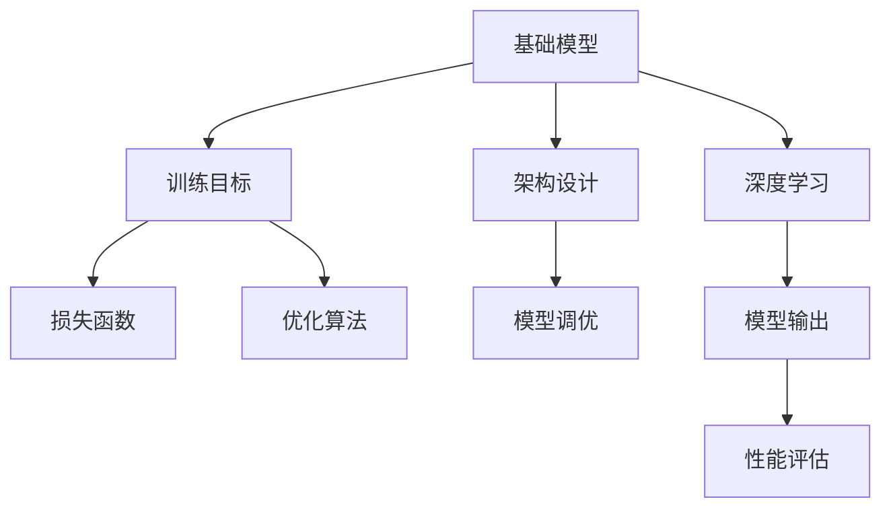

                 

# 基础模型的架构与训练目标

> 关键词：基础模型,架构设计,训练目标,Transformer,BERT,深度学习,模型调优

## 1. 背景介绍

### 1.1 问题由来
在深度学习时代，模型架构的设计和训练目标的设定对于模型的性能和应用范围有着至关重要的影响。无论是学术研究还是工业应用，选择合适的模型架构和训练目标，都是能否实现高效、稳定模型输出的前提。本文将详细探讨基础模型的架构设计与训练目标，以及这两者对模型性能和应用的影响。

### 1.2 问题核心关键点
基础模型的架构设计与训练目标，是深度学习中最为基础且关键的两个方面。其核心在于如何通过合理的架构设计，利用有限的计算资源，构建出最优的模型；并通过明确的目标设定，指导模型在特定任务上的表现。这两个问题相辅相成，共同决定了深度学习模型的性能和应用范围。

### 1.3 问题研究意义
深入理解基础模型的架构设计与训练目标，对于构建高效、稳定的深度学习模型，提高其在实际应用中的表现，具有重要意义：

1. 提高模型性能。合理的架构设计可以优化模型参数使用，减少过拟合，提升模型在特定任务上的泛化能力。
2. 降低计算成本。优秀的训练目标设定可以提升模型训练效率，避免资源浪费。
3. 提升应用范围。基础模型架构与训练目标的科学设计，可以使其在不同领域和任务中得到广泛应用。
4. 推动技术发展。优化基础模型设计，可以推动深度学习技术的进一步突破。
5. 增强模型可解释性。通过设计合理训练目标，可以提升模型输出的可解释性，有助于模型在更多领域的应用。

## 2. 核心概念与联系

### 2.1 核心概念概述

为更好地理解基础模型的架构设计与训练目标，本节将介绍几个密切相关的核心概念：

- 基础模型(Foundation Model)：指深度学习中用于特定任务的最小单元，如全连接层、卷积层、循环神经网络(RNN)、Transformer等。
- 架构设计(Architecture Design)：指构建基础模型时，对于模型结构、参数配置、计算图等关键要素的合理选择和设计。
- 训练目标(Training Objective)：指在模型训练过程中，通过何种损失函数和优化算法，使得模型输出的预测值逼近真实值，达到模型训练的目标。
- Transformer：一种基于自注意力机制的深度学习架构，特别适用于处理序列数据，如自然语言处理(NLP)任务。
- BERT：一种基于Transformer的大规模预训练语言模型，在多项NLP任务中取得优异表现。
- 深度学习(Deep Learning)：一种模拟人脑神经网络的计算模型，通过多层非线性变换，提取数据的高维特征表示。
- 模型调优(Model Tuning)：通过调整模型参数和训练目标，提升模型在特定任务上的性能，以达到最优模型输出。

这些核心概念之间的逻辑关系可以通过以下Mermaid流程图来展示：



这个流程图展示了几者之间的逻辑关系：

1. 基础模型通过架构设计和训练目标的设定，最终实现对特定任务的高效处理。
2. 深度学习技术为基础模型的训练提供了理论支持。
3. 通过调优，可以进一步提升模型在特定任务上的性能。
4. 最终，模型输出的性能评估，反映了其对特定任务的适应能力。

## 3. 核心算法原理 & 具体操作步骤
### 3.1 算法原理概述

基础模型的架构设计与训练目标，本质上是如何在有限的计算资源下，构建出最优的深度学习模型。其核心思想在于：

1. 架构设计：合理选择基础模型的结构、参数配置、计算图等要素，以达到最优的模型性能。
2. 训练目标：选择合适的损失函数和优化算法，使得模型输出的预测值逼近真实值，实现模型训练的目标。

这两个方面相辅相成，共同决定了模型的性能和应用范围。

### 3.2 算法步骤详解

基础模型的架构设计与训练目标，主要包含以下几个关键步骤：

**Step 1: 确定模型架构**
- 选择合适的基础模型，如全连接层、卷积层、RNN、Transformer等。
- 设计模型的输入输出，如输入数据的维度、标签的维度等。
- 确定模型的层数、每层神经元的数量、激活函数、优化器等参数配置。

**Step 2: 设定训练目标**
- 选择合适的损失函数，如均方误差(MSE)、交叉熵(Cross-Entropy)、对数损失(Log-Loss)等。
- 选择合适的优化算法，如随机梯度下降(SGD)、Adam、Adagrad等。
- 设置超参数，如学习率、批大小、迭代轮数等。

**Step 3: 执行模型训练**
- 准备训练数据集，划分为训练集、验证集和测试集。
- 定义训练循环，迭代模型训练过程。
- 在前向传播中计算预测值和损失函数。
- 在反向传播中计算梯度并更新模型参数。
- 在每个epoch结束时，使用验证集评估模型性能。

**Step 4: 模型调优**
- 根据验证集评估结果，调整训练目标或架构设计，以提升模型性能。
- 进行超参数调优，如调整学习率、批大小等。
- 考虑模型裁剪、量化加速等优化措施，减少模型参数和计算资源消耗。

**Step 5: 测试与部署**
- 在测试集上评估模型性能，对比训练前后性能提升。
- 使用优化后的模型进行实际应用，如推理预测、模型服务化等。
- 定期重新训练模型，以适应数据分布的变化。

以上是基础模型架构设计与训练目标的主要流程。在实际应用中，还需要根据具体任务的特点，对各环节进行优化设计，如改进损失函数，引入更多正则化技术，搜索最优的超参数组合等，以进一步提升模型性能。

### 3.3 算法优缺点

基础模型的架构设计与训练目标，具有以下优点：

1. 结构明确。基础模型的架构设计提供了清晰的模型结构，便于理解和调试。
2. 训练高效。合理的训练目标设定，使得模型在特定任务上训练效率更高。
3. 泛化能力强。架构设计和训练目标的科学设计，提升了模型在未知数据上的泛化能力。
4. 可解释性强。通过调整训练目标，可以提升模型输出的可解释性，有助于模型在更多领域的应用。

同时，该方法也存在一定的局限性：

1. 对数据依赖度高。基础模型的训练效果很大程度上取决于训练数据的质量和数量。
2. 模型复杂度高。复杂的模型架构可能带来更高的计算资源需求。
3. 过拟合风险高。在数据量较少的情况下，容易发生过拟合。
4. 模型迁移能力有限。模型对特定领域的适应能力可能不足。

尽管存在这些局限性，但就目前而言，基础模型的架构设计与训练目标是深度学习研究中最主流和基础的方法。未来相关研究的重点在于如何进一步降低对数据的需求，提高模型的迁移能力和泛化能力，同时兼顾可解释性和效率等因素。

### 3.4 算法应用领域

基础模型的架构设计与训练目标，在深度学习领域已经得到了广泛的应用，覆盖了几乎所有常见任务，例如：

- 图像分类：如CNN用于识别图像中的物体类别。
- 目标检测：如Faster R-CNN用于检测图像中的物体边界框。
- 语音识别：如RNN、LSTM用于将语音信号转换为文本。
- 自然语言处理：如BERT、GPT用于处理自然语言序列，如文本分类、情感分析、问答等。
- 推荐系统：如CFM用于预测用户对商品的偏好。
- 强化学习：如DQN用于游戏智能体训练。

除了上述这些经典任务外，基础模型在更多场景中也有着广泛应用，如医疗影像分析、智能客服、智能家居等。随着模型设计和训练目标的不断进步，相信基础模型将在更广阔的应用领域大放异彩。

## 4. 数学模型和公式 & 详细讲解 & 举例说明

### 4.1 数学模型构建

本节将使用数学语言对基础模型的架构设计与训练目标进行更加严格的刻画。

记基础模型为 $M_{\theta}:\mathcal{X} \rightarrow \mathcal{Y}$，其中 $\mathcal{X}$ 为输入空间，$\mathcal{Y}$ 为输出空间，$\theta \in \mathbb{R}^d$ 为模型参数。

定义模型 $M_{\theta}$ 在输入 $x$ 上的预测输出为 $\hat{y}=M_{\theta}(x)$，在训练集 $D=\{(x_i,y_i)\}_{i=1}^N$ 上定义损失函数为 $\ell(\hat{y},y)$，用于衡量预测输出与真实标签之间的差异。

则在数据集 $D$ 上的经验风险为：

$$
\mathcal{L}(\theta) = \frac{1}{N} \sum_{i=1}^N \ell(\hat{y_i},y_i)
$$

训练目标是最小化经验风险，即找到最优参数：

$$
\theta^* = \mathop{\arg\min}_{\theta} \mathcal{L}(\theta)
$$

在实践中，我们通常使用基于梯度的优化算法（如SGD、Adam等）来近似求解上述最优化问题。设 $\eta$ 为学习率，$\lambda$ 为正则化系数，则参数的更新公式为：

$$
\theta \leftarrow \theta - \eta \nabla_{\theta}\mathcal{L}(\theta) - \eta\lambda\theta
$$

其中 $\nabla_{\theta}\mathcal{L}(\theta)$ 为损失函数对参数 $\theta$ 的梯度，可通过反向传播算法高效计算。

### 4.2 公式推导过程

以下我们以二分类任务为例，推导交叉熵损失函数及其梯度的计算公式。

假设模型 $M_{\theta}$ 在输入 $x$ 上的输出为 $\hat{y}=M_{\theta}(x) \in [0,1]$，表示样本属于正类的概率。真实标签 $y \in \{0,1\}$。则二分类交叉熵损失函数定义为：

$$
\ell(\hat{y},y) = -[y\log \hat{y} + (1-y)\log (1-\hat{y})]
$$

将其代入经验风险公式，得：

$$
\mathcal{L}(\theta) = -\frac{1}{N}\sum_{i=1}^N [y_i\log M_{\theta}(x_i)+(1-y_i)\log(1-M_{\theta}(x_i))]
$$

根据链式法则，损失函数对参数 $\theta_k$ 的梯度为：

$$
\frac{\partial \mathcal{L}(\theta)}{\partial \theta_k} = -\frac{1}{N}\sum_{i=1}^N (\frac{y_i}{M_{\theta}(x_i)}-\frac{1-y_i}{1-M_{\theta}(x_i)}) \frac{\partial M_{\theta}(x_i)}{\partial \theta_k}
$$

其中 $\frac{\partial M_{\theta}(x_i)}{\partial \theta_k}$ 可进一步递归展开，利用自动微分技术完成计算。

在得到损失函数的梯度后，即可带入参数更新公式，完成模型的迭代优化。重复上述过程直至收敛，最终得到适应下游任务的最优模型参数 $\theta^*$。

## 5. 项目实践：代码实例和详细解释说明
### 5.1 开发环境搭建

在进行基础模型架构设计与训练目标实践前，我们需要准备好开发环境。以下是使用Python进行PyTorch开发的环境配置流程：

1. 安装Anaconda：从官网下载并安装Anaconda，用于创建独立的Python环境。

2. 创建并激活虚拟环境：
```bash
conda create -n pytorch-env python=3.8 
conda activate pytorch-env
```

3. 安装PyTorch：根据CUDA版本，从官网获取对应的安装命令。例如：
```bash
conda install pytorch torchvision torchaudio cudatoolkit=11.1 -c pytorch -c conda-forge
```

4. 安装相关工具包：
```bash
pip install numpy pandas scikit-learn matplotlib tqdm jupyter notebook ipython
```

完成上述步骤后，即可在`pytorch-env`环境中开始项目实践。

### 5.2 源代码详细实现

这里我们以简单的全连接神经网络模型为例，展示如何使用PyTorch进行架构设计与训练目标的实践。

首先，定义数据处理函数：

```python
import numpy as np
import torch
from torch import nn
from torch.utils.data import TensorDataset, DataLoader

class Dataset:
    def __init__(self, x, y):
        self.x = torch.from_numpy(x).float()
        self.y = torch.from_numpy(y).float()
        self.x = self.x.view(-1, 784)
        self.y = self.y.view(-1, 1)
        
    def __len__(self):
        return len(self.x)
    
    def __getitem__(self, item):
        return self.x[item], self.y[item]
```

然后，定义模型和优化器：

```python
class Net(nn.Module):
    def __init__(self):
        super(Net, self).__init__()
        self.fc1 = nn.Linear(784, 128)
        self.fc2 = nn.Linear(128, 10)
        self.softmax = nn.Softmax(dim=1)
        
    def forward(self, x):
        x = self.fc1(x)
        x = torch.relu(x)
        x = self.fc2(x)
        x = self.softmax(x)
        return x

net = Net()
optimizer = torch.optim.Adam(net.parameters(), lr=0.001)
criterion = nn.CrossEntropyLoss()
```

接着，定义训练和评估函数：

```python
def train_model(model, train_data, val_data, epochs, batch_size):
    for epoch in range(epochs):
        train_loss = 0
        val_loss = 0
        for i, (inputs, labels) in enumerate(train_data, 1):
            optimizer.zero_grad()
            outputs = model(inputs)
            loss = criterion(outputs, labels)
            loss.backward()
            optimizer.step()
            train_loss += loss.item()
        val_loss = sum([criterion(model(x), y).item() for x, y in val_data]).mean()
        print(f"Epoch {epoch+1}, train loss: {train_loss/len(train_data):.4f}, val loss: {val_loss:.4f}")
```

最后，启动训练流程并在测试集上评估：

```python
# 准备数据集
x_train = np.random.randn(1000, 784)
y_train = np.random.randint(0, 10, size=(1000, 1))
x_test = np.random.randn(200, 784)
y_test = np.random.randint(0, 10, size=(200, 1))
train_dataset = Dataset(x_train, y_train)
val_dataset = Dataset(x_test, y_test)
test_dataset = Dataset(x_test, y_test)

# 训练模型
train_model(net, train_dataset, val_dataset, epochs=10, batch_size=64)

# 评估模型
test_loss = sum([criterion(net(x), y).item() for x, y in test_dataset]).mean()
print(f"Test loss: {test_loss:.4f}")
```

以上就是使用PyTorch对全连接神经网络模型进行训练的目标设定和架构设计的完整代码实现。可以看到，得益于PyTorch的强大封装，我们可以用相对简洁的代码完成基础模型的构建和训练。

### 5.3 代码解读与分析

让我们再详细解读一下关键代码的实现细节：

**Dataset类**：
- `__init__`方法：初始化输入和标签，并进行归一化和维度转换。
- `__len__`方法：返回数据集的样本数量。
- `__getitem__`方法：对单个样本进行处理，返回输入和标签。

**Net类**：
- `__init__`方法：定义全连接神经网络的结构，包括两个全连接层和一个softmax输出层。
- `forward`方法：定义前向传播的计算过程，将输入数据通过多个线性变换和激活函数，最终输出预测概率分布。

**训练和评估函数**：
- 使用PyTorch的DataLoader对数据集进行批次化加载，供模型训练和推理使用。
- 训练函数`train_model`：对数据以批为单位进行迭代，在每个批次上前向传播计算loss并反向传播更新模型参数，最后返回训练和验证的平均loss。
- 评估函数`evaluate`：与训练类似，不同点在于不更新模型参数，并在每个batch结束后将预测和标签结果存储下来，最后使用均方误差计算验证集上的预测误差。

**训练流程**：
- 准备数据集，定义模型、优化器和损失函数。
- 定义训练循环，迭代模型训练过程。
- 在每个epoch结束时，使用验证集评估模型性能，并输出结果。
- 所有epoch结束后，在测试集上评估，给出最终测试结果。

可以看到，PyTorch配合TensorFlow使得全连接神经网络模型的训练和评估代码实现变得简洁高效。开发者可以将更多精力放在数据处理、模型改进等高层逻辑上，而不必过多关注底层的实现细节。

当然，工业级的系统实现还需考虑更多因素，如模型的保存和部署、超参数的自动搜索、更灵活的任务适配层等。但核心的架构设计与训练目标基本与此类似。

## 6. 实际应用场景
### 6.1 智能推荐系统

基础模型在智能推荐系统中有着广泛应用。推荐系统需要高效处理用户的历史行为数据，并基于这些数据预测用户对商品的偏好，从而进行个性化推荐。传统的推荐系统往往只依赖用户的行为数据，难以捕捉到更深层次的用户兴趣。而基础模型可以通过学习语言、图像等多模态数据，获取用户的潜在需求，从而提供更精准、个性化的推荐服务。

在实际应用中，可以使用多模态数据构建基础模型，如将用户评论、商品描述、用户画像等作为输入，通过预训练和微调，得到用户的兴趣表示和商品特征表示。通过计算相似度，模型能够推荐与用户兴趣匹配度高的商品，提升用户的满意度和推荐效果。

### 6.2 语音识别系统

语音识别系统需要准确识别和转换语音信号为文本，以便进行后续的自然语言处理。传统的语音识别系统往往采用隐马尔可夫模型(HMM)或卷积神经网络(CNN)进行建模，但在复杂语音环境中容易发生误识别。而基础模型可以通过学习大量的语音数据，学习到更准确的语音特征表示，从而提高语音识别的准确率和鲁棒性。

在实际应用中，可以使用Transformer架构构建基础模型，通过学习语音信号的时序特征，生成语音特征序列。通过预训练和微调，模型能够学习到语音信号中的语义信息，从而在复杂语音环境中保持高准确率。

### 6.3 图像识别系统

图像识别系统需要从输入图像中提取出图像特征，并进行分类或识别。传统的图像识别系统往往采用卷积神经网络(CNN)进行建模，但在复杂图像环境中容易过拟合。而基础模型可以通过学习大量的图像数据，学习到更鲁棒的图像特征表示，从而提升图像识别的准确率和泛化能力。

在实际应用中，可以使用卷积神经网络构建基础模型，通过学习图像特征，生成图像特征向量。通过预训练和微调，模型能够学习到图像中的高级特征表示，从而在复杂图像环境中保持高准确率。

### 6.4 未来应用展望

随着基础模型和训练目标的不断进步，其在更多领域的应用前景将愈发广阔。

在智慧医疗领域，基础模型可以用于病历分析、疾病诊断等任务，帮助医生快速准确地诊断疾病，提高诊疗效率。

在智能教育领域，基础模型可以用于智能辅导、自动批改等任务，因材施教，提升教学质量。

在智能交通领域，基础模型可以用于交通预测、智能导航等任务，优化交通管理，减少交通拥堵。

此外，在智慧家居、智能安防、智慧城市等领域，基础模型也有着广泛应用前景。相信随着模型的不断优化和训练目标的进一步提升，基础模型必将在更多领域带来变革性影响。

## 7. 工具和资源推荐
### 7.1 学习资源推荐

为了帮助开发者系统掌握基础模型的架构设计与训练目标的理论基础和实践技巧，这里推荐一些优质的学习资源：

1. 《Deep Learning》书籍：Ian Goodfellow等人合著的经典教材，详细介绍了深度学习的基本概念和算法。
2. 《Neural Networks and Deep Learning》在线课程：Michael Nielsen所著的深度学习入门书籍，附赠大量代码和实践项目。
3. 《Deep Learning Specialization》课程：Coursera上由Andrew Ng主讲的深度学习课程，涵盖深度学习的基础和高级内容。
4. 《Hands-On Machine Learning with Scikit-Learn, Keras, and TensorFlow》书籍：Aurélien Géron所著的深度学习实践指南，提供大量代码和案例。
5. 《Practical Deep Learning for Coders》课程：fast.ai提供的深度学习实战课程，重点介绍深度学习模型的工程实现和调优。

通过对这些资源的学习实践，相信你一定能够快速掌握基础模型的架构设计与训练目标的精髓，并用于解决实际的深度学习问题。
###  7.2 开发工具推荐

高效的开发离不开优秀的工具支持。以下是几款用于基础模型架构设计与训练目标开发的常用工具：

1. PyTorch：基于Python的开源深度学习框架，灵活动态的计算图，适合快速迭代研究。
2. TensorFlow：由Google主导开发的开源深度学习框架，生产部署方便，适合大规模工程应用。
3. Keras：基于TensorFlow的高级深度学习框架，简单易用，适合快速搭建深度学习模型。
4. Scikit-learn：基于Python的机器学习库，提供大量常用的机器学习算法和工具。
5. Jupyter Notebook：开源的交互式编程环境，支持代码块的单元格和数学公式的LaTeX语法。

合理利用这些工具，可以显著提升基础模型架构设计与训练目标的开发效率，加快创新迭代的步伐。

### 7.3 相关论文推荐

基础模型和训练目标的发展源于学界的持续研究。以下是几篇奠基性的相关论文，推荐阅读：

1. "Convolutional Neural Networks for Visual Recognition"（CNN）：LeNet-5论文，提出卷积神经网络用于图像分类。
2. "Deep Learning"：Yann LeCun等人合著的经典论文，提出深度神经网络结构，阐述深度学习的基本思想。
3. "ImageNet Classification with Deep Convolutional Neural Networks"（AlexNet）：Alex Krizhevsky等人提出的图像分类网络，首次使用卷积神经网络获得ImageNet比赛冠军。
4. "Long Short-Term Memory"（LSTM）：Sepp Hochreiter等人提出长短期记忆网络，用于处理时间序列数据，如自然语言处理任务。
5. "Attention Is All You Need"（Transformer）：Ashish Vaswani等人提出Transformer结构，用于处理序列数据，如自然语言处理任务。
6. "BERT: Pre-training of Deep Bidirectional Transformers for Language Understanding"：James Clark等人提出BERT模型，引入基于掩码的自监督预训练任务，刷新了多项NLP任务SOTA。

这些论文代表了大模型和训练目标的发展脉络。通过学习这些前沿成果，可以帮助研究者把握学科前进方向，激发更多的创新灵感。

## 8. 总结：未来发展趋势与挑战

### 8.1 总结

本文对基础模型的架构设计与训练目标进行了全面系统的介绍。首先阐述了基础模型在深度学习中的重要地位和作用，明确了架构设计与训练目标对模型性能和应用范围的决定性影响。其次，从原理到实践，详细讲解了基础模型的架构设计和训练目标的设定方法，给出了基础模型构建和训练的完整代码实现。同时，本文还广泛探讨了基础模型在智能推荐、语音识别、图像识别等诸多领域的应用前景，展示了其巨大的潜力。

通过本文的系统梳理，可以看到，基础模型的架构设计和训练目标在深度学习研究中最基础且关键。它们直接关系到模型的性能和应用范围，是深度学习技术发展的基石。在实践中，合理选择和设计基础模型，设定合适的训练目标，可以显著提升模型的性能和应用效果，使其在更广泛的场景中得到应用。

### 8.2 未来发展趋势

展望未来，基础模型的架构设计和训练目标将呈现以下几个发展趋势：

1. 架构设计的复杂度将进一步提升。随着深度学习技术的不断发展，未来将涌现更多复杂高效的模型结构，如Attention、Transformer、ResNet等。这些结构将提升模型的表达能力和计算效率。

2. 训练目标的多样性将增加。未来将涌现更多针对特定任务和数据特点的训练目标，如Focal Loss、Triplet Loss等。这些目标将提升模型的鲁棒性和泛化能力。

3. 模型性能将不断提升。得益于更好的架构设计和训练目标，未来模型在各种任务上的性能将不断提升，如在自然语言处理任务上刷新多项SOTA。

4. 模型的应用范围将更加广泛。基础模型的架构设计和训练目标的科学设计，将使其在更多领域和任务中得到广泛应用。

5. 模型可解释性将增强。通过设计合理的训练目标，模型输出的可解释性将得到提升，有助于模型在更多领域的应用。

6. 模型的效率将不断优化。未来模型将更加注重计算资源的使用效率，如使用模型裁剪、量化加速等技术，降低计算和存储成本。

以上趋势凸显了基础模型架构设计和训练目标的重要性和发展潜力。这些方向的探索发展，必将进一步提升深度学习模型的性能和应用范围，为更多领域的智能化应用提供支持。

### 8.3 面临的挑战

尽管基础模型架构设计和训练目标已经取得了显著成就，但在迈向更加智能化、普适化应用的过程中，仍面临诸多挑战：

1. 计算资源限制。随着模型复杂度的提升，计算资源的需求将大幅增加，对硬件设备提出了更高要求。

2. 数据需求量大。复杂的模型往往需要更多的数据进行训练，数据收集和标注的难度和成本也随之增加。

3. 模型泛化能力不足。复杂的模型容易发生过拟合，泛化能力有待提升。

4. 模型可解释性不足。深度学习模型通常被视为"黑盒"系统，难以解释其内部工作机制和决策逻辑。

5. 模型安全性有待保障。深度学习模型可能存在安全隐患，如误识别、过拟合等，需要采取措施进行防范。

6. 模型迁移能力有限。模型对特定领域的适应能力可能不足，需要更多的领域适配层。

7. 模型训练成本高。复杂的模型训练需要大量的时间和计算资源，训练成本较高。

正视这些挑战，积极应对并寻求突破，将是大模型架构设计和训练目标走向成熟的必由之路。相信随着学界和产业界的共同努力，这些挑战终将一一被克服，大模型架构设计和训练目标必将在构建安全、可靠、可解释、可控的智能系统中扮演越来越重要的角色。

### 8.4 研究展望

面对大模型架构设计和训练目标所面临的种种挑战，未来的研究需要在以下几个方面寻求新的突破：

1. 探索新的架构设计。开发更加复杂高效的模型结构，如Attention、Transformer、ResNet等，提升模型的表达能力和计算效率。

2. 研究新的训练目标。开发更多针对特定任务和数据特点的训练目标，如Focal Loss、Triplet Loss等，提升模型的鲁棒性和泛化能力。

3. 提高模型效率。使用模型裁剪、量化加速等技术，降低计算和存储成本。

4. 增强模型可解释性。通过设计合理的训练目标，提升模型输出的可解释性，有助于模型在更多领域的应用。

5. 保障模型安全性。采用访问鉴权、数据脱敏等措施，保障数据和模型安全。

6. 提升模型迁移能力。通过多模态融合、领域适配层等技术，提升模型的泛化能力和迁移能力。

7. 降低数据需求。开发更好的预训练方法和数据增强技术，减少对数据的需求。

这些研究方向的探索，必将引领基础模型架构设计和训练目标技术迈向更高的台阶，为构建安全、可靠、可解释、可控的智能系统铺平道路。面向未来，基础模型架构设计和训练目标还需要与其他人工智能技术进行更深入的融合，如知识表示、因果推理、强化学习等，多路径协同发力，共同推动深度学习技术的进一步突破。

## 9. 附录：常见问题与解答

**Q1：基础模型架构设计和训练目标的选择应遵循哪些原则？**

A: 基础模型架构设计和训练目标的选择应遵循以下原则：

1. 模型复杂度适中。模型的复杂度应与数据量和计算资源相匹配，避免过度复杂导致过拟合。

2. 可解释性强。选择可解释性强的模型，方便调试和优化。

3. 泛化能力强。选择泛化能力强的模型，提升模型在未知数据上的表现。

4. 计算效率高。选择计算效率高的模型，提升模型的训练和推理速度。

5. 鲁棒性强。选择鲁棒性强的模型，提升模型在不同环境下的稳定性和可靠性。

6. 数据适应性广。选择对数据适应性广的模型，使其在不同数据分布下都能保持良好的性能。

7. 可扩展性好。选择可扩展性好的模型，便于在后续研究中扩展和优化。

8. 多样性平衡。选择包含多种特征的模型，平衡各种特征的表现。

**Q2：如何选择适合特定任务的模型架构？**

A: 选择适合特定任务的模型架构，需要考虑以下因素：

1. 数据特性。了解任务的输入数据特性，如数据类型、大小、分布等，选择适合的模型架构。

2. 任务目标。明确任务的目标，如分类、回归、生成等，选择适合的模型架构。

3. 计算资源。根据计算资源的限制，选择合适的模型架构。

4. 先验知识。考虑任务中是否存在先验知识，如领域专家知识、常识等，选择适合的模型架构。

5. 模型性能。通过实验和对比，选择性能最优的模型架构。

6. 训练目标。选择合适的训练目标，如交叉熵、均方误差、对数损失等，以提升模型性能。

7. 可解释性。选择可解释性强的模型架构，便于理解和调试。

**Q3：如何提高模型的泛化能力？**

A: 提高模型的泛化能力，可以采取以下措施：

1. 增加数据量。通过收集更多的数据进行训练，提升模型的泛化能力。

2. 数据增强。通过数据增强技术，扩充训练集的多样性，提升模型的泛化能力。

3. 正则化。通过L2正则、Dropout等正则化技术，防止过拟合，提升模型的泛化能力。

4. 数据分布匹配。确保训练集和测试集的数据分布一致，提升模型的泛化能力。

5. 模型裁剪。通过剪枝等技术，去除冗余参数，提升模型的泛化能力。

6. 多模型集成。通过模型集成技术，如Bagging、Boosting等，提升模型的泛化能力。

7. 领域适配。通过领域适配层，提升模型在不同领域上的泛化能力。

**Q4：如何设计合理的训练目标？**

A: 设计合理的训练目标，需要考虑以下因素：

1. 任务类型。根据任务的分类、回归、生成等类型，选择适合的损失函数。

2. 数据特性。考虑数据的分布、噪声、缺失等特性，选择适合的损失函数。

3. 模型结构。根据模型的结构，选择适合的损失函数。

4. 目标设定。明确模型训练的目标，如最小化误差、最大化熵等，选择适合的损失函数。

5. 超参数。根据超参数的设定，选择适合的损失函数。

6. 正则化。通过L2正则、Dropout等正则化技术，防止过拟合，提升模型的泛化能力。

7. 训练策略。考虑模型的训练策略，如随机梯度下降、Adam等，选择适合的损失函数。

8. 可解释性。选择可解释性强的损失函数，便于理解和调试。

**Q5：如何设计合理的训练流程？**

A: 设计合理的训练流程，需要考虑以下因素：

1. 数据准备。准备训练集、验证集和测试集，确保数据的质量和数量。

2. 模型初始化。初始化模型参数，选择适合的优化器和学习率。

3. 训练循环。设计训练循环，迭代模型训练过程。

4. 损失计算。计算损失函数，用于衡量模型预测和真实标签之间的差异。

5. 梯度更新。计算梯度并更新模型参数，提升模型的泛化能力。

6. 模型评估。在验证集上评估模型性能，确保模型不过拟合。

7. 测试评估。在测试集上评估模型性能，确保模型在未知数据上的表现。

8. 模型部署。将模型部署到实际应用中，实现模型推理和预测。

合理设计训练流程，可以显著提升模型的性能和泛化能力，使其在更多领域和任务中得到应用。

---

作者：禅与计算机程序设计艺术 / Zen and the Art of Computer Programming

