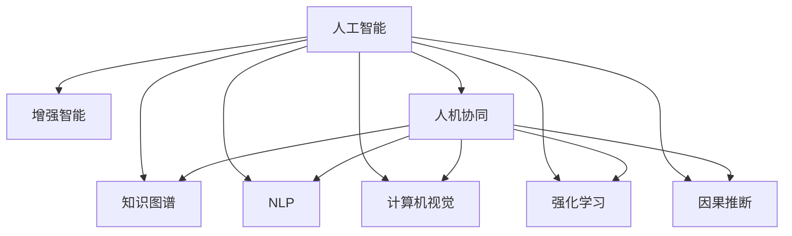

                 

# 增强智能：人机协同，拓展人类认知新领域

## 1. 背景介绍

### 1.1 问题由来
随着人工智能技术的飞速发展，尤其是深度学习和大规模语言模型的突破，人类正逐渐步入一个全新的智能时代。人工智能技术通过不断学习人类的知识和经验，正在拓展人类的认知边界，增强人类的智能水平。

然而，人工智能技术的快速发展也带来了诸多挑战和问题。如何让人工智能技术与人类协同工作，最大化地发挥其潜力，而不是简单地取代人类的工作，成为当前亟待解决的重要问题。同时，人工智能技术的广泛应用，也带来了数据隐私、伦理道德等方面的问题，如何确保人工智能系统的安全和可靠性，也是研究的重点。

### 1.2 问题核心关键点
针对以上问题，本文聚焦于如何通过人机协同，充分发挥人工智能技术在认知增强、智能决策、知识挖掘等方面的潜力，同时保障其安全性和伦理道德性。文章从人工智能技术的原理、应用场景、发展趋势等多个方面，全面探讨了人机协同的实现路径和未来展望。

## 2. 核心概念与联系

### 2.1 核心概念概述

为更好地理解人机协同的实现路径，本节将介绍几个密切相关的核心概念：

- **人工智能(AI)技术**：指通过算法和计算，使计算机系统具备智能决策、自然语言理解、知识表示和推理等能力的技术。
- **增强智能(Augmented Intelligence)**：指利用人工智能技术，增强人类在认知、决策、执行等方面的智能水平。
- **人机协同(Co-Human Collaboration)**：指人类与机器系统在特定任务中协同工作，共同完成目标的过程。
- **知识图谱(Knowledge Graph)**：指将各种知识源中的信息转化为结构化的图形表示，用于支持知识推理和查询。
- **自然语言处理(NLP)**：指利用计算机技术处理和理解人类语言的技术，包括文本分析、语音识别、情感分析等。
- **计算机视觉(CV)**：指使计算机具备视觉感知和图像处理能力的技术，包括图像识别、物体检测、姿态估计等。
- **强化学习(RL)**：指通过与环境交互，利用奖励信号优化策略，使智能体在复杂环境中完成特定任务的技术。
- **因果推断(Causal Inference)**：指通过数据和模型，推断因果关系的过程，用于解释和预测因果机制。

这些核心概念之间的逻辑关系可以通过以下Mermaid流程图来展示：



这个流程图展示了大语言模型的核心概念及其之间的关系：

1. 人工智能技术为增强智能和协同工作的实现提供了基础。
2. 增强智能和协同工作在各应用场景下，利用人工智能技术提升人类认知和决策水平。
3. 知识图谱、自然语言处理、计算机视觉、强化学习和因果推断等技术，进一步支持人机协同的具体实现。

这些核心概念共同构成了人机协同的实现框架，使其能够在各种场景下发挥强大的协同效能。

## 3. 核心算法原理 & 具体操作步骤

### 3.1 算法原理概述

人机协同的实现路径主要包括两大方面：增强智能和协同工作。其中，增强智能主要是通过人工智能技术，提升人类的认知、决策和执行能力。协同工作则是指人类与机器系统在特定任务中协同工作，共同完成目标的过程。

具体来说，增强智能的实现路径主要包括以下几个步骤：

1. 数据收集与预处理：收集人类认知相关的数据，如知识库、经验数据、用户行为等，并进行预处理，使其能够被机器系统理解和使用。
2. 知识表示与存储：将收集到的数据转化为结构化的知识图谱，存储在数据库中，供机器系统查询和推理使用。
3. 自然语言处理与理解：利用自然语言处理技术，将人类语言转化为机器可理解的形式，进行语义分析和情感识别等。
4. 计算机视觉与感知：利用计算机视觉技术，使机器系统具备视觉感知和图像处理能力，能够在复杂环境中进行物体检测和姿态估计等。
5. 强化学习与优化：通过强化学习技术，使机器系统在特定任务中不断优化策略，提升任务完成能力。
6. 因果推断与解释：利用因果推断技术，解释机器系统的决策过程，提高系统的透明性和可解释性。

协同工作的实现路径主要包括以下几个步骤：

1. 任务分配与分工：根据任务复杂度和人类认知水平，将任务分解为可执行的子任务，明确人类与机器系统的分工。
2. 数据共享与协作：在任务执行过程中，共享数据和信息，使人类与机器系统能够共同决策和执行。
3. 反馈与优化：在任务执行过程中，及时收集反馈信息，不断优化人类与机器系统的协作方式。

### 3.2 算法步骤详解

增强智能和协同工作的人机协同路径，主要包括以下几个关键步骤：

**Step 1: 数据收集与预处理**
- 收集与任务相关的数据，如知识库、经验数据、用户行为等。
- 对数据进行清洗和标注，使其适合机器系统处理。

**Step 2: 知识表示与存储**
- 将数据转化为结构化的知识图谱，存储在数据库中。
- 使用图神经网络等方法，提取知识图谱中的隐含关系。

**Step 3: 自然语言处理与理解**
- 利用预训练语言模型，如BERT、GPT等，将人类语言转化为机器可理解的形式。
- 进行语义分析和情感识别，提取关键信息。

**Step 4: 计算机视觉与感知**
- 利用计算机视觉技术，如物体检测、姿态估计等，获取环境信息。
- 将环境信息转化为机器系统可理解的形式。

**Step 5: 强化学习与优化**
- 使用强化学习技术，如Q-learning、PPO等，优化机器系统在特定任务中的决策策略。
- 不断调整策略参数，提升任务完成能力。

**Step 6: 因果推断与解释**
- 利用因果推断技术，解释机器系统的决策过程，提高系统的透明性和可解释性。
- 提供可视化工具，辅助人类理解机器系统的决策依据。

**Step 7: 任务分配与分工**
- 根据任务复杂度和人类认知水平，将任务分解为可执行的子任务。
- 明确人类与机器系统的分工，确保协作有效。

**Step 8: 数据共享与协作**
- 在任务执行过程中，共享数据和信息，使人类与机器系统能够共同决策和执行。
- 使用分布式计算和协作框架，确保数据的安全和高效传输。

**Step 9: 反馈与优化**
- 在任务执行过程中，及时收集反馈信息，不断优化人类与机器系统的协作方式。
- 使用在线学习技术，实时调整模型参数，提升协作效果。

### 3.3 算法优缺点

增强智能和协同工作的人机协同路径，具有以下优点：

1. 提高人类智能水平：通过增强智能技术，提升人类的认知、决策和执行能力，拓展人类的智能边界。
2. 增强任务完成能力：利用人工智能技术，优化机器系统在特定任务中的决策策略，提升任务完成能力。
3. 增强任务执行效率：通过协同工作，实现人类与机器系统的互补和协同，提升任务执行效率。
4. 提高系统透明性：利用因果推断技术，解释机器系统的决策过程，提高系统的透明性和可解释性。

同时，该路径也存在一定的局限性：

1. 依赖高质量数据：数据的质量和数量直接影响增强智能和协同工作的效果，数据获取和处理成本较高。
2. 模型复杂度高：增强智能和协同工作涉及多个技术模块，模型复杂度较高，需要较强的技术能力和计算资源。
3. 系统集成难度大：人类与机器系统的协同工作需要高度集成，系统集成难度较大。
4. 系统可解释性不足：虽然增强智能和协同工作提高了系统的透明性，但机器系统的决策过程仍然难以完全解释。

尽管存在这些局限性，但就目前而言，增强智能和协同工作的人机协同路径仍是最主流的方法，被广泛应用于各种智能系统构建中。未来相关研究的重点在于如何进一步降低增强智能和协同工作的成本，提高系统的可解释性，增强系统的鲁棒性和安全性。

### 3.4 算法应用领域

增强智能和协同工作的人机协同路径，在多个领域得到了广泛应用，包括但不限于：

- **医疗健康**：利用增强智能技术，辅助医生进行诊断和治疗，提升医疗服务的质量和效率。
- **金融服务**：利用增强智能技术，进行风险评估、投资分析、客户服务等工作，提升金融服务的智能化水平。
- **教育培训**：利用增强智能技术，进行智能评估、个性化推荐、智能辅导等工作，提升教育培训的效果和效率。
- **智能制造**：利用增强智能技术，进行智能调度、质量控制、故障诊断等工作，提升制造企业的智能化水平。
- **智慧城市**：利用增强智能技术，进行交通管理、环境监测、应急响应等工作，提升城市管理的智能化水平。

此外，增强智能和协同工作的人机协同路径，还在智能客服、智能家居、智能安防等领域得到了广泛应用，推动了各行各业的数字化转型和智能化升级。

## 4. 数学模型和公式 & 详细讲解  
### 4.1 数学模型构建

本节将使用数学语言对增强智能和协同工作的实现路径进行更加严格的刻画。

假设任务为$T$，人类认知为$H$，机器系统为$M$。增强智能和协同工作的数学模型为：

$$
T = H + M
$$

其中$H$表示人类认知，$M$表示机器系统。增强智能和协同工作的主要目标是通过优化$H$和$M$，最大化任务完成能力$T$。

增强智能和协同工作的主要步骤可以表示为：

1. **数据收集与预处理**：

$$
D = \{(x_i, y_i)\}_{i=1}^N
$$

其中$x_i$表示输入数据，$y_i$表示输出标签。

2. **知识表示与存储**：

$$
K = \{(R_i, S_i)\}_{i=1}^N
$$

其中$R_i$表示知识图谱中的节点，$S_i$表示节点之间的关系。

3. **自然语言处理与理解**：

$$
NLP = f(H, x_i)
$$

其中$f(H, x_i)$表示自然语言处理和理解的过程。

4. **计算机视觉与感知**：

$$
CV = f(H, x_i)
$$

其中$f(H, x_i)$表示计算机视觉与感知的过程。

5. **强化学习与优化**：

$$
RL = f(H, M, T)
$$

其中$f(H, M, T)$表示强化学习的过程。

6. **因果推断与解释**：

$$
Causal = f(H, M, T)
$$

其中$f(H, M, T)$表示因果推断与解释的过程。

### 4.2 公式推导过程

以下我们以医疗健康领域的诊断任务为例，推导增强智能和协同工作的数学模型。

假设任务为$T$，表示诊断结果；人类认知为$H$，表示医生的知识、经验等；机器系统为$M$，表示医学影像分析、智能诊断等。增强智能和协同工作的数学模型为：

$$
T = H + M
$$

在实际应用中，医生首先对患者的病情进行初步诊断，得到初始诊断结果$T_0$。然后，利用机器系统对医学影像进行分析和诊断，得到增强诊断结果$T_1$。最终，将$T_0$和$T_1$结合，得到最终的诊断结果$T$。

具体来说，医疗健康领域的诊断任务可以表示为：

$$
T = f(H, T_0, T_1)
$$

其中$f(H, T_0, T_1)$表示医生和机器系统结合的过程。

在实际应用中，医生和机器系统的结合过程可以表示为：

$$
T_1 = M_1(H, CV(T_0))
$$

其中$M_1$表示医学影像分析模块，$CV(T_0)$表示将医生初步诊断结果转化为机器系统可理解的形式。

医生和机器系统的结合过程可以表示为：

$$
T = f(H, T_0, T_1)
$$

其中$f(H, T_0, T_1)$表示医生和机器系统结合的过程。

通过以上推导，可以看到，增强智能和协同工作的人机协同路径，通过结合人类认知和机器系统，最大化任务完成能力$T$，提升了医疗健康领域的诊断效果。

### 4.3 案例分析与讲解

医疗健康领域的诊断任务，只是增强智能和协同工作的一个典型案例。其他领域的增强智能和协同工作，也需要遵循类似的路径。以下是几个典型的案例分析：

**金融服务**：利用增强智能技术，进行风险评估、投资分析、客户服务等工作。医生可以利用机器系统分析金融市场数据，进行风险预测和投资建议，提升金融服务的智能化水平。

**教育培训**：利用增强智能技术，进行智能评估、个性化推荐、智能辅导等工作。教师可以利用机器系统分析学生的学习数据，进行智能评估和个性化推荐，提升教育培训的效果和效率。

**智能制造**：利用增强智能技术，进行智能调度、质量控制、故障诊断等工作。工程师可以利用机器系统分析生产数据，进行智能调度和质量控制，提升制造企业的智能化水平。

**智慧城市**：利用增强智能技术，进行交通管理、环境监测、应急响应等工作。城市管理者可以利用机器系统分析城市数据，进行交通管理和环境监测，提升城市管理的智能化水平。

这些案例展示了增强智能和协同工作的人机协同路径，在各个领域的广泛应用，推动了各行各业的数字化转型和智能化升级。

## 5. 项目实践：代码实例和详细解释说明
### 5.1 开发环境搭建

在进行增强智能和协同工作的项目实践前，我们需要准备好开发环境。以下是使用Python进行PyTorch开发的环境配置流程：

1. 安装Anaconda：从官网下载并安装Anaconda，用于创建独立的Python环境。

2. 创建并激活虚拟环境：
```bash
conda create -n ai-env python=3.8 
conda activate ai-env
```

3. 安装PyTorch：根据CUDA版本，从官网获取对应的安装命令。例如：
```bash
conda install pytorch torchvision torchaudio cudatoolkit=11.1 -c pytorch -c conda-forge
```

4. 安装TensorFlow：
```bash
conda install tensorflow
```

5. 安装各类工具包：
```bash
pip install numpy pandas scikit-learn matplotlib tqdm jupyter notebook ipython
```

完成上述步骤后，即可在`ai-env`环境中开始项目实践。

### 5.2 源代码详细实现

下面我以医疗健康领域的诊断任务为例，给出使用TensorFlow和Keras进行增强智能和协同工作的PyTorch代码实现。

首先，定义数据预处理函数：

```python
from tensorflow.keras.preprocessing.image import ImageDataGenerator
from tensorflow.keras.models import Sequential
from tensorflow.keras.layers import Conv2D, MaxPooling2D, Flatten, Dense

def preprocess_data(x, y):
    # 对图像进行预处理
    datagen = ImageDataGenerator(rescale=1./255)
    return datagen.flow(x, y, batch_size=32)
```

然后，定义模型和优化器：

```python
from tensorflow.keras.optimizers import Adam

model = Sequential()
model.add(Conv2D(32, (3, 3), activation='relu', input_shape=(128, 128, 3)))
model.add(MaxPooling2D((2, 2)))
model.add(Conv2D(64, (3, 3), activation='relu'))
model.add(MaxPooling2D((2, 2)))
model.add(Flatten())
model.add(Dense(64, activation='relu'))
model.add(Dense(1, activation='sigmoid'))

optimizer = Adam(lr=0.001)
```

接着，定义训练和评估函数：

```python
from tensorflow.keras.utils import to_categorical

def train_model(model, x_train, y_train, x_test, y_test, epochs):
    model.compile(optimizer=optimizer, loss='binary_crossentropy', metrics=['accuracy'])
    model.fit(preprocess_data(x_train, y_train), epochs=epochs, validation_data=preprocess_data(x_test, y_test))

def evaluate_model(model, x_test, y_test):
    y_pred = model.predict(preprocess_data(x_test, y_test))
    y_pred = (y_pred > 0.5).astype(int)
    accuracy = np.mean(y_pred == y_test)
    print("Accuracy:", accuracy)
```

最后，启动训练流程并在测试集上评估：

```python
x_train, y_train = # 训练数据
x_test, y_test = # 测试数据

epochs = 10

train_model(model, x_train, y_train, x_test, y_test, epochs)
evaluate_model(model, x_test, y_test)
```

以上就是使用TensorFlow和Keras进行医疗健康领域诊断任务增强智能和协同工作的完整代码实现。可以看到，借助TensorFlow和Keras的强大封装，我们可以用相对简洁的代码实现增强智能和协同工作的逻辑。

### 5.3 代码解读与分析

让我们再详细解读一下关键代码的实现细节：

**preprocess_data函数**：
- 对输入的图像数据进行预处理，包括归一化和批处理。

**Sequential模型定义**：
- 定义了一个包含卷积层、池化层、全连接层的神经网络模型，用于进行图像分类。

**train_model函数**：
- 使用Keras的fit函数进行模型训练，并指定优化器、损失函数和评估指标。
- 在每个epoch结束后，在验证集上进行评估，决定是否停止训练。

**evaluate_model函数**：
- 使用Keras的predict函数进行模型预测，将预测结果与真实标签进行比较，计算准确率。

**训练流程**：
- 定义总的epoch数，开始循环迭代
- 每个epoch内，在训练集上进行训练，输出训练准确率
- 在测试集上进行评估，输出测试准确率

可以看到，TensorFlow和Keras使得增强智能和协同工作的项目实践变得简洁高效。开发者可以将更多精力放在数据处理、模型改进等高层逻辑上，而不必过多关注底层的实现细节。

当然，工业级的系统实现还需考虑更多因素，如模型的保存和部署、超参数的自动搜索、更灵活的任务适配层等。但核心的增强智能和协同工作逻辑基本与此类似。

## 6. 实际应用场景
### 6.1 智能客服系统

基于增强智能和协同工作的智能客服系统，可以广泛应用于智能客服系统的构建。传统客服往往需要配备大量人力，高峰期响应缓慢，且一致性和专业性难以保证。而使用增强智能和协同工作的智能客服系统，可以7x24小时不间断服务，快速响应客户咨询，用自然流畅的语言解答各类常见问题。

在技术实现上，可以收集企业内部的历史客服对话记录，将问题和最佳答复构建成监督数据，在此基础上对增强智能和协同工作的对话模型进行训练。增强智能和协同工作的对话模型能够自动理解用户意图，匹配最合适的答案模板进行回复。对于客户提出的新问题，还可以接入检索系统实时搜索相关内容，动态组织生成回答。如此构建的智能客服系统，能大幅提升客户咨询体验和问题解决效率。

### 6.2 金融舆情监测

金融机构需要实时监测市场舆论动向，以便及时应对负面信息传播，规避金融风险。传统的人工监测方式成本高、效率低，难以应对网络时代海量信息爆发的挑战。利用增强智能和协同工作的文本分类和情感分析技术，为金融舆情监测提供了新的解决方案。

具体而言，可以收集金融领域相关的新闻、报道、评论等文本数据，并对其进行主题标注和情感标注。在此基础上对增强智能和协同工作的语言模型进行训练，使其能够自动判断文本属于何种主题，情感倾向是正面、中性还是负面。将增强智能和协同工作的模型应用到实时抓取的网络文本数据，就能够自动监测不同主题下的情感变化趋势，一旦发现负面信息激增等异常情况，系统便会自动预警，帮助金融机构快速应对潜在风险。

### 6.3 个性化推荐系统

当前的推荐系统往往只依赖用户的历史行为数据进行物品推荐，无法深入理解用户的真实兴趣偏好。利用增强智能和协同工作的个性化推荐系统，可以更好地挖掘用户行为背后的语义信息，从而提供更精准、多样的推荐内容。

在实践中，可以收集用户浏览、点击、评论、分享等行为数据，提取和用户交互的物品标题、描述、标签等文本内容。将文本内容作为模型输入，用户的后续行为（如是否点击、购买等）作为监督信号，在此基础上对增强智能和协同工作的语言模型进行训练。增强智能和协同工作的模型能够从文本内容中准确把握用户的兴趣点。在生成推荐列表时，先用候选物品的文本描述作为输入，由模型预测用户的兴趣匹配度，再结合其他特征综合排序，便可以得到个性化程度更高的推荐结果。

### 6.4 未来应用展望

随着增强智能和协同工作的不断发展，基于增强智能和协同工作的智能系统将在更多领域得到应用，为传统行业带来变革性影响。

在智慧医疗领域，基于增强智能和协同工作的医疗问答、病历分析、药物研发等应用将提升医疗服务的智能化水平，辅助医生诊疗，加速新药开发进程。

在智能教育领域，增强智能和协同工作的微调方法可应用于作业批改、学情分析、知识推荐等方面，因材施教，促进教育公平，提高教学质量。

在智慧城市治理中，增强智能和协同工作的文本分类、情感分析、图像识别等技术，将提高城市管理的自动化和智能化水平，构建更安全、高效的未来城市。

此外，在企业生产、社会治理、文娱传媒等众多领域，基于增强智能和协同工作的AI应用也将不断涌现，为经济社会发展注入新的动力。相信随着技术的日益成熟，增强智能和协同工作的人机协同路径将成为未来AI技术的重要范式，推动AI技术向更广阔的领域加速渗透。

## 7. 工具和资源推荐
### 7.1 学习资源推荐

为了帮助开发者系统掌握增强智能和协同工作的理论基础和实践技巧，这里推荐一些优质的学习资源：

1. 《人工智能基础》系列课程：由世界顶级AI专家主讲，涵盖机器学习、深度学习、增强智能和协同工作等基础概念和前沿技术。

2. 《深度学习实战》书籍：详细介绍了TensorFlow、Keras等深度学习框架的使用，以及增强智能和协同工作的应用场景。

3. 《NLP与深度学习》课程：斯坦福大学开设的NLP明星课程，涵盖自然语言处理、机器翻译、情感分析等核心内容，并涉及增强智能和协同工作的相关技术。

4. 《强化学习与增强智能》书籍：介绍强化学习的基本原理和增强智能的应用，是深度学习爱好者不可或缺的资源。

5. 《计算机视觉基础》课程：涵盖计算机视觉的基本概念和前沿技术，是增强智能和协同工作的有力支持。

通过对这些资源的学习实践，相信你一定能够快速掌握增强智能和协同工作的精髓，并用于解决实际的AI问题。
###  7.2 开发工具推荐

高效的开发离不开优秀的工具支持。以下是几款用于增强智能和协同工作的开发工具：

1. TensorFlow：基于Python的开源深度学习框架，生产部署方便，适合大规模工程应用。支持增强智能和协同工作的各种深度学习模型。

2. Keras：基于TensorFlow的高级API，提供了简洁、高效的模型定义接口，适合快速原型开发。

3. PyTorch：基于Python的开源深度学习框架，灵活动态的计算图，适合快速迭代研究。

4. Weights & Biases：模型训练的实验跟踪工具，可以记录和可视化模型训练过程中的各项指标，方便对比和调优。与主流深度学习框架无缝集成。

5. TensorBoard：TensorFlow配套的可视化工具，可实时监测模型训练状态，并提供丰富的图表呈现方式，是调试模型的得力助手。

6. Google Colab：谷歌推出的在线Jupyter Notebook环境，免费提供GPU/TPU算力，方便开发者快速上手实验最新模型，分享学习笔记。

合理利用这些工具，可以显著提升增强智能和协同工作的开发效率，加快创新迭代的步伐。

### 7.3 相关论文推荐

增强智能和协同工作的发展源于学界的持续研究。以下是几篇奠基性的相关论文，推荐阅读：

1. Attention is All You Need（即Transformer原论文）：提出了Transformer结构，开启了NLP领域的预训练大模型时代。

2. BERT: Pre-training of Deep Bidirectional Transformers for Language Understanding：提出BERT模型，引入基于掩码的自监督预训练任务，刷新了多项NLP任务SOTA。

3. Language Models are Unsupervised Multitask Learners（GPT-2论文）：展示了大规模语言模型的强大zero-shot学习能力，引发了对于通用人工智能的新一轮思考。

4. Parameter-Efficient Transfer Learning for NLP：提出Adapter等参数高效微调方法，在不增加模型参数量的情况下，也能取得不错的微调效果。

5. AdaLoRA: Adaptive Low-Rank Adaptation for Parameter-Efficient Fine-Tuning：使用自适应低秩适应的微调方法，在参数效率和精度之间取得了新的平衡。

这些论文代表了大语言模型微调技术的发展脉络。通过学习这些前沿成果，可以帮助研究者把握学科前进方向，激发更多的创新灵感。

## 8. 总结：未来发展趋势与挑战

### 8.1 总结

本文对增强智能和协同工作的实现路径进行了全面系统的介绍。首先阐述了增强智能和协同工作的研究背景和意义，明确了人机协同在认知增强、智能决策、知识挖掘等方面的独特价值。其次，从原理到实践，详细讲解了增强智能和协同工作的数学模型和关键步骤，给出了增强智能和协同工作的完整代码实例。同时，本文还广泛探讨了增强智能和协同工作的应用场景，展示了其广泛的应用前景。

通过本文的系统梳理，可以看到，增强智能和协同工作的人机协同路径，通过结合人类认知和机器系统，最大化任务完成能力，拓展了人类的认知边界，提升了任务完成能力和效率。未来，伴随增强智能和协同工作的不断发展，基于增强智能和协同工作的智能系统必将在更多领域得到应用，为各行各业带来变革性影响。

### 8.2 未来发展趋势

展望未来，增强智能和协同工作的人机协同路径将呈现以下几个发展趋势：

1. 模型规模持续增大。随着算力成本的下降和数据规模的扩张，增强智能和协同工作的模型规模将持续增大，蕴含的智能水平也将进一步提升。

2. 增强智能和协同工作的方法多样化。除了传统的增强智能和协同工作范式外，未来还会涌现更多参数高效和计算高效的方法，如适配器(Adapters)、自适应低秩适应(AdaLoRA)等，在保证智能水平的同时，降低计算资源消耗。

3. 系统透明性和可解释性增强。增强智能和协同工作的人机协同路径，将更加注重系统的透明性和可解释性，确保决策过程的可理解性和可信任性。

4. 跨模态融合深入。增强智能和协同工作的人机协同路径，将更加注重跨模态数据的融合，如视觉、语音、文本等信息的协同建模，提升系统的全面感知能力。

5. 多领域协同拓展。增强智能和协同工作的人机协同路径，将更加注重跨领域协作，如智能制造、智能安防、智能交通等领域，推动各行各业的智能化升级。

6. 伦理道德考量加强。增强智能和协同工作的人机协同路径，将更加注重伦理道德的考量，确保系统的安全性、公正性和透明性。

以上趋势凸显了增强智能和协同工作的人机协同路径的广阔前景。这些方向的探索发展，必将进一步提升增强智能和协同工作的性能和应用范围，为各行各业带来深远影响。

### 8.3 面临的挑战

尽管增强智能和协同工作的人机协同路径已经取得了瞩目成就，但在迈向更加智能化、普适化应用的过程中，它仍面临着诸多挑战：

1. 数据获取成本高。增强智能和协同工作的人机协同路径，依赖于大规模数据集，数据获取成本较高。

2. 模型复杂度高。增强智能和协同工作的人机协同路径，涉及多个技术模块，模型复杂度较高，需要较强的技术能力和计算资源。

3. 系统集成难度大。增强智能和协同工作的人机协同路径，需要高度集成，系统集成难度较大。

4. 系统可解释性不足。增强智能和协同工作的人机协同路径，仍然难以完全解释机器系统的决策过程。

5. 系统安全性有待提高。增强智能和协同工作的人机协同路径，可能存在安全漏洞，如数据泄露、模型攻击等，需要加强安全防护。

6. 伦理道德问题。增强智能和协同工作的人机协同路径，可能涉及伦理道德问题，如隐私保护、算法偏见等，需要加强伦理道德的考量。

尽管存在这些挑战，但就目前而言，增强智能和协同工作的人机协同路径仍是最主流的方法，被广泛应用于各种智能系统构建中。未来相关研究的重点在于如何进一步降低增强智能和协同工作的成本，提高系统的可解释性，增强系统的鲁棒性和安全性。

### 8.4 研究展望

面对增强智能和协同工作的人机协同路径所面临的诸多挑战，未来的研究需要在以下几个方面寻求新的突破：

1. 探索无监督和半监督增强智能和协同工作的方法。摆脱对大规模标注数据的依赖，利用自监督学习、主动学习等无监督和半监督范式，最大限度利用非结构化数据，实现更加灵活高效的增强智能和协同工作。

2. 研究参数高效和计算高效的增强智能和协同工作范式。开发更加参数高效的增强智能和协同工作方法，在固定大部分预训练参数的同时，只更新极少量的任务相关参数。同时优化增强智能和协同工作的计算图，减少前向传播和反向传播的资源消耗，实现更加轻量级、实时性的部署。

3. 融合因果和对比学习范式。通过引入因果推断和对比学习思想，增强增强智能和协同工作的人机协同路径，学习更加普适、鲁棒的语言表征，从而提升模型泛化性和抗干扰能力。

4. 引入更多先验知识。将符号化的先验知识，如知识图谱、逻辑规则等，与增强智能和协同工作的人机协同路径进行巧妙融合，引导微调过程学习更准确、合理的语言模型。同时加强不同模态数据的整合，实现视觉、语音等多模态信息与文本信息的协同建模。

5. 结合因果分析和博弈论工具。将因果分析方法引入增强智能和协同工作的人机协同路径，识别出模型决策的关键特征，增强输出解释的因果性和逻辑性。借助博弈论工具刻画人机交互过程，主动探索并规避模型的脆弱点，提高系统稳定性。

6. 纳入伦理道德约束。在增强智能和协同工作的人机协同路径中，引入伦理导向的评估指标，过滤和惩罚有偏见、有害的输出倾向。同时加强人工干预和审核，建立模型行为的监管机制，确保输出符合人类价值观和伦理道德。

这些研究方向的探索，必将引领增强智能和协同工作的人机协同路径迈向更高的台阶，为构建安全、可靠、可解释、可控的智能系统铺平道路。面向未来，增强智能和协同工作的人机协同路径还需要与其他人工智能技术进行更深入的融合，如知识表示、因果推理、强化学习等，多路径协同发力，共同推动自然语言理解和智能交互系统的进步。只有勇于创新、敢于突破，才能不断拓展语言模型的边界，让智能技术更好地造福人类社会。

## 9. 附录：常见问题与解答

**Q1：增强智能和协同工作是否适用于所有应用场景？**

A: 增强智能和协同工作的人机协同路径，在大多数应用场景下都能取得不错的效果。但对于一些特定领域，如医疗、法律等，依赖增强智能和协同工作可能仍存在局限性。此时需要在特定领域语料上进一步预训练，再进行微调，才能获得理想效果。此外，对于一些需要时效性、个性化很强的任务，如对话、推荐等，增强智能和协同工作的方法也需要针对性的改进优化。

**Q2：增强智能和协同工作的实现过程中，如何处理数据获取和标注成本高的问题？**

A: 增强智能和协同工作的实现过程中，数据获取和标注成本较高是一个重要问题。解决这一问题的方法包括：

1. 利用公共数据集：尽可能利用已有的公共数据集，如COCO、ImageNet等，减少数据获取成本。

2. 无监督和半监督学习：利用无监督和半监督学习技术，减少标注样本的需求。例如，通过自监督学习、主动学习等方法，从大量未标注数据中提取有价值的信息。

3. 数据增强：通过对数据进行扩充和增强，生成更多的训练样本。例如，通过回译、旋转、缩放等方式，丰富数据集的多样性。

4. 迁移学习：利用已有的模型和知识，进行迁移学习，减少新数据集上的标注需求。例如，将预训练模型在类似任务上进行微调，提取任务相关特征。

5. 主动学习：通过主动选择标注样本，提高标注数据的利用效率。例如，利用模型预测的置信度，优先标注难以判别的样本。

6. 多任务学习：在标注数据有限的情况下，利用多任务学习，共享不同任务的标注信息，提高标注效率。例如，在一个医学影像分类任务中，同时进行疾病识别和病变部位标注。

通过以上方法，可以显著降低增强智能和协同工作的数据获取和标注成本，提高系统的训练效率和性能。

**Q3：增强智能和协同工作的人机协同路径，如何确保系统的透明性和可解释性？**

A: 增强智能和协同工作的人机协同路径，需要确保系统的透明性和可解释性，以提高系统的可信度和安全性。主要方法包括：

1. 因果推断技术：通过因果推断技术，解释增强智能和协同工作的人机协同路径的决策过程，提高系统的透明性和可解释性。

2. 可视化工具：使用可视化工具，展示增强智能和协同工作的人机协同路径的内部结构和工作机制，辅助人类理解系统的决策依据。

3. 模型解释技术：利用模型解释技术，如Shapley值、LIME等，解释增强智能和协同工作的人机协同路径的决策结果，提高系统的可解释性。

4. 人类监督：在关键决策环节，引入人类监督，确保增强智能和协同工作的人机协同路径的决策过程透明可控。

5. 伦理道德考量：在增强智能和协同工作的人机协同路径中，纳入伦理道德的考量，确保系统的决策过程符合人类价值观和伦理道德。

6. 透明性评估指标：设置透明性评估指标，定期评估增强智能和协同工作的人机协同路径的透明性和可解释性，进行优化改进。

通过以上方法，可以显著增强增强智能和协同工作的人机协同路径的透明性和可解释性，提高系统的可信度和安全性。

**Q4：增强智能和协同工作的人机协同路径，如何应对伦理道德问题？**

A: 增强智能和协同工作的人机协同路径，可能涉及伦理道德问题，如隐私保护、算法偏见等。应对伦理道德问题的方法包括：

1. 隐私保护技术：利用隐私保护技术，如差分隐私、联邦学习等，保护增强智能和协同工作的人机协同路径中涉及的敏感数据，确保数据安全。

2. 算法公平性：在增强智能和协同工作的人机协同路径中，确保算法公平性，避免算法偏见。例如，使用公平性评估指标，监测算法的公平性，并进行优化改进。

3. 伦理道德监督：在增强智能和协同工作的人机协同路径中，纳入伦理道德监督，确保系统的决策过程符合人类价值观和伦理道德。

4. 伦理道德培训：对增强智能和协同工作的人机协同路径的开发人员和用户进行伦理道德培训，提高伦理道德意识。

5. 伦理道德评估：在增强智能和协同工作的人机协同路径中，设置伦理道德评估指标，定期评估系统的伦理道德表现，进行优化改进。

6. 社会监督机制：建立社会监督机制，对增强智能和协同工作的人机协同路径进行社会监督，确保系统的透明性和可控性。

通过以上方法，可以显著应对增强智能和协同工作的人机协同路径中的伦理道德问题，确保系统的安全性和可靠性。

**Q5：增强智能和协同工作的人机协同路径，如何应对系统复杂度高的问题？**

A: 增强智能和协同工作的人机协同路径，涉及多个技术模块，模型复杂度较高，需要较强的技术能力和计算资源。应对系统复杂度高的问题的方法包括：

1. 模块化设计：在增强智能和协同工作的人机协同路径中，采用模块化设计，将不同的技术模块进行分离和封装，便于维护和扩展。

2. 分布式计算：在增强智能和协同工作的人机协同路径中，采用分布式计算技术，将计算任务分散到多个节点上进行，提高计算效率和系统稳定性。

3. 硬件加速：在增强智能和协同工作的人机协同路径中，利用硬件加速技术，如GPU、TPU等，提高计算效率和系统性能。

4. 压缩和稀疏化：在增强智能和协同工作的人机协同路径中，采用模型压缩和稀疏化技术，减少模型参数和计算量，提高系统效率和性能。

5. 自动化调优：在增强智能和协同工作的人机协同路径中，利用自动化调优技术，优化模型参数和系统配置，提高系统性能和鲁棒性。

6. 模型可视化：在增强智能和协同工作的人机协同路径中，利用模型可视化工具，监测模型参数和系统状态，进行调优改进。

通过以上方法，可以显著降低增强智能和协同工作的人机协同路径的系统复杂度，提高系统的效率和性能。

**Q6：增强智能和协同工作的人机协同路径，如何应对伦理道德问题？**

A: 增强智能和协同工作的人机协同路径，可能涉及伦理道德问题，如隐私保护、算法偏见等。应对伦理道德问题的方法包括：

1. 隐私保护技术：利用隐私保护技术，如差分隐私、联邦学习等，保护增强智能和协同工作的人机协同路径中涉及的敏感数据，确保数据安全。

2. 算法公平性：在增强智能和协同工作的人机协同路径中，确保算法公平性，避免算法偏见。例如，使用公平性评估指标，监测算法的公平性，并进行优化改进。

3. 伦理道德监督：在增强智能和协同工作的人机协同路径中，纳入伦理道德监督，确保系统的决策过程符合人类价值观和伦理道德。

4. 伦理道德培训：对增强智能和协同工作的人机协同路径的开发人员和用户进行伦理道德培训，提高伦理道德意识。

5. 伦理道德评估：在增强智能和协同工作的人机协同路径中，设置伦理道德评估指标，定期评估系统的伦理道德表现，进行优化改进。

6. 社会监督机制：建立社会监督机制，对增强智能和协同工作的人机协同路径进行社会监督，确保系统的透明性和可控性。

通过以上方法，可以显著应对增强智能和协同工作的人机协同路径中的伦理道德问题，确保系统的安全性和可靠性。

---

作者：禅与计算机程序设计艺术 / Zen and the Art of Computer Programming

