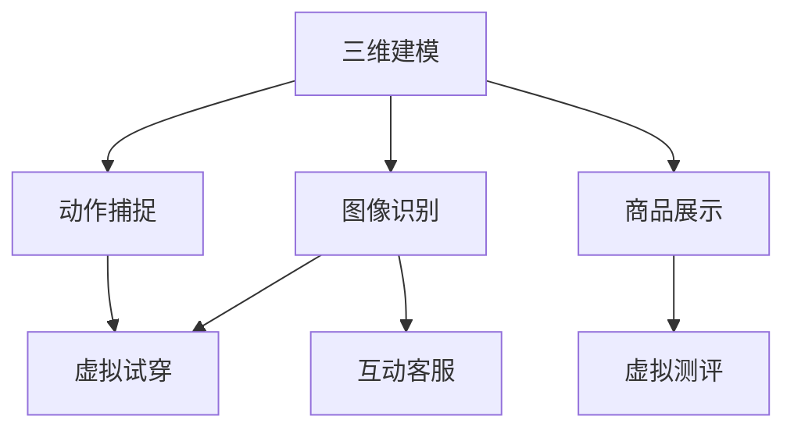

                 

# 增强现实 (AR) 技术在电商领域的应用案例分析：技术应用与商业价值

## 1. 背景介绍

### 1.1 问题由来

随着数字技术的不断演进，增强现实 (AR) 技术正在成为电商行业的重要应用。AR 能够通过在现实世界中叠加虚拟信息，提供沉浸式购物体验，显著提高用户的购物效率和满意度。例如，电商平台可以展示商品的3D模型、试用效果等，用户可以通过手机或平板设备，无需离开物理世界就能“体验”商品。这不仅能节省用户的时间和精力，还能激发用户的购买欲望，提升转化率。

当前，AR 技术在电商领域的应用已经从简单的产品展示，扩展到商品测评、虚拟试穿、互动客服等多个方面。例如，宜家就利用AR技术允许用户在家装前通过手机预览商品配置效果；亚马逊通过Alexa语音助手集成AR功能，支持用户通过语音命令查看商品信息；Zara通过AR试衣镜，允许用户在店内实时查看衣服试穿效果。这些案例展示了AR技术在电商领域巨大的潜力。

### 1.2 问题核心关键点

AR 技术通过在用户与现实世界互动时，叠加虚拟信息，实现全新的交互方式。它在电商领域的应用，主要体现在以下几个方面：

- **商品展示**：通过3D建模和渲染技术，展示商品的虚拟效果。
- **虚拟试穿**：通过动作捕捉和图像识别技术，让用户“试穿”商品。
- **互动客服**：通过语音和手势识别技术，提供智能客服服务。
- **虚拟测评**：通过AR虚拟场景，让用户模拟使用商品。

这些应用不仅提升了用户体验，还为电商平台带来了新的商业价值。通过本文的分析，将探讨AR技术在电商领域的技术原理、实现步骤、优势与挑战，以及如何通过商业化的方式，实现其商业价值的最大化。

## 2. 核心概念与联系

### 2.1 核心概念概述

为了更好地理解AR技术在电商领域的应用，我们需要先了解一些核心概念：

- **增强现实 (AR)**：通过在现实世界中叠加虚拟信息，增强用户的感知体验。AR技术通常使用头戴显示器、手机、平板等设备作为显示窗口。
- **三维建模**：使用数学和计算机图形技术，对现实世界中的物体进行数字化建模，并赋予其3D属性。
- **图像识别**：通过计算机视觉技术，自动识别现实世界中的物体或场景，并提取特征信息。
- **动作捕捉**：通过传感器和设备，捕捉用户的动作和手势，并将其转换为数字信号。
- **虚拟试穿**：通过AR技术，让用户“试穿”服装、鞋子等商品，获得更真实的体验。
- **互动客服**：通过语音、手势和自然语言处理技术，提供智能客服服务，提升用户体验。

这些概念之间的逻辑关系可以通过以下Mermaid流程图来展示：



这个流程图展示了一些核心概念及其之间的联系：

1. 三维建模和图像识别共同构建虚拟商品，用户可以通过虚拟试穿和互动客服，获得沉浸式购物体验。
2. 商品展示和虚拟测评提供了更多商品信息，帮助用户做出购买决策。
3. 动作捕捉与虚拟试穿、互动客服紧密结合，提升了用户体验。

## 3. 核心算法原理 & 具体操作步骤

### 3.1 算法原理概述

AR 技术在电商领域的应用，主要依赖于计算机视觉、图像处理、传感器融合等核心算法。通过这些算法，电商平台能够将虚拟信息准确地叠加到现实世界中。

其核心原理如下：

1. **图像捕获**：通过摄像头或传感器，实时捕捉用户的视觉信息。
2. **图像处理**：对捕获到的图像进行预处理，提取关键特征，如边缘、角点、颜色等。
3. **目标识别**：通过机器学习算法，识别图像中的目标物体，如用户、商品、背景等。
4. **三维建模**：对目标物体进行三维建模，生成虚拟场景。
5. **虚拟叠加**：将虚拟信息（如商品信息、试穿效果等）叠加到现实世界中，显示给用户。

### 3.2 算法步骤详解

AR 在电商领域的应用，一般包括以下几个关键步骤：

**Step 1: 数据采集与预处理**

1. **图像捕获**：使用摄像头或传感器，实时采集用户的视觉信息。
2. **图像增强**：对图像进行增强处理，提升图像质量，如去噪、亮度调整、锐化等。
3. **图像分割**：将图像分割成不同的区域，提取感兴趣的对象。

**Step 2: 目标识别与定位**

1. **特征提取**：使用计算机视觉算法，提取目标对象的特征信息，如边缘、角点、颜色等。
2. **目标识别**：通过深度学习模型（如CNN、RNN等），对提取的特征进行分类，识别出目标对象。
3. **目标定位**：通过SLAM（同步定位与地图构建）等技术，定位目标对象在现实世界中的位置。

**Step 3: 三维建模与虚拟叠加**

1. **三维建模**：使用三维建模软件，对目标对象进行数字化建模，生成虚拟模型。
2. **虚拟场景渲染**：将虚拟模型与现实世界场景进行融合，生成虚拟场景。
3. **虚拟叠加**：将虚拟信息叠加到现实世界中，显示给用户。

### 3.3 算法优缺点

AR 技术在电商领域的应用，具有以下优点：

1. **沉浸式体验**：通过虚拟试穿、互动客服等功能，提升了用户的购物体验。
2. **个性化定制**：用户可以通过AR技术，实现个性化试穿和定制商品。
3. **营销优势**：通过虚拟展示和试穿，提升了商品的吸引力和销售额。

同时，也存在一些缺点：

1. **技术复杂度**：AR技术需要复杂的三维建模和图像处理算法，开发和维护成本较高。
2. **硬件要求**：需要高性能的设备，如智能手机、平板等，限制了部分用户的体验。
3. **隐私问题**：实时捕获和处理用户的视觉信息，可能引发隐私问题。

### 3.4 算法应用领域

AR 技术在电商领域的应用，主要集中在以下几个方面：

- **虚拟试穿**：通过AR技术，用户可以在家中试穿服装、鞋子等商品，提升购物体验。
- **虚拟测评**：用户可以在AR虚拟场景中，测试商品的实际效果，如厨房家电、家具等。
- **互动客服**：通过语音、手势和自然语言处理技术，提供智能客服服务，提升用户体验。
- **产品展示**：通过AR技术，展示商品的3D模型、使用效果等，提升产品吸引力。

这些应用场景，展示了AR技术在电商领域巨大的商业潜力。

## 4. 数学模型和公式 & 详细讲解

### 4.1 数学模型构建

AR 技术在电商领域的应用，涉及到图像处理、三维建模、深度学习等多个领域的数学模型。本文将以虚拟试穿为例，展示其数学模型的构建。

假设用户在现实世界中手持商品，AR系统通过摄像头捕获用户的视觉信息，并通过图像处理和目标识别，定位用户和商品的位置。设用户的位置为 $(x_u, y_u, z_u)$，商品的位置为 $(x_p, y_p, z_p)$。

设商品的三维模型为 $\mathbf{M}$，通过图像处理和目标识别，获取商品的特征向量 $\mathbf{F}$。通过三维建模，将特征向量 $\mathbf{F}$ 转换为商品的三维模型 $\mathbf{M}$。

接下来，将虚拟试穿效果叠加到现实世界中，显示给用户。设用户的视觉信息为 $\mathbf{I}_u$，商品的视觉信息为 $\mathbf{I}_p$。则虚拟试穿效果可以通过下式计算：

$$
\mathbf{I}_{AR} = \mathbf{I}_u \oplus \mathbf{M}_{uv}
$$

其中，$\oplus$ 表示虚拟信息与现实信息的叠加操作。

### 4.2 公式推导过程

以下是虚拟试穿的公式推导过程：

1. **图像捕获与增强**：设用户手持商品的图像为 $\mathbf{I}_u$，经过增强处理后，得到 $\mathbf{I}_u^+$。

2. **目标识别与定位**：通过深度学习模型，识别图像中的目标对象，并定位其位置。设商品的位置为 $(x_p, y_p, z_p)$。

3. **三维建模**：设商品的三维模型为 $\mathbf{M}$，通过三维建模，将特征向量 $\mathbf{F}$ 转换为商品的三维模型 $\mathbf{M}$。

4. **虚拟叠加**：将虚拟试穿效果叠加到现实世界中，显示给用户。设用户的视觉信息为 $\mathbf{I}_u$，商品的视觉信息为 $\mathbf{I}_p$。则虚拟试穿效果可以通过下式计算：

$$
\mathbf{I}_{AR} = \mathbf{I}_u \oplus \mathbf{M}_{uv}
$$

其中，$\oplus$ 表示虚拟信息与现实信息的叠加操作。

### 4.3 案例分析与讲解

**案例分析：宜家虚拟试穿**

宜家利用AR技术，允许用户在家装前通过手机预览商品配置效果。宜家的AR系统通过摄像头捕获用户的视觉信息，并通过图像处理和目标识别，定位用户和商品的位置。设用户的位置为 $(x_u, y_u, z_u)$，商品的位置为 $(x_p, y_p, z_p)$。

设商品的三维模型为 $\mathbf{M}$，通过图像处理和目标识别，获取商品的特征向量 $\mathbf{F}$。通过三维建模，将特征向量 $\mathbf{F}$ 转换为商品的三维模型 $\mathbf{M}$。

接下来，将虚拟试穿效果叠加到现实世界中，显示给用户。设用户的视觉信息为 $\mathbf{I}_u$，商品的视觉信息为 $\mathbf{I}_p$。则虚拟试穿效果可以通过下式计算：

$$
\mathbf{I}_{AR} = \mathbf{I}_u \oplus \mathbf{M}_{uv}
$$

其中，$\oplus$ 表示虚拟信息与现实信息的叠加操作。

宜家的AR系统展示了AR技术在电商领域的应用潜力。通过虚拟试穿，用户可以在家中预览商品的配置效果，避免了前往宜家店铺的时间和成本。这不仅提升了用户体验，还减少了用户的购物决策成本，增加了宜家的用户粘性。

## 5. 项目实践：代码实例和详细解释说明

### 5.1 开发环境搭建

在进行AR技术在电商领域的应用实践前，我们需要准备好开发环境。以下是使用Python进行AR应用开发的环境配置流程：

1. 安装Anaconda：从官网下载并安装Anaconda，用于创建独立的Python环境。

2. 创建并激活虚拟环境：
```bash
conda create -n ar-env python=3.8 
conda activate ar-env
```

3. 安装AR开发相关的工具包：
```bash
pip install opencv-python opencv-contrib-python numpy matplotlib
```

4. 安装AR应用相关的库：
```bash
pip install arpack pywavefront pywavelets
```

完成上述步骤后，即可在`ar-env`环境中开始AR应用开发。

### 5.2 源代码详细实现

下面我们以虚拟试穿为例，给出使用Python和OpenCV库进行AR应用开发的代码实现。

首先，定义虚拟试穿的类：

```python
import cv2
import numpy as np

class ARTryOn:
    def __init__(self, model_path, marker_shape):
        self.model_path = model_path
        self.marker_shape = marker_shape
        self.model = self.load_model()
        self.marker = self.load_marker()
        self.cam = cv2.VideoCapture(0)
        
    def load_model(self):
        model = pywavefront.OBJLoader().load(self.model_path)
        return model
     
    def load_marker(self):
        marker = pywavefront.OBJLoader().load(self.marker_shape)
        return marker
```

然后，定义虚拟试穿的主要功能：

```python
def detect_and_draw(self, image, marker):
    # 检测 marker
    marker_corners = self.detect_marker(image)
    
    # 检测到 marker 后，进行虚拟试穿
    if marker_corners is not None:
        self.draw_model(image, marker_corners)
        image = self.process_image(image, marker_corners)
        
    return image
    
def detect_marker(self, image):
    # 检测 marker
    gray = cv2.cvtColor(image, cv2.COLOR_BGR2GRAY)
    corners = cv2.goodFeaturesToTrack(gray, self.marker_shape[0], 0.01, 0.01)
    corners = corners[0]
    
    return corners

def draw_model(self, image, corners):
    # 在检测到的 marker 位置，绘制虚拟商品
    image = self.project_model(image, corners)
    image = self.add_model_to_image(image)
    
    return image

def process_image(self, image, corners):
    # 对图像进行增强处理，提高视觉效果
    gray = cv2.cvtColor(image, cv2.COLOR_BGR2GRAY)
    gray = cv2.medianBlur(gray, 5)
    gray = cv2.GaussianBlur(gray, (0, 0), 0.5)
    
    return gray
```

最后，启动虚拟试穿流程：

```python
def main(self):
    while True:
        ret, image = self.cam.read()
        image = self.detect_and_draw(image, self.marker)
        cv2.imshow("AR Try On", image)
        if cv2.waitKey(1) & 0xFF == ord('q'):
            break
            
    self.cam.release()
    cv2.destroyAllWindows()
```

### 5.3 代码解读与分析

让我们再详细解读一下关键代码的实现细节：

**ARTryOn类**：
- `__init__`方法：初始化虚拟试穿所需的模型路径、标记形状等参数。
- `load_model`方法：加载虚拟商品的三维模型。
- `load_marker`方法：加载用于检测的标记形状。
- `detect_and_draw`方法：检测标记，并进行虚拟试穿。
- `detect_marker`方法：通过摄像头捕获图像，检测标记的位置。
- `draw_model`方法：在检测到的标记位置，绘制虚拟商品。
- `process_image`方法：对图像进行增强处理，提高视觉效果。

**检测和绘制**：
- 通过摄像头捕获图像，检测标记的位置。
- 在检测到标记后，将虚拟商品绘制到图像上，并进行图像增强。
- 最后将处理后的图像显示给用户。

**启动虚拟试穿流程**：
- 使用while循环，持续捕获图像并进行虚拟试穿。
- 检测到按下q键时，退出程序。

可以看到，AR技术在电商领域的应用，可以通过简单的Python代码实现。开发者可以根据自己的需求，进行进一步的优化和扩展。

## 6. 实际应用场景

### 6.1 智能家居

智能家居领域，AR技术可以用于虚拟试穿、虚拟测评等多个场景。例如，用户可以在家中通过AR技术，虚拟摆放家具，检查家居的配置效果。宜家等家居品牌已经在使用类似的AR技术，帮助用户进行家居设计。

**案例分析：宜家虚拟试穿**

宜家利用AR技术，允许用户在家装前通过手机预览商品配置效果。宜家的AR系统通过摄像头捕获用户的视觉信息，并通过图像处理和目标识别，定位用户和商品的位置。设用户的位置为 $(x_u, y_u, z_u)$，商品的位置为 $(x_p, y_p, z_p)$。

设商品的三维模型为 $\mathbf{M}$，通过图像处理和目标识别，获取商品的特征向量 $\mathbf{F}$。通过三维建模，将特征向量 $\mathbf{F}$ 转换为商品的三维模型 $\mathbf{M}$。

接下来，将虚拟试穿效果叠加到现实世界中，显示给用户。设用户的视觉信息为 $\mathbf{I}_u$，商品的视觉信息为 $\mathbf{I}_p$。则虚拟试穿效果可以通过下式计算：

$$
\mathbf{I}_{AR} = \mathbf{I}_u \oplus \mathbf{M}_{uv}
$$

其中，$\oplus$ 表示虚拟信息与现实信息的叠加操作。

宜家的AR系统展示了AR技术在电商领域的应用潜力。通过虚拟试穿，用户可以在家中预览商品的配置效果，避免了前往宜家店铺的时间和成本。这不仅提升了用户体验，还减少了用户的购物决策成本，增加了宜家的用户粘性。

### 6.2 教育培训

AR技术在教育培训领域也有广泛应用。例如，通过AR技术，学生可以在课堂上通过虚拟模拟，学习复杂的实验和操作过程。这不仅能提升学生的学习兴趣，还能提高实验效率。

**案例分析：AR教育**

某医学学校利用AR技术，为学生提供虚拟解剖培训。通过AR技术，学生可以在虚拟环境中，观察和操作人体解剖模型，学习人体各部位的解剖结构。这不仅提升了学生的操作技能，还减少了实验动物的消耗。

AR技术在教育培训中的应用，展示了其巨大的潜力。通过虚拟模拟，学生可以在安全的环境中，学习和操作复杂的实验和操作过程，降低了实验风险，提高了教学效果。

### 6.3 旅游观光

旅游观光领域，AR技术可以用于虚拟导览、历史重现等多个场景。例如，用户可以在旅游景区通过AR技术，了解景点的历史和背景信息。

**案例分析：AR旅游**

某旅游景区利用AR技术，为游客提供虚拟导览服务。通过AR技术，游客可以在景区内通过手机或平板设备，实时查看景点介绍、历史背景等信息。这不仅提升了游客的旅游体验，还增加了景区的互动性和趣味性。

AR技术在旅游观光中的应用，展示了其强大的交互能力。通过虚拟导览，游客可以更深入地了解景点的历史和文化背景，增强了旅游体验的趣味性和互动性。

### 6.4 未来应用展望

随着AR技术的不断演进，其在电商领域的应用将更加广泛和深入。未来，AR技术将在以下几个方面进一步发展：

1. **实时互动**：通过语音、手势等自然交互方式，提升用户的互动体验。
2. **个性化定制**：根据用户的行为和偏好，提供个性化的试穿和测评服务。
3. **跨设备协同**：支持多设备协同工作，提升AR应用的灵活性和便捷性。
4. **增强现实与虚拟现实融合**：结合虚拟现实技术，提供更沉浸式的购物体验。
5. **环境感知**：通过环境感知技术，提升AR应用的智能性和适应性。

## 7. 工具和资源推荐

### 7.1 学习资源推荐

为了帮助开发者系统掌握AR技术在电商领域的应用，这里推荐一些优质的学习资源：

1. **《增强现实技术与应用》**：系统介绍了AR技术的原理、应用和开发工具，是入门学习的好书。
2. **《AR开发实战》**：通过实际的AR应用案例，展示了AR技术的开发过程和方法。
3. **《计算机视觉与深度学习》**：介绍了计算机视觉和深度学习的基础知识和应用，是AR开发的重要基础。
4. **《AR技术开源项目》**：提供了丰富的AR开发资源和代码示例，方便开发者学习和使用。

通过对这些资源的学习实践，相信你一定能够快速掌握AR技术在电商领域的应用，并用于解决实际的电商问题。

### 7.2 开发工具推荐

高效的AR应用开发离不开优秀的工具支持。以下是几款用于AR开发的工具：

1. **ARKit**：苹果公司开发的AR开发框架，支持iOS设备的AR应用开发。
2. **ARCore**：谷歌公司开发的AR开发框架，支持Android设备的AR应用开发。
3. **Unity3D**：支持AR应用的开发和部署，具有强大的跨平台支持能力。
4. **Blender**：开源的三维建模软件，支持复杂的模型构建和处理。
5. **OpenCV**：开源的计算机视觉库，支持图像处理和目标识别。

合理利用这些工具，可以显著提升AR应用的开发效率，加快创新迭代的步伐。

### 7.3 相关论文推荐

AR技术在电商领域的应用，得益于众多学者的持续研究。以下是几篇奠基性的相关论文，推荐阅读：

1. **AR的发展历程与技术现状**：系统介绍了AR技术的演变历程和现状，展望了未来的发展方向。
2. **AR在电商中的应用**：展示了AR技术在电商领域的典型应用案例，探讨了其商业价值和应用前景。
3. **AR的硬件与算法**：介绍了AR硬件设备和算法的最新进展，提供了技术细节和实践经验。
4. **AR的未来趋势**：探讨了AR技术在未来的发展趋势和潜在应用领域，提供了创新思路。

这些论文代表了大规模语言模型微调技术的发展脉络。通过学习这些前沿成果，可以帮助研究者把握学科前进方向，激发更多的创新灵感。

## 8. 总结：未来发展趋势与挑战

### 8.1 总结

本文对AR技术在电商领域的应用进行了全面系统的介绍。首先阐述了AR技术在电商领域的应用背景和商业价值，明确了其应用在提升用户体验、优化电商流程、拓展商业价值方面的独特优势。其次，从原理到实践，详细讲解了AR技术的核心算法和操作步骤，给出了AR应用开发的完整代码实例。同时，本文还探讨了AR技术在电商领域的应用场景，展示了其巨大的商业潜力。

通过本文的系统梳理，可以看到，AR技术在电商领域的应用，不仅提升了用户体验，还为电商平台带来了新的商业价值。AR技术正在成为电商行业的重要应用，未来将进一步拓展其应用场景和商业价值。

### 8.2 未来发展趋势

展望未来，AR技术在电商领域的应用将呈现以下几个发展趋势：

1. **实时互动**：通过语音、手势等自然交互方式，提升用户的互动体验。
2. **个性化定制**：根据用户的行为和偏好，提供个性化的试穿和测评服务。
3. **跨设备协同**：支持多设备协同工作，提升AR应用的灵活性和便捷性。
4. **增强现实与虚拟现实融合**：结合虚拟现实技术，提供更沉浸式的购物体验。
5. **环境感知**：通过环境感知技术，提升AR应用的智能性和适应性。

这些趋势将进一步提升AR技术在电商领域的应用效果，为电商平台带来新的商业机会。

### 8.3 面临的挑战

尽管AR技术在电商领域的应用前景广阔，但在其发展过程中，仍面临诸多挑战：

1. **技术复杂度**：AR技术需要复杂的三维建模和图像处理算法，开发和维护成本较高。
2. **硬件要求**：需要高性能的设备，如智能手机、平板等，限制了部分用户的体验。
3. **隐私问题**：实时捕获和处理用户的视觉信息，可能引发隐私问题。
4. **用户接受度**：部分用户对AR技术的接受度较低，需要进一步的推广和教育。
5. **生态系统**：缺乏统一的生态系统，导致开发难度较大。

这些挑战需要进一步解决，才能实现AR技术在电商领域的广泛应用。

### 8.4 研究展望

面对AR技术在电商领域面临的挑战，未来的研究需要在以下几个方面寻求新的突破：

1. **简化算法**：开发更加简洁、高效的AR算法，降低开发和维护成本。
2. **提升硬件性能**：推动AR硬件的发展，提升设备的计算能力和性能。
3. **增强隐私保护**：保护用户隐私，防止用户信息泄露。
4. **推动普及**：通过教育和宣传，提升用户对AR技术的接受度。
5. **构建生态**：建立统一的AR生态系统，提升开发效率和用户体验。

这些研究方向的探索，将进一步推动AR技术在电商领域的发展，实现其商业价值的最大化。

## 9. 附录：常见问题与解答

**Q1：AR技术在电商领域的应用成本是否过高？**

A: AR技术在电商领域的应用成本主要集中在设备硬件和开发成本上。虽然设备硬件成本较高，但可以通过多次复用和优化，降低整体成本。同时，通过云计算和虚拟化技术，也可以实现资源的共享和优化，降低应用开发和维护成本。

**Q2：AR技术在电商领域的应用场景有哪些？**

A: AR技术在电商领域的应用场景包括虚拟试穿、虚拟测评、互动客服等多个方面。例如，宜家利用AR技术，允许用户在家装前通过手机预览商品配置效果；某医学学校利用AR技术，为学生提供虚拟解剖培训。

**Q3：AR技术在电商领域的应用有哪些技术挑战？**

A: AR技术在电商领域的应用，主要面临技术复杂度高、硬件要求高等挑战。例如，三维建模和图像处理算法复杂，需要高性能的设备。同时，实时捕获和处理用户的视觉信息，可能引发隐私问题。

**Q4：AR技术在电商领域的未来发展方向是什么？**

A: AR技术在电商领域的未来发展方向包括实时互动、个性化定制、跨设备协同、增强现实与虚拟现实融合、环境感知等。通过这些方向的发展，AR技术将进一步提升电商平台的用户体验和商业价值。

---

作者：禅与计算机程序设计艺术 / Zen and the Art of Computer Programming

