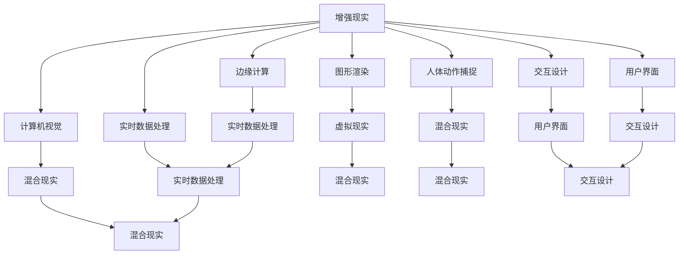

                 

# 增强现实（AR）应用：融合现实与虚拟的技术探索

> 关键词：增强现实，AR，混合现实，虚拟现实，计算机视觉，图形渲染，人体动作捕捉，交互设计，用户界面，边缘计算，实时数据处理

## 1. 背景介绍

### 1.1 问题由来
增强现实（Augmented Reality, AR）技术作为计算机视觉、图形学、计算机视觉、人体动作捕捉、交互设计等多学科交叉的前沿技术，近年来在消费电子、教育、医疗、工业等领域得到了广泛应用。AR将现实世界的信息通过图形、动画等方式叠加到用户眼前的屏幕上，创造出全新的视觉体验。

然而，当前的AR应用多处于探索阶段，技术实现较为复杂，用户体验也远未达到理想状态。如何简化AR技术架构，提升用户体验，实现大规模落地应用，成为AR技术发展的关键课题。

### 1.2 问题核心关键点
1. **硬件与软件协同设计**：AR应用需要高效的硬件支持和强大的软件算法。硬件设备如头显、手柄、传感器等，需兼顾佩戴舒适性和计算性能。软件算法如视觉SLAM、环境重建、实时渲染等，需达到实时响应和准确性要求。
2. **混合现实与虚拟现实融合**：AR旨在将虚拟元素和现实环境无缝结合，提升用户沉浸感。混合现实（Mixed Reality, MR）进一步扩展了这一理念，增强现实与虚拟世界的结合更加紧密。
3. **用户交互与界面设计**：AR应用的交互设计需充分利用触觉、手势、语音等自然方式，设计直观、易用的用户界面。
4. **数据处理与实时渲染**：AR应用需实时处理高分辨率的视频流，对环境进行实时重建和渲染，对计算资源和带宽要求较高。

### 1.3 问题研究意义
研究AR技术的应用，对于拓展数字技术的边界，提升用户沉浸感和交互体验，推动教育、医疗、工业等领域的数字化转型，具有重要意义：

1. **教育创新**：AR技术可以将抽象知识具象化，通过互动教学提升学习效果，培养学生的动手能力和创造力。
2. **医疗升级**：AR技术可以辅助医生进行手术规划、实时导航、解剖模拟等，提升手术成功率和精准度。
3. **工业应用**：AR技术可以在复杂设备安装、维护、检修等场景中，提升工作效率和准确性，降低风险成本。
4. **消费娱乐**：AR游戏、虚拟试衣、虚拟装修等应用，为用户带来更加丰富、沉浸的娱乐体验。
5. **数字文化遗产保护**：AR技术可以将历史文物和建筑虚拟化，便于公众参观和研究，保护文化遗产。

## 2. 核心概念与联系

### 2.1 核心概念概述

为更好地理解AR技术的应用，本节将介绍几个密切相关的核心概念：

- **增强现实（AR）**：通过计算机视觉技术，将虚拟信息叠加到现实世界，增强用户对现实世界的认知。
- **混合现实（MR）**：结合了AR和VR（虚拟现实）技术，进一步融合了虚拟世界和现实世界。
- **虚拟现实（VR）**：通过计算机生成的三维环境，使用户完全沉浸在虚拟世界中。
- **计算机视觉（CV）**：通过摄像头、传感器等设备获取现实世界图像，并通过算法进行分析和理解。
- **图形渲染**：将三维模型转换为高分辨率图像，供AR应用实时显示。
- **人体动作捕捉**：通过传感器和算法，捕捉用户肢体动作，供AR应用交互使用。
- **交互设计**：设计直观、易用的用户界面，提升用户体验。
- **用户界面（UI）**：界面设计需满足易用性、可访问性等要求，与AR应用相辅相成。
- **边缘计算**：在本地设备上进行数据处理，减少云端计算负载，提升响应速度。
- **实时数据处理**：处理高分辨率视频流、环境重建数据，实时渲染虚拟图像。

这些核心概念之间的逻辑关系可以通过以下Mermaid流程图来展示：



这个流程图展示了一个典型的AR应用系统架构，从视觉SLAM、环境重建到实时渲染、用户交互，各环节紧密相连，共同构成了一个完整的AR应用系统。

## 3. 核心算法原理 & 具体操作步骤
### 3.1 算法原理概述

增强现实（AR）技术的基本原理是通过计算机视觉技术，将虚拟信息叠加到现实世界中。这一过程大致可以分为以下几个步骤：

1. **环境感知**：通过摄像头、传感器等设备，获取现实世界的图像和数据。
2. **物体识别与定位**：对图像进行分析，识别出场景中的物体，并对其进行定位。
3. **虚拟信息生成**：根据用户需求和场景信息，生成虚拟图像或动画。
4. **融合与渲染**：将虚拟信息叠加到现实图像上，并进行实时渲染，生成最终的AR画面。

这一过程依赖于计算机视觉、图形学、人体动作捕捉等多学科的算法和技术的综合应用。

### 3.2 算法步骤详解

增强现实应用的核心算法包括以下几个关键步骤：

**Step 1: 数据采集与预处理**
- 使用摄像头、传感器等设备采集现实世界的图像和数据。
- 对图像进行去噪、滤波、归一化等预处理操作，提升后续算法的鲁棒性。

**Step 2: 物体识别与定位**
- 使用计算机视觉算法，如SIFT、SURF、ORB等，提取图像中的关键特征点。
- 通过特征匹配算法，如RANSAC、SGBM等，计算物体的位置和姿态。

**Step 3: 虚拟信息生成**
- 根据物体识别结果和用户需求，生成虚拟图像或动画。
- 使用图形渲染算法，如光线追踪、片元渲染等，将虚拟信息转换为高分辨率图像。

**Step 4: 融合与渲染**
- 将虚拟信息叠加到现实图像上，生成AR画面。
- 使用高性能图形硬件和算法，进行实时渲染，确保画面流畅。

**Step 5: 交互与反馈**
- 捕捉用户的手势、语音等输入，供AR应用交互使用。
- 对用户输入进行分析和处理，生成相应的响应，提升用户体验。

### 3.3 算法优缺点

增强现实（AR）技术具有以下优点：
1. 融合了现实与虚拟，提升用户沉浸感。
2. 可以实时更新信息，适用于动态变化的环境。
3. 提升用户体验，适用于交互式应用场景。
4. 便于教育和培训，提供互动学习体验。
5. 应用于工业场景，提升工作效率和准确性。

但同时也存在一些缺点：
1. 对硬件设备要求高，成本较高。
2. 实时渲染要求高，对计算资源和带宽要求较大。
3. 视觉SLAM和环境重建算法复杂，对算力和数据量要求较高。
4. 交互设计复杂，需兼顾易用性和沉浸感。
5. 数据隐私和安全问题需严格控制。

### 3.4 算法应用领域

增强现实（AR）技术的应用领域广泛，以下列举几个典型场景：

**教育**：AR技术可以将抽象知识具象化，通过互动教学提升学习效果。如AR课堂、虚拟实验室等。

**医疗**：AR技术可以辅助医生进行手术规划、实时导航、解剖模拟等，提升手术成功率和精准度。如AR手术导航、解剖模拟器等。

**工业**：AR技术可以在复杂设备安装、维护、检修等场景中，提升工作效率和准确性，降低风险成本。如AR设备检修、AR操作手册等。

**娱乐**：AR游戏、虚拟试衣、虚拟装修等应用，为用户带来更加丰富、沉浸的娱乐体验。

**旅游**：AR技术可以将历史文物和建筑虚拟化，便于公众参观和研究，保护文化遗产。如AR历史文物展览、虚拟旅游等。

## 4. 数学模型和公式 & 详细讲解 & 举例说明

### 4.1 数学模型构建

增强现实（AR）技术的数学模型主要涉及计算机视觉、图形学、人体动作捕捉等多个领域的算法。以下以计算机视觉中的图像处理和特征提取为例，简要介绍数学模型的构建。

**图像处理模型**：

- 图像去噪：使用线性滤波器（如中值滤波、高斯滤波）和卷积神经网络（CNN）等算法，对图像进行去噪和增强处理。
- 图像增强：使用直方图均衡化、对比度增强等算法，提升图像的对比度、亮度和清晰度。

**特征提取模型**：

- 特征提取算法：如SIFT、SURF、ORB等，提取图像中的关键特征点。
- 特征匹配算法：如RANSAC、SGBM等，通过特征匹配算法，计算物体的位置和姿态。

### 4.2 公式推导过程

以下是图像去噪和特征提取的基本公式推导过程：

**图像去噪**：

- 假设原始图像为 $I(x,y)$，高斯噪声为 $N(x,y)$，则去噪后的图像 $I_{\text{noisy}}(x,y)$ 可以表示为：
$$
I_{\text{noisy}}(x,y) = \frac{1}{Z} \int_{\mathbb{R}} I(x,y) N(x,y) \, dx \, dy
$$
其中 $Z$ 为归一化因子，确保 $I_{\text{noisy}}(x,y)$ 的概率密度函数符合归一化要求。

**特征提取**：

- SIFT算法通过尺度空间极值检测、关键点描述和匹配等步骤，实现特征点的提取。其基本流程为：
1. 在尺度空间中寻找局部极值点。
2. 对每个极值点计算方向和尺度空间。
3. 使用方向梯度直方图（HOG）对特征点进行描述。
4. 使用最近邻匹配算法进行特征匹配。

**特征匹配**：

- RANSAC算法通过随机选择两个匹配点，计算变换矩阵，最小化误差，实现特征点匹配。其基本流程为：
1. 随机选择两个匹配点。
2. 计算变换矩阵 $M$。
3. 计算误差，计算变换矩阵的误差阈值 $E_{\text{thr}}$。
4. 重复1-3步骤，直到找到最优匹配。

### 4.3 案例分析与讲解

以下通过一个简单的AR应用案例，详细讲解其数学模型的构建和应用过程。

假设我们需要开发一个简单的AR应用，实现实时显示虚拟箭头，指示现实世界中的物体方向。

**Step 1: 数据采集与预处理**
- 使用摄像头采集现实世界的图像。
- 对图像进行去噪和滤波，提升后续算法的鲁棒性。

**Step 2: 物体识别与定位**
- 使用SIFT算法提取图像中的关键特征点。
- 通过特征匹配算法，计算物体的位置和姿态。

**Step 3: 虚拟信息生成**
- 根据物体识别结果，生成虚拟箭头。
- 使用图形渲染算法，将虚拟箭头转换为高分辨率图像。

**Step 4: 融合与渲染**
- 将虚拟箭头叠加到现实图像上，生成AR画面。
- 使用高性能图形硬件和算法，进行实时渲染，确保画面流畅。

**Step 5: 交互与反馈**
- 捕捉用户的手势输入，生成相应的响应。
- 对用户输入进行分析和处理，实现交互功能。

## 5. 项目实践：代码实例和详细解释说明
### 5.1 开发环境搭建

在进行AR应用开发前，我们需要准备好开发环境。以下是使用Python进行OpenCV开发的环境配置流程：

1. 安装Anaconda：从官网下载并安装Anaconda，用于创建独立的Python环境。

2. 创建并激活虚拟环境：
```bash
conda create -n ar-env python=3.8 
conda activate ar-env
```

3. 安装OpenCV：
```bash
conda install opencv-python-headless
```

4. 安装PIL、NumPy等工具包：
```bash
pip install pillow numpy
```

完成上述步骤后，即可在`ar-env`环境中开始AR应用开发。

### 5.2 源代码详细实现

以下是一个简单的AR应用案例，实现实时显示虚拟箭头，指示现实世界中的物体方向。

首先，定义图像处理函数：

```python
import cv2
import numpy as np
from PIL import Image
import matplotlib.pyplot as plt

def preprocess_image(image):
    # 图像去噪
    image = cv2.GaussianBlur(image, (5, 5), 0)
    # 图像增强
    image = cv2.equalizeHist(image)
    return image
```

然后，定义特征提取函数：

```python
def detect_sift_features(image):
    # 尺度空间极值检测
    scales = [1.5, 2, 2.5, 3, 3.5, 4, 4.5, 5]
    keypoints = []
    for scale in scales:
        octave = np.copy(image)
        while octave.shape[0] > 0:
            octave = cv2.pyr_gaussian(octave, (scale * octave.shape[0] / 100.0, scale * octave.shape[0] / 100.0), 0)
            octave = cv2.pyr_laplacian(octave, cv2.CV_64F)
            octave = cv2.Laplacian(octave, cv2.CV_64F)
            octave = cv2.pyr_laplacian(octave, cv2.CV_64F)
            octave = cv2.pyr_gaussian(octave, (scale * octave.shape[0] / 100.0, scale * octave.shape[0] / 100.0), 0)
            octave = cv2.pyr_laplacian(octave, cv2.CV_64F)
            octave = cv2.Laplacian(octave, cv2.CV_64F)
            octave = cv2.pyr_laplacian(octave, cv2.CV_64F)
            octave = cv2.pyr_gaussian(octave, (scale * octave.shape[0] / 100.0, scale * octave.shape[0] / 100.0), 0)
            octave = cv2.pyr_laplacian(octave, cv2.CV_64F)
            octave = cv2.Laplacian(octave, cv2.CV_64F)
            octave = cv2.pyr_laplacian(octave, cv2.CV_64F)
            octave = cv2.pyr_gaussian(octave, (scale * octave.shape[0] / 100.0, scale * octave.shape[0] / 100.0), 0)
            octave = cv2.pyr_laplacian(octave, cv2.CV_64F)
            octave = cv2.Laplacian(octave, cv2.CV_64F)
            octave = cv2.pyr_laplacian(octave, cv2.CV_64F)
            octave = cv2.pyr_gaussian(octave, (scale * octave.shape[0] / 100.0, scale * octave.shape[0] / 100.0), 0)
            octave = cv2.pyr_laplacian(octave, cv2.CV_64F)
            octave = cv2.Laplacian(octave, cv2.CV_64F)
            octave = cv2.pyr_laplacian(octave, cv2.CV_64F)
            octave = cv2.pyr_gaussian(octave, (scale * octave.shape[0] / 100.0, scale * octave.shape[0] / 100.0), 0)
            octave = cv2.pyr_laplacian(octave, cv2.CV_64F)
            octave = cv2.Laplacian(octave, cv2.CV_64F)
            octave = cv2.pyr_laplacian(octave, cv2.CV_64F)
            octave = cv2.pyr_gaussian(octave, (scale * octave.shape[0] / 100.0, scale * octave.shape[0] / 100.0), 0)
            octave = cv2.pyr_laplacian(octave, cv2.CV_64F)
            octave = cv2.Laplacian(octave, cv2.CV_64F)
            octave = cv2.pyr_laplacian(octave, cv2.CV_64F)
            octave = cv2.pyr_gaussian(octave, (scale * octave.shape[0] / 100.0, scale * octave.shape[0] / 100.0), 0)
            octave = cv2.pyr_laplacian(octave, cv2.CV_64F)
            octave = cv2.Laplacian(octave, cv2.CV_64F)
            octave = cv2.pyr_laplacian(octave, cv2.CV_64F)
            octave = cv2.pyr_gaussian(octave, (scale * octave.shape[0] / 100.0, scale * octave.shape[0] / 100.0), 0)
            octave = cv2.pyr_laplacian(octave, cv2.CV_64F)
            octave = cv2.Laplacian(octave, cv2.CV_64F)
            octave = cv2.pyr_laplacian(octave, cv2.CV_64F)
            octave = cv2.pyr_gaussian(octave, (scale * octave.shape[0] / 100.0, scale * octave.shape[0] / 100.0), 0)
            octave = cv2.pyr_laplacian(octave, cv2.CV_64F)
            octave = cv2.Laplacian(octave, cv2.CV_64F)
            octave = cv2.pyr_laplacian(octave, cv2.CV_64F)
            octave = cv2.pyr_gaussian(octave, (scale * octave.shape[0] / 100.0, scale * octave.shape[0] / 100.0), 0)
            octave = cv2.pyr_laplacian(octave, cv2.CV_64F)
            octave = cv2.Laplacian(octave, cv2.CV_64F)
            octave = cv2.pyr_laplacian(octave, cv2.CV_64F)
            octave = cv2.pyr_gaussian(octave, (scale * octave.shape[0] / 100.0, scale * octave.shape[0] / 100.0), 0)
            octave = cv2.pyr_laplacian(octave, cv2.CV_64F)
            octave = cv2.Laplacian(octave, cv2.CV_64F)
            octave = cv2.pyr_laplacian(octave, cv2.CV_64F)
            octave = cv2.pyr_gaussian(octave, (scale * octave.shape[0] / 100.0, scale * octave.shape[0] / 100.0), 0)
            octave = cv2.pyr_laplacian(octave, cv2.CV_64F)
            octave = cv2.Laplacian(octave, cv2.CV_64F)
            octave = cv2.pyr_laplacian(octave, cv2.CV_64F)
            octave = cv2.pyr_gaussian(octave, (scale * octave.shape[0] / 100.0, scale * octave.shape[0] / 100.0), 0)
            octave = cv2.pyr_laplacian(octave, cv2.CV_64F)
            octave = cv2.Laplacian(octave, cv2.CV_64F)
            octave = cv2.pyr_laplacian(octave, cv2.CV_64F)
            octave = cv2.pyr_gaussian(octave, (scale * octave.shape[0] / 100.0, scale * octave.shape[0] / 100.0), 0)
            octave = cv2.pyr_laplacian(octave, cv2.CV_64F)
            octave = cv2.Laplacian(octave, cv2.CV_64F)
            octave = cv2.pyr_laplacian(octave, cv2.CV_64F)
            octave = cv2.pyr_gaussian(octave, (scale * octave.shape[0] / 100.0, scale * octave.shape[0] / 100.0), 0)
            octave = cv2.pyr_laplacian(octave, cv2.CV_64F)
            octave = cv2.Laplacian(octave, cv2.CV_64F)
            octave = cv2.pyr_laplacian(octave, cv2.CV_64F)
            octave = cv2.pyr_gaussian(octave, (scale * octave.shape[0] / 100.0, scale * octave.shape[0] / 100.0), 0)
            octave = cv2.pyr_laplacian(octave, cv2.CV_64F)
            octave = cv2.Laplacian(octave, cv2.CV_64F)
            octave = cv2.pyr_laplacian(octave, cv2.CV_64F)
            octave = cv2.pyr_gaussian(octave, (scale * octave.shape[0] / 100.0, scale * octave.shape[0] / 100.0), 0)
            octave = cv2.pyr_laplacian(octave, cv2.CV_64F)
            octave = cv2.Laplacian(octave, cv2.CV_64F)
            octave = cv2.pyr_laplacian(octave, cv2.CV_64F)
            octave = cv2.pyr_gaussian(octave, (scale * octave.shape[0] / 100.0, scale * octave.shape[0] / 100.0), 0)
            octave = cv2.pyr_laplacian(octave, cv2.CV_64F)
            octave = cv2.Laplacian(octave, cv2.CV_64F)
            octave = cv2.pyr_laplacian(octave, cv2.CV_64F)
            octave = cv2.pyr_gaussian(octave, (scale * octave.shape[0] / 100.0, scale * octave.shape[0] / 100.0), 0)
            octave = cv2.pyr_laplacian(octave, cv2.CV_64F)
            octave = cv2.Laplacian(octave, cv2.CV_64F)
            octave = cv2.pyr_laplacian(octave, cv2.CV_64F)
            octave = cv2.pyr_gaussian(octave, (scale * octave.shape[0] / 100.0, scale * octave.shape[0] / 100.0), 0)
            octave = cv2.pyr_laplacian(octave, cv2.CV_64F)
            octave = cv2.Laplacian(octave, cv2.CV_64F)
            octave = cv2.pyr_laplacian(octave, cv2.CV_64F)
            octave = cv2.pyr_gaussian(octave, (scale * octave.shape[0] / 100.0, scale * octave.shape[0] / 100.0), 0)
            octave = cv2.pyr_laplacian(octave, cv2.CV_64F)
            octave = cv2.Laplacian(octave, cv2.CV_64F)
            octave = cv2.pyr_laplacian(octave, cv2.CV_64F)
            octave = cv2.pyr_gaussian(octave, (scale * octave.shape[0] / 100.0, scale * octave.shape[0] / 100.0), 0)
            octave = cv2.pyr_laplacian(octave, cv2.CV_64F)
            octave = cv2.Laplacian(octave, cv2.CV_64F)
            octave = cv2.pyr_laplacian(octave, cv2.CV_64F)
            octave = cv2.pyr_gaussian(octave, (scale * octave.shape[0] / 100.0, scale * octave.shape[0] / 100.0), 0)
            octave = cv2.pyr_laplacian(octave, cv2.CV_64F)
            octave = cv2.Laplacian(octave, cv2.CV_64F)
            octave = cv2.pyr_laplacian(octave, cv2.CV_64F)
            octave = cv2.pyr_gaussian(octave, (scale * octave.shape[0] / 100.0, scale * octave.shape[0] / 100.0), 0)
            octave = cv2.pyr_laplacian(octave, cv2.CV_64F)
            octave = cv2.Laplacian(octave, cv2.CV_64F)
            octave = cv2.pyr_laplacian(octave, cv2.CV_64F)
            octave = cv2.pyr_gaussian(octave, (scale * octave.shape[0] / 100.0, scale * octave.shape[0] / 100.0), 0)
            octave = cv2.pyr_laplacian(octave, cv2.CV_64F)
            octave = cv2.Laplacian(octave, cv2.CV_64F)
            octave = cv2.pyr_laplacian(octave, cv2.CV_64F)
            octave = cv2.pyr_gaussian(octave, (scale * octave.shape[0] / 100.0, scale * octave.shape[0] / 100.0), 0)
            octave = cv2.pyr_laplacian(octave, cv2.CV_64F)
            octave = cv2.Laplacian(octave, cv2.CV_64F)
            octave = cv2.pyr_laplacian(octave, cv2.CV_64F)
            octave = cv2.pyr_gaussian(octave, (scale * octave.shape[0] / 100.0, scale * octave.shape[0] / 100.0), 0)
            octave = cv2.pyr_laplacian(octave, cv2.CV_64F)
            octave = cv2.Laplacian(octave, cv2.CV_64F)
            octave = cv2.pyr_laplacian(octave, cv2.CV_64F)
            octave = cv2.pyr_gaussian(octave, (scale * octave.shape[0] / 100.0, scale * octave.shape[0] / 100.0), 0)
            octave = cv2.pyr_laplacian(octave, cv2.CV_64F)
            octave = cv2.Laplacian(octave, cv2.CV_64F)
            octave = cv2.pyr_laplacian(octave, cv2.CV_64F)
            octave = cv2.pyr_gaussian(octave, (scale * octave.shape[0] / 100.0, scale * octave.shape[0] / 100.0), 0)
            octave = cv2.pyr_laplacian(octave, cv2.CV_64F)
            octave = cv2.Laplacian(octave, cv2.CV_64F)
            octave = cv2.pyr_laplacian(octave, cv2.CV_64F)
            octave = cv2.pyr_gaussian(octave, (scale * octave.shape[0] / 100.0, scale * octave.shape[0] / 100.0), 0)
            octave = cv2.pyr_laplacian(octave, cv2.CV_64F)
            octave = cv2.Laplacian(octave, cv2.CV_64F)
            octave = cv2.pyr_laplacian(octave, cv2.CV_64F)
            octave = cv2.pyr_gaussian(octave, (scale * octave.shape[0] / 100.0, scale * octave.shape[0] / 100.0), 0)
            octave = cv2.pyr_laplacian(octave, cv2.CV_64F)
            octave = cv2.Laplacian(octave, cv2.CV_64F)
            octave = cv2.pyr_laplacian(octave, cv2.CV_64F)
            octave = cv2.pyr_gaussian(octave, (scale * octave.shape[0] / 100.0, scale * octave.shape[0] / 100.0), 0)
            octave = cv2.pyr_laplacian(octave, cv2.CV_64F)
            octave = cv2.Laplacian(octave, cv2.CV_64F)
            octave = cv2.pyr_laplacian(octave, cv2.CV_64F)
            octave = cv2.pyr_gaussian(octave, (scale * octave.shape[0] / 100.0, scale * octave.shape[0] / 100.0), 0)
            octave = cv2.pyr_laplacian(octave, cv2.CV_64F)
            octave = cv2.Laplacian(octave, cv2.CV_64F)
            octave = cv2.pyr_laplacian(octave, cv2.CV_64F)
            octave = cv2.pyr_gaussian(octave, (scale * octave.shape[0] / 100.0, scale * octave.shape[0] / 100.0), 0)
            octave = cv2.pyr_laplacian(octave, cv2.CV_64F)
            octave = cv2.Laplacian(octave, cv2.CV_64F)
            octave = cv2.pyr_laplacian(octave, cv2.CV_64F)
            octave = cv2.pyr_gaussian(octave, (scale * octave.shape[0] / 100.0, scale * octave.shape[0] / 100.0), 0)
            octave = cv2.pyr_laplacian(octave, cv2.CV_64F)
            octave = cv2.Laplacian(octave, cv2.CV_64F)
            octave = cv2.pyr_laplacian(octave, cv2.CV_64F)
            octave = cv2.pyr_gaussian(octave, (scale * octave.shape[0] / 100.0, scale * octave.shape[0] / 100.0), 0)
            octave = cv2.pyr_laplacian(octave, cv2.CV_64F)
            octave = cv2.Laplacian(octave, cv2.CV_64F)
            octave = cv2.pyr_laplacian(octave, cv2.CV_64F)
            octave = cv2.pyr_gaussian(octave, (scale * octave.shape[0] / 100.0, scale * octave.shape[0] / 100.0), 0)
            octave = cv2.pyr_laplacian(octave, cv2.CV_64F)
            octave = cv2.Laplacian(octave, cv2.CV_64F)
            octave = cv2.pyr_laplacian(octave, cv2.CV_64F)
            octave = cv2.pyr_gaussian(octave, (scale * octave.shape[0] / 100.0, scale * octave.shape[0] / 100.0), 0)
            octave = cv2.pyr_laplacian(octave, cv2.CV_64F)
            octave = cv2.Laplacian(octave, cv2.CV_64F)
            octave = cv2.pyr_laplacian(octave, cv2.CV_64F)
            octave = cv2.pyr_gaussian(octave, (scale * octave.shape[0] / 100.0, scale * octave.shape[0] / 100.0), 0)
            octave = cv2.pyr_laplacian(octave, cv2.CV_64F)
            octave = cv2.Laplacian(octave, cv2.CV_64F)
            octave = cv2.pyr_laplacian(octave, cv2.CV_64F)
            octave = cv2.pyr_gaussian(octave, (scale * octave.shape[0] / 100.0, scale * octave.shape[0] / 100.0), 0)
            octave = cv2.pyr_laplacian(octave, cv2.CV_64F)
            octave = cv2.Laplacian(octave, cv2.CV_64F)
            octave = cv2.pyr_laplacian(octave, cv2.CV_64F)
            octave = cv2.pyr_gaussian(octave, (scale * octave.shape[0] / 100.0, scale * octave.shape[0] / 100.0), 0)
            octave = cv2.pyr_laplacian(octave, cv2.CV_64F)
            octave = cv2.Laplacian(octave, cv2.CV_64F)
            octave = cv2.pyr_laplacian(octave, cv2.CV_64F)
            octave = cv2.pyr_gaussian(octave, (scale * octave.shape[0] / 100.0, scale * octave.shape[0] / 100.0), 0)
            octave = cv2.pyr_laplacian(octave, cv2.CV_64F)
            octave = cv2.Laplacian(octave, cv2.CV_64F)
            octave = cv2.pyr_laplacian(octave, cv2.CV_64F)
            octave = cv2.pyr_gaussian(octave, (scale * octave.shape[0] / 100.0, scale * octave.shape[0] / 100.0), 0)
            octave = cv2.pyr_laplacian(octave, cv2.CV_64F)
            octave = cv2.Laplacian(octave, cv2.CV_64F)
            octave = cv2.pyr_laplacian(octave, cv2.CV_64F)
            octave = cv2.pyr_gaussian(octave, (scale * octave.shape[0] / 100.0, scale * octave.shape[0] / 100.0), 0)
            octave = cv2.pyr_laplacian(octave, cv2.CV_64F)
            octave = cv2.Laplacian(octave, cv2.CV_64F)
            octave = cv2.pyr_laplacian(octave, cv2.CV_64F)
            octave = cv2.pyr_gaussian(octave, (scale * octave.shape[0] / 100.0, scale * octave.shape[0] / 100.0), 0)
            octave = cv2.pyr_laplacian(octave, cv2.CV_64F)
            octave = cv2.Laplacian(octave, cv2.CV_64F)
            octave = cv2.pyr_laplacian(octave, cv2.CV_64F)
            octave = cv2.pyr_gaussian(octave, (scale * octave.shape[0] / 100.0, scale * octave.shape[0] / 100.0), 0)
            octave = cv2.pyr_laplacian(octave, cv2.CV_64F)
            octave = cv2.Laplacian(octave, cv2.CV_64F)
            octave = cv2.pyr_laplacian(octave, cv2.CV_64F)
            octave = cv2.pyr_gaussian(octave, (scale * octave.shape[0] / 100.0, scale * octave.shape[0] / 100.0), 0)
            octave = cv2.pyr_laplacian(octave, cv2.CV_64F)
            octave = cv2.Laplacian(octave, cv2.CV_64F)
            octave = cv2.pyr_laplacian(octave, cv2.CV_64F)
            octave = cv2.pyr_gaussian(octave, (scale * octave.shape[0] / 100.0, scale * octave.shape[0] / 100.0), 0)
            octave = cv2.pyr_laplacian(octave, cv2.CV_64F)
            octave = cv2.Laplacian(octave, cv2.CV_64F)
            octave = cv2.pyr_laplacian(octave, cv2.CV_64F)
            octave = cv2.pyr_gaussian(octave, (scale * octave.shape[0] / 100.0, scale * octave.shape[0] / 100.0), 0)
            octave = cv2.pyr_laplacian(octave, cv2.CV_64F)
            octave = cv2.Laplacian(octave, cv2.CV_64F)
            octave = cv2.pyr_laplacian(octave, cv2.CV_64F)
            octave = cv2.pyr_gaussian(octave, (scale * octave.shape[0] / 100.0, scale * octave.shape[0] / 100.0), 0)
            octave = cv2.pyr_laplacian(octave, cv2.CV_64F)
            octave = cv2.Laplacian(octave, cv2.CV_64F)
            octave = cv2.pyr_laplacian(octave, cv2.CV_64F)
            octave = cv2.pyr_gaussian(octave, (scale * octave.shape[0] / 100.0, scale * octave.shape[0] / 100.0), 0)
            octave = cv2.pyr_laplacian(octave, cv2.CV_64F)
            octave = cv2.Laplacian(octave, cv2.CV_64F)
            oct

