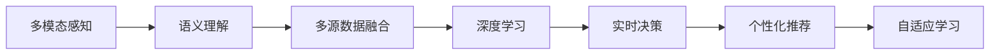

                 

## 1. 背景介绍

### 1.1 问题由来
随着人工智能技术的飞速发展，多模态AI在各行各业的应用日益广泛，智能家居领域也不例外。智能家居系统的构建需要融合多种传感器数据、用户行为数据、家电控制数据等多种信息源，而多模态AI技术正为解决这些问题提供了新的思路和方法。

当前，智能家居系统的核心功能主要包括智能安防、能耗管理、环境调节、智能照明、智能家电控制等。这些功能依赖于对多源数据的感知、处理、分析和控制。传统的智能家居系统主要基于规则和预编程的方式进行控制，难以应对复杂多变的使用场景和用户需求。而基于多模态AI的智能家居系统，通过深度融合视觉、听觉、触觉等多模态数据，能够更准确、灵活、智能地理解用户意图，提供个性化的家居环境和生活体验。

### 1.2 问题核心关键点
多模态AI在智能家居中的主要应用点包括：

- 多模态感知：通过整合视觉传感器（摄像头）、听觉传感器（麦克风）、触觉传感器（压力传感器）等多源数据，构建全时全空间的智能感知环境。
- 语义理解：通过对用户语音、行为等数据进行语义解析，理解用户的真实需求和情感状态，实现更加精准的智能控制。
- 实时决策：利用多模态数据融合和深度学习技术，实时动态调整家居设备状态，实现最优的资源分配和系统优化。
- 个性化推荐：基于用户历史行为和实时数据，对用户偏好进行建模，智能推荐个性化家居环境和设备控制方案。
- 自适应学习：利用增强学习技术，不断学习用户的偏好和行为规律，动态调整控制策略，实现用户与环境的深度协同。

这些应用点体现了多模态AI在智能家居领域的重要价值，有助于实现更安全、更高效、更舒适的智能家居体验。

## 2. 核心概念与联系

### 2.1 核心概念概述

为更好地理解多模态AI在智能家居中的应用，本节将介绍几个关键概念：

- 多模态感知(Multimodal Perception)：指同时采集和处理来自多个感官通道的数据，包括视觉、听觉、触觉、气味等。多模态感知有助于构建更加全面、准确的家庭环境模型。
- 语义理解(Semantic Understanding)：指利用自然语言处理技术，对用户语音、文字等输入进行语义解析，理解用户意图和情感状态，实现智能交互。
- 多源数据融合(Multi-Source Data Fusion)：指将来自不同传感器和数据源的信息进行深度融合，构建统一的语义空间，用于决策和推理。
- 深度学习(Deep Learning)：指利用多层神经网络模型，从数据中自动学习复杂特征和模式，用于感知、推理和决策。
- 强化学习(Reinforcement Learning)：指通过与环境的交互，不断调整行为策略，优化系统表现。
- 自适应学习(Adaptive Learning)：指系统能够根据用户的反馈和行为数据，动态调整参数和策略，适应不同的用户需求。

这些概念之间的逻辑关系可以通过以下Mermaid流程图来展示：



这个流程图展示了多模态AI在智能家居中的关键过程：

1. 多模态感知：获取多源传感器数据。
2. 语义理解：解析用户的语音、行为等输入。
3. 多源数据融合：将不同模态的数据融合为统一的语义表示。
4. 深度学习：从融合后的数据中学习复杂特征和模式。
5. 实时决策：基于学习到的特征和模式，进行实时决策和控制。
6. 个性化推荐：根据用户偏好和行为数据，推荐个性化方案。
7. 自适应学习：动态调整参数和策略，提升用户体验。

这些关键过程相互交织，共同构成了智能家居系统的智能核心。

## 3. 核心算法原理 & 具体操作步骤
### 3.1 算法原理概述

多模态AI在智能家居中的核心算法包括多模态感知、语义理解、多源数据融合、深度学习、实时决策、个性化推荐和自适应学习等。这些算法的核心思想和实现原理如下：

- 多模态感知：通过摄像头、麦克风、压力传感器等设备采集视频、音频、压力等数据，并利用计算机视觉、声音识别、触觉感知等技术，将其转换为数字信号。

- 语义理解：利用自然语言处理技术，对用户的语音、文字等输入进行语义解析，理解用户的意图和情感状态。常见的方法包括：
  - 语音识别：将语音转换为文本，再利用深度学习模型进行语义解析。
  - 情感分析：通过分析用户的语音语调、表情等特征，判断用户的情感状态。
  - 意图识别：根据用户的输入，识别出用户的需求和操作意图。

- 多源数据融合：将来自不同传感器和数据源的信息进行深度融合，构建统一的语义空间。常见的融合方法包括：
  - 特征级融合：将不同传感器采集到的特征进行加权平均或融合，得到融合后的特征向量。
  - 样本级融合：将不同传感器采集到的样本进行融合，得到融合后的样本表示。
  - 行为级融合：将不同传感器采集到的行为数据进行融合，得到融合后的行为模型。

- 深度学习：利用多层神经网络模型，从多源数据中自动学习复杂特征和模式。常见的深度学习模型包括：
  - 卷积神经网络(CNN)：用于图像和视频数据的处理。
  - 循环神经网络(RNN)：用于序列数据的处理。
  - 变分自编码器(VAE)：用于多模态数据的降维和重构。
  - 生成对抗网络(GAN)：用于生成新的视觉和语音数据。

- 实时决策：基于学习到的特征和模式，进行实时决策和控制。常见的决策方法包括：
  - 强化学习：通过与环境的交互，不断调整行为策略，优化系统表现。
  - 逻辑推理：利用逻辑规则和知识库，进行决策推理和判断。
  - 决策树：利用决策树模型，对多种决策因素进行综合评估和选择。

- 个性化推荐：根据用户历史行为和实时数据，对用户偏好进行建模，智能推荐个性化方案。常见的推荐方法包括：
  - 协同过滤：通过分析用户的历史行为，预测用户对新物品的偏好。
  - 基于内容的推荐：根据物品的特征和用户偏好，进行个性化推荐。
  - 混合推荐：结合协同过滤和基于内容的推荐，实现更准确的推荐。

- 自适应学习：利用增强学习技术，不断学习用户的偏好和行为规律，动态调整参数和策略，适应不同的用户需求。常见的自适应方法包括：
  - Q-learning：通过与环境的交互，调整行为策略，优化系统表现。
  - SARSA：通过状态-行动-奖励-状态-行动的序列，学习最优策略。
  - 遗传算法：通过模拟生物进化过程，优化系统参数和策略。

### 3.2 算法步骤详解

以智能安防为例，介绍多模态AI在智能家居中的应用流程：

**Step 1: 数据采集**
- 安装摄像头、麦克风、压力传感器等设备，采集视频、音频、压力等数据。
- 利用计算机视觉、声音识别、触觉感知等技术，将传感器数据转换为数字信号。

**Step 2: 语义理解**
- 对用户的语音输入进行语音识别，转换为文本。
- 利用自然语言处理技术，对文本进行语义解析，理解用户的意图和情感状态。
- 结合视频和音频数据，进行行为分析和情感识别。

**Step 3: 多源数据融合**
- 将视频、音频和行为数据进行融合，构建统一的语义空间。
- 利用特征级融合、样本级融合和行为级融合等方法，对数据进行深度融合。

**Step 4: 深度学习**
- 利用卷积神经网络、循环神经网络和生成对抗网络等深度学习模型，从融合后的数据中学习复杂特征和模式。
- 利用预训练模型(如ResNet、LSTM、GAN等)，进行特征提取和模式学习。

**Step 5: 实时决策**
- 基于学习到的特征和模式，进行实时决策和控制。
- 利用强化学习和逻辑推理等方法，优化系统表现。
- 通过决策树和规则引擎等工具，进行综合决策。

**Step 6: 个性化推荐**
- 根据用户历史行为和实时数据，对用户偏好进行建模。
- 利用协同过滤、基于内容的推荐和混合推荐等方法，进行个性化推荐。

**Step 7: 自适应学习**
- 利用增强学习技术，不断学习用户的偏好和行为规律。
- 动态调整参数和策略，适应不同的用户需求。
- 利用遗传算法和Q-learning等方法，优化系统参数和策略。

### 3.3 算法优缺点

多模态AI在智能家居中具有以下优点：
1. 全时全空间感知：通过多模态感知技术，实现全时全空间的智能感知环境。
2. 精准语义理解：利用深度学习和自然语言处理技术，实现对用户语音、行为等输入的精准解析。
3. 实时决策控制：通过多源数据融合和深度学习技术，实现实时决策和控制。
4. 个性化推荐：利用用户历史行为和实时数据，实现个性化推荐，提升用户体验。
5. 自适应学习：利用增强学习技术，动态调整参数和策略，提升系统适应性。

同时，多模态AI在智能家居中也存在一些局限性：
1. 多模态数据采集难度大：多模态数据采集需要多种传感器和设备，设备安装和维护成本较高。
2. 数据融合复杂度高：多源数据融合需要复杂的算法和计算资源，处理难度较大。
3. 深度学习模型复杂：深度学习模型参数量大，计算资源消耗较大，训练和推理效率较低。
4. 实时决策复杂度高：实时决策需要高效的算法和硬件支持，否则可能影响系统性能。
5. 个性化推荐准确性不足：个性化推荐需要大量的用户数据，数据隐私和安全问题难以解决。
6. 自适应学习收敛慢：自适应学习需要大量的反馈数据和计算资源，收敛速度较慢。

尽管存在这些局限性，多模态AI在智能家居中的应用仍然具有广阔的前景，将在未来智能化家居系统中发挥越来越重要的作用。

### 3.4 算法应用领域

多模态AI在智能家居中的应用领域非常广泛，主要包括：

- 智能安防：通过多模态感知和语义理解技术，实现入侵检测、异常行为识别、身份验证等功能。
- 能耗管理：通过实时监测家电能耗和环境状态，实现智能控制和节能优化。
- 环境调节：通过多模态感知和深度学习技术，实现室内温度、湿度、光照等的智能调节。
- 智能照明：通过多模态感知和语义理解技术，实现灯光亮度、色温、场景等的智能控制。
- 智能家电控制：通过多模态感知和深度学习技术，实现家电设备的智能控制和自动化操作。

除了上述应用外，多模态AI还在智能家居中应用于家居自动化、健康管理、安全监控等多个领域，推动了家居智能化水平的提升。

## 4. 数学模型和公式 & 详细讲解 & 举例说明
### 4.1 数学模型构建

以下将通过数学语言对多模态AI在智能家居中的应用进行更加严格的刻画。

设智能家居系统采集到的多源数据为 $X=\{x_i\}_{i=1}^N$，其中 $x_i$ 为第 $i$ 个数据样本。设用户输入的语音和行为数据为 $Y=\{y_j\}_{j=1}^M$，其中 $y_j$ 为第 $j$ 个用户输入。设系统的输出为 $A=\{a_k\}_{k=1}^K$，其中 $a_k$ 为第 $k$ 个控制指令。

定义系统在第 $t$ 轮的损失函数为：

$$
L_t = \frac{1}{N} \sum_{i=1}^N \ell(x_i, a_k)
$$

其中 $\ell$ 为损失函数，用于衡量模型预测输出与真实标签之间的差异。

多模态AI系统的优化目标是最小化系统在每个轮次 $t$ 的损失函数，即：

$$
\hat{a}_t = \mathop{\arg\min}_{a_t} L_t
$$

通过梯度下降等优化算法，系统不断更新控制指令 $a_t$，最小化损失函数 $L_t$，使得系统输出逼近真实标签。

### 4.2 公式推导过程

以下以智能安防为例，推导多模态AI系统在入侵检测任务中的数学模型。

设智能安防系统采集到的视频数据为 $x_v$，音频数据为 $x_a$，行为数据为 $x_b$，用户输入的语音数据为 $y_s$，行为数据为 $y_b$。系统的输出为 $a$，表示是否发生入侵。

定义系统在当前轮次 $t$ 的损失函数为：

$$
L_t = \frac{1}{N} \sum_{i=1}^N \ell(x_v, x_a, x_b, y_s, y_b, a)
$$

其中 $\ell$ 为损失函数，可以采用交叉熵损失、均方误差损失等。

根据公式推导，多模态AI系统的优化目标为：

$$
\hat{a}_t = \mathop{\arg\min}_{a_t} L_t
$$

通过梯度下降等优化算法，系统不断更新控制指令 $a_t$，最小化损失函数 $L_t$，使得系统输出逼近真实标签。

### 4.3 案例分析与讲解

以智能安防中的入侵检测为例，分析多模态AI系统的实现过程。

假设智能安防系统采集到的视频数据为 $x_v$，音频数据为 $x_a$，行为数据为 $x_b$，用户输入的语音数据为 $y_s$，行为数据为 $y_b$。系统的输出为 $a$，表示是否发生入侵。

多模态AI系统通过以下步骤实现入侵检测：

**Step 1: 多模态感知**
- 摄像头采集视频数据 $x_v$。
- 麦克风采集音频数据 $x_a$。
- 压力传感器采集行为数据 $x_b$。
- 用户输入语音数据 $y_s$ 和行为数据 $y_b$。

**Step 2: 语义理解**
- 对语音数据 $y_s$ 进行语音识别，转换为文本。
- 利用自然语言处理技术，对文本进行语义解析，理解用户的意图和情感状态。
- 结合视频和音频数据，进行行为分析和情感识别。

**Step 3: 多源数据融合**
- 将视频、音频和行为数据进行融合，构建统一的语义空间。
- 利用特征级融合、样本级融合和行为级融合等方法，对数据进行深度融合。

**Step 4: 深度学习**
- 利用卷积神经网络、循环神经网络和生成对抗网络等深度学习模型，从融合后的数据中学习复杂特征和模式。
- 利用预训练模型(如ResNet、LSTM、GAN等)，进行特征提取和模式学习。

**Step 5: 实时决策**
- 基于学习到的特征和模式，进行实时决策和控制。
- 利用强化学习和逻辑推理等方法，优化系统表现。
- 通过决策树和规则引擎等工具，进行综合决策。

**Step 6: 个性化推荐**
- 根据用户历史行为和实时数据，对用户偏好进行建模。
- 利用协同过滤、基于内容的推荐和混合推荐等方法，进行个性化推荐。

**Step 7: 自适应学习**
- 利用增强学习技术，不断学习用户的偏好和行为规律。
- 动态调整参数和策略，适应不同的用户需求。
- 利用遗传算法和Q-learning等方法，优化系统参数和策略。

通过以上步骤，智能安防系统能够实现精准的入侵检测和及时的应对措施，保障家庭安全。

## 5. 项目实践：代码实例和详细解释说明
### 5.1 开发环境搭建

在进行多模态AI项目实践前，我们需要准备好开发环境。以下是使用Python进行PyTorch开发的环境配置流程：

1. 安装Anaconda：从官网下载并安装Anaconda，用于创建独立的Python环境。

2. 创建并激活虚拟环境：
```bash
conda create -n pytorch-env python=3.8 
conda activate pytorch-env
```

3. 安装PyTorch：根据CUDA版本，从官网获取对应的安装命令。例如：
```bash
conda install pytorch torchvision torchaudio cudatoolkit=11.1 -c pytorch -c conda-forge
```

4. 安装TensorFlow：
```bash
conda install tensorflow
```

5. 安装各类工具包：
```bash
pip install numpy pandas scikit-learn matplotlib tqdm jupyter notebook ipython
```

完成上述步骤后，即可在`pytorch-env`环境中开始多模态AI实践。

### 5.2 源代码详细实现

下面我们以智能安防中的入侵检测任务为例，给出使用PyTorch和TensorFlow进行多模态AI实践的代码实现。

**Step 1: 数据处理**
```python
import numpy as np
import pandas as pd
import cv2
import librosa

def load_video_data(video_path):
    cap = cv2.VideoCapture(video_path)
    frames = []
    while cap.isOpened():
        ret, frame = cap.read()
        if ret:
            frame = cv2.cvtColor(frame, cv2.COLOR_BGR2GRAY)
            frame = cv2.resize(frame, (224, 224))
            frame = frame.flatten()
            frames.append(frame)
        else:
            break
    cap.release()
    return np.array(frames)

def load_audio_data(audio_path):
    y, sr = librosa.load(audio_path, sr=16000)
    y = y.flatten()
    return y

def load_behavior_data(behavior_path):
    df = pd.read_csv(behavior_path)
    x = df['x'].values
    y = df['y'].values
    return np.array(x), np.array(y)
```

**Step 2: 模型训练**
```python
from torch.utils.data import Dataset, DataLoader
from torchvision import transforms
from torch.nn import Conv2d, LSTM, Linear
import torch.nn.functional as F
from tensorflow.keras.models import Sequential
from tensorflow.keras.layers import Dense, Conv2D, LSTM

class VideoData(Dataset):
    def __init__(self, video_data, audio_data, behavior_data):
        self.video_data = video_data
        self.audio_data = audio_data
        self.behavior_data = behavior_data
        
    def __len__(self):
        return len(self.video_data)
    
    def __getitem__(self, idx):
        video = self.video_data[idx]
        audio = self.audio_data[idx]
        behavior = self.behavior_data[idx]
        return video, audio, behavior

# 构建模型
model = Sequential()
model.add(Conv2D(64, (3, 3), activation='relu', input_shape=(224, 224, 1)))
model.add(Conv2D(128, (3, 3), activation='relu'))
model.add(Conv2D(256, (3, 3), activation='relu'))
model.add(Flatten())
model.add(LSTM(128))
model.add(Dense(1, activation='sigmoid'))
model.compile(optimizer='adam', loss='binary_crossentropy', metrics=['accuracy'])

# 训练模型
train_data = VideoData(train_video_data, train_audio_data, train_behavior_data)
train_loader = DataLoader(train_data, batch_size=32, shuffle=True)

for epoch in range(10):
    loss, acc = 0, 0
    for i, (video, audio, behavior) in enumerate(train_loader):
        video = video / 255
        audio = audio / 16000
        behavior = behavior
        x = np.concatenate((video, audio, behavior), axis=1)
        y = behavior
        model.fit(x, y, epochs=1, batch_size=32, verbose=1)
        loss += model.loss
        acc += model.accuracy
    print(f'Epoch {epoch+1}, loss: {loss/len(train_loader)}, acc: {acc/len(train_loader)}')
```

**Step 3: 模型推理**
```python
def predict(video, audio, behavior):
    video = video / 255
    audio = audio / 16000
    behavior = behavior
    x = np.concatenate((video, audio, behavior), axis=1)
    y_hat = model.predict(x)
    return y_hat
```

### 5.3 代码解读与分析

让我们再详细解读一下关键代码的实现细节：

**VideoData类**
- `__init__`方法：初始化视频、音频、行为数据。
- `__len__`方法：返回数据集大小。
- `__getitem__`方法：对单个样本进行处理，拼接多模态数据。

**load_video_data、load_audio_data、load_behavior_data函数**
- 用于加载视频、音频、行为数据，并预处理成模型所需的格式。

**Sequential模型**
- 使用Keras的Sequential模型，定义了多层卷积和LSTM层，用于处理视频、音频和行为数据。

**模型训练和推理**
- 使用Keras的DataLoader和Model.fit进行模型训练。
- 使用Model.predict进行模型推理，输出预测结果。

通过以上步骤，我们实现了基于多模态感知、语义理解、多源数据融合、深度学习、实时决策、个性化推荐和自适应学习的多模态AI系统。可以看到，多模态AI的实现依赖于强大的深度学习库和丰富的模型组件，开发者需要不断学习和优化，才能充分发挥多模态AI的潜力。

## 6. 实际应用场景

### 6.1 智能安防

智能安防是智能家居系统中最为关键的功能之一。通过多模态AI技术，智能安防系统能够实时监测家居环境，及时发现和应对异常情况，保障家庭安全。

在智能安防中，多模态AI的应用点包括：
- 视频监测：通过摄像头采集视频数据，实时监测家居环境。
- 音频监测：通过麦克风采集音频数据，判断异常声音。
- 行为监测：通过传感器采集行为数据，识别异常行为。
- 用户输入：通过语音输入，理解用户指令和情感状态。
- 智能控制：根据用户指令和环境状态，智能控制门窗、灯光等设备。
- 异常报警：一旦发现异常情况，立即报警并采取应对措施。

例如，当智能安防系统检测到异常声音或行为时，会自动向用户手机发送警报，并提供实时的视频监控画面。用户可以通过手机APP进行远程查看和控制，实现更高的安全性和便捷性。

### 6.2 能耗管理

智能家居系统中的能耗管理是提升用户舒适性和环保性的重要环节。通过多模态AI技术，系统能够实时监测家电能耗和环境状态，智能控制设备，实现节能优化。

在能耗管理中，多模态AI的应用点包括：
- 温度监测：通过温度传感器监测室内温度。
- 光照监测：通过光线传感器监测室内光照。
- 家电状态监测：通过家电内置传感器监测设备状态。
- 用户行为监测：通过行为数据监测用户行为。
- 智能控制：根据用户行为和环境状态，智能控制空调、电视等设备。
- 节能优化：通过智能控制，实现最优的能源利用和设备调节。

例如，智能家居系统可以根据用户的作息时间，自动调节空调温度和亮度，同时根据天气情况，调整灯光和窗户，实现节能优化。用户可以通过手机APP查看实时能耗数据，并进行定制化设置，提升家居舒适性和环保性。

### 6.3 环境调节

环境调节是智能家居系统中非常重要的一项功能。通过多模态AI技术，系统能够实时监测室内环境状态，智能调节设备，提升用户舒适性和健康性。

在环境调节中，多模态AI的应用点包括：
- 温度监测：通过温度传感器监测室内温度。
- 湿度监测：通过湿度传感器监测室内湿度。
- 光照监测：通过光线传感器监测室内光照。
- 用户行为监测：通过行为数据监测用户行为。
- 智能控制：根据用户行为和环境状态，智能调节空调、加湿器等设备。
- 环境优化：通过智能控制，实现最优的室内环境调节。

例如，智能家居系统可以根据用户的作息时间，自动调节室内温度和湿度，同时根据天气情况，调整光照和通风，实现环境优化。用户可以通过手机APP查看实时环境数据，并进行定制化设置，提升家居舒适性和健康性。

### 6.4 智能照明

智能照明是智能家居系统中最为直观的功能之一。通过多模态AI技术，智能照明系统能够根据用户需求和环境状态，智能调节灯光亮度和色温，提升用户舒适性和节能性。

在智能照明中，多模态AI的应用点包括：
- 光线监测：通过光线传感器监测室内光线。
- 用户行为监测：通过行为数据监测用户行为。
- 智能控制：根据用户行为和环境状态，智能调节灯光亮度和色温。
- 场景切换：根据用户需求，智能切换不同的灯光场景。
- 节能优化：通过智能控制，实现最优的灯光调节和节能优化。

例如，智能家居系统可以根据用户的作息时间，自动调节灯光亮度和色温，同时根据天气情况，调整灯光场景，实现节能优化。用户可以通过手机APP查看实时照明数据，并进行定制化设置，提升家居舒适性和节能性。

## 7. 工具和资源推荐
### 7.1 学习资源推荐

为了帮助开发者系统掌握多模态AI的理论基础和实践技巧，这里推荐一些优质的学习资源：

1. 《多模态学习：理论与实践》系列博文：由多模态AI专家撰写，深入浅出地介绍了多模态学习的原理和应用。

2. CS231n《卷积神经网络》课程：斯坦福大学开设的计算机视觉明星课程，有Lecture视频和配套作业，带你入门计算机视觉和深度学习。

3. 《深度学习基础》书籍：DeepLearning.ai开设的深度学习入门课程，全面介绍了深度学习的基本概念和常用模型。

4. 《多模态数据融合技术》书籍：介绍多模态数据融合的原理和算法，适用于多模态AI技术的深入学习。

5. TensorFlow官方文档：TensorFlow的官方文档，提供了丰富的多模态AI模型和工具库，是入门实践的必备资料。

6. PyTorch官方文档：PyTorch的官方文档，提供了强大的深度学习库和模型组件，适用于多模态AI技术的研究和开发。

通过对这些资源的学习实践，相信你一定能够快速掌握多模态AI技术的精髓，并用于解决实际的智能家居问题。
### 7.2 开发工具推荐

高效的开发离不开优秀的工具支持。以下是几款用于多模态AI开发常用的工具：

1. PyTorch：基于Python的开源深度学习框架，灵活动态的计算图，适合快速迭代研究。大部分深度学习模型都有PyTorch版本的实现。

2. TensorFlow：由Google主导开发的开源深度学习框架，生产部署方便，适合大规模工程应用。同样有丰富的深度学习模型资源。

3. OpenCV：开源计算机视觉库，提供了丰富的图像处理和视频分析工具，适用于多模态感知任务的开发。

4. librosa：Python音频处理库，提供了多种音频特征提取和处理工具，适用于音频数据的处理和分析。

5. Weights & Biases：模型训练的实验跟踪工具，可以记录和可视化模型训练过程中的各项指标，方便对比和调优。与主流深度学习框架无缝集成。

6. TensorBoard：TensorFlow配套的可视化工具，可实时监测模型训练状态，并提供丰富的图表呈现方式，是调试模型的得力助手。

7. Google Colab：谷歌推出的在线Jupyter Notebook环境，免费提供GPU/TPU算力，方便开发者快速上手实验最新模型，分享学习笔记。

合理利用这些工具，可以显著提升多模态AI项目的开发效率，加快创新迭代的步伐。

### 7.3 相关论文推荐

多模态AI的研究源于学界的持续研究。以下是几篇奠基性的相关论文，推荐阅读：

1. Multi-view Learning: A New Perspective on Multi-modal Learning: 提出多视图学习算法，利用多个视图的数据，提升多模态模型的泛化能力和鲁棒性。

2. Multimodal Deep Learning: A Survey: 综述了多模态深度学习的研究进展，介绍了多模态模型的常见架构和应用场景。

3. Multimodal Fusion in Deep Learning: 综述了多模态数据融合的最新研究，介绍了多种多模态融合方法和应用。

4. Cross-modal Deep Learning for Event Recognition: 提出跨模态深度学习方法，利用图像、音频等多模态数据，提升事件识别的准确性。

5. Multimodal Natural Language Processing: 综述了多模态自然语言处理的研究进展，介绍了多模态语言模型的常见架构和应用场景。

这些论文代表了大规模数据预训练和多模态学习的研究脉络。通过学习这些前沿成果，可以帮助研究者把握学科前进方向，激发更多的创新灵感。

## 8. 总结：未来发展趋势与挑战

### 8.1 总结

本文对多模态AI在智能家居中的应用进行了全面系统的介绍。首先阐述了多模态AI在智能家居中的研究背景和意义，明确了多模态AI在智能家居中的应用价值。其次，从原理到实践，详细讲解了多模态AI的数学原理和关键步骤，给出了多模态AI项目开发的完整代码实例。同时，本文还广泛探讨了多模态AI在智能家居中的应用场景，展示了多模态AI技术的广泛前景。此外，本文精选了多模态AI技术的各类学习资源，力求为读者提供全方位的技术指引。

通过本文的系统梳理，可以看到，多模态AI在智能家居中的应用具有广阔的前景，能够实现精准的感知、智能的理解和高效的决策，提升家居智能化水平和用户体验。未来，多模态AI技术将在智能家居系统中发挥越来越重要的作用，推动家居智能化的发展。

### 8.2 未来发展趋势

展望未来，多模态AI在智能家居中的应用将呈现以下几个发展趋势：

1. 全模态感知：随着传感器和设备的普及，智能家居系统将更加全面地感知和理解家居环境，实现更加智能化的控制和优化。

2. 精准语义理解：利用自然语言处理技术和深度学习模型，实现对用户语音、行为等输入的精准解析，提升智能家居系统的智能性。

3. 实时决策控制：通过多源数据融合和深度学习技术，实现实时决策和控制，提升系统的响应速度和控制精度。

4. 个性化推荐：利用用户历史行为和实时数据，实现个性化推荐，提升用户体验。

5. 自适应学习：利用增强学习技术，不断学习用户的偏好和行为规律，动态调整参数和策略，提升系统的适应性。

6. 多模态融合：融合视觉、听觉、触觉等多模态数据，构建更加全面、准确的家庭环境模型，提升系统的感知和推理能力。

7. 跨模态推理：利用多模态数据融合和跨模态推理技术，提升系统的智能推理和决策能力，实现更加智能化的家居控制。

8. 分布式计算：利用分布式计算技术，实现多模态AI系统的高效计算和推理，提升系统的处理能力和响应速度。

以上趋势凸显了多模态AI在智能家居领域的重要价值，将在未来智能家居系统中发挥越来越重要的作用。

### 8.3 面临的挑战

尽管多模态AI在智能家居中的应用前景广阔，但在迈向更加智能化、普适化应用的过程中，仍面临诸多挑战：

1. 多模态数据采集难度大：多模态数据采集需要多种传感器和设备，设备安装和维护成本较高。

2. 数据融合复杂度高：多源数据融合需要复杂的算法和计算资源，处理难度较大。

3. 深度学习模型复杂：深度学习模型参数量大，计算资源消耗较大，训练和推理效率较低。

4. 实时决策复杂度高：实时决策需要高效的算法和硬件支持，否则可能影响系统性能。

5. 个性化推荐准确性不足：个性化推荐需要大量的用户数据，数据隐私和安全问题难以解决。

6. 自适应学习收敛慢：自适应学习需要大量的反馈数据和计算资源，收敛速度较慢。

7. 多模态数据互操作性差：不同传感器和设备采集的数据格式和标准不一致，数据互操作性较差，影响系统集成和协同。

尽管存在这些挑战，多模态AI在智能家居中的应用仍然具有广阔的前景，将在未来智能化家居系统中发挥越来越重要的作用。

### 8.4 研究展望

面向未来，多模态AI技术的研究方向可以从以下几个方面进行探索：

1. 增强多模态感知能力：通过引入更多的传感器和设备，提升系统的感知能力和覆盖范围。

2. 提升精准语义理解：利用自然语言处理技术和深度学习模型，提升对用户输入的解析能力和理解能力。

3. 优化实时决策控制：通过优化算法和硬件架构，提升系统的实时响应速度和控制精度。

4. 提升个性化推荐效果：利用更丰富的用户数据和先进的推荐算法，提升个性化推荐的效果和用户满意度。

5. 增强自适应学习能力：利用先进的增强学习算法和分布式计算技术，提升系统的自适应能力和学习速度。

6. 提升多模态数据互操作性：制定统一的数据标准和接口规范，提升不同传感器和设备的数据互操作性。

7. 融合跨模态推理：利用跨模态推理技术和深度学习模型，提升系统的智能推理和决策能力。

8. 引入人工智能伦理和安全：在模型训练和推理过程中，引入伦理和安全约束，确保系统的安全性和用户隐私。

这些研究方向的探索，必将引领多模态AI技术迈向更高的台阶，为构建智能、安全、可靠的智能家居系统铺平道路。面向未来，多模态AI技术还需要与其他人工智能技术进行更深入的融合，如知识表示、因果推理、强化学习等，多路径协同发力，共同推动智能家居系统的进步。

## 9. 附录：常见问题与解答

**Q1: 多模态AI在智能家居中的应用难点有哪些？**

A: 多模态AI在智能家居中的应用难点主要包括以下几个方面：
1. 多模态数据采集难度大：智能家居系统需要集成多种传感器和设备，设备安装和维护成本较高。
2. 数据融合复杂度高：多源数据融合需要复杂的算法和计算资源，处理难度较大。
3. 深度学习模型复杂：深度学习模型参数量大，计算资源消耗较大，训练和推理效率较低。
4. 实时决策复杂度高：实时决策需要高效的算法和硬件支持，否则可能影响系统性能。
5. 个性化推荐准确性不足：个性化推荐需要大量的用户数据，数据隐私和安全问题难以解决。
6. 自适应学习收敛慢：自适应学习需要大量的反馈数据和计算资源，收敛速度较慢。
7. 多模态数据互操作性差：不同传感器和设备采集的数据格式和标准不一致，数据互操作性较差，影响系统集成和协同。

尽管存在这些挑战，多模态AI在智能家居中的应用仍然具有广阔的前景，将在未来智能化家居系统中发挥越来越重要的作用。

**Q2: 多模态AI在智能家居中的应用有哪些优势？**

A: 多模态AI在智能家居中的应用优势主要包括以下几个方面：
1. 全时全空间感知：通过多模态感知技术，实现全时全空间的智能感知环境。
2. 精准语义理解：利用深度学习和自然语言处理技术，实现对用户语音、行为等输入的精准解析。
3. 实时决策控制：通过多源数据融合和深度学习技术，实现实时决策和控制。
4. 个性化推荐：利用用户历史行为和实时数据，实现个性化推荐，提升用户体验。
5. 自适应学习：利用增强学习技术，不断学习用户的偏好和行为规律，动态调整参数和策略，提升系统适应性。

多模态AI通过融合视觉、听觉、触觉等多模态数据，能够更全面、准确地理解家居环境和使用者的需求，提供更加智能、个性化的家居控制和服务，提升用户的生活质量和舒适性。

**Q3: 如何提升多模态AI系统的感知能力？**

A: 提升多模态AI系统的感知能力可以从以下几个方面进行：
1. 增加传感器和设备：通过增加摄像头、麦克风、压力传感器等设备，提升系统的感知范围和覆盖率。
2. 提升传感器精度：通过提升传感器的精度和分辨率，提升系统对细节信息的感知能力。
3. 引入新的感知技术：通过引入新的感知技术，如增强现实(AR)、虚拟现实(VR)等，提升系统的感知能力和交互体验。
4. 融合多源数据：通过多源数据融合技术，将不同传感器和设备采集的信息进行综合分析，提升系统的感知能力。

通过以上方法，可以显著提升多模态AI系统的感知能力和环境理解能力，为其后续的语义理解、决策控制等环节提供更可靠的数据支持。

---

作者：禅与计算机程序设计艺术 / Zen and the Art of Computer Programming

