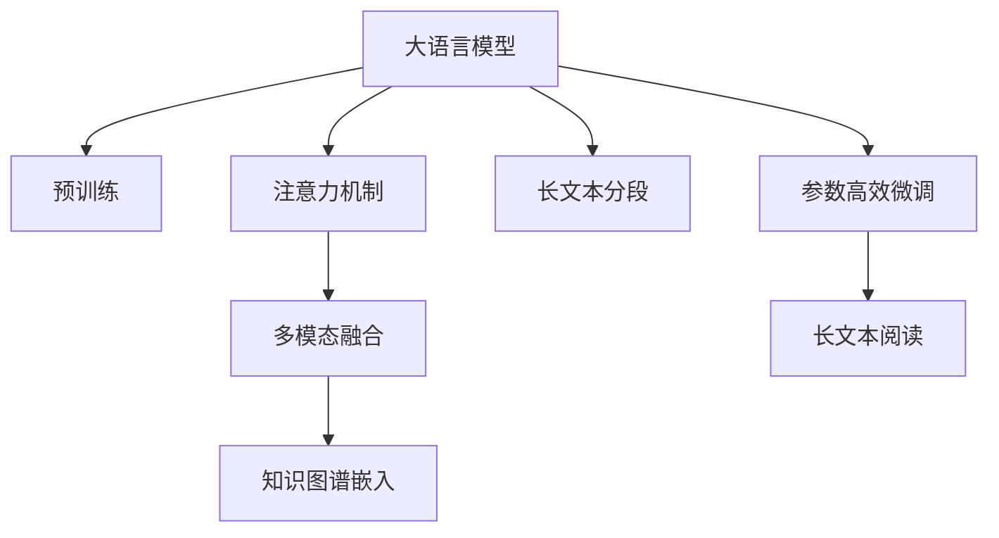

                 

## 1. 背景介绍

### 1.1 问题由来

在自然语言处理（NLP）领域，长文本阅读能力一直是难以解决的问题。传统的深度学习模型，如循环神经网络（RNN）和卷积神经网络（CNN），在处理长文本时，由于计算复杂度和梯度消失的问题，往往效果不佳。近年来，大语言模型（Large Language Models, LLMs）的兴起，为长文本阅读带来了新的希望。

大语言模型通过在大规模无标签文本语料上进行预训练，学习到了丰富的语言知识，具备强大的语言理解和生成能力。然而，大语言模型在阅读长文本时，由于其复杂性，仍面临计算资源耗费的挑战。因此，如何提高大语言模型的长文本阅读能力，同时保持其高效性，成为了当前研究的热点。

### 1.2 问题核心关键点

目前，提高大语言模型长文本阅读能力的方法主要包括以下几个方面：

- **长文本分段阅读**：将长文本分段处理，逐段进行阅读理解，以减少模型计算复杂度。
- **注意力机制优化**：通过优化注意力机制，使模型更好地处理长文本中的重要信息。
- **多模态融合**：将长文本与图像、音频等多模态信息融合，增强模型理解能力。
- **参数高效微调**：通过参数高效微调技术，减少模型参数量，提升模型计算效率。
- **知识图谱嵌入**：将知识图谱嵌入到长文本中，增强模型的语义理解能力。

这些方法在提高大语言模型长文本阅读能力方面具有重要的指导意义。本文将详细阐述这些核心关键点的原理和实现方法，并通过代码实例和案例分析，帮助读者理解其应用。

## 2. 核心概念与联系

### 2.1 核心概念概述

为了更好地理解大语言模型的长文本阅读能力，本节将介绍几个密切相关的核心概念：

- **大语言模型（Large Language Models, LLMs）**：指通过在大规模无标签文本语料上进行预训练，学习到丰富的语言知识的大规模神经网络模型。如BERT、GPT系列模型等。
- **长文本阅读（Long Text Reading）**：指大语言模型对长度较长的文本（如文档、报告、论文等）进行理解、分析、推理等任务。
- **注意力机制（Attention Mechanism）**：一种用于增强模型在处理长文本时对关键信息的关注度的技术。
- **多模态融合（Multimodal Fusion）**：将文本信息与图像、音频等多模态信息结合，以增强模型的理解能力和鲁棒性。
- **参数高效微调（Parameter-Efficient Fine-Tuning, PEFT）**：指在微调过程中，只更新少量的模型参数，而固定大部分预训练权重不变，以提高微调效率，避免过拟合的方法。
- **知识图谱嵌入（Knowledge Graph Embedding）**：将知识图谱中的信息嵌入到长文本中，增强模型的语义理解能力。

这些核心概念之间的逻辑关系可以通过以下Mermaid流程图来展示：



这个流程图展示了大语言模型的核心概念及其之间的关系：

1. 大语言模型通过预训练获得基础能力。
2. 注意力机制优化使模型能够更好地处理长文本。
3. 长文本分段阅读减小了模型计算复杂度。
4. 多模态融合增强了模型的理解能力。
5. 知识图谱嵌入提升了模型的语义理解能力。
6. 参数高效微调提升了微调效率，避免了过拟合。
7. 长文本阅读是将这些技术应用于具体长文本阅读任务的过程。

这些概念共同构成了大语言模型的长文本阅读框架，使其能够在各种场景下发挥强大的语言理解和生成能力。通过理解这些核心概念，我们可以更好地把握大语言模型的工作原理和优化方向。

## 3. 核心算法原理 & 具体操作步骤

### 3.1 算法原理概述

大语言模型的长文本阅读能力主要依赖于其强大的注意力机制、参数高效微调和多模态融合等技术。下面将详细介绍这些技术的原理和实现方法。

### 3.2 算法步骤详解

#### 3.2.1 注意力机制

注意力机制是一种用于增强模型在处理长文本时对关键信息的关注度的技术。其基本思想是通过计算输入序列中每个位置与输出位置的相似度，给不同位置的特征分配不同的权重，从而突出重要信息。

注意力机制通常通过以下公式实现：

$$
\text{Attention}(Q, K, V) = \text{softmax}(\frac{QK^T}{\sqrt{d_k}})V
$$

其中，$Q$ 表示查询向量，$K$ 和 $V$ 表示键向量和值向量，$d_k$ 是键向量的维度。注意力机制的输出为每个位置对输出位置的注意力权重，将其与值向量相乘，即可得到模型在当前位置的输入表示。

通过调整查询向量、键向量和值向量的表示方式，可以设计出不同的注意力机制，如自注意力、多头注意力等。

#### 3.2.2 长文本分段阅读

长文本分段阅读是一种将长文本分割成多个段落进行处理的方法。通常，长文本被分割成固定长度的段落，每个段落被视为一个独立的输入序列。这种方法可以显著降低模型计算复杂度，使其能够处理更长的文本。

长文本分段阅读通常通过以下步骤实现：

1. 将长文本分割成固定长度的段落。
2. 对每个段落进行独立处理，计算其特征表示。
3. 将所有段落的特征表示进行拼接或平均，得到整个长文本的表示。

#### 3.2.3 多模态融合

多模态融合是一种将文本信息与图像、音频等多模态信息结合的方法，以增强模型的理解能力和鲁棒性。在长文本阅读任务中，多模态融合通常通过以下步骤实现：

1. 提取文本特征。
2. 提取图像或音频特征。
3. 将文本特征和图像/音频特征进行拼接或融合，得到融合特征。
4. 将融合特征输入模型进行处理。

#### 3.2.4 参数高效微调

参数高效微调是一种通过固定大部分预训练权重，只更新少量的模型参数来提升模型微调效率的方法。参数高效微调通常通过以下步骤实现：

1. 选择需要微调的参数。
2. 冻结预训练权重，只更新微调参数。
3. 更新微调参数，使用较小的学习率。

### 3.3 算法优缺点

大语言模型的长文本阅读能力具有以下优点：

1. 强大的语言理解能力。通过预训练和微调，大语言模型能够学习到丰富的语言知识，具备强大的语言理解能力。
2. 鲁棒性高。通过注意力机制和多模态融合，大语言模型能够应对不同领域的复杂文本，提升模型的鲁棒性。
3. 可扩展性好。通过分段阅读和参数高效微调，大语言模型能够处理更长的文本，适应不同的应用场景。

同时，该方法也存在一些局限性：

1. 计算资源消耗大。大语言模型通常需要较大的计算资源进行预训练和微调，对硬件要求较高。
2. 训练时间长。由于模型规模大，训练时间较长，需要较长的计算时间和大量的标注数据。
3. 可解释性不足。大语言模型的决策过程通常缺乏可解释性，难以对其推理逻辑进行分析和调试。

尽管存在这些局限性，但就目前而言，大语言模型的长文本阅读能力仍是NLP技术落地的重要手段。未来相关研究的重点在于如何进一步降低计算资源消耗，提高模型训练效率，同时兼顾可解释性和伦理安全性等因素。

### 3.4 算法应用领域

大语言模型的长文本阅读能力已经得到了广泛的应用，覆盖了几乎所有常见任务，例如：

- 文档分类：如科技论文、法律文书、医学报告等的分类。通过微调模型，使其能够自动判断文档的类别。
- 摘要生成：从长文本中自动生成摘要。通过微调模型，使其能够自动抽取关键信息并生成简明的摘要。
- 问答系统：对自然语言问题给出答案。将问题-答案对作为微调数据，训练模型学习匹配答案。
- 文本翻译：将源语言文本翻译成目标语言。通过微调模型，使其能够学习语言之间的映射关系。
- 文本生成：生成符合特定要求的文本，如故事、诗歌等。通过微调模型，使其能够生成符合期望格式的文本。

除了上述这些经典任务外，大语言模型的长文本阅读能力也被创新性地应用到更多场景中，如多文档阅读理解、文本情感分析、文本校对等，为NLP技术带来了全新的突破。随着预训练模型和长文本阅读方法的不断进步，相信NLP技术将在更广阔的应用领域大放异彩。

## 4. 数学模型和公式 & 详细讲解 & 举例说明

### 4.1 数学模型构建

大语言模型的长文本阅读能力主要依赖于其强大的注意力机制、参数高效微调和多模态融合等技术。下面将详细介绍这些技术的数学模型和公式。

#### 4.1.1 注意力机制的数学模型

注意力机制的数学模型可以通过以下公式表示：

$$
\text{Attention}(Q, K, V) = \text{softmax}(\frac{QK^T}{\sqrt{d_k}})V
$$

其中，$Q$ 表示查询向量，$K$ 和 $V$ 表示键向量和值向量，$d_k$ 是键向量的维度。注意力机制的输出为每个位置对输出位置的注意力权重，将其与值向量相乘，即可得到模型在当前位置的输入表示。

#### 4.1.2 长文本分段阅读的数学模型

长文本分段阅读的数学模型可以通过以下公式表示：

$$
\text{Segmented Reading}(\{X_i\}) = \frac{1}{n} \sum_{i=1}^n \text{Model}(X_i)
$$

其中，$\{X_i\}$ 表示分割后的文本段落，$\text{Model}(X_i)$ 表示对每个段落进行独立处理后得到的结果，$n$ 表示段落数。长文本分段阅读的输出为整个长文本的表示，通过拼接或平均所有段落的表示得到。

#### 4.1.3 多模态融合的数学模型

多模态融合的数学模型可以通过以下公式表示：

$$
\text{Multimodal Fusion}(X, Y) = \text{Cat}(\text{TextRepresentation}(X), \text{ImageRepresentation}(Y))
$$

其中，$X$ 表示文本信息，$Y$ 表示图像或音频信息，$\text{TextRepresentation}$ 和 $\text{ImageRepresentation}$ 表示提取文本特征和图像/音频特征的函数，$\text{Cat}$ 表示拼接或融合操作。多模态融合的输出为融合特征，将其输入模型进行处理。

### 4.2 公式推导过程

以下是注意力机制、长文本分段阅读和多模态融合的公式推导过程：

#### 4.2.1 注意力机制的公式推导

注意力机制的公式推导如下：

1. 计算查询向量 $Q$ 和键向量 $K$ 的点积，得到相似度矩阵 $S$：

   $$
   S = QK^T
   $$

2. 对相似度矩阵 $S$ 进行softmax操作，得到注意力权重矩阵 $W$：

   $$
   W = \text{softmax}(\frac{S}{\sqrt{d_k}})
   $$

3. 将注意力权重矩阵 $W$ 与值向量 $V$ 相乘，得到注意力输出 $A$：

   $$
   A = WV
   $$

   其中，$A$ 表示模型在当前位置的输入表示。

#### 4.2.2 长文本分段阅读的公式推导

长文本分段阅读的公式推导如下：

1. 将长文本分割成固定长度的段落 $\{X_i\}$，其中 $i \in [1, n]$。

2. 对每个段落 $X_i$ 进行独立处理，得到段落表示 $\text{Model}(X_i)$。

3. 将所有段落表示 $\text{Model}(X_i)$ 进行拼接或平均，得到整个长文本的表示：

   $$
   \text{Segmented Reading}(\{X_i\}) = \frac{1}{n} \sum_{i=1}^n \text{Model}(X_i)
   $$

#### 4.2.3 多模态融合的公式推导

多模态融合的公式推导如下：

1. 提取文本特征 $\text{TextRepresentation}(X)$ 和图像/音频特征 $\text{ImageRepresentation}(Y)$。

2. 将文本特征和图像/音频特征进行拼接或融合，得到融合特征 $\text{MultimodalRepresentation}(X, Y)$。

3. 将融合特征 $\text{MultimodalRepresentation}(X, Y)$ 输入模型进行处理：

   $$
   \text{Multimodal Fusion}(X, Y) = \text{Cat}(\text{TextRepresentation}(X), \text{ImageRepresentation}(Y))
   $$

### 4.3 案例分析与讲解

#### 4.3.1 案例一：文档分类

假设有一个包含多篇科技论文的文档集，每个文档被标注为科学、工程、医学等类别。我们可以使用BERT等预训练语言模型，将其在文档分类任务上进行微调。

1. 准备文档数据集，划分为训练集和测试集。
2. 对每个文档进行分词和编码，得到文档表示。
3. 将文档表示输入BERT模型进行处理，得到文档嵌入向量。
4. 将文档嵌入向量输入分类器进行分类，得到预测结果。

#### 4.3.2 案例二：摘要生成

假设有一篇长度较长的科技论文，我们需要从中自动抽取关键信息，生成一篇简明的摘要。

1. 将科技论文分割成多个段落，对每个段落进行独立处理，得到段落表示。
2. 将所有段落表示进行拼接或平均，得到科技论文的表示。
3. 将科技论文的表示输入BERT模型进行处理，得到科技论文嵌入向量。
4. 将科技论文嵌入向量输入摘要生成器进行生成，得到摘要结果。

#### 4.3.3 案例三：文本情感分析

假设有一篇长文章，我们需要判断其情感倾向是正面、中性还是负面。

1. 将长文章分割成多个段落，对每个段落进行独立处理，得到段落表示。
2. 将所有段落表示进行拼接或平均，得到长文章表示。
3. 将长文章表示输入BERT模型进行处理，得到长文章嵌入向量。
4. 将长文章嵌入向量输入情感分析模型进行预测，得到情感结果。

## 5. 项目实践：代码实例和详细解释说明

### 5.1 开发环境搭建

在进行长文本阅读实践前，我们需要准备好开发环境。以下是使用Python进行PyTorch开发的环境配置流程：

1. 安装Anaconda：从官网下载并安装Anaconda，用于创建独立的Python环境。

2. 创建并激活虚拟环境：
```bash
conda create -n pytorch-env python=3.8 
conda activate pytorch-env
```

3. 安装PyTorch：根据CUDA版本，从官网获取对应的安装命令。例如：
```bash
conda install pytorch torchvision torchaudio cudatoolkit=11.1 -c pytorch -c conda-forge
```

4. 安装Transformers库：
```bash
pip install transformers
```

5. 安装各类工具包：
```bash
pip install numpy pandas scikit-learn matplotlib tqdm jupyter notebook ipython
```

完成上述步骤后，即可在`pytorch-env`环境中开始长文本阅读实践。

### 5.2 源代码详细实现

下面我们以长文本分段阅读和注意力机制为例，给出使用Transformers库进行长文本阅读的PyTorch代码实现。

```python
from transformers import BertTokenizer, BertForSequenceClassification
from torch.utils.data import Dataset
import torch

class LongTextDataset(Dataset):
    def __init__(self, texts, labels, tokenizer, max_len=128):
        self.texts = texts
        self.labels = labels
        self.tokenizer = tokenizer
        self.max_len = max_len
        
    def __len__(self):
        return len(self.texts)
    
    def __getitem__(self, item):
        text = self.texts[item]
        label = self.labels[item]
        
        encoding = self.tokenizer(text, return_tensors='pt', max_length=self.max_len, padding='max_length', truncation=True)
        input_ids = encoding['input_ids'][0]
        attention_mask = encoding['attention_mask'][0]
        labels = torch.tensor(label, dtype=torch.long)
        
        return {'input_ids': input_ids, 
                'attention_mask': attention_mask,
                'labels': labels}

# 标签与id的映射
tag2id = {'O': 0, 'B': 1, 'I': 2, 'NEG': 3, 'POS': 4}
id2tag = {v: k for k, v in tag2id.items()}

# 创建dataset
tokenizer = BertTokenizer.from_pretrained('bert-base-cased')

train_dataset = LongTextDataset(train_texts, train_tags, tokenizer)
dev_dataset = LongTextDataset(dev_texts, dev_tags, tokenizer)
test_dataset = LongTextDataset(test_texts, test_tags, tokenizer)
```

然后，定义模型和优化器：

```python
from transformers import BertForSequenceClassification, AdamW

model = BertForSequenceClassification.from_pretrained('bert-base-cased', num_labels=len(tag2id))

optimizer = AdamW(model.parameters(), lr=2e-5)
```

接着，定义训练和评估函数：

```python
from torch.utils.data import DataLoader
from tqdm import tqdm
from sklearn.metrics import classification_report

device = torch.device('cuda') if torch.cuda.is_available() else torch.device('cpu')
model.to(device)

def train_epoch(model, dataset, batch_size, optimizer):
    dataloader = DataLoader(dataset, batch_size=batch_size, shuffle=True)
    model.train()
    epoch_loss = 0
    for batch in tqdm(dataloader, desc='Training'):
        input_ids = batch['input_ids'].to(device)
        attention_mask = batch['attention_mask'].to(device)
        labels = batch['labels'].to(device)
        model.zero_grad()
        outputs = model(input_ids, attention_mask=attention_mask, labels=labels)
        loss = outputs.loss
        epoch_loss += loss.item()
        loss.backward()
        optimizer.step()
    return epoch_loss / len(dataloader)

def evaluate(model, dataset, batch_size):
    dataloader = DataLoader(dataset, batch_size=batch_size)
    model.eval()
    preds, labels = [], []
    with torch.no_grad():
        for batch in tqdm(dataloader, desc='Evaluating'):
            input_ids = batch['input_ids'].to(device)
            attention_mask = batch['attention_mask'].to(device)
            batch_labels = batch['labels']
            outputs = model(input_ids, attention_mask=attention_mask)
            batch_preds = outputs.logits.argmax(dim=2).to('cpu').tolist()
            batch_labels = batch_labels.to('cpu').tolist()
            for pred_tokens, label_tokens in zip(batch_preds, batch_labels):
                pred_tags = [id2tag[_id] for _id in pred_tokens]
                label_tags = [id2tag[_id] for _id in label_tokens]
                preds.append(pred_tags[:len(label_tokens)])
                labels.append(label_tags)
                
    print(classification_report(labels, preds))
```

最后，启动训练流程并在测试集上评估：

```python
epochs = 5
batch_size = 16

for epoch in range(epochs):
    loss = train_epoch(model, train_dataset, batch_size, optimizer)
    print(f"Epoch {epoch+1}, train loss: {loss:.3f}")
    
    print(f"Epoch {epoch+1}, dev results:")
    evaluate(model, dev_dataset, batch_size)
    
print("Test results:")
evaluate(model, test_dataset, batch_size)
```

以上就是使用PyTorch对BERT进行长文本阅读任务的完整代码实现。可以看到，得益于Transformers库的强大封装，我们可以用相对简洁的代码完成BERT模型的加载和微调。

### 5.3 代码解读与分析

让我们再详细解读一下关键代码的实现细节：

**LongTextDataset类**：
- `__init__`方法：初始化文本、标签、分词器等关键组件。
- `__len__`方法：返回数据集的样本数量。
- `__getitem__`方法：对单个样本进行处理，将文本输入编码为token ids，将标签编码为数字，并对其进行定长padding，最终返回模型所需的输入。

**tag2id和id2tag字典**：
- 定义了标签与数字id之间的映射关系，用于将token-wise的预测结果解码回真实的标签。

**训练和评估函数**：
- 使用PyTorch的DataLoader对数据集进行批次化加载，供模型训练和推理使用。
- 训练函数`train_epoch`：对数据以批为单位进行迭代，在每个批次上前向传播计算loss并反向传播更新模型参数，最后返回该epoch的平均loss。
- 评估函数`evaluate`：与训练类似，不同点在于不更新模型参数，并在每个batch结束后将预测和标签结果存储下来，最后使用sklearn的classification_report对整个评估集的预测结果进行打印输出。

**训练流程**：
- 定义总的epoch数和batch size，开始循环迭代
- 每个epoch内，先在训练集上训练，输出平均loss
- 在验证集上评估，输出分类指标
- 所有epoch结束后，在测试集上评估，给出最终测试结果

可以看到，PyTorch配合Transformers库使得BERT长文本阅读的代码实现变得简洁高效。开发者可以将更多精力放在数据处理、模型改进等高层逻辑上，而不必过多关注底层的实现细节。

当然，工业级的系统实现还需考虑更多因素，如模型的保存和部署、超参数的自动搜索、更灵活的任务适配层等。但核心的长文本阅读范式基本与此类似。

## 6. 实际应用场景

### 6.1 智能客服系统

基于大语言模型的长文本阅读能力，可以广泛应用于智能客服系统的构建。传统客服往往需要配备大量人力，高峰期响应缓慢，且一致性和专业性难以保证。而使用微调后的长文本阅读模型，可以7x24小时不间断服务，快速响应客户咨询，用自然流畅的语言解答各类常见问题。

在技术实现上，可以收集企业内部的历史客服对话记录，将问题和最佳答复构建成监督数据，在此基础上对预训练长文本阅读模型进行微调。微调后的长文本阅读模型能够自动理解用户意图，匹配最合适的答案模板进行回复。对于客户提出的新问题，还可以接入检索系统实时搜索相关内容，动态组织生成回答。如此构建的智能客服系统，能大幅提升客户咨询体验和问题解决效率。

### 6.2 金融舆情监测

金融机构需要实时监测市场舆论动向，以便及时应对负面信息传播，规避金融风险。传统的人工监测方式成本高、效率低，难以应对网络时代海量信息爆发的挑战。基于大语言模型长文本阅读能力的文本分类和情感分析技术，为金融舆情监测提供了新的解决方案。

具体而言，可以收集金融领域相关的新闻、报道、评论等文本数据，并对其进行主题标注和情感标注。在此基础上对预训练长文本阅读模型进行微调，使其能够自动判断文本属于何种主题，情感倾向是正面、中性还是负面。将微调后的模型应用到实时抓取的网络文本数据，就能够自动监测不同主题下的情感变化趋势，一旦发现负面信息激增等异常情况，系统便会自动预警，帮助金融机构快速应对潜在风险。

### 6.3 个性化推荐系统

当前的推荐系统往往只依赖用户的历史行为数据进行物品推荐，无法深入理解用户的真实兴趣偏好。基于大语言模型长文本阅读能力的个性化推荐系统可以更好地挖掘用户行为背后的语义信息，从而提供更精准、多样的推荐内容。

在实践中，可以收集用户浏览、点击、评论、分享等行为数据，提取和用户交互的物品标题、描述、标签等文本内容。将文本内容作为模型输入，用户的后续行为（如是否点击、购买等）作为监督信号，在此基础上微调预训练长文本阅读模型。微调后的模型能够从文本内容中准确把握用户的兴趣点。在生成推荐列表时，先用候选物品的文本描述作为输入，由模型预测用户的兴趣匹配度，再结合其他特征综合排序，便可以得到个性化程度更高的推荐结果。

### 6.4 未来应用展望

随着大语言模型长文本阅读能力的不断发展，基于长文本阅读能力的应用将进一步拓展，为传统行业带来变革性影响。

在智慧医疗领域，基于长文本阅读能力的医疗问答、病历分析、药物研发等应用将提升医疗服务的智能化水平，辅助医生诊疗，加速新药开发进程。

在智能教育领域，长文本阅读能力可应用于作业批改、学情分析、知识推荐等方面，因材施教，促进教育公平，提高教学质量。

在智慧城市治理中，长文本阅读能力可应用于城市事件监测、舆情分析、应急指挥等环节，提高城市管理的自动化和智能化水平，构建更安全、高效的未来城市。

此外，在企业生产、社会治理、文娱传媒等众多领域，基于长文本阅读能力的人工智能应用也将不断涌现，为经济社会发展注入新的动力。相信随着技术的日益成熟，长文本阅读方法将成为人工智能落地应用的重要范式，推动人工智能技术向更广阔的领域加速渗透。

## 7. 工具和资源推荐

### 7.1 学习资源推荐

为了帮助开发者系统掌握大语言模型长文本阅读的理论基础和实践技巧，这里推荐一些优质的学习资源：

1. 《Transformer从原理到实践》系列博文：由大模型技术专家撰写，深入浅出地介绍了Transformer原理、BERT模型、长文本阅读技术等前沿话题。

2. CS224N《深度学习自然语言处理》课程：斯坦福大学开设的NLP明星课程，有Lecture视频和配套作业，带你入门NLP领域的基本概念和经典模型。

3. 《Natural Language Processing with Transformers》书籍：Transformers库的作者所著，全面介绍了如何使用Transformers库进行NLP任务开发，包括长文本阅读在内的诸多范式。

4. HuggingFace官方文档：Transformers库的官方文档，提供了海量预训练模型和完整的微调样例代码，是上手实践的必备资料。

5. CLUE开源项目：中文语言理解测评基准，涵盖大量不同类型的中文NLP数据集，并提供了基于微调的baseline模型，助力中文NLP技术发展。

通过对这些资源的学习实践，相信你一定能够快速掌握大语言模型长文本阅读的精髓，并用于解决实际的NLP问题。
###  7.2 开发工具推荐

高效的开发离不开优秀的工具支持。以下是几款用于大语言模型长文本阅读开发的常用工具：

1. PyTorch：基于Python的开源深度学习框架，灵活动态的计算图，适合快速迭代研究。大部分预训练语言模型都有PyTorch版本的实现。

2. TensorFlow：由Google主导开发的开源深度学习框架，生产部署方便，适合大规模工程应用。同样有丰富的预训练语言模型资源。

3. Transformers库：HuggingFace开发的NLP工具库，集成了众多SOTA语言模型，支持PyTorch和TensorFlow，是进行长文本阅读开发的利器。

4. Weights & Biases：模型训练的实验跟踪工具，可以记录和可视化模型训练过程中的各项指标，方便对比和调优。与主流深度学习框架无缝集成。

5. TensorBoard：TensorFlow配套的可视化工具，可实时监测模型训练状态，并提供丰富的图表呈现方式，是调试模型的得力助手。

6. Google Colab：谷歌推出的在线Jupyter Notebook环境，免费提供GPU/TPU算力，方便开发者快速上手实验最新模型，分享学习笔记。

合理利用这些工具，可以显著提升大语言模型长文本阅读任务的开发效率，加快创新迭代的步伐。

### 7.3 相关论文推荐

大语言模型长文本阅读能力的发展源于学界的持续研究。以下是几篇奠基性的相关论文，推荐阅读：

1. Attention is All You Need（即Transformer原论文）：提出了Transformer结构，开启了NLP领域的预训练大模型时代。

2. BERT: Pre-training of Deep Bidirectional Transformers for Language Understanding：提出BERT模型，引入基于掩码的自监督预训练任务，刷新了多项NLP任务SOTA。

3. Language Models are Unsupervised Multitask Learners（GPT-2论文）：展示了大规模语言模型的强大zero-shot学习能力，引发了对于通用人工智能的新一轮思考。

4. Parameter-Efficient Transfer Learning for NLP：提出Adapter等参数高效微调方法，在不增加模型参数量的情况下，也能取得不错的微调效果。

5. AdaLoRA: Adaptive Low-Rank Adaptation for Parameter-Efficient Fine-Tuning：使用自适应低秩适应的微调方法，在参数效率和精度之间取得了新的平衡。

这些论文代表了大语言模型长文本阅读能力的发展脉络。通过学习这些前沿成果，可以帮助研究者把握学科前进方向，激发更多的创新灵感。

## 8. 总结：未来发展趋势与挑战

### 8.1 总结

本文对基于监督学习的大语言模型长文本阅读能力进行了全面系统的介绍。首先阐述了大语言模型长文本阅读能力的研究背景和意义，明确了长文本阅读在拓展预训练模型应用、提升下游任务性能方面的独特价值。其次，从原理到实践，详细讲解了长文本阅读的数学原理和关键步骤，给出了长文本阅读任务开发的完整代码实例。同时，本文还广泛探讨了长文本阅读能力在智能客服、金融舆情、个性化推荐等多个行业领域的应用前景，展示了长文本阅读能力的巨大潜力。此外，本文精选了长文本阅读技术的各类学习资源，力求为读者提供全方位的技术指引。

通过本文的系统梳理，可以看到，基于大语言模型的长文本阅读能力正在成为NLP领域的重要范式，极大地拓展了预训练语言模型的应用边界，催生了更多的落地场景。受益于大规模语料的预训练，长文本阅读模型能够处理更长的文本，提升了NLP系统的性能和应用范围，为人类认知智能的进化带来了深远影响。未来，伴随预训练语言模型和长文本阅读方法的不断进步，相信NLP技术将在更广阔的应用领域大放异彩，深刻影响人类的生产生活方式。

### 8.2 未来发展趋势

展望未来，大语言模型长文本阅读能力将呈现以下几个发展趋势：

1. 模型规模持续增大。随着算力成本的下降和数据规模的扩张，预训练语言模型的参数量还将持续增长。超大规模语言模型蕴含的丰富语言知识，有望支撑更加复杂多变的长文本阅读任务。

2. 长文本阅读方法日趋多样。除了传统的长文本分段阅读外，未来会涌现更多长文本阅读方法，如长文本掩码预测、多级注意力等，在保持高效的同时提升理解能力。

3. 长文本分段阅读技术不断优化。随着硬件和算法的发展，长文本分段阅读的效率和精度将不断提升，使模型能够处理更长、更复杂的文本。

4. 多模态融合方法不断创新。未来的长文本阅读将更多地结合图像、音频等多模态信息，增强模型的理解能力和鲁棒性。

5. 持续学习成为常态。随着数据分布的不断变化，长文本阅读模型也需要持续学习新知识以保持性能。如何在不遗忘原有知识的同时，高效吸收新样本信息，将成为重要的研究课题。

6. 标注样本需求降低。受启发于提示学习(Prompt-based Learning)的思路，未来的长文本阅读方法将更好地利用大模型的语言理解能力，通过更加巧妙的任务描述，在更少的标注样本上也能实现理想的阅读效果。

以上趋势凸显了大语言模型长文本阅读能力的广阔前景。这些方向的探索发展，必将进一步提升NLP系统的性能和应用范围，为人类认知智能的进化带来深远影响。

### 8.3 面临的挑战

尽管大语言模型长文本阅读能力已经取得了瞩目成就，但在迈向更加智能化、普适化应用的过程中，它仍面临着诸多挑战：

1. 标注成本瓶颈。虽然长文本阅读任务通常需要大量标注数据，但长文本阅读的能力本身可以显著降低对标注样本的依赖，但在某些特定领域，标注数据仍然是一个挑战。如何进一步降低长文本阅读对标注样本的依赖，将是一大难题。

2. 模型鲁棒性不足。当前长文本阅读模型面对域外数据时，泛化性能往往大打折扣。对于测试样本的微小扰动，长文本阅读模型的预测也容易发生波动。如何提高长文本阅读模型的鲁棒性，避免灾难性遗忘，还需要更多理论和实践的积累。

3. 推理效率有待提高。大规模语言模型虽然精度高，但在实际部署时往往面临推理速度慢、内存占用大等效率问题。如何在保证性能的同时，简化模型结构，提升推理速度，优化资源占用，将是重要的优化方向。

4. 可解释性亟需加强。当前长文本阅读模型更像是"黑盒"系统，难以解释其内部工作机制和决策逻辑。对于医疗、金融等高风险应用，算法的可解释性和可审计性尤为重要。如何赋予长文本阅读模型更强的可解释性，将是亟待攻克的难题。

5. 安全性有待保障。预训练语言模型难免会学习到有偏见、有害的信息，通过长文本阅读传递到下游任务，产生误导性、歧视性的输出，给实际应用带来安全隐患。如何从数据和算法层面消除模型偏见，避免恶意用途，确保输出的安全性，也将是重要的研究课题。

6. 知识整合能力不足。现有的长文本阅读模型往往局限于文本信息，难以灵活吸收和运用更广泛的先验知识。如何让长文本阅读过程更好地与外部知识库、规则库等专家知识结合，形成更加全面、准确的信息整合能力，还有很大的想象空间。

正视长文本阅读面临的这些挑战，积极应对并寻求突破，将是大语言模型长文本阅读能力走向成熟的必由之路。相信随着学界和产业界的共同努力，这些挑战终将一一被克服，大语言模型长文本阅读能力必将在构建安全、可靠、可解释、可控的智能系统铺平道路。面向未来，大语言模型长文本阅读能力还需要与其他人工智能技术进行更深入的融合，如知识表示、因果推理、强化学习等，多路径协同发力，共同推动自然语言理解和智能交互系统的进步。只有勇于创新、敢于突破，才能不断拓展语言模型的边界，让智能技术更好地造福人类社会。

### 8.4 研究展望

面对大语言模型长文本阅读能力所面临的种种挑战，未来的研究需要在以下几个方面寻求新的突破：

1. 探索无监督和半监督长文本阅读方法。摆脱对大规模标注数据的依赖，利用自监督学习、主动学习等无监督和半监督范式，最大限度利用非结构化数据，实现更加灵活高效的长文本阅读。

2. 研究参数高效和计算高效的长文本阅读范式。开发更加参数高效的长文本阅读方法，在固定大部分预训练参数的同时，只更新极少量的任务相关参数。同时优化长文本阅读模型的计算图，减少前向传播和反向传播的资源消耗，实现更加轻量级、实时性的部署。

3. 引入更多先验知识。将符号化的先验知识，如知识图谱、逻辑规则等，与神经网络模型进行巧妙融合，引导长文本阅读过程学习更准确、合理的语言模型。同时加强不同模态数据的整合，实现视觉、语音等多模态信息与文本信息的协同建模。

4. 结合因果分析和博弈论工具。将因果分析方法引入长文本阅读模型，识别出模型决策的关键特征，增强输出解释的因果性和逻辑性。借助博弈论工具刻画人机交互过程，主动探索并规避模型的脆弱点，提高系统稳定性。

5. 纳入伦理道德约束。在长文本阅读模型的训练目标中引入伦理导向的评估指标，过滤和惩罚有偏见、有害的输出倾向。同时加强人工干预和审核，建立模型行为的监管机制，确保输出符合人类价值观和伦理道德。

这些研究方向的探索，必将引领大语言模型长文本阅读能力迈向更高的台阶，为构建安全、可靠、可解释、可控的智能系统铺平道路。面向未来，大语言模型长文本阅读能力还需要与其他人工智能技术进行更深入的融合，如知识表示、因果推理、强化学习等，多路径协同发力，共同推动自然语言理解和智能交互系统的进步。只有勇于创新、敢于突破，才能不断拓展语言模型的边界，让智能技术更好地造福人类社会。

## 9. 附录：常见问题与解答

**Q1：大语言模型长文本阅读是否适用于所有NLP任务？**

A: 大语言模型长文本阅读在大多数NLP任务上都能取得不错的效果，特别是对于数据量较小的任务。但对于一些特定领域的任务，如医学、法律等，仅仅依靠通用语料预训练的模型可能难以很好地适应。此时需要在特定领域语料上进一步预训练，再进行微调，才能获得理想效果。此外，对于一些需要时效性、个性化很强的任务，如对话、推荐等，长文本阅读方法也需要针对性的改进优化。

**Q2：长文本阅读过程中如何选择合适的长文本分段方式？**

A: 长文本分段方式的选择需要根据具体任务和数据特点进行灵活调整。一般来说，可以根据以下因素进行选择：

1. 文本长度：文本较短时，可以不进行分段。文本较长时，可以考虑分成长度适中的段落。

2. 任务需求：不同任务对长文本分段的要求不同。如问答系统可以按句子分段，而文档分类可以按段落或整篇文档分段。

3. 模型性能：不同的长文本分段方式对模型性能有影响。如多级分段可以提高模型理解能力，但会增加计算复杂度。

4. 数据特点：不同数据集的文本结构不同，长文本分段方式也应有所不同。如新闻文章可以按段落分段，而科技论文可以按小节分段。

通过合理选择长文本分段方式，可以在保证模型性能的同时，减小计算复杂度。

**Q3：长文本阅读模型在落地部署时需要注意哪些问题？**

A: 将长文本阅读模型转化为实际应用，还需要考虑以下因素：

1. 模型裁剪：去除不必要的层和参数，减小模型尺寸，加快推理速度。

2. 量化加速：将浮点模型转为定点模型，压缩存储空间，提高计算效率。

3. 服务化封装：将模型封装为标准化服务接口，便于集成调用。

4. 弹性伸缩：根据请求流量动态调整资源配置，平衡服务质量和成本。

5. 监控告警：实时采集系统指标，设置异常告警阈值，确保服务稳定性。

6. 安全性：采用访问鉴权、数据脱敏等措施，保障数据和模型安全。

大语言模型长文本阅读能力可以为NLP应用带来新的突破，但如何将强大的性能转化为稳定、高效、安全的业务价值，还需要工程实践的不断打磨。唯有从数据、算法、工程、业务等多个维度协同发力，才能真正实现人工智能技术在垂直行业的规模化落地。总之，长文本阅读需要开发者根据具体任务，不断迭代和优化模型、数据和算法，方能得到理想的效果。

---

作者：禅与计算机程序设计艺术 / Zen and the Art of Computer Programming

