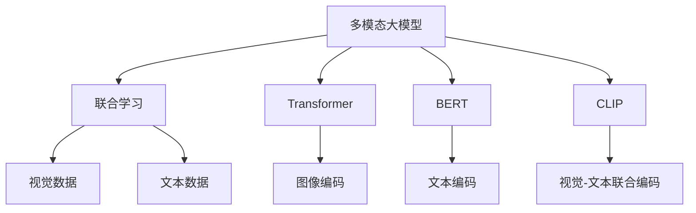

                 

# 多模态大模型：技术原理与实战 方法论介绍

> 关键词：多模态大模型,联合学习,Transformer,BERT,视觉语言,CLIP,CLIP应用,迁移学习,跨模态融合,自然语言处理(NLP),图像处理,计算机视觉

## 1. 背景介绍

### 1.1 问题由来

随着计算机视觉、自然语言处理等人工智能技术的迅猛发展，单一模态的技术已无法满足现实世界中复杂多变的需求。然而，多模态数据（如文本和图像）的结合，使AI系统可以更好地理解和处理现实世界中的信息。

大模型预训练技术已经在NLP和计算机视觉领域取得了显著的进展。BERT和GPT等通用语言模型在自然语言处理上表现优异，而像DALL-E和CLIP这样的视觉语言模型则在计算机视觉领域表现突出。然而，单一模态的预训练模型往往难以充分利用跨模态数据的信息，而多模态大模型（Multimodal Large Models）的发展，为跨模态信息的融合提供了新的可能性。

### 1.2 问题核心关键点

多模态大模型在预训练时使用多模态数据，同时在微调时也能整合跨模态数据，实现多模态信息的联合学习。其核心问题包括：
- 如何设计和训练多模态预训练模型？
- 如何在不同模态之间进行有效融合？
- 如何构建多模态下游任务并微调模型？

### 1.3 问题研究意义

多模态大模型的研究，对于拓展AI系统的能力边界、提升跨模态信息处理能力具有重要意义：

1. 提高跨模态信息利用率。多模态数据可以互补，提高AI系统理解复杂场景的能力。
2. 促进计算机视觉和自然语言处理技术的融合。融合多模态信息，使模型在视觉和语言之间进行更高效的映射和理解。
3. 推动智能应用场景的发展。在智能家居、自动驾驶、社交媒体等领域，多模态信息融合能带来更高的用户满意度和应用体验。
4. 加速人工智能的产业化进程。多模态大模型可以加速构建更智能、更全面的人工智能系统。

## 2. 核心概念与联系

### 2.1 核心概念概述

为了深入理解多模态大模型，我们先介绍几个关键概念：

- **多模态大模型(Multimodal Large Models)**：同时包含视觉和文本等多模态数据的预训练模型。
- **联合学习(Joint Learning)**：不同模态的数据联合进行预训练，使得模型同时学习到多模态的特征。
- **Transformer**：一种基于自注意力机制的神经网络结构，适用于多模态数据的编码。
- **BERT**：一种使用掩码语言模型进行预训练的语言模型，在NLP领域表现出色。
- **CLIP**：一种联合视觉和文本进行预训练的模型，可以实现多模态的联合学习。

这些概念之间的逻辑关系可以通过以下Mermaid流程图来展示：



这个流程图展示了大模型预训练的基本流程：

1. 多模态大模型通过联合视觉和文本数据进行预训练。
2. 使用Transformer结构对不同模态进行编码。
3. 使用BERT等语言模型对文本进行编码。
4. CLIP等模型实现了视觉和文本的联合编码。
5. 预训练过程中，视觉和文本数据被融合到同一个模型中。

## 3. 核心算法原理 & 具体操作步骤

### 3.1 算法原理概述

多模态大模型的核心算法原理基于Transformer和联合学习。模型首先对不同模态数据进行编码，然后将编码结果通过交叉注意力机制进行融合。在微调时，同时考虑多模态数据，实现跨模态的迁移学习。

具体而言，多模态大模型 $M$ 在视觉和文本数据 $x$ 和 $y$ 上的联合编码为：

$$
M(x,y) = [M_{\text{vis}}(x); M_{\text{text}}(y)]
$$

其中 $M_{\text{vis}}$ 和 $M_{\text{text}}$ 分别表示对视觉和文本数据的编码。最终输出的联合编码可以通过交叉注意力机制进行融合：

$$
M(x,y) = \text{MultiHeadAttention}(M_{\text{vis}}(x), M_{\text{text}}(y))
$$

在微调时，使用监督信号（如分类标签）进行有监督学习，更新模型参数以适应特定的下游任务。

### 3.2 算法步骤详解

多模态大模型的预训练和微调一般包括以下几个关键步骤：

**Step 1: 准备预训练模型和数据集**
- 选择合适的多模态预训练模型，如CLIP、ViT等，并准备相应的多模态数据集，包括视觉图像和文本描述。
- 预训练数据集应覆盖不同模态的特征，包含丰富多样化的视觉和文本数据。

**Step 2: 设计和训练多模态预训练模型**
- 使用Transformer结构，对视觉和文本数据进行编码。
- 通过掩码语言模型等任务对文本数据进行预训练。
- 通过视觉-文本对匹配等任务对模型进行联合预训练。

**Step 3: 添加任务适配层**
- 根据下游任务类型，在预训练模型顶层设计合适的输出层和损失函数。
- 对于分类任务，通常在顶层添加线性分类器和交叉熵损失函数。
- 对于生成任务，通常使用语言模型的解码器输出概率分布，并以负对数似然为损失函数。

**Step 4: 设置微调超参数**
- 选择合适的优化算法及其参数，如 AdamW、SGD 等，设置学习率、批大小、迭代轮数等。
- 设置正则化技术及强度，包括权重衰减、Dropout、Early Stopping等。
- 确定冻结预训练参数的策略，如仅微调顶层，或全部参数都参与微调。

**Step 5: 执行梯度训练**
- 将训练集数据分批次输入模型，前向传播计算损失函数。
- 反向传播计算参数梯度，根据设定的优化算法和学习率更新模型参数。
- 周期性在验证集上评估模型性能，根据性能指标决定是否触发 Early Stopping。
- 重复上述步骤直到满足预设的迭代轮数或 Early Stopping 条件。

**Step 6: 测试和部署**
- 在测试集上评估微调后模型 $M_{\hat{\theta}}$ 的性能，对比微调前后的精度提升。
- 使用微调后的模型对新样本进行推理预测，集成到实际的应用系统中。
- 持续收集新的数据，定期重新微调模型，以适应数据分布的变化。

### 3.3 算法优缺点

多模态大模型预训练和微调方法具有以下优点：
1. 提升跨模态信息利用率。联合预训练使模型同时学习到视觉和文本的特征。
2. 增强多模态迁移能力。联合预训练后的模型更适应跨模态任务的迁移。
3. 灵活性高。多模态大模型可以适配多种不同类型的数据和任务。
4. 性能提升明显。在联合预训练和微调后，模型在多模态任务上表现优异。

同时，该方法也存在以下局限性：
1. 数据需求高。需要大量的多模态数据进行预训练。
2. 训练复杂度高。多模态数据联合训练耗时长，计算资源要求高。
3. 泛化能力受限。模型对数据分布的改变敏感，容易发生泛化问题。
4. 可解释性差。多模态大模型复杂度大，难以解释其内部机制。

尽管存在这些局限性，但多模态大模型仍然是目前最有效的跨模态信息处理手段，广泛应用于计算机视觉和自然语言处理的深度融合。未来相关研究的重点在于如何进一步降低数据需求，提高泛化能力，同时兼顾可解释性和计算效率。

### 3.4 算法应用领域

多模态大模型在诸多领域已展现出广泛的应用潜力，以下是几个典型的应用场景：

- **智能家居**：结合视觉和语音数据，实现智能音箱和智能门锁的交互和控制。
- **自动驾驶**：整合摄像头、雷达、激光雷达等传感数据，实现对道路环境的全面理解。
- **社交媒体**：通过图像和文本的联合学习，提升社交媒体内容的理解和推荐。
- **医疗诊断**：结合医学图像和文本报告，进行疾病诊断和辅助治疗决策。
- **金融分析**：结合财经新闻和股票图表，进行市场趋势预测和投资建议。
- **环境保护**：结合卫星图像和环境监测数据，进行生态保护和环境评估。

以上应用场景展示了多模态大模型在不同领域的强大潜力，为构建智能交互系统提供了新的思路和方向。

## 4. 数学模型和公式 & 详细讲解

### 4.1 数学模型构建

假设多模态大模型 $M$ 在视觉数据 $x$ 和文本数据 $y$ 上的联合编码为 $M(x,y)$。假设 $x$ 是 $n \times h$ 的视觉数据矩阵，$y$ 是 $m \times d$ 的文本编码矩阵。

联合编码 $M(x,y)$ 可以表示为：

$$
M(x,y) = M_{\text{vis}}(x) \oplus M_{\text{text}}(y)
$$

其中 $\oplus$ 表示融合操作，可以使用拼接、加权拼接、注意力机制等方式。

以注意力机制为例，融合公式为：

$$
\text{MultiHeadAttention}(Q,K,V) = \text{Attention}(Q,K,V) \cdot \text{Softmax}(Q^T K)
$$

其中 $Q$、$K$ 和 $V$ 分别表示查询、键和值，$\cdot$ 表示矩阵点乘。

在微调时，使用监督信号 $t$ 进行有监督学习，更新模型参数以适应特定的下游任务。

### 4.2 公式推导过程

我们以CLIP模型的微调为例，进行详细推导。

CLIP模型由两部分组成：视觉编码器和文本编码器。假设 $x$ 是 $n \times h$ 的图像数据，$y$ 是 $m \times d$ 的文本描述。

视觉编码器的输出为 $Z_{\text{vis}} \in \mathbb{R}^{n \times d_{\text{vis}}}$，文本编码器的输出为 $Z_{\text{text}} \in \mathbb{R}^{m \times d_{\text{text}}}$。

视觉编码器的自监督训练任务为对比预测任务：

$$
\mathcal{L}_{\text{vis}} = -\frac{1}{N}\sum_{i=1}^N \log\sigma(\langle Z_{\text{vis}}(x_i), Z_{\text{vis}}(y_i) \rangle)
$$

其中 $\sigma$ 表示sigmoid函数，$\langle \cdot, \cdot \rangle$ 表示余弦相似度。

文本编码器的自监督训练任务也为对比预测任务：

$$
\mathcal{L}_{\text{text}} = -\frac{1}{N}\sum_{i=1}^N \log\sigma(\langle Z_{\text{text}}(x_i), Z_{\text{text}}(y_i) \rangle)
$$

联合预训练时的损失函数为：

$$
\mathcal{L}_{\text{joint}} = \mathcal{L}_{\text{vis}} + \mathcal{L}_{\text{text}}
$$

在微调时，假设任务为图像分类，文本描述为类别标签。假设微调后的模型为 $M_{\hat{\theta}}$，则分类任务的目标函数为：

$$
\mathcal{L}_{\text{class}} = -\frac{1}{N}\sum_{i=1}^N \log M_{\hat{\theta}}(x_i)
$$

其中 $M_{\hat{\theta}}(x_i)$ 表示模型在图像 $x_i$ 上的分类概率。

### 4.3 案例分析与讲解

以CLIP模型为例，CLIP模型在视觉和文本联合预训练后，可以在图像分类、视觉-文本对匹配等任务上表现优异。

假设有一个包含图像和文本的微调数据集，每个样本为 $(x_i, y_i, \text{text}_i)$，其中 $x_i$ 是图像，$y_i$ 是图像标签，$\text{text}_i$ 是对图像的文本描述。

在微调时，联合训练的损失函数为：

$$
\mathcal{L} = \mathcal{L}_{\text{class}} + \mathcal{L}_{\text{text}} + \mathcal{L}_{\text{match}}
$$

其中 $\mathcal{L}_{\text{class}}$ 表示分类损失，$\mathcal{L}_{\text{text}}$ 表示文本分类损失，$\mathcal{L}_{\text{match}}$ 表示视觉-文本对匹配损失。

假设模型在 $x_i$ 上分类概率为 $p_i$，文本描述的分类概率为 $q_i$，则损失函数为：

$$
\mathcal{L} = -\frac{1}{N}\sum_{i=1}^N [y_i \log p_i + (1-y_i) \log (1-p_i) + \log\sigma(p_i q_i)]
$$

在微调过程中，优化器根据梯度更新模型参数，逐步优化损失函数，使得模型在多模态任务上的表现不断提升。

## 5. 项目实践：代码实例和详细解释说明

### 5.1 开发环境搭建

在进行多模态大模型微调实践前，我们需要准备好开发环境。以下是使用Python进行PyTorch开发的环境配置流程：

1. 安装Anaconda：从官网下载并安装Anaconda，用于创建独立的Python环境。

2. 创建并激活虚拟环境：
```bash
conda create -n pytorch-env python=3.8 
conda activate pytorch-env
```

3. 安装PyTorch：根据CUDA版本，从官网获取对应的安装命令。例如：
```bash
conda install pytorch torchvision torchaudio cudatoolkit=11.1 -c pytorch -c conda-forge
```

4. 安装Transformers库：
```bash
pip install transformers
```

5. 安装各类工具包：
```bash
pip install numpy pandas scikit-learn matplotlib tqdm jupyter notebook ipython
```

完成上述步骤后，即可在`pytorch-env`环境中开始微调实践。

### 5.2 源代码详细实现

这里我们以CLIP模型在图像分类任务上的微调为例，给出使用Transformers库对CLIP模型进行微调的PyTorch代码实现。

首先，定义CLIP模型和数据处理函数：

```python
from transformers import CLIPTextModel, CLIPImageModel, CLIPForImageClassification
from transformers import CLIPTokenizer

model = CLIPForImageClassification.from_pretrained('openai/clip-vit-large-patch14', num_labels=10)
tokenizer = CLIPTokenizer.from_pretrained('openai/clip-vit-large-patch14')

def clip_collate_fn(batch):
    # 定义数据加载器
    texts = [sample[1] for sample in batch]
    images = [sample[0] for sample in batch]
    
    # 将文本编码
    text_features = tokenizer(texts, return_tensors='pt', padding=True, truncation=True)
    texts = text_features['input_ids']
    text_mask = text_features['attention_mask']
    
    # 将图像编码
    images = [image.to('cuda') for image in images]
    image_features = model.visual_projection(images)
    
    return {'inputs': images, 'text': texts, 'text_mask': text_mask, 'image': image_features}

# 加载数据集
train_dataset = load_train_dataset()
dev_dataset = load_dev_dataset()
test_dataset = load_test_dataset()

# 定义数据加载器
train_loader = DataLoader(train_dataset, batch_size=16, shuffle=True, collate_fn=clip_collate_fn)
dev_loader = DataLoader(dev_dataset, batch_size=16, shuffle=False, collate_fn=clip_collate_fn)
test_loader = DataLoader(test_dataset, batch_size=16, shuffle=False, collate_fn=clip_collate_fn)
```

然后，定义训练和评估函数：

```python
from torch.utils.data import DataLoader
from tqdm import tqdm
from sklearn.metrics import accuracy_score

device = torch.device('cuda' if torch.cuda.is_available() else 'cpu')
model.to(device)

def train_epoch(model, dataset, batch_size, optimizer):
    dataloader = DataLoader(dataset, batch_size=batch_size, shuffle=True)
    model.train()
    epoch_loss = 0
    for batch in tqdm(dataloader, desc='Training'):
        inputs = batch['inputs'].to(device)
        texts = batch['text'].to(device)
        text_mask = batch['text_mask'].to(device)
        image = batch['image'].to(device)
        labels = batch['labels']
        optimizer.zero_grad()
        outputs = model(inputs, texts, image, labels=labels)
        loss = outputs.loss
        epoch_loss += loss.item()
        loss.backward()
        optimizer.step()
    return epoch_loss / len(dataloader)

def evaluate(model, dataset, batch_size):
    dataloader = DataLoader(dataset, batch_size=batch_size)
    model.eval()
    preds, labels = [], []
    with torch.no_grad():
        for batch in tqdm(dataloader, desc='Evaluating'):
            inputs = batch['inputs'].to(device)
            texts = batch['text'].to(device)
            text_mask = batch['text_mask'].to(device)
            image = batch['image'].to(device)
            labels = batch['labels']
            outputs = model(inputs, texts, image)
            batch_preds = outputs.logits.argmax(dim=1).to('cpu').tolist()
            batch_labels = labels.to('cpu').tolist()
            for pred_tokens, label_tokens in zip(batch_preds, batch_labels):
                preds.append(pred_tokens[:len(label_tokens)])
                labels.append(label_tokens)
    return accuracy_score(labels, preds)
```

最后，启动训练流程并在测试集上评估：

```python
epochs = 5
batch_size = 16

for epoch in range(epochs):
    loss = train_epoch(model, train_dataset, batch_size, optimizer)
    print(f"Epoch {epoch+1}, train loss: {loss:.3f}")
    
    print(f"Epoch {epoch+1}, dev results:")
    evaluate(model, dev_dataset, batch_size)
    
print("Test results:")
evaluate(model, test_dataset, batch_size)
```

以上就是使用PyTorch对CLIP模型进行图像分类任务微调的完整代码实现。可以看到，得益于Transformers库的强大封装，我们可以用相对简洁的代码完成CLIP模型的加载和微调。

### 5.3 代码解读与分析

让我们再详细解读一下关键代码的实现细节：

**CLIP模型加载**：
- `CLIPForImageClassification.from_pretrained`：加载预训练的CLIP模型和对应的文本编码器。
- `CLIPTokenizer.from_pretrained`：加载预训练的CLIP分词器。

**数据处理函数**：
- `clip_collate_fn`：定义数据加载器，将图像和文本数据加载并进行预处理，生成模型所需的输入。

**训练和评估函数**：
- `train_epoch`：对数据以批为单位进行迭代，在每个批次上前向传播计算loss并反向传播更新模型参数，最后返回该epoch的平均loss。
- `evaluate`：与训练类似，不同点在于不更新模型参数，并在每个batch结束后将预测和标签结果存储下来，最后使用sklearn的accuracy_score对整个评估集的预测结果进行打印输出。

**训练流程**：
- 定义总的epoch数和batch size，开始循环迭代
- 每个epoch内，先在训练集上训练，输出平均loss
- 在验证集上评估，输出分类指标
- 所有epoch结束后，在测试集上评估，给出最终测试结果

可以看到，PyTorch配合Transformers库使得CLIP模型的微调代码实现变得简洁高效。开发者可以将更多精力放在数据处理、模型改进等高层逻辑上，而不必过多关注底层的实现细节。

当然，工业级的系统实现还需考虑更多因素，如模型的保存和部署、超参数的自动搜索、更灵活的任务适配层等。但核心的微调范式基本与此类似。

## 6. 实际应用场景

### 6.1 智能家居系统

多模态大模型在智能家居系统中的应用，可以极大提升家居环境的智能化水平。结合视觉和语音数据，智能音箱和智能门锁可以更加高效、智能地与用户交互。

具体而言，可以使用CLIP模型对用户的语音指令和环境图像进行联合编码，然后通过自然语言处理技术将指令转换为控制指令，实现对家居设备的控制。例如，用户可以通过语音指令开启灯光或调节温度，系统能够自动识别用户意图并执行相应的操作。

### 6.2 自动驾驶系统

自动驾驶系统需要整合多种传感器数据，包括摄像头、雷达、激光雷达等，以实现对道路环境的全面理解。多模态大模型可以将视觉和雷达数据联合编码，提升自动驾驶系统的感知能力和决策能力。

例如，可以使用CLIP模型将视觉和雷达数据联合编码，然后通过决策树或神经网络进行驾驶行为预测。模型可以根据实时环境数据和历史数据，预测最佳行驶路径和速度，实现安全、高效的自动驾驶。

### 6.3 社交媒体平台

社交媒体平台可以利用多模态大模型提升内容的理解和推荐能力。结合用户发帖的图片和文字，CLIP模型可以自动识别和分类帖子的内容，提高推荐的准确性和个性化程度。

例如，可以使用CLIP模型对用户发帖的文本和图片进行联合编码，然后通过自然语言处理技术生成文本描述，最后利用推荐算法为用户推荐相关内容。系统可以根据用户的历史行为和兴趣，提供更精准、更符合用户期望的推荐结果。

### 6.4 医疗影像分析

医疗影像分析需要结合医学图像和文本报告，进行疾病诊断和辅助治疗决策。多模态大模型可以将图像和文本联合编码，提高诊断的准确性和可靠性。

例如，可以使用CLIP模型对医学影像和文本报告进行联合编码，然后通过自然语言处理技术提取关键信息，辅助医生进行疾病诊断和治疗决策。系统可以自动识别影像中的病变区域，并结合文本报告进行综合分析，提供更全面、更准确的诊断结果。

## 7. 工具和资源推荐

### 7.1 学习资源推荐

为了帮助开发者系统掌握多模态大模型的理论和实践，这里推荐一些优质的学习资源：

1. **《多模态学习：原理与实践》**：由多模态学习领域的专家撰写，深入浅出地介绍了多模态学习的基本原理和最新进展，适合入门学习和实践。

2. **CS231n《深度学习计算机视觉》课程**：斯坦福大学开设的计算机视觉明星课程，涵盖了多模态学习的相关内容，并提供了配套作业和项目实践，适合进一步深入学习。

3. **《多模态大模型：联合学习和跨模态融合》书籍**：全面介绍了多模态大模型的理论和实践，提供了丰富的案例和代码示例，适合动手实践和研究。

4. **HuggingFace官方文档**：提供了一整套多模态大模型的实现和使用方法，包括CLIP、ViT等最新模型的详细教程，是快速上手多模态大模型微调的必备资料。

5. **CLIP官方博客**：OpenAI的CLIP模型官方博客，提供了丰富的技术文章和实践案例，适合深入学习和研究。

通过对这些资源的学习实践，相信你一定能够快速掌握多模态大模型的精髓，并用于解决实际的NLP问题。

### 7.2 开发工具推荐

高效的开发离不开优秀的工具支持。以下是几款用于多模态大模型微调开发的常用工具：

1. **PyTorch**：基于Python的开源深度学习框架，灵活动态的计算图，适合快速迭代研究。

2. **TensorFlow**：由Google主导开发的开源深度学习框架，生产部署方便，适合大规模工程应用。

3. **Transformers库**：HuggingFace开发的NLP工具库，集成了众多SOTA多模态大模型，支持PyTorch和TensorFlow，是进行多模态大模型微调的重要工具。

4. **Weights & Biases**：模型训练的实验跟踪工具，可以记录和可视化模型训练过程中的各项指标，方便对比和调优。

5. **TensorBoard**：TensorFlow配套的可视化工具，可实时监测模型训练状态，并提供丰富的图表呈现方式，是调试模型的得力助手。

6. **Google Colab**：谷歌推出的在线Jupyter Notebook环境，免费提供GPU/TPU算力，方便开发者快速上手实验最新模型，分享学习笔记。

合理利用这些工具，可以显著提升多模态大模型微调任务的开发效率，加快创新迭代的步伐。

### 7.3 相关论文推荐

多模态大模型的研究源于学界的持续研究。以下是几篇奠基性的相关论文，推荐阅读：

1. **Attention is All You Need**：提出了Transformer结构，开启了多模态大模型预训练的新时代。

2. **CLIP: A Simple Framework for General Visual-Language Pre-Training**：提出CLIP模型，通过联合视觉和文本预训练，实现了跨模态的信息融合。

3. **Vision-and-Language Pre-training**：提出ViT模型，结合视觉和语言进行预训练，提高了跨模态信息的处理能力。

4. **Swin Transformer: Hierarchical Vision Transformers using Shifted Windows**：提出Swin Transformer模型，结合视觉和语言进行预训练，提升了大模型的感知能力和迁移能力。

5. **Vision-Language Co-Training**：提出Vision-Language Co-Training方法，实现跨模态信息的联合学习，提升了模型的跨模态泛化能力。

这些论文代表了大模型预训练和多模态学习的发展脉络。通过学习这些前沿成果，可以帮助研究者把握学科前进方向，激发更多的创新灵感。

## 8. 总结：未来发展趋势与挑战

### 8.1 总结

本文对多模态大模型进行了全面系统的介绍。首先阐述了多模态大模型的研究背景和意义，明确了其在跨模态信息处理中的独特价值。其次，从原理到实践，详细讲解了多模态大模型的数学原理和关键步骤，给出了多模态大模型微调的完整代码实例。同时，本文还探讨了多模态大模型在智能家居、自动驾驶、社交媒体等众多领域的应用前景，展示了多模态大模型的广阔应用空间。此外，本文精选了多模态大模型的学习资源，力求为读者提供全方位的技术指引。

通过本文的系统梳理，可以看到，多模态大模型在跨模态信息处理中发挥着重要作用，其预训练和微调方法为构建智能交互系统提供了新的思路和方向。未来，伴随多模态大模型的不断发展，其在计算机视觉和自然语言处理领域的融合应用将更加广泛，为构建更加全面、智能的AI系统提供有力支持。

### 8.2 未来发展趋势

展望未来，多模态大模型的研究将呈现以下几个发展趋势：

1. **跨模态融合技术提升**：结合更多的传感器数据，提升跨模态信息的融合能力，进一步提升模型的感知和决策能力。

2. **联合训练效率提升**：探索新的联合训练算法，提升多模态数据的联合训练效率，降低计算资源需求。

3. **跨模态泛化能力增强**：通过引入更多的先验知识和融合机制，增强模型在跨模态任务上的泛化能力，提高模型的稳健性和可靠性。

4. **跨模态推理能力提升**：结合因果推理和逻辑规则，提升模型的跨模态推理能力，使其在复杂的跨模态任务中表现更好。

5. **跨模态生成能力增强**：结合生成对抗网络（GAN）等技术，提升模型在跨模态生成任务中的表现，如跨模态的图像描述生成、文本生成等。

以上趋势展示了多模态大模型的发展潜力，其预训练和微调方法将在未来取得更多的突破和应用。

### 8.3 面临的挑战

尽管多模态大模型在跨模态信息处理中表现出色，但在实现跨模态融合和泛化方面仍面临诸多挑战：

1. **数据需求高**：多模态大模型需要大量的数据进行联合预训练，获取数据成本较高。

2. **计算资源需求高**：联合训练和推理需要大量的计算资源，难以在资源受限的环境中进行大规模应用。

3. **泛化能力差**：模型对数据分布的改变敏感，容易发生泛化问题，难以适应复杂多变的现实场景。

4. **推理速度慢**：多模态大模型虽然精度高，但在推理过程中资源消耗大，速度较慢。

5. **可解释性差**：多模态大模型复杂度大，难以解释其内部机制，不利于模型的调试和优化。

尽管存在这些挑战，但多模态大模型仍是目前跨模态信息处理的主要手段，广泛应用于计算机视觉和自然语言处理的深度融合。未来相关研究的重点在于如何进一步降低数据需求，提高泛化能力，同时兼顾可解释性和计算效率。

### 8.4 研究展望

面对多模态大模型所面临的挑战，未来的研究需要在以下几个方面寻求新的突破：

1. **无监督和半监督学习范式**：摆脱对大规模标注数据的依赖，利用自监督学习、主动学习等无监督和半监督范式，最大限度利用非结构化数据，实现更加灵活高效的微调。

2. **参数高效和计算高效的微调方法**：开发更加参数高效和计算高效的微调方法，在固定大部分预训练参数的情况下，只更新极少量的任务相关参数。

3. **跨模态推理和生成模型**：结合因果推理和生成对抗网络等技术，提升模型在跨模态推理和生成任务中的表现，进一步拓展跨模态大模型的应用场景。

4. **跨模态安全和隐私保护**：在多模态大模型的设计和训练过程中，考虑数据安全和隐私保护，确保数据使用的合法性和安全性。

这些研究方向将推动多模态大模型的发展，使其在跨模态信息处理中发挥更大的作用。

## 9. 附录：常见问题与解答

**Q1：多模态大模型预训练时需要注意哪些细节？**

A: 多模态大模型预训练时，需要注意以下几点：
1. 数据质量和多样性：预训练数据应覆盖不同模态的特征，包含丰富多样化的视觉和文本数据。
2. 模型结构设计：选择合适的Transformer结构，合理设计多模态数据的融合方式。
3. 训练策略：选择合适的优化算法和训练策略，避免过拟合和梯度消失等问题。
4. 超参数调优：调整合适的学习率、批大小、迭代轮数等超参数，确保模型收敛。

**Q2：多模态大模型微调时需要注意哪些细节？**

A: 多模态大模型微调时，需要注意以下几点：
1. 任务适配层设计：根据具体任务，设计合适的任务适配层和损失函数。
2. 正则化技术：使用L2正则、Dropout等技术，防止模型过拟合。
3. 参数更新策略：选择合适的参数更新策略，避免破坏预训练权重。
4. 数据增强：对训练数据进行增强，提高模型的泛化能力。
5. 验证和测试：在验证集和测试集上评估模型性能，确保模型泛化能力。

**Q3：多模态大模型在实际应用中需要注意哪些问题？**

A: 多模态大模型在实际应用中，需要注意以下几点：
1. 数据采集和预处理：确保数据的丰富性和多样性，并进行有效的预处理。
2. 模型部署和优化：考虑模型的推理速度和资源消耗，优化模型结构和推理过程。
3. 模型监控和调试：建立监控机制，及时发现和修复模型问题。
4. 模型安全和隐私保护：确保模型使用的合法性和安全性，避免数据泄露和滥用。

这些细节问题在实际应用中不可忽视，合理处理能够提升模型的性能和可靠性，确保实际应用的稳定性和安全性。

---

作者：禅与计算机程序设计艺术 / Zen and the Art of Computer Programming

