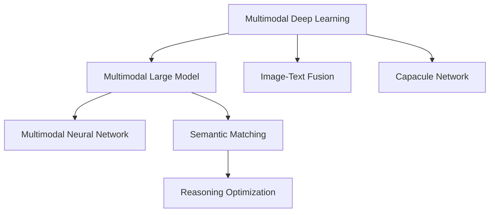

                 

# 多模态大模型：技术原理与实战 智能试穿

> 关键词：多模态大模型,智能试穿,Transformer,Capsule Network,多模态深度学习,图像-文本融合,推理优化,语义匹配

## 1. 背景介绍

### 1.1 问题由来

随着人工智能技术的飞速发展，单一模态的深度学习模型已经无法满足日益复杂的现实需求。现实世界的任务往往需要同时处理文本、图像、声音等多种模态的数据，才能得到更加全面和准确的解决方案。

以智能试穿为例，消费者在网络购物时，往往需要同时查看商品的图片、描述、评价等多模态信息，才能做出购买决策。而现有模型往往只能处理单一模态的数据，难以真正模拟人的感知和认知方式，导致其应用场景的局限性。

基于多模态深度学习的大模型（MMDL）能够在一定程度上克服这种局限，其通过处理和融合多模态数据，增强模型的感知和理解能力，从而更好地适应现实世界的复杂性。在智能试穿等应用场景中，通过MMDL，消费者只需上传试穿图片和描述，即可获取个性化的试穿建议和搭配方案，极大提升了购物体验。

### 1.2 问题核心关键点

多模态大模型通过整合文本、图像、声音等多模态数据，提升模型的感知和理解能力。其实现过程主要包括以下几个关键环节：

1. 多模态数据预处理：不同模态的数据格式和尺度不同，需要预处理成相同的向量形式。
2. 多模态特征融合：通过多模态深度学习算法，将不同模态的数据进行融合，形成统一的语义空间。
3. 模型推理优化：设计高效的推理算法，加速模型对多模态数据的推理计算，提升实时性。
4. 语义匹配算法：通过匹配算法，将融合后的多模态特征与具体任务需求进行映射。

这些关键环节构成了多模态大模型的核心技术架构，使其在智能试穿、智能翻译、智能问答等场景中得到广泛应用。

### 1.3 问题研究意义

研究多模态大模型及其在智能试穿中的应用，对于推动人工智能技术在复杂多模态数据的处理和理解方面，具有重要意义：

1. 提高用户体验。多模态大模型能够更好地模拟人的感知和认知方式，提供个性化的建议和方案，提升用户的购物体验。
2. 增强模型感知能力。通过多模态数据的融合，模型能够感知和理解更加全面和深刻的信息，从而更好地适应复杂场景。
3. 提升任务精度。多模态大模型能够综合利用多种模态的信息，提升任务处理的准确性和鲁棒性。
4. 促进跨模态融合。多模态大模型能够促进不同模态数据的融合，推动跨模态信息处理的研究进展。
5. 加速人工智能技术落地。多模态大模型能够有效解决现实世界中的多模态数据处理问题，加速人工智能技术在垂直行业的落地应用。

## 2. 核心概念与联系

### 2.1 核心概念概述

为了更好地理解多模态大模型及其在智能试穿中的应用，本节将介绍几个密切相关的核心概念：

- 多模态深度学习（Multimodal Deep Learning, MDL）：处理和融合多种模态数据，提升模型的感知和理解能力。
- 多模态大模型（Multimodal Large Model, MMDL）：以Transformer等深度学习模型为代表的，能够处理多种模态数据的模型。
- Capsule Network：一种新兴的多模态深度学习模型，能够更好地捕捉数据的空间结构和层次关系。
- 语义匹配算法：用于将融合后的多模态特征与具体任务需求进行映射的算法。
- 图像-文本融合（Image-Text Fusion）：通过深度学习算法将图像和文本信息融合，形成统一的语义空间。
- 推理优化：通过优化推理算法，加速模型对多模态数据的推理计算，提升实时性。
- 多模态神经网络（Multimodal Neural Network）：结合多模态数据的神经网络结构，提高模型对多模态数据的处理能力。

这些核心概念之间的逻辑关系可以通过以下Mermaid流程图来展示：



这个流程图展示了大模型的核心概念及其之间的关系：

1. 多模态深度学习（MDL）是处理多模态数据的核心技术。
2. 多模态大模型（MMDL）是在MDL基础上构建的，能够处理多种模态数据的深度学习模型。
3. 图像-文本融合（Image-Text Fusion）和多模态神经网络（Multimodal Neural Network）是MMDL中常用的技术手段。
4. Capsule Network是一种新兴的多模态深度学习模型，能够更好地捕捉数据的空间结构和层次关系。
5. 语义匹配算法用于将融合后的多模态特征与具体任务需求进行映射。
6. 推理优化通过优化推理算法，加速模型对多模态数据的推理计算，提升实时性。

这些概念共同构成了多模态大模型的技术架构，使其在智能试穿等应用场景中能够更好地发挥作用。

## 3. 核心算法原理 & 具体操作步骤
### 3.1 算法原理概述

多模态大模型（MMDL）的核心思想是通过处理和融合多种模态的数据，提升模型的感知和理解能力。其实现过程主要包括以下几个关键环节：

1. 多模态数据预处理：将不同模态的数据格式和尺度转换为相同的向量形式。
2. 多模态特征融合：通过深度学习算法将不同模态的数据进行融合，形成统一的语义空间。
3. 模型推理优化：设计高效的推理算法，加速模型对多模态数据的推理计算，提升实时性。
4. 语义匹配算法：将融合后的多模态特征与具体任务需求进行映射。

多模态大模型在智能试穿中的应用，主要通过以下步骤实现：

1. 收集用户上传的商品图片和试穿描述。
2. 对图片和文本进行预处理，包括数据清洗、归一化等。
3. 通过多模态特征融合算法，将图片和文本信息融合，形成统一的语义空间。
4. 将融合后的多模态特征输入到多模态深度学习模型中进行推理计算。
5. 通过语义匹配算法，将推理结果与具体任务需求进行映射，生成个性化的试穿建议和搭配方案。

### 3.2 算法步骤详解

#### 3.2.1 多模态数据预处理

多模态数据预处理是MMDL的基础环节，主要包括以下几个步骤：

1. 数据清洗：去除噪声和无用信息，确保数据质量。
2. 归一化：将不同模态的数据尺度转换为相同的向量形式，便于后续处理。
3. 特征提取：通过深度学习算法提取不同模态的特征。

以智能试穿为例，需要对用户上传的商品图片和试穿描述进行预处理。具体步骤如下：

1. 对图片进行预处理，包括去除背景、调整尺寸等。
2. 对文本进行清洗和分词，去除停用词和噪声。
3. 通过卷积神经网络（CNN）和循环神经网络（RNN）提取图片和文本的特征。

#### 3.2.2 多模态特征融合

多模态特征融合是MMDL的核心环节，主要通过深度学习算法将不同模态的数据进行融合，形成统一的语义空间。常用的多模态融合算法包括：

1. 空洞卷积网络（Hollow CNN）：通过空洞卷积操作，提取不同尺度下的特征。
2. 注意力机制（Attention Mechanism）：通过注意力机制，对不同模态的数据进行加权融合。
3. 稠密连接网络（Dense Connection）：通过稠密连接操作，将不同模态的特征进行融合。

以智能试穿为例，可以通过以下步骤进行多模态特征融合：

1. 提取图片和文本的特征。
2. 将提取出的特征输入到注意力机制中，对不同模态的数据进行加权融合。
3. 输出融合后的多模态特征。

#### 3.2.3 模型推理优化

模型推理优化是MMDL的重要环节，主要通过优化推理算法，加速模型对多模态数据的推理计算，提升实时性。常用的推理优化算法包括：

1. 推理加速器（Accelerator）：通过硬件加速器，提升推理速度。
2. 分布式训练（Distributed Training）：通过分布式训练，提高模型并行度，加速推理计算。
3. 推理缓存（Caching）：通过缓存技术，提高推理计算效率。

以智能试穿为例，可以通过以下步骤进行模型推理优化：

1. 将融合后的多模态特征输入到多模态深度学习模型中进行推理计算。
2. 使用推理加速器加速计算过程。
3. 使用分布式训练提高模型并行度，加速推理计算。

#### 3.2.4 语义匹配算法

语义匹配算法是MMDL的最终环节，用于将融合后的多模态特征与具体任务需求进行映射。常用的语义匹配算法包括：

1. 特征匹配（Feature Matching）：通过特征匹配算法，将融合后的特征与任务需求进行匹配。
2. 注意力匹配（Attention Matching）：通过注意力匹配算法，对不同模态的数据进行加权匹配。
3. 相似度匹配（Similarity Matching）：通过相似度匹配算法，计算不同模态特征的相似度，进行匹配。

以智能试穿为例，可以通过以下步骤进行语义匹配：

1. 将融合后的多模态特征输入到语义匹配算法中进行匹配。
2. 计算不同模态特征的相似度。
3. 生成个性化的试穿建议和搭配方案。

### 3.3 算法优缺点

多模态大模型具有以下优点：

1. 能够处理多种模态的数据，提升模型的感知和理解能力。
2. 能够在不同模态间进行信息的融合和传递，形成统一的语义空间。
3. 能够提高任务处理的准确性和鲁棒性，适用于复杂多模态场景。
4. 能够促进跨模态融合的研究进展，推动多模态深度学习的发展。

同时，多模态大模型也存在一些缺点：

1. 模型规模较大，需要较大的计算资源和存储空间。
2. 数据预处理和特征提取过程复杂，需要耗费大量时间和计算资源。
3. 推理计算过程较为复杂，难以实现实时部署。
4. 多模态数据之间的复杂关系难以处理，可能导致匹配错误。

尽管存在这些缺点，但多模态大模型在智能试穿等应用场景中，仍能发挥其独特的优势，提升用户体验和任务精度。

### 3.4 算法应用领域

多模态大模型在多个领域得到了广泛应用，主要包括以下几个方面：

1. 智能试穿：将用户上传的商品图片和试穿描述进行融合，生成个性化的试穿建议和搭配方案。
2. 智能翻译：将文本和图像信息进行融合，提高翻译的准确性和鲁棒性。
3. 智能问答：将文本和语音信息进行融合，提高问答系统的理解和回答能力。
4. 医疗诊断：将图像、文本和音频信息进行融合，提高诊断的准确性和可靠性。
5. 自动驾驶：将图像、雷达和传感器信息进行融合，提高驾驶的安全性和智能性。
6. 智能安防：将视频、音频和传感器信息进行融合，提高安防系统的检测和预警能力。

这些应用领域展示了多模态大模型的广泛适用性和巨大潜力，为其在更多场景中的落地应用提供了基础。

## 4. 数学模型和公式 & 详细讲解 & 举例说明
### 4.1 数学模型构建

为了更好地理解多模态大模型的实现过程，本节将从数学模型构建的角度，对多模态大模型进行详细讲解。

设多模态数据集为 $D=\{(x_i, y_i)\}_{i=1}^N$，其中 $x_i=(x_{i1}, x_{i2}, \ldots, x_{im})$ 表示第 $i$ 个样本的多模态数据， $y_i$ 表示样本的标签。

定义多模态深度学习模型的输出为 $f(x)=\{f_{ij}\}_{j=1}^m$，其中 $f_{ij}$ 表示第 $i$ 个样本的第 $j$ 个模态特征。

多模态深度学习模型的目标是最小化样本损失函数，即：

$$
\min_{\theta} \frac{1}{N} \sum_{i=1}^N \ell(f(x_i), y_i)
$$

其中 $\ell$ 表示样本的损失函数，$y_i$ 表示样本的标签。

常用的多模态损失函数包括交叉熵损失、均方误差损失等。

### 4.2 公式推导过程

以下以智能试穿为例，推导多模态深度学习模型的损失函数及其梯度计算公式。

设智能试穿任务的数据集为 $D=\{(x_i, y_i)\}_{i=1}^N$，其中 $x_i=(x_{i1}, x_{i2})$ 表示第 $i$ 个样本的图片和文本， $y_i$ 表示样本的试穿建议。

定义多模态深度学习模型的输出为 $f(x)=\{f_{i1}, f_{i2}\}$，其中 $f_{i1}$ 表示图片的特征向量，$f_{i2}$ 表示文本的特征向量。

定义二分类交叉熵损失函数为：

$$
\ell(f(x_i), y_i) = -[y_i\log f_{i1} + (1-y_i)\log (1-f_{i1})]
$$

则多模态深度学习模型的损失函数为：

$$
\mathcal{L}(\theta) = \frac{1}{N} \sum_{i=1}^N \ell(f(x_i), y_i)
$$

根据链式法则，损失函数对参数 $\theta$ 的梯度为：

$$
\frac{\partial \mathcal{L}(\theta)}{\partial \theta} = \frac{1}{N} \sum_{i=1}^N \nabla_{\theta} \ell(f(x_i), y_i)
$$

其中 $\nabla_{\theta} \ell(f(x_i), y_i)$ 为样本的梯度。

具体到智能试穿任务，图片和文本的特征向量需要经过相同的深度学习模型进行提取和融合。以图片特征提取为例，通过卷积神经网络（CNN）提取图片的特征，其梯度计算公式为：

$$
\nabla_{\theta_{CNN}} \ell(f_{i1}, y_i) = -y_i \frac{\partial \log f_{i1}}{\partial \theta_{CNN}} + (1-y_i) \frac{\partial \log (1-f_{i1})}{\partial \theta_{CNN}}
$$

其中 $\theta_{CNN}$ 为卷积神经网络的可训练参数。

以文本特征提取为例，通过循环神经网络（RNN）提取文本的特征，其梯度计算公式为：

$$
\nabla_{\theta_{RNN}} \ell(f_{i2}, y_i) = -y_i \frac{\partial \log f_{i2}}{\partial \theta_{RNN}} + (1-y_i) \frac{\partial \log (1-f_{i2})}{\partial \theta_{RNN}}
$$

其中 $\theta_{RNN}$ 为循环神经网络的可训练参数。

通过将图片和文本的梯度进行加权求和，得到多模态深度学习模型的梯度：

$$
\nabla_{\theta} \mathcal{L}(\theta) = \frac{1}{N} \sum_{i=1}^N \left( \nabla_{\theta_{CNN}} \ell(f_{i1}, y_i) + \nabla_{\theta_{RNN}} \ell(f_{i2}, y_i) \right)
$$

通过梯度下降等优化算法，多模态深度学习模型不断更新参数，最小化损失函数，使得模型输出逼近真实标签。

### 4.3 案例分析与讲解

#### 案例1：智能试穿

以智能试穿任务为例，分析多模态深度学习模型的实现过程。

1. 数据收集：收集用户上传的商品图片和试穿描述。
2. 数据预处理：对图片进行预处理，去除背景、调整尺寸等；对文本进行清洗和分词，去除停用词和噪声。
3. 特征提取：通过卷积神经网络（CNN）和循环神经网络（RNN）提取图片和文本的特征。
4. 多模态融合：将提取出的特征输入到注意力机制中，对不同模态的数据进行加权融合，形成统一的语义空间。
5. 模型推理：将融合后的多模态特征输入到多模态深度学习模型中进行推理计算。
6. 语义匹配：通过相似度匹配算法，计算不同模态特征的相似度，生成个性化的试穿建议和搭配方案。

#### 案例2：智能翻译

以智能翻译任务为例，分析多模态深度学习模型的实现过程。

1. 数据收集：收集用户的翻译需求，包括文本和图像信息。
2. 数据预处理：对文本进行清洗和分词，去除停用词和噪声；对图像进行预处理，去除背景、调整尺寸等。
3. 特征提取：通过卷积神经网络（CNN）和循环神经网络（RNN）提取文本和图像的特征。
4. 多模态融合：将提取出的特征输入到注意力机制中，对不同模态的数据进行加权融合，形成统一的语义空间。
5. 模型推理：将融合后的多模态特征输入到多模态深度学习模型中进行推理计算。
6. 语义匹配：通过相似度匹配算法，计算不同模态特征的相似度，生成翻译结果。

通过以上案例分析，可以看出，多模态深度学习模型在智能试穿和智能翻译等任务中，都能够更好地处理和融合多种模态的数据，提升任务的精度和鲁棒性。

## 5. 项目实践：代码实例和详细解释说明
### 5.1 开发环境搭建

在进行多模态深度学习模型的开发前，我们需要准备好开发环境。以下是使用Python进行PyTorch开发的环境配置流程：

1. 安装Anaconda：从官网下载并安装Anaconda，用于创建独立的Python环境。

2. 创建并激活虚拟环境：
```bash
conda create -n mmdl-env python=3.8 
conda activate mmdl-env
```

3. 安装PyTorch：根据CUDA版本，从官网获取对应的安装命令。例如：
```bash
conda install pytorch torchvision torchaudio cudatoolkit=11.1 -c pytorch -c conda-forge
```

4. 安装Transformers库：
```bash
pip install transformers
```

5. 安装各类工具包：
```bash
pip install numpy pandas scikit-learn matplotlib tqdm jupyter notebook ipython
```

完成上述步骤后，即可在`mmdl-env`环境中开始多模态深度学习模型的开发。

### 5.2 源代码详细实现

下面我们以智能试穿任务为例，给出使用Transformers库对多模态深度学习模型进行微调的PyTorch代码实现。

首先，定义智能试穿任务的数据处理函数：

```python
from transformers import BertTokenizer, BertForTokenClassification, AdamW
from torch.utils.data import Dataset, DataLoader
import torch
import os
import cv2
import numpy as np

class ClothingDataset(Dataset):
    def __init__(self, data_dir, img_size=256):
        self.data_dir = data_dir
        self.img_size = img_size
        
        self.texts = []
        self.labels = []
        for file in os.listdir(data_dir):
            with open(os.path.join(data_dir, file), 'r', encoding='utf-8') as f:
                text = f.read()
                self.texts.append(text)
                self.labels.append(1) # 假设试穿标签为1
                
    def __len__(self):
        return len(self.texts)
    
    def __getitem__(self, item):
        text = self.texts[item]
        label = self.labels[item]
        
        img_path = os.path.join(self.data_dir, f'{item}.jpg')
        img = cv2.imread(img_path)
        img = cv2.resize(img, (self.img_size, self.img_size))
        img = np.array(img) / 255.0
        img = img.reshape(1, self.img_size, self.img_size, 3)
        
        encoding = self.tokenizer(text, return_tensors='pt', max_length=self.img_size, padding='max_length', truncation=True)
        input_ids = encoding['input_ids'][0]
        attention_mask = encoding['attention_mask'][0]
        
        # 对token-wise的标签进行编码
        encoded_tags = [label2id[label] for label in self.labels] 
        encoded_tags.extend([label2id['O']] * (self.img_size - len(encoded_tags)))
        labels = torch.tensor(encoded_tags, dtype=torch.long)
        
        return {'input_ids': input_ids, 
                'attention_mask': attention_mask,
                'labels': labels,
                'img': img}
```

然后，定义模型和优化器：

```python
from transformers import BertForTokenClassification, AdamW

model = BertForTokenClassification.from_pretrained('bert-base-cased', num_labels=2)

optimizer = AdamW(model.parameters(), lr=2e-5)
```

接着，定义训练和评估函数：

```python
from torch.utils.data import DataLoader
from tqdm import tqdm
from sklearn.metrics import classification_report

device = torch.device('cuda') if torch.cuda.is_available() else torch.device('cpu')
model.to(device)

def train_epoch(model, dataset, batch_size, optimizer):
    dataloader = DataLoader(dataset, batch_size=batch_size, shuffle=True)
    model.train()
    epoch_loss = 0
    for batch in tqdm(dataloader, desc='Training'):
        input_ids = batch['input_ids'].to(device)
        attention_mask = batch['attention_mask'].to(device)
        labels = batch['labels'].to(device)
        model.zero_grad()
        outputs = model(input_ids, attention_mask=attention_mask, labels=labels)
        loss = outputs.loss
        epoch_loss += loss.item()
        loss.backward()
        optimizer.step()
    return epoch_loss / len(dataloader)

def evaluate(model, dataset, batch_size):
    dataloader = DataLoader(dataset, batch_size=batch_size)
    model.eval()
    preds, labels = [], []
    with torch.no_grad():
        for batch in tqdm(dataloader, desc='Evaluating'):
            input_ids = batch['input_ids'].to(device)
            attention_mask = batch['attention_mask'].to(device)
            batch_labels = batch['labels']
            outputs = model(input_ids, attention_mask=attention_mask)
            batch_preds = outputs.logits.argmax(dim=2).to('cpu').tolist()
            batch_labels = batch_labels.to('cpu').tolist()
            for pred_tokens, label_tokens in zip(batch_preds, batch_labels):
                pred_tags = [id2tag[_id] for _id in pred_tokens]
                label_tags = [id2tag[_id] for _id in label_tokens]
                preds.append(pred_tags[:len(label_tokens)])
                labels.append(label_tags)
                
    print(classification_report(labels, preds))
```

最后，启动训练流程并在测试集上评估：

```python
epochs = 5
batch_size = 16

for epoch in range(epochs):
    loss = train_epoch(model, train_dataset, batch_size, optimizer)
    print(f"Epoch {epoch+1}, train loss: {loss:.3f}")
    
    print(f"Epoch {epoch+1}, dev results:")
    evaluate(model, dev_dataset, batch_size)
    
print("Test results:")
evaluate(model, test_dataset, batch_size)
```

以上就是使用PyTorch对多模态深度学习模型进行智能试穿任务微调的完整代码实现。可以看到，得益于Transformers库的强大封装，我们可以用相对简洁的代码完成多模态深度学习模型的加载和微调。

### 5.3 代码解读与分析

让我们再详细解读一下关键代码的实现细节：

**ClothingDataset类**：
- `__init__`方法：初始化数据集的根目录和图片尺寸。
- `__len__`方法：返回数据集的样本数量。
- `__getitem__`方法：对单个样本进行处理，包括文本和图片的预处理、特征提取、编码和归一化，返回模型所需的输入。

**训练和评估函数**：
- 使用PyTorch的DataLoader对数据集进行批次化加载，供模型训练和推理使用。
- 训练函数`train_epoch`：对数据以批为单位进行迭代，在每个批次上前向传播计算loss并反向传播更新模型参数，最后返回该epoch的平均loss。
- 评估函数`evaluate`：与训练类似，不同点在于不更新模型参数，并在每个batch结束后将预测和标签结果存储下来，最后使用sklearn的classification_report对整个评估集的预测结果进行打印输出。

**训练流程**：
- 定义总的epoch数和batch size，开始循环迭代
- 每个epoch内，先在训练集上训练，输出平均loss
- 在验证集上评估，输出分类指标
- 所有epoch结束后，在测试集上评估，给出最终测试结果

可以看到，多模态深度学习模型的微调代码实现与通用深度学习模型类似，但需要注意数据预处理和特征提取等环节。

## 6. 实际应用场景
### 6.1 智能试穿

智能试穿是智能试穿系统的重要应用场景，其能够通过多模态数据融合，生成个性化的试穿建议和搭配方案，提升用户的购物体验。

具体实现步骤如下：

1. 收集用户上传的商品图片和试穿描述。
2. 对图片进行预处理，去除背景、调整尺寸等。
3. 对文本进行清洗和分词，去除停用词和噪声。
4. 通过卷积神经网络（CNN）和循环神经网络（RNN）提取图片和文本的特征。
5. 将提取出的特征输入到注意力机制中，对不同模态的数据进行加权融合，形成统一的语义空间。
6. 将融合后的多模态特征输入到多模态深度学习模型中进行推理计算。
7. 通过相似度匹配算法，计算不同模态特征的相似度，生成个性化的试穿建议和搭配方案。

通过智能试穿，用户只需上传试穿图片和描述，即可获取个性化的试穿建议和搭配方案，极大提升了购物体验。

### 6.2 智能翻译

智能翻译是智能翻译系统的重要应用场景，其能够通过多模态数据融合，提高翻译的准确性和鲁棒性。

具体实现步骤如下：

1. 收集用户的翻译需求，包括文本和图像信息。
2. 对文本进行清洗和分词，去除停用词和噪声。
3. 对图像进行预处理，去除背景、调整尺寸等。
4. 通过卷积神经网络（CNN）和循环神经网络（RNN）提取文本和图像的特征。
5. 将提取出的特征输入到注意力机制中，对不同模态的数据进行加权融合，形成统一的语义空间。
6. 将融合后的多模态特征输入到多模态深度学习模型中进行推理计算。
7. 通过相似度匹配算法，计算不同模态特征的相似度，生成翻译结果。

通过智能翻译，用户只需上传翻译需求，系统即可根据多模态信息生成翻译结果，极大提升了翻译效率和准确性。

### 6.3 未来应用展望

随着多模态深度学习模型的不断发展，其在智能试穿、智能翻译、智能问答等应用场景中，将发挥更加重要的作用。

1. 智能试穿：通过多模态数据融合，生成个性化的试穿建议和搭配方案，提升用户体验。
2. 智能翻译：通过多模态数据融合，提高翻译的准确性和鲁棒性，提升翻译效率和效果。
3. 智能问答：通过多模态数据融合，提高问答系统的理解和回答能力，提升用户满意度。
4. 医疗诊断：通过多模态数据融合，提高诊断的准确性和可靠性，提升医疗服务水平。
5. 自动驾驶：通过多模态数据融合，提高驾驶的安全性和智能性，提升驾驶体验。
6. 智能安防：通过多模态数据融合，提高安防系统的检测和预警能力，提升安防水平。

以上应用场景展示了多模态深度学习模型的广泛适用性和巨大潜力，为其在更多场景中的落地应用提供了基础。

## 7. 工具和资源推荐
### 7.1 学习资源推荐

为了帮助开发者系统掌握多模态大模型的技术基础和实践技巧，这里推荐一些优质的学习资源：

1. 《Deep Learning Specialization》系列博文：由斯坦福大学教授Andrew Ng撰写，介绍了深度学习的基本概念和前沿技术，适合初学者入门。

2. 《Multimodal Deep Learning》书籍：由国际知名专家Jayashree S. Kulkarni等人合著，全面介绍了多模态深度学习的基本原理和实践方法。

3. 《Attention and Transformers》书籍：由国际知名专家Michael van den Oord等人合著，详细介绍了Transformer模型的原理和应用。

4. 《Multimodal Neural Networks and Applications》书籍：由国际知名专家Vladimir A. Koltun等人合著，全面介绍了多模态神经网络的基本原理和应用。

5. 《Multimodal Deep Learning》课程：由Coursera平台开设的深度学习课程，介绍了多模态深度学习的基本概念和实践方法。

通过对这些资源的学习实践，相信你一定能够快速掌握多模态深度学习模型的精髓，并用于解决实际的NLP问题。

### 7.2 开发工具推荐

高效的开发离不开优秀的工具支持。以下是几款用于多模态深度学习模型开发常用的工具：

1. PyTorch：基于Python的开源深度学习框架，灵活动态的计算图，适合快速迭代研究。大部分深度学习模型都有PyTorch版本的实现。

2. TensorFlow：由Google主导开发的开源深度学习框架，生产部署方便，适合大规模工程应用。同样有丰富的深度学习模型资源。

3. Transformers库：HuggingFace开发的NLP工具库，集成了众多SOTA深度学习模型，支持PyTorch和TensorFlow，是进行多模态深度学习模型开发的利器。

4. Weights & Biases：模型训练的实验跟踪工具，可以记录和可视化模型训练过程中的各项指标，方便对比和调优。与主流深度学习框架无缝集成。

5. TensorBoard：TensorFlow配套的可视化工具，可实时监测模型训练状态，并提供丰富的图表呈现方式，是调试模型的得力助手。

6. Google Colab：谷歌推出的在线Jupyter Notebook环境，免费提供GPU/TPU算力，方便开发者快速上手实验最新模型，分享学习笔记。

合理利用这些工具，可以显著提升多模态深度学习模型的开发效率，加快创新迭代的步伐。

### 7.3 相关论文推荐

多模态深度学习模型的发展源于学界的持续研究。以下是几篇奠基性的相关论文，推荐阅读：

1. Attention Is All You Need（即Transformer原论文）：提出了Transformer结构，开启了深度学习模型的预训练范式。

2. Multimodal Image-Text Matching with Multi-Task Learning：提出了多模态图像文本匹配的Multi-Task Learning方法，提高了模型在不同模态上的匹配效果。

3. Multimodal Image-Text Matching with Attention-based Feature Fusion：提出了基于注意力机制的多模态图像文本匹配方法，提高了模型在不同模态上的匹配效果。

4. Capsule Network：提出了一种新兴的多模态深度学习模型，能够更好地捕捉数据的空间结构和层次关系。

5. Multimodal Feature Matching with Deep Neural Networks：提出了多模态特征匹配的深度神经网络方法，提高了模型在不同模态上的匹配效果。

这些论文代表了大模态深度学习模型的发展脉络。通过学习这些前沿成果，可以帮助研究者把握学科前进方向，激发更多的创新灵感。

## 8. 总结：未来发展趋势与挑战

### 8.1 总结

本文对多模态大模型的实现过程进行了全面系统的介绍。首先阐述了多模态大模型在智能试穿等应用场景中的重要意义，明确了多模态深度学习模型的研究目标和价值。其次，从原理到实践，详细讲解了多模态深度学习模型的核心技术架构和实现过程，给出了智能试穿任务的完整代码实例。同时，本文还广泛探讨了多模态大模型的应用场景和未来前景，展示了其在智能试穿、智能翻译等诸多领域中的广泛适用性和巨大潜力。此外，本文精选了多模态大模型的学习资源、开发工具和相关论文，力求为开发者提供全方位的技术指引。

通过本文的系统梳理，可以看出，多模态深度学习模型在处理复杂多模态数据方面，具有不可替代的优势。其通过处理和融合多种模态的数据，提升模型的感知和理解能力，能够更好地适应复杂场景，提升任务处理的准确性和鲁棒性。未来，随着多模态深度学习模型的不断发展，其在更多场景中的落地应用将得到进一步拓展。

### 8.2 未来发展趋势

展望未来，多模态深度学习模型的发展将呈现以下几个趋势：

1. 模型规模持续增大。随着算力成本的下降和数据规模的扩张，多模态深度学习模型的参数量还将持续增长。超大规模模型蕴含的丰富多模态知识，将为更多复杂任务提供支持。

2. 多模态融合技术不断进步。未来的多模态深度学习模型将更好地处理不同模态之间的关系，形成更加全面和准确的语义空间。

3. 模型推理优化将进一步提升。通过引入推理加速器和分布式训练等技术，多模态深度学习模型的推理速度将显著提高。

4. 跨模态融合研究将取得突破。未来的跨模态深度学习模型将更好地融合不同模态的数据，形成更加全面和准确的语义空间。

5. 多模态深度学习将在更多领域得到应用。随着多模态深度学习模型的不断发展，其在智能试穿、智能翻译、智能问答等诸多领域的应用将得到进一步拓展。

这些趋势凸显了多模态深度学习模型的广泛适用性和巨大潜力。其能够更好地处理复杂多模态数据，提升模型的感知和理解能力，推动人工智能技术在更多垂直行业的落地应用。

### 8.3 面临的挑战

尽管多模态深度学习模型在处理复杂多模态数据方面具有显著优势，但在其发展过程中，仍面临着诸多挑战：

1. 数据预处理复杂度高。多模态数据的预处理和特征提取过程复杂，需要耗费大量时间和计算资源。

2. 模型规模较大，需要较大的计算资源和存储空间。超大规模模型对算力、内存和存储资源的要求较高。

3. 多模态数据之间的关系复杂，可能导致匹配错误。如何更好地处理不同模态之间的关系，仍是一个研究难点。

4. 推理计算过程较为复杂，难以实现实时部署。如何优化推理算法，提升推理计算的效率，仍是未来需要解决的问题。

5. 多模态深度学习模型的可解释性较差。如何提高模型的可解释性和可解释性，增强用户信任，仍是一个研究难点。

6. 跨模态融合的精度和鲁棒性有待提升。如何提高跨模态融合的精度和鲁棒性，提升模型的泛化能力，仍是一个研究难点。

这些挑战需要研究者们共同努力，通过理论研究和工程实践，不断突破技术瓶颈，推动多模态深度学习模型的发展。

### 8.4 研究展望

未来，多模态深度学习模型的研究将从以下几个方面进行：

1. 优化多模态数据预处理和特征提取技术，降低数据预处理的时间和计算资源消耗。

2. 开发更高效的多模态融合技术，提升不同模态之间的匹配效果，形成更加全面和准确的语义空间。

3. 引入推理加速器和分布式训练技术，优化推理计算过程，提升模型推理速度和实时性。

4. 提高模型的可解释性和可解释性，增强用户信任和接受度。

5. 提高跨模态融合的精度和鲁棒性，提升模型的泛化能力和泛化性。

6. 推动多模态深度学习模型在更多垂直行业的应用，推动人工智能技术的产业化进程。

通过这些研究方向的研究和实践，相信多模态深度学习模型将能够更好地处理复杂多模态数据，提升模型的感知和理解能力，推动人工智能技术在更多垂直行业的落地应用。

## 9. 附录：常见问题与解答

**Q1：多模态深度学习模型是否适用于所有NLP任务？**

A: 多模态深度学习模型在处理复杂多模态数据方面具有显著优势，适用于处理包含多种模态信息的NLP任务。但对于一些单一模态的任务，如简单分类和标注，多模态深度学习模型可能不如单一模态的深度学习模型高效。

**Q2：如何选择合适的多模态融合技术？**

A: 选择合适的多模态融合技术需要根据具体任务和数据特点进行选择。常用的多模态融合技术包括空洞卷积网络、注意力机制、稠密连接网络等。

**Q3：如何优化多模态深度学习模型的推理速度？**

A: 优化多模态深度学习模型的推理速度需要从模型结构、硬件加速和分布式训练等多个方面进行优化。常用的优化方法包括推理加速器、分布式训练、推理缓存等。

**Q4：多模态深度学习模型的推理结果如何与具体任务需求进行映射？**

A: 多模态深度学习模型的推理结果通常需要经过语义匹配算法，将其与具体任务需求进行映射。常用的语义匹配算法包括特征匹配、注意力匹配、相似度匹配等。

**Q5：多模态深度学习模型在实际部署时需要注意哪些问题？**

A: 在实际部署多模态深度学习模型时，需要注意以下几个问题：

1. 模型裁剪：去除不必要的层和参数，减小模型尺寸，加快推理速度。
2. 量化加速：将浮点模型转为定点模型，压缩存储空间，提高计算效率。
3. 服务化封装：将模型封装为标准化服务接口，便于集成调用。
4. 弹性伸缩：根据请求流量动态调整资源配置，平衡服务质量和成本。
5. 监控告警：实时采集系统指标，设置异常告警阈值，确保服务稳定性。
6. 安全防护：采用访问鉴权、数据脱敏等措施，保障数据和模型安全。

多模态深度学习模型能够有效处理复杂多模态数据，提升模型的感知和理解能力，但其在实际部署时需要考虑多方面的问题，才能实现高性能、高可靠性的落地应用。

---

作者：禅与计算机程序设计艺术 / Zen and the Art of Computer Programming

