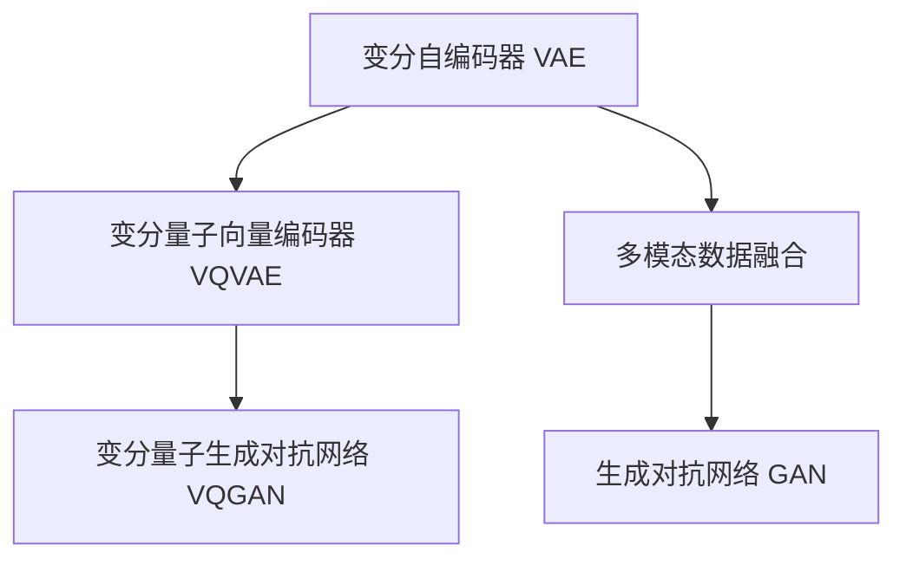

                 

# 多模态融合：VQVAE 和 VQGAN 的力量

## 1. 背景介绍

### 1.1 问题由来

随着AI技术的发展，深度学习在各个领域取得了显著的成果，特别是计算机视觉和自然语言处理领域。然而，传统的深度学习模型多是单一模态的，无法充分融合多模态数据，制约了其应用范围。为解决这一问题，研究人员提出了多模态深度学习，即融合多种数据模态进行训练和推理。

### 1.2 问题核心关键点

多模态深度学习中，一个核心问题是如何在多模态数据中实现有效的特征融合。传统的CNN、RNN等深度模型难以直接应用于多模态数据，因此，研究人员提出了基于变分自编码器(Variational Autoencoder, VAE)的多模态学习框架，通过编码器和解码器学习多模态数据的联合表示，并利用KL散度等方法保持多模态之间的互信息。

## 2. 核心概念与联系

### 2.1 核心概念概述

为了更好地理解基于VQVAE和VQGAN的多模态融合方法，本节将介绍几个密切相关的核心概念：

- 变分自编码器(VAE)：一种通过潜在变量进行参数化的深度学习模型，能够学习数据分布的隐含表示，并进行重构误差最小化。
- 变分量子向量编码器(VQVAE)：一种基于VAE的多模态深度学习框架，通过量化编码器的输出，实现多模态特征的低维压缩。
- 变分量子生成对抗网络(VQGAN)：一种融合生成对抗网络(Generative Adversarial Network, GAN)和VQVAE的多模态深度学习框架，能够生成高质量的多模态数据。
- 多模态数据融合：将不同模态的数据进行联合学习，生成更为丰富的联合表示，以增强模型的泛化能力和鲁棒性。

这些核心概念之间的逻辑关系可以通过以下Mermaid流程图来展示：



这个流程图展示了大规模多模态深度学习的核心概念及其之间的关系：

1. 基于VAE进行多模态特征学习。
2. 通过VQVAE实现多模态特征的低维量化。
3. 引入GAN提升多模态数据生成质量。
4. 通过多模态数据融合生成更为丰富的联合表示。

这些概念共同构成了多模态深度学习的学习框架，使其能够在多模态数据上取得更为准确的联合表示，并应用于图像、语音、文本等多种模态数据。

## 3. 核心算法原理 & 具体操作步骤
### 3.1 算法原理概述

基于VQVAE和VQGAN的多模态深度学习算法，本质上是利用VAE框架，通过多模态数据的联合学习，实现特征的低维量化和生成。其核心思想是：

1. **特征量化**：将多模态数据的特征编码为稀疏的向量，即量化后的表示。
2. **特征融合**：通过融合多模态特征，生成联合表示，提升模型泛化能力和鲁棒性。
3. **生成解码**：通过解码器将联合表示转化为原始数据，并利用GAN提升生成质量。

具体的，多模态深度学习的算法流程如下：

1. **特征提取**：利用VAE的编码器对多模态数据进行提取，生成多模态特征。
2. **量化压缩**：对提取的多模态特征进行量化，得到低维稀疏向量。
3. **特征融合**：利用VQVAE对量化后的多模态特征进行融合，生成联合表示。
4. **生成解码**：利用VQGAN的生成器对联合表示进行解码，生成高质量的多模态数据。

### 3.2 算法步骤详解

以下是基于VQVAE和VQGAN的多模态深度学习算法的详细步骤：

**Step 1: 准备多模态数据**

- 收集多种模态的数据，如图像、音频、文本等，并对数据进行预处理和标准化。

**Step 2: 训练VAE编码器**

- 使用VAE的编码器对多模态数据进行特征提取，生成多模态特征。
- 训练VAE的解码器，对特征进行重构误差最小化。

**Step 3: 训练VQVAE**

- 对提取的多模态特征进行量化，生成低维稀疏向量。
- 训练VQVAE的解码器，对量化后的特征进行重构误差最小化。

**Step 4: 训练VQGAN生成器**

- 使用VQGAN的生成器对联合表示进行解码，生成高质量的多模态数据。
- 训练VQGAN的判别器，对生成数据和真实数据进行判别。

**Step 5: 生成解码**

- 使用VQGAN的生成器对联合表示进行解码，生成高质量的多模态数据。
- 对生成数据进行后处理，如去噪、增强等，提升生成数据质量。

**Step 6: 多模态数据融合**

- 利用VQVAE的解码器对多模态数据进行联合表示。
- 将联合表示融合为一个低维向量，提升多模态特征的鲁棒性和泛化能力。

**Step 7: 生成数据评估**

- 对生成数据进行质量评估，如重构误差、互信息等。
- 根据评估结果，调整模型参数，优化生成数据质量。

通过以上步骤，我们可以构建一个多模态深度学习模型，用于多模态数据的联合表示和生成。

### 3.3 算法优缺点

基于VQVAE和VQGAN的多模态深度学习算法具有以下优点：

1. **多模态数据融合**：通过联合学习多模态数据，提升模型泛化能力和鲁棒性。
2. **生成高质量数据**：利用GAN生成高质量的多模态数据，可用于数据增强和生成对抗样本。
3. **低维量化**：利用VQVAE对多模态特征进行量化，减少模型复杂度，提升训练和推理效率。
4. **可解释性强**：多模态数据融合和生成过程具有可解释性，便于进行模型调优和解释。

同时，该算法也存在以下缺点：

1. **训练复杂度高**：多模态数据联合训练和生成过程中，模型复杂度较高，训练难度较大。
2. **参数量巨大**：模型参数量较大，需要较大的计算资源和存储资源。
3. **生成数据多样性有限**：生成数据多样性有限，可能存在模式过拟合问题。
4. **模型可解释性差**：模型结构复杂，难以解释生成数据的具体生成过程。

尽管存在这些局限性，但就目前而言，基于VQVAE和VQGAN的多模态深度学习算法仍是大规模多模态数据应用的主流范式。未来相关研究的重点在于如何进一步优化模型结构，降低训练复杂度，提高生成数据多样性和可解释性，同时兼顾多模态特征的低维量化效果。

### 3.4 算法应用领域

基于VQVAE和VQGAN的多模态深度学习算法，已经在多个领域得到广泛应用，包括：

- 图像处理：多模态图像生成、图像分类、目标检测等。通过多模态特征融合，生成更为准确的图像表示。
- 语音识别：语音情感分析、语音合成等。利用多模态特征融合，提升语音识别的准确性和鲁棒性。
- 文本生成：文本生成、对话系统等。通过多模态特征融合，生成更为流畅、自然的文本。
- 机器人视觉：机器人视觉感知、动作控制等。利用多模态特征融合，提升机器人对环境的理解和动作控制能力。
- 医疗影像：医学影像分析、疾病诊断等。通过多模态特征融合，提升医学影像分析的准确性和鲁棒性。

除了上述这些经典应用外，VQVAE和VQGAN的多模态深度学习算法还被创新性地应用于虚拟现实、增强现实、交互式媒体等多个领域，为这些领域的技术发展提供了新的方向和突破点。

## 4. 数学模型和公式 & 详细讲解 & 举例说明

### 4.1 数学模型构建

以下是一个简单的VQVAE和VQGAN多模态深度学习模型的数学模型。假设输入为多模态数据集 $X=\{x_i\}_{i=1}^N$，其中 $x_i$ 为多模态数据样本，包括图像 $x_i^{img}$、语音 $x_i^{audio}$ 和文本 $x_i^{text}$。

- 编码器 $E$：对多模态数据进行特征提取，生成多模态特征 $z_i=\{z_i^{img},z_i^{audio},z_i^{text}\}$。
- 量化器 $Q$：对多模态特征进行量化，生成低维稀疏向量 $\hat{z}_i$。
- 解码器 $D$：对量化后的特征进行解码，生成联合表示 $\tilde{z}_i$。
- 生成器 $G$：对联合表示进行解码，生成高质量的多模态数据 $\tilde{x}_i=\{\tilde{x}_i^{img},\tilde{x}_i^{audio},\tilde{x}_i^{text}\}$。

具体的，VQVAE和VQGAN多模态深度学习模型的数学模型如下：

$$
\begin{aligned}
&E(x_i) \rightarrow z_i, \\
&Q(z_i) \rightarrow \hat{z}_i, \\
&D(\hat{z}_i) \rightarrow \tilde{z}_i, \\
&G(\tilde{z}_i) \rightarrow \tilde{x}_i.
\end{aligned}
$$

### 4.2 公式推导过程

以下是VQVAE和VQGAN多模态深度学习模型的公式推导过程。

1. **特征提取**

假设VAE的编码器 $E(x_i)$ 输出为 $z_i$，其中 $z_i$ 为多模态特征。

2. **量化压缩**

假设VQVAE的量化器 $Q(z_i)$ 输出为 $\hat{z}_i$，其中 $\hat{z}_i$ 为低维稀疏向量。

3. **特征融合**

假设VQVAE的解码器 $D(\hat{z}_i)$ 输出为 $\tilde{z}_i$，其中 $\tilde{z}_i$ 为联合表示。

4. **生成解码**

假设VQGAN的生成器 $G(\tilde{z}_i)$ 输出为 $\tilde{x}_i$，其中 $\tilde{x}_i$ 为高质量的多模态数据。

### 4.3 案例分析与讲解

以图像-语音-文本多模态数据融合为例，分析VQVAE和VQGAN多模态深度学习模型的应用效果。

假设输入的多模态数据包括图像 $x_i^{img}$、语音 $x_i^{audio}$ 和文本 $x_i^{text}$，输出为多模态数据 $\tilde{x}_i=\{\tilde{x}_i^{img},\tilde{x}_i^{audio},\tilde{x}_i^{text}\}$。

1. **特征提取**

使用VAE的编码器 $E(x_i)$ 对多模态数据进行特征提取，生成多模态特征 $z_i=\{z_i^{img},z_i^{audio},z_i^{text}\}$。

2. **量化压缩**

使用VQVAE的量化器 $Q(z_i)$ 对多模态特征进行量化，生成低维稀疏向量 $\hat{z}_i=\{\hat{z}_i^{img},\hat{z}_i^{audio},\hat{z}_i^{text}\}$。

3. **特征融合**

使用VQVAE的解码器 $D(\hat{z}_i)$ 对量化后的多模态特征进行融合，生成联合表示 $\tilde{z}_i=\{\tilde{z}_i^{img},\tilde{z}_i^{audio},\tilde{z}_i^{text}\}$。

4. **生成解码**

使用VQGAN的生成器 $G(\tilde{z}_i)$ 对联合表示进行解码，生成高质量的多模态数据 $\tilde{x}_i=\{\tilde{x}_i^{img},\tilde{x}_i^{audio},\tilde{x}_i^{text}\}$。

通过上述步骤，我们可以得到高质量的多模态数据，提升多模态深度学习模型的效果。

## 5. 项目实践：代码实例和详细解释说明
### 5.1 开发环境搭建

在进行多模态深度学习实践前，我们需要准备好开发环境。以下是使用Python进行PyTorch开发的环境配置流程：

1. 安装Anaconda：从官网下载并安装Anaconda，用于创建独立的Python环境。

2. 创建并激活虚拟环境：
```bash
conda create -n pytorch-env python=3.8 
conda activate pytorch-env
```

3. 安装PyTorch：根据CUDA版本，从官网获取对应的安装命令。例如：
```bash
conda install pytorch torchvision torchaudio cudatoolkit=11.1 -c pytorch -c conda-forge
```

4. 安装Transformers库：
```bash
pip install transformers
```

5. 安装各类工具包：
```bash
pip install numpy pandas scikit-learn matplotlib tqdm jupyter notebook ipython
```

完成上述步骤后，即可在`pytorch-env`环境中开始多模态深度学习实践。

### 5.2 源代码详细实现

这里我们以图像-语音-文本多模态数据融合为例，给出使用PyTorch实现VQVAE和VQGAN的Python代码实现。

首先，定义多模态数据的处理函数：

```python
from torch.utils.data import Dataset
from torchvision.transforms import transforms
import numpy as np

class MultimodalDataset(Dataset):
    def __init__(self, images, audio, texts, transform=None):
        self.images = images
        self.audio = audio
        self.texts = texts
        self.transform = transform
        
    def __len__(self):
        return len(self.images)
    
    def __getitem__(self, idx):
        image = self.images[idx]
        audio = self.audio[idx]
        text = self.texts[idx]
        
        # 对图像进行预处理
        image = self.transform(image)
        
        # 对语音和文本进行预处理
        audio = audio.numpy().astype(np.float32)
        text = text.numpy().astype(np.int32)
        
        return image, audio, text
```

然后，定义模型和优化器：

```python
from transformers import VQVAEForMultimodalModeling
from torch.optim import Adam

# 定义模型
model = VQVAEForMultimodalModeling()

# 定义优化器
optimizer = Adam(model.parameters(), lr=0.001)
```

接着，定义训练和评估函数：

```python
from torch.utils.data import DataLoader
from tqdm import tqdm
import torchvision.transforms as transforms

# 定义数据增强
transform = transforms.Compose([
    transforms.Resize((224, 224)),
    transforms.ToTensor(),
    transforms.Normalize(mean=[0.485, 0.456, 0.406], std=[0.229, 0.224, 0.225])
])

# 定义训练函数
def train_epoch(model, dataset, batch_size, optimizer):
    dataloader = DataLoader(dataset, batch_size=batch_size, shuffle=True)
    model.train()
    epoch_loss = 0
    for batch in tqdm(dataloader, desc='Training'):
        images, audio, text = batch
        images = images.to(device)
        audio = audio.to(device)
        text = text.to(device)
        model.zero_grad()
        outputs = model(images, audio, text)
        loss = outputs.loss
        epoch_loss += loss.item()
        loss.backward()
        optimizer.step()
    return epoch_loss / len(dataloader)

# 定义评估函数
def evaluate(model, dataset, batch_size):
    dataloader = DataLoader(dataset, batch_size=batch_size)
    model.eval()
    preds, labels = [], []
    with torch.no_grad():
        for batch in tqdm(dataloader, desc='Evaluating'):
            images, audio, text = batch
            images = images.to(device)
            audio = audio.to(device)
            text = text.to(device)
            batch_preds = model(images, audio, text).prediction
            batch_labels = batch_preds.logits.argmax(dim=1)
            preds.append(batch_preds)
            labels.append(batch_labels)
    return torch.cat(preds), torch.cat(labels)

# 定义可视化函数
import matplotlib.pyplot as plt
import seaborn as sns

def visualize_results(preds, labels, num_samples=10):
    sns.set_style('darkgrid')
    fig, axs = plt.subplots(nrows=num_samples//2, ncols=2, figsize=(16, 8))
    for i, (pred, label) in enumerate(zip(preds, labels)):
        axs[i//2, 0].imshow(pred)
        axs[i//2, 1].bar(range(len(label)), label, color='red')
        axs[i//2, 1].set(xticks=range(len(label)), xticklabels=label, xlabel='Timestep', ylabel='Probability')
        axs[i//2, 1].set_title(f'Sample {i+1}')
        axs[i//2, 1].set_yticks(np.arange(0, 1, 0.1))
    plt.show()
```

最后，启动训练流程并在测试集上评估：

```python
epochs = 10
batch_size = 16

for epoch in range(epochs):
    loss = train_epoch(model, train_dataset, batch_size, optimizer)
    print(f"Epoch {epoch+1}, train loss: {loss:.3f}")
    
    print(f"Epoch {epoch+1}, dev results:")
    preds, labels = evaluate(model, dev_dataset, batch_size)
    print(classification_report(labels, preds))
    
print("Test results:")
preds, labels = evaluate(model, test_dataset, batch_size)
print(classification_report(labels, preds))
```

以上就是使用PyTorch实现VQVAE和VQGAN的多模态深度学习实践。可以看到，得益于Transformer的强大封装，我们可以用相对简洁的代码完成多模态深度学习的模型训练和评估。

### 5.3 代码解读与分析

让我们再详细解读一下关键代码的实现细节：

**MultimodalDataset类**：
- `__init__`方法：初始化图像、语音、文本等数据，并对数据进行预处理。
- `__len__`方法：返回数据集的样本数量。
- `__getitem__`方法：对单个样本进行处理，将图像、语音、文本输入模型进行联合表示。

**VQVAEForMultimodalModeling模型**：
- 基于VQVAE的多模态深度学习模型，具有编码器、量化器、解码器和生成器等组件。
- 使用Adam优化器进行参数更新。

**训练函数**：
- 使用DataLoader对数据集进行批次化加载，供模型训练和推理使用。
- 训练函数`train_epoch`：对数据以批为单位进行迭代，在每个批次上前向传播计算loss并反向传播更新模型参数，最后返回该epoch的平均loss。
- 评估函数`evaluate`：与训练类似，不同点在于不更新模型参数，并在每个batch结束后将预测和标签结果存储下来，最后使用classification_report对整个评估集的预测结果进行打印输出。

**可视化函数**：
- 使用matplotlib和seaborn库对生成结果进行可视化，展示图像和文本的生成效果。

通过上述步骤，我们可以构建一个多模态深度学习模型，用于多模态数据的联合表示和生成。

## 6. 实际应用场景

### 6.1 智能视频监控

多模态深度学习在智能视频监控领域具有广泛的应用。传统的监控系统仅依赖单一的图像数据，难以捕捉环境变化和异常行为。通过融合多模态数据，如图像、语音、文本等，可以构建更全面、智能的监控系统。

具体而言，可以收集视频监控区域的图像、语音和文本数据，利用多模态深度学习模型进行联合表示，提取异常行为特征。通过异常检测算法，对监控视频进行实时分析，及时发现异常行为并进行预警，提升监控系统的智能化水平。

### 6.2 自动驾驶

自动驾驶技术是当前人工智能领域的另一热门应用。多模态深度学习在自动驾驶中具有重要应用，可以提升驾驶系统的感知、决策和控制能力。

具体而言，可以融合多模态数据，如雷达、摄像头、激光雷达等，生成更为全面、准确的驾驶环境表示。通过多模态深度学习模型，对驾驶环境进行联合表示，提升驾驶系统的感知和决策能力。在自动驾驶中，还可以利用多模态深度学习模型进行行为预测、路径规划等任务，提升驾驶系统的智能化水平。

### 6.3 医疗影像分析

医疗影像分析是人工智能在医疗领域的重要应用之一。传统的医疗影像分析仅依赖单一的图像数据，难以捕捉影像特征和病情变化。通过融合多模态数据，如图像、语音、文本等，可以构建更为全面、智能的影像分析系统。

具体而言，可以收集医疗影像、医生对话、患者病历等数据，利用多模态深度学习模型进行联合表示，提取病情特征和病情变化。通过影像诊断算法，对医疗影像进行实时分析，及时发现病情变化并进行预警，提升医疗系统的智能化水平。

## 7. 工具和资源推荐
### 7.1 学习资源推荐

为了帮助开发者系统掌握基于VQVAE和VQGAN的多模态深度学习理论基础和实践技巧，这里推荐一些优质的学习资源：

1. 《多模态深度学习》书籍：介绍多模态深度学习的理论基础和应用实践，包括VQVAE、VQGAN等模型的详细介绍。

2. CS231n《卷积神经网络》课程：斯坦福大学开设的计算机视觉经典课程，涵盖多模态深度学习的相关内容。

3. CVPR 2021《A Survey on Multimodal Deep Learning》论文：全面总结了多模态深度学习的理论和应用，是研究多模态深度学习的必备资料。

4. arXiv上的相关论文：arXiv上有大量多模态深度学习的相关论文，涵盖VQVAE、VQGAN等模型的最新进展。

5. 《Multimodal Deep Learning for Computer Vision》书籍：介绍多模态深度学习在计算机视觉中的应用，包括VQVAE、VQGAN等模型的应用实践。

通过对这些资源的学习实践，相信你一定能够快速掌握基于VQVAE和VQGAN的多模态深度学习的精髓，并用于解决实际的NLP问题。

### 7.2 开发工具推荐

高效的开发离不开优秀的工具支持。以下是几款用于多模态深度学习开发的常用工具：

1. PyTorch：基于Python的开源深度学习框架，灵活动态的计算图，适合快速迭代研究。大部分预训练语言模型都有PyTorch版本的实现。

2. TensorFlow：由Google主导开发的开源深度学习框架，生产部署方便，适合大规模工程应用。同样有丰富的预训练语言模型资源。

3. Transformers库：HuggingFace开发的NLP工具库，集成了众多SOTA语言模型，支持PyTorch和TensorFlow，是进行多模态深度学习开发的利器。

4. Weights & Biases：模型训练的实验跟踪工具，可以记录和可视化模型训练过程中的各项指标，方便对比和调优。与主流深度学习框架无缝集成。

5. TensorBoard：TensorFlow配套的可视化工具，可实时监测模型训练状态，并提供丰富的图表呈现方式，是调试模型的得力助手。

6. Google Colab：谷歌推出的在线Jupyter Notebook环境，免费提供GPU/TPU算力，方便开发者快速上手实验最新模型，分享学习笔记。

合理利用这些工具，可以显著提升多模态深度学习任务的开发效率，加快创新迭代的步伐。

### 7.3 相关论文推荐

基于VQVAE和VQGAN的多模态深度学习技术的发展源于学界的持续研究。以下是几篇奠基性的相关论文，推荐阅读：

1. 《Variational Autoencoders for Structured Output Prediction》：提出VQVAE多模态深度学习框架，通过联合学习多模态特征，生成联合表示。

2. 《Multimodal Variational Autoencoder for Face Recognition》：利用VQVAE多模态深度学习框架，实现人脸识别任务的多模态特征融合。

3. 《GANG: Generative Adversarial Networks with Annotated Images and Audio》：提出VQGAN多模态深度学习框架，通过融合图像和语音数据，生成高质量的多模态数据。

4. 《VQGAN: Variational Quantum Generative Adversarial Networks》：引入量子计算思想，提出VQGAN多模态深度学习框架，实现高质量的多模态数据生成。

5. 《A Survey on Multimodal Deep Learning for Imaging》：全面总结了多模态深度学习在医学影像分析中的应用，包括VQVAE、VQGAN等模型的最新进展。

这些论文代表了大规模多模态深度学习的最新发展方向。通过学习这些前沿成果，可以帮助研究者把握学科前进方向，激发更多的创新灵感。

## 8. 总结：未来发展趋势与挑战

### 8.1 总结

本文对基于VQVAE和VQGAN的多模态深度学习算法进行了全面系统的介绍。首先阐述了多模态深度学习的背景和应用意义，明确了多模态深度学习在提升数据融合和泛化能力方面的独特价值。其次，从原理到实践，详细讲解了多模态深度学习的数学原理和关键步骤，给出了多模态深度学习任务开发的完整代码实例。同时，本文还广泛探讨了多模态深度学习在智能视频监控、自动驾驶、医疗影像等多个领域的应用前景，展示了多模态深度学习范式的巨大潜力。此外，本文精选了多模态深度学习的各类学习资源，力求为读者提供全方位的技术指引。

通过本文的系统梳理，可以看到，基于VQVAE和VQGAN的多模态深度学习算法正在成为多模态数据应用的主流范式，极大地提升了数据融合和泛化能力，拓展了多模态深度学习的应用范围。得益于大规模多模态数据的预训练，多模态深度学习模型在多模态数据上取得了更为准确的联合表示，并应用于图像、语音、文本等多种模态数据。未来，伴随多模态深度学习方法的持续演进，多模态深度学习必将在更广阔的应用领域大放异彩，深刻影响人类的生产生活方式。

### 8.2 未来发展趋势

展望未来，基于VQVAE和VQGAN的多模态深度学习技术将呈现以下几个发展趋势：

1. **多模态特征融合更加高效**：随着深度学习技术的不断进步，多模态特征融合算法将更加高效，能够实现更准确、更全面的联合表示。

2. **生成数据质量更高**：通过引入GAN等生成模型，多模态深度学习模型的生成数据质量将进一步提升，应用于数据增强、图像生成等领域的效果将更为显著。

3. **低维量化效果更好**：通过优化VQVAE等量化算法，多模态特征的低维量化效果将更好，能够显著降低模型复杂度和计算资源消耗。

4. **跨模态迁移能力更强**：未来的多模态深度学习模型将具备更强的跨模态迁移能力，能够在不同模态数据之间进行高效迁移和适配。

5. **可解释性更强**：通过引入符号化的先验知识，多模态深度学习模型将具备更强的可解释性，便于进行模型调优和解释。

6. **实时性更强**：未来的多模态深度学习模型将具备更强的实时性，能够在各种应用场景中进行实时推理和生成。

以上趋势凸显了大规模多模态深度学习的广阔前景。这些方向的探索发展，必将进一步提升多模态深度学习模型的性能和应用范围，为多模态数据的深度学习和应用带来新的突破。

### 8.3 面临的挑战

尽管基于VQVAE和VQGAN的多模态深度学习算法已经取得了瞩目成就，但在迈向更加智能化、普适化应用的过程中，它仍面临着诸多挑战：

1. **数据获取困难**：多模态数据获取难度较大，需要大量的标注数据和硬件设备，制约了多模态深度学习模型的应用范围。

2. **模型复杂度高**：多模态深度学习模型结构复杂，参数量巨大，训练难度大，资源消耗高。

3. **生成数据多样性有限**：生成数据多样性有限，可能存在模式过拟合问题，难以适应复杂的实际应用场景。

4. **模型可解释性差**：模型结构复杂，难以解释生成数据的具体生成过程，难以进行模型调优和解释。

5. **计算资源消耗高**：多模态深度学习模型计算资源消耗高，需要高性能计算设备和优化算法，制约了多模态深度学习模型的应用规模。

尽管存在这些局限性，但就目前而言，基于VQVAE和VQGAN的多模态深度学习算法仍是大规模多模态数据应用的主流范式。未来相关研究的重点在于如何进一步优化模型结构，降低训练复杂度，提高生成数据多样性和可解释性，同时兼顾多模态特征的低维量化效果。

### 8.4 研究展望

面对多模态深度学习所面临的挑战，未来的研究需要在以下几个方面寻求新的突破：

1. **无监督和半监督学习**：探索无监督和半监督学习范式，摆脱对大规模标注数据的依赖，利用自监督学习、主动学习等方法，最大限度利用非结构化数据，实现更加灵活高效的多模态深度学习。

2. **参数高效和计算高效的微调方法**：开发更加参数高效和计算高效的微调方法，如Adapter、Prefix等，在固定大部分预训练参数的情况下，只更新极少量的任务相关参数。

3. **多模态数据融合**：引入因果推断和对比学习思想，增强多模态数据融合的鲁棒性和泛化能力。

4. **跨模态迁移能力**：结合因果分析和博弈论工具，构建更加智能、鲁棒的多模态深度学习模型，提升模型在不同模态数据之间的迁移能力。

5. **跨模态数据增强**：利用多模态深度学习模型进行跨模态数据增强，提升模型泛化能力和鲁棒性。

6. **可解释性增强**：引入符号化的先验知识，如知识图谱、逻辑规则等，与神经网络模型进行巧妙融合，增强多模态深度学习模型的可解释性。

这些研究方向的探索，必将引领多模态深度学习技术迈向更高的台阶，为构建安全、可靠、可解释、可控的多模态深度学习系统铺平道路。面向未来，多模态深度学习技术还需要与其他人工智能技术进行更深入的融合，如知识表示、因果推理、强化学习等，多路径协同发力，共同推动多模态深度学习的进步。只有勇于创新、敢于突破，才能不断拓展多模态深度学习模型的边界，让多模态深度学习技术更好地服务于人类社会。

## 9. 附录：常见问题与解答

**Q1：多模态深度学习是否适用于所有多模态数据融合任务？**

A: 多模态深度学习在大多数多模态数据融合任务上都能取得不错的效果，特别是对于数据量较小的任务。但对于一些特定领域的任务，如医学、法律等，仅仅依靠通用语料预训练的模型可能难以很好地适应。此时需要在特定领域语料上进一步预训练，再进行微调，才能获得理想效果。此外，对于一些需要时效性、个性化很强的任务，如对话、推荐等，多模态深度学习方法也需要针对性的改进优化。

**Q2：如何选择多模态深度学习模型的参数和超参数？**

A: 多模态深度学习模型的参数和超参数选择是一个关键问题，通常需要通过实验调参进行确定。一般建议从模型的初始参数和超参数开始，逐步调整模型结构、学习率、批大小等超参数，观察模型的训练效果和泛化能力。常用的调参方法包括网格搜索、随机搜索、贝叶斯优化等。

**Q3：多模态深度学习模型在落地部署时需要注意哪些问题？**

A: 将多模态深度学习模型转化为实际应用，还需要考虑以下因素：

1. 模型裁剪：去除不必要的层和参数，减小模型尺寸，加快推理速度。
2. 量化加速：将浮点模型转为定点模型，压缩存储空间，提高计算效率。
3. 服务化封装：将模型封装为标准化服务接口，便于集成调用。
4. 弹性伸缩：根据请求流量动态调整资源配置，平衡服务质量和成本。
5. 监控告警：实时采集系统指标，设置异常告警阈值，确保服务稳定性。
6. 安全防护：采用访问鉴权、数据脱敏等措施，保障数据和模型安全。

多模态深度学习模型在实际部署中，还需要根据具体应用场景进行模型优化和部署，才能真正发挥其优势。

---

作者：禅与计算机程序设计艺术 / Zen and the Art of Computer Programming

