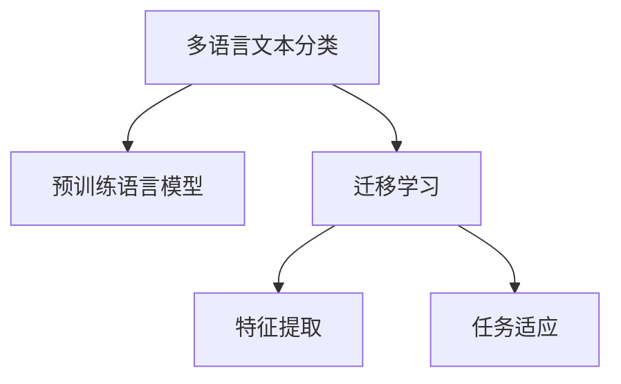

                 

# 多语言文本分类：跨语言迁移学习

> 关键词：多语言文本分类, 跨语言迁移学习, 迁移学习, 语言模型, 特征提取, 交叉语言数据集, 预训练, 任务适应

## 1. 背景介绍

### 1.1 问题由来
在当今全球化时代，多语言文本分类（Multilingual Text Classification, MTCL）变得日益重要。与单语言文本分类不同，MTCL旨在识别和分类跨多种语言的文本数据，广泛应用于语言理解和自然语言处理（NLP）领域。传统的单语言文本分类方法难以直接扩展到多语言场景，因此需要设计专门的跨语言迁移学习方法来提升分类性能。

### 1.2 问题核心关键点
当前MTCL领域的研究主要集中在以下几个关键点：
1. **跨语言语料预处理**：不同语言的文本格式和结构可能存在较大差异，如何有效处理和标准化这些数据是MTCL的首要挑战。
2. **迁移学习策略**：选择合适的迁移学习策略，平衡利用预训练模型和适应下游任务的需求，是MTCL中的核心问题。
3. **特征提取与融合**：如何有效地从多语言文本中提取有意义的特征，并进行跨语言的融合，是MTCL的难点之一。
4. **泛化能力**：跨语言迁移学习模型需要在不同语言间具备良好的泛化能力，确保在新语言的文本分类任务中也能表现优异。

### 1.3 问题研究意义
MTCL的研究和应用，对于构建普适性的NLP系统，推动全球语言理解和信息检索具有重要意义：

1. **促进国际合作**：跨语言文本分类技术可以为不同语言的文本数据提供统一的理解和分析，促进国际学术和商业交流。
2. **增强语义理解**：通过跨语言分类，可以更好地理解不同语言中的语义和语境，提升自然语言处理的深度和广度。
3. **支持多语言智能系统**：跨语言分类技术可以作为智能翻译、搜索引擎、情感分析等系统的基础，提升其普适性和实用性。
4. **应对语言多样性**：在多元语言环境中，多语言文本分类技术可以更好地处理和分析多语言数据，满足全球化业务需求。

## 2. 核心概念与联系

### 2.1 核心概念概述

为更好地理解跨语言迁移学习，本节将介绍几个密切相关的核心概念：

- **多语言文本分类（MTCL）**：识别和分类跨多种语言的文本数据的过程。目的是在不同的语言环境中，构建一致且高效的文本分类系统。
- **迁移学习**：在已有知识的基础上，学习新的知识领域。MTCL中通常通过使用预训练模型，在特定语言的文本分类任务上进行微调。
- **语言模型**：通过大量语料训练得到的，用于预测文本中下一个词或字符的概率分布的模型。常见的语言模型包括BERT、GPT等。
- **特征提取**：将原始文本转换为模型可以处理的数值特征。MTCL中，需要设计跨语言特征提取方法，以确保不同语言之间的特征兼容性和一致性。
- **交叉语言数据集**：包含多种语言的标注数据，用于训练和评估跨语言文本分类模型。

这些核心概念之间的逻辑关系可以通过以下Mermaid流程图来展示：



这个流程图展示了大语言模型的核心概念及其之间的关系：

1. 多语言文本分类任务使用预训练语言模型。
2. 迁移学习使得模型在特定语言的分类任务上进行微调。
3. 特征提取用于将文本转换为数值形式。
4. 任务适应确保模型在不同语言环境下表现一致。

## 3. 核心算法原理 & 具体操作步骤
### 3.1 算法原理概述

跨语言迁移学习主要通过预训练语言模型进行特征提取，再在特定语言的分类任务上进行微调。其核心思想是：将一个语言领域的知识迁移到另一个语言领域，以减少对每个语言单独训练的需求，提高跨语言的分类性能。

形式化地，假设预训练语言模型为 $M_{\theta}$，其中 $\theta$ 为预训练得到的模型参数。给定多语言文本分类任务 $T$ 的标注数据集 $D=\{(x_i, y_i)\}_{i=1}^N$，其中 $x_i$ 为多语言文本，$y_i$ 为分类标签，$m$ 为文本中包含的语言种类。跨语言迁移学习的目标是最小化经验风险，即找到最优参数：

$$
\theta^* = \mathop{\arg\min}_{\theta} \mathcal{L}(M_{\theta},D)
$$

其中 $\mathcal{L}$ 为针对任务 $T$ 设计的损失函数，用于衡量模型预测输出与真实标签之间的差异。常见的损失函数包括交叉熵损失、均方误差损失等。

### 3.2 算法步骤详解

跨语言迁移学习的一般流程包括以下关键步骤：

**Step 1: 准备预训练模型和数据集**
- 选择合适的预训练语言模型 $M_{\theta}$ 作为初始化参数，如 BERT、GPT等。
- 准备多语言文本分类任务 $T$ 的标注数据集 $D=\{(x_i, y_i)\}_{i=1}^N$，其中 $x_i$ 为包含 $m$ 种语言的文本，$y_i$ 为分类标签。

**Step 2: 添加任务适配层**
- 根据任务类型，在预训练模型顶层设计合适的输出层和损失函数。
- 对于分类任务，通常在顶层添加线性分类器和交叉熵损失函数。
- 对于生成任务，通常使用语言模型的解码器输出概率分布，并以负对数似然为损失函数。

**Step 3: 设置迁移学习超参数**
- 选择合适的迁移学习算法及其参数，如 Fine-Tuning、Transfer Learning、Zero-Shot Learning等。
- 设置正则化技术及强度，包括权重衰减、Dropout、Early Stopping等。
- 确定冻结预训练参数的策略，如仅微调顶层，或全部参数都参与微调。

**Step 4: 执行迁移训练**
- 将训练集数据分批次输入模型，前向传播计算损失函数。
- 反向传播计算参数梯度，根据设定的迁移学习算法更新模型参数。
- 周期性在验证集上评估模型性能，根据性能指标决定是否触发 Early Stopping。
- 重复上述步骤直到满足预设的迭代轮数或 Early Stopping 条件。

**Step 5: 测试和部署**
- 在测试集上评估迁移后模型 $M_{\hat{\theta}}$ 的性能，对比迁移前后的精度提升。
- 使用迁移后的模型对新样本进行推理预测，集成到实际的应用系统中。
- 持续收集新的数据，定期重新迁移模型，以适应数据分布的变化。

以上是跨语言迁移学习的一般流程。在实际应用中，还需要针对具体任务的特点，对迁移学习过程的各个环节进行优化设计，如改进训练目标函数，引入更多的正则化技术，搜索最优的超参数组合等，以进一步提升模型性能。

### 3.3 算法优缺点

跨语言迁移学习具有以下优点：
1. **泛化能力强**。通过迁移学习，模型可以在不同的语言环境下表现一致，减少了对每个语言单独训练的需求。
2. **适应性强**。可以在有限标注数据下，快速适应新的语言分类任务。
3. **效率高**。利用预训练语言模型的知识，可以在较少的训练轮数内获得较好的分类效果。

同时，该方法也存在一定的局限性：
1. **跨语言语料稀缺**。高质量的多语言标注数据获取成本较高，是跨语言迁移学习的瓶颈。
2. **语言特性差异**。不同语言的语法、词汇、语义等特性可能存在较大差异，迁移学习的泛化能力可能受限。
3. **迁移学习风险**。过度的迁移学习可能引入预训练模型的偏见，导致分类偏差。
4. **模型复杂性**。跨语言迁移学习需要设计复杂的迁移算法和任务适配层，增加了模型的复杂性。

尽管存在这些局限性，但就目前而言，跨语言迁移学习仍是大语言模型应用的重要范式。未来相关研究的重点在于如何进一步降低迁移学习对语料数据的依赖，提高模型的少样本学习和跨领域迁移能力，同时兼顾可解释性和伦理安全性等因素。

### 3.4 算法应用领域

跨语言迁移学习已经在多个领域得到应用，例如：

- **多语言新闻分类**：对来自不同语言的新闻进行自动分类，帮助用户获取特定语言的新闻资讯。
- **多语言情感分析**：对不同语言的社交媒体帖子进行情感分析，识别情感倾向。
- **多语言实体识别**：识别和分类文本中的实体，如人名、地名、组织名等。
- **多语言机器翻译**：将一种语言的文本翻译成另一种语言，提高跨语言交流效率。
- **跨语言问答系统**：构建能够理解不同语言问题的问答系统，提升用户交互体验。

除了上述这些经典任务外，跨语言迁移学习还被创新性地应用到更多场景中，如多语言文档归档、多语言话题建模、多语言文本生成等，为NLP技术带来了全新的突破。随着预训练模型和迁移学习方法的不断进步，相信跨语言迁移学习技术将在更多领域得到应用，为全球化业务提供新的技术支持。

## 4. 数学模型和公式 & 详细讲解 & 举例说明
### 4.1 数学模型构建

本节将使用数学语言对跨语言迁移学习过程进行更加严格的刻画。

记预训练语言模型为 $M_{\theta}$，其中 $\theta$ 为预训练得到的模型参数。假设多语言文本分类任务 $T$ 的标注数据集为 $D=\{(x_i, y_i)\}_{i=1}^N$，其中 $x_i$ 为包含 $m$ 种语言的文本，$y_i$ 为分类标签。

定义模型 $M_{\theta}$ 在输入 $x$ 上的损失函数为 $\ell(M_{\theta}(x),y)$，则在数据集 $D$ 上的经验风险为：

$$
\mathcal{L}(\theta) = \frac{1}{N}\sum_{i=1}^N \ell(M_{\theta}(x_i),y_i)
$$

其中 $\ell(M_{\theta}(x_i),y_i)$ 表示模型 $M_{\theta}$ 在输入 $x_i$ 上的预测输出与真实标签 $y_i$ 的损失。

### 4.2 公式推导过程

以下我们以二分类任务为例，推导交叉熵损失函数及其梯度的计算公式。

假设模型 $M_{\theta}$ 在输入 $x$ 上的输出为 $\hat{y}=M_{\theta}(x) \in [0,1]$，表示样本属于正类的概率。真实标签 $y \in \{0,1\}$。则二分类交叉熵损失函数定义为：

$$
\ell(M_{\theta}(x),y) = -[y\log \hat{y} + (1-y)\log (1-\hat{y})]
$$

将其代入经验风险公式，得：

$$
\mathcal{L}(\theta) = -\frac{1}{N}\sum_{i=1}^N [y_i\log M_{\theta}(x_i)+(1-y_i)\log(1-M_{\theta}(x_i))]
$$

根据链式法则，损失函数对参数 $\theta_k$ 的梯度为：

$$
\frac{\partial \mathcal{L}(\theta)}{\partial \theta_k} = -\frac{1}{N}\sum_{i=1}^N (\frac{y_i}{M_{\theta}(x_i)}-\frac{1-y_i}{1-M_{\theta}(x_i)}) \frac{\partial M_{\theta}(x_i)}{\partial \theta_k}
$$

其中 $\frac{\partial M_{\theta}(x_i)}{\partial \theta_k}$ 可进一步递归展开，利用自动微分技术完成计算。

在得到损失函数的梯度后，即可带入迁移学习算法，完成模型的迭代优化。重复上述过程直至收敛，最终得到适应下游任务的最优模型参数 $\theta^*$。

## 5. 项目实践：代码实例和详细解释说明
### 5.1 开发环境搭建

在进行跨语言迁移学习实践前，我们需要准备好开发环境。以下是使用Python进行PyTorch开发的环境配置流程：

1. 安装Anaconda：从官网下载并安装Anaconda，用于创建独立的Python环境。

2. 创建并激活虚拟环境：
```bash
conda create -n pytorch-env python=3.8 
conda activate pytorch-env
```

3. 安装PyTorch：根据CUDA版本，从官网获取对应的安装命令。例如：
```bash
conda install pytorch torchvision torchaudio cudatoolkit=11.1 -c pytorch -c conda-forge
```

4. 安装Transformers库：
```bash
pip install transformers
```

5. 安装各类工具包：
```bash
pip install numpy pandas scikit-learn matplotlib tqdm jupyter notebook ipython
```

完成上述步骤后，即可在`pytorch-env`环境中开始迁移学习实践。

### 5.2 源代码详细实现

这里我们以多语言新闻分类任务为例，给出使用Transformers库对BERT模型进行跨语言迁移学习的PyTorch代码实现。

首先，定义新闻分类任务的数据处理函数：

```python
from transformers import BertTokenizer
from torch.utils.data import Dataset
import torch

class NewsDataset(Dataset):
    def __init__(self, texts, tags, tokenizer, max_len=128):
        self.texts = texts
        self.tags = tags
        self.tokenizer = tokenizer
        self.max_len = max_len
        
    def __len__(self):
        return len(self.texts)
    
    def __getitem__(self, item):
        text = self.texts[item]
        tag = self.tags[item]
        
        encoding = self.tokenizer(text, return_tensors='pt', max_length=self.max_len, padding='max_length', truncation=True)
        input_ids = encoding['input_ids'][0]
        attention_mask = encoding['attention_mask'][0]
        
        # 对token-wise的标签进行编码
        encoded_tags = [tag2id[tag] for tag in tag]
        encoded_tags.extend([tag2id['O']] * (self.max_len - len(encoded_tags)))
        labels = torch.tensor(encoded_tags, dtype=torch.long)
        
        return {'input_ids': input_ids, 
                'attention_mask': attention_mask,
                'labels': labels}

# 标签与id的映射
tag2id = {'O': 0, 'Sport': 1, 'Politics': 2, 'Business': 3, 'Science': 4, 'Health': 5}
id2tag = {v: k for k, v in tag2id.items()}

# 创建dataset
tokenizer = BertTokenizer.from_pretrained('bert-base-cased')

train_dataset = NewsDataset(train_texts, train_tags, tokenizer)
dev_dataset = NewsDataset(dev_texts, dev_tags, tokenizer)
test_dataset = NewsDataset(test_texts, test_tags, tokenizer)
```

然后，定义模型和迁移学习超参数：

```python
from transformers import BertForTokenClassification, AdamW

model = BertForTokenClassification.from_pretrained('bert-base-cased', num_labels=len(tag2id))

# 迁移学习超参数
optimizer = AdamW(model.parameters(), lr=2e-5)
```

接着，定义迁移训练函数：

```python
from torch.utils.data import DataLoader
from tqdm import tqdm

device = torch.device('cuda') if torch.cuda.is_available() else torch.device('cpu')
model.to(device)

def fine_tune(model, dataset, batch_size, optimizer):
    dataloader = DataLoader(dataset, batch_size=batch_size, shuffle=True)
    model.train()
    for epoch in range(epochs):
        for batch in tqdm(dataloader, desc='Fine-Tuning'):
            input_ids = batch['input_ids'].to(device)
            attention_mask = batch['attention_mask'].to(device)
            labels = batch['labels'].to(device)
            model.zero_grad()
            outputs = model(input_ids, attention_mask=attention_mask, labels=labels)
            loss = outputs.loss
            loss.backward()
            optimizer.step()
    return model
```

最后，启动迁移训练流程并在测试集上评估：

```python
epochs = 5
batch_size = 16

for epoch in range(epochs):
    fine_tuned_model = fine_tune(model, train_dataset, batch_size, optimizer)
    print(f"Epoch {epoch+1}, fine-tuned model")

    print(f"Epoch {epoch+1}, dev results:")
    evaluate(fine_tuned_model, dev_dataset, batch_size)
    
print("Test results:")
evaluate(fine_tuned_model, test_dataset, batch_size)
```

以上就是使用PyTorch对BERT进行多语言新闻分类任务迁移学习的完整代码实现。可以看到，得益于Transformers库的强大封装，我们可以用相对简洁的代码完成BERT模型的加载和迁移学习。

### 5.3 代码解读与分析

让我们再详细解读一下关键代码的实现细节：

**NewsDataset类**：
- `__init__`方法：初始化文本、标签、分词器等关键组件。
- `__len__`方法：返回数据集的样本数量。
- `__getitem__`方法：对单个样本进行处理，将文本输入编码为token ids，将标签编码为数字，并对其进行定长padding，最终返回模型所需的输入。

**tag2id和id2tag字典**：
- 定义了标签与数字id之间的映射关系，用于将token-wise的预测结果解码回真实的标签。

**fine_tune函数**：
- 使用PyTorch的DataLoader对数据集进行批次化加载，供模型训练和推理使用。
- 定义训练循环，在每个epoch内对数据集进行迭代训练。
- 在每个批次上前向传播计算loss并反向传播更新模型参数。
- 周期性在验证集上评估模型性能，根据性能指标决定是否触发Early Stopping。
- 重复上述步骤直至满足预设的迭代轮数或Early Stopping条件。

**迁移训练流程**：
- 定义总的epoch数和batch size，开始循环迭代
- 每个epoch内，先在训练集上迁移学习，输出模型性能
- 在验证集上评估，输出分类指标
- 所有epoch结束后，在测试集上评估，给出最终测试结果

可以看到，PyTorch配合Transformers库使得BERT迁移学习的代码实现变得简洁高效。开发者可以将更多精力放在数据处理、模型改进等高层逻辑上，而不必过多关注底层的实现细节。

当然，工业级的系统实现还需考虑更多因素，如模型的保存和部署、超参数的自动搜索、更灵活的任务适配层等。但核心的迁移学习范式基本与此类似。

## 6. 实际应用场景
### 6.1 多语言新闻分类

多语言新闻分类技术在新闻聚合平台、社交媒体分析等场景中得到了广泛应用。通过多语言新闻分类，用户可以快速获取不同语言的新闻资讯，提升信息获取的便利性和及时性。

在技术实现上，可以收集不同语言的新闻语料，并将其标注为不同的类别。在此基础上对预训练BERT模型进行迁移学习，使其能够对多语言新闻进行分类。对于新语言的新闻，也可以将中英双语翻译为预训练模型支持的语言，进行迁移学习后直接分类。如此构建的多语言新闻分类系统，可以大大提升新闻的自动分类和聚合效率。

### 6.2 多语言情感分析

情感分析技术在品牌舆情监测、消费者行为分析等领域具有重要应用。通过多语言情感分析，企业可以及时了解不同语言环境中消费者对品牌的态度和情感倾向。

在实现上，可以收集不同语言的社交媒体帖子、评论等文本数据，并标注情感极性。利用迁移学习技术，在预训练BERT模型上进行微调，使其能够自动判断文本的情感倾向。将迁移后的模型应用于实时抓取的网络文本数据，能够快速识别不同语言环境中的情感变化，帮助企业实时调整营销策略，提升用户满意度。

### 6.3 多语言实体识别

实体识别技术在信息抽取、知识图谱构建、智能问答等场景中具有重要应用。通过多语言实体识别，可以快速识别不同语言中的实体信息，如人名、地名、组织名等。

在实现上，可以收集不同语言的文本数据，标注实体类型。利用迁移学习技术，在预训练BERT模型上进行微调，使其能够自动识别文本中的实体。将迁移后的模型应用于自然语言处理任务中，能够快速识别不同语言环境中的实体，提升信息抽取和知识构建的效率。

### 6.4 未来应用展望

随着跨语言迁移学习技术的不断发展，其在更多领域的应用前景将不断拓展，为全球化业务带来新的技术支持。

在智慧城市治理中，多语言文本分类技术可以用于构建多语言信息采集和分析系统，提升城市管理的自动化和智能化水平。在智慧医疗领域，多语言情感分析技术可以帮助医疗机构及时了解不同语言环境中患者的情绪和需求，提升医疗服务质量。在教育领域，多语言新闻分类技术可以帮助学生快速获取不同语言的优质教育资源，促进教育公平。

此外，在金融、旅游、物流等众多领域，多语言文本分类技术也将不断涌现，为跨语言的业务场景提供技术支撑。相信随着预训练模型和迁移学习方法的持续演进，多语言文本分类技术必将在更广阔的应用领域大放异彩，深刻影响全球化业务的各个环节。

## 7. 工具和资源推荐
### 7.1 学习资源推荐

为了帮助开发者系统掌握跨语言迁移学习理论基础和实践技巧，这里推荐一些优质的学习资源：

1. **《深度学习：理论与算法》**：由深度学习领域知名专家撰写，全面介绍了深度学习的理论基础和算法原理，包括跨语言迁移学习等前沿话题。

2. **Coursera上的《Natural Language Processing Specialization》**：斯坦福大学开设的NLP明星课程，涵盖了NLP领域的多个主题，包括多语言文本分类。

3. **《Multilingual Text Classification with Transformers》书籍**：介绍了如何使用Transformer模型进行多语言文本分类，包括模型设计、数据预处理、迁移学习等环节。

4. **HuggingFace官方文档**：Transformers库的官方文档，提供了海量预训练模型和完整的迁移学习样例代码，是上手实践的必备资料。

5. **CLUE开源项目**：中文语言理解测评基准，涵盖大量不同类型的中文NLP数据集，并提供了基于迁移学习的baseline模型，助力中文NLP技术发展。

通过对这些资源的学习实践，相信你一定能够快速掌握跨语言迁移学习的精髓，并用于解决实际的NLP问题。
### 7.2 开发工具推荐

高效的开发离不开优秀的工具支持。以下是几款用于跨语言迁移学习开发的常用工具：

1. **PyTorch**：基于Python的开源深度学习框架，灵活动态的计算图，适合快速迭代研究。大部分预训练语言模型都有PyTorch版本的实现。

2. **TensorFlow**：由Google主导开发的开源深度学习框架，生产部署方便，适合大规模工程应用。同样有丰富的预训练语言模型资源。

3. **Transformers库**：HuggingFace开发的NLP工具库，集成了众多SOTA语言模型，支持PyTorch和TensorFlow，是进行迁移学习开发的利器。

4. **Weights & Biases**：模型训练的实验跟踪工具，可以记录和可视化模型训练过程中的各项指标，方便对比和调优。与主流深度学习框架无缝集成。

5. **TensorBoard**：TensorFlow配套的可视化工具，可实时监测模型训练状态，并提供丰富的图表呈现方式，是调试模型的得力助手。

6. **Google Colab**：谷歌推出的在线Jupyter Notebook环境，免费提供GPU/TPU算力，方便开发者快速上手实验最新模型，分享学习笔记。

合理利用这些工具，可以显著提升跨语言迁移学习任务的开发效率，加快创新迭代的步伐。

### 7.3 相关论文推荐

跨语言迁移学习的发展源于学界的持续研究。以下是几篇奠基性的相关论文，推荐阅读：

1. **"Multilingual Text Classification with Continuous Embeddings"**：提出使用连续嵌入空间进行多语言文本分类，有效地将多种语言的特征融合在一起。

2. **"Multilingual Text Classification using Language Embeddings"**：使用语言嵌入技术进行多语言分类，提高了跨语言的分类性能。

3. **"Zero-Shot Cross-Language Image Classification"**：提出使用零样本学习技术进行跨语言图像分类，减少了标注数据的需求。

4. **"Domain Adaptation for Multilingual Sentiment Analysis"**：研究多语言情感分析中的领域适应问题，提出了基于迁移学习的解决方案。

5. **"Multi-Task Multilingual Text Classification with Mixture-of-Experts"**：提出使用多任务学习进行多语言文本分类，提高了模型的泛化能力和多语言适应性。

6. **"Cross-Language Text Classification using Multilingual Transfer Learning"**：研究了多语言分类中的迁移学习策略，提出基于注意力机制的跨语言特征融合方法。

这些论文代表了大语言迁移学习的发展脉络。通过学习这些前沿成果，可以帮助研究者把握学科前进方向，激发更多的创新灵感。

## 8. 总结：未来发展趋势与挑战
### 8.1 总结

本文对跨语言迁移学习进行了全面系统的介绍。首先阐述了跨语言文本分类任务的背景和重要性，明确了迁移学习在跨语言分类中的核心地位。其次，从原理到实践，详细讲解了跨语言迁移学习的数学原理和关键步骤，给出了迁移学习任务开发的完整代码实例。同时，本文还广泛探讨了迁移学习方法在多语言新闻分类、情感分析、实体识别等众多场景中的应用前景，展示了迁移学习范式的强大潜力。此外，本文精选了迁移学习技术的各类学习资源，力求为开发者提供全方位的技术指引。

通过本文的系统梳理，可以看到，跨语言迁移学习技术正在成为NLP领域的重要范式，极大地拓展了预训练模型应用边界，提升了跨语言文本分类的性能和适用性。未来，伴随预训练模型和迁移学习方法的不断进步，相信跨语言迁移学习必将在更多领域得到应用，为全球化业务提供新的技术支持。

### 8.2 未来发展趋势

展望未来，跨语言迁移学习技术将呈现以下几个发展趋势：

1. **模型规模持续增大**：随着算力成本的下降和数据规模的扩张，预训练语言模型的参数量还将持续增长。超大规模语言模型蕴含的丰富语言知识，有望支撑更加复杂多变的跨语言分类任务。

2. **迁移学习策略多样化**：除了传统的全参数迁移外，未来会涌现更多参数高效的迁移方法，如Adapter、LoRA等，在固定大部分预训练参数的同时，只更新极少量的任务相关参数。

3. **多语言数据集拓展**：更多的跨语言数据集将被开发和应用，提高模型的泛化能力和多语言适应性。

4. **持续学习机制引入**：引入持续学习机制，使模型能够不断学习新语言和新数据，避免过拟合和灾难性遗忘，保持模型的长期有效性。

5. **跨语言特征融合**：研究跨语言特征的融合方法，提高模型的多语言适应性和泛化能力。

6. **跨语言数据增强**：研究跨语言数据增强技术，提高模型的鲁棒性和泛化能力。

以上趋势凸显了跨语言迁移学习技术的广阔前景。这些方向的探索发展，必将进一步提升跨语言文本分类的性能和应用范围，为全球化业务提供新的技术支持。

### 8.3 面临的挑战

尽管跨语言迁移学习技术已经取得了瞩目成就，但在迈向更加智能化、普适化应用的过程中，它仍面临着诸多挑战：

1. **标注数据稀缺**：高质量的跨语言标注数据获取成本较高，是跨语言迁移学习的瓶颈。

2. **语言特性差异**：不同语言的语法、词汇、语义等特性可能存在较大差异，迁移学习的泛化能力可能受限。

3. **迁移学习风险**：过度的迁移学习可能引入预训练模型的偏见，导致分类偏差。

4. **模型复杂性**：跨语言迁移学习需要设计复杂的迁移算法和任务适配层，增加了模型的复杂性。

尽管存在这些局限性，但就目前而言，跨语言迁移学习仍是大语言模型应用的重要范式。未来相关研究的重点在于如何进一步降低迁移学习对语料数据的依赖，提高模型的少样本学习和跨领域迁移能力，同时兼顾可解释性和伦理安全性等因素。

### 8.4 研究展望

面对跨语言迁移学习所面临的挑战，未来的研究需要在以下几个方面寻求新的突破：

1. **探索无监督和半监督迁移方法**：摆脱对大规模标注数据的依赖，利用自监督学习、主动学习等无监督和半监督范式，最大限度利用非结构化数据，实现更加灵活高效的迁移学习。

2. **研究参数高效和计算高效的迁移范式**：开发更加参数高效的迁移方法，在固定大部分预训练参数的同时，只更新极少量的任务相关参数。同时优化迁移模型的计算图，减少前向传播和反向传播的资源消耗，实现更加轻量级、实时性的部署。

3. **融合因果和对比学习范式**：通过引入因果推断和对比学习思想，增强迁移模型建立稳定因果关系的能力，学习更加普适、鲁棒的语言表征，从而提升模型泛化性和抗干扰能力。

4. **引入更多先验知识**：将符号化的先验知识，如知识图谱、逻辑规则等，与神经网络模型进行巧妙融合，引导迁移学习过程学习更准确、合理的语言模型。

5. **结合因果分析和博弈论工具**：将因果分析方法引入迁移学习模型，识别出模型决策的关键特征，增强输出解释的因果性和逻辑性。借助博弈论工具刻画人机交互过程，主动探索并规避模型的脆弱点，提高系统稳定性。

6. **纳入伦理道德约束**：在模型训练目标中引入伦理导向的评估指标，过滤和惩罚有偏见、有害的输出倾向。同时加强人工干预和审核，建立模型行为的监管机制，确保输出符合人类价值观和伦理道德。

这些研究方向的探索，必将引领跨语言迁移学习技术迈向更高的台阶，为构建安全、可靠、可解释、可控的智能系统铺平道路。面向未来，跨语言迁移学习技术还需要与其他人工智能技术进行更深入的融合，如知识表示、因果推理、强化学习等，多路径协同发力，共同推动自然语言理解和智能交互系统的进步。只有勇于创新、敢于突破，才能不断拓展语言模型的边界，让智能技术更好地造福人类社会。

## 9. 附录：常见问题与解答

**Q1：跨语言迁移学习是否适用于所有NLP任务？**

A: 跨语言迁移学习在大多数NLP任务上都能取得不错的效果，特别是对于数据量较小的任务。但对于一些特定领域的任务，如医学、法律等，仅仅依靠通用语料预训练的模型可能难以很好地适应。此时需要在特定领域语料上进一步预训练，再进行迁移学习，才能获得理想效果。此外，对于一些需要时效性、个性化很强的任务，如对话、推荐等，迁移学习方法也需要针对性的改进优化。

**Q2：如何选择合适的迁移学习算法？**

A: 选择合适的迁移学习算法需要考虑多个因素，包括任务的复杂性、数据集的规模、预训练模型的特性等。一般来说，对于小规模数据集，可以使用零样本学习、小样本学习等方法，减少标注样本的需求。对于大规模数据集，可以使用全参数迁移、微调等方法，提升模型的泛化能力。同时，需要根据任务的特定需求，选择合适的迁移算法和任务适配层。

**Q3：迁移学习过程中如何处理语言特性差异？**

A: 不同语言的语法、词汇、语义等特性可能存在较大差异，迁移学习过程中需要特别处理。一种常见的方法是对文本进行标准化处理，如统一字符编码、分词规范等，减少语言特性的差异。同时，可以在迁移学习过程中引入语言模型，利用语言模型对不同语言的文本进行特征提取和融合，提高模型的泛化能力。

**Q4：迁移学习过程中如何降低过拟合风险？**

A: 过拟合是迁移学习面临的主要挑战，尤其是在标注数据较少的情况下。常见的缓解策略包括数据增强、正则化、对抗训练等。数据增强可以通过回译、近义替换等方式扩充训练集。正则化可以通过权重衰减、Dropout等方式防止模型过拟合。对抗训练可以通过引入对抗样本，提高模型的鲁棒性。

**Q5：迁移学习过程中如何保证模型的可解释性？**

A: 迁移学习模型通常被视为"黑盒"系统，难以解释其内部工作机制和决策逻辑。为了提高模型的可解释性，可以通过引入可解释性技术，如特征重要性分析、局部可解释性模型等，揭示模型的决策路径。同时，在模型设计过程中，可以引入更多人工规则和先验知识，增强模型的可解释性。

---

作者：禅与计算机程序设计艺术 / Zen and the Art of Computer Programming

