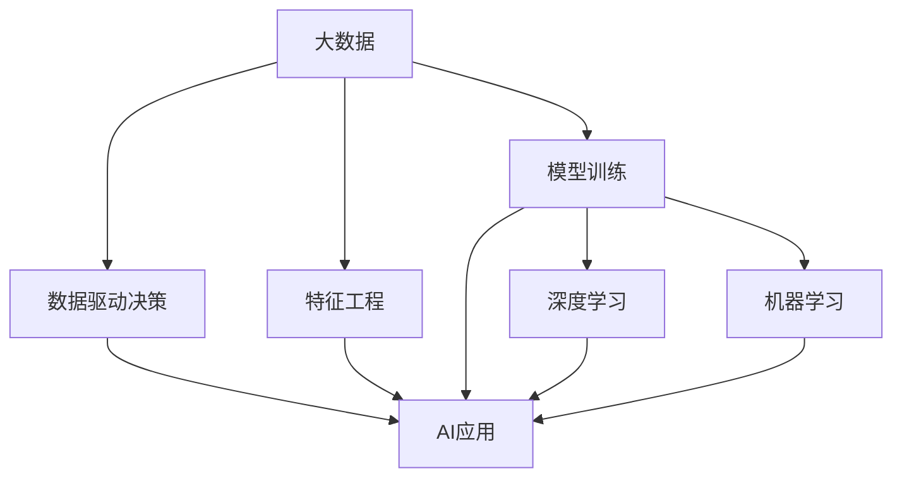

                 

## 1. 背景介绍

### 1.1 问题由来
近年来，人工智能（AI）技术在各行各业中取得了巨大突破。大数据作为AI的重要基础设施，为AI模型的训练和应用提供了丰富、多样、高质量的数据资源。通过大数据的驱动，AI模型能够更好地理解和模拟人类行为、决策过程和自然现象，从而在金融、医疗、教育、智能交通等领域发挥了重大作用。但同时也面临数据隐私、数据标注、数据安全等挑战。

### 1.2 问题核心关键点
大数据在AI中的重要性主要体现在以下几个方面：

- **数据资源**：大数据为AI模型的训练提供了丰富的数据资源，使得模型可以学习到更加复杂、丰富的知识。
- **模型性能**：通过大数据训练出的AI模型具有更高的准确性和泛化能力，能够更好地应对实际应用中的各种问题。
- **业务应用**：大数据驱动的AI模型在金融、医疗、交通等多个行业领域中，展现了显著的业务价值。
- **挑战与解决方案**：尽管大数据带来了诸多优势，但在数据隐私、标注成本、数据安全等方面也面临诸多挑战，需要进一步的解决方案。

### 1.3 问题研究意义
研究大数据在AI中的重要性，对于推动AI技术的进步，拓展AI的应用范围，提升数据驱动决策的准确性和效率，具有重要意义：

- **技术驱动**：大数据为AI技术的发展提供了坚实的基础，推动了AI模型的演进和应用。
- **应用创新**：通过大数据驱动，AI技术在诸多行业领域的创新应用得以实现，提升了社会生产力和生活质量。
- **价值体现**：大数据驱动的AI模型能够带来显著的业务价值，帮助企业实现降本增效，优化业务流程。
- **未来发展**：大数据在AI中的重要性将继续增强，成为推动AI走向智能社会的重要力量。

## 2. 核心概念与联系

### 2.1 核心概念概述

为更好地理解大数据在AI中的作用，本节将介绍几个关键概念：

- **大数据（Big Data）**：指规模庞大、复杂、多样化、高速度的数据集，具有4V特征：Volume、Velocity、Variety和Veracity。
- **AI（人工智能）**：指通过计算机系统模拟人类智能过程的技术，包括机器学习、深度学习、自然语言处理等。
- **数据驱动决策（Data-Driven Decision Making）**：指基于大数据分析和处理结果进行决策的过程，通常用于复杂场景和动态环境。
- **模型训练（Model Training）**：通过大量数据训练AI模型，使其能够学习到有用的知识，并应用于实际问题。
- **特征工程（Feature Engineering）**：指从原始数据中提取有价值特征的过程，通常需要领域知识辅助。
- **深度学习（Deep Learning）**：一种基于多层神经网络结构的AI模型，能够处理复杂的数据模式。

这些概念之间的逻辑关系可以通过以下Mermaid流程图来展示：



这个流程图展示了大数据、特征工程、模型训练、深度学习和机器学习等概念之间的联系，它们共同构成了AI模型训练和应用的基础框架。

## 3. 核心算法原理 & 具体操作步骤
### 3.1 算法原理概述

大数据在AI中的应用主要体现在数据驱动决策和模型训练两个方面。其核心思想是：通过大规模数据集训练AI模型，使其能够学习到数据中的规律和模式，并应用于具体问题中。

形式化地，假设存在一个数据集 $D=\{(x_i, y_i)\}_{i=1}^N$，其中 $x_i$ 为输入特征，$y_i$ 为输出标签。我们的目标是通过这些数据训练一个模型 $M$，使得其输出 $M(x)$ 能够逼近真实标签 $y$。为此，我们定义一个损失函数 $\mathcal{L}(M, D)$，衡量模型预测输出与真实标签之间的差异。通过最小化损失函数，我们可以得到最优模型参数 $\theta$：

$$
\theta = \mathop{\arg\min}_{\theta} \mathcal{L}(M_{\theta}, D)
$$

在实际应用中，我们通常使用基于梯度的优化算法（如SGD、Adam等）来近似求解上述最优化问题。优化算法通过反向传播计算模型参数的梯度，并根据梯度方向更新参数值。最终得到最小化损失函数的模型 $M_{\theta}$，可以用于新的数据输入预测。

### 3.2 算法步骤详解

基于大数据的AI模型训练一般包括以下几个关键步骤：

**Step 1: 数据准备与预处理**
- 收集并整理相关领域的原始数据，包括结构化和非结构化数据。
- 清洗、去重、归一化处理，保证数据质量。
- 划分训练集、验证集和测试集。

**Step 2: 特征提取与工程**
- 选择合适的特征，设计特征提取算法。
- 应用特征选择、特征缩放、特征降维等技术，减少维度灾难。
- 对文本、图像等数据进行分词、归一化、编码等预处理。

**Step 3: 模型选择与设计**
- 根据任务需求，选择适合的AI模型结构，如线性回归、支持向量机、神经网络等。
- 设计模型架构，包括隐藏层数、神经元个数等超参数。
- 设置合适的学习率和优化算法。

**Step 4: 模型训练与优化**
- 将数据集输入模型进行训练，并计算损失函数。
- 根据梯度下降算法更新模型参数，逐步优化模型性能。
- 在验证集上评估模型性能，调整超参数。

**Step 5: 模型测试与部署**
- 在测试集上评估模型性能，进行最终调优。
- 将训练好的模型部署到实际应用中，进行业务迭代优化。
- 定期更新模型参数，保持模型性能。

### 3.3 算法优缺点

基于大数据的AI模型训练方法具有以下优点：
1. 数据驱动：模型性能直接依赖于大数据的质量和多样性，有助于提高模型的泛化能力。
2. 模型复杂：深度学习模型可以处理复杂数据结构，学习到更深层次的规律和模式。
3. 业务价值高：基于大数据训练的AI模型能够提供更为准确、高效的业务解决方案，带来显著的经济效益。
4. 可解释性强：大数据驱动的AI模型通常具有较强的可解释性，便于业务理解和决策支持。

同时，该方法也存在以下局限性：
1. 数据隐私：在处理敏感数据时，需要严格遵守数据隐私法规，确保数据安全和用户隐私。
2. 标注成本高：大数据标注通常需要大量人力和时间，成本较高。
3. 计算资源需求大：深度学习模型参数量庞大，需要高性能计算资源支持。
4. 模型过拟合：大数据驱动的模型容易在训练集上过拟合，需要进行正则化和超参数优化。

尽管存在这些局限性，但基于大数据的AI模型训练方法仍是大数据时代的重要技术手段，其优势在实际应用中得到了广泛验证。

### 3.4 算法应用领域

基于大数据的AI模型训练方法在多个领域中得到了广泛应用，包括但不限于以下几个方面：

- **金融风控**：利用大数据训练AI模型，进行信用评分、欺诈检测、风险控制等金融风险管理。
- **医疗诊断**：基于电子健康记录和医学影像等大数据，训练AI模型进行疾病预测、影像诊断、手术辅助等医疗应用。
- **智能交通**：利用交通流量、天气、路线等大数据，训练AI模型进行智能调度、路径优化、交通预测等。
- **市场营销**：通过用户行为数据和市场反馈，训练AI模型进行精准营销、个性化推荐、需求预测等。
- **智慧城市**：利用城市公共数据和传感器数据，训练AI模型进行智慧能源管理、垃圾处理、环境监测等。
- **自动驾驶**：基于车辆传感器数据和地图数据，训练AI模型进行路况识别、自动驾驶、安全预警等。

这些领域的大数据驱动AI应用，不仅提高了生产效率和决策准确性，也带来了新的业务模式和经济增长点。

## 4. 数学模型和公式 & 详细讲解 & 举例说明
### 4.1 数学模型构建

本节将使用数学语言对基于大数据的AI模型训练过程进行更加严格的刻画。

假设存在一个数据集 $D=\{(x_i, y_i)\}_{i=1}^N$，其中 $x_i \in \mathcal{X}$ 为输入特征，$y_i \in \mathcal{Y}$ 为输出标签。我们的目标是通过这些数据训练一个模型 $M$，使其输出 $M(x)$ 能够逼近真实标签 $y$。为此，我们定义一个损失函数 $\mathcal{L}(M, D)$，衡量模型预测输出与真实标签之间的差异。

对于线性回归模型，损失函数定义为：

$$
\mathcal{L}(M, D) = \frac{1}{N} \sum_{i=1}^N (y_i - M(x_i))^2
$$

对于分类问题，交叉熵损失函数定义为：

$$
\mathcal{L}(M, D) = -\frac{1}{N} \sum_{i=1}^N \sum_{k=1}^C y_{ik} \log M_k(x_i)
$$

其中 $M_k(x_i)$ 表示模型对样本 $x_i$ 在类别 $k$ 上的预测概率，$y_{ik}$ 为真实标签，$C$ 为类别数量。

### 4.2 公式推导过程

以线性回归模型为例，推导其损失函数的梯度计算公式。

假设模型 $M$ 在输入 $x$ 上的输出为 $\hat{y}=M(x)$，则损失函数定义为：

$$
\mathcal{L}(M, D) = \frac{1}{N} \sum_{i=1}^N (y_i - M(x_i))^2
$$

对损失函数求偏导数，得到模型参数 $\theta$ 的梯度：

$$
\frac{\partial \mathcal{L}(M, D)}{\partial \theta} = -\frac{2}{N} \sum_{i=1}^N (y_i - M(x_i)) \frac{\partial M(x_i)}{\partial \theta}
$$

其中 $\frac{\partial M(x_i)}{\partial \theta}$ 可以通过链式法则计算。

在得到损失函数的梯度后，即可带入梯度下降算法，更新模型参数。重复上述过程直至收敛，最终得到最小化损失函数的模型参数 $\theta^*$。

### 4.3 案例分析与讲解

以金融风控为例，分析基于大数据的AI模型训练和应用过程。

**数据准备**：
- 收集银行客户的交易数据、信用记录、社交媒体信息等，构成大数据集。
- 对数据进行清洗和预处理，去除噪声和异常值。
- 将数据划分为训练集、验证集和测试集。

**特征提取**：
- 从交易记录中提取重要特征，如交易金额、时间、地点等。
- 应用PCA等降维技术，减少特征维度。
- 对文本数据进行分词、编码等预处理。

**模型训练**：
- 选择线性回归模型作为基础模型，进行初步训练和调参。
- 将训练集输入模型，使用梯度下降算法优化损失函数，逐步提高模型性能。
- 在验证集上评估模型性能，调整模型参数和特征提取策略。

**模型测试**：
- 在测试集上评估模型性能，进行最终调优。
- 应用训练好的模型进行新客户信用评分、欺诈检测等任务。
- 定期更新模型参数，保持模型性能。

**部署应用**：
- 将训练好的模型部署到银行风控系统中，进行实时预测和风险控制。
- 结合其他业务系统，进行自动化决策和业务迭代优化。
- 收集用户反馈，不断优化模型和算法。

通过这个案例，可以看出大数据在金融风控领域的应用过程，以及AI模型如何从数据中学习规律，提供决策支持。

## 5. 项目实践：代码实例和详细解释说明
### 5.1 开发环境搭建

在进行大数据驱动的AI模型训练实践前，我们需要准备好开发环境。以下是使用Python进行PyTorch开发的环境配置流程：

1. 安装Anaconda：从官网下载并安装Anaconda，用于创建独立的Python环境。

2. 创建并激活虚拟环境：
```bash
conda create -n pytorch-env python=3.8 
conda activate pytorch-env
```

3. 安装PyTorch：根据CUDA版本，从官网获取对应的安装命令。例如：
```bash
conda install pytorch torchvision torchaudio cudatoolkit=11.1 -c pytorch -c conda-forge
```

4. 安装Pandas、NumPy等数据处理库：
```bash
pip install pandas numpy
```

5. 安装Scikit-learn：用于数据预处理和特征提取。
```bash
pip install scikit-learn
```

完成上述步骤后，即可在`pytorch-env`环境中开始大数据驱动的AI模型训练实践。

### 5.2 源代码详细实现

下面我们以金融风控为例，给出使用PyTorch进行线性回归模型训练的PyTorch代码实现。

首先，定义数据处理函数：

```python
import pandas as pd
import numpy as np
from sklearn.preprocessing import StandardScaler

def load_data(path):
    data = pd.read_csv(path)
    X = data[['amount', 'time', 'location']]
    y = data['label']
    X = np.array(X)
    y = np.array(y)
    scaler = StandardScaler()
    X = scaler.fit_transform(X)
    return X, y

X_train, y_train = load_data('train.csv')
X_test, y_test = load_data('test.csv')
```

然后，定义模型和优化器：

```python
import torch
import torch.nn as nn
from torch.optim import SGD

class LinearRegression(nn.Module):
    def __init__(self, input_size, output_size):
        super(LinearRegression, self).__init__()
        self.linear = nn.Linear(input_size, output_size)

    def forward(self, x):
        return self.linear(x)

model = LinearRegression(input_size=3, output_size=1)

optimizer = SGD(model.parameters(), lr=0.01)
```

接着，定义训练和评估函数：

```python
def train_epoch(model, data_loader, optimizer):
    model.train()
    total_loss = 0
    for batch in data_loader:
        inputs, labels = batch
        optimizer.zero_grad()
        outputs = model(inputs)
        loss = nn.MSELoss()(outputs, labels)
        loss.backward()
        optimizer.step()
        total_loss += loss.item()
    return total_loss / len(data_loader)

def evaluate(model, data_loader):
    model.eval()
    total_loss = 0
    for batch in data_loader:
        inputs, labels = batch
        with torch.no_grad():
            outputs = model(inputs)
            loss = nn.MSELoss()(outputs, labels)
            total_loss += loss.item()
    return total_loss / len(data_loader)
```

最后，启动训练流程并在测试集上评估：

```python
from torch.utils.data import DataLoader

train_loader = DataLoader(X_train, batch_size=32)
test_loader = DataLoader(X_test, batch_size=32)

epochs = 10
batch_size = 32

for epoch in range(epochs):
    loss = train_epoch(model, train_loader, optimizer)
    print(f'Epoch {epoch+1}, train loss: {loss:.4f}')
    
    print(f'Epoch {epoch+1}, test loss: {evaluate(model, test_loader):.4f}')
```

以上就是使用PyTorch对线性回归模型进行金融风控任务训练的完整代码实现。可以看到，大数据驱动的AI模型训练的代码实现相对简单，只需要关注数据处理和模型定义即可。

### 5.3 代码解读与分析

让我们再详细解读一下关键代码的实现细节：

**数据处理函数**：
- `load_data`函数：从指定路径加载CSV文件，并对数据进行预处理和归一化。
- `X_train`和`y_train`：加载训练集数据，并进行特征提取和标签编码。

**模型定义**：
- `LinearRegression`类：定义线性回归模型，包括一个线性层。
- `input_size`和`output_size`：输入和输出特征的维度。
- `nn.Linear`层：定义线性层，用于将输入映射到输出。

**优化器定义**：
- `SGD`优化器：定义随机梯度下降优化器，用于模型参数的更新。

**训练函数**：
- `train_epoch`函数：对数据集进行批次迭代，计算模型损失，并使用SGD更新模型参数。
- `optimizer.zero_grad()`：重置梯度，避免累积误差。

**评估函数**：
- `evaluate`函数：在测试集上计算模型损失，返回平均损失值。
- `model.eval()`：将模型设为评估模式，不进行反向传播。

**训练流程**：
- `epochs`和`batch_size`：设置训练轮数和批次大小。
- `for`循环：对每个epoch进行迭代。
- `loss`：在训练集上计算平均损失。
- `evaluate`：在测试集上计算平均损失。

可以看出，PyTorch提供了强大的工具链，使得大数据驱动的AI模型训练变得高效、易用。通过合理的代码设计和组织，能够快速构建和训练高质量的AI模型。

## 6. 实际应用场景
### 6.1 智能金融

在智能金融领域，基于大数据的AI模型训练方法被广泛应用，主要用于信用评分、欺诈检测、风险控制等任务。传统的金融风控系统依赖人工规则和专家经验，存在数据不足、规则过于死板等问题。通过大数据驱动的AI模型，可以更好地理解用户行为和市场动态，提供更为精准和灵活的风控解决方案。

**案例分析**：
- **信用评分**：利用用户的历史交易记录和社交媒体信息，训练AI模型进行信用评分。模型能够综合考虑用户行为、财务状况和信用历史，提供更为准确和动态的信用评估。
- **欺诈检测**：通过交易数据和行为数据，训练AI模型进行欺诈检测。模型能够实时监控异常交易行为，及时发现和防范欺诈风险。
- **风险控制**：结合市场数据和用户数据，训练AI模型进行风险评估和控制。模型能够识别高风险用户和交易，减少不良贷款和违约事件的发生。

通过大数据驱动的AI模型，智能金融系统能够实现自动化、智能化的决策支持，大幅提升金融服务的质量和效率。

### 6.2 医疗诊断

在医疗诊断领域，大数据驱动的AI模型训练方法主要用于疾病预测、影像诊断、手术辅助等任务。传统的医疗诊断依赖医生经验和医学知识，存在误诊率高、诊断速度慢等问题。通过大数据驱动的AI模型，可以更好地处理复杂多变的医学数据，提供更为精准和高效的诊断解决方案。

**案例分析**：
- **疾病预测**：利用电子健康记录和基因信息，训练AI模型进行疾病预测。模型能够综合考虑多种因素，提供个性化的健康风险评估。
- **影像诊断**：通过医学影像数据，训练AI模型进行影像诊断。模型能够识别病变区域和异常结构，辅助医生进行诊断和决策。
- **手术辅助**：结合手术记录和患者数据，训练AI模型进行手术规划和辅助。模型能够提供手术建议和风险评估，提升手术成功率和安全性。

通过大数据驱动的AI模型，医疗诊断系统能够实现自动化、智能化的决策支持，提升医疗服务的质量和效率。

### 6.3 智能交通

在智能交通领域，大数据驱动的AI模型训练方法主要用于交通流量预测、路况优化、智能调度等任务。传统的交通管理依赖人工经验和历史数据，存在信息不足、决策滞后等问题。通过大数据驱动的AI模型，可以更好地理解交通动态和需求，提供更为精准和灵活的交通解决方案。

**案例分析**：
- **交通流量预测**：利用交通传感器和历史数据，训练AI模型进行交通流量预测。模型能够实时监测交通状况，预测未来流量变化。
- **路况优化**：通过实时交通数据和历史数据，训练AI模型进行路况优化。模型能够优化交通信号控制和路线规划，减少交通拥堵和延误。
- **智能调度**：结合车辆数据和用户需求，训练AI模型进行智能调度。模型能够优化车辆分配和调度，提升运输效率和用户体验。

通过大数据驱动的AI模型，智能交通系统能够实现自动化、智能化的决策支持，提升交通管理和运营的效率和质量。

### 6.4 未来应用展望

随着大数据和AI技术的进一步发展，基于大数据的AI模型训练方法将展现出更广阔的应用前景。以下是几个可能的未来趋势：

- **多模态数据融合**：未来的AI模型将更多地融合多模态数据，如文本、图像、视频等，实现跨模态信息的深度学习。
- **实时数据处理**：大数据驱动的AI模型将更加注重实时数据处理，提供实时决策支持。
- **自适应学习**：未来的AI模型将具备自适应学习能力，能够根据环境变化和任务需求动态调整模型参数。
- **可解释性增强**：大数据驱动的AI模型将更加注重可解释性，提供透明的决策过程和结果。
- **跨领域应用**：未来的AI模型将更加灵活，能够跨领域应用，解决更多复杂问题。

这些趋势表明，基于大数据的AI模型训练方法将进一步提升AI技术的灵活性和实用性，为更多领域提供智能化决策支持。

## 7. 工具和资源推荐
### 7.1 学习资源推荐

为了帮助开发者系统掌握大数据在AI中的应用，这里推荐一些优质的学习资源：

1. **《深度学习》（Ian Goodfellow等）**：全面介绍了深度学习的基础知识和前沿技术，涵盖数据驱动决策、特征工程、模型训练等关键内容。

2. **CS229《机器学习》课程**：斯坦福大学开设的经典机器学习课程，由Andrew Ng教授主讲，涵盖机器学习的基本理论和算法，是学习AI的必读材料。

3. **《Python数据科学手册》（Jake VanderPlas）**：介绍了Python在数据科学中的应用，包括数据处理、特征工程、模型训练等，适合初学者入门。

4. **Kaggle竞赛平台**：一个数据科学竞赛平台，提供大量真实数据集和模型竞赛机会，有助于实践大数据驱动的AI模型训练。

5. **Scikit-learn官方文档**：提供了丰富的机器学习库和模型，适合快速开发和调试。

通过对这些资源的学习实践，相信你一定能够快速掌握大数据在AI中的应用，并用于解决实际的业务问题。

### 7.2 开发工具推荐

高效的开发离不开优秀的工具支持。以下是几款用于大数据驱动的AI模型训练开发的常用工具：

1. **PyTorch**：基于Python的开源深度学习框架，灵活易用，适合快速迭代研究。提供了丰富的预训练模型和优化算法，支持分布式训练。

2. **TensorFlow**：由Google主导开发的开源深度学习框架，生产部署方便，适合大规模工程应用。提供了丰富的API和工具，支持跨平台部署。

3. **Pandas**：用于数据处理和分析的Python库，支持多维数据结构和数据操作，是数据科学家必备工具。

4. **NumPy**：用于数值计算和矩阵运算的Python库，高效易用，支持GPU加速。

5. **Scikit-learn**：用于数据预处理和模型训练的Python库，提供了丰富的特征工程和模型训练算法。

6. **TensorBoard**：TensorFlow配套的可视化工具，实时监测模型训练状态，提供丰富的图表呈现方式。

7. **Jupyter Notebook**：一个交互式的Python编程环境，支持代码、数据和图形的混合展示，适合数据驱动的AI模型训练和调试。

合理利用这些工具，可以显著提升大数据驱动的AI模型训练的开发效率，加快创新迭代的步伐。

### 7.3 相关论文推荐

大数据在AI中的应用源于学界的持续研究。以下是几篇奠基性的相关论文，推荐阅读：

1. **《大规模数据集在大规模特征表示学习中的应用》（Hinton等）**：介绍了大规模数据集在特征表示学习中的应用，强调了大数据的重要性。

2. **《自然语言处理中的大规模数据集》（Mikolov等）**：介绍了大规模数据集在自然语言处理中的应用，包括语料库的构建和特征工程。

3. **《深度学习中的特征选择与建模》（Jeggo等）**：介绍了深度学习中的特征选择和建模技术，强调了数据预处理的重要性。

4. **《大数据在智能交通系统中的应用》（Li等）**：介绍了大数据在智能交通系统中的应用，涵盖数据处理、模型训练和应用。

5. **《医疗数据中的特征提取与深度学习》（Wang等）**：介绍了医疗数据中的特征提取和深度学习应用，强调了数据质量和多样性的重要性。

6. **《智能金融中的大数据应用》（Zhang等）**：介绍了智能金融中的大数据应用，涵盖信用评分、欺诈检测、风险控制等任务。

这些论文代表了大数据在AI中的重要性和应用前景，通过学习这些前沿成果，可以帮助研究者把握学科前进方向，激发更多的创新灵感。

## 8. 总结：未来发展趋势与挑战
### 8.1 总结

本文对大数据在AI中的应用进行了全面系统的介绍。首先阐述了大数据的重要性，明确了其在大数据驱动决策和模型训练中的核心地位。其次，从原理到实践，详细讲解了基于大数据的AI模型训练过程，给出了大数据驱动的AI模型训练的完整代码实例。同时，本文还广泛探讨了大数据在金融风控、医疗诊断、智能交通等多个领域的应用前景，展示了大数据驱动的AI模型训练的巨大潜力。

通过本文的系统梳理，可以看出大数据在AI中的重要性，及其在各领域的应用价值。未来，大数据将持续推动AI技术的发展，成为推动AI走向智能社会的重要力量。

### 8.2 未来发展趋势

展望未来，大数据在AI中的应用将呈现以下几个发展趋势：

- **数据规模扩大**：随着数据采集和存储技术的进步，数据规模将进一步扩大，大数据驱动的AI模型将更为精准和高效。
- **数据多样性增强**：未来的数据将更加多样化，涵盖文本、图像、视频、音频等多种形式，大数据驱动的AI模型将具备更强的跨模态学习和推理能力。
- **实时性提升**：未来的AI模型将更加注重实时数据处理，提供实时决策支持。
- **自适应学习能力增强**：未来的AI模型将具备更强的自适应学习能力，能够根据环境变化和任务需求动态调整模型参数。
- **模型可解释性增强**：未来的AI模型将更加注重可解释性，提供透明的决策过程和结果。

这些趋势表明，大数据在AI中的应用将进一步提升AI技术的灵活性和实用性，为更多领域提供智能化决策支持。

### 8.3 面临的挑战

尽管大数据在AI中的应用已经取得了显著成果，但在数据隐私、标注成本、数据安全等方面也面临诸多挑战：

- **数据隐私**：在处理敏感数据时，需要严格遵守数据隐私法规，确保数据安全和用户隐私。
- **标注成本高**：大数据标注通常需要大量人力和时间，成本较高。
- **数据安全**：大规模数据集存在数据泄露和隐私保护的风险，需要严格的数据管理和访问控制。
- **计算资源需求大**：深度学习模型参数量庞大，需要高性能计算资源支持。
- **模型过拟合**：大数据驱动的模型容易在训练集上过拟合，需要进行正则化和超参数优化。

尽管存在这些挑战，但随着技术的进步和标准的完善，这些问题将逐步得到解决。大数据在AI中的应用前景仍然非常广阔。

### 8.4 研究展望

未来的研究将在以下几个方向寻求新的突破：

- **多模态数据融合**：未来的AI模型将更多地融合多模态数据，如文本、图像、视频等，实现跨模态信息的深度学习。
- **实时数据处理**：大数据驱动的AI模型将更加注重实时数据处理，提供实时决策支持。
- **自适应学习**：未来的AI模型将具备更强的自适应学习能力，能够根据环境变化和任务需求动态调整模型参数。
- **可解释性增强**：大数据驱动的AI模型将更加注重可解释性，提供透明的决策过程和结果。
- **跨领域应用**：未来的AI模型将更加灵活，能够跨领域应用，解决更多复杂问题。

这些研究方向的探索，必将引领大数据在AI中的应用走向更高的台阶，为构建智能社会提供更强大的技术支持。

## 9. 附录：常见问题与解答

**Q1：大数据在AI中的优势和局限性是什么？**

A: 大数据在AI中的优势主要体现在数据驱动决策和模型训练两个方面：
- **优势**：
  - **数据驱动决策**：大数据提供了丰富的数据资源，使得模型能够学习到更加复杂、丰富的知识，提升决策准确性和泛化能力。
  - **模型性能**：通过大数据训练出的AI模型具有更高的准确性和泛化能力，能够更好地应对实际应用中的各种问题。
  - **业务价值**：基于大数据训练的AI模型能够提供更为准确、高效的业务解决方案，带来显著的经济效益。
- **局限性**：
  - **数据隐私**：在处理敏感数据时，需要严格遵守数据隐私法规，确保数据安全和用户隐私。
  - **标注成本高**：大数据标注通常需要大量人力和时间，成本较高。
  - **计算资源需求大**：深度学习模型参数量庞大，需要高性能计算资源支持。
  - **模型过拟合**：大数据驱动的模型容易在训练集上过拟合，需要进行正则化和超参数优化。

尽管存在这些局限性，但大数据在AI中的应用仍然具有重要价值，能够显著提升AI技术的性能和应用范围。

**Q2：如何选择合适的特征进行数据预处理？**

A: 特征选择是数据预处理的重要环节，需要根据具体问题和数据特点进行选择。通常包括以下几个步骤：
- **特征工程**：通过领域知识和业务理解，选择有意义的特征，并进行预处理，如归一化、标准化、编码等。
- **特征选择**：使用统计方法和机器学习算法，选择最具区分性的特征，减少维度灾难。
- **特征降维**：应用PCA、LDA等降维技术，进一步简化特征空间，提升模型性能。
- **特征组合**：将多个特征进行组合，形成更有信息量的新特征。
- **特征交叉**：将不同特征进行交叉，生成新的特征组合。

选择合适的特征需要综合考虑数据的复杂性、业务的特殊性以及算法的适用性，通常需要进行多次实验和对比，才能找到最优的特征组合。

**Q3：如何在数据预处理中处理缺失值和异常值？**

A: 在数据预处理中，处理缺失值和异常值是常见且重要的步骤。以下是一些常用的方法：
- **缺失值处理**：
  - **删除法**：直接删除包含缺失值的样本或特征。
  - **插值法**：使用均值、中位数、众数等简单统计量进行插值填补。
  - **回归法**：使用机器学习模型预测缺失值，如线性回归、KNN等。
  - **插补法**：使用插补算法填补缺失值，如多项式插值、样条插值等。
- **异常值处理**：
  - **删除法**：直接删除异常值。
  - **截断法**：对异常值进行截断处理，保留合理范围内的数据。
  - **替换法**：使用均值、中位数、众数等简单统计量替换异常值。
  - **重采样法**：使用重采样技术处理异常值，如bootstrap、SMOTE等。

需要根据具体问题和数据特点选择合适的方法，并在实际应用中不断优化和改进。

**Q4：如何选择适合的AI模型进行训练？**

A: 选择适合的AI模型是数据驱动决策的重要环节，需要综合考虑数据特点、问题需求和模型性能。以下是一些常见的AI模型及其适用场景：
- **线性回归**：适用于连续型数据预测，如房价、股票价格等。
- **逻辑回归**：适用于二分类问题，如信用评分、疾病预测等。
- **支持向量机（SVM）**：适用于小规模数据集和高维数据，如文本分类、图像识别等。
- **决策树**：适用于分类和回归问题，如金融风控、医疗诊断等。
- **随机森林**：适用于大规模数据集和复杂问题，如推荐系统、智能交通等。
- **神经网络**：适用于非线性数据和复杂模式识别，如自然语言处理、图像识别等。

需要根据具体问题和数据特点选择合适的模型，并进行充分实验和调参，才能得到最佳的模型性能。

**Q5：如何进行模型评估和调参？**

A: 模型评估和调参是训练AI模型的重要环节，需要综合考虑模型性能、数据质量和业务需求。以下是一些常用的评估和调参方法：
- **评估指标**：
  - **准确率（Accuracy）**：用于分类问题，衡量模型预测结果的正确率。
  - **精确率（Precision）**：用于分类问题，衡量模型预测为正类的样本中实际为正类的比例。
  - **召回率（Recall）**：用于分类问题，衡量模型实际为正类的样本中被预测为正类的比例。
  - **F1值（F1 Score）**：综合考虑精确率和召回率，用于分类问题。
  - **均方误差（MSE）**：用于回归问题，衡量模型预测结果与真实值之间的差异。
  - **平均绝对误差（MAE）**：用于回归问题，衡量模型预测结果与真实值之间的平均差异。
- **调参方法**：
  - **网格搜索（Grid Search）**：系统地搜索模型参数空间，评估各个参数组合的性能。
  - **随机搜索（Random Search）**：随机搜索模型参数空间，评估各个参数组合的性能。
  - **贝叶斯优化（Bayesian Optimization）**：利用贝叶斯模型进行模型参数优化，提高搜索效率。
  - **集成学习（Ensemble Learning）**：通过多个模型组合，提升模型性能和鲁棒性。
  - **交叉验证（Cross-Validation）**：使用交叉验证方法，评估模型泛化能力。

需要根据具体问题和模型特点选择合适的评估和调参方法，并在实际应用中不断优化和改进。

---

作者：禅与计算机程序设计艺术 / Zen and the Art of Computer Programming

