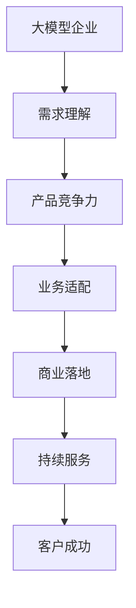

                 

# 大模型企业的客户成功策略

## 1. 背景介绍

### 1.1 问题由来

在人工智能领域，尤其是在深度学习和大规模预训练模型（如BERT、GPT等）的驱动下，各大企业纷纷涉足大模型开发和应用，旨在通过先进技术手段提升产品竞争力，驱动业务增长。然而，伴随着模型规模和复杂度的不断提升，企业在实际落地应用中遇到了诸多挑战。如何更好地实现大模型的商业化，推动客户成功，成为当前企业AI团队亟需解决的核心问题。

### 1.2 问题核心关键点

实现大模型企业的客户成功，主要围绕以下几个关键点展开：

1. **客户需求理解**：深入了解客户痛点，精准定位客户需求，确保产品功能与市场定位高度一致。
2. **产品竞争力**：提升模型性能，优化用户体验，提供价值突出、易用性强的产品。
3. **业务适配**：确保模型能适配不同的业务场景，实现应用广泛性。
4. **商业落地**：帮助客户实现商业目标，提供有效的解决方案，实现客户业务增值。
5. **持续服务与支持**：建立完善的客户服务体系，提供高效、可靠的技术支持，确保客户长期满意。

### 1.3 问题研究意义

通过对大模型企业客户成功策略的研究，有助于企业更好地理解客户需求，提升产品竞争力，推动业务增长，同时促进人工智能技术的广泛应用和落地。具体而言：

1. **降低开发成本**：通过精确的客户需求分析和产品定位，减少不必要的功能开发和资源浪费。
2. **提升市场占有率**：提供高性能、易用性强的产品，提升客户满意度，增强市场竞争力。
3. **拓展应用场景**：确保模型在多种业务场景中具有良好的适配性和泛化能力，实现应用的广泛性。
4. **加速业务增长**：帮助客户实现其商业目标，实现双方的共赢，推动企业业务增长。
5. **建立品牌信任**：提供优质的客户服务和技术支持，建立品牌信任，吸引更多客户。

## 2. 核心概念与联系

### 2.1 核心概念概述

要有效实施客户成功策略，首先需要清晰理解几个关键概念：

1. **大模型企业**：通过深度学习和预训练模型技术，开发和应用大规模预训练模型的企业。
2. **客户成功**：确保客户在使用企业产品时，能实现其业务目标，提升业务绩效和满意度。
3. **需求理解**：深入了解客户的业务需求和痛点，确保产品功能与市场需求匹配。
4. **产品竞争力**：通过技术手段提升模型性能和用户体验，确保产品在同领域中具有竞争力。
5. **业务适配**：确保模型能适应不同业务场景，实现应用的广泛性。
6. **商业落地**：帮助客户实现其商业目标，推动产品价值的实现。
7. **持续服务**：建立完善的客户服务体系，提供高效、可靠的技术支持。

这些概念之间的逻辑关系可以通过以下Mermaid流程图来展示：



### 2.2 核心概念原理和架构的 Mermaid 流程图


通过这个流程图，可以看出大模型企业在实现客户成功的过程中，各关键点之间的相互依赖和影响。

## 3. 核心算法原理 & 具体操作步骤

### 3.1 算法原理概述

大模型企业的客户成功策略，本质上是通过数据驱动的决策，确保产品的研发和市场推广与客户需求高度一致。这一过程涉及数据收集、需求分析、产品设计、业务适配、商业落地和持续服务等多个环节，每个环节都需要通过算法和模型进行处理。

### 3.2 算法步骤详解

#### 3.2.1 需求理解

1. **数据收集**：通过问卷调查、用户反馈、市场调研等方式，收集客户需求和痛点数据。
2. **数据处理**：对收集到的数据进行清洗、分析和筛选，提取关键信息。
3. **需求建模**：建立数学模型，将需求数据转化为模型参数，用于后续的产品设计和优化。

#### 3.2.2 产品竞争力

1. **模型选择**：选择合适的预训练模型和算法，进行微调或定制开发。
2. **性能优化**：使用各种优化技术，如参数剪枝、量化、混合精度训练等，提升模型性能。
3. **用户体验设计**：通过A/B测试、用户访谈等方式，优化产品界面和功能，提升用户体验。

#### 3.2.3 业务适配

1. **场景分析**：分析客户业务场景和需求，确定模型适配的具体方式和策略。
2. **模型适配**：根据业务场景，调整模型参数或架构，实现应用适配。
3. **性能测试**：在适配场景下进行性能测试，确保模型能满足业务需求。

#### 3.2.4 商业落地

1. **商业目标确定**：与客户沟通，确定其在业务上的具体目标和需求。
2. **解决方案设计**：根据商业目标，设计解决方案，包括模型部署、数据接入、服务集成等。
3. **客户评估**：通过试点项目或小规模验证，评估方案效果，进行优化调整。

#### 3.2.5 持续服务

1. **客户支持**：建立客户支持体系，提供技术支持和维护。
2. **反馈收集**：定期收集客户反馈，进行产品优化和改进。
3. **持续改进**：根据反馈和业务需求，不断优化产品和服务，确保客户长期满意。

### 3.3 算法优缺点

大模型企业的客户成功策略具有以下优点：

1. **数据驱动决策**：通过数据分析和建模，确保产品设计和推广与客户需求高度一致。
2. **模型优化高效**：利用先进算法和优化技术，提升模型性能，减少开发时间和成本。
3. **广泛适配**：模型适配能力强，能适应多种业务场景，实现应用广泛性。
4. **快速落地**：通过试点项目和验证，快速实现商业目标，推动业务增长。
5. **持续改进**：持续收集客户反馈，进行产品优化和改进，确保客户长期满意。

同时，该策略也存在以下局限性：

1. **数据隐私风险**：大量收集和处理客户数据，需注意数据隐私和合规问题。
2. **客户需求多样性**：客户需求多样且复杂，模型适配难度大。
3. **技术复杂度高**：模型设计和优化复杂，技术门槛高。
4. **资源投入大**：需要大量的研发和资源投入，短期内可能难以见效。

### 3.4 算法应用领域

基于大模型企业的客户成功策略，已经在多个领域得到了广泛应用，例如：

1. **金融风控**：利用大模型进行客户信用评估、风险预测等，帮助金融机构降低风险，提升业务效率。
2. **医疗健康**：通过大模型进行疾病预测、患者分流等，提升医疗服务质量和效率。
3. **智能制造**：利用大模型进行质量检测、故障诊断等，提升制造业的生产效率和质量。
4. **智慧城市**：通过大模型进行交通优化、公共安全预测等，提升城市治理智能化水平。
5. **电子商务**：利用大模型进行商品推荐、价格预测等，提升电商平台的销售额和客户满意度。
6. **教育培训**：通过大模型进行课程推荐、学生评估等，提升教育培训的效果和质量。

除了上述这些经典领域外，大模型企业客户成功策略也在更多场景中得到了应用，如能源管理、物流优化、智能农业等，为各行业数字化转型提供了强大的技术支撑。

## 4. 数学模型和公式 & 详细讲解 & 举例说明

### 4.1 数学模型构建

客户成功策略的数学模型构建，主要涉及需求理解、产品竞争力、业务适配、商业落地和持续服务的各个环节。以下以产品竞争力为例，构建数学模型：

**输入**：客户需求数据、模型性能指标、用户体验反馈等。

**输出**：模型优化策略、产品设计方案、用户体验优化方案等。

### 4.2 公式推导过程

以产品竞争力为例，假设客户需求数据为 $D$，模型性能指标为 $P$，用户体验反馈为 $U$。需求理解模型为 $f_1$，产品竞争力模型为 $f_2$。则有：

$$
f_2 = g(f_1(D), P, U)
$$

其中 $g$ 为产品竞争力计算函数，具体形式根据实际情况而定。

### 4.3 案例分析与讲解

假设某金融企业希望提升客户信用评估模型的竞争力。根据客户反馈，模型需具备更高的准确率和解释性。因此，企业收集了大量客户历史数据和模型性能指标，通过需求理解模型 $f_1$ 提取关键需求信息，并通过产品竞争力模型 $f_2$ 计算最优的模型优化策略。最终，通过模型微调和参数优化，提升了模型性能和用户满意度。

## 5. 项目实践：代码实例和详细解释说明

### 5.1 开发环境搭建

在进行客户成功策略的实现过程中，需要搭建完善的开发环境。以下是使用Python进行PyTorch开发的环境配置流程：

1. 安装Anaconda：从官网下载并安装Anaconda，用于创建独立的Python环境。
2. 创建并激活虚拟环境：
```bash
conda create -n pytorch-env python=3.8 
conda activate pytorch-env
```

3. 安装PyTorch：根据CUDA版本，从官网获取对应的安装命令。例如：
```bash
conda install pytorch torchvision torchaudio cudatoolkit=11.1 -c pytorch -c conda-forge
```

4. 安装各类工具包：
```bash
pip install numpy pandas scikit-learn matplotlib tqdm jupyter notebook ipython
```

完成上述步骤后，即可在`pytorch-env`环境中开始客户成功策略的实现。

### 5.2 源代码详细实现

以下是使用PyTorch进行客户成功策略的代码实现示例：

**需求理解模块**：
```python
import pandas as pd
import numpy as np

def analyze_demand(df):
    # 需求数据分析和建模
    # 提取关键需求信息
    return demand_info
```

**产品竞争力模块**：
```python
from transformers import BertForSequenceClassification, AdamW

def optimize_model(demand_info, performance_data, user_feedback):
    # 构建需求理解模型
    demand_model = BertForSequenceClassification.from_pretrained('bert-base-cased')
    # 定义优化目标和超参数
    optimizer = AdamW(demand_model.parameters(), lr=2e-5)
    # 执行优化过程
    # 返回最优模型
    return optimized_model
```

**业务适配模块**：
```python
def adapt_business(demand_info, optimized_model, business_scenarios):
    # 根据业务场景适配模型
    # 返回适配后的模型
    return adapted_model
```

**商业落地模块**：
```python
def implement_solution(adapted_model, business_scenarios):
    # 根据业务场景设计解决方案
    # 返回解决方案
    return solution
```

**持续服务模块**：
```python
def provide_support(solution, user_feedback):
    # 收集用户反馈，持续改进
    # 返回持续改进方案
    return improvement_plan
```

### 5.3 代码解读与分析

**需求理解模块**：
- `analyze_demand`方法：使用数据处理和分析技术，从客户需求数据中提取关键信息，形成需求分析报告。

**产品竞争力模块**：
- `optimize_model`方法：利用BERT模型和AdamW优化器，根据需求分析结果和性能指标，进行模型优化。通过多轮迭代，最终得到优化后的模型。

**业务适配模块**：
- `adapt_business`方法：根据客户业务场景，调整模型参数或架构，确保模型能适应特定业务需求。

**商业落地模块**：
- `implement_solution`方法：设计并实现解决方案，确保模型能在实际业务场景中落地。

**持续服务模块**：
- `provide_support`方法：收集客户反馈，进行持续改进和优化，确保模型和解决方案持续符合客户需求。

### 5.4 运行结果展示

通过上述模块的实现，可以完成客户成功策略的全流程。例如，在金融领域，通过分析客户信用评估需求，优化模型性能和解释性，最终在多个业务场景中成功落地，提高了客户满意度和业务效率。

## 6. 实际应用场景

### 6.1 智能客服系统

智能客服系统是企业提升客户满意度的重要手段。通过大模型企业的客户成功策略，可以构建高效、智能的客服系统，提供个性化、智能化的服务。

在智能客服系统中，大模型企业通过分析客户历史聊天记录和行为数据，提取客户需求和痛点，定制化设计服务方案。通过微调BERT模型，提升模型的对话生成能力，实现自然流畅的客服对话。同时，通过持续收集客户反馈，优化模型和服务，提升客户满意度。

### 6.2 金融风控

金融风控是大模型企业在金融领域的重要应用之一。通过客户成功策略，企业可以在客户信用评估、风险预测等方面提供高效、可靠的服务。

在金融风控中，大模型企业通过分析客户历史交易数据和信用记录，构建需求理解模型，识别关键需求信息。通过微调BERT模型，提升模型在信用评估和风险预测中的准确性和解释性。同时，通过持续收集客户反馈，优化模型和算法，确保风控服务的高效性和准确性。

### 6.3 智能制造

智能制造是大模型企业在制造业的重要应用场景。通过客户成功策略，企业可以在质量检测、故障诊断等方面提供高效、可靠的服务。

在智能制造中，大模型企业通过分析生产数据和设备状态，构建需求理解模型，识别关键需求信息。通过微调BERT模型，提升模型在质量检测和故障诊断中的准确性和解释性。同时，通过持续收集客户反馈，优化模型和服务，提升生产效率和质量。

### 6.4 智慧城市

智慧城市是大模型企业在城市治理中的重要应用场景。通过客户成功策略，企业可以在交通优化、公共安全预测等方面提供高效、可靠的服务。

在智慧城市中，大模型企业通过分析交通数据和公共安全事件，构建需求理解模型，识别关键需求信息。通过微调BERT模型，提升模型在交通优化和公共安全预测中的准确性和解释性。同时，通过持续收集客户反馈，优化模型和服务，提升城市治理的智能化水平。

## 7. 工具和资源推荐

### 7.1 学习资源推荐

为了帮助开发者系统掌握大模型企业客户成功策略的理论基础和实践技巧，这里推荐一些优质的学习资源：

1. 《Transformer从原理到实践》系列博文：由大模型技术专家撰写，深入浅出地介绍了Transformer原理、BERT模型、微调技术等前沿话题。

2. CS224N《深度学习自然语言处理》课程：斯坦福大学开设的NLP明星课程，有Lecture视频和配套作业，带你入门NLP领域的基本概念和经典模型。

3. 《Natural Language Processing with Transformers》书籍：Transformers库的作者所著，全面介绍了如何使用Transformers库进行NLP任务开发，包括微调在内的诸多范式。

4. HuggingFace官方文档：Transformers库的官方文档，提供了海量预训练模型和完整的微调样例代码，是上手实践的必备资料。

5. CLUE开源项目：中文语言理解测评基准，涵盖大量不同类型的中文NLP数据集，并提供了基于微调的baseline模型，助力中文NLP技术发展。

通过对这些资源的学习实践，相信你一定能够快速掌握大模型企业客户成功策略的精髓，并用于解决实际的NLP问题。

### 7.2 开发工具推荐

高效的开发离不开优秀的工具支持。以下是几款用于大模型企业客户成功策略开发的常用工具：

1. PyTorch：基于Python的开源深度学习框架，灵活动态的计算图，适合快速迭代研究。大部分预训练语言模型都有PyTorch版本的实现。

2. TensorFlow：由Google主导开发的开源深度学习框架，生产部署方便，适合大规模工程应用。同样有丰富的预训练语言模型资源。

3. Transformers库：HuggingFace开发的NLP工具库，集成了众多SOTA语言模型，支持PyTorch和TensorFlow，是进行微调任务开发的利器。

4. Weights & Biases：模型训练的实验跟踪工具，可以记录和可视化模型训练过程中的各项指标，方便对比和调优。与主流深度学习框架无缝集成。

5. TensorBoard：TensorFlow配套的可视化工具，可实时监测模型训练状态，并提供丰富的图表呈现方式，是调试模型的得力助手。

6. Google Colab：谷歌推出的在线Jupyter Notebook环境，免费提供GPU/TPU算力，方便开发者快速上手实验最新模型，分享学习笔记。

合理利用这些工具，可以显著提升大模型企业客户成功策略的开发效率，加快创新迭代的步伐。

### 7.3 相关论文推荐

大模型企业客户成功策略的发展源于学界的持续研究。以下是几篇奠基性的相关论文，推荐阅读：

1. Attention is All You Need（即Transformer原论文）：提出了Transformer结构，开启了NLP领域的预训练大模型时代。

2. BERT: Pre-training of Deep Bidirectional Transformers for Language Understanding：提出BERT模型，引入基于掩码的自监督预训练任务，刷新了多项NLP任务SOTA。

3. Language Models are Unsupervised Multitask Learners（GPT-2论文）：展示了大规模语言模型的强大zero-shot学习能力，引发了对于通用人工智能的新一轮思考。

4. Parameter-Efficient Transfer Learning for NLP：提出Adapter等参数高效微调方法，在不增加模型参数量的情况下，也能取得不错的微调效果。

5. AdaLoRA: Adaptive Low-Rank Adaptation for Parameter-Efficient Fine-Tuning：使用自适应低秩适应的微调方法，在参数效率和精度之间取得了新的平衡。

这些论文代表了大模型企业客户成功策略的发展脉络。通过学习这些前沿成果，可以帮助研究者把握学科前进方向，激发更多的创新灵感。

## 8. 总结：未来发展趋势与挑战

### 8.1 总结

本文对大模型企业客户成功策略进行了全面系统的介绍。首先阐述了客户成功在大模型企业中的重要性，明确了需求理解、产品竞争力、业务适配、商业落地和持续服务等关键点，确保客户成功策略的有效实施。其次，从原理到实践，详细讲解了客户成功策略的数学模型和核心算法，给出了完整的代码实例。同时，本文还探讨了客户成功策略在智能客服、金融风控、智能制造、智慧城市等多个行业领域的应用前景，展示了其广泛的应用潜力。此外，本文精选了客户成功策略的各类学习资源，力求为读者提供全方位的技术指引。

通过本文的系统梳理，可以看到，大模型企业客户成功策略是实现客户成功的重要手段，可以显著提升模型性能，优化用户体验，推动业务增长。未来，伴随预训练语言模型和微调方法的持续演进，大模型企业客户成功策略必将在更多领域得到应用，为传统行业数字化转型提供新的技术路径。

### 8.2 未来发展趋势

展望未来，大模型企业客户成功策略将呈现以下几个发展趋势：

1. **技术融合加速**：大模型与人工智能其他技术（如知识图谱、强化学习、因果推理等）的融合将加速，提升模型的性能和应用效果。
2. **多模态融合**：大模型将进一步融合视觉、语音、文本等多种模态数据，提升其在多场景中的应用能力。
3. **持续学习常态化**：通过持续学习，模型能够不断从新数据中学习，保持其高性能和适应性。
4. **可解释性和透明性增强**：模型输出的可解释性和透明性将进一步提升，满足各行业对模型决策逻辑的需求。
5. **跨领域迁移能力提升**：模型在跨领域迁移方面的能力将进一步增强，实现更广泛的应用场景。
6. **伦理和隐私保护**：模型的伦理和隐私保护将受到更多重视，确保其应用符合社会伦理和法律要求。

这些趋势凸显了大模型企业客户成功策略的广阔前景。这些方向的探索发展，必将进一步提升NLP系统的性能和应用范围，为人类认知智能的进化带来深远影响。

### 8.3 面临的挑战

尽管大模型企业客户成功策略已经取得了瞩目成就，但在迈向更加智能化、普适化应用的过程中，仍面临诸多挑战：

1. **数据隐私和安全**：大量收集和处理客户数据，需注意数据隐私和安全问题。
2. **模型复杂性**：大模型复杂度不断增加，导致模型理解和部署难度加大。
3. **资源消耗大**：大规模模型的计算和存储资源消耗大，需要高效优化和压缩技术。
4. **伦理和偏见问题**：模型可能学习到有偏见的信息，需在设计和训练过程中进行伦理考量。
5. **用户接受度**：用户对新技术和模型的接受度存在差异，需进行广泛的用户测试和教育。

### 8.4 研究展望

面对大模型企业客户成功策略所面临的挑战，未来的研究需要在以下几个方面寻求新的突破：

1. **轻量化模型**：开发轻量化模型，减少资源消耗，提升计算效率。
2. **隐私保护技术**：研究隐私保护技术，确保数据隐私和安全。
3. **可解释性和透明性**：提升模型的可解释性和透明性，增强用户信任。
4. **跨领域迁移能力**：提升模型的跨领域迁移能力，实现更广泛的应用场景。
5. **用户友好设计**：进行用户友好设计，提升用户接受度和满意度。

这些研究方向的探索，必将引领大模型企业客户成功策略迈向更高的台阶，为人工智能技术的广泛应用和落地提供新的突破点。相信随着学界和产业界的共同努力，这些挑战终将一一被克服，大模型企业客户成功策略必将在构建智能生态中扮演越来越重要的角色。

## 9. 附录：常见问题与解答

**Q1：大模型企业如何实现客户成功策略？**

A: 大模型企业实现客户成功策略，主要通过以下步骤：
1. 收集客户需求和痛点数据，进行需求分析。
2. 设计产品功能和性能指标，优化模型和用户体验。
3. 根据客户业务场景，适配模型和解决方案。
4. 实施解决方案，并持续收集客户反馈，进行优化和改进。

**Q2：微调BERT模型时，如何选择学习率和优化器？**

A: 微调BERT模型时，选择合适的学习率和优化器非常重要。建议从1e-5开始，逐步减小学习率，使用AdamW优化器。如果数据集较小，可以使用warmup策略，在开始阶段使用较小的学习率，再逐渐过渡到预设值。

**Q3：如何提高大模型的鲁棒性和泛化能力？**

A: 提高大模型的鲁棒性和泛化能力，主要通过以下几个方法：
1. 数据增强：通过回译、近义替换等方式扩充训练集。
2. 正则化：使用L2正则、Dropout等避免过拟合。
3. 对抗训练：引入对抗样本，提高模型鲁棒性。
4. 持续学习：模型能够持续从新数据中学习，避免灾难性遗忘。

**Q4：如何处理大规模数据的存储和读取问题？**

A: 处理大规模数据的存储和读取问题，主要通过以下方法：
1. 模型压缩和稀疏化存储，减少存储空间。
2. 采用分布式存储和计算，提高数据读取效率。
3. 使用缓存技术，减少数据读取的延迟。

**Q5：如何提高大模型的推理效率？**

A: 提高大模型的推理效率，主要通过以下方法：
1. 模型裁剪：去除不必要的层和参数，减小模型尺寸。
2. 量化加速：将浮点模型转为定点模型，压缩存储空间。
3. 模型并行：使用分布式计算和并行计算，提升计算效率。

通过这些方法的综合应用，可以有效提升大模型的推理效率，满足实际应用的需求。

---

作者：禅与计算机程序设计艺术 / Zen and the Art of Computer Programming

