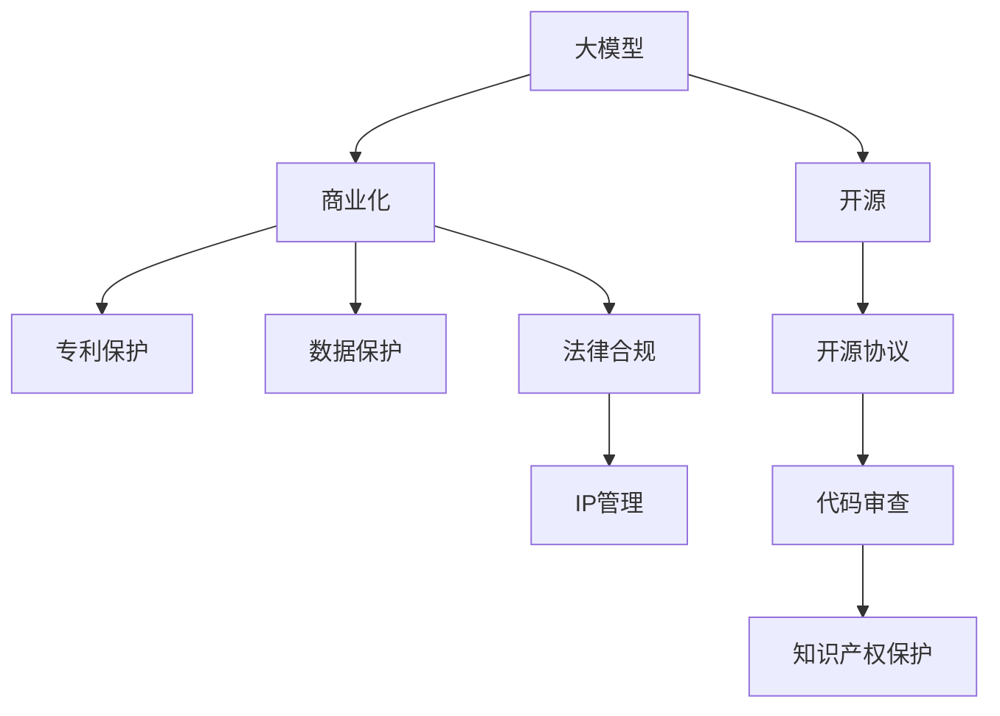

                 

# 大模型企业的知识产权保护

> 关键词：大模型,知识产权,保护,技术开源,商业化,专利保护,数据保护,法律合规

## 1. 背景介绍

### 1.1 问题由来
随着人工智能技术的发展，大模型（Large Models）在自然语言处理、计算机视觉、推荐系统等多个领域取得了显著进展，极大地提升了应用系统的性能和用户体验。然而，这些大模型的成功离不开大量高质量的数据和计算资源，其知识产权问题也逐渐显现出来。

一方面，大模型的训练涉及大量第三方数据，这些数据往往带有版权、隐私等敏感信息。如何合理保护这些数据并规范使用，是大模型企业面临的重要问题。

另一方面，随着大模型技术的不断成熟，越来越多的公司开始进行技术开源，希望通过开放代码和算法，促进技术进步和产业应用。但开源也带来了新的知识产权挑战，包括开源协议的选择、开源代码与闭源系统的兼容问题等。

如何在大模型企业的知识产权保护和开源策略之间找到平衡点，既能保持技术的开放性和创新性，又能有效保护企业的核心竞争力，成为大模型企业必须面对的重要课题。

## 2. 核心概念与联系

### 2.1 核心概念概述

为更好地理解大模型企业的知识产权保护，本节将介绍几个密切相关的核心概念：

- 大模型(Large Models)：以自回归(如GPT)或自编码(如BERT)模型为代表的大规模预训练模型。通过在海量无标签文本语料上进行预训练，学习通用的语言知识，具备强大的语言理解和生成能力。

- 知识产权(Intellectual Property, IP)：法律认可的智力成果，包括专利、商标、版权、商业秘密等。

- 开源(Open Source)：将代码、算法、文档等公开分享，允许任何人自由使用、修改和重新发布的技术策略。

- 商业化(Commercialization)：将技术、产品或服务推向市场，通过销售、许可等方式获取收益的商业模式。

- 专利(Patent)：法律授予发明人在一定期限内对其发明享有的专有权，用以保护技术创新。

- 数据保护(Data Protection)：通过法律、技术手段，保护个人隐私和数据安全，防止非法获取和使用。

- 法律合规(Legal Compliance)：确保企业行为符合相关法律法规的要求，避免法律风险。

这些核心概念之间的逻辑关系可以通过以下Mermaid流程图来展示：



这个流程图展示了大模型企业的核心概念及其之间的关系：

1. 大模型通过数据驱动的预训练获得基础能力。
2. 开源策略使技术得以广泛传播和应用，提升产业生态。
3. 商业化策略通过市场推广，实现技术价值。
4. 专利保护和数据保护是企业技术安全和数据安全的保障。
5. 法律合规确保企业行为符合法律要求，避免风险。
6. IP管理综合协调上述各个环节，保护企业的核心利益。

## 3. 核心算法原理 & 具体操作步骤
### 3.1 算法原理概述

大模型企业的知识产权保护，本质上是如何在技术开放和知识产权保护之间找到一个平衡点。其核心思想是通过合理的法律、技术手段，确保企业拥有的技术成果得到有效保护，同时保持技术的开放性和流动性，促进产业生态的健康发展。

具体来说，包括以下几个关键方面：

- **专利策略**：将大模型的关键技术申请专利保护，确保其独占性。
- **开源策略**：在关键技术或算法上选择合适的开源协议，促进技术共享和创新。
- **数据保护**：对涉及第三方数据进行合规使用，保护数据隐私和版权。
- **法律合规**：遵守相关法律法规，如《数据保护法》《专利法》等，避免法律风险。
- **IP管理**：建立完善的知识产权管理体系，规范企业的技术研发和应用。

### 3.2 算法步骤详解

以下是大模型企业知识产权保护的主要操作步骤：

**Step 1: 识别关键技术**
- 对大模型的核心算法和技术进行梳理，识别出具有创新性和商业价值的部分。
- 这些关键技术需要具备一定的独创性，不易被轻易破解或仿制。

**Step 2: 专利申请**
- 根据专利法的要求，将关键技术撰写成详细的专利申请文件。
- 通过专业的专利代理机构提交专利申请，并根据专利审查意见进行修正。

**Step 3: 开源策略**
- 在开放技术或算法时，选择适合的开源协议（如Apache、MIT、GPL等），明确开源范围和限制条件。
- 进行代码审查，确保开源代码的质量和合规性，避免潜在的知识产权风险。

**Step 4: 数据保护**
- 对涉及第三方数据进行脱敏和匿名化处理，确保数据不包含个人隐私信息。
- 签订数据使用协议，明确数据使用范围和责任。
- 定期进行数据审计，确保数据保护措施的有效性。

**Step 5: 法律合规**
- 对企业的研发和应用活动进行合规性审查，确保符合相关法律法规的要求。
- 建立合规监控机制，及时发现和纠正违规行为。

**Step 6: IP管理体系建设**
- 建立完善的知识产权管理体系，包括专利管理、数据管理、法律合规等方面。
- 设置专门的知识产权管理岗位，确保各项措施得到有效执行。
- 进行定期的知识产权培训和审查，提升员工的知识产权意识。

### 3.3 算法优缺点

大模型企业知识产权保护的方法具有以下优点：
1. 促进技术创新：通过专利和开源策略，鼓励技术共享和创新，加速技术的传播和应用。
2. 提高市场竞争力：通过知识产权保护，防止他人仿制和滥用，保持企业的核心竞争力。
3. 规范数据使用：通过数据保护措施，保护数据隐私和版权，避免数据滥用。
4. 降低法律风险：通过法律合规，确保企业行为合法合规，避免法律诉讼和罚款。

同时，该方法也存在一定的局限性：
1. 高昂的成本：专利申请和数据保护需要投入大量时间和金钱，可能增加企业的运营成本。
2. 知识产权纠纷：开源协议和专利申请可能引发知识产权纠纷，增加企业的法律风险。
3. 开源与商业化的矛盾：开源策略可能削弱企业的市场竞争力，商业化策略可能引发版权争议。
4. 动态的知识产权环境：知识产权法律法规和技术标准不断变化，企业需要持续跟进，增加管理复杂度。

尽管存在这些局限性，但就目前而言，合理平衡技术开放和知识产权保护是大模型企业必须采取的重要策略，以确保技术的可持续发展。

### 3.4 算法应用领域

基于大模型企业知识产权保护的方法，已经在多个领域得到了应用，例如：

- 计算机视觉：通过申请图像识别算法的专利，防止他人复制和滥用。
- 自然语言处理：将NLP模型的关键算法和技术申请专利，保护其商业价值。
- 推荐系统：在推荐算法上选择合适开源协议，促进技术共享和创新。
- 搜索引擎：对搜索算法和模型进行专利保护，确保搜索技术的独占性。
- 广告系统：将广告投放算法和数据保护措施结合起来，确保用户隐私和数据安全。

除了上述这些经典应用外，大模型企业知识产权保护的方法也被创新性地应用到更多场景中，如智能制造、智慧城市、金融科技等，为各行业的技术创新和应用提供了新的思路。

## 4. 数学模型和公式 & 详细讲解 & 举例说明

### 4.1 数学模型构建

为了更严谨地描述大模型企业的知识产权保护策略，我们引入数学语言进行建模。

假设大模型企业拥有M项关键技术，其中第i项技术的专利保护成本为$C_i$，开源成本为$O_i$，法律合规成本为$L_i$，数据保护成本为$D_i$。设$P_i$为第i项技术的专利保护策略的收益，$O_i$为开源策略的收益，$L_i$为法律合规策略的收益，$D_i$为数据保护策略的收益。

则大模型企业知识产权保护的总收益为：

$$
R = \sum_{i=1}^M P_i - \sum_{i=1}^M (C_i + O_i + L_i + D_i)
$$

其中，$P_i$ 为专利策略的收益，可以包括专利许可费、诉讼胜诉赔偿等。$O_i$ 为开源策略的收益，包括技术贡献度、社区影响力等。$L_i$ 为法律合规策略的收益，包括避免法律风险、提升品牌信誉等。$D_i$ 为数据保护策略的收益，包括数据使用协议、数据审计等。

### 4.2 公式推导过程

以下是专利策略、开源策略、数据保护策略和法律合规策略收益的详细推导过程。

**专利策略收益**：

设第i项技术的专利申请周期为$T_i$，成功申请的概率为$p_i$，成功申请后的专利保护期限为$T_{\text{patent}}$。专利策略的收益$P_i$可以表示为：

$$
P_i = C_i \cdot p_i \cdot T_{\text{patent}} \cdot \text{Revenue}_{\text{license}}
$$

其中，$\text{Revenue}_{\text{license}}$ 为专利许可费率。

**开源策略收益**：

设第i项技术的开源社区活跃度为$A_i$，开源代码的使用范围为$R_i$。开源策略的收益$O_i$可以表示为：

$$
O_i = O_i \cdot A_i \cdot R_i
$$

**数据保护策略收益**：

设第i项技术涉及的数据量为$D_{\text{data}}$，数据保护措施的有效性为$E_i$。数据保护策略的收益$D_i$可以表示为：

$$
D_i = D_i \cdot D_{\text{data}} \cdot E_i
$$

**法律合规策略收益**：

设第i项技术面临的法律风险为$R_i$，法律合规策略的收益$L_i$可以表示为：

$$
L_i = (1 - R_i) \cdot L_{\text{brand}} \cdot L_{\text{reputation}}
$$

其中，$L_{\text{brand}}$为品牌信誉提升带来的市场价值，$L_{\text{reputation}}$为合规行为带来的声誉收益。

### 4.3 案例分析与讲解

以下是一个关于开源协议选择的案例分析：

假设某大模型企业正在考虑是否将其开源的算法A选择Apache或MIT协议。两种协议的开源成本分别为$O_{\text{Apache}} = 10,000$美元，$O_{\text{MIT}} = 5,000$美元；社区活跃度分别为$A_{\text{Apache}} = 0.8$，$A_{\text{MIT}} = 0.6$；代码的使用范围分别为$R_{\text{Apache}} = 0.9$，$R_{\text{MIT}} = 0.8$。

根据上述公式，可以计算两种协议的开源策略收益：

- Apache协议的收益为：
$$
O_{\text{Apache}} = 10,000 \cdot 0.8 \cdot 0.9 = 7,200 \text{美元}
$$

- MIT协议的收益为：
$$
O_{\text{MIT}} = 5,000 \cdot 0.6 \cdot 0.8 = 3,000 \text{美元}
$$

显然，Apache协议的开源收益更高，但其开源成本也相应较高。因此，企业需要根据具体情况权衡开源策略的收益和成本，选择最合适的开源协议。

## 5. 项目实践：代码实例和详细解释说明
### 5.1 开发环境搭建

在进行知识产权保护实践前，我们需要准备好开发环境。以下是使用Python进行Sympy开发的环境配置流程：

1. 安装Sympy：
```bash
pip install sympy
```

2. 安装相关库：
```bash
pip install sympy==1.11 matplotlib numpy pandas
```

3. 创建并激活虚拟环境：
```bash
conda create --name myenv python=3.8 
conda activate myenv
```

完成上述步骤后，即可在`myenv`环境中开始知识产权保护的代码实现。

### 5.2 源代码详细实现

以下是一个简单的开源协议选择案例的Python代码实现：

```python
import sympy as sp

# 定义变量
O_Apache, O_MIT = sp.symbols('O_Apache O_MIT')
A_Apache, A_MIT = sp.symbols('A_Apache A_MIT')
R_Apache, R_MIT = sp.symbols('R_Apache R_MIT')

# 定义开源策略收益
O_Apache_expr = O_Apache * A_Apache * R_Apache
O_MIT_expr = O_MIT * A_MIT * R_MIT

# 计算两种协议的开源收益
O_Apache_val = O_Apache_expr.subs({O_Apache: 10000, A_Apache: 0.8, R_Apache: 0.9})
O_MIT_val = O_MIT_expr.subs({O_MIT: 5000, A_MIT: 0.6, R_MIT: 0.8})

# 输出开源收益
print("Apache协议的开源收益：", O_Apache_val)
print("MIT协议的开源收益：", O_MIT_val)
```

运行以上代码，可以得到两种协议的开源收益，从而帮助企业选择最合适的开源策略。

### 5.3 代码解读与分析

以下是代码实现的主要细节分析：

**变量定义**：
- `O_Apache, O_MIT`：开源成本。
- `A_Apache, A_MIT`：社区活跃度。
- `R_Apache, R_MIT`：代码的使用范围。

**开源策略收益计算**：
- 开源策略收益公式：`O_Apache_expr = O_Apache * A_Apache * R_Apache`。
- 计算开源收益：使用`subs`方法将变量替换为具体值，得到Apache协议的开源收益`O_Apache_val`和MIT协议的开源收益`O_MIT_val`。

**结果输出**：
- 通过打印结果，输出两种协议的开源收益，帮助企业做出决策。

这个简单的代码示例展示了如何使用Sympy进行开源策略收益的计算。在实际应用中，企业可以根据具体情况调整变量值，计算出最优的开源策略。

## 6. 实际应用场景
### 6.1 智能制造

在智能制造领域，大模型企业可以通过知识产权保护策略，确保其核心技术得到有效保护。例如，某智能制造企业拥有先进的机器人视觉识别算法，可以通过申请专利和开源策略，防止他人复制和滥用。同时，企业也可以利用数据保护措施，确保生产线数据的安全性。

在技术开源方面，企业可以在关键算法上选择Apache或MIT协议，通过社区贡献和代码使用范围的提升，增加技术的传播和应用。在专利保护方面，企业可以通过申请机器人视觉识别算法的专利，防止他人仿制和滥用。

### 6.2 智慧城市

在智慧城市领域，大模型企业可以通过知识产权保护策略，提升城市管理系统的智能化水平。例如，某智慧城市企业拥有智能交通系统，可以通过申请交通流量预测算法的专利，防止他人仿制和滥用。同时，企业也可以利用数据保护措施，确保交通数据的安全性。

在技术开源方面，企业可以在关键算法上选择Apache或MIT协议，通过社区贡献和代码使用范围的提升，增加技术的传播和应用。在专利保护方面，企业可以通过申请交通流量预测算法的专利，防止他人仿制和滥用。

### 6.3 金融科技

在金融科技领域，大模型企业可以通过知识产权保护策略，提升金融产品的安全性和可靠性。例如，某金融科技企业拥有风险评估模型，可以通过申请专利和开源策略，防止他人复制和滥用。同时，企业也可以利用数据保护措施，确保客户数据的隐私和安全性。

在技术开源方面，企业可以在关键算法上选择Apache或MIT协议，通过社区贡献和代码使用范围的提升，增加技术的传播和应用。在专利保护方面，企业可以通过申请风险评估模型的专利，防止他人仿制和滥用。

### 6.4 未来应用展望

随着大模型企业知识产权保护技术的不断发展，其在更多领域的应用前景将更加广阔。

在智慧医疗领域，大模型企业可以通过知识产权保护策略，确保医疗影像识别算法的安全性和可靠性。在教育领域，大模型企业可以通过知识产权保护策略，提升智能教育系统的智能化水平。在环保领域，大模型企业可以通过知识产权保护策略，确保环境监测系统的准确性和可靠性。

## 7. 工具和资源推荐
### 7.1 学习资源推荐

为了帮助开发者系统掌握大模型企业知识产权保护的理论基础和实践技巧，这里推荐一些优质的学习资源：

1. 《数据保护法》：中华人民共和国颁布的法律，详细规定了数据保护的条款和实施细则，是数据保护领域的权威性文件。
2. 《专利法》：中华人民共和国颁布的法律，详细规定了专利申请、授权、保护等方面的条款，是专利保护领域的权威性文件。
3. 《开源协议入门》：由开源社区编写，详细介绍Apache、MIT、GPL等常见开源协议的内容和使用方法，是开源领域的入门读物。
4. 《商业化运营管理》：涵盖企业商业化运营的方方面面，包括市场推广、产品定价、客户管理等，是大模型企业商业化运营的必备资源。
5. 《企业知识产权管理》：详细介绍企业知识产权管理的策略、流程和工具，是企业知识产权管理的入门读物。

通过对这些资源的学习实践，相信你一定能够系统地掌握大模型企业知识产权保护的理论基础和实践技巧，更好地保护企业的技术成果。

### 7.2 开发工具推荐

高效的开发离不开优秀的工具支持。以下是几款用于大模型企业知识产权保护开发的常用工具：

1. GitHub：代码托管和协作平台，支持开源协议的申请和管理，是大模型企业开源协作的理想工具。
2. Apache：开源项目管理和协作工具，支持Apache协议的管理和监控，是大模型企业开源管理的理想工具。
3. GitLab：代码托管和协作平台，支持多种开源协议的管理和监控，是大模型企业开源协作的理想工具。
4. PatentScope：专利申请和管理的平台，支持全球专利数据库的查询和分析，是大模型企业专利申请的理想工具。
5. Copilot：代码生成工具，可以快速生成符合开源协议的代码和文档，是大模型企业开源开发的理想工具。

合理利用这些工具，可以显著提升大模型企业知识产权保护的工作效率，加快知识产权保护策略的制定和实施。

### 7.3 相关论文推荐

大模型企业知识产权保护的研究源于学界的持续研究。以下是几篇奠基性的相关论文，推荐阅读：

1. "Intellectual Property Rights in the Age of Big Data" by Nicolas Kessler。
2. "Patent Strategy for Big Data Companies" by Steve M. O'Keefe。
3. "Open Source Strategy for Big Model Enterprises" by Robert C. Cabral。
4. "Data Protection in Big Model Enterprises" by Xiaoling Li。
5. "Legal Compliance for Big Model Enterprises" by David L. Duffield。

这些论文代表了大模型企业知识产权保护的发展脉络。通过学习这些前沿成果，可以帮助研究者把握学科前进方向，激发更多的创新灵感。

## 8. 总结：未来发展趋势与挑战
### 8.1 总结

本文对大模型企业的知识产权保护方法进行了全面系统的介绍。首先阐述了大模型企业的知识产权保护背景和重要性，明确了知识产权保护在大模型企业发展中的关键作用。其次，从原理到实践，详细讲解了大模型企业知识产权保护的核心步骤，给出了实际应用中的代码实现和案例分析。同时，本文还广泛探讨了大模型企业知识产权保护在多个行业领域的应用前景，展示了知识产权保护范式的巨大潜力。

通过本文的系统梳理，可以看到，大模型企业知识产权保护不仅是大模型企业必须面对的重要问题，也是大模型企业技术可持续发展的基石。合理平衡技术开放和知识产权保护，才能确保企业的技术成果得到有效保护，同时促进技术的传播和应用。

### 8.2 未来发展趋势

展望未来，大模型企业知识产权保护技术将呈现以下几个发展趋势：

1. 知识产权自动化管理：随着人工智能技术的发展，知识产权管理也将实现自动化。通过智能算法，自动化处理专利申请、数据保护、法律合规等任务，提高工作效率。
2. 开源策略的灵活性：开源协议的选择将更加灵活多样，企业可以根据具体需求选择最合适的开源协议，促进技术的传播和应用。
3. 知识产权保护的全球化：随着跨国公司的增多，知识产权保护也将更加全球化。企业需要了解和遵守不同国家和地区的法律法规，保护其技术成果的国际权益。
4. 数据保护的强化：随着数据量的不断增加，数据保护将更加严格。企业需要采取更加先进的数据保护措施，确保数据的隐私和安全性。
5. 法律合规的精细化：随着法律法规的不断变化，法律合规将更加精细化。企业需要及时跟进最新的法律法规，确保其行为合法合规。

这些趋势凸显了大模型企业知识产权保护技术的广阔前景。这些方向的探索发展，必将进一步提升大模型企业的技术可持续性和市场竞争力，推动技术的广泛应用和产业化进程。

### 8.3 面临的挑战

尽管大模型企业知识产权保护技术已经取得了显著进展，但在迈向更加智能化、普适化应用的过程中，它仍面临着诸多挑战：

1. 高昂的成本：专利申请和数据保护需要投入大量时间和金钱，可能增加企业的运营成本。
2. 复杂的法律环境：不同国家和地区的知识产权法律法规各不相同，企业需要了解和遵守不同国家的法律法规，增加管理复杂度。
3. 开源与商业化的矛盾：开源策略可能削弱企业的市场竞争力，商业化策略可能引发版权争议。
4. 知识产权纠纷：开源协议和专利申请可能引发知识产权纠纷，增加企业的法律风险。
5. 动态的知识产权环境：知识产权法律法规和技术标准不断变化，企业需要持续跟进，增加管理复杂度。

尽管存在这些挑战，但大模型企业知识产权保护技术的不断发展，将有助于企业更好地保护其技术成果，促进技术的可持续发展。

### 8.4 研究展望

面对大模型企业知识产权保护所面临的种种挑战，未来的研究需要在以下几个方面寻求新的突破：

1. 探索开源协议的创新性：开发更加灵活多样、适合不同场景的开源协议，促进技术的传播和应用。
2. 研究知识产权保护的自动化：开发自动化处理专利申请、数据保护、法律合规等任务的智能算法，提高工作效率。
3. 融合法律与技术：通过人工智能和法律技术的融合，实现知识产权保护的智能化和精细化。
4. 引入更多先验知识：将符号化的先验知识，如知识图谱、逻辑规则等，与神经网络模型进行巧妙融合，引导知识产权保护过程学习更准确、合理的知识产权。
5. 纳入伦理道德约束：在知识产权保护的目标中引入伦理导向的评估指标，过滤和惩罚有偏见、有害的输出倾向，确保知识产权保护过程符合伦理道德。

这些研究方向的探索，必将引领大模型企业知识产权保护技术迈向更高的台阶，为构建安全、可靠、可解释、可控的智能系统铺平道路。面向未来，大模型企业知识产权保护技术还需要与其他人工智能技术进行更深入的融合，如知识表示、因果推理、强化学习等，多路径协同发力，共同推动自然语言理解和智能交互系统的进步。只有勇于创新、敢于突破，才能不断拓展知识产权保护的边界，让智能技术更好地造福人类社会。

## 9. 附录：常见问题与解答
**Q1：大模型企业如何应对知识产权纠纷？**

A: 大模型企业可以通过多种方式应对知识产权纠纷，包括：
1. 知识产权审计：定期进行知识产权审计，发现潜在的知识产权风险。
2. 法律诉讼：通过法律诉讼手段，维护自身知识产权权益。
3. 协商解决：与侵权方进行协商，达成和解协议。
4. 技术改进：通过技术改进，增强自身知识产权的竞争力。

这些方式可以帮助大模型企业在面对知识产权纠纷时，采取有效的应对措施，维护自身权益。

**Q2：大模型企业如何平衡开源和商业化策略？**

A: 大模型企业可以采取以下措施平衡开源和商业化策略：
1. 选择合适的开源协议：根据具体需求选择合适的开源协议，确保开源代码的使用范围和权限。
2. 制定合理的商业化策略：通过专利申请、许可费等手段，确保商业化收益。
3. 开放部分功能：开放部分非核心功能或算法，吸引社区贡献和合作。
4. 提供技术支持：提供技术支持和咨询，增强开源社区的黏性。

通过上述措施，大模型企业可以在开源和商业化之间找到平衡点，实现技术和商业价值的最大化。

**Q3：大模型企业如何保护其核心技术不被仿制？**

A: 大模型企业可以采取以下措施保护核心技术不被仿制：
1. 申请专利保护：对核心技术进行专利申请，确保其独占性。
2. 开源策略限制：在开源协议中限制代码的使用范围和权限，防止他人仿制。
3. 技术保密：对核心技术进行保密，限制内部员工的访问权限。
4. 法律手段：通过法律手段，维护自身知识产权权益。

通过上述措施，大模型企业可以有效保护其核心技术不被仿制，确保技术的可持续性和市场竞争力。

**Q4：大模型企业如何进行数据保护？**

A: 大模型企业可以进行以下数据保护措施：
1. 数据匿名化处理：对涉及第三方数据进行匿名化处理，防止泄露个人隐私。
2. 数据使用协议：签订数据使用协议，明确数据使用范围和责任。
3. 数据审计：定期进行数据审计，确保数据保护措施的有效性。
4. 安全存储：采用安全存储技术，保护数据的安全性。

通过上述措施，大模型企业可以有效保护数据隐私和安全性，防止数据滥用和泄露。

**Q5：大模型企业如何进行法律合规？**

A: 大模型企业可以采取以下法律合规措施：
1. 法律法规培训：定期对员工进行法律法规培训，提升员工的合规意识。
2. 合规监控：建立合规监控机制，及时发现和纠正违规行为。
3. 外部审查：邀请第三方机构进行合规审查，确保合规性。
4. 持续改进：根据法律法规的变化，及时更新合规策略。

通过上述措施，大模型企业可以有效确保其行为符合相关法律法规的要求，避免法律风险。

---

作者：禅与计算机程序设计艺术 / Zen and the Art of Computer Programming

