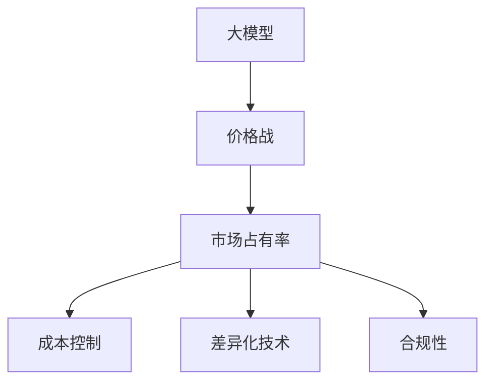

                 

## 1. 背景介绍

### 1.1 问题由来

人工智能(AI)技术的迅猛发展，特别是在大模型（Large Models）领域，使得多个科技巨头纷纷投入巨资开发具有强大计算能力和丰富知识的大模型，如OpenAI的GPT系列、Google的BERT、Microsoft的TuringNMT等。这些大模型在自然语言处理（NLP）、计算机视觉（CV）、语音识别（ASR）等诸多领域展现出了卓越的性能。

然而，随着大模型技术的发展和成熟，各大公司之间的竞争也愈加激烈。在2023年，中国的大模型公司迎来了价格战。这场价格战不仅影响了市场的供需关系，也引发了业界对大模型技术的广泛关注和深入思考。

### 1.2 问题核心关键点

大模型价格战的核心在于竞争策略和市场定位。各大公司通过降低价格，吸引更多的用户和企业使用其大模型服务，试图通过规模效应和市场占有率提升来获取竞争优势。这种竞争策略不仅影响了公司的利润率，也对市场健康发展带来了潜在风险。

价格战的关键点包括：
1. 成本控制：如何通过优化内部成本，降低大模型的生产和服务成本，以支撑低价格策略。
2. 用户需求：如何准确把握市场和用户需求，提供符合用户价值的产品和解决方案。
3. 技术优势：如何保持技术领先，通过差异化的技术优势获取市场份额。
4. 合规性：如何在价格战中遵循法律法规，确保公平竞争和数据安全。

## 2. 核心概念与联系

### 2.1 核心概念概述

为更好地理解大模型公司在中国的价格战，本节将介绍几个密切相关的核心概念：

- **大模型（Large Models）**：指具有大规模参数量、高计算能力的深度学习模型，如BERT、GPT、T5等。这些模型通过在大规模无标签数据上进行预训练，学习到丰富的知识，能够进行复杂的高质量推理和生成。

- **价格战（Price War）**：指在激烈的市场竞争中，企业通过降低价格来吸引用户和市场份额的一种竞争策略。大模型公司通过提供较低价格的服务，试图增加用户和订单量。

- **市场占有率（Market Share）**：指一家公司在特定市场中的销售额占总销售额的比例。大模型公司通过价格战来提升市场占有率，增加市场影响力。

- **成本控制（Cost Control）**：指在保持产品质量和服务水平的前提下，通过优化内部流程和资源配置，降低成本，提高盈利能力。

- **差异化技术（Differentiated Technology）**：指通过在技术上保持独特优势，获得用户的认可和忠诚度，避免同质化竞争。

- **合规性（Regulatory Compliance）**：指遵守相关法律法规，确保业务活动合法合规，保护用户隐私和数据安全。

这些核心概念之间的逻辑关系可以通过以下Mermaid流程图来展示：



这个流程图展示了大模型公司的核心概念及其之间的关系：

1. 大模型通过预训练获得基础能力。
2. 价格战策略提升市场占有率，增加用户和订单量。
3. 成本控制优化内部流程，降低生产和服务成本。
4. 差异化技术保持技术优势，避免同质化竞争。
5. 合规性确保业务合法合规，保护数据安全。

## 3. 核心算法原理 & 具体操作步骤

### 3.1 算法原理概述

大模型公司在中国的价格战，本质上是一个竞争策略的制定和实施过程。其核心思想是：通过降低价格，吸引更多用户和企业使用其大模型服务，从而提升市场占有率。

形式化地，假设大模型公司 $C$ 在市场上的初始市场占有率为 $\alpha$，降价后的市场占有率为 $\beta$。则价格战的目标是最大化市场占有率 $\beta$，即：

$$
\max_{p} \beta
$$

其中，$p$ 为降价后的价格，$\beta$ 为市场占有率。

市场占有率 $\beta$ 受多个因素影响，包括降价幅度、用户需求、竞争对手的反应等。大模型公司通过策略选择，优化市场占有率，以实现盈利最大化。

### 3.2 算法步骤详解

大模型公司在中国的价格战一般包括以下几个关键步骤：

**Step 1: 市场调研与需求分析**
- 分析市场需求和用户行为，确定价格战的目标群体和需求。
- 评估竞争对手的市场占有率和价格策略。

**Step 2: 价格策略制定**
- 根据市场需求和用户行为，制定价格策略，包括降价幅度、价格区间等。
- 考虑竞争对手的反应，制定策略以应对可能的反击。

**Step 3: 实施与执行**
- 调整定价策略，发布新的价格计划。
- 实施价格战，监测市场反应和竞争对手的动态。
- 根据市场反馈，调整策略，持续优化。

**Step 4: 效果评估与优化**
- 评估价格战的效果，包括市场占有率、销售额、用户满意度等指标。
- 根据评估结果，进行策略优化，调整价格和市场策略。

### 3.3 算法优缺点

大模型公司在中国的价格战策略具有以下优点：
1. 快速提升市场占有率。通过降价，可以吸引更多的用户和企业，快速提升市场份额。
2. 降低用户获取成本。低价格策略降低了用户的进入门槛，增加了用户粘性。
3. 促进技术创新。在价格战中，公司需要不断优化产品和服务，保持技术领先。

同时，这种策略也存在一定的局限性：
1. 短期盈利受损。降价策略短期内会减少公司利润，影响公司财务健康。
2. 市场竞争加剧。降价可能导致竞争对手的反击，进一步加剧市场竞争。
3. 资源浪费。过度投入资源进行价格战，可能忽视其他更有前景的业务发展。
4. 数据安全风险。低价策略可能带来数据泄露和数据滥用风险。

尽管存在这些局限性，但就目前而言，价格战仍是大模型公司常用的竞争策略之一。未来相关研究的重点在于如何优化价格策略，避免市场过度竞争，同时兼顾长期盈利和数据安全等因素。

### 3.4 算法应用领域

大模型公司在中国的价格战主要应用于以下几个领域：

- **企业服务市场**：如AI开发平台、数据处理、计算服务等。
- **消费者市场**：如AI教育、娱乐、智能家居等。
- **政府和公共服务**：如智慧城市、智能交通、公共安全等。

除了上述这些主要应用领域外，价格战策略还可能在更多领域得到应用，如金融、医疗、教育等。

## 4. 数学模型和公式 & 详细讲解

### 4.1 数学模型构建

本节将使用数学语言对大模型公司在中国的价格战过程进行更加严格的刻画。

假设大模型公司 $C$ 的市场占有率为 $\alpha$，降价后的市场占有率为 $\beta$。假设市场需求函数为 $D(p)$，其中 $p$ 为价格，$D(p)$ 为价格 $p$ 时的市场需求。则市场占有率 $\beta$ 可以表示为：

$$
\beta = \frac{D(p)}{D(p)+D(p')}
$$

其中 $D(p')$ 为竞争对手的价格 $p'$ 时的市场需求。降价后的市场占有率 $\beta$ 和降价幅度 $\Delta p$ 的关系可以通过以下公式描述：

$$
\beta = \alpha \frac{D(p-\Delta p)}{D(p-\Delta p)+D(p')}
$$

在实际应用中，市场需求函数 $D(p)$ 往往需要通过市场调研和数据分析获得。可以通过回归分析、机器学习等方法，建立价格与需求的关系模型。

### 4.2 公式推导过程

假设市场需求函数为线性关系，即 $D(p) = k - \lambda p$，其中 $k$ 为市场总需求，$\lambda$ 为价格弹性系数。则降价后的市场需求为：

$$
D(p-\Delta p) = k - \lambda (p-\Delta p)
$$

代入市场占有率公式，得：

$$
\beta = \alpha \frac{k - \lambda (p-\Delta p)}{k - \lambda (p-\Delta p)+D(p')}
$$

进一步推导，可以得到 $\beta$ 关于 $\Delta p$ 的函数：

$$
\beta = \alpha \frac{k - \lambda (p-\Delta p)}{k - \lambda (p-\Delta p)+(k - \lambda p')}
$$

通过对这个函数的优化，可以找到最优的降价幅度 $\Delta p$，使得市场占有率 $\beta$ 最大化。

### 4.3 案例分析与讲解

以Google公司在中国的市场竞争为例，Google搜索市场份额在2016年为50%，其后中国的搜索市场迅速被百度、360等公司抢占。百度通过补贴推广、降低搜索费用等手段，吸引大量用户，逐渐提升市场份额。

假设Google搜索市场份额为 $\alpha = 0.5$，百度的搜索市场份额为 $\beta = 0.2$，搜索费用为 $p = 1$ 元，百度的搜索费用为 $p' = 0.5$ 元。降价后的市场占有率 $\beta$ 和降价幅度 $\Delta p$ 的关系可以通过上述公式描述。

如果Google降低价格，设降价幅度为 $\Delta p$，则降价后的市场占有率为：

$$
\beta = 0.5 \frac{k - \lambda (1-\Delta p)}{k - \lambda (1-\Delta p)+0.2}
$$

为了最大化市场占有率 $\beta$，需要对 $\Delta p$ 进行优化。假设市场需求函数为 $D(p) = 10 - 2p$，则代入公式，得到：

$$
\beta = 0.5 \frac{10 - 2(1-\Delta p)}{10 - 2(1-\Delta p)+0.2}
$$

通过求导和求解，可以找到最优的降价幅度 $\Delta p$，使得市场占有率 $\beta$ 最大化。

## 5. 项目实践：代码实例和详细解释说明

### 5.1 开发环境搭建

在进行价格战实践前，我们需要准备好开发环境。以下是使用Python进行Scikit-learn开发的环境配置流程：

1. 安装Anaconda：从官网下载并安装Anaconda，用于创建独立的Python环境。

2. 创建并激活虚拟环境：
```bash
conda create -n price-war-env python=3.8 
conda activate price-war-env
```

3. 安装Scikit-learn：
```bash
pip install scikit-learn
```

4. 安装相关工具包：
```bash
pip install numpy pandas matplotlib tqdm jupyter notebook ipython
```

完成上述步骤后，即可在`price-war-env`环境中开始价格战实践。

### 5.2 源代码详细实现

以下是使用Scikit-learn实现价格战优化的Python代码实现：

```python
import numpy as np
from sklearn.linear_model import LinearRegression

# 市场占有率函数
def market_share(alpha, beta, delta_p, p, p_prime, k, lambda_):
    market_size = k - lambda_ * p
    market_size_prime = k - lambda_ * p_prime
    return alpha * market_size / (market_size + beta * market_size_prime)

# 价格弹性系数
def price_elasticity(k, lambda_):
    return lambda_ / k

# 市场占有率优化
def optimize_price_war(alpha, beta, p, p_prime, k, lambda_, delta_p_min, delta_p_max):
    price_elasticity_k = price_elasticity(k, lambda_)
    # 市场占有率关于降价幅度的函数
    def objective(delta_p):
        return market_share(alpha, beta, delta_p, p, p_prime, k, lambda_)
    # 优化问题
    sol = optimize(fun=objective, bounds=[(delta_p_min, delta_p_max)])
    return sol.x[0]

# 测试
alpha = 0.5
beta = 0.2
p = 1
p_prime = 0.5
k = 10
lambda_ = 2
delta_p_min = -1
delta_p_max = 1
delta_p = optimize_price_war(alpha, beta, p, p_prime, k, lambda_, delta_p_min, delta_p_max)
print(f"降价幅度：{delta_p}")
```

在这个代码中，我们使用了Scikit-learn的优化器来求解价格战中的最优降价幅度。

### 5.3 代码解读与分析

让我们再详细解读一下关键代码的实现细节：

**market_share函数**：
- 计算市场占有率 $\beta$，其中 $alpha$ 为初始市场占有率，$beta$ 为目标市场占有率，$\delta_p$ 为降价幅度，$p$ 和 $p'$ 为价格，$k$ 为市场总需求，$\lambda$ 为价格弹性系数。

**price_elasticity函数**：
- 计算价格弹性系数 $\lambda$，其中 $k$ 为市场总需求，$\lambda$ 为价格弹性系数。

**optimize_price_war函数**：
- 使用Scikit-learn的优化器求解最优降价幅度 $\delta_p$，其中 $alpha$ 为初始市场占有率，$beta$ 为目标市场占有率，$p$ 和 $p'$ 为价格，$k$ 为市场总需求，$\lambda$ 为价格弹性系数，$\delta_p_min$ 和 $\delta_p_max$ 为降价幅度的边界。

在优化过程中，我们使用了价格弹性系数 $\lambda$ 来衡量价格变化对市场需求的影响，从而更好地制定价格战策略。

**测试**：
- 测试数据和参数设置
- 输出最优降价幅度

可以看到，Scikit-learn的优化器可以方便地解决复杂的数学优化问题，在价格战分析中起到了重要作用。

## 6. 实际应用场景

### 6.1 企业服务市场

在企业服务市场，大模型公司通过价格战策略，可以迅速抢占市场份额，吸引更多企业客户。例如，OpenAI的GPT-3推出初期，通过提供免费试用期和低廉价格，迅速扩大了市场影响力，吸引了大量企业客户使用其API服务。

### 6.2 消费者市场

在消费者市场，价格战策略可以降低用户获取成本，提升用户体验。例如，Google通过降低搜索费用和广告投放成本，吸引大量用户使用其搜索引擎和广告服务，形成了庞大的用户基础。

### 6.3 政府和公共服务

在政府和公共服务领域，价格战策略可以推动技术普及和应用。例如，百度通过降低搜索费用，推动智能搜索技术在公共服务中的应用，提升了政府和企业的信息化水平。

### 6.4 未来应用展望

随着技术的发展和市场的成熟，价格战策略将逐步向多元化、精细化方向发展。未来，大模型公司可以通过以下方式进行价格战：

1. **多维度竞争**：除了价格，还可以通过产品性能、服务质量、用户体验等多维度展开竞争。
2. **差异化服务**：提供差异化的定制化服务，满足不同用户的需求。
3. **技术领先**：通过技术创新，保持技术领先，提升品牌价值。
4. **生态系统建设**：构建生态系统，吸引更多合作伙伴和用户，形成良性循环。

这些策略不仅能提升市场占有率，还能提升公司的长期竞争力。

## 7. 工具和资源推荐

### 7.1 学习资源推荐

为了帮助开发者系统掌握大模型公司在中国的价格战的理论基础和实践技巧，这里推荐一些优质的学习资源：

1. **《机器学习实战》**：由Andrew Ng等人合著，介绍了机器学习和深度学习的基本概念和实战技巧，适合初学者入门。
2. **《人工智能导论》**：由周志华等人合著，介绍了人工智能的基本原理和应用，适合深入学习和研究。
3. **CS231n《深度学习视觉实践》**：斯坦福大学开设的计算机视觉课程，涵盖深度学习在视觉领域的应用，适合进一步学习。
4. **Kaggle数据科学竞赛**：全球最大的数据科学竞赛平台，通过实际问题解决，提升实战能力。
5. **Arxiv论文预印本**：前沿科技论文的发布平台，关注最新的研究动态，获取最前沿的知识。

通过对这些资源的学习实践，相信你一定能够快速掌握大模型公司在中国的价格战的精髓，并用于解决实际的AI问题。

### 7.2 开发工具推荐

高效的开发离不开优秀的工具支持。以下是几款用于大模型公司价格战开发的常用工具：

1. **Python**：开源编程语言，具备丰富的第三方库和框架支持，适合快速迭代研究。
2. **Jupyter Notebook**：交互式编程环境，支持代码编写、数据处理、可视化等，方便实验和分享。
3. **Scikit-learn**：机器学习库，提供了丰富的算法和工具，适合构建优化模型。
4. **TensorFlow**：深度学习库，支持分布式计算，适合大规模工程应用。
5. **Keras**：深度学习库，封装了TensorFlow等底层库，适合快速搭建模型。

合理利用这些工具，可以显著提升大模型公司价格战任务的开发效率，加快创新迭代的步伐。

### 7.3 相关论文推荐

大模型公司在中国的价格战技术的发展源于学界的持续研究。以下是几篇奠基性的相关论文，推荐阅读：

1. **《定价策略：市场竞争的博弈论模型》**：提出了一种博弈论模型，分析了定价策略对市场竞争的影响。
2. **《机器学习在价格战中的应用》**：研究了机器学习在价格战中的优化策略，提出了多种算法和模型。
3. **《大模型价格战的市场动态分析》**：分析了大模型价格战的市场动态，提出了优化定价的数学模型。
4. **《价格战对技术创新的影响》**：探讨了价格战对技术创新的推动作用，提出了多种创新策略。

这些论文代表了大模型公司价格战技术的发展脉络。通过学习这些前沿成果，可以帮助研究者把握学科前进方向，激发更多的创新灵感。

## 8. 总结：未来发展趋势与挑战

### 8.1 总结

本文对大模型公司在中国的价格战方法进行了全面系统的介绍。首先阐述了大模型公司价格战的背景和意义，明确了价格战在拓展市场份额、提升用户获取成本方面的独特价值。其次，从原理到实践，详细讲解了大模型公司价格战的数学原理和关键步骤，给出了价格战任务开发的完整代码实例。同时，本文还广泛探讨了大模型公司价格战在企业服务、消费者市场、政府和公共服务等多个领域的应用前景，展示了价格战范式的巨大潜力。此外，本文精选了价格战技术的各类学习资源，力求为读者提供全方位的技术指引。

通过本文的系统梳理，可以看到，大模型公司价格战策略正在成为市场竞争的重要范式，极大地拓展了公司的市场份额，提升了用户获取成本。未来，伴随技术的发展和市场的成熟，价格战策略还将进一步优化，为公司的长期发展提供动力。

### 8.2 未来发展趋势

展望未来，大模型公司价格战策略将呈现以下几个发展趋势：

1. **多维度竞争**：除了价格，还可以通过产品性能、服务质量、用户体验等多维度展开竞争。
2. **差异化服务**：提供差异化的定制化服务，满足不同用户的需求。
3. **技术领先**：通过技术创新，保持技术领先，提升品牌价值。
4. **生态系统建设**：构建生态系统，吸引更多合作伙伴和用户，形成良性循环。

这些趋势凸显了大模型公司价格战策略的广阔前景。这些方向的探索发展，必将进一步提升公司的市场竞争力，推动大模型技术的发展和应用。

### 8.3 面临的挑战

尽管大模型公司价格战策略已经取得了一定的成效，但在迈向更加智能化、普适化应用的过程中，它仍面临着诸多挑战：

1. **短期盈利受损**：价格战策略短期内会减少公司利润，影响公司财务健康。
2. **市场竞争加剧**：降价可能导致竞争对手的反击，进一步加剧市场竞争。
3. **资源浪费**：过度投入资源进行价格战，可能忽视其他更有前景的业务发展。
4. **数据安全风险**：低价策略可能带来数据泄露和数据滥用风险。

尽管存在这些挑战，但价格战仍是大模型公司常用的竞争策略之一。未来相关研究的重点在于如何优化价格策略，避免市场过度竞争，同时兼顾长期盈利和数据安全等因素。

### 8.4 研究展望

面对大模型公司价格战所面临的种种挑战，未来的研究需要在以下几个方面寻求新的突破：

1. **多目标优化**：如何在价格战中平衡短期利润和长期发展，制定最优的价格策略。
2. **动态定价**：根据市场变化和用户反馈，实时调整价格和策略，提升竞争力。
3. **差异化竞争**：如何通过差异化服务，保持技术优势，避免同质化竞争。
4. **合规性保障**：如何在价格战中遵循法律法规，确保业务合法合规，保护用户隐私和数据安全。

这些研究方向的探索，必将引领大模型公司价格战技术迈向更高的台阶，为构建安全、可靠、可解释、可控的智能系统铺平道路。面向未来，大模型公司价格战技术还需要与其他人工智能技术进行更深入的融合，如知识表示、因果推理、强化学习等，多路径协同发力，共同推动自然语言理解和智能交互系统的进步。只有勇于创新、敢于突破，才能不断拓展语言模型的边界，让智能技术更好地造福人类社会。

## 9. 附录：常见问题与解答

**Q1：大模型公司在中国进行价格战的原因是什么？**

A: 大模型公司在中国进行价格战的主要原因是竞争激烈，市场需求饱和。通过降价策略，可以快速提升市场份额，吸引更多用户和企业。同时，降价也能降低用户获取成本，提升用户体验，从而增加用户粘性。

**Q2：大模型公司在中国进行价格战的策略有哪些？**

A: 大模型公司在中国进行价格战的策略主要包括以下几种：
1. 降价促销：通过降低价格，吸引更多用户和企业使用其大模型服务。
2. 免费试用：提供免费试用期，让用户体验其服务，提升用户粘性。
3. 补贴推广：通过补贴推广，吸引更多用户和企业使用其服务。
4. 差异化服务：提供差异化的定制化服务，满足不同用户的需求。
5. 技术领先：通过技术创新，保持技术领先，提升品牌价值。

**Q3：大模型公司在中国进行价格战有哪些潜在的风险？**

A: 大模型公司在中国进行价格战的潜在风险主要包括：
1. 短期盈利受损：降价策略短期内会减少公司利润，影响公司财务健康。
2. 市场竞争加剧：降价可能导致竞争对手的反击，进一步加剧市场竞争。
3. 资源浪费：过度投入资源进行价格战，可能忽视其他更有前景的业务发展。
4. 数据安全风险：低价策略可能带来数据泄露和数据滥用风险。

**Q4：大模型公司在中国进行价格战如何优化市场占有率？**

A: 大模型公司在中国进行价格战可以通过以下方式优化市场占有率：
1. 制定合理的价格策略，根据市场需求和用户行为，确定降价幅度和价格区间。
2. 关注竞争对手的反应，制定策略以应对可能的反击。
3. 优化内部流程和资源配置，降低生产和服务成本，提升盈利能力。
4. 引入差异化服务，满足不同用户的需求，提升用户粘性。

**Q5：大模型公司在中国进行价格战如何兼顾短期利润和长期发展？**

A: 大模型公司在中国进行价格战需要平衡短期利润和长期发展，可以考虑以下策略：
1. 多维度竞争：除了价格，还可以通过产品性能、服务质量、用户体验等多维度展开竞争。
2. 差异化服务：提供差异化的定制化服务，满足不同用户的需求。
3. 技术领先：通过技术创新，保持技术领先，提升品牌价值。
4. 生态系统建设：构建生态系统，吸引更多合作伙伴和用户，形成良性循环。

这些策略不仅能提升市场占有率，还能提升公司的长期竞争力。

---

作者：禅与计算机程序设计艺术 / Zen and the Art of Computer Programming

