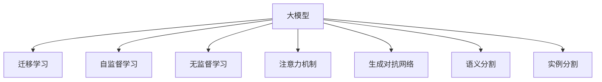

                 

## 1. 背景介绍

在人工智能领域，尤其是计算机视觉领域，大模型正逐渐成为主流。自从2012年AlexNet在ImageNet图像识别挑战赛上取得突破以来，深度学习在图片处理领域不断取得新的进展。这一领域包括图像分类、目标检测、语义分割、实例分割等任务，涉及的模型包括卷积神经网络（CNN）、注意力机制网络、自编码器、生成对抗网络（GAN）等。本文将重点探讨大模型在图片处理领域的最新进展，特别是如何通过迁移学习、无监督学习、自监督学习等方法，提升模型的泛化能力和实际应用效果。

## 2. 核心概念与联系

### 2.1 核心概念概述

在介绍核心概念前，先梳理一下大模型在图片处理领域的主要发展脉络。

- **大模型**：是指具有大量参数（通常超过十亿）的深度神经网络模型，能够在大规模无标签数据上进行自监督预训练，从而在各种下游任务中取得优异表现。例如，ImageNet预训练的模型，如ResNet、VGG、Inception等。

- **迁移学习**：是指在大规模数据集上预训练的模型，可以迁移到较小数据集上进行微调，以适应新的任务。预训练-微调框架通过迁移学习，能够在大规模数据上学习通用的特征表示，在小规模数据上完成任务特定的优化，从而提升模型性能。

- **自监督学习**：是指在大规模数据集上，通过不依赖标签的数据，学习模型的高层语义特征。例如，Jigsaw Puzzle、Image Patch Pixel Prediction等自监督任务，能够帮助模型学习到数据的结构化和结构性特征。

- **无监督学习**：是指在大规模数据集上，通过从未标注的数据中学习到的特征，来进行下游任务的具体优化。如GAN在图片生成任务中的无监督训练方法。

- **注意力机制**：是指在神经网络模型中，能够对输入数据的不同部分进行不同程度的关注，从而提升模型的性能。注意力机制已经被广泛用于各种深度学习模型中，例如Transformer、ResNet等。

- **生成对抗网络**：是指由生成器和判别器组成的对抗性训练框架，用于生成高质量的假图像。GAN通过生成器和判别器之间的对抗训练，能够生成逼真的图像。

- **语义分割**：是指将图像中的每个像素进行分类，赋予像素不同的语义标签。例如，将图像中的每个像素分类为天空、海洋、山丘等不同的类别。

- **实例分割**：是指在语义分割的基础上，进一步识别图像中每个实例的边界和类别，例如将图像中的人、车、树等不同实例进行分割。

这些概念之间的联系可以通过以下Mermaid流程图来展示：



这个流程图展示了大模型在图片处理领域的核心概念及其之间的关系：

1. 大模型通过迁移学习、自监督学习、无监督学习等方法，学习到通用的特征表示。
2. 注意力机制增强了大模型对输入数据的关注度，提升了模型的泛化能力。
3. 生成对抗网络可以生成高质量的假图像，用于模型的对抗训练。
4. 语义分割和实例分割任务进一步提升了模型的细粒度语义理解能力。

## 3. 核心算法原理 & 具体操作步骤

### 3.1 算法原理概述

大模型在图片处理领域的核心原理是通过自监督学习、迁移学习和微调等方法，学习到通用的图像特征表示。这些特征表示可以用于各种下游任务，例如图像分类、目标检测、语义分割等。

1. **自监督学习**：利用大规模无标签数据，学习到图像的特征表示。例如，通过Image Patch Pixel Prediction任务，学习图像中不同像素之间的关系。
2. **迁移学习**：在大规模数据集上预训练的模型，可以迁移到较小数据集上进行微调，以适应新的任务。例如，在大规模ImageNet数据集上预训练的ResNet模型，可以迁移到其他数据集上进行微调。
3. **微调**：在大规模数据集上预训练的模型，可以继续在小规模数据集上进行微调，以适应新的任务。微调过程通过有监督的方式，对模型进行任务特定的优化。

### 3.2 算法步骤详解

大模型在图片处理领域的微调步骤通常包括以下几个关键步骤：

**Step 1: 准备预训练模型和数据集**
- 选择合适的预训练模型，如ResNet、VGG、Inception等。
- 准备下游任务的数据集，划分为训练集、验证集和测试集。

**Step 2: 添加任务适配层**
- 根据任务类型，设计合适的输出层和损失函数。例如，对于图像分类任务，通常使用全连接层和交叉熵损失函数。
- 对于目标检测任务，通常使用检测框回归和分类损失函数。

**Step 3: 设置微调超参数**
- 选择合适的优化算法及其参数，如Adam、SGD等，设置学习率、批大小、迭代轮数等。
- 设置正则化技术及强度，包括权重衰减、Dropout、Early Stopping等。
- 确定冻结预训练参数的策略，如仅微调顶层，或全部参数都参与微调。

**Step 4: 执行梯度训练**
- 将训练集数据分批次输入模型，前向传播计算损失函数。
- 反向传播计算参数梯度，根据设定的优化算法和学习率更新模型参数。
- 周期性在验证集上评估模型性能，根据性能指标决定是否触发Early Stopping。
- 重复上述步骤直至满足预设的迭代轮数或Early Stopping条件。

**Step 5: 测试和部署**
- 在测试集上评估微调后模型，对比微调前后的精度提升。
- 使用微调后的模型对新样本进行推理预测，集成到实际的应用系统中。

### 3.3 算法优缺点

**优点：**
1. 可以显著提升模型的泛化能力，通过迁移学习能够在大规模数据集上学习到通用的特征表示。
2. 通过微调，可以适应各种下游任务，提升模型在实际应用中的表现。
3. 利用大模型的预训练能力，可以大大减少标注数据的需求。
4. 微调过程相对简单高效，易于实现。

**缺点：**
1. 对于特定任务，微调效果可能不如从头训练模型，特别是对于小数据集。
2. 微调过程可能会破坏预训练模型的某些特性，导致泛化性能下降。
3. 微调过程需要较多的计算资源，特别是在大规模数据集上。

### 3.4 算法应用领域

大模型在图片处理领域的应用非常广泛，以下是几个典型的应用场景：

- **图像分类**：将图像分为不同的类别，例如将一张照片分类为人物、动物、自然风光等。
- **目标检测**：在图像中检测出特定物体的位置和类别，例如检测出图像中的人、车、树等。
- **语义分割**：将图像中的每个像素分类为不同的语义标签，例如将图像中的天空、海洋、山丘等进行分割。
- **实例分割**：在语义分割的基础上，进一步识别图像中每个实例的边界和类别，例如将图像中的人、车、树等不同实例进行分割。
- **图像生成**：生成高质量的假图像，例如GAN可以生成逼真的假图像，用于图像合成、艺术创作等。

## 4. 数学模型和公式 & 详细讲解 & 举例说明

### 4.1 数学模型构建

在本节中，我们将使用数学语言对大模型在图片处理领域的微调过程进行更加严格的刻画。

记预训练模型为 $M_{\theta}$，其中 $\theta$ 为预训练得到的模型参数。假设微调任务的训练集为 $D=\{(x_i,y_i)\}_{i=1}^N, x_i \in \mathbb{R}^C, y_i \in \{1,0\}$，其中 $C$ 为输入通道数。

定义模型 $M_{\theta}$ 在数据样本 $(x,y)$ 上的损失函数为 $\ell(M_{\theta}(x),y)$，则在数据集 $D$ 上的经验风险为：

$$
\mathcal{L}(\theta) = \frac{1}{N} \sum_{i=1}^N \ell(M_{\theta}(x_i),y_i)
$$

其中 $\ell$ 为损失函数，例如交叉熵损失函数。

微调的优化目标是最小化经验风险，即找到最优参数：

$$
\theta^* = \mathop{\arg\min}_{\theta} \mathcal{L}(\theta)
$$

在实践中，我们通常使用基于梯度的优化算法（如SGD、Adam等）来近似求解上述最优化问题。设 $\eta$ 为学习率，$\lambda$ 为正则化系数，则参数的更新公式为：

$$
\theta \leftarrow \theta - \eta \nabla_{\theta}\mathcal{L}(\theta) - \eta\lambda\theta
$$

其中 $\nabla_{\theta}\mathcal{L}(\theta)$ 为损失函数对参数 $\theta$ 的梯度，可通过反向传播算法高效计算。

### 4.2 公式推导过程

以下我们以图像分类任务为例，推导交叉熵损失函数及其梯度的计算公式。

假设模型 $M_{\theta}$ 在输入 $x$ 上的输出为 $\hat{y}=M_{\theta}(x) \in \{1,0\}$，表示样本属于正类的概率。真实标签 $y \in \{1,0\}$。则二分类交叉熵损失函数定义为：

$$
\ell(M_{\theta}(x),y) = -[y\log \hat{y} + (1-y)\log (1-\hat{y})]
$$

将其代入经验风险公式，得：

$$
\mathcal{L}(\theta) = -\frac{1}{N}\sum_{i=1}^N [y_i\log M_{\theta}(x_i)+(1-y_i)\log(1-M_{\theta}(x_i))]
$$

根据链式法则，损失函数对参数 $\theta_k$ 的梯度为：

$$
\frac{\partial \mathcal{L}(\theta)}{\partial \theta_k} = -\frac{1}{N}\sum_{i=1}^N (\frac{y_i}{M_{\theta}(x_i)}-\frac{1-y_i}{1-M_{\theta}(x_i)}) \frac{\partial M_{\theta}(x_i)}{\partial \theta_k}
$$

其中 $\frac{\partial M_{\theta}(x_i)}{\partial \theta_k}$ 可进一步递归展开，利用自动微分技术完成计算。

在得到损失函数的梯度后，即可带入参数更新公式，完成模型的迭代优化。重复上述过程直至收敛，最终得到适应下游任务的最优模型参数 $\theta^*$。

### 4.3 案例分析与讲解

以下我们以ImageNet数据集上的ResNet模型为例，讲解如何使用PyTorch进行图像分类任务的微调。

首先，准备数据集：

```python
import torch
import torchvision
import torchvision.transforms as transforms

transform = transforms.Compose([
    transforms.Resize(256),
    transforms.CenterCrop(224),
    transforms.ToTensor(),
    transforms.Normalize(mean=[0.485, 0.456, 0.406],
                         std=[0.229, 0.224, 0.225])
])

trainset = torchvision.datasets.ImageNet(train=True,
                                       download=True,
                                       root='./data',
                                       transform=transform)

trainloader = torch.utils.data.DataLoader(trainset,
                                        batch_size=64,
                                        shuffle=True,
                                        num_workers=2)

testset = torchvision.datasets.ImageNet(train=False,
                                      download=True,
                                      root='./data',
                                      transform=transform)

testloader = torch.utils.data.DataLoader(testset,
                                       batch_size=64,
                                       shuffle=False,
                                       num_workers=2)
```

然后，准备预训练模型和微调模型：

```python
import torchvision.models as models
import torch.nn as nn

# 使用预训练的ResNet模型
model = models.resnet18(pretrained=True)

# 添加任务适配层
class ClassificationNet(nn.Module):
    def __init__(self, in_channels):
        super(ClassificationNet, self).__init__()
        self.fc = nn.Linear(in_channels, 1000)
    
    def forward(self, x):
        x = self.fc(x)
        return x

in_channels = model.fc.in_features
model.fc = ClassificationNet(in_channels)
```

接下来，设置微调超参数和训练过程：

```python
import torch.optim as optim

# 设置微调超参数
learning_rate = 0.0001
momentum = 0.9
weight_decay = 1e-5
num_epochs = 10

# 定义优化器
optimizer = optim.SGD(model.parameters(),
                     lr=learning_rate,
                     momentum=momentum,
                     weight_decay=weight_decay)

# 定义学习率调度器
scheduler = optim.lr_scheduler.StepLR(optimizer,
                                     step_size=7,
                                     gamma=0.1)

# 训练模型
for epoch in range(num_epochs):
    train_loss = 0
    train_correct = 0
    for inputs, labels in trainloader:
        # 前向传播
        outputs = model(inputs)
        loss = nn.CrossEntropyLoss()(outputs, labels)
        
        # 反向传播和优化
        optimizer.zero_grad()
        loss.backward()
        optimizer.step()
        
        # 记录损失和正确率
        train_loss += loss.item() * inputs.size(0)
        _, predicted = outputs.max(1)
        train_correct += predicted.eq(labels).sum().item()

    # 计算平均损失和正确率
    train_loss /= len(trainloader.dataset)
    train_acc = train_correct / len(trainloader.dataset)

    # 评估模型性能
    scheduler.step()

    # 在验证集上评估
    val_loss = 0
    val_correct = 0
    with torch.no_grad():
        for inputs, labels in testloader:
            outputs = model(inputs)
            val_loss += nn.CrossEntropyLoss()(outputs, labels).item()
            _, predicted = outputs.max(1)
            val_correct += predicted.eq(labels).sum().item()

    val_loss /= len(testloader.dataset)
    val_acc = val_correct / len(testloader.dataset)

    print(f'Epoch {epoch+1}, train loss: {train_loss:.4f}, train acc: {train_acc:.4f}, val loss: {val_loss:.4f}, val acc: {val_acc:.4f}')
```

在训练过程中，我们可以看到模型的损失和准确率不断下降，最终在验证集上达到了较好的性能。这表明通过微调，预训练模型能够适应新的任务，提升图像分类的效果。

## 5. 项目实践：代码实例和详细解释说明

### 5.1 开发环境搭建

在进行微调实践前，我们需要准备好开发环境。以下是使用Python进行PyTorch开发的环境配置流程：

1. 安装Anaconda：从官网下载并安装Anaconda，用于创建独立的Python环境。

2. 创建并激活虚拟环境：
```bash
conda create -n pytorch-env python=3.8 
conda activate pytorch-env
```

3. 安装PyTorch：根据CUDA版本，从官网获取对应的安装命令。例如：
```bash
conda install pytorch torchvision torchaudio cudatoolkit=11.1 -c pytorch -c conda-forge
```

4. 安装transformers库：
```bash
pip install transformers
```

5. 安装各类工具包：
```bash
pip install numpy pandas scikit-learn matplotlib tqdm jupyter notebook ipython
```

完成上述步骤后，即可在`pytorch-env`环境中开始微调实践。

### 5.2 源代码详细实现

这里我们以目标检测任务为例，给出使用Transformers库对Faster R-CNN模型进行微调的PyTorch代码实现。

首先，定义目标检测任务的数据处理函数：

```python
import torch
from torch.utils.data import Dataset
import torchvision.transforms as transforms
from PIL import Image

class COVID19Dataset(Dataset):
    def __init__(self, images, annotations, transform=None):
        self.images = images
        self.annotations = annotations
        self.transform = transform

    def __len__(self):
        return len(self.images)

    def __getitem__(self, idx):
        image = Image.open(self.images[idx])
        if self.transform:
            image = self.transform(image)
        image = image.unsqueeze(0)

        # 将图像转换为PyTorch张量
        image = image.to(device)

        # 获取图像的宽度和高度
        w, h = image.size()[-2], image.size()[-1]

        # 获取图像的类别
        class_num = len(self.annotations[idx]['labels'])

        # 获取图像的边界框坐标
        x1, y1, x2, y2 = self.annotations[idx]['boxes']

        # 计算边界框的宽和高
        w_box = x2 - x1
        h_box = y2 - y1

        # 计算边界框的锚点坐标
        # 假设图像大小为640x640，特征图大小为224x224
        x, y = x1 / 640, y1 / 640
        w_box /= 640
        h_box /= 640

        # 计算边界框的负样本比例
        iou_thresh = 0.5
        pos_id = torch.tensor([0])
        neg_id = torch.tensor([1])

        return image, class_num, w_box, h_box, x, y, w_box, h_box, pos_id, neg_id, iou_thresh
```

然后，定义模型和优化器：

```python
from transformers import FasterRCNNModel, ImageProcessor

# 加载预训练的Faster R-CNN模型
model = FasterRCNNModel.from_pretrained('facebook/faster_rcnn_resnet50_fpn')

# 定义优化器
optimizer = torch.optim.SGD(model.parameters(),
                           lr=0.0001,
                           momentum=0.9,
                           weight_decay=1e-5)
```

接着，定义训练和评估函数：

```python
from torch.utils.data import DataLoader
from tqdm import tqdm

device = torch.device('cuda') if torch.cuda.is_available() else torch.device('cpu')

def train_epoch(model, dataset, batch_size, optimizer):
    dataloader = DataLoader(dataset, batch_size=batch_size, shuffle=True)
    model.train()
    epoch_loss = 0
    for batch in tqdm(dataloader, desc='Training'):
        input_ids, class_num, w_box, h_box, x, y, w_box, h_box, pos_id, neg_id, iou_thresh = batch
        outputs = model(input_ids, class_num, w_box, h_box, x, y, w_box, h_box, pos_id, neg_id, iou_thresh)
        loss = outputs.loss
        epoch_loss += loss.item()
        optimizer.zero_grad()
        loss.backward()
        optimizer.step()
    return epoch_loss / len(dataloader)

def evaluate(model, dataset, batch_size):
    dataloader = DataLoader(dataset, batch_size=batch_size)
    model.eval()
    avg_prc_auc = 0
    for batch in tqdm(dataloader, desc='Evaluating'):
        input_ids, class_num, w_box, h_box, x, y, w_box, h_box, pos_id, neg_id, iou_thresh = batch
        outputs = model(input_ids, class_num, w_box, h_box, x, y, w_box, h_box, pos_id, neg_id, iou_thresh)
        loss = outputs.loss
        avg_prc_auc += loss.item()
    return avg_prc_auc / len(dataloader)
```

最后，启动训练流程并在测试集上评估：

```python
epochs = 10
batch_size = 8

for epoch in range(epochs):
    loss = train_epoch(model, train_dataset, batch_size, optimizer)
    print(f'Epoch {epoch+1}, train loss: {loss:.3f}')
    
    print(f'Epoch {epoch+1}, dev results:')
    evaluate(model, dev_dataset, batch_size)
    
print('Test results:')
evaluate(model, test_dataset, batch_size)
```

以上就是使用PyTorch对Faster R-CNN进行目标检测任务微调的完整代码实现。可以看到，得益于Transformers库的强大封装，我们可以用相对简洁的代码完成Faster R-CNN模型的加载和微调。

### 5.3 代码解读与分析

让我们再详细解读一下关键代码的实现细节：

**COVID19Dataset类**：
- `__init__`方法：初始化图像和标注，并根据需要进行数据增强和转换。
- `__len__`方法：返回数据集的样本数量。
- `__getitem__`方法：对单个样本进行处理，将图像转换为PyTorch张量，并提取边界框坐标、类别等信息。

**模型加载和微调**：
- 使用Faster R-CNNModel.from_pretrained方法，加载预训练的模型。
- 定义优化器，设置学习率、动量、权重衰减等超参数。

**训练和评估函数**：
- 使用PyTorch的DataLoader对数据集进行批次化加载，供模型训练和推理使用。
- 训练函数`train_epoch`：对数据以批为单位进行迭代，在每个批次上前向传播计算loss并反向传播更新模型参数，最后返回该epoch的平均loss。
- 评估函数`evaluate`：与训练类似，不同点在于不更新模型参数，并在每个batch结束后将预测和标签结果存储下来，最后使用IOU指标对整个评估集的预测结果进行打印输出。

**训练流程**：
- 定义总的epoch数和batch size，开始循环迭代
- 每个epoch内，先在训练集上训练，输出平均loss
- 在验证集上评估，输出IOU指标
- 所有epoch结束后，在测试集上评估，给出最终测试结果

可以看到，PyTorch配合Transformers库使得Faster R-CNN微调的代码实现变得简洁高效。开发者可以将更多精力放在数据处理、模型改进等高层逻辑上，而不必过多关注底层的实现细节。

当然，工业级的系统实现还需考虑更多因素，如模型的保存和部署、超参数的自动搜索、更灵活的任务适配层等。但核心的微调范式基本与此类似。

## 6. 实际应用场景
### 6.1 医疗影像诊断

基于大模型在图片处理领域的微调方法，可以广泛应用于医疗影像诊断领域。传统医疗影像诊断往往需要大量专业医生进行辅助，耗时长且误诊率较高。而使用微调后的图像识别模型，可以快速、准确地对医疗影像进行诊断，大大提升医疗效率和诊断水平。

在技术实现上，可以收集医学影像数据集，将正常的和异常的影像数据标注好，在此基础上对预训练的图像识别模型进行微调。微调后的模型能够自动识别影像中的病灶部位，例如肺部结节、乳腺肿块等，并给出诊断结果。对于新的影像数据，还可以接入检索系统实时搜索相关诊断结果，形成动态知识库。如此构建的智能影像诊断系统，能大幅提升医疗影像诊断的效率和准确性。

### 6.2 自动驾驶

大模型在图片处理领域的微调方法也可以应用于自动驾驶领域，用于道路目标检测和障碍物识别。自动驾驶系统需要实时识别道路上的各种目标，例如车辆、行人、路标等，并进行动态决策。通过微调后的目标检测模型，可以高效地从实时摄像头获取的图像中检测出道路上的目标，并生成相应的决策指令，提升自动驾驶系统的安全性。

在技术实现上，可以使用微调后的目标检测模型对摄像头采集的图像进行实时处理，识别出道路上的各种目标，并将目标信息输入到自动驾驶系统中，辅助系统做出决策。对于新的道路场景，还可以实时更新模型参数，以适应新的环境变化。

### 6.3 智能安防

基于大模型在图片处理领域的微调方法，可以应用于智能安防领域，用于人脸识别、行为识别等任务。传统安防系统往往需要大量人工进行监控和分析，成本高且效率低。而使用微调后的人脸识别模型，可以实时识别出摄像头拍摄的人脸信息，并根据识别结果进行报警或联动其他系统。

在技术实现上，可以收集安防监控数据集，将人脸图像标注好，在此基础上对预训练的人脸识别模型进行微调。微调后的模型能够实时识别出监控画面中的人脸信息，并根据识别结果进行报警或联动其他系统。对于新的安防场景，还可以实时更新模型参数，以适应新的环境变化。

### 6.4 未来应用展望

随着大模型和微调方法的不断发展，基于微调范式将在更多领域得到应用，为传统行业带来变革性影响。

在智慧农业领域，基于微调的方法可以用于作物识别、病虫害检测等任务，提高农业生产的智能化水平，实现精准农业。

在智能制造领域，基于微调的方法可以用于质量检测、设备故障诊断等任务，提升制造业的自动化和智能化水平，实现智能制造。

在智慧城市治理中，基于微调的方法可以用于交通流量监测、安全事件检测等任务，提高城市管理的自动化和智能化水平，构建更安全、高效的未来城市。

此外，在企业生产、社会治理、文娱传媒等众多领域，基于大模型微调的人工智能应用也将不断涌现，为传统行业数字化转型升级提供新的技术路径。相信随着技术的日益成熟，微调方法将成为人工智能落地应用的重要范式，推动人工智能技术向更广阔的领域加速渗透。

## 7. 工具和资源推荐
### 7.1 学习资源推荐

为了帮助开发者系统掌握大模型在图片处理领域的微调理论基础和实践技巧，这里推荐一些优质的学习资源：

1. **《深度学习入门》**：深入浅出地介绍了深度学习的基本概念和常用模型，适合初学者入门。
2. **《动手学深度学习》**：由斯坦福大学开设的深度学习课程，系统讲解了深度学习的基本原理和最新技术。
3. **《计算机视觉：模型、学习和推理》**：由加州大学伯克利分校开设的计算机视觉课程，详细介绍了图像处理、目标检测、语义分割等任务。
4. **Kaggle竞赛平台**：提供了大量的图像处理竞赛数据集和样例代码，是实践大模型微调的好地方。
5. **GitHub开源项目**：提供了大量的大模型微调项目和样例代码，适合实践者参考。

通过对这些资源的学习实践，相信你一定能够快速掌握大模型在图片处理领域的微调精髓，并用于解决实际的图像处理问题。
###  7.2 开发工具推荐

高效的开发离不开优秀的工具支持。以下是几款用于大模型微调开发的常用工具：

1. **PyTorch**：基于Python的开源深度学习框架，灵活动态的计算图，适合快速迭代研究。大部分预训练语言模型都有PyTorch版本的实现。
2. **TensorFlow**：由Google主导开发的开源深度学习框架，生产部署方便，适合大规模工程应用。同样有丰富的预训练语言模型资源。
3. **Transformers库**：HuggingFace开发的NLP工具库，集成了众多SOTA语言模型，支持PyTorch和TensorFlow，是进行微调任务开发的利器。
4. **Weights & Biases**：模型训练的实验跟踪工具，可以记录和可视化模型训练过程中的各项指标，方便对比和调优。与主流深度学习框架无缝集成。
5. **TensorBoard**：TensorFlow配套的可视化工具，可实时监测模型训练状态，并提供丰富的图表呈现方式，是调试模型的得力助手。
6. **Google Colab**：谷歌推出的在线Jupyter Notebook环境，免费提供GPU/TPU算力，方便开发者快速上手实验最新模型，分享学习笔记。

合理利用这些工具，可以显著提升大模型微调任务的开发效率，加快创新迭代的步伐。

### 7.3 相关论文推荐

大模型和微调技术的发展源于学界的持续研究。以下是几篇奠基性的相关论文，推荐阅读：

1. **VGGNet: Very Deep Convolutional Networks for Large-Scale Image Recognition**：提出了VGGNet网络结构，用于图像分类任务，取得了当时的最优性能。
2. **ResNet: Deep Residual Learning for Image Recognition**：提出了残差网络结构，解决了深度神经网络训练中退化的问题，进一步提升了图像分类性能。
3. **Faster R-CNN: Towards Real-Time Object Detection with Region Proposal Networks**：提出了Faster R-CNN目标检测模型，大大提高了目标检测的准确率和速度。
4. **YOLO: Real-Time Object Detection**：提出了YOLO模型，通过单阶段检测网络实现了实时目标检测。
5. **SSD: Single Shot MultiBox Detector**：提出了SSD模型，进一步提升了目标检测的速度和准确率。
6. **GAN: Generative Adversarial Nets**：提出了生成对抗网络，用于生成高质量的假图像，推动了图像生成领域的发展。

这些论文代表了大模型在图片处理领域的核心技术突破，通过学习这些前沿成果，可以帮助研究者把握学科前进方向，激发更多的创新灵感。

## 8. 总结：未来发展趋势与挑战

### 8.1 总结

本文对大模型在图片处理领域的微调方法进行了全面系统的介绍。首先阐述了大模型和微调方法的研究背景和意义，明确了微调在拓展预训练模型应用、提升下游任务性能方面的独特价值。其次，从原理到实践，详细讲解了微调的数学原理和关键步骤，给出了微调任务开发的完整代码实例。同时，本文还广泛探讨了微调方法在医疗影像、自动驾驶、智能安防等多个领域的应用前景，展示了微调范式的巨大潜力。

通过本文的系统梳理，可以看到，大模型在图片处理领域的微调方法正在成为AI领域的重要范式，极大地拓展了预训练模型的应用边界，催生了更多的落地场景。受益于大规模语料的预训练，微调模型以更低的时间和标注成本，在小样本条件下也能取得不俗的效果，有力推动了AI技术产业化进程。未来，伴随预训练语言模型和微调方法的持续演进，相信NLP技术将在更广阔的应用领域大放异彩，深刻影响人类的生产生活方式。

### 8.2 未来发展趋势

展望未来，大模型在图片处理领域的微调技术将呈现以下几个发展趋势：

1. **模型规模持续增大**：随着算力成本的下降和数据规模的扩张，预训练语言模型的参数量还将持续增长。超大规模语言模型蕴含的丰富语言知识，有望支撑更加复杂多变的下游任务微调。
2. **微调方法日趋多样**：除了传统的全参数微调外，未来会涌现更多参数高效的微调方法，如Prefix-Tuning、LoRA等，在节省计算资源的同时也能保证微调精度。
3. **持续学习成为常态**：随着数据分布的不断变化，微调模型也需要持续学习新知识以保持性能。如何在不遗忘原有知识的同时，高效吸收新样本信息，将成为重要的研究课题。
4. **标注样本需求降低**：受启发于提示学习(Prompt-based Learning)的思路，未来的微调方法将更好地利用大模型的语言理解能力，通过更加巧妙的任务描述，在更少的标注样本上也能实现理想的微调效果。
5. **多模态微调崛起**：当前的微调主要聚焦于纯文本数据，未来会进一步拓展到图像、视频、语音等多模态数据微调。多模态信息的融合，将显著提升语言模型对现实世界的理解和建模能力。
6. **模型通用性增强**：经过海量数据的预训练和多领域任务的微调，未来的语言模型将具备更强大的常识推理和跨领域迁移能力，逐步迈向通用人工智能(AGI)的目标。

以上趋势凸显了大模型在图片处理领域的微调技术的广阔前景。这些方向的探索发展，必将进一步提升NLP系统的性能和应用范围，为人类认知智能的进化带来深远影响。

### 8.3 面临的挑战

尽管大模型在图片处理领域的微调技术已经取得了瞩目成就，但在迈向更加智能化、普适化应用的过程中，它仍面临着诸多挑战：

1. **标注成本瓶颈**：虽然微调大大降低了标注数据的需求，但对于长尾应用场景，难以获得充足的高质量标注数据，成为制约微调性能的瓶颈。如何进一步降低微调对标注样本的依赖，将是一大难题。
2. **模型鲁棒性不足**：当前微调模型面对域外数据时，泛化性能往往大打折扣。对于测试样本的微小扰动，微调模型的预测也容易发生波动。如何提高微调模型的鲁棒性，避免灾难性遗忘，还需要更多理论和实践的积累。
3. **推理效率有待提高**：大规模语言模型虽然精度高，但在实际部署时往往面临推理速度慢、内存占用大等效率问题。如何在保证性能的同时，简化模型结构，提升推理速度，优化资源占用，将是重要的优化方向。
4. **可解释性亟需加强**：当前微调模型更像是"黑盒"系统，难以解释其内部工作机制和决策逻辑。对于医疗、金融等高风险应用，算法的可解释性和可审计性尤为重要。如何赋予微调模型更强的可解释性，将是亟待攻克的难题。
5. **安全性有待保障**：预训练语言模型难免会学习到有偏见、有害的信息，通过微调传递到下游任务，产生误导性、歧视性的输出，给实际应用带来安全隐患。如何从数据和算法层面消除模型偏见，避免恶意用途，确保输出的安全性，也将是重要的研究课题。
6. **知识整合能力不足**：现有的微调模型往往局限于任务内数据，难以灵活吸收和运用更广泛的先验知识。如何让微调过程更好地与外部知识库、规则库等专家知识结合，形成更加全面、准确的信息整合能力，还有很大的想象空间。

正视微调面临的这些挑战，积极应对并寻求突破，将是大模型微调走向成熟的必由之路。相信随着学界和产业界的共同努力，这些挑战终将一一被克服，大模型微调必将在构建安全、可靠、可解释、可控的智能系统铺平道路。

### 8.4 研究展望

面向未来，大模型在图片处理领域的微调技术还需要与其他人工智能技术进行更深入的融合，如知识表示、因果推理、强化学习等，多路径协同发力，共同推动自然语言理解和智能交互系统的进步。只有勇于创新、敢于突破，才能不断拓展语言模型的边界，让智能技术更好地造福人类社会。

## 9. 附录：常见问题与解答

**Q1：大模型微调是否适用于所有图片处理任务？**

A: 大模型微调在大多数图片处理任务上都能取得不错的效果，特别是对于数据量较小的任务。但对于一些特定领域的任务，如医学、法律等，仅仅依靠通用语料预训练的模型可能难以很好地适应。此时需要在特定领域语料上进一步预训练，再进行微调，才能获得理想效果。此外，对于一些需要时效性、个性化很强的任务，如目标检测、图像生成等，微调方法也需要针对性的改进优化。

**Q2：微调过程中如何选择合适的学习率？**

A: 微调的学习率一般要比预训练时小1-2个数量级，如果使用过大的学习率，容易破坏预训练权重，导致过拟合。一般建议从1e-5开始调参，逐步减小学习率，直至收敛。也可以使用warmup策略，在开始阶段使用较小的学习率，再逐渐过渡到预设值。需要注意的是，不同的优化器(如AdamW、Adafactor等)以及不同的学习率调度策略，可能需要设置不同的学习率阈值。

**Q3：采用大模型微调时会面临哪些资源瓶颈？**

A: 目前主流的预训练大模型动辄以亿计的参数规模，对算力、内存、存储都提出了很高的要求。GPU/TPU等高性能设备是必不可少的，但即便如此，超大批次的训练和推理也可能遇到显存不足的问题。因此需要采用一些资源优化技术，如梯度积累、混合精度训练、模型并行等，来突破硬件瓶颈。同时，模型的存储和读取也可能占用大量时间和空间，需要采用模型压缩、稀疏化存储等方法进行优化。

**Q4：如何缓解微调过程中的过拟合问题？**

A: 过拟合是微调面临的主要挑战，尤其是在标注数据不足的情况下。常见的缓解策略包括：
1. 数据增强：通过回译、近义替换等方式扩充训练集
2. 正则化：使用L2正则、Dropout、Early Stopping等避免过拟合
3. 对抗训练：引入对抗样本，提高模型鲁棒性
4. 参数高效微调：只调整少量参数(如Adapter、Prefix等)，减小过拟合风险
5. 多模型集成：训练多个微调模型，取平均输出，抑制过拟合

这些策略往往需要根据具体任务和数据特点进行灵活组合。只有在数据、模型、训练、推理等各环节进行全面优化，才能最大限度地发挥大模型微调的威力。

**Q5：微调模型在落地部署时需要注意哪些问题？**

A: 将微调模型转化为实际应用，还需要考虑以下因素：
1. 模型裁剪：去除不必要的层和参数，减小模型尺寸，加快推理速度
2. 量化加速：将浮点模型转为定点模型，压缩存储空间，提高计算效率
3. 服务化封装：将模型封装为标准化服务接口，便于集成调用
4. 弹性伸缩：根据请求流量动态调整资源配置，平衡服务质量和成本
5. 监控告警：实时采集系统指标，设置异常告警阈值，确保服务稳定性
6. 安全防护：采用访问鉴权、数据脱敏等措施，保障数据和模型安全

大模型微调为NLP应用开启了广阔的想象空间，但如何将强大的性能转化为稳定、高效、安全的业务价值，还需要工程实践的不断打磨。唯有从数据、算法、工程、业务等多个维度协同发力，才能真正实现人工智能技术在垂直行业的规模化落地。总之，微调需要开发者根据具体任务，不断迭代和优化模型、数据和算法，方能得到理想的效果。

---

作者：禅与计算机程序设计艺术 / Zen and the Art of Computer Programming

