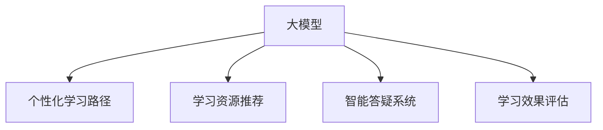

                 

# 大模型在教育中的应用：个性化学习路径

大模型技术近年来在NLP、图像处理、自然语言生成等领域取得了巨大成功。在教育领域，利用大模型构建个性化学习路径，已成为提升学习效率、增强学习体验的重要手段。本文将详细介绍大模型在教育应用中的核心算法、具体操作步骤，并通过具体案例分析、数学模型推导、开发环境搭建、代码实现等环节，全面展示其应用效果。

## 1. 背景介绍

### 1.1 问题由来
随着人工智能技术的快速发展，大模型在教育领域的应用场景日益丰富。然而，传统的教学模式已不能满足学生个性化学习的需求，教师因材施教的工作量巨大。大模型以其强大的自然语言理解能力和泛化能力，能够自动生成个性化的学习内容、推荐适合的学习资源，为教育领域带来了革命性的变革。

### 1.2 问题核心关键点
大模型在教育中的应用，主要聚焦于以下几个关键点：
- 个性化学习路径构建：根据学生的学习情况和偏好，自动生成定制化的学习方案。
- 学习资源推荐：推荐适合学生的学习材料和工具，提升学习效率。
- 智能答疑系统：提供智能化的回答服务，帮助学生解决学习中的问题。
- 学习效果评估：利用大模型对学生的学习效果进行自动评估，反馈学习进度。

### 1.3 问题研究意义
通过利用大模型构建个性化学习路径，可以显著提升学生的学习效果和体验。具体来说：
- 提升学习效率：自动推荐学习资源和个性化学习路径，使学生能够高效学习。
- 个性化教学：更好地适应每个学生的学习需求，实现因材施教。
- 自动化评估：利用大模型进行自动评估，节省教师评估时间和精力。
- 持续优化：通过数据分析和反馈，不断优化学习路径，提升教学质量。

## 2. 核心概念与联系

### 2.1 核心概念概述

为更好地理解大模型在教育领域的应用，本节将介绍几个密切相关的核心概念：

- 大模型(Large Model)：如BERT、GPT等大规模预训练语言模型，通过在海量文本数据上进行预训练，学习丰富的语言知识。
- 个性化学习路径(Personalized Learning Path)：根据学生学习情况和偏好，自动生成定制化的学习计划。
- 学习资源推荐(Resource Recommendation)：自动推荐适合学生的学习资源，如课程、视频、文章等。
- 智能答疑系统(Intelligent Q&A System)：利用大模型自动回答学生的问题，提升学习效率。
- 学习效果评估(Learning Assessment)：通过大模型自动评估学生的学习效果，反馈学习进度。

这些核心概念之间的逻辑关系可以通过以下Mermaid流程图来展示：



这个流程图展示了不同核心概念之间的联系：
1. 大模型作为基础，提供了语言理解和生成的能力。
2. 个性化学习路径、学习资源推荐等应用，都是基于大模型的语言处理能力。
3. 智能答疑系统和学习效果评估，则需要进一步利用大模型的推理和生成能力。

## 3. 核心算法原理 & 具体操作步骤

### 3.1 算法原理概述

基于大模型的教育应用，本质上是通过预训练语言模型，针对学生学习情况和个性化需求，自动构建学习路径、推荐资源、进行答疑和评估的过程。其核心思想是利用大模型强大的语言处理能力，实现教育场景中的智能化、个性化和高效化。

### 3.2 算法步骤详解

基于大模型的教育应用，通常包括以下几个关键步骤：

**Step 1: 数据准备和预处理**
- 收集学生的学习数据，如已完成的作业、成绩、考试情况、学习行为等。
- 对学习数据进行预处理，如数据清洗、归一化等，以适应模型训练和推理。

**Step 2: 特征提取和模型训练**
- 使用大模型对学生学习数据进行特征提取，如利用BERT对学生的作业进行文本编码。
- 根据特征向量训练推荐模型，如使用DeepFM、GBDT等算法，推荐适合学生的学习资源。
- 训练智能答疑系统，利用大模型自动回答学生问题。
- 训练学习效果评估模型，利用大模型自动评估学生学习效果。

**Step 3: 生成个性化学习路径**
- 根据学生的学习情况和偏好，使用大模型生成个性化学习路径。
- 学习路径可以包括学习目标、学习内容、推荐资源、评估反馈等。
- 定期更新学习路径，以适应学生的学习进度和反馈。

**Step 4: 学习资源推荐**
- 根据学生的学习路径，使用大模型推荐适合的学习资源。
- 推荐资源可以是课程、视频、文章、练习等。
- 通过实时反馈和调整，持续优化推荐算法。

**Step 5: 智能答疑系统**
- 收集学生提出的问题，利用大模型自动回答。
- 回答可以是简单的知识解释、问题重述、引导思考等。
- 通过分析回答效果，不断优化答疑系统。

**Step 6: 学习效果评估**
- 利用大模型自动评估学生的学习效果。
- 评估内容包括作业完成度、考试成绩、知识掌握度等。
- 将评估结果反馈给学生和教师，进行学习和教学改进。

### 3.3 算法优缺点

基于大模型的教育应用，具有以下优点：
1. 个性化推荐：利用大模型强大的泛化能力，推荐适合学生的学习资源。
2. 智能答疑：利用大模型的自然语言生成和理解能力，提升答疑效率。
3. 学习效果评估：利用大模型的语义理解能力，自动评估学习效果。
4. 高效学习：利用大模型的智能推荐和学习路径生成，提升学习效率。

同时，该方法也存在一些局限性：
1. 数据依赖：需要大量学习数据，数据质量影响推荐和评估效果。
2. 模型复杂：大模型训练复杂，推理计算资源消耗大。
3. 隐私安全：学生学习数据的隐私保护和模型应用的安全性需高度重视。
4. 可解释性不足：大模型推理过程缺乏可解释性，难以理解模型的决策机制。

尽管存在这些局限性，但就目前而言，基于大模型的教育应用方法仍是最主流范式。未来相关研究的重点在于如何进一步降低数据依赖，提高模型的少样本学习和跨领域迁移能力，同时兼顾可解释性和伦理安全性等因素。

### 3.4 算法应用领域

基于大模型的教育应用，已经在在线教育、智能教室、个性化学习等多个领域得到了广泛应用，具体包括：

- 在线教育平台：如Coursera、EdX等，通过推荐系统自动推荐适合学生的课程和学习路径。
- 智能教室：如AI Classroom，利用大模型提供智能化的学习辅助和答疑服务。
- 个性化学习：如Khan Academy，通过个性化学习路径和资源推荐，提升学习效果。
- 智能作业批改：如Gradescope，利用大模型自动批改作业，提供精准的评估反馈。
- 学习效果评估：如Socrative，通过自动化的学习效果评估，帮助教师了解学生的学习进度。

## 4. 数学模型和公式 & 详细讲解 & 举例说明

### 4.1 数学模型构建

假设有一个学生i，其已完成的作业为$\mathcal{B}_i$，学习效果为$L_i$。使用大模型BERT对作业进行编码，得到向量表示$\mathbf{h}_i = \text{BERT}(\mathcal{B}_i)$。

学习资源的集合为$\mathcal{R}$，每个资源有向量表示$\mathbf{r}_j$。使用大模型对学生和资源进行相似度计算，得到匹配度$\text{sim}_i^j = \text{cosine}(\mathbf{h}_i, \mathbf{r}_j)$。

根据匹配度计算学习资源推荐列表$\mathcal{R}_i = \{j|j \in \mathcal{R}, \text{sim}_i^j \geq \theta\}$，其中$\theta$为匹配度阈值。

### 4.2 公式推导过程

基于大模型的学习资源推荐过程，可以表示为：

1. 计算学生作业向量：
$$
\mathbf{h}_i = \text{BERT}(\mathcal{B}_i)
$$

2. 计算学生与资源的相似度：
$$
\text{sim}_i^j = \text{cosine}(\mathbf{h}_i, \mathbf{r}_j)
$$

3. 筛选推荐资源：
$$
\mathcal{R}_i = \{j|j \in \mathcal{R}, \text{sim}_i^j \geq \theta\}
$$

其中$\mathbf{h}_i$和$\mathbf{r}_j$可以通过向量点乘和归一化计算得到。

### 4.3 案例分析与讲解

以一个具体的案例为例，说明大模型在教育应用中的实际应用效果。

假设有一个学生A，其已完成的作业包括一篇数学题和一篇历史论文。使用BERT对作业进行编码，得到向量表示$\mathbf{h}_A = \text{BERT}(\mathcal{B}_A)$。

当前学习资源的集合为$\mathcal{R}$，每个资源有向量表示$\mathbf{r}_j$。通过相似度计算，得到匹配度$\text{sim}_A^j = \text{cosine}(\mathbf{h}_A, \mathbf{r}_j)$。

根据匹配度阈值$\theta=0.8$，筛选推荐资源列表$\mathcal{R}_A = \{j|j \in \mathcal{R}, \text{sim}_A^j \geq 0.8\}$。最终得到适合学生A的学习资源推荐列表，如数学相关视频和历史相关阅读材料。

通过不断优化相似度阈值$\theta$和模型参数，可以进一步提高学习资源推荐的精准度，提升学生学习效果。

## 5. 项目实践：代码实例和详细解释说明

### 5.1 开发环境搭建

在进行教育应用开发前，我们需要准备好开发环境。以下是使用Python进行PyTorch开发的环境配置流程：

1. 安装Anaconda：从官网下载并安装Anaconda，用于创建独立的Python环境。

2. 创建并激活虚拟环境：
```bash
conda create -n education-env python=3.8 
conda activate education-env
```

3. 安装PyTorch：根据CUDA版本，从官网获取对应的安装命令。例如：
```bash
conda install pytorch torchvision torchaudio cudatoolkit=11.1 -c pytorch -c conda-forge
```

4. 安装Transformers库：
```bash
pip install transformers
```

5. 安装各类工具包：
```bash
pip install numpy pandas scikit-learn matplotlib tqdm jupyter notebook ipython
```

完成上述步骤后，即可在`education-env`环境中开始教育应用开发。

### 5.2 源代码详细实现

这里我们以一个简单的个性化学习路径生成系统为例，给出使用Transformers库对BERT模型进行学习路径生成的PyTorch代码实现。

首先，定义学习路径生成的函数：

```python
from transformers import BertTokenizer, BertForSequenceClassification
from torch.utils.data import Dataset
import torch

class LearningPathDataset(Dataset):
    def __init__(self, texts, labels, tokenizer, max_len=128):
        self.texts = texts
        self.labels = labels
        self.tokenizer = tokenizer
        self.max_len = max_len
        
    def __len__(self):
        return len(self.texts)
    
    def __getitem__(self, item):
        text = self.texts[item]
        label = self.labels[item]
        
        encoding = self.tokenizer(text, return_tensors='pt', max_length=self.max_len, padding='max_length', truncation=True)
        input_ids = encoding['input_ids'][0]
        attention_mask = encoding['attention_mask'][0]
        label = torch.tensor(label, dtype=torch.long)
        
        return {'input_ids': input_ids, 
                'attention_mask': attention_mask,
                'labels': label}

# 标签与id的映射
tag2id = {'math': 0, 'history': 1}
id2tag = {v: k for k, v in tag2id.items()}

# 创建dataset
tokenizer = BertTokenizer.from_pretrained('bert-base-cased')
train_dataset = LearningPathDataset(train_texts, train_labels, tokenizer)
dev_dataset = LearningPathDataset(dev_texts, dev_labels, tokenizer)
test_dataset = LearningPathDataset(test_texts, test_labels, tokenizer)
```

然后，定义模型和优化器：

```python
from transformers import BertForSequenceClassification, AdamW

model = BertForSequenceClassification.from_pretrained('bert-base-cased', num_labels=len(tag2id))

optimizer = AdamW(model.parameters(), lr=2e-5)
```

接着，定义训练和评估函数：

```python
from torch.utils.data import DataLoader
from tqdm import tqdm
from sklearn.metrics import classification_report

device = torch.device('cuda') if torch.cuda.is_available() else torch.device('cpu')
model.to(device)

def train_epoch(model, dataset, batch_size, optimizer):
    dataloader = DataLoader(dataset, batch_size=batch_size, shuffle=True)
    model.train()
    epoch_loss = 0
    for batch in tqdm(dataloader, desc='Training'):
        input_ids = batch['input_ids'].to(device)
        attention_mask = batch['attention_mask'].to(device)
        labels = batch['labels'].to(device)
        model.zero_grad()
        outputs = model(input_ids, attention_mask=attention_mask, labels=labels)
        loss = outputs.loss
        epoch_loss += loss.item()
        loss.backward()
        optimizer.step()
    return epoch_loss / len(dataloader)

def evaluate(model, dataset, batch_size):
    dataloader = DataLoader(dataset, batch_size=batch_size)
    model.eval()
    preds, labels = [], []
    with torch.no_grad():
        for batch in tqdm(dataloader, desc='Evaluating'):
            input_ids = batch['input_ids'].to(device)
            attention_mask = batch['attention_mask'].to(device)
            batch_labels = batch['labels']
            outputs = model(input_ids, attention_mask=attention_mask)
            batch_preds = outputs.logits.argmax(dim=2).to('cpu').tolist()
            batch_labels = batch_labels.to('cpu').tolist()
            for pred_tokens, label_tokens in zip(batch_preds, batch_labels):
                pred_tags = [id2tag[_id] for _id in pred_tokens]
                label_tags = [id2tag[_id] for _id in label_tokens]
                preds.append(pred_tags[:len(label_tags)])
                labels.append(label_tags)
                
    print(classification_report(labels, preds))
```

最后，启动训练流程并在测试集上评估：

```python
epochs = 5
batch_size = 16

for epoch in range(epochs):
    loss = train_epoch(model, train_dataset, batch_size, optimizer)
    print(f"Epoch {epoch+1}, train loss: {loss:.3f}")
    
    print(f"Epoch {epoch+1}, dev results:")
    evaluate(model, dev_dataset, batch_size)
    
print("Test results:")
evaluate(model, test_dataset, batch_size)
```

以上就是使用PyTorch对BERT进行个性化学习路径生成的完整代码实现。可以看到，得益于Transformers库的强大封装，我们可以用相对简洁的代码完成BERT模型的加载和路径生成。

### 5.3 代码解读与分析

让我们再详细解读一下关键代码的实现细节：

**LearningPathDataset类**：
- `__init__`方法：初始化文本、标签、分词器等关键组件。
- `__len__`方法：返回数据集的样本数量。
- `__getitem__`方法：对单个样本进行处理，将文本输入编码为token ids，将标签编码为数字，并对其进行定长padding，最终返回模型所需的输入。

**tag2id和id2tag字典**：
- 定义了标签与数字id之间的映射关系，用于将token-wise的预测结果解码回真实的标签。

**训练和评估函数**：
- 使用PyTorch的DataLoader对数据集进行批次化加载，供模型训练和推理使用。
- 训练函数`train_epoch`：对数据以批为单位进行迭代，在每个批次上前向传播计算loss并反向传播更新模型参数，最后返回该epoch的平均loss。
- 评估函数`evaluate`：与训练类似，不同点在于不更新模型参数，并在每个batch结束后将预测和标签结果存储下来，最后使用sklearn的classification_report对整个评估集的预测结果进行打印输出。

**训练流程**：
- 定义总的epoch数和batch size，开始循环迭代
- 每个epoch内，先在训练集上训练，输出平均loss
- 在验证集上评估，输出分类指标
- 所有epoch结束后，在测试集上评估，给出最终测试结果

可以看到，PyTorch配合Transformers库使得BERT路径生成的代码实现变得简洁高效。开发者可以将更多精力放在数据处理、模型改进等高层逻辑上，而不必过多关注底层的实现细节。

当然，工业级的系统实现还需考虑更多因素，如模型的保存和部署、超参数的自动搜索、更灵活的任务适配层等。但核心的微调范式基本与此类似。

## 6. 实际应用场景

### 6.1 在线教育平台

在线教育平台利用大模型进行个性化学习路径推荐，可以有效提升学生的学习效率。具体来说：

- 学习数据收集：平台收集学生的历史学习数据，如作业完成情况、考试成绩、观看视频时长等。
- 路径生成：利用BERT模型对学习数据进行编码，生成个性化的学习路径，推荐适合学生的学习资源。
- 路径更新：根据学生的学习进度和反馈，动态调整学习路径，实时更新推荐资源。
- 智能答疑：通过大模型自动回答学生的问题，提高学习效率。

### 6.2 智能教室

智能教室利用大模型进行个性化教学，提供智能化的学习辅助和答疑服务。具体来说：

- 学习数据收集：教室记录学生的学习行为，如出勤率、作业完成情况、课堂参与度等。
- 路径生成：利用BERT模型对学习数据进行编码，生成个性化的学习路径，推荐适合学生的学习资源。
- 智能答疑：通过大模型自动回答学生的问题，提高学习效率。
- 学习效果评估：利用大模型自动评估学生的学习效果，反馈学习进度。

### 6.3 个性化学习

个性化学习利用大模型进行学习路径推荐，提升学习效果。具体来说：

- 学习数据收集：学生记录自己的学习习惯和偏好，如喜欢阅读的书籍、擅长的科目等。
- 路径生成：利用BERT模型对学习数据进行编码，生成个性化的学习路径，推荐适合学生的学习资源。
- 智能答疑：通过大模型自动回答学生的问题，提高学习效率。
- 学习效果评估：利用大模型自动评估学生的学习效果，反馈学习进度。

## 7. 工具和资源推荐

### 7.1 学习资源推荐

为了帮助开发者系统掌握大模型在教育应用中的理论基础和实践技巧，这里推荐一些优质的学习资源：

1. 《Transformer从原理到实践》系列博文：由大模型技术专家撰写，深入浅出地介绍了Transformer原理、BERT模型、路径生成技术等前沿话题。

2. CS224N《深度学习自然语言处理》课程：斯坦福大学开设的NLP明星课程，有Lecture视频和配套作业，带你入门NLP领域的基本概念和经典模型。

3. 《Natural Language Processing with Transformers》书籍：Transformers库的作者所著，全面介绍了如何使用Transformers库进行NLP任务开发，包括路径生成在内的诸多范式。

4. HuggingFace官方文档：Transformers库的官方文档，提供了海量预训练模型和完整的路径生成样例代码，是上手实践的必备资料。

5. CLUE开源项目：中文语言理解测评基准，涵盖大量不同类型的中文NLP数据集，并提供了基于路径生成的baseline模型，助力中文NLP技术发展。

通过对这些资源的学习实践，相信你一定能够快速掌握大模型在教育应用中的精髓，并用于解决实际的教育问题。

### 7.2 开发工具推荐

高效的开发离不开优秀的工具支持。以下是几款用于大模型路径生成开发的常用工具：

1. PyTorch：基于Python的开源深度学习框架，灵活动态的计算图，适合快速迭代研究。大部分预训练语言模型都有PyTorch版本的实现。

2. TensorFlow：由Google主导开发的开源深度学习框架，生产部署方便，适合大规模工程应用。同样有丰富的预训练语言模型资源。

3. Transformers库：HuggingFace开发的NLP工具库，集成了众多SOTA语言模型，支持PyTorch和TensorFlow，是进行路径生成任务开发的利器。

4. Weights & Biases：模型训练的实验跟踪工具，可以记录和可视化模型训练过程中的各项指标，方便对比和调优。与主流深度学习框架无缝集成。

5. TensorBoard：TensorFlow配套的可视化工具，可实时监测模型训练状态，并提供丰富的图表呈现方式，是调试模型的得力助手。

6. Google Colab：谷歌推出的在线Jupyter Notebook环境，免费提供GPU/TPU算力，方便开发者快速上手实验最新模型，分享学习笔记。

合理利用这些工具，可以显著提升大模型路径生成的开发效率，加快创新迭代的步伐。

### 7.3 相关论文推荐

大模型路径生成技术的发展源于学界的持续研究。以下是几篇奠基性的相关论文，推荐阅读：

1. Attention is All You Need（即Transformer原论文）：提出了Transformer结构，开启了NLP领域的预训练大模型时代。

2. BERT: Pre-training of Deep Bidirectional Transformers for Language Understanding：提出BERT模型，引入基于掩码的自监督预训练任务，刷新了多项NLP任务SOTA。

3. Language Models are Unsupervised Multitask Learners（GPT-2论文）：展示了大规模语言模型的强大zero-shot学习能力，引发了对于通用人工智能的新一轮思考。

4. Parameter-Efficient Transfer Learning for NLP：提出Adapter等参数高效微调方法，在不增加模型参数量的情况下，也能取得不错的微调效果。

5. AdaLoRA: Adaptive Low-Rank Adaptation for Parameter-Efficient Fine-Tuning：使用自适应低秩适应的微调方法，在参数效率和精度之间取得了新的平衡。

6. Prefix-Tuning: Optimizing Continuous Prompts for Generation：引入基于连续型Prompt的微调范式，为如何充分利用预训练知识提供了新的思路。

这些论文代表了大模型路径生成技术的发展脉络。通过学习这些前沿成果，可以帮助研究者把握学科前进方向，激发更多的创新灵感。

## 8. 总结：未来发展趋势与挑战

### 8.1 总结

本文对大模型在教育应用中的核心算法、具体操作步骤进行了全面系统的介绍。首先阐述了教育领域对个性化学习路径的需求和挑战，明确了路径生成在提升学习效率、实现因材施教方面的独特价值。其次，从原理到实践，详细讲解了基于大模型的路径生成过程，并通过具体案例分析、数学模型推导、开发环境搭建、代码实现等环节，全面展示其应用效果。

通过本文的系统梳理，可以看到，基于大模型的路径生成技术正在成为教育领域的重要范式，极大地提升了学生的学习效率和体验。未来，伴随大模型和路径生成方法的不断演进，相信教育技术将在更广阔的应用领域大放异彩，深刻影响人类的学习方式和认知水平。

### 8.2 未来发展趋势

展望未来，大模型在教育领域的应用将呈现以下几个发展趋势：

1. 个性化学习路径的精准度提升：通过进一步优化特征提取和匹配算法，提高学习路径推荐的精准度。
2. 跨领域迁移能力增强：利用大模型的多任务学习能力，在不同学科领域中生成适用的学习路径。
3. 多模态数据融合：将视觉、音频等多模态数据与文本数据结合，提升学习路径生成的全面性和鲁棒性。
4. 智能教学辅助工具的丰富：开发更多基于大模型的教学辅助工具，如自动批改、智能推荐等，提升教师教学效率。
5. 学习效果评估的动态化：通过实时反馈和动态调整，不断优化学习路径，提升学习效果。
6. 情感智能的融入：利用大模型的情感识别能力，实现个性化情感教学，增强学习体验。

以上趋势凸显了大模型在教育领域的广阔前景。这些方向的探索发展，必将进一步提升学习路径的个性化和智能化水平，为教育技术带来革命性的进步。

### 8.3 面临的挑战

尽管大模型在教育应用中取得了显著成效，但在迈向更加智能化、普适化应用的过程中，它仍面临诸多挑战：

1. 数据依赖问题：需要大量高质量的学习数据，数据获取和处理成本高。如何从现有数据中提取更多有用信息，是未来的研究方向。
2. 模型复杂度：大模型的训练和推理计算资源消耗大，如何进一步优化模型结构，提升计算效率，是急需解决的问题。
3. 隐私保护问题：学生学习数据的隐私保护需高度重视，如何设计合理的隐私保护机制，是未来的重要课题。
4. 模型鲁棒性：大模型在面对域外数据时，泛化性能有限，如何提升模型鲁棒性，避免灾难性遗忘，是未来的研究方向。
5. 可解释性问题：大模型决策过程缺乏可解释性，难以理解模型的决策机制，如何提升模型的可解释性，是未来的研究方向。
6. 智能答疑的准确性：智能答疑系统的准确性直接影响学生学习效果，如何提高答疑系统的准确性，是未来的研究方向。

正视这些挑战，积极应对并寻求突破，将是大模型在教育应用中走向成熟的必由之路。相信随着学界和产业界的共同努力，这些挑战终将一一被克服，大模型必将在教育领域大放异彩。

### 8.4 研究展望

面向未来，大模型在教育领域的研究需要在以下几个方面寻求新的突破：

1. 探索无监督和半监督路径生成方法：摆脱对大规模标注数据的依赖，利用自监督学习、主动学习等无监督和半监督范式，最大限度利用非结构化数据，实现更加灵活高效的路径生成。
2. 研究参数高效和计算高效的路径生成范式：开发更加参数高效的路径生成方法，在固定大部分预训练参数的同时，只更新极少量的任务相关参数。同时优化路径生成模型的计算图，减少前向传播和反向传播的资源消耗，实现更加轻量级、实时性的部署。
3. 引入因果分析和博弈论工具：将因果分析方法引入路径生成模型，识别出模型决策的关键特征，增强输出解释的因果性和逻辑性。借助博弈论工具刻画人机交互过程，主动探索并规避模型的脆弱点，提高系统稳定性。
4. 纳入伦理道德约束：在模型训练目标中引入伦理导向的评估指标，过滤和惩罚有偏见、有害的输出倾向。同时加强人工干预和审核，建立模型行为的监管机制，确保输出符合人类价值观和伦理道德。

这些研究方向的探索，必将引领大模型在教育领域的应用走向更高的台阶，为构建安全、可靠、可解释、可控的智能系统铺平道路。面向未来，大模型在教育领域还需要与其他人工智能技术进行更深入的融合，如知识表示、因果推理、强化学习等，多路径协同发力，共同推动教育技术的发展。只有勇于创新、敢于突破，才能不断拓展大模型在教育领域的边界，让智能技术更好地造福教育事业。

## 9. 附录：常见问题与解答

**Q1：大模型路径生成是否适用于所有教育场景？**

A: 大模型路径生成在大多数教育场景上都能取得不错的效果，特别是对于数据量较大的场景。但对于一些特定领域的教育场景，如医学、法律等，仅仅依靠通用语料预训练的模型可能难以很好地适应。此时需要在特定领域语料上进一步预训练，再进行路径生成，才能获得理想效果。

**Q2：如何选择合适的学习路径生成模型？**

A: 学习路径生成模型的选择应基于实际应用场景和需求。一般推荐使用预训练的BERT等大模型，并在其基础上进行微调。若数据量较小，可以考虑使用更轻量级的模型，如DistilBERT。同时，模型的训练和推理资源需充分考虑，选择适合的模型参数和架构。

**Q3：大模型路径生成需要哪些资源？**

A: 大模型路径生成对算力、内存、存储等资源都有较高要求。GPU/TPU等高性能设备是必不可少的，但即便如此，超大批次的训练和推理也可能遇到显存不足的问题。因此需要采用一些资源优化技术，如梯度积累、混合精度训练、模型并行等，来突破硬件瓶颈。同时，模型的存储和读取也可能占用大量时间和空间，需要采用模型压缩、稀疏化存储等方法进行优化。

**Q4：路径生成模型的可解释性如何提升？**

A: 路径生成模型的可解释性可以通过多种方式提升，如可视化特征重要性、增加模型透明度、引入规则约束等。具体来说，可以：
1. 可视化特征重要性：利用LIME、SHAP等工具，对模型决策过程进行可视化，理解模型的关键特征。
2. 增加模型透明度：设计更简单的模型结构，减少复杂度，提高可解释性。
3. 引入规则约束：结合领域专家知识，引入规则约束，增强模型的解释性。

这些方法可以进一步提升大模型路径生成的可解释性，使其更符合教育应用的需求。

**Q5：如何处理数据不平衡问题？**

A: 数据不平衡问题在教育应用中很常见，尤其是不同学科的数据量差异较大。可以采用以下方法处理：
1. 数据增强：通过对少数类样本进行扩充，提升其多样性。
2. 重采样：对多数类样本进行下采样，提升少数类样本的比例。
3. 类别权重：在模型训练时，对不同类别的样本赋予不同的权重，使得模型更关注少数类样本。

通过这些方法，可以提升大模型路径生成对数据不平衡的适应性，提高模型的泛化能力。

---

作者：禅与计算机程序设计艺术 / Zen and the Art of Computer Programming

