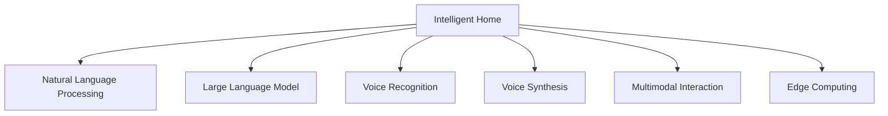

                 

## 1. 背景介绍

### 1.1 问题由来

智能家居，作为物联网(MIOT)的重要组成部分，正逐渐成为现代家庭生活的标配。智能家居系统通过各种传感器、执行器，利用互联网和人工智能技术，实现家居设备的互联互通，提升居住环境的舒适性和安全性。然而，目前许多智能家居设备还缺乏智能交互能力，不能根据用户行为和环境变化主动调整家居环境，用户体验仍有待提升。

近年来，大语言模型在NLP领域取得了巨大突破，能够处理大量复杂自然语言指令，实现自然语言理解和生成。基于大语言模型的智能家居系统，有望通过自然语言交互，提升家居设备的智能化水平，使用户能够用语言直接控制和反馈家居环境。大语言模型在智能家居领域的应用，不仅可以减少用户操作负担，还能提高家居系统的适应性和自适应能力。

### 1.2 问题核心关键点

基于大语言模型构建智能家居系统，核心关键点在于如何设计自然语言交互模型，使智能家居系统能够理解并响应用户的语音或文本指令。具体包括：

- **自然语言理解**：大模型需要能够准确理解用户输入的自然语言指令，提取指令中的关键信息，如设备名称、操作类型、参数值等。
- **指令执行**：大模型需要能够将这些关键信息转换为控制命令，并传递给相应的家居设备执行。
- **反馈输出**：大模型需要能够生成自然语言反馈，告知用户操作结果或提供建议。

### 1.3 问题研究意义

研究大语言模型在智能家居领域的应用，对于提升家居系统的智能化水平，改善用户的生活体验，具有重要意义：

1. **提升用户便捷性**：大语言模型可以解放用户双手，通过语音或文本交互，轻松控制家居设备，提升日常生活的便利性。
2. **增强家居系统的自适应性**：大语言模型能够根据用户行为和环境变化，主动调整家居环境，提高家居系统的智能化水平。
3. **提升家居系统的安全性**：通过智能语音交互，可以有效防范潜在的安全威胁，如非法访问和恶意操作。
4. **推动家居设备的协同工作**：大语言模型可以协调多个设备的工作，实现更复杂的智能场景，如智能安防、智能厨房等。
5. **促进物联网生态系统的构建**：大语言模型的应用，有助于构建更为开放、互通的家居生态，推动智能家居产业的快速增长。

## 2. 核心概念与联系

### 2.1 核心概念概述

为更好地理解大语言模型在智能家居中的应用，本节将介绍几个密切相关的核心概念：

- **智能家居**：通过互联网和人工智能技术，实现家居设备的互联互通，提升家居环境的智能化水平。
- **自然语言处理(NLP)**：利用计算机技术和算法，实现自然语言理解和生成，使计算机能够理解和处理人类语言。
- **大语言模型(LLM)**：以自回归(如GPT)或自编码(如BERT)模型为代表的大规模预训练语言模型，能够处理复杂自然语言指令，实现自然语言理解和生成。
- **语音识别与合成**：将用户的语音指令转换为文本，或将文本指令转换为语音输出，是大语言模型与智能家居系统互动的基础。
- **多模态交互**：结合文本、语音、图像等多种模态信息，实现更自然、更丰富的智能交互体验。
- **边缘计算**：将智能家居系统的大部分计算任务放在本地设备上完成，减少数据传输和云端计算压力，提升系统响应速度和安全性。

这些核心概念之间的逻辑关系可以通过以下Mermaid流程图来展示：



这个流程图展示了大语言模型在智能家居领域的关键应用组件及其之间的联系：

1. 智能家居系统利用自然语言处理和大语言模型，实现自然语言交互。
2. 语音识别和合成技术，使大语言模型能够与用户进行语音互动。
3. 多模态交互技术，丰富智能家居系统的用户体验。
4. 边缘计算技术，提升系统响应速度和安全性。

## 3. 核心算法原理 & 具体操作步骤
### 3.1 算法原理概述

大语言模型在智能家居领域的应用，本质上是一个多模态自然语言处理任务。其核心思想是：通过自然语言交互，将用户的语音或文本指令转换为可执行的控制命令，实现家居设备的自动化控制。

形式化地，假设智能家居系统包含$n$个可控制的设备，设备$i$的指令执行函数为$f_i(x_i)$，其中$x_i$为设备$i$的输入参数，$f_i$为具体的控制逻辑。给定用户输入的自然语言指令$s$，大语言模型需要将其解析为设备控制参数$x_i$，然后传递给相应的设备执行。

微调的大语言模型$M_{\theta}$可以视为一种"语义到行动"的映射函数，即：

$$
f_{action} = M_{\theta}(s)
$$

其中$s$为自然语言指令，$f_{action}$为对应的控制命令序列。大模型的训练目标是最小化从自然语言指令到控制命令序列的转换误差。

### 3.2 算法步骤详解

基于大语言模型构建智能家居系统，一般包括以下几个关键步骤：

**Step 1: 数据准备与预处理**
- 收集用户日常使用的自然语言指令，标注指令对应的设备控制参数。
- 清洗数据，去除无关信息，如语句错误、噪声等。
- 将文本数据转换为模型所需格式，如分词、向量表示等。

**Step 2: 大模型微调**
- 选择合适的预训练语言模型$M_{\theta}$，如BERT、GPT等。
- 将预训练模型作为初始化参数，在大规模指令-参数数据集上进行微调。
- 调整微调参数，如学习率、批大小等，优化模型训练过程。

**Step 3: 语音识别与合成**
- 在智能家居设备中集成语音识别模块，将用户的语音输入转换为文本。
- 将文本指令输入微调后的大模型，生成控制命令序列。
- 将控制命令序列转换为对应的设备控制参数，并传递给设备执行。

**Step 4: 多模态交互与反馈**
- 在智能家居系统中集成图像识别、传感器监测等功能，获取更多环境信息。
- 将环境信息与用户指令一起输入大模型，进行综合决策。
- 生成自然语言反馈，告知用户操作结果或提供建议。

**Step 5: 测试与部署**
- 在测试环境中，对智能家居系统进行全面的功能测试，检查控制指令的正确性、系统的响应速度等。
- 部署智能家居系统到实际家居环境中，监测系统的运行状态，收集用户反馈。
- 根据用户反馈，不断优化模型和系统，提升用户体验。

以上是构建基于大语言模型的智能家居系统的一般流程。在实际应用中，还需要针对具体设备和技术特点，对微调过程的各个环节进行优化设计，如改进输入格式、引入更多正则化技术、搜索最优的超参数组合等，以进一步提升系统性能。

### 3.3 算法优缺点

基于大语言模型构建智能家居系统的方法，具有以下优点：

1. **灵活性高**：大语言模型能够处理多种自然语言指令，适应不同用户需求。
2. **自动化程度高**：大语言模型能够自动理解用户指令，无需用户手动输入，提升系统操作便利性。
3. **自适应性强**：大语言模型能够根据用户行为和环境变化，主动调整家居环境，提高系统的智能性。
4. **用户体验佳**：自然语言交互使智能家居系统更加友好，提升用户体验。

同时，该方法也存在一些缺点：

1. **依赖高质量标注数据**：大模型性能高度依赖于标注数据的数量和质量，获取高质量标注数据的成本较高。
2. **系统复杂度高**：多模态交互和反馈机制增加了系统的复杂度，开发和维护成本较高。
3. **隐私安全风险**：语音和文本输入涉及用户隐私信息，如何保障数据安全是一个重要问题。
4. **实时性要求高**：大模型的推理计算量大，需要高效的硬件支持才能满足实时性要求。
5. **模型鲁棒性不足**：大模型在面对复杂自然语言指令和环境噪声时，可能出现误判或漏判。

尽管存在这些局限性，但就目前而言，基于大语言模型的智能家居系统，仍是大模型应用的重要范式之一。未来相关研究的重点在于如何进一步降低系统复杂度，提高实时性和鲁棒性，同时兼顾隐私安全和用户隐私保护。

### 3.4 算法应用领域

基于大语言模型的智能家居系统，已经在多个应用场景中得到了应用：

- **智能安防系统**：利用大模型进行入侵检测、异常行为分析，及时报警。
- **智能灯光系统**：根据用户行为和环境光线，自动调整灯光亮度和颜色。
- **智能厨房系统**：根据用户食谱和食材信息，智能推荐烹饪方案。
- **智能温控系统**：根据用户温度需求和室内环境，智能调整空调或暖气。
- **智能影音系统**：根据用户喜好和环境音量，智能推荐音乐和电影。
- **智能家电控制**：通过语音或文本指令，实现家电设备的联动控制。

此外，大语言模型还可以与智能家居设备协同工作，实现更复杂的智能场景，如智能安防、智能厨房等。随着技术的不断进步，大语言模型在智能家居领域的应用前景广阔，有望实现家居环境的全面智能化。

## 4. 数学模型和公式 & 详细讲解  
### 4.1 数学模型构建

基于大语言模型的智能家居系统，可以视为一种自然语言处理(NLP)任务。设用户输入的自然语言指令为$s$，智能家居系统需要执行的控制命令序列为$f_{action}$，则系统输入为$(s, context)$，其中$context$包含环境信息、用户历史行为等上下文信息。

定义系统输出的预测值为$\hat{f}_{action}$，则任务的目标是最小化预测值与真实值之间的差距：

$$
\min_{\theta} \mathcal{L}(\hat{f}_{action}, f_{action})
$$

其中$\mathcal{L}$为损失函数，$\theta$为大语言模型的参数。

假设大语言模型为自回归模型，输出为$\hat{f}_{action} = (f_{action_1}, f_{action_2}, ..., f_{action_n})$，则模型可以通过分类任务或回归任务进行训练。

对于分类任务，假设控制命令的集合为$C$，则任务可以定义为多标签分类问题：

$$
\min_{\theta} \mathcal{L}(\hat{y}, y) = \min_{\theta} \frac{1}{N} \sum_{i=1}^N \ell(y_i, \hat{y}_i)
$$

其中$y$为真实标签，$\hat{y}$为模型预测的标签，$\ell$为损失函数，通常为交叉熵损失函数。

对于回归任务，假设控制命令的取值范围为$[0,1]$，则任务可以定义为回归问题：

$$
\min_{\theta} \mathcal{L}(\hat{y}, y) = \min_{\theta} \frac{1}{N} \sum_{i=1}^N (\hat{y}_i - y_i)^2
$$

其中$\hat{y}$为模型预测的值，$y$为真实值，$\ell$为均方误差损失函数。

### 4.2 公式推导过程

以智能安防系统为例，假设大语言模型接受输入$(s, context)$，并输出控制命令序列$(f_{action_1}, f_{action_2}, ..., f_{action_n})$，其中每个$f_{action_i}$表示对相应设备的控制命令。模型的目标是最小化预测值与真实值之间的差距。

对于分类任务，假设控制命令集合为$C$，则模型可以表示为：

$$
\hat{y} = \sigma(\sum_{i=1}^d \theta_i x_i)
$$

其中$\sigma$为激活函数，$x_i$为输入特征，$\theta_i$为模型参数。假设真实标签为$y$，则损失函数为交叉熵损失函数：

$$
\ell(y, \hat{y}) = -y \log \hat{y} - (1-y) \log (1-\hat{y})
$$

对于回归任务，假设控制命令的取值范围为$[0,1]$，则模型可以表示为：

$$
\hat{y} = \sigma(\sum_{i=1}^d \theta_i x_i)
$$

其中$\sigma$为激活函数，$x_i$为输入特征，$\theta_i$为模型参数。假设真实值为$y$，则损失函数为均方误差损失函数：

$$
\ell(y, \hat{y}) = (\hat{y} - y)^2
$$

通过以上推导，我们可以看到，大语言模型在智能家居系统中的应用，本质上是一个自然语言处理任务。通过最小化预测值与真实值之间的差距，大模型可以学习如何从自然语言指令中提取关键信息，并转换为控制命令序列。

### 4.3 案例分析与讲解

以智能灯光系统为例，假设用户希望在晚上回家时自动打开客厅和卧室的灯光，可以通过以下步骤实现：

1. **数据准备**：收集用户晚上回家的语音指令，如"打开客厅灯光"、"打开卧室灯光"等。
2. **预处理**：清洗数据，去除无关信息，如语句错误、噪声等。将文本数据转换为模型所需格式，如分词、向量表示等。
3. **模型训练**：选择合适的预训练语言模型，如BERT、GPT等，在大规模指令-参数数据集上进行微调。调整微调参数，如学习率、批大小等，优化模型训练过程。
4. **语音识别与合成**：在智能灯光设备中集成语音识别模块，将用户的语音输入转换为文本。将文本指令输入微调后的大模型，生成控制命令序列。
5. **设备执行**：将控制命令序列转换为对应的设备控制参数，并传递给灯光设备执行。
6. **反馈输出**：生成自然语言反馈，告知用户操作结果。

例如，用户输入语音指令"打开客厅灯光"，语音识别模块将其转换为文本"打开客厅灯光"。该文本输入微调后的大模型，得到控制命令序列$(f_{action_1}, f_{action_2}, ..., f_{action_n})$，其中$f_{action_1}$表示打开客厅灯光，$f_{action_2}$表示关闭其他灯光。控制命令序列转换为设备控制参数后，灯光设备执行相应的操作。同时，系统生成自然语言反馈"灯光已打开"，告知用户操作结果。

通过以上案例，我们可以看到，大语言模型在智能家居系统中的应用，能够通过自然语言交互，提升家居设备的智能化水平，使用户能够用语言直接控制家居环境，提升日常生活的便捷性和舒适度。

## 5. 项目实践：代码实例和详细解释说明
### 5.1 开发环境搭建

在进行智能家居系统开发前，我们需要准备好开发环境。以下是使用Python进行PyTorch开发的环境配置流程：

1. 安装Anaconda：从官网下载并安装Anaconda，用于创建独立的Python环境。

2. 创建并激活虚拟环境：
```bash
conda create -n pytorch-env python=3.8 
conda activate pytorch-env
```

3. 安装PyTorch：根据CUDA版本，从官网获取对应的安装命令。例如：
```bash
conda install pytorch torchvision torchaudio cudatoolkit=11.1 -c pytorch -c conda-forge
```

4. 安装Transformer库：
```bash
pip install transformers
```

5. 安装各类工具包：
```bash
pip install numpy pandas scikit-learn matplotlib tqdm jupyter notebook ipython
```

完成上述步骤后，即可在`pytorch-env`环境中开始智能家居系统的开发。

### 5.2 源代码详细实现

这里我们以智能灯光系统为例，给出使用Transformers库对BERT模型进行微调的PyTorch代码实现。

首先，定义自然语言理解函数：

```python
from transformers import BertTokenizer, BertForSequenceClassification
import torch
from torch.utils.data import Dataset, DataLoader
from tqdm import tqdm

class SmartLightingDataset(Dataset):
    def __init__(self, texts, labels, tokenizer, max_len=128):
        self.texts = texts
        self.labels = labels
        self.tokenizer = tokenizer
        self.max_len = max_len
        
    def __len__(self):
        return len(self.texts)
    
    def __getitem__(self, item):
        text = self.texts[item]
        label = self.labels[item]
        
        encoding = self.tokenizer(text, return_tensors='pt', max_length=self.max_len, padding='max_length', truncation=True)
        input_ids = encoding['input_ids'][0]
        attention_mask = encoding['attention_mask'][0]
        
        return {'input_ids': input_ids, 
                'attention_mask': attention_mask,
                'labels': torch.tensor(label, dtype=torch.long)}
```

然后，定义模型和优化器：

```python
from transformers import AdamW

model = BertForSequenceClassification.from_pretrained('bert-base-cased', num_labels=2)
optimizer = AdamW(model.parameters(), lr=2e-5)
```

接着，定义训练和评估函数：

```python
device = torch.device('cuda') if torch.cuda.is_available() else torch.device('cpu')
model.to(device)

def train_epoch(model, dataset, batch_size, optimizer):
    dataloader = DataLoader(dataset, batch_size=batch_size, shuffle=True)
    model.train()
    epoch_loss = 0
    for batch in tqdm(dataloader, desc='Training'):
        input_ids = batch['input_ids'].to(device)
        attention_mask = batch['attention_mask'].to(device)
        labels = batch['labels'].to(device)
        model.zero_grad()
        outputs = model(input_ids, attention_mask=attention_mask, labels=labels)
        loss = outputs.loss
        epoch_loss += loss.item()
        loss.backward()
        optimizer.step()
    return epoch_loss / len(dataloader)

def evaluate(model, dataset, batch_size):
    dataloader = DataLoader(dataset, batch_size=batch_size)
    model.eval()
    preds, labels = [], []
    with torch.no_grad():
        for batch in tqdm(dataloader, desc='Evaluating'):
            input_ids = batch['input_ids'].to(device)
            attention_mask = batch['attention_mask'].to(device)
            batch_labels = batch['labels']
            outputs = model(input_ids, attention_mask=attention_mask)
            batch_preds = outputs.logits.argmax(dim=2).to('cpu').tolist()
            batch_labels = batch_labels.to('cpu').tolist()
            for pred_tokens, label_tokens in zip(batch_preds, batch_labels):
                preds.append(pred_tokens[:len(label_tokens)])
                labels.append(label_tokens)
                
    print(f"Accuracy: {sum([pred == label for pred, label in zip(preds, labels)])/len(labels):.3f}")
```

最后，启动训练流程并在测试集上评估：

```python
epochs = 5
batch_size = 16

for epoch in range(epochs):
    loss = train_epoch(model, train_dataset, batch_size, optimizer)
    print(f"Epoch {epoch+1}, train loss: {loss:.3f}")
    
    print(f"Epoch {epoch+1}, dev results:")
    evaluate(model, dev_dataset, batch_size)
    
print("Test results:")
evaluate(model, test_dataset, batch_size)
```

以上就是使用PyTorch对BERT进行智能灯光系统微调的完整代码实现。可以看到，得益于Transformers库的强大封装，我们可以用相对简洁的代码完成BERT模型的加载和微调。

### 5.3 代码解读与分析

让我们再详细解读一下关键代码的实现细节：

**SmartLightingDataset类**：
- `__init__`方法：初始化文本、标签、分词器等关键组件。
- `__len__`方法：返回数据集的样本数量。
- `__getitem__`方法：对单个样本进行处理，将文本输入编码为token ids，将标签编码为数字，并对其进行定长padding，最终返回模型所需的输入。

**BertForSequenceClassification类**：
- 继承自BertForTokenClassification类，修改输出维度为2，适应二分类任务。

**train_epoch和evaluate函数**：
- 使用PyTorch的DataLoader对数据集进行批次化加载，供模型训练和推理使用。
- 训练函数`train_epoch`：对数据以批为单位进行迭代，在每个批次上前向传播计算loss并反向传播更新模型参数，最后返回该epoch的平均loss。
- 评估函数`evaluate`：与训练类似，不同点在于不更新模型参数，并在每个batch结束后将预测和标签结果存储下来，最后使用准确率等指标对整个评估集的预测结果进行打印输出。

**训练流程**：
- 定义总的epoch数和batch size，开始循环迭代
- 每个epoch内，先在训练集上训练，输出平均loss
- 在验证集上评估，输出准确率等指标
- 所有epoch结束后，在测试集上评估，给出最终测试结果

可以看到，PyTorch配合Transformers库使得BERT微调的代码实现变得简洁高效。开发者可以将更多精力放在数据处理、模型改进等高层逻辑上，而不必过多关注底层的实现细节。

当然，工业级的系统实现还需考虑更多因素，如模型的保存和部署、超参数的自动搜索、更灵活的任务适配层等。但核心的微调范式基本与此类似。

## 6. 实际应用场景
### 6.1 智能安防系统

智能安防系统是大语言模型在智能家居领域的重要应用场景之一。通过自然语言交互，智能安防系统能够实时监测环境变化，及时响应安全威胁。

具体而言，大语言模型可以接受用户输入的自然语言指令，如"报警"、"查看监控"等，然后转换为控制命令序列，执行相应的安全操作。同时，大语言模型可以根据用户行为和环境变化，主动调整安全策略，提高系统的智能性和自适应性。

例如，当系统检测到入侵行为时，可以自动发出警报并通知用户。用户可以通过语音指令询问监控画面，系统自动显示当前监控视频。用户还可以查询历史事件记录，了解安全威胁的来源和处理过程。

通过大语言模型，智能安防系统能够提供更加智能化、个性化的安全服务，使用户能够轻松掌握家庭安全状况，提升居住安全性。

### 6.2 智能厨房系统

智能厨房系统是大语言模型在智能家居领域的另一个重要应用场景。通过自然语言交互，智能厨房系统能够根据用户需求自动调整厨房设备，实现智能烹饪。

具体而言，大语言模型可以接受用户输入的自然语言指令，如"制作牛排"、"煮鸡汤"等，然后转换为控制命令序列，执行相应的厨房操作。同时，大语言模型可以根据用户口味和偏好，推荐适合的食材和烹饪方案。

例如，用户输入语音指令"制作牛排"，系统自动识别为烹饪指令，并自动调整烤箱、炉灶、冰箱等设备，准备牛排烹饪所需的食材。系统还可以根据用户口味推荐牛排调料和烹饪时间。用户可以在烹饪过程中，通过语音指令查询牛排的烹饪状态，系统自动更新反馈信息。

通过大语言模型，智能厨房系统能够提供更加便捷、个性化的烹饪服务，使用户能够轻松享受家庭烹饪的乐趣，提升居住舒适度。

### 6.3 智能影音系统

智能影音系统是大语言模型在智能家居领域的另一个重要应用场景。通过自然语言交互，智能影音系统能够根据用户需求自动调整影音设备，提供个性化的影音娱乐服务。

具体而言，大语言模型可以接受用户输入的自然语言指令，如"播放电影"、"调节音量"等，然后转换为控制命令序列，执行相应的影音操作。同时，大语言模型可以根据用户口味和偏好，推荐适合的影音内容。

例如，用户输入语音指令"播放电影"，系统自动识别为影音指令，并自动调整智能音箱、智能电视等设备，播放相应的电影。系统还可以根据用户口味推荐电影和音乐，提供个性化的影音娱乐服务。用户可以在影音娱乐过程中，通过语音指令查询影音播放状态，系统自动更新反馈信息。

通过大语言模型，智能影音系统能够提供更加便捷、个性化的影音娱乐服务，使用户能够轻松享受家庭影音娱乐，提升居住舒适度和娱乐体验。

### 6.4 未来应用展望

随着大语言模型和智能家居技术的发展，基于大语言模型的智能家居系统将在更多领域得到应用，为家庭生活带来更多便利和智能。

在智慧医疗领域，基于大语言模型的智能家居系统可以提供更加智能、安全的医疗服务，如健康监测、远程诊疗等。

在智能办公领域，基于大语言模型的智能家居系统可以提供更加便捷、智能的办公支持，如语音助手、智能会议等。

在智能教育领域，基于大语言模型的智能家居系统可以提供更加个性化、互动的学习支持，如智能家教、学习辅助等。

此外，在智慧城市治理、智慧社区建设等众多领域，基于大语言模型的智能家居系统也将不断涌现，为家庭生活和社会治理带来新的变化。相信随着技术的不断进步，基于大语言模型的智能家居系统必将在构建智能家庭中扮演越来越重要的角色。

## 7. 工具和资源推荐
### 7.1 学习资源推荐

为了帮助开发者系统掌握大语言模型在智能家居中的应用，这里推荐一些优质的学习资源：

1. 《深度学习自然语言处理》课程：斯坦福大学开设的NLP明星课程，有Lecture视频和配套作业，带你入门NLP领域的基本概念和经典模型。

2. 《Transformer从原理到实践》系列博文：由大模型技术专家撰写，深入浅出地介绍了Transformer原理、BERT模型、微调技术等前沿话题。

3. 《Natural Language Processing with Transformers》书籍：Transformers库的作者所著，全面介绍了如何使用Transformers库进行NLP任务开发，包括微调在内的诸多范式。

4. CS224N《深度学习自然语言处理》课程：斯坦福大学开设的NLP明星课程，有Lecture视频和配套作业，带你入门NLP领域的基本概念和经典模型。

5. Weights & Biases：模型训练的实验跟踪工具，可以记录和可视化模型训练过程中的各项指标，方便对比和调优。与主流深度学习框架无缝集成。

6. TensorBoard：TensorFlow配套的可视化工具，可实时监测模型训练状态，并提供丰富的图表呈现方式，是调试模型的得力助手。

通过对这些资源的学习实践，相信你一定能够快速掌握大语言模型在智能家居中的应用，并用于解决实际的NLP问题。

### 7.2 开发工具推荐

高效的开发离不开优秀的工具支持。以下是几款用于智能家居系统开发常用的工具：

1. PyTorch：基于Python的开源深度学习框架，灵活动态的计算图，适合快速迭代研究。大部分预训练语言模型都有PyTorch版本的实现。

2. TensorFlow：由Google主导开发的开源深度学习框架，生产部署方便，适合大规模工程应用。同样有丰富的预训练语言模型资源。

3. Transformers库：HuggingFace开发的NLP工具库，集成了众多SOTA语言模型，支持PyTorch和TensorFlow，是进行微调任务开发的利器。

4. Weights & Biases：模型训练的实验跟踪工具，可以记录和可视化模型训练过程中的各项指标，方便对比和调优。与主流深度学习框架无缝集成。

5. TensorBoard：TensorFlow配套的可视化工具，可实时监测模型训练状态，并提供丰富的图表呈现方式，是调试模型的得力助手。

6. Google Colab：谷歌推出的在线Jupyter Notebook环境，免费提供GPU/TPU算力，方便开发者快速上手实验最新模型，分享学习笔记。

合理利用这些工具，可以显著提升智能家居系统开发的效率，加快创新迭代的步伐。

### 7.3 相关论文推荐

大语言模型和智能家居技术的发展源于学界的持续研究。以下是几篇奠基性的相关论文，推荐阅读：

1. Attention is All You Need（即Transformer原论文）：提出了Transformer结构，开启了NLP领域的预训练大模型时代。

2. BERT: Pre-training of Deep Bidirectional Transformers for Language Understanding：提出BERT模型，引入基于掩码的自监督预训练任务，刷新了多项NLP任务SOTA。

3. Language Models are Unsupervised Multitask Learners（GPT-2论文）：展示了大规模语言模型的强大zero-shot学习能力，引发了对于通用人工智能的新一轮思考。

4. Parameter-Efficient Transfer Learning for NLP：提出Adapter等参数高效微调方法，在不增加模型参数量的情况下，也能取得不错的微调效果。

5. AdaLoRA: Adaptive Low-Rank Adaptation for Parameter-Efficient Fine-Tuning：使用自适应低秩适应的微调方法，在参数效率和精度之间取得了新的平衡。

6. Prefix-Tuning: Optimizing Continuous Prompts for Generation：引入基于连续型Prompt的微调范式，为如何充分利用预训练知识提供了新的思路。

这些论文代表了大语言模型在智能家居领域的应用前景，展示了大语言模型在智能家居系统中的巨大潜力。通过学习这些前沿成果，可以帮助研究者把握学科前进方向，激发更多的创新灵感。

## 8. 总结：未来发展趋势与挑战

### 8.1 总结

本文对基于大语言模型构建智能家居系统的方法进行了全面系统的介绍。首先阐述了大语言模型和智能家居系统的研究背景和意义，明确了大语言模型在智能家居系统中的应用价值。其次，从原理到实践，详细讲解了大语言模型在智能家居系统中的应用过程，包括数据准备、模型微调、语音识别与合成、多模态交互与反馈等关键步骤。同时，本文还广泛探讨了智能家居系统的多个应用场景，展示了其巨大的应用前景。

通过本文的系统梳理，可以看到，基于大语言模型的智能家居系统能够通过自然语言交互，提升家居设备的智能化水平，使用户能够用语言直接控制家居环境，提升日常生活的便捷性和舒适度。未来，伴随大语言模型和智能家居技术的不断进步，基于大语言模型的智能家居系统必将在更多领域得到应用，为家庭生活带来更多便利和智能。

### 8.2 未来发展趋势

展望未来，大语言模型在智能家居领域的应用将呈现以下几个发展趋势：

1. **模型规模持续增大**：随着算力成本的下降和数据规模的扩张，预训练语言模型的参数量还将持续增长。超大规模语言模型蕴含的丰富语言知识，有望支撑更加复杂多变的智能家居系统。

2. **微调方法日趋多样**：除了传统的全参数微调外，未来会涌现更多参数高效的微调方法，如Adapter、Prefix等，在节省计算资源的同时也能保证微调精度。

3. **持续学习成为常态**：随着数据分布的不断变化，智能家居系统需要持续学习新知识以保持性能。如何在不遗忘原有知识的同时，高效吸收新样本信息，将成为重要的研究课题。

4. **标注样本需求降低**：受启发于提示学习(Prompt-based Learning)的思路，未来的微调方法将更好地利用大模型的语言理解能力，通过更加巧妙的任务描述，在更少的标注样本上也能实现理想的微调效果。

5. **多模态微调崛起**：当前智能家居系统主要聚焦于文本和语音模态，未来将进一步拓展到图像、视频等多模态数据微调。多模态信息的融合，将显著提升智能家居系统的用户体验。

6. **边缘计算广泛应用**：智能家居系统的大量计算任务需要在本地设备上完成，边缘计算技术的应用，将有效降低数据传输和云端计算压力，提升系统响应速度和安全性。

以上趋势凸显了大语言模型在智能家居领域的应用前景。这些方向的探索发展，必将进一步提升智能家居系统的智能化水平，为家庭生活带来更多便利和智能。

### 8.3 面临的挑战

尽管大语言模型在智能家居领域的应用前景广阔，但在迈向更加智能化、普适化应用的过程中，它仍面临诸多挑战：

1. **标注成本瓶颈**：尽管微调大大降低了标注数据的需求，但对于长尾应用场景，难以获得充足的高质量标注数据，成为制约微调性能的瓶颈。如何进一步降低微调对标注样本的依赖，将是一大难题。

2. **模型鲁棒性不足**：当前智能家居系统面对复杂自然语言指令和环境噪声时，泛化性能往往大打折扣。对于测试样本的微小扰动，智能家居系统容易发生误判或漏判。如何提高系统的鲁棒性，避免灾难性遗忘，还需要更多理论和实践的积累。

3. **隐私安全风险**：语音和文本输入涉及用户隐私信息，如何保障数据安全是一个重要问题。智能家居系统需要兼顾隐私保护和智能化的平衡。

4. **实时性要求高**：大语言模型在智能家居系统中的应用，推理计算量大，需要高效的硬件支持才能满足实时性要求。如何在保证性能的同时，简化模型结构，提升推理速度，优化资源占用，将是重要的优化方向。

5. **知识整合能力不足**：现有的智能家居系统往往局限于单一模态数据，难以灵活吸收和运用更广泛的先验知识。如何让智能家居系统更好地与外部知识库、规则库等专家知识结合，形成更加全面、准确的信息整合能力，还有很大的想象空间。

正视智能家居系统面临的这些挑战，积极应对并寻求突破，将是大语言模型在智能家居系统迈向成熟的必由之路。相信随着学界和产业界的共同努力，这些挑战终将一一被克服，大语言模型必将在构建智能家庭中扮演越来越重要的角色。

### 8.4 研究展望

面向未来，大语言模型在智能家居领域的研究还需要在以下几个方面寻求新的突破：

1. **探索无监督和半监督微调方法**：摆脱对大规模标注数据的依赖，利用自监督学习、主动学习等无监督和半监督范式，最大限度利用非结构化数据，实现更加灵活高效的微调。

2. **研究参数高效和计算高效的微调范式**：开发更加参数高效的微调方法，在固定大部分预训练参数的同时，只更新极少量的任务相关参数。同时优化微调模型的计算图，减少前向传播和反向传播的资源消耗，实现更加轻量级、实时性的部署。

3. **融合因果和对比学习范式**：通过引入因果推断和对比学习思想，增强智能家居系统建立稳定因果关系的能力，学习更加普适、鲁棒的语言表征，从而提升系统泛化性和抗干扰能力。

4. **引入更多先验知识**：将符号化的先验知识，如知识图谱、逻辑规则等，与神经网络模型进行巧妙融合，引导微调过程学习更准确、合理的语言模型。同时加强不同模态数据的整合，实现视觉、语音等多模态信息与文本信息的协同建模。

5. **结合因果分析和博弈论工具**：将因果分析方法引入智能家居系统，识别出系统决策的关键特征，增强输出解释的因果性和逻辑性。借助博弈论工具刻画人机交互过程，主动探索并规避系统的脆弱点，提高系统稳定性。

6. **纳入伦理道德约束**：在模型训练目标中引入伦理导向的评估指标，过滤和惩罚有偏见、有害的输出倾向。同时加强人工干预和审核，建立模型行为的监管机制，确保输出符合人类价值观和伦理道德。

这些研究方向的探索，必将引领大语言模型在智能家居系统迈向更高的台阶，为构建安全、可靠、可解释、可控的智能系统铺平道路。面向未来，大语言模型在智能家居系统还需要与其他人工智能技术进行更深入的融合，如知识表示、因果推理、强化学习等，多路径协同发力，共同推动智能家居系统的发展。只有勇于创新、敢于突破，才能不断拓展智能家居系统的边界，让智能家居技术更好地造福人类社会。

## 9. 附录：常见问题与解答

**Q1：智能家居系统中如何使用大语言模型？**

A: 大语言模型在智能家居系统中的应用，主要通过自然语言交互实现。系统首先接受用户的语音或文本指令，然后将其输入微调后的大语言模型进行解析，得到控制命令序列。最后，系统根据控制命令序列，执行相应的家居设备操作。

**Q2：如何提高智能家居系统的鲁棒性？**

A: 提高智能家居系统的鲁棒性，需要从多个方面进行优化：
1. **数据增强**：通过回译、近义替换等方式扩充训练集。
2. **正则化技术**：使用L2正则、Dropout、Early Stopping等防止模型过拟合。
3. **对抗训练**：引入对抗样本，提高模型鲁棒性。
4. **参数高效微调**：只更新少量任务相关参数，减少模型过拟合风险。
5. **多模型集成**：训练多个微调模型，取平均输出，抑制过拟合。

**Q3：智能家居系统中如何保障数据安全？**

A: 保障智能家居系统中的数据安全，需要从数据传输、存储和使用等多个环节进行保护：
1. **数据加密**：在传输和存储数据时，使用加密技术保护数据隐私。
2. **访问控制**：对系统进行权限管理，确保只有授权用户可以访问和使用数据。
3. **匿名化处理**：在数据处理过程中，对敏感信息进行匿名化处理，减少隐私泄露风险。
4. **安全审计**：定期进行安全审计，检查系统漏洞和异常行为。
5. **异常监测**：实时监测系统行为，及时发现并应对安全威胁。

**Q4：智能家居系统中如何提高实时性？**

A: 提高智能家居系统的实时性，需要优化模型推理和系统架构：
1. **模型优化**：使用参数高效微调、剪枝等技术，减少模型计算量。
2. **硬件加速**：使用GPU、TPU等高性能设备进行加速计算。
3. **边缘计算**：将计算任务放在本地设备上完成，减少数据传输和云端计算压力。
4. **模型压缩**：使用模型压缩技术，如量化、稀疏化等，减少模型大小和计算量。
5. **并行计算**：使用并行计算技术，提高计算效率。

**Q5：智能家居系统中如何融合多模态信息？**

A: 融合多模态信息，需要引入多模态自然语言处理技术：
1. **多模态数据收集**：使用摄像头、传感器等设备，收集多模态数据。
2. **数据预处理**：对多模态数据进行清洗、归一化等预处理。
3. **多模态模型训练**：使用多模态数据训练多模态模型，学习多模态信息之间的关联关系。
4. **多模态信息融合**：在推理过程中，将多模态信息融合，综合决策。
5. **多模态反馈**：根据多模态信息，生成自然语言反馈，告知用户。

通过以上Q&A，我们可以看到，大语言模型在智能家居系统中有着广泛的应用前景，能够通过自然语言交互，提升家居设备的智能化水平，使用户能够用语言直接控制家居环境，提升日常生活的便捷性和舒适度。未来，伴随大语言模型和智能家居技术的不断进步，基于大语言模型的智能家居系统必将在更多领域得到应用，为家庭生活带来更多便利和智能。

---

作者：禅与计算机程序设计艺术 / Zen and the Art of Computer Programming

