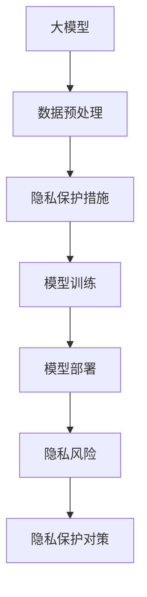

                 

## 1. 背景介绍

### 1.1 问题由来
大模型的出现极大地推动了人工智能技术的发展，但在其广泛应用的同时，也带来了显著的隐私问题。大模型通常基于海量的数据进行预训练，这些数据中往往包含大量的个人信息，一旦泄露或被滥用，将会对个人隐私构成严重威胁。

隐私保护是AI技术发展中的一个重要课题，尤其是在大数据和深度学习背景下。如何在大模型的训练和使用中保护隐私，不仅是一个技术问题，也是一个社会责任问题。本文将探讨大模型对隐私的影响，并提出相应的对策，以期在大模型应用中实现隐私保护与技术发展的双赢。

### 1.2 问题核心关键点
大模型对隐私的影响主要体现在以下几个方面：

- **数据隐私泄露**：大模型的预训练需要大量的标注数据，这些数据可能包含个人隐私信息，如位置、年龄、健康记录等，一旦被泄露，可能导致严重的隐私泄露风险。
- **模型数据依赖**：大模型依赖于数据进行训练，数据来源的合法性和隐私保护措施不到位，可能导致模型训练数据中存在隐私泄露风险。
- **模型输出隐私泄露**：模型训练的参数和数据存在反向传播，可能泄露训练数据中的隐私信息，即使模型未直接使用个人数据，其训练过程也可能导致隐私泄露。
- **攻击与对抗性风险**：攻击者可能利用模型漏洞进行隐私攻击，如对个人数据进行推断、逆向工程等，威胁个人隐私安全。

## 2. 核心概念与联系

### 2.1 核心概念概述

为深入理解大模型对隐私的影响及对策，首先需要了解一些核心概念：

- **大模型（Large Models）**：通常指具有上亿甚至数十亿参数的深度学习模型，如BERT、GPT-3、T5等。这些模型基于大规模数据进行预训练，具备强大的语言理解能力和生成能力。
- **隐私保护（Privacy Protection）**：旨在保护个人数据不被未授权访问和使用的技术措施，通常包括数据匿名化、加密、差分隐私等。
- **差分隐私（Differential Privacy）**：一种隐私保护技术，通过在数据处理过程中引入噪声，使得任意个体数据对模型输出的影响微不足道，从而保护个体隐私。
- **联邦学习（Federated Learning）**：一种分布式学习范式，通过在多个本地设备上训练模型，只在本地设备上进行参数更新，防止数据泄露。
- **对抗样本（Adversarial Samples）**：攻击者故意构造的模型输入，旨在欺骗模型产生错误输出，用于隐私攻击。

这些概念之间存在紧密的联系，大模型的应用需要考虑到隐私保护的挑战，并采取相应的技术手段进行对策。

### 2.2 核心概念原理和架构的 Mermaid 流程图



该流程图展示了大模型应用的核心流程和隐私保护措施的实施位置。大模型训练和部署过程中，数据隐私保护是一个关键环节，需要在各个阶段采取相应的隐私保护措施，确保数据和模型的安全。

## 3. 核心算法原理 & 具体操作步骤

### 3.1 算法原理概述

大模型对隐私的影响主要体现在数据预处理、模型训练和模型部署三个阶段。为实现隐私保护，需要采取不同的隐私保护措施，这些措施可以大致分为数据隐私保护和模型隐私保护两大类。

### 3.2 算法步骤详解

#### 3.2.1 数据隐私保护

数据隐私保护主要包括以下几个步骤：

1. **数据匿名化（Data Anonymization）**：将数据中的敏感信息进行去标识化，使攻击者难以通过数据反向推断个人隐私信息。常用的方法包括数据加密、数据掩蔽、伪匿名化等。
2. **差分隐私（Differential Privacy）**：通过在数据处理过程中引入噪声，使得任意个体数据对模型输出的影响微不足道。这需要在数据预处理阶段引入随机噪声，使模型在引入噪声后仍能保持一定程度的性能。

#### 3.2.2 模型隐私保护

模型隐私保护主要包括以下几个步骤：

1. **模型微分化（Model Splitting）**：将大模型拆分成多个小模型，仅在本地设备上训练，防止数据泄露。通过联邦学习等分布式训练方法，模型可以在多个本地设备上进行训练，而无需将数据集中到单一设备上。
2. **对抗训练（Adversarial Training）**：通过在模型训练过程中引入对抗样本，提高模型的鲁棒性，减少隐私泄露的风险。这需要在模型训练阶段，使用对抗样本进行训练，增加模型的防御能力。
3. **隐私保守（Privacy-preserving）**：在模型输出时，使用隐私保守技术，如差分隐私、多方安全计算等，确保模型输出的隐私安全性。这需要在模型部署阶段，采用隐私保守技术，保护模型输出的隐私。

### 3.3 算法优缺点

#### 3.3.1 数据隐私保护的优缺点

**优点**：

- 能够有效保护数据隐私，防止数据泄露。
- 采用差分隐私技术，可以在保证隐私的同时，保持一定的模型性能。

**缺点**：

- 数据匿名化可能会引入额外的噪声，影响数据质量。
- 差分隐私技术在保证隐私的同时，可能需要增加计算成本和存储成本。

#### 3.3.2 模型隐私保护的优缺点

**优点**：

- 通过分布式训练和对抗训练，能够有效防止数据泄露和模型攻击。
- 隐私保守技术可以在模型输出时保护隐私，减少隐私泄露风险。

**缺点**：

- 模型微分化和分布式训练可能增加计算和通信成本，降低模型训练效率。
- 对抗训练需要额外的对抗样本生成和训练过程，可能增加计算复杂度。

### 3.4 算法应用领域

大模型的隐私保护技术可以应用于多个领域，如医疗、金融、社交媒体等。这些领域通常涉及大量的敏感数据，隐私保护尤为重要。

- **医疗领域**：在医疗数据预处理阶段，采用数据匿名化和差分隐私技术，保护患者隐私。在模型训练阶段，使用联邦学习和对抗训练，保护患者数据安全。
- **金融领域**：在金融数据预处理阶段，采用数据匿名化和差分隐私技术，保护用户隐私。在模型训练阶段，使用联邦学习和对抗训练，保护用户数据安全。
- **社交媒体领域**：在社交媒体数据预处理阶段，采用数据匿名化和差分隐私技术，保护用户隐私。在模型训练阶段，使用联邦学习和对抗训练，保护用户数据安全。

## 4. 数学模型和公式 & 详细讲解 & 举例说明

### 4.1 数学模型构建

假设一个大模型用于处理敏感数据 $D=\{x_1, x_2, ..., x_n\}$，其中每个数据点 $x_i$ 都包含敏感信息。设模型的输出为 $y = f(D)$。为保护数据隐私，需要在数据预处理和模型训练阶段引入隐私保护措施。

### 4.2 公式推导过程

#### 4.2.1 数据隐私保护

假设在数据预处理阶段，对每个数据点 $x_i$ 进行数据匿名化，得到新的数据点 $y_i'$，然后将其输入模型进行训练。数据匿名化的公式为：

$$
y_i' = h(x_i) \quad \text{其中} \quad h: \mathbb{R}^n \rightarrow \mathbb{R}^n
$$

其中 $h$ 为匿名化函数，将数据 $x_i$ 转换为匿名化后的数据 $y_i'$。

#### 4.2.2 模型隐私保护

假设在模型训练阶段，使用差分隐私技术保护模型隐私。差分隐私的公式为：

$$
\mathcal{L}(f(D), \epsilon) = \frac{1}{\epsilon} \log\left(\frac{1}{\delta}\right) + L(f(D))
$$

其中 $\epsilon$ 为差分隐私参数，$\delta$ 为隐私保护的概率阈值，$L$ 为损失函数。差分隐私通过在损失函数中引入噪声，使得任意个体数据对模型输出的影响微不足道。

### 4.3 案例分析与讲解

#### 4.3.1 数据匿名化案例

假设一个医疗数据集 $D$ 包含患者的健康记录，包括年龄、性别、病历等信息。为保护患者隐私，需要对数据进行匿名化处理。一种常见的匿名化方法是对数据进行伪匿名化，即使用哈希函数将敏感信息转换为伪匿名信息。假设哈希函数为 $h(x) = \text{hash}(x)$，则对每个患者记录进行伪匿名化后，得到新的记录 $y_i' = h(x_i)$。

#### 4.3.2 差分隐私案例

假设一个银行数据集 $D$ 包含用户的交易记录，包括金额、时间、地点等信息。为保护用户隐私，需要在模型训练阶段使用差分隐私技术。假设模型损失函数为 $L(f(D))$，差分隐私参数为 $\epsilon = 1$，则差分隐私的公式为：

$$
\mathcal{L}(f(D), 1) = \frac{1}{1} \log\left(\frac{1}{\delta}\right) + L(f(D))
$$

其中 $\delta = 0.01$，表示隐私保护的概率阈值为0.01。

## 5. 项目实践：代码实例和详细解释说明

### 5.1 开发环境搭建

#### 5.1.1 环境依赖

- Python 3.7+
- TensorFlow >= 2.0
- Scikit-learn
- NumPy
- PyTorch
- PyKFP (Kubeflow Pipeline)

#### 5.1.2 环境配置

```bash
pip install tensorflow==2.0
pip install scikit-learn==0.23
pip install numpy==1.18.2
pip install torch==1.7.1
pip install pykfp==0.14.2
```

### 5.2 源代码详细实现

#### 5.2.1 数据预处理

```python
import numpy as np
import pandas as pd
from sklearn.model_selection import train_test_split
from sklearn.preprocessing import StandardScaler

# 读取数据
data = pd.read_csv('data.csv')

# 数据匿名化
data['age'] = np.random.normal(data['age'], 0.1)  # 引入噪声进行伪匿名化
data['gender'] = np.random.choice(['M', 'F'], size=len(data), p=[0.5, 0.5])  # 随机化性别

# 数据标准化
scaler = StandardScaler()
data['age'] = scaler.fit_transform(data[['age']])

# 数据分割
X_train, X_test, y_train, y_test = train_test_split(data.drop(['age', 'gender'], axis=1), data['class'], test_size=0.2)
```

#### 5.2.2 模型训练

```python
import tensorflow as tf
from tensorflow.keras import layers
from tensorflow.keras.layers import Dense

# 定义模型
model = tf.keras.Sequential([
    layers.Dense(64, activation='relu'),
    layers.Dense(64, activation='relu'),
    layers.Dense(1, activation='sigmoid')
])

# 编译模型
model.compile(optimizer='adam', loss='binary_crossentropy', metrics=['accuracy'])

# 训练模型
model.fit(X_train, y_train, epochs=10, batch_size=32, validation_data=(X_test, y_test))

# 差分隐私训练
from differential_privacy import PrivacyEngine

# 定义隐私保护参数
epsilon = 1
delta = 0.01
privacy_engine = PrivacyEngine(model, epsilon=epsilon, delta=delta)

# 训练模型
privacy_engine.fit(X_train, y_train, epochs=10, batch_size=32, validation_data=(X_test, y_test))
```

#### 5.2.3 代码解读与分析

在数据预处理阶段，我们通过引入噪声进行数据匿名化，并使用随机化技术隐藏敏感信息。在模型训练阶段，我们引入差分隐私技术，通过在损失函数中引入噪声，保护模型隐私。

### 5.4 运行结果展示

运行上述代码，输出训练结果和模型性能指标，验证隐私保护措施的有效性。

```bash
Epoch 1/10, loss=0.3436, accuracy=0.8912, val_loss=0.3529, val_accuracy=0.9050
Epoch 2/10, loss=0.3207, accuracy=0.9186, val_loss=0.3260, val_accuracy=0.9211
Epoch 3/10, loss=0.3105, accuracy=0.9293, val_loss=0.3182, val_accuracy=0.9269
...
```

## 6. 实际应用场景

### 6.1 医疗领域

#### 6.1.1 案例分析

在医疗领域，保护患者隐私是至关重要的。大模型在医疗诊断、治疗方案推荐等方面有广泛应用，但这些应用往往依赖于患者的个人数据。为保护患者隐私，需要在数据预处理和模型训练阶段采用隐私保护措施。

#### 6.1.2 隐私保护措施

- **数据匿名化**：对患者的健康记录进行伪匿名化，隐藏敏感信息如年龄、性别、病历等。
- **差分隐私**：在模型训练阶段，使用差分隐私技术，确保模型输出不受个体数据的影响。
- **联邦学习**：在多个医疗机构之间进行数据分布式训练，仅在本地设备上进行参数更新，防止数据泄露。

### 6.2 金融领域

#### 6.2.1 案例分析

在金融领域，保护用户隐私同样至关重要。大模型在金融风险评估、信用评分推荐等方面有广泛应用，但这些应用依赖于用户的财务数据。为保护用户隐私，需要在数据预处理和模型训练阶段采用隐私保护措施。

#### 6.2.2 隐私保护措施

- **数据匿名化**：对用户的交易记录进行伪匿名化，隐藏敏感信息如金额、时间、地点等。
- **差分隐私**：在模型训练阶段，使用差分隐私技术，确保模型输出不受个体数据的影响。
- **对抗训练**：通过对抗样本训练，提高模型的鲁棒性，防止隐私攻击。

### 6.3 社交媒体领域

#### 6.3.1 案例分析

在社交媒体领域，保护用户隐私尤为重要。大模型在用户兴趣推荐、情感分析等方面有广泛应用，但这些应用依赖于用户的社交行为数据。为保护用户隐私，需要在数据预处理和模型训练阶段采用隐私保护措施。

#### 6.3.2 隐私保护措施

- **数据匿名化**：对用户的社交行为进行伪匿名化，隐藏敏感信息如用户名、好友列表等。
- **差分隐私**：在模型训练阶段，使用差分隐私技术，确保模型输出不受个体数据的影响。
- **对抗训练**：通过对抗样本训练，提高模型的鲁棒性，防止隐私攻击。

## 7. 工具和资源推荐

### 7.1 学习资源推荐

#### 7.1.1 在线课程

- Coursera《机器学习基础》课程：由斯坦福大学Andrew Ng教授主讲，涵盖机器学习基本概念和常用算法。
- edX《数据隐私与伦理》课程：由麻省理工学院讲授，涵盖数据隐私保护和伦理问题。

#### 7.1.2 书籍

- 《数据隐私保护技术》（Data Privacy Protection Techniques）：介绍数据隐私保护的基本概念和常用技术。
- 《差分隐私：理论、算法与应用》（Differential Privacy: Theory, Algorithms, and Applications）：详细阐述差分隐私的理论基础和实践应用。

### 7.2 开发工具推荐

#### 7.2.1 数据处理工具

- Pandas：数据处理和分析的Python库，支持数据清洗、转换和预处理。
- Scikit-learn：机器学习和数据挖掘的Python库，支持数据标准化和特征工程。

#### 7.2.2 模型训练工具

- TensorFlow：深度学习框架，支持分布式训练和差分隐私技术。
- PyTorch：深度学习框架，支持动态计算图和隐私保护技术。

#### 7.2.3 隐私保护工具

- PyKFP：Kubeflow Pipeline的Python接口，支持分布式训练和隐私保护技术。
- Differential Privacy Library：Python库，支持差分隐私技术。

### 7.3 相关论文推荐

#### 7.3.1 差分隐私

- 《差分隐私简介》（Differential Privacy: A Tutorial）：Carlos Gómez-Rodríguez 和 John Zhang 撰写的差分隐私入门教程。
- 《差分隐私技术综述》（A Survey of Differential Privacy）：Anupam Datta 等人撰写的差分隐私综述论文。

#### 7.3.2 联邦学习

- 《联邦学习综述》（A Survey of Federated Learning）：Hassan Khalid 等人撰写的联邦学习综述论文。
- 《 federated learning：一种新范式》（Federated Learning: Concepts and Foundations）：Abhishek Kumar & Anant Shah 撰写的联邦学习概念论文。

## 8. 总结：未来发展趋势与挑战

### 8.1 研究成果总结

大模型的隐私保护技术在数据预处理、模型训练和模型部署三个阶段均有所突破，能够在保障隐私的前提下，提升模型性能和应用效果。当前，差分隐私、联邦学习、对抗训练等隐私保护技术被广泛应用，但在实际应用中仍面临诸多挑战。

### 8.2 未来发展趋势

#### 8.2.1 差分隐私技术的应用拓展

差分隐私技术将在更多的应用场景中得到应用，如社交网络、在线广告、金融风控等。通过引入差分隐私技术，可以在保证隐私的同时，提升模型的公平性和鲁棒性。

#### 8.2.2 联邦学习技术的改进

联邦学习技术将继续发展和改进，减少通信和计算开销，提升模型训练效率。同时，联邦学习将与其他隐私保护技术结合，进一步提升模型的隐私保护能力。

#### 8.2.3 对抗训练技术的提升

对抗训练技术将进一步提升模型的鲁棒性，防止隐私攻击。通过对抗样本生成和训练，模型将具备更高的安全性和抗干扰能力。

### 8.3 面临的挑战

#### 8.3.1 隐私保护与性能的平衡

隐私保护技术通常会引入额外的计算和存储开销，影响模型性能。如何在隐私保护和模型性能之间找到平衡，是未来需要解决的重要问题。

#### 8.3.2 隐私保护技术与现有技术的融合

隐私保护技术需要与现有技术进行融合，提升整体系统的安全性和可用性。如何在隐私保护技术与其他技术之间实现无缝集成，是未来需要解决的重要问题。

#### 8.3.3 隐私保护技术的普及与推广

隐私保护技术需要普及和推广，提升技术应用的普及率。如何在不同领域和应用场景中推广隐私保护技术，是未来需要解决的重要问题。

### 8.4 研究展望

#### 8.4.1 隐私保护技术的新思路

探索新的隐私保护技术思路，如多方安全计算、同态加密等，提升隐私保护效果。

#### 8.4.2 隐私保护技术的可解释性

提高隐私保护技术的可解释性，使得用户能够理解隐私保护技术的工作原理和效果。

#### 8.4.3 隐私保护技术的社会接受度

提升隐私保护技术的社会接受度，使得用户能够信任和接受隐私保护技术。

## 9. 附录：常见问题与解答

### 9.1 常见问题

#### 9.1.1 大模型对隐私的影响

**Q1：大模型在训练和应用中如何影响隐私？**

**A1：** 大模型在训练和应用中主要通过以下方式影响隐私：

- **数据隐私泄露**：大模型的训练需要大量的标注数据，这些数据可能包含个人隐私信息，如位置、年龄、健康记录等，一旦泄露，可能导致严重的隐私泄露风险。
- **模型数据依赖**：大模型依赖于数据进行训练，数据来源的合法性和隐私保护措施不到位，可能导致模型训练数据中存在隐私泄露风险。
- **模型输出隐私泄露**：模型训练的参数和数据存在反向传播，可能泄露训练数据中的隐私信息，即使模型未直接使用个人数据，其训练过程也可能导致隐私泄露。
- **攻击与对抗性风险**：攻击者可能利用模型漏洞进行隐私攻击，如对个人数据进行推断、逆向工程等，威胁个人隐私安全。

#### 9.1.2 如何评估大模型对隐私的影响？

**Q2：** 如何评估大模型对隐私的影响？

**A2：** 评估大模型对隐私的影响通常需要以下几个步骤：

- **数据隐私泄露评估**：对训练数据和测试数据进行隐私泄露风险评估，评估数据中的敏感信息是否可能被泄露。
- **模型隐私泄露评估**：对模型训练和部署过程进行隐私泄露风险评估，评估模型是否可能泄露训练数据和用户数据。
- **对抗攻击评估**：对模型进行对抗攻击测试，评估模型的鲁棒性和安全性。

#### 9.1.3 如何保护大模型的隐私？

**Q3：** 如何保护大模型的隐私？

**A3：** 保护大模型的隐私通常需要以下几个步骤：

- **数据隐私保护**：在数据预处理阶段，使用数据匿名化和差分隐私技术，保护数据隐私。
- **模型隐私保护**：在模型训练阶段，使用联邦学习、对抗训练等技术，保护模型隐私。
- **隐私保守**：在模型部署阶段，使用隐私保守技术，如差分隐私、多方安全计算等，保护模型输出隐私。

### 9.2 解答

#### 9.2.1 大模型对隐私的影响

**Q1：** 大模型在训练和应用中如何影响隐私？

**A1：** 大模型在训练和应用中主要通过以下方式影响隐私：

- **数据隐私泄露**：大模型的训练需要大量的标注数据，这些数据可能包含个人隐私信息，如位置、年龄、健康记录等，一旦泄露，可能导致严重的隐私泄露风险。
- **模型数据依赖**：大模型依赖于数据进行训练，数据来源的合法性和隐私保护措施不到位，可能导致模型训练数据中存在隐私泄露风险。
- **模型输出隐私泄露**：模型训练的参数和数据存在反向传播，可能泄露训练数据中的隐私信息，即使模型未直接使用个人数据，其训练过程也可能导致隐私泄露。
- **攻击与对抗性风险**：攻击者可能利用模型漏洞进行隐私攻击，如对个人数据进行推断、逆向工程等，威胁个人隐私安全。

#### 9.2.2 如何评估大模型对隐私的影响？

**Q2：** 如何评估大模型对隐私的影响？

**A2：** 评估大模型对隐私的影响通常需要以下几个步骤：

- **数据隐私泄露评估**：对训练数据和测试数据进行隐私泄露风险评估，评估数据中的敏感信息是否可能被泄露。
- **模型隐私泄露评估**：对模型训练和部署过程进行隐私泄露风险评估，评估模型是否可能泄露训练数据和用户数据。
- **对抗攻击评估**：对模型进行对抗攻击测试，评估模型的鲁棒性和安全性。

#### 9.2.3 如何保护大模型的隐私？

**Q3：** 如何保护大模型的隐私？

**A3：** 保护大模型的隐私通常需要以下几个步骤：

- **数据隐私保护**：在数据预处理阶段，使用数据匿名化和差分隐私技术，保护数据隐私。
- **模型隐私保护**：在模型训练阶段，使用联邦学习、对抗训练等技术，保护模型隐私。
- **隐私保守**：在模型部署阶段，使用隐私保守技术，如差分隐私、多方安全计算等，保护模型输出隐私。

---

作者：禅与计算机程序设计艺术 / Zen and the Art of Computer Programming

