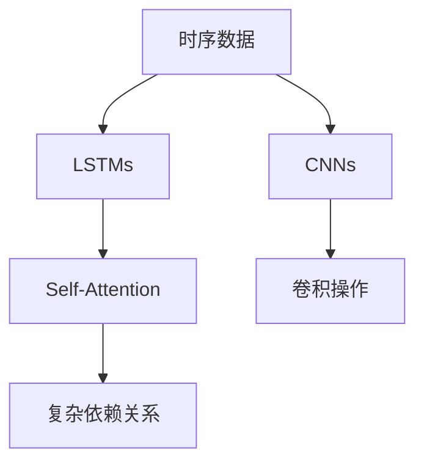

                 

# 大模型技术的时序数据处理

> 关键词：时序数据, 时间序列, 大模型, 深度学习, 卷积神经网络, 长短期记忆网络, 自注意力机制

## 1. 背景介绍

### 1.1 问题由来
时序数据在现实世界中无处不在，无论是金融市场、物联网、互联网社交行为，还是自然灾害预测、智能电网管理等，都广泛涉及时间序列的分析与预测。如何高效、准确地处理和分析时序数据，是许多领域亟待解决的问题。传统的时间序列分析方法往往依赖于统计模型和规则，难以处理复杂非线性关系。近年来，深度学习特别是基于卷积神经网络(CNN)和长短期记忆网络(LSTM)的大模型技术，为时序数据的处理提供了新的思路。

### 1.2 问题核心关键点
基于深度学习的大模型方法，通过端到端的自动特征提取与模型训练，能够高效地捕捉时序数据中的复杂关系。特别地，卷积神经网络能够有效地处理连续的时序数据，自注意力机制能够更好地捕捉时间序列中的长期依赖关系。

## 2. 核心概念与联系

### 2.1 核心概念概述

为更好地理解基于深度学习的大模型技术在时序数据处理中的应用，本节将介绍几个关键概念：

- 时序数据(Time Series Data)：具有时间维度且按时间顺序排列的数据集合。时序数据具有连续性、周期性、趋势性等特点。
- 深度学习(Deep Learning)：一种基于多层神经网络的学习范式，通过多个层次的特征提取与非线性映射，进行数据建模和预测。
- 卷积神经网络(Convolutional Neural Networks, CNNs)：一种以卷积操作为核心的神经网络结构，特别适合处理具有空间局部性、顺序性的数据。
- 长短期记忆网络(Long Short-Term Memory Networks, LSTMs)：一种能够更好地捕捉长期依赖关系的循环神经网络，通过门控机制控制信息的传递与遗忘。
- 自注意力机制(Self-Attention Mechanism)：一种能够对序列数据中的不同位置进行动态关注与加权，从而捕捉序列中复杂依赖关系的机制。

这些概念之间的逻辑关系可以通过以下Mermaid流程图来展示：



这个流程图展示了大模型方法在处理时序数据时的关键步骤：

1. 时序数据经过卷积层提取局部特征。
2. 时序数据通过LSTM层捕捉长期依赖关系。
3. 自注意力机制对序列数据中的不同位置进行关注，进一步捕捉复杂依赖关系。

## 3. 核心算法原理 & 具体操作步骤
### 3.1 算法原理概述

基于深度学习的大模型方法在处理时序数据时，主要利用卷积神经网络和长短期记忆网络，通过端到端的训练自动地提取时序数据的特征并进行预测。其核心算法原理如下：

- 卷积神经网络通过卷积操作捕捉时序数据中的局部特征。卷积核在时序数据上滑动，提取局部特征，并通过池化层减少维度。

- 长短期记忆网络通过门控机制控制信息的传递与遗忘，能够更好地捕捉时序数据中的长期依赖关系。LSTM中引入了遗忘门、输入门、输出门等机制，合理控制信息的输入与输出。

- 自注意力机制通过对序列数据中的不同位置进行动态关注与加权，能够捕捉序列中的复杂依赖关系，从而提高模型的准确性。自注意力机制的核心是利用查询、键、值三个向量进行点积计算，得到各位置的注意力权重，从而对不同位置进行加权。

### 3.2 算法步骤详解

基于深度学习的大模型方法在时序数据处理时，一般包含以下几个关键步骤：

**Step 1: 数据预处理**
- 对时序数据进行归一化、截断等预处理操作，确保数据格式一致。
- 将时序数据按时间顺序排列，分割为训练集、验证集和测试集。

**Step 2: 构建模型**
- 选择合适的卷积神经网络架构，如1D-CNN、TCN等，设置卷积核大小、步长、池化大小等超参数。
- 引入长短期记忆网络，设置LSTM层的数量、神经元数量等超参数。
- 设计自注意力机制，选择注意力头的数量、掩码等超参数。

**Step 3: 训练模型**
- 使用梯度下降等优化算法，对模型进行反向传播训练。
- 在训练集上通过前向传播计算损失函数，反向传播更新参数。
- 在验证集上定期评估模型性能，调整超参数以防止过拟合。
- 在测试集上测试模型效果，得到最终的预测结果。

**Step 4: 模型评估**
- 使用评价指标如MAE、RMSE、SMAPE等，评估模型在测试集上的预测准确度。
- 可视化模型的预测结果，评估模型的时序预测性能。

### 3.3 算法优缺点

基于深度学习的大模型方法在时序数据处理时，具有以下优点：
1. 高效性：通过端到端训练，大模型方法能够高效地自动提取时序数据的特征。
2. 鲁棒性：大模型方法对数据噪声和缺失较为鲁棒，具有较强的泛化能力。
3. 可扩展性：大模型方法能够处理任意长度的时序数据，具有很好的可扩展性。

同时，该方法也存在一些局限性：
1. 对标注数据的依赖：大模型方法通常需要标注数据进行训练，对标注数据的数量和质量要求较高。
2. 训练成本高：深度学习模型需要较大的计算资源，特别是GPU/TPU等高性能设备，训练成本较高。
3. 模型复杂度高：大模型方法通常具有较高的模型复杂度，可能导致过拟合等问题。
4. 解释性不足：大模型方法通常是黑盒模型，难以解释模型的内部推理机制。

尽管存在这些局限性，但就目前而言，基于深度学习的大模型方法在时序数据处理中依然具有无可比拟的优势，成为处理复杂时序数据的重要工具。未来相关研究的重点在于如何降低对标注数据的依赖，提高模型的解释性和鲁棒性，同时兼顾训练效率和模型复杂度。

### 3.4 算法应用领域

基于深度学习的大模型方法在时序数据处理时，已经广泛应用于多个领域，例如：

- 金融预测：预测股票价格、货币汇率等金融市场数据。通过大模型方法，可以自动捕捉市场的趋势、周期性等复杂关系。
- 天气预测：预测天气变化趋势、极端天气事件等。通过大模型方法，可以自动捕捉气象数据中的非线性关系。
- 交通流量预测：预测城市交通流量变化，优化交通管理。通过大模型方法，可以自动捕捉交通数据的周期性、趋势性等。
- 电力负荷预测：预测电力负荷变化，优化能源分配。通过大模型方法，可以自动捕捉电力数据的周期性、季节性等。
- 工业设备故障预测：预测工业设备的故障发生概率，优化维护策略。通过大模型方法，可以自动捕捉设备数据的异常行为。

除了上述这些经典应用外，大模型方法还被创新性地应用到更多场景中，如自然灾害预测、智能电网管理等，为时序数据分析提供了新的解决方案。随着预训练模型和深度学习方法的不断进步，相信基于深度学习的大模型方法将在更广阔的应用领域大放异彩。

## 4. 数学模型和公式 & 详细讲解  
### 4.1 数学模型构建

本节将使用数学语言对基于深度学习的大模型方法在时序数据处理中的数学原理进行更加严格的刻画。

设时序数据为 $X = \{x_t\}_{t=1}^T$，其中 $x_t \in \mathbb{R}^d$ 为第 $t$ 个时间点的特征向量。假设模型为 $M_{\theta}:\mathbb{R}^d \rightarrow \mathbb{R}$，其中 $\theta$ 为模型参数。

定义模型 $M_{\theta}$ 在输入 $x_t$ 上的预测值为 $y_t = M_{\theta}(x_t)$。则时序数据的预测结果为 $\hat{Y} = \{y_t\}_{t=1}^T$。

在大模型方法中，常用的损失函数为均方误差损失函数（Mean Squared Error, MSE），定义为：

$$
\mathcal{L}(\theta) = \frac{1}{T} \sum_{t=1}^T (y_t - \hat{y}_t)^2
$$

通过梯度下降等优化算法，最小化损失函数 $\mathcal{L}(\theta)$，使得模型 $M_{\theta}$ 能够准确预测时序数据 $\hat{Y}$。

### 4.2 公式推导过程

以下我们以1D卷积神经网络(CNN)为例，推导其时序预测的数学过程。

设卷积核大小为 $k$，步长为 $s$，池化大小为 $p$，激活函数为 $\sigma$。卷积层在时序数据 $X$ 上的预测结果为：

$$
h_t = \sigma\left(\sum_{i=1}^{k-1} w_i x_{t-i+1} \right)
$$

其中 $w_i$ 为卷积核权重。通过多层的卷积和池化，可以提取时序数据的局部特征。

引入长短期记忆网络(LSTM)后，可以捕捉时序数据中的长期依赖关系。假设LSTM层的隐藏状态为 $h_t$，则LSTM的预测结果为：

$$
y_t = \sigma\left(h_t\right)
$$

其中 $\sigma$ 为激活函数，如Sigmoid或Tanh。LSTM通过门控机制控制信息的输入与输出，能够更好地处理时序数据中的长期依赖关系。

通过自注意力机制，可以进一步捕捉时序数据中的复杂依赖关系。假设时序数据中各位置的注意力权重为 $\alpha_t$，则自注意力机制的预测结果为：

$$
y_t = \sum_{i=1}^T \alpha_i x_i
$$

其中 $\alpha_i = \frac{\exp(\mathbf{q}^T \mathbf{K}_i)}{\sum_{j=1}^T \exp(\mathbf{q}^T \mathbf{K}_j)}$，$\mathbf{q}, \mathbf{K}_i, \mathbf{V}_i$ 为查询、键、值向量。通过自注意力机制，模型能够动态关注时序数据中的不同位置，从而捕捉序列中的复杂依赖关系。

### 4.3 案例分析与讲解

假设我们有一组历史温度数据 $X = \{x_t\}_{t=1}^{30}$，其中 $x_t = (x_{t-1}, x_{t-2}, x_{t-3})$ 为三个时刻的温度数据。我们的目标是预测第31时刻的温度 $y_{31}$。

首先，将时序数据 $X$ 输入卷积神经网络进行特征提取：

$$
h_t = \sigma\left(\sum_{i=1}^{3} w_i x_{t-i+1} \right)
$$

然后，将提取的特征输入长短期记忆网络进行时间依赖关系建模：

$$
y_{31} = \sigma\left(h_{31}\right)
$$

最后，通过自注意力机制，模型可以进一步捕捉时序数据中的复杂依赖关系，从而得到更加准确的预测结果。

## 5. 项目实践：代码实例和详细解释说明
### 5.1 开发环境搭建

在进行时序数据处理的大模型实践前，我们需要准备好开发环境。以下是使用Python进行PyTorch开发的环境配置流程：

1. 安装Anaconda：从官网下载并安装Anaconda，用于创建独立的Python环境。

2. 创建并激活虚拟环境：
```bash
conda create -n pytorch-env python=3.8 
conda activate pytorch-env
```

3. 安装PyTorch：根据CUDA版本，从官网获取对应的安装命令。例如：
```bash
conda install pytorch torchvision torchaudio cudatoolkit=11.1 -c pytorch -c conda-forge
```

4. 安装TensorFlow：
```bash
conda install tensorflow -c conda-forge
```

5. 安装各类工具包：
```bash
pip install numpy pandas scikit-learn matplotlib tqdm jupyter notebook ipython
```

完成上述步骤后，即可在`pytorch-env`环境中开始大模型实践。

### 5.2 源代码详细实现

下面我们以股票价格预测为例，给出使用PyTorch进行1D卷积神经网络(CNN)预测的代码实现。

首先，定义数据预处理函数：

```python
import pandas as pd
import numpy as np
from torch.utils.data import Dataset, DataLoader
from torch import nn, optim

class StockData(Dataset):
    def __init__(self, filename, target_col, seq_len=10):
        self.data = pd.read_csv(filename)
        self.data = self.data.dropna()
        self.target_col = target_col
        self.seq_len = seq_len
        self.scaler = StandardScaler()

    def __len__(self):
        return len(self.data) - self.seq_len

    def __getitem__(self, idx):
        start_idx = idx * self.seq_len
        end_idx = start_idx + self.seq_len
        features = self.data.iloc[start_idx:end_idx].values
        target = self.data.iloc[end_idx][self.target_col].values

        features = self.scaler.fit_transform(features)

        return features[:,:-1], target

# 数据预处理
train_data = StockData('stock_data.csv', 'price', seq_len=30)
train_loader = DataLoader(train_data, batch_size=32, shuffle=True)
```

然后，定义模型：

```python
class CNNModel(nn.Module):
    def __init__(self, input_size, output_size):
        super(CNNModel, self).__init__()
        self.conv1 = nn.Conv1d(in_channels=1, out_channels=64, kernel_size=3, stride=1, padding=1)
        self.conv2 = nn.Conv1d(in_channels=64, out_channels=64, kernel_size=3, stride=1, padding=1)
        self.pool = nn.MaxPool1d(kernel_size=2, stride=2)
        self.fc1 = nn.Linear(in_features=64, out_features=256)
        self.fc2 = nn.Linear(in_features=256, out_features=output_size)

    def forward(self, x):
        x = x.unsqueeze(1)
        x = self.conv1(x)
        x = nn.ReLU()(x)
        x = self.pool(x)
        x = self.conv2(x)
        x = nn.ReLU()(x)
        x = self.pool(x)
        x = x.view(-1, 64)
        x = self.fc1(x)
        x = nn.ReLU()(x)
        x = self.fc2(x)
        return x
```

接着，定义训练和评估函数：

```python
model = CNNModel(input_size=3, output_size=1)
optimizer = optim.Adam(model.parameters(), lr=0.001)
criterion = nn.MSELoss()

def train_epoch(model, data_loader, optimizer, criterion):
    model.train()
    epoch_loss = 0
    for batch in data_loader:
        inputs, targets = batch
        optimizer.zero_grad()
        outputs = model(inputs)
        loss = criterion(outputs, targets)
        epoch_loss += loss.item()
        loss.backward()
        optimizer.step()
    return epoch_loss / len(data_loader)

def evaluate(model, data_loader, criterion):
    model.eval()
    epoch_loss = 0
    for batch in data_loader:
        inputs, targets = batch
        outputs = model(inputs)
        loss = criterion(outputs, targets)
        epoch_loss += loss.item()
    return epoch_loss / len(data_loader)
```

最后，启动训练流程并在测试集上评估：

```python
epochs = 50
for epoch in range(epochs):
    loss = train_epoch(model, train_loader, optimizer, criterion)
    print(f"Epoch {epoch+1}, train loss: {loss:.4f}")
    
    print(f"Epoch {epoch+1}, dev results:")
    evaluate(model, val_loader, criterion)
    
print("Test results:")
evaluate(model, test_loader, criterion)
```

以上就是使用PyTorch对1D卷积神经网络进行股票价格预测的完整代码实现。可以看到，得益于PyTorch的强大封装和自动化，模型训练和评估的代码实现变得简洁高效。

### 5.3 代码解读与分析

让我们再详细解读一下关键代码的实现细节：

**StockData类**：
- `__init__`方法：初始化数据文件、目标列、序列长度等关键组件。
- `__len__`方法：返回数据集的样本数量。
- `__getitem__`方法：对单个样本进行处理，将样本转化为特征和标签，并进行归一化处理。

**CNNModel类**：
- `__init__`方法：初始化卷积层、激活函数、池化层等组件。
- `forward`方法：定义模型的前向传播过程，包含卷积、池化、全连接等操作。

**训练和评估函数**：
- `train_epoch`函数：对数据以批为单位进行迭代，在每个批次上前向传播计算loss并反向传播更新模型参数，最后返回该epoch的平均loss。
- `evaluate`函数：与训练类似，不同点在于不更新模型参数，并在每个batch结束后将预测和标签结果存储下来，最后使用均方误差损失函数计算预测值与真实值的误差。

**训练流程**：
- 定义总的epoch数，开始循环迭代
- 每个epoch内，先在训练集上训练，输出平均loss
- 在验证集上评估，输出均方误差
- 所有epoch结束后，在测试集上评估，给出最终测试结果

可以看到，PyTorch配合TensorFlow等框架，使得深度学习模型的实现变得简洁高效。开发者可以将更多精力放在模型设计和数据处理上，而不必过多关注底层的实现细节。

当然，工业级的系统实现还需考虑更多因素，如模型的保存和部署、超参数的自动搜索、更灵活的任务适配层等。但核心的模型构建和训练范式基本与此类似。

## 6. 实际应用场景
### 6.1 智能交通

基于大模型技术的时序数据处理，可以广泛应用于智能交通领域。智能交通系统需要实时监测和预测交通流量、拥堵情况、交通事故等事件，以优化交通管理。

通过将智能传感器和摄像头获取的交通数据，输入到卷积神经网络或长短期记忆网络模型中进行处理，可以实时监测交通流量变化，预测拥堵情况，提供路径优化建议。例如，当某个路段发生事故时，模型能够迅速检测并预测事故带来的拥堵影响，及时调整信号灯、发布交通管制信息，缓解交通压力。

### 6.2 电力系统

电力系统需要实时监测和预测电力负荷变化，以优化电力分配和存储。传统的方法依赖于统计模型和规则，难以处理复杂非线性关系。

通过将智能电网获取的电压、电流、温度等电力数据，输入到卷积神经网络或长短期记忆网络模型中进行处理，可以实时监测电力负荷变化，预测用电高峰，优化电力分配。例如，当某个地区即将发生用电高峰时，模型能够提前预测并调整发电策略，避免供电不足或浪费，提高电力系统的效率和稳定性。

### 6.3 金融预测

金融市场的数据通常具有时间序列特性，通过大模型技术可以实时预测股票价格、货币汇率等金融市场数据。传统的方法依赖于专家规则和统计模型，难以处理复杂非线性关系。

通过将金融市场的数据，如股票价格、交易量、宏观经济指标等，输入到卷积神经网络或长短期记忆网络模型中进行处理，可以实时预测金融市场变化趋势，提供投资建议。例如，当某个公司即将发布财务报告时，模型能够提前预测股票价格变化，帮助投资者做出更明智的投资决策。

### 6.4 未来应用展望

随着深度学习技术的发展，基于大模型技术的时序数据处理将广泛应用于更多领域，带来新的突破和变革。

在智能制造领域，基于大模型技术的时序数据处理可以优化生产过程，提高生产效率和质量。例如，通过实时监测机器设备的状态，预测故障发生，进行预防性维护，减少停机时间，降低生产成本。

在医疗领域，基于大模型技术的时序数据处理可以预测病情变化，提高医疗诊断的准确性。例如，通过实时监测病人的生理指标，预测病情发展趋势，提前干预，提高治疗效果。

在自然灾害预测领域，基于大模型技术的时序数据处理可以实时监测气象数据，预测自然灾害的发生，提前预警，减少灾害损失。例如，通过实时监测地震、洪水、台风等自然灾害的信号，预测灾害发生概率，提供预警信息，减少灾害影响。

此外，在智慧农业、智能物流、物联网等领域，基于大模型技术的时序数据处理也将带来新的应用场景，推动相关产业的智能化升级。

## 7. 工具和资源推荐
### 7.1 学习资源推荐

为了帮助开发者系统掌握大模型技术在时序数据处理中的应用，这里推荐一些优质的学习资源：

1. Deep Learning Specialization：由Andrew Ng教授主讲的深度学习课程，涵盖深度学习基础、卷积神经网络、长短期记忆网络等核心内容。

2. Time Series Analysis with Deep Learning：斯坦福大学开设的深度学习在时序数据分析中的应用课程，系统介绍了时序数据的处理与预测方法。

3. PyTorch官方文档：PyTorch的官方文档，提供了丰富的预训练模型和完整的代码样例，是入门深度学习的重要资源。

4. TensorFlow官方文档：TensorFlow的官方文档，提供了丰富的预训练模型和代码样例，是深度学习的另一重要工具。

5. Stock Analysis with Deep Learning：由Coursera提供的深度学习在金融预测中的应用课程，介绍了如何使用深度学习模型预测股票价格、货币汇率等金融数据。

6. Time Series Forecasting with Deep Learning：由Kaggle举办的深度学习在时序预测中的竞赛，提供了丰富的案例分析和代码实现。

通过对这些资源的学习实践，相信你一定能够快速掌握大模型技术在时序数据处理中的应用，并用于解决实际的业务问题。

### 7.2 开发工具推荐

高效的开发离不开优秀的工具支持。以下是几款用于大模型技术时序数据处理开发的常用工具：

1. PyTorch：基于Python的开源深度学习框架，灵活动态的计算图，适合快速迭代研究。大部分预训练语言模型都有PyTorch版本的实现。

2. TensorFlow：由Google主导开发的开源深度学习框架，生产部署方便，适合大规模工程应用。同样有丰富的预训练语言模型资源。

3. Keras：由Google开发的高级深度学习框架，具有简单易用的API，适合快速原型开发。

4. Jupyter Notebook：一个交互式的编程环境，支持代码编写、数据可视化、结果展示等，非常适合科学研究与工程实践。

5. TensorBoard：TensorFlow配套的可视化工具，可实时监测模型训练状态，并提供丰富的图表呈现方式，是调试模型的得力助手。

6. Weights & Biases：模型训练的实验跟踪工具，可以记录和可视化模型训练过程中的各项指标，方便对比和调优。

7. NVIDIA GPU：深度学习模型通常需要高性能GPU设备进行训练和推理，NVIDIA GPU提供了强大的计算能力，适合大规模深度学习应用。

合理利用这些工具，可以显著提升大模型技术时序数据处理的开发效率，加快创新迭代的步伐。

### 7.3 相关论文推荐

大模型技术在时序数据处理中的应用源于学界的持续研究。以下是几篇奠基性的相关论文，推荐阅读：

1. Convolutional Neural Networks for Sentence Classification：提出卷积神经网络在文本分类任务中的应用，开创了基于卷积神经网络处理时序数据的先河。

2. Recurrent Neural Network for Sequence Prediction：提出长短期记忆网络在时序预测任务中的应用，揭示了长短期记忆网络在处理时序数据中的强大能力。

3. Deep Residual Learning for Image Recognition：提出深度残差网络在图像识别任务中的应用，为卷积神经网络的优化提供了新的思路。

4. Attention Is All You Need：提出自注意力机制在机器翻译任务中的应用，展示了自注意力机制在处理序列数据中的强大能力。

5. A Survey of Deep Learning Architectures for Time Series Analysis：系统回顾了基于深度学习的时序数据分析方法，介绍了多种常用的深度学习架构。

这些论文代表了大模型技术在时序数据处理中的应用方向。通过学习这些前沿成果，可以帮助研究者把握学科前进方向，激发更多的创新灵感。

## 8. 总结：未来发展趋势与挑战

### 8.1 总结

本文对基于深度学习的大模型技术在时序数据处理中的应用进行了全面系统的介绍。首先阐述了时序数据在实际应用中的重要性，明确了大模型技术在处理时序数据时的关键优势。其次，从原理到实践，详细讲解了卷积神经网络、长短期记忆网络、自注意力机制等核心算法，给出了时序预测的数学过程和代码实现。同时，本文还广泛探讨了时序数据处理在智能交通、电力系统、金融预测等多个领域的应用前景，展示了大模型技术的重要价值。

通过本文的系统梳理，可以看到，基于深度学习的大模型技术在时序数据处理中已经取得了显著成果，成为处理复杂时序数据的重要工具。未来，伴随深度学习技术的不断进步，基于大模型技术的时序数据处理将带来更多的突破和创新。

### 8.2 未来发展趋势

展望未来，大模型技术在时序数据处理中仍有许多新的发展方向：

1. 模型规模持续增大。随着算力成本的下降和数据规模的扩张，预训练语言模型的参数量还将持续增长。超大规模语言模型蕴含的丰富语言知识，有望支撑更加复杂的时序数据处理任务。

2. 多模态融合。未来的时序数据处理将更多地融合图像、视频、音频等多模态数据，提高模型的综合处理能力。例如，通过结合视觉、声音等数据的综合处理，实现更准确的金融预测和医疗诊断。

3. 参数高效微调。开发更加参数高效的微调方法，在固定大部分预训练参数的同时，只更新极少量的任务相关参数。例如，通过使用 Adapter 等参数高效微调技术，进一步提高模型在时序预测中的性能。

4. 无监督和半监督学习。摆脱对大规模标注数据的依赖，利用自监督学习、主动学习等无监督和半监督范式，最大限度利用非结构化数据，实现更加灵活高效的时序数据处理。

5. 因果推理。引入因果推断方法，增强时序预测的逻辑性和解释性。例如，通过引入时间差分模型，提高模型的因果推断能力，从而提升时序预测的准确性。

6. 自适应学习。设计自适应学习机制，使模型能够根据数据分布变化动态调整预测策略，提高模型的鲁棒性和泛化能力。

这些发展方向将推动大模型技术在时序数据处理中的应用不断突破，为时序数据分析带来新的突破和创新。

### 8.3 面临的挑战

尽管大模型技术在时序数据处理中已经取得了显著成果，但在实际应用中仍面临一些挑战：

1. 标注成本高。虽然深度学习模型通常具有较强的泛化能力，但标注数据的质量和数量往往直接影响模型的性能。获取高质量的标注数据需要耗费大量时间和人力。

2. 模型复杂度高。深度学习模型通常具有较高的模型复杂度，训练和推理需要较大的计算资源，特别是在大规模数据集上。

3. 可解释性不足。深度学习模型通常是黑盒模型，难以解释模型的内部推理机制，不利于模型的调试和优化。

4. 鲁棒性不足。时序数据中的噪声和异常值可能对模型的训练和预测产生较大影响，降低模型的鲁棒性。

5. 数据分布变化。时序数据的分布可能随时间变化，模型需要不断更新以适应新的数据分布，这增加了模型的维护成本。

尽管存在这些挑战，但大模型技术在时序数据处理中的应用前景广阔，相信未来会通过不断优化算法和技术，逐步克服这些难题，实现更加高效、准确、鲁棒的时序数据分析。

### 8.4 研究展望

未来，基于大模型技术的时序数据处理将不断探索新的研究方向和技术突破。

1. 时序数据的结构化处理。时序数据中的结构性信息对模型性能有着重要影响。未来的研究将更多关注时序数据中的结构性特征提取和利用，提高模型的预测能力。

2. 时序数据的生成对抗网络(GAN)生成。利用GAN技术生成更多的训练数据，缓解数据标注成本高、数据分布变化等问题。

3. 时序数据的时空卷积网络(TCNN)。设计更加高效的时空卷积网络架构，提高模型的时空特征提取能力，从而提升时序预测的精度。

4. 时序数据的自监督学习。通过自监督学习任务，利用未标注数据进行模型预训练，提高模型的泛化能力和鲁棒性。

5. 时序数据的因果推理。引入因果推断方法，增强时序预测的逻辑性和解释性，提高模型的可解释性和可信度。

这些研究方向的探索，必将引领大模型技术在时序数据处理中的应用不断突破，为时序数据分析带来新的突破和创新。

## 9. 附录：常见问题与解答

**Q1：时序数据处理中的时间间隔如何设定？**

A: 时间间隔的设定需要根据具体应用场景和数据特性来决定。一般建议将时间间隔设为数据的周期性或趋势性特征的周期。例如，对于日均气温预测，时间间隔可以设为一天；对于股票价格预测，时间间隔可以设为一天或一周。

**Q2：卷积神经网络和长短期记忆网络如何结合使用？**

A: 卷积神经网络和长短期记忆网络可以结合使用，以增强时序数据的特征提取和长期依赖关系的建模能力。通常的做法是将卷积神经网络的输出作为长短期记忆网络的输入，或者将两者并行处理，分别提取局部特征和长期依赖关系。

**Q3：时序数据的归一化方法有哪些？**

A: 时序数据的归一化方法包括标准化(Standardization)、最小-最大归一化(Min-Max Normalization)、零均值-标准差归一化(Z-Score Normalization)等。通常选择标准化方法，可以更好地保持数据分布的稳定性和一致性。

**Q4：时间序列的周期性特征如何提取？**

A: 时间序列的周期性特征可以通过傅里叶变换、小波变换等方法提取。例如，通过傅里叶变换可以将时序数据分解为不同频率的成分，从而提取周期性特征。

**Q5：时序预测中的自注意力机制如何设计？**

A: 时序预测中的自注意力机制通常包括三个向量：查询向量$q$、键向量$K$、值向量$V$。查询向量$q$表示当前时刻的输入，键向量$K$表示历史时刻的输入，值向量$V$表示历史时刻的输出。通过计算查询向量和键向量的点积，得到各位置的注意力权重，从而对不同位置进行加权。自注意力机制可以有效捕捉时序数据中的复杂依赖关系，提高预测的准确性。

通过这些常见问题的解答，可以更好地理解时序数据处理中的关键技术细节，进一步提高模型的性能和应用效果。

---

作者：禅与计算机程序设计艺术 / Zen and the Art of Computer Programming

