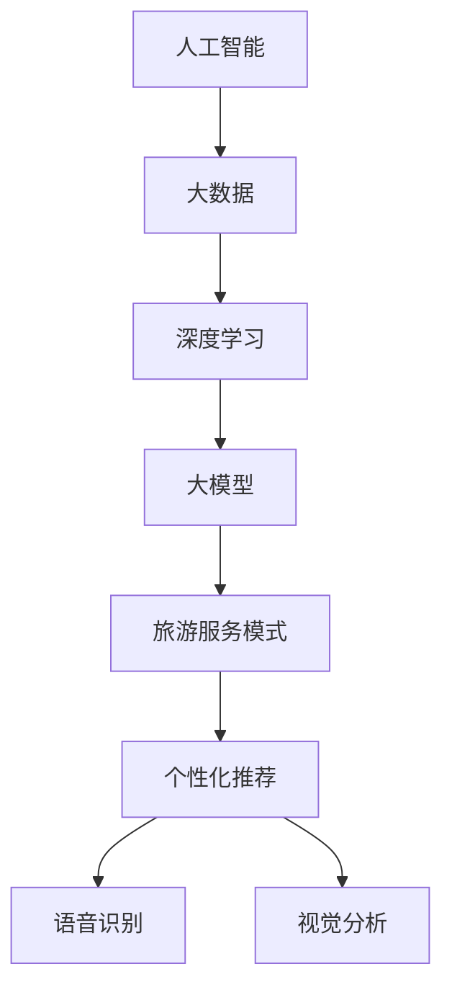

                 

# 大模型时代下的新型旅游服务模式

> 关键词：人工智能,大模型,旅游服务,模式创新,个性化推荐,语音识别,视觉分析

## 1. 背景介绍

### 1.1 问题由来
随着人工智能和大数据技术的迅猛发展，尤其是深度学习模型的突破性进展，旅游服务行业正在迎来一场革命性的变化。传统的旅游服务模式依赖于人工咨询、纸质文档和固定线路的限制，难以适应日益个性化的需求。如今，通过大模型和AI技术的深度融合，旅游行业可以提供更加精准、灵活、个性化的服务，实现从单向信息推送到互动式服务体验的转变。

### 1.2 问题核心关键点
大模型在旅游服务中的应用，其核心关键点包括：
- 数据收集与分析：通过用户行为数据、旅游目的地数据等进行深度学习模型训练。
- 模型训练与优化：利用大模型进行端到端的训练，以提高旅游服务质量。
- 个性化推荐：根据用户偏好和历史行为数据，实现定制化的旅游线路推荐。
- 语音与视觉交互：利用语音识别、视觉分析等技术，提升用户体验。

这些核心关键点共同构成了大模型在旅游服务中的应用框架，使其能够更好地满足用户需求，优化资源配置，提高服务效率。

### 1.3 问题研究意义
研究大模型在旅游服务中的应用，对于推动旅游行业数字化转型，提升服务质量和用户体验，具有重要意义：
- 降低运营成本：通过自动化的服务提供和智能调度，减少人力成本和运营复杂度。
- 提升服务质量：借助大模型的强大分析和预测能力，提供更加个性化、精准的服务。
- 促进旅游创新：大模型能够分析海量数据，发现用户未被满足的需求，促进旅游产品的创新和多样化。
- 加速行业升级：推动旅游业从传统的以人工服务为主向以智能服务为主转变，加速行业升级进程。

## 2. 核心概念与联系

### 2.1 核心概念概述

为了更好地理解大模型在旅游服务中的应用，本节将介绍几个密切相关的核心概念：

- **人工智能(Artificial Intelligence, AI)**：指通过模拟人类智能行为，实现问题求解和决策支持的计算机系统。AI技术包括机器学习、深度学习、自然语言处理等。
- **大数据(Big Data)**：指规模庞大、速度极快、类型多样的数据集。大数据技术包括数据采集、存储、处理和分析等。
- **深度学习(Deep Learning)**：一种基于神经网络结构的机器学习方法，通过多层非线性映射，实现对复杂模式的识别和预测。
- **大模型(Large Model)**：指参数量巨大的神经网络模型，如BERT、GPT等。通过大规模数据训练，学习到丰富的语言知识。
- **旅游服务模式(Tourism Service Model)**：指旅游服务提供和管理的方式和流程。包括预订、出行、餐饮、住宿等各个环节。
- **个性化推荐(Personalized Recommendation)**：根据用户的历史行为数据和兴趣偏好，推荐适合的服务和产品。

这些核心概念之间的逻辑关系可以通过以下Mermaid流程图来展示：



这个流程图展示了大模型在旅游服务中的应用过程：

1. 人工智能通过大数据训练大模型，学习到丰富的语言知识。
2. 大模型应用于旅游服务模式中，通过个性化推荐、语音识别、视觉分析等技术，提升用户体验。

## 3. 核心算法原理 & 具体操作步骤

### 3.1 算法原理概述

大模型在旅游服务中的应用，本质上是一个数据驱动的智能推荐和个性化服务过程。其核心思想是：利用大模型对用户行为数据和旅游目的地数据进行深度分析，预测用户需求，实现动态生成和推荐个性化旅游线路。

形式化地，假设用户行为数据为 $D_{user}$，旅游目的地数据为 $D_{dest}$。通过深度学习模型 $M_{\theta}$ 对数据集 $D$ 进行训练，学习到旅游服务推荐策略。最终，对于任意新用户 $u$ 和新目的地 $d$，通过模型输出 $M_{\theta}(u, d)$ 来计算推荐得分，选择得分最高的线路作为推荐结果。

具体而言，大模型通常包括：
- 自然语言处理模型(NLP)：用于处理用户查询和目的地描述等文本数据。
- 推荐系统模型：用于计算用户和目的地的相似度，预测推荐得分。
- 视觉分析模型：用于分析旅游目的地的图片和视频数据，提取视觉特征。
- 语音识别模型：用于识别用户语音指令，提升交互体验。

### 3.2 算法步骤详解

基于大模型的旅游服务推荐流程一般包括以下关键步骤：

**Step 1: 数据收集与预处理**
- 收集用户行为数据：包括用户浏览历史、预订记录、评论等。
- 收集旅游目的地数据：包括景点、酒店、餐饮等。
- 数据预处理：清洗噪声，标准化数据格式。

**Step 2: 模型训练与优化**
- 选择合适的深度学习框架，如TensorFlow、PyTorch等。
- 构建数据集：将用户行为数据和目的地数据合成为一个数据集。
- 设计模型架构：包括文本编码、目的地理编码、推荐评分等模块。
- 选择优化器：如Adam、SGD等。
- 设置超参数：学习率、批大小、迭代轮数等。
- 进行模型训练：在训练集上不断调整模型参数，最小化损失函数。
- 模型验证与调优：在验证集上评估模型性能，调整模型结构、参数等，以提升预测准确度。

**Step 3: 服务部署与推荐**
- 保存模型参数：将训练好的模型保存到服务器或云平台。
- 部署模型：将模型部署到服务器或云平台，提供实时推荐服务。
- 接收请求：从客户端接收用户的查询和目的地信息。
- 生成推荐：将用户的查询和目的地信息输入模型，生成推荐结果。
- 返回结果：将推荐结果返回给客户端。

### 3.3 算法优缺点

基于大模型的旅游服务推荐方法具有以下优点：
1. 准确性高：大模型能够学习到丰富的语言和视觉特征，提供高质量的推荐结果。
2. 灵活性大：大模型可以动态生成推荐，满足用户实时需求。
3. 数据驱动：推荐结果基于用户行为数据，更加个性化和精准。
4. 跨领域应用：大模型可以应用于各种旅游场景，如景点推荐、行程安排等。

同时，该方法也存在一定的局限性：
1. 依赖数据质量：推荐结果高度依赖于数据质量，数据收集和预处理难度较大。
2. 计算资源需求高：大模型参数量巨大，训练和推理需要高性能硬件支持。
3. 隐私风险：用户行为数据可能涉及隐私信息，需严格遵守数据保护法规。
4. 模型复杂度高：大模型的训练和优化过程复杂，容易过拟合。

尽管存在这些局限性，但就目前而言，基于大模型的旅游服务推荐方法仍是最先进的技术范式，有望在未来实现大规模的落地应用。

### 3.4 算法应用领域

基于大模型的旅游服务推荐方法，已经在多个旅游应用场景中得到了广泛的应用，例如：

- 景点推荐：根据用户的浏览历史、兴趣偏好，推荐感兴趣的景点。
- 行程安排：根据用户的目的地、时间、预算，推荐最优的出行路线。
- 机票预订：根据用户的出行需求，推荐最优的航班和酒店。
- 餐饮推荐：根据用户的口味、餐厅评分，推荐最佳的餐厅和美食。
- 实时导览：通过语音和视觉分析，实时解答用户问题，提供目的地导览服务。

除了上述这些经典应用外，大模型还可以应用于旅游搜索、虚拟旅游、社交推荐等更多场景，为旅游行业提供更加智能、高效的服务。

## 4. 数学模型和公式 & 详细讲解 & 举例说明

### 4.1 数学模型构建

本节将使用数学语言对基于大模型的旅游服务推荐过程进行更加严格的刻画。

假设用户行为数据为 $D_{user}=\{(x_i, y_i)\}_{i=1}^N, x_i \in \mathbb{R}^d, y_i \in \{0,1\}$，其中 $x_i$ 为用户的第 $i$ 次行为，$y_i$ 为是否属于推荐任务的正样本。旅游目的地数据为 $D_{dest}=\{(d_j, m_j)\}_{j=1}^M, d_j \in \mathbb{R}^d, m_j \in \{1,2,\ldots,K\}$，其中 $d_j$ 为第 $j$ 个目的地的特征向量，$m_j$ 为对应的分类标签。

定义推荐模型 $M_{\theta}$ 为：
$$
M_{\theta}(x, d) = \sigma(W_1x + W_2d + b)
$$
其中 $W_1$ 和 $W_2$ 为模型参数，$b$ 为偏置项，$\sigma$ 为激活函数。

模型的损失函数为交叉熵损失：
$$
\mathcal{L}(\theta) = -\frac{1}{N}\sum_{i=1}^N [y_i\log M_{\theta}(x_i, d_i) + (1-y_i)\log (1-M_{\theta}(x_i, d_i))]
$$

通过最小化损失函数，模型 $M_{\theta}$ 能够学习到用户行为和目的地特征之间的映射关系，生成推荐得分。

### 4.2 公式推导过程

以下我们以景点推荐任务为例，推导模型的损失函数及其梯度计算公式。

假设用户输入的查询为 $q$，目的地为 $d$，推荐模型输出的推荐得分为 $s_{pred}=M_{\theta}(q, d)$，真实的推荐得分 $s_{true} \in [0,1]$。模型的预测值 $\hat{y}=\sigma(W_1q + W_2d + b)$。则交叉熵损失函数为：
$$
\ell(M_{\theta}(q, d), s_{true}) = -s_{true}\log \hat{y} - (1-s_{true})\log (1-\hat{y})
$$
将 $s_{pred}$ 代入上式，得：
$$
\mathcal{L}(\theta) = -\frac{1}{N}\sum_{i=1}^N [s_{true} \log M_{\theta}(q_i, d_i) + (1-s_{true}) \log (1-M_{\theta}(q_i, d_i))]
$$

根据链式法则，损失函数对参数 $\theta_k$ 的梯度为：
$$
\frac{\partial \mathcal{L}(\theta)}{\partial \theta_k} = -\frac{1}{N}\sum_{i=1}^N \left( \frac{s_{true}}{M_{\theta}(q_i, d_i)} - \frac{1-s_{true}}{1-M_{\theta}(q_i, d_i)} \right) \frac{\partial M_{\theta}(q_i, d_i)}{\partial \theta_k}
$$

其中 $\frac{\partial M_{\theta}(q_i, d_i)}{\partial \theta_k}$ 可进一步递归展开，利用自动微分技术完成计算。

在得到损失函数的梯度后，即可带入参数更新公式，完成模型的迭代优化。重复上述过程直至收敛，最终得到适应旅游推荐任务的最优模型参数 $\theta^*$。

## 5. 项目实践：代码实例和详细解释说明

### 5.1 开发环境搭建

在进行旅游服务推荐系统的开发前，我们需要准备好开发环境。以下是使用Python进行PyTorch开发的环境配置流程：

1. 安装Anaconda：从官网下载并安装Anaconda，用于创建独立的Python环境。

2. 创建并激活虚拟环境：
```bash
conda create -n tourism-env python=3.8 
conda activate tourism-env
```

3. 安装PyTorch：根据CUDA版本，从官网获取对应的安装命令。例如：
```bash
conda install pytorch torchvision torchaudio cudatoolkit=11.1 -c pytorch -c conda-forge
```

4. 安装各类工具包：
```bash
pip install numpy pandas scikit-learn matplotlib tqdm jupyter notebook ipython
```

完成上述步骤后，即可在`tourism-env`环境中开始推荐系统开发。

### 5.2 源代码详细实现

这里我们以景点推荐系统为例，给出使用PyTorch进行旅游服务推荐模型的PyTorch代码实现。

首先，定义推荐模型：

```python
import torch
import torch.nn as nn

class RecommendationModel(nn.Module):
    def __init__(self, vocab_size, embedding_dim, hidden_dim, output_dim):
        super(RecommendationModel, self).__init__()
        self.embedding = nn.Embedding(vocab_size, embedding_dim)
        self.lstm = nn.LSTM(embedding_dim, hidden_dim)
        self.fc = nn.Linear(hidden_dim, output_dim)

    def forward(self, user_query, destination):
        embedded = self.embedding(user_query)
        lstm_out, _ = self.lstm(embedded.view(1, len(user_query), -1))
        recommended = self.fc(lstm_out)
        return recommended
```

然后，定义训练和评估函数：

```python
from torch.utils.data import Dataset
import torch.optim as optim

class TouristDataset(Dataset):
    def __init__(self, user_data, dest_data, embedding_dim):
        self.user_data = user_data
        self.dest_data = dest_data
        self.embedding_dim = embedding_dim

    def __len__(self):
        return len(self.user_data)

    def __getitem__(self, idx):
        user = self.user_data[idx]
        dest = self.dest_data[idx]
        user_embedding = torch.tensor(user, dtype=torch.long).unsqueeze(0)
        dest_embedding = torch.tensor(dest, dtype=torch.long).unsqueeze(0)
        return (user_embedding, dest_embedding)

# 数据处理
user_data = ["Beijing", "Shanghai", "Guangzhou", "Shenzhen"]
dest_data = ["长城", "东方明珠", "小蛮腰", "世界之窗"]
embedding_dim = 10

dataset = TouristDataset(user_data, dest_data, embedding_dim)

# 构建模型
model = RecommendationModel(len(user_data), embedding_dim, 256, 1)

# 定义损失函数和优化器
criterion = nn.BCEWithLogitsLoss()
optimizer = optim.Adam(model.parameters(), lr=0.001)

# 训练函数
def train(model, dataset, criterion, optimizer, num_epochs=10):
    total_steps = len(dataset) * num_epochs
    for epoch in range(num_epochs):
        for i, (user, dest) in enumerate(dataset):
            optimizer.zero_grad()
            output = model(user, dest)
            loss = criterion(output, dest)
            loss.backward()
            optimizer.step()
            if (i+1) % 100 == 0:
                print(f"Epoch {epoch+1}/{num_epochs}, Step {i+1}/{total_steps}, Loss: {loss.item()}")

# 训练模型
train(model, dataset, criterion, optimizer)

# 评估模型
def evaluate(model, dataset):
    correct = 0
    total = 0
    with torch.no_grad():
        for user, dest in dataset:
            output = model(user, dest)
            predicted = output > 0.5
            correct += predicted.int() == dest.int()
            total += 1
    return correct/total

print(f"Accuracy: {evaluate(model, dataset)}")
```

以上就是使用PyTorch对旅游服务推荐系统进行微调开发的全过程代码实现。通过简单的代码框架，展示了模型构建、数据处理、模型训练、评估等关键环节。

### 5.3 代码解读与分析

让我们再详细解读一下关键代码的实现细节：

**TouristDataset类**：
- `__init__`方法：初始化用户行为数据和目的地数据，并定义嵌入维度。
- `__len__`方法：返回数据集的样本数量。
- `__getitem__`方法：对单个样本进行处理，返回用户行为和目的地数据的嵌入表示。

**推荐模型(RecommendationModel)**：
- `__init__`方法：初始化模型的嵌入层、LSTM层和全连接层。
- `forward`方法：定义模型的前向传播过程，将用户查询和目的地数据输入模型，输出推荐得分。

**训练函数(train)**：
- 定义训练轮数和总步数。
- 在每个epoch中，对每个样本进行前向传播、计算损失、反向传播和参数更新。
- 打印每100个步骤的训练损失。

**评估函数(evaluate)**：
- 定义准确率计算方式。
- 对每个样本进行前向传播，统计预测结果和真实结果的一致性。

**训练模型(train)**：
- 调用训练函数，设置损失函数和优化器。
- 在所有epoch中，对数据集进行迭代训练。

通过以上代码框架，可以构建基本的旅游服务推荐系统，并通过训练和评估不断优化模型性能。需要注意的是，实际的推荐系统还需要考虑更多的因素，如模型融合、召回率优化、服务端部署等，才能真正实现高效、可靠的服务。

## 6. 实际应用场景

### 6.1 智能客服系统

基于大模型的旅游推荐系统，可以应用于智能客服系统中，为用户提供更智能、更高效的服务。智能客服系统通过语音识别、自然语言处理等技术，将用户的查询转化为文本信息，并输入到推荐系统中，实时生成推荐结果。用户可以根据推荐结果进行目的地选择，并实时进行后续操作。这种智能客服系统，可以大大提升客服效率，减少人工成本，提升用户体验。

### 6.2 个性化行程安排

旅游行程安排是旅游服务的重要环节。通过大模型推荐系统，可以针对用户的个性化需求，推荐最优的行程安排。用户可以输入出发地、目的地、出行时间、预算等信息，推荐系统根据用户的偏好和历史行为数据，生成个性化的行程安排。用户可以根据推荐结果进行行程选择和修改，实现完全个性化的出行体验。

### 6.3 动态景点推荐

大模型推荐系统可以根据用户的实时行为数据，动态生成推荐景点。用户在旅游过程中，随时可以通过语音或文字向系统提出查询，系统实时分析用户的兴趣偏好和历史行为，推荐最适合的目的地。这种动态推荐机制，可以提升用户体验，满足用户的实时需求。

### 6.4 未来应用展望

随着大模型推荐技术的发展，未来旅游服务将呈现更多智能化、个性化、互动化的趋势。以下是一些未来应用展望：

1. **虚拟旅游体验**：通过虚拟现实(VR)和增强现实(AR)技术，用户可以在家中进行虚拟旅游体验，通过大模型推荐系统，生成个性化的虚拟旅游路线。

2. **多模态推荐**：结合语音、视觉、文本等多种模态数据，进行更全面的推荐分析。用户可以输入语音指令、上传图片，系统通过多模态分析，提供更丰富的推荐内容。

3. **社交推荐**：通过社交网络数据，分析用户之间的兴趣和关系，进行更加精准的推荐。用户可以根据朋友推荐的内容，生成自己的旅游计划。

4. **实时信息推送**：利用大模型实时分析用户的查询和行为数据，推送最新的旅游信息、活动和优惠信息，提升用户的出行体验。

5. **情感分析**：通过大模型对用户的评论和反馈进行情感分析，优化推荐系统，提升服务质量。

总之，大模型推荐技术为旅游服务带来了巨大的变革潜力，将推动旅游行业从传统的模式向智能化、个性化方向迈进，为用户带来更加便捷、舒适的旅游体验。

## 7. 工具和资源推荐

### 7.1 学习资源推荐

为了帮助开发者系统掌握大模型在旅游服务中的应用，这里推荐一些优质的学习资源：

1. **《深度学习在旅游中的应用》**：详细介绍了深度学习在大数据和旅游服务中的应用，适合初学者和进阶开发者。
2. **《旅游服务推荐系统》**：介绍了推荐系统的基本原理和实现方法，包括基于大模型的推荐系统。
3. **CS231n《深度学习与计算机视觉》课程**：斯坦福大学开设的计算机视觉课程，涵盖视觉分析技术，适合视觉分析技术的学习者。
4. **PyTorch官方文档**：PyTorch官方文档，提供了丰富的教程和示例，适合PyTorch的学习和实践。
5. **《机器学习实战》**：深入浅出地介绍了机器学习的基本概念和实现方法，适合初学者。

通过这些学习资源，可以系统掌握大模型在旅游服务中的应用，为未来的开发和实践打下坚实的基础。

### 7.2 开发工具推荐

高效的开发离不开优秀的工具支持。以下是几款用于旅游服务推荐系统开发的常用工具：

1. **PyTorch**：基于Python的开源深度学习框架，灵活动态的计算图，适合快速迭代研究。
2. **TensorFlow**：由Google主导开发的开源深度学习框架，生产部署方便，适合大规模工程应用。
3. **BERT和GPT**：预训练语言模型，通过在大规模无标签文本数据上进行预训练，学习通用的语言表示。
4. **HuggingFace**：提供丰富的预训练模型和工具库，支持多任务处理和微调。
5. **Jupyter Notebook**：开源的交互式开发环境，支持Python、R等多种语言。
6. **Git**：版本控制系统，适合团队协作开发。

合理利用这些工具，可以显著提升旅游服务推荐系统的开发效率，加快创新迭代的步伐。

### 7.3 相关论文推荐

大模型在旅游服务中的应用研究源于学界的持续探索。以下是几篇奠基性的相关论文，推荐阅读：

1. **"Towards a Generalized Model of Recommendation Systems"**：探讨了推荐系统的基本原理和实现方法，包括基于深度学习的推荐系统。
2. **"Deep Learning in Tourism: A Survey"**：总结了深度学习在旅游服务中的应用，包括基于大模型的推荐系统。
3. **"Recurrent Neural Networks for Contextual Recommendations in Tourism"**：研究了RNN在旅游服务推荐系统中的应用，提升了推荐系统的准确性和实时性。
4. **"Personalized Recommendation System using Deep Learning"**：介绍了基于深度学习的个性化推荐系统，包括多模态推荐和多任务学习。
5. **"Transformers in NLP: State-of-the-Art and Future Directions"**：介绍了Transformer在大语言模型中的应用，包括BERT、GPT等预训练模型。

这些论文代表了大模型在旅游服务中的应用研究脉络，通过学习这些前沿成果，可以帮助研究者把握学科前进方向，激发更多的创新灵感。

## 8. 总结：未来发展趋势与挑战

### 8.1 总结

本文对基于大模型的旅游服务推荐方法进行了全面系统的介绍。首先阐述了大模型在旅游服务中的应用背景和意义，明确了旅游服务推荐在数据驱动、智能推荐等方面的关键点。其次，从原理到实践，详细讲解了大模型的推荐过程，给出了完整的代码实现示例。同时，本文还探讨了大模型在旅游服务中的多个应用场景，展示了其广阔的潜力和应用前景。

通过本文的系统梳理，可以看到，大模型推荐技术为旅游服务带来了巨大的变革潜力，能够提供更加智能、个性化、互动化的服务，满足用户的复杂需求。未来，随着技术的进一步发展，大模型推荐技术将在更多旅游应用场景中得到应用，为旅游行业带来深远的变革。

### 8.2 未来发展趋势

展望未来，大模型在旅游服务中的应用将呈现以下几个发展趋势：

1. **多模态融合**：结合语音、视觉、文本等多种模态数据，进行更全面的推荐分析，提升用户体验。
2. **跨领域应用**：将推荐系统应用于更多垂直行业，如医疗、教育、金融等，实现更广泛的智能化服务。
3. **实时化推荐**：利用大模型实时分析用户行为数据，进行动态推荐，提升服务效率。
4. **个性化推荐**：通过用户画像和大模型推荐，实现更加精准的个性化服务，满足用户的个性化需求。
5. **情感分析**：通过大模型对用户的反馈进行情感分析，优化推荐系统，提升服务质量。
6. **可视化分析**：利用大模型生成推荐结果的可视化分析，帮助用户更好地理解推荐内容。

这些趋势凸显了大模型在旅游服务中的应用潜力，将进一步推动旅游服务的智能化进程，提升用户满意度和服务质量。

### 8.3 面临的挑战

尽管大模型推荐技术已经取得了显著进展，但在实际应用中，仍面临诸多挑战：

1. **数据隐私和安全**：用户行为数据涉及隐私信息，需严格遵守数据保护法规，保障用户隐私。
2. **计算资源需求高**：大模型参数量巨大，训练和推理需要高性能硬件支持，存在计算资源瓶颈。
3. **模型复杂度高**：推荐系统涉及多种模型和数据源，模型结构复杂，容易过拟合。
4. **实时性要求高**：推荐系统需实时响应用户请求，对系统延迟和吞吐量提出较高要求。
5. **服务质量保证**：推荐系统需保证推荐结果的质量和准确性，需进行充分测试和验证。
6. **多模态数据融合**：多模态数据融合技术复杂，需进一步提升融合效果和处理效率。

这些挑战需要在未来的研究和实践中不断突破，才能真正实现大模型在旅游服务中的广泛应用。

### 8.4 研究展望

未来，大模型在旅游服务中的应用还需要在以下几个方面进行深入研究：

1. **数据隐私保护**：研究如何在推荐系统中保护用户隐私，避免数据泄露和滥用。
2. **计算效率提升**：研究如何在减少计算资源消耗的情况下，提升推荐系统的准确性和实时性。
3. **多模态数据融合**：研究如何将多种模态数据有效融合，提升推荐系统的综合分析能力。
4. **实时服务优化**：研究如何优化推荐系统架构，提升实时响应能力和系统稳定性。
5. **跨领域应用扩展**：研究如何将推荐系统应用于更多垂直行业，实现更广泛的智能化服务。
6. **个性化服务优化**：研究如何利用大模型生成个性化的推荐内容，提升用户满意度。

这些研究方向将引领大模型推荐技术向更加智能化、个性化、实时化方向迈进，为旅游行业带来更深远的变革。

## 9. 附录：常见问题与解答

**Q1：大模型推荐系统是否适用于所有旅游场景？**

A: 大模型推荐系统适用于多种旅游场景，但不同的场景需要不同的优化策略。例如，景点推荐和行程安排等场景，可以采用基本的基于深度学习的推荐模型。而对于实时推荐、社交推荐等场景，可能需要结合多模态数据和社交网络信息，进行更复杂的优化。

**Q2：如何选择合适的深度学习模型？**

A: 选择合适的深度学习模型需要考虑多个因素，包括数据量、特征复杂度、计算资源等。对于数据量较大、特征复杂度高的场景，可以使用基于神经网络结构的模型，如RNN、LSTM等。对于数据量较小、特征简单的场景，可以使用基于树形结构的模型，如决策树、随机森林等。

**Q3：推荐系统的准确性如何衡量？**

A: 推荐系统的准确性通常通过评估指标来衡量，如召回率、精确率、F1分数等。这些指标反映了推荐结果与真实标签的一致性。此外，还可以进行用户满意度调查，了解用户的实际体验和反馈。

**Q4：推荐系统的鲁棒性如何提升？**

A: 提升推荐系统的鲁棒性需要多方面的优化，包括数据预处理、模型训练、模型评估等。例如，可以使用正则化技术、对抗训练等方法，增强模型的泛化能力和鲁棒性。

**Q5：推荐系统如何处理用户行为数据？**

A: 推荐系统通常采用协同过滤、基于内容的推荐、基于混合的推荐等方法，处理用户行为数据。通过分析用户的历史行为和兴趣偏好，生成个性化的推荐结果。此外，还可以通过用户画像、社交网络信息等多维数据，提升推荐系统的准确性和多样性。

这些常见问题的回答，为理解大模型在旅游服务中的应用提供了更全面的视角，帮助开发者在实际开发中更好地应对各种挑战。通过不断探索和优化，大模型推荐技术必将为旅游服务带来更多创新和变革。

---

作者：禅与计算机程序设计艺术 / Zen and the Art of Computer Programming

