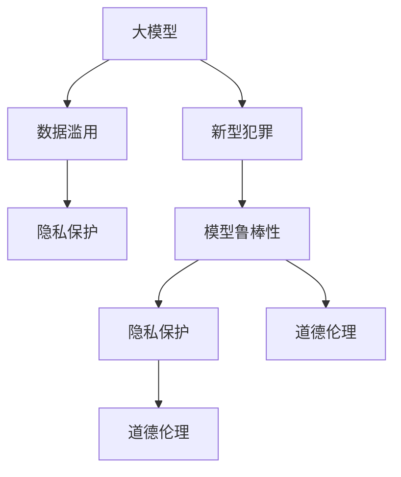

                 

# 大模型时代下的新型犯罪形式及防控措施

## 1. 背景介绍

随着人工智能技术的快速发展，尤其是大模型的崛起，在带来巨大社会进步的同时，也衍生出一系列新的安全挑战。本文聚焦于大模型时代下新型犯罪形式及其防控措施，通过综合分析大模型的特性和潜在风险，探讨如何构建更为安全、可控的AI应用环境。

## 2. 核心概念与联系

### 2.1 核心概念概述

为更好地理解大模型与新型犯罪的关系，本节将介绍几个关键概念：

- **大模型（Large Models）**：指基于大规模数据集（如大规模文本、图像等）训练出的深度神经网络模型，如GPT-3、BERT等。这些模型拥有强大的表征能力和泛化能力，可用于自然语言处理、计算机视觉等多个领域。

- **新型犯罪（Cyber Crimes）**：指利用新兴技术手段实施的犯罪行为，如网络钓鱼、深度伪造、社会工程等。随着大模型技术的应用，犯罪形式也呈现多样化、智能化趋势。

- **数据滥用（Data Abuse）**：指未经授权或不当使用数据，造成隐私泄露、模型偏见等问题。在大模型训练和微调过程中，数据滥用现象尤为突出，可能导致严重的法律和伦理问题。

- **模型鲁棒性（Model Robustness）**：指模型面对攻击和干扰时的稳定性和正确性。在大模型应用中，模型鲁棒性是衡量其安全性的重要指标。

- **隐私保护（Privacy Protection）**：指保护用户数据和个人隐私，防止未授权访问和使用。隐私保护是大模型时代下需要重点关注的问题。

- **道德伦理（Ethics & Morality）**：指在大模型开发和应用中，需要遵循的道德和伦理规范，包括透明性、公平性、安全性等。

这些概念之间的逻辑关系可以通过以下Mermaid流程图来展示：



这个流程图展示了大模型与新型犯罪形式之间的联系，以及隐私保护、模型鲁棒性和道德伦理在大模型应用中的重要性。

## 3. 核心算法原理 & 具体操作步骤
### 3.1 算法原理概述

在大模型时代，新型犯罪形式利用了模型强大的生成能力和泛化能力，实施了更加复杂、隐蔽的犯罪行为。为了有效防控这些犯罪，需要从以下几个方面入手：

1. **模型训练与微调**：在训练和微调过程中，需要格外注意数据的质量和隐私保护，避免数据滥用和模型偏见。同时，引入对抗样本训练，提升模型鲁棒性。

2. **攻击检测与防御**：针对模型输入和输出的攻击检测和防御机制，是大模型安全性的重要保障。通过监测模型行为，及时发现和阻止异常攻击。

3. **隐私保护与数据匿名化**：对于需要处理敏感信息的任务，需采取隐私保护和数据匿名化措施，确保用户数据的安全。

4. **法律规范与伦理指南**：建立健全的法律法规和伦理指南，明确大模型应用中的权利和义务，规范开发者和用户的行为。

### 3.2 算法步骤详解

基于以上原理，以下是大模型防控新型犯罪的具体操作步骤：

**Step 1: 准备数据与环境**
- 收集和标注数据集，确保数据质量和多样性。
- 准备训练和测试环境，包括硬件设备、软件工具和模型库等。

**Step 2: 模型训练与微调**
- 在训练和微调过程中，使用对抗样本训练，提高模型鲁棒性。
- 引入数据隐私保护技术，如差分隐私、联邦学习等，确保数据安全。
- 对模型进行性能评估，确保其在特定任务上的准确性和稳定性。

**Step 3: 攻击检测与防御**
- 监测模型输入和输出，及时发现异常攻击行为。
- 部署攻击检测机制，如异常检测、行为分析等。
- 实施防御措施，如模型加固、数据加密等。

**Step 4: 隐私保护与数据匿名化**
- 采用隐私保护技术，如差分隐私、数据加密等，确保数据安全。
- 进行数据匿名化处理，防止个人身份信息泄露。

**Step 5: 法律规范与伦理指南**
- 制定和遵守法律法规，明确大模型应用中的权利和义务。
- 制定伦理指南，指导开发者和用户行为，确保模型应用的道德性。

### 3.3 算法优缺点

基于监督学习的模型防控措施具有以下优点：
1. 简单高效：利用监督学习的方法，可以快速检测和应对新型犯罪行为。
2. 灵活性高：可以根据特定任务和数据集，设计针对性的防控策略。
3. 可解释性强：通过对模型行为和输入输出的监控，可以及时发现和处理异常行为。

同时，这些方法也存在以下局限性：
1. 数据依赖：模型防控措施依赖于高质量的数据和标注，数据获取成本较高。
2. 对抗样本攻击：对抗样本攻击可能绕过现有防护机制，导致防护失效。
3. 隐私保护难度大：数据隐私保护需要复杂的算法和措施，实施难度较大。
4. 法律和伦理问题复杂：法律和伦理规范的制定和遵守需要多方协作，存在较大不确定性。

尽管存在这些局限性，但就目前而言，基于监督学习的防控措施仍是大模型时代防控新型犯罪的主要手段。未来相关研究重点在于如何进一步降低防控措施对数据和标注的依赖，提高模型的少样本学习和跨领域迁移能力，同时兼顾可解释性和伦理安全性等因素。

### 3.4 算法应用领域

基于监督学习的大模型防控措施，在多个领域已经得到了应用，包括但不限于：

1. **金融领域**：利用大模型进行欺诈检测、风险评估等，保护金融机构和消费者利益。
2. **医疗领域**：对电子病历、医学影像等进行分析和处理，提升医疗服务质量和患者隐私保护。
3. **司法领域**：利用自然语言处理技术进行案件分析和判例研究，提高司法公正性和透明度。
4. **公共安全领域**：对网络监控数据进行分析和处理，防范恐怖主义、网络暴力等新型犯罪。
5. **教育领域**：利用大模型进行教育数据分析和个性化推荐，提升教育质量和学生隐私保护。

这些领域的大模型应用，极大地提升了各行业的智能化水平，但也带来了新的安全挑战。因此，如何在大模型应用中实现安全、可控，是大模型时代需要重点关注的课题。

## 4. 数学模型和公式 & 详细讲解 & 举例说明
### 4.1 数学模型构建

本节将使用数学语言对大模型防控新型犯罪的数学模型进行更加严格的刻画。

记大模型为 $M$，输入为 $x$，输出为 $y$。假设存在一种新型犯罪形式 $C$，利用模型 $M$ 进行攻击。防控措施的目标是设计一个检测器 $D$，使得在给定输入 $x$ 时，$D(x)$ 能够准确地检测到是否存在攻击行为 $C$。

定义攻击检测的损失函数为 $L(D, M, C)$，使得 $D(x)$ 能够最大化地检测到 $C$ 且最小化误报。防控措施的目标是最小化损失函数，即找到最优的检测器 $D$：

$$
\hat{D} = \mathop{\arg\min}_{D} \mathcal{L}(D, M, C)
$$

其中 $\mathcal{L}$ 为损失函数，通常包括准确率、召回率、F1分数等评估指标。

### 4.2 公式推导过程

以下我们以二分类任务为例，推导攻击检测的损失函数及其梯度的计算公式。

假设模型 $M$ 在输入 $x$ 上的输出为 $y_M$，真实标签为 $y$，攻击样本 $x_C$ 的输出为 $y_C$。则攻击检测的损失函数可以定义为：

$$
\ell(D(x), y) = -[y_D\log D(x)+(1-y_D)\log(1-D(x))]
$$

其中 $y_D$ 表示检测器 $D$ 的预测结果，$D(x)$ 表示检测器 $D$ 对输入 $x$ 的检测结果。

将其代入总损失函数公式，得：

$$
\mathcal{L}(D, M, C) = -\frac{1}{N}\sum_{i=1}^N [\ell(D(x_i), y_i)]
$$

根据链式法则，检测器 $D$ 的梯度计算公式为：

$$
\frac{\partial \mathcal{L}(D, M, C)}{\partial D} = -\frac{1}{N}\sum_{i=1}^N (\frac{y_D}{D(x_i)}-\frac{1-y_D}{1-D(x_i)}) \frac{\partial D(x_i)}{\partial x_i}
$$

其中 $\frac{\partial D(x_i)}{\partial x_i}$ 为检测器 $D$ 对输入 $x_i$ 的梯度。

### 4.3 案例分析与讲解

以网络钓鱼检测为例，假设模型 $M$ 的输入为邮件文本，输出为是否为钓鱼邮件的概率。检测器 $D$ 的输入为模型输出，输出为是否为钓鱼邮件的预测结果。在训练过程中，需要收集大量钓鱼邮件和非钓鱼邮件作为训练数据，训练一个二分类模型 $D$。

在测试阶段，对每个新邮件，先输入模型 $M$ 得到预测概率，再将概率输入检测器 $D$ 进行二次检测，最终判断是否为钓鱼邮件。如果检测结果为钓鱼邮件，则报告为异常，触发进一步的人工审核。

通过以上数学模型和计算公式，可以清晰地理解大模型防控新型犯罪的基本原理和操作步骤，确保模型能够有效地识别和应对攻击行为。

## 5. 项目实践：代码实例和详细解释说明
### 5.1 开发环境搭建

在进行大模型防控项目实践前，我们需要准备好开发环境。以下是使用Python进行TensorFlow开发的环境配置流程：

1. 安装Anaconda：从官网下载并安装Anaconda，用于创建独立的Python环境。

2. 创建并激活虚拟环境：
```bash
conda create -n tf-env python=3.8 
conda activate tf-env
```

3. 安装TensorFlow：根据CUDA版本，从官网获取对应的安装命令。例如：
```bash
pip install tensorflow==2.6
```

4. 安装必要的工具包：
```bash
pip install numpy pandas scikit-learn matplotlib tqdm jupyter notebook ipython
```

完成上述步骤后，即可在`tf-env`环境中开始项目实践。

### 5.2 源代码详细实现

下面我以网络钓鱼检测为例，给出使用TensorFlow对BERT模型进行攻击检测的Python代码实现。

首先，定义攻击检测的数据处理函数：

```python
from transformers import BertTokenizer
from tensorflow.keras.preprocessing.text import Tokenizer
from tensorflow.keras.preprocessing.sequence import pad_sequences
import tensorflow as tf

class DetectionDataset(tf.keras.preprocessing.image.ImageDataGenerator):
    def __init__(self, texts, labels, tokenizer, max_len=128):
        self.texts = texts
        self.labels = labels
        self.tokenizer = tokenizer
        self.max_len = max_len
        
    def __len__(self):
        return len(self.texts)
    
    def __getitem__(self, item):
        text = self.texts[item]
        label = self.labels[item]
        
        encoding = self.tokenizer(text, return_tensors='tf')
        input_ids = tf.convert_to_tensor(encoding['input_ids'])
        attention_mask = tf.convert_to_tensor(encoding['attention_mask'])
        
        # 对token-wise的标签进行编码
        encoded_labels = [label2id[label] for label in label] 
        encoded_labels.extend([label2id['O']] * (self.max_len - len(encoded_labels)))
        labels = tf.convert_to_tensor(encoded_labels, dtype=tf.int64)
        
        return {'input_ids': input_ids, 
                'attention_mask': attention_mask,
                'labels': labels}

# 标签与id的映射
label2id = {'O': 0, 'Phishing': 1}
id2label = {v: k for k, v in label2id.items()}

# 创建dataset
tokenizer = BertTokenizer.from_pretrained('bert-base-cased')

train_dataset = DetectionDataset(train_texts, train_labels, tokenizer)
dev_dataset = DetectionDataset(dev_texts, dev_labels, tokenizer)
test_dataset = DetectionDataset(test_texts, test_labels, tokenizer)
```

然后，定义模型和优化器：

```python
from transformers import BertForTokenClassification, AdamW

model = BertForTokenClassification.from_pretrained('bert-base-cased', num_labels=len(label2id))

optimizer = AdamW(model.parameters(), lr=2e-5)
```

接着，定义训练和评估函数：

```python
from tensorflow.keras.metrics import Accuracy

@tf.function
def train_step(inputs):
    with tf.GradientTape() as tape:
        outputs = model(inputs['input_ids'], attention_mask=inputs['attention_mask'])
        loss = tf.keras.losses.sparse_categorical_crossentropy(inputs['labels'], outputs.logits, from_logits=True)
    grads = tape.gradient(loss, model.trainable_variables)
    optimizer.apply_gradients(zip(grads, model.trainable_variables))
    return loss

@tf.function
def evaluate_step(inputs):
    outputs = model(inputs['input_ids'], attention_mask=inputs['attention_mask'])
    predictions = tf.argmax(outputs.logits, axis=-1, output_type=tf.int32)
    accuracy = tf.metrics.sparse_categorical_accuracy(inputs['labels'], predictions)
    return accuracy.numpy()[0]
```

最后，启动训练流程并在测试集上评估：

```python
epochs = 5
batch_size = 16

for epoch in range(epochs):
    total_loss = 0
    total_samples = 0
    for inputs in train_dataset:
        loss = train_step(inputs)
        total_loss += loss
        total_samples += 1
    print(f'Epoch {epoch+1}, train loss: {total_loss/total_samples}')
    
    print(f'Epoch {epoch+1}, dev results:')
    accuracy = evaluate(dev_dataset)
    print(f'Accuracy: {accuracy:.2f}')
    
print('Test results:')
accuracy = evaluate(test_dataset)
print(f'Accuracy: {accuracy:.2f}')
```

以上就是使用TensorFlow对BERT进行网络钓鱼检测的完整代码实现。可以看到，利用TensorFlow和Transformer库，可以方便地构建和训练攻击检测模型。

### 5.3 代码解读与分析

让我们再详细解读一下关键代码的实现细节：

**DetectionDataset类**：
- `__init__`方法：初始化文本、标签、分词器等关键组件。
- `__len__`方法：返回数据集的样本数量。
- `__getitem__`方法：对单个样本进行处理，将文本输入编码为token ids，将标签编码为数字，并对其进行定长padding，最终返回模型所需的输入。

**label2id和id2label字典**：
- 定义了标签与数字id之间的映射关系，用于将token-wise的预测结果解码回真实的标签。

**train_step和evaluate_step函数**：
- `train_step`函数：在每个批次上前向传播计算loss并反向传播更新模型参数，同时返回loss值。
- `evaluate_step`函数：在每个批次上前向传播计算预测结果，并计算准确率，同时返回准确率值。

**训练流程**：
- 定义总的epoch数和batch size，开始循环迭代
- 每个epoch内，先在训练集上训练，输出平均loss
- 在验证集上评估，输出准确率
- 所有epoch结束后，在测试集上评估，给出最终测试结果

可以看到，TensorFlow配合Transformer库使得BERT攻击检测的代码实现变得简洁高效。开发者可以将更多精力放在数据处理、模型改进等高层逻辑上，而不必过多关注底层的实现细节。

当然，工业级的系统实现还需考虑更多因素，如模型的保存和部署、超参数的自动搜索、更灵活的任务适配层等。但核心的防控流程基本与此类似。

## 6. 实际应用场景
### 6.1 智能客服系统

基于大模型的攻击检测技术，可以广泛应用于智能客服系统的构建。传统客服往往需要配备大量人力，高峰期响应缓慢，且一致性和专业性难以保证。而使用攻击检测模型，可以实时监控用户输入，识别出钓鱼邮件、恶意代码等攻击行为，确保系统的安全和稳定性。

在技术实现上，可以收集企业内部的历史客服对话记录，将可疑行为构建成监督数据，在此基础上对预训练模型进行微调。微调后的模型能够自动理解用户行为，检测出潜在攻击，及时预警并采取应对措施。

### 6.2 金融领域

在金融领域，攻击检测技术同样至关重要。诈骗、钓鱼攻击、数据泄露等新型犯罪形式层出不穷，严重威胁金融机构和用户的安全。利用攻击检测技术，可以对交易行为、电子邮件等进行实时监测，及时发现异常行为，预防金融犯罪。

具体而言，可以利用攻击检测模型对用户的交易行为进行分析，识别出异常交易模式，及时预警并阻止潜在欺诈行为。同时，对电子邮件等通信内容进行实时监测，识别出钓鱼邮件和恶意链接，保护用户隐私和财产安全。

### 6.3 医疗领域

在医疗领域，攻击检测技术同样不可或缺。医疗数据具有高度敏感性，一旦泄露将造成严重后果。利用攻击检测技术，可以对电子病历、医学影像等进行实时监测，确保医疗数据的安全性和隐私性。

具体而言，可以利用攻击检测模型对电子病历进行分析，识别出异常数据访问行为，及时预警并阻止潜在的数据泄露风险。同时，对医学影像等敏感内容进行实时监测，确保其不被未授权访问和篡改。

### 6.4 未来应用展望

随着大模型和攻击检测技术的不断发展，基于大模型的防控措施将变得更加智能化、高效化。未来，攻击检测技术将在更多领域得到应用，为社会安全带来新的保障。

在智慧城市治理中，攻击检测技术可以应用于网络监控、数据保护等领域，提高城市管理的自动化和智能化水平，构建更安全、高效的城市环境。

在教育领域，攻击检测技术可以应用于在线教育平台，确保学生数据的安全性和隐私性。同时，可以对学生的学习行为进行分析，识别出异常行为，及时干预和指导，提升教育质量。

在工业制造、能源等领域，攻击检测技术同样具有广泛的应用前景，保障关键基础设施的安全性，防止潜在的威胁和攻击。

总之，大模型时代下新型犯罪形式不断演变，攻击检测技术已成为保障社会安全和稳定不可或缺的工具。未来，随着技术的不断进步，攻击检测技术将变得更加智能化、高效化，成为维护社会安全和秩序的重要保障。

## 7. 工具和资源推荐
### 7.1 学习资源推荐

为了帮助开发者系统掌握大模型防控新型犯罪的理论基础和实践技巧，这里推荐一些优质的学习资源：

1. **《深度学习实战》系列博文**：由大模型技术专家撰写，深入浅出地介绍了深度学习模型的构建和训练，包括数据预处理、模型优化等。

2. **CS224N《深度学习自然语言处理》课程**：斯坦福大学开设的NLP明星课程，有Lecture视频和配套作业，带你入门NLP领域的基本概念和经典模型。

3. **《深度学习与自然语言处理》书籍**：介绍深度学习模型在NLP中的应用，涵盖模型训练、微调等前沿话题。

4. **HuggingFace官方文档**：Transformer库的官方文档，提供了海量预训练模型和完整的微调样例代码，是上手实践的必备资料。

5. **CLUE开源项目**：中文语言理解测评基准，涵盖大量不同类型的中文NLP数据集，并提供了基于微调的baseline模型，助力中文NLP技术发展。

通过对这些资源的学习实践，相信你一定能够快速掌握大模型防控新型犯罪的精髓，并用于解决实际的NLP问题。

### 7.2 开发工具推荐

高效的开发离不开优秀的工具支持。以下是几款用于大模型防控开发的常用工具：

1. TensorFlow：基于Python的开源深度学习框架，灵活动态的计算图，适合快速迭代研究。对于大规模模型训练和推理，性能卓越。

2. PyTorch：基于Python的开源深度学习框架，灵活高效的计算图，适合科研和实际应用。TensorFlow和PyTorch都支持大规模深度学习模型的训练和推理，可结合使用。

3. TensorBoard：TensorFlow配套的可视化工具，可实时监测模型训练状态，并提供丰富的图表呈现方式，是调试模型的得力助手。

4. Weights & Biases：模型训练的实验跟踪工具，可以记录和可视化模型训练过程中的各项指标，方便对比和调优。与主流深度学习框架无缝集成。

5. Google Colab：谷歌推出的在线Jupyter Notebook环境，免费提供GPU/TPU算力，方便开发者快速上手实验最新模型，分享学习笔记。

合理利用这些工具，可以显著提升大模型防控任务的开发效率，加快创新迭代的步伐。

### 7.3 相关论文推荐

大模型防控技术的发展源于学界的持续研究。以下是几篇奠基性的相关论文，推荐阅读：

1. **Adversarial Examples in Deep Learning**：讨论深度学习模型对抗样本攻击的机制和防御方法，为大模型防控提供了重要的理论支持。

2. **Robustness of Deep Neural Networks to Adversarial Attacks**：研究深度神经网络模型对抗样本攻击的鲁棒性，提出了多种防御方法，如Dropout、Batch Normalization等。

3. **Deep Learning Architectures for Audio and Music Processing**：讨论深度学习模型在音频和音乐处理中的应用，包括攻击检测和防御技术。

4. **Data Privacy and Statistical Learning**：研究数据隐私保护技术，如差分隐私、联邦学习等，为大模型数据保护提供了重要的方法。

5. **Adversarial Training Methods for Semi-Supervised Text Classification**：研究对抗性训练方法在半监督文本分类中的应用，提升模型的鲁棒性和泛化能力。

这些论文代表了大模型防控技术的发展脉络。通过学习这些前沿成果，可以帮助研究者把握学科前进方向，激发更多的创新灵感。

## 8. 总结：未来发展趋势与挑战
### 8.1 总结

本文对大模型防控新型犯罪的方法进行了全面系统的介绍。首先阐述了新型犯罪形式和大模型防控技术的研究背景和意义，明确了防控技术在大模型应用中的重要地位。其次，从原理到实践，详细讲解了攻击检测的数学模型和操作步骤，给出了攻击检测任务开发的完整代码实例。同时，本文还广泛探讨了攻击检测技术在多个行业领域的应用前景，展示了其广泛的应用潜力。此外，本文精选了攻击检测技术的各类学习资源，力求为读者提供全方位的技术指引。

通过本文的系统梳理，可以看到，基于大模型的防控技术正在成为保障社会安全和稳定不可或缺的重要手段。这些技术的广泛应用，将极大地提升各行业的智能化水平，构建更安全、可靠、可控的AI应用环境。未来，随着大模型和攻击检测技术的不断发展，其应用领域将进一步扩展，为社会的稳定和发展带来新的保障。

### 8.2 未来发展趋势

展望未来，大模型防控技术将呈现以下几个发展趋势：

1. **自适应和在线学习**：未来的攻击检测系统将具备自适应和在线学习能力，能够实时学习新攻击模式，快速更新检测模型，提高防御效果。

2. **多模态融合**：未来的攻击检测系统将融合多种模态数据，如文本、图像、语音等，增强系统的感知能力和决策能力。

3. **联邦学习和差分隐私**：未来的攻击检测系统将引入联邦学习和差分隐私等技术，确保数据安全和隐私保护。

4. **对抗样本生成和防御**：未来的攻击检测系统将更加注重对抗样本生成和防御，通过生成对抗样本进行攻击检测，同时引入对抗训练提升模型鲁棒性。

5. **跨领域迁移和知识图谱**：未来的攻击检测系统将能够跨领域迁移和集成外部知识，提升系统的泛化能力和决策能力。

以上趋势凸显了大模型防控技术的广阔前景。这些方向的探索发展，必将进一步提升攻击检测系统的性能和应用范围，为构建安全、可靠、可控的AI应用环境提供新的保障。

### 8.3 面临的挑战

尽管大模型防控技术已经取得了一定的成果，但在迈向更加智能化、普适化应用的过程中，它仍面临着诸多挑战：

1. **数据获取和标注成本高**：高质量的标注数据获取成本较高，尤其在特定领域和场景下，数据的获取和标注更为困难。

2. **对抗样本攻击难防**：对抗样本攻击技术不断进步，现有的防御方法可能无法完全防范新型攻击。

3. **模型泛化性和鲁棒性不足**：模型在面对新攻击模式时，泛化性和鲁棒性仍需进一步提升。

4. **隐私保护和数据安全问题复杂**：数据隐私保护和数据安全问题需要复杂的技术手段和多方的协作，实施难度较大。

5. **法律和伦理规范不完善**：法律法规和伦理规范的制定和遵守需要多方协作，存在较大不确定性。

尽管存在这些挑战，但随着技术的不断进步和法规的完善，相信大模型防控技术将逐步克服这些困难，迈向更加智能化、普适化的应用。

### 8.4 研究展望

面对大模型防控技术所面临的挑战，未来的研究需要在以下几个方面寻求新的突破：

1. **自适应学习算法**：研究自适应学习算法，使得攻击检测系统能够实时学习新攻击模式，提升防御效果。

2. **多模态数据融合**：研究多模态数据融合技术，增强系统的感知能力和决策能力。

3. **联邦学习和差分隐私**：研究联邦学习和差分隐私技术，确保数据安全和隐私保护。

4. **对抗样本生成与防御**：研究对抗样本生成与防御技术，提升模型的鲁棒性和泛化能力。

5. **跨领域迁移与知识图谱**：研究跨领域迁移与知识图谱技术，提升系统的泛化能力和决策能力。

6. **法律法规与伦理规范**：研究法律法规与伦理规范，确保技术应用的合法性和伦理性。

这些研究方向的探索，必将引领大模型防控技术迈向更高的台阶，为构建安全、可靠、可控的AI应用环境提供新的保障。面向未来，大模型防控技术还需要与其他人工智能技术进行更深入的融合，如知识表示、因果推理、强化学习等，多路径协同发力，共同推动自然语言理解和智能交互系统的进步。只有勇于创新、敢于突破，才能不断拓展语言模型的边界，让智能技术更好地造福人类社会。

## 9. 附录：常见问题与解答

**Q1：攻击检测技术在大模型应用中重要吗？**

A: 非常重要。大模型在处理复杂任务时，可能会引入潜在的攻击和风险，如对抗样本攻击、数据泄露等。攻击检测技术能够及时识别和阻止这些攻击，保障系统的安全性和稳定性。

**Q2：如何选择合适的攻击检测算法？**

A: 选择合适的攻击检测算法需要考虑多个因素，包括数据特征、攻击类型、计算资源等。常用的算法包括对抗样本检测、行为分析等。具体选择需根据实际应用场景进行综合评估。

**Q3：攻击检测技术在大模型训练和微调过程中需要考虑哪些问题？**

A: 在大模型训练和微调过程中，需要格外注意数据质量和隐私保护。应使用高质量的标注数据进行训练，同时引入差分隐私等技术，确保数据安全。

**Q4：攻击检测技术在实际应用中如何部署和维护？**

A: 攻击检测技术需要在实际应用中进行部署和维护，以确保系统的安全性和稳定性。部署过程中，需要考虑算力、存储、网络等资源，确保系统的稳定运行。维护过程中，需要定期更新模型和算法，及时处理异常情况。

**Q5：攻击检测技术在特定领域的应用有哪些挑战？**

A: 在特定领域的应用中，攻击检测技术面临的数据获取和标注成本高、对抗样本攻击难防、隐私保护和数据安全问题复杂等挑战。需要结合特定领域的特点，设计针对性的防控措施。

通过以上常见问题的解答，可以更全面地理解攻击检测技术在大模型应用中的重要性、选择方法和实际部署，解决实际应用中的常见问题。

---

作者：禅与计算机程序设计艺术 / Zen and the Art of Computer Programming

