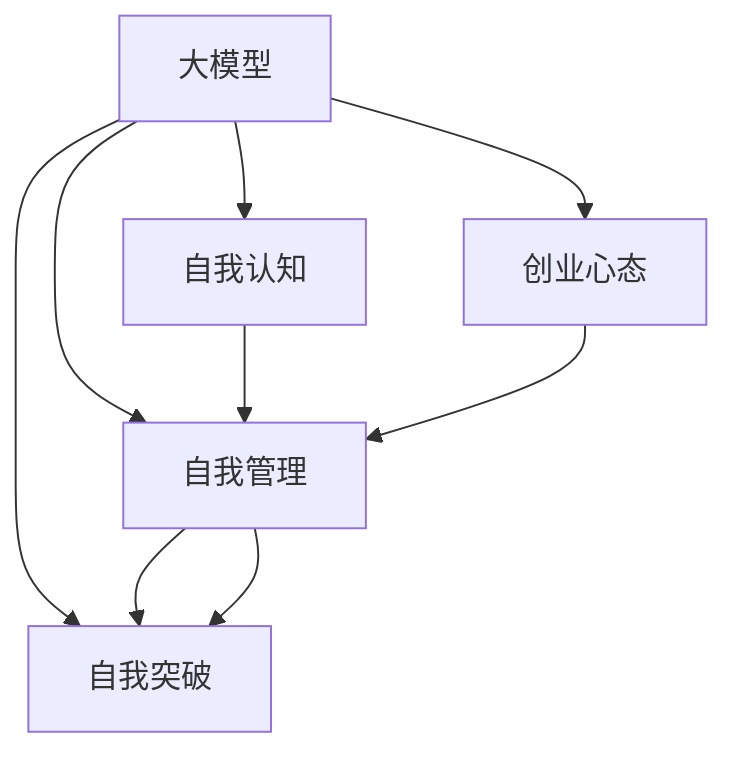

                 

# 大模型时代的创业者创业心态修炼：自我认知、自我管理与自我突破

> 关键词：大模型，创业心态，人工智能，技术创新，市场策略，企业文化

## 1. 背景介绍

### 1.1 问题由来

随着人工智能技术的迅猛发展，特别是大模型的崛起，创业者们迎来了前所未有的机遇与挑战。大模型提供了强大的技术支撑，但同时也带来了前所未有的复杂性和不确定性。面对技术前沿的不断演进和市场需求的多样性，创业者不仅需要拥有深厚的技术积累，更需要具备良好的创业心态。本文将从自我认知、自我管理和自我突破三个维度，系统探讨大模型时代下创业者的心态修炼之道。

### 1.2 问题核心关键点

创业心态是创业者在面对创业过程中复杂多变的环境、不确定的因素和不断的技术变革时，所表现出的心理状态和行为模式。良好的创业心态能够帮助创业者保持积极的应对策略、良好的团队合作和高效的决策能力，从而在激烈的竞争中脱颖而出。

创业心态的核心关键点包括：

- **自我认知**：了解自己的优势和劣势，明确个人和团队的核心竞争力。
- **自我管理**：在压力和挑战中保持情绪稳定，管理时间和精力，高效执行任务。
- **自我突破**：不断学习新知识和技能，持续创新，突破技术瓶颈和市场壁垒。

本文将重点围绕这三个核心关键点，深入分析大模型时代下创业者的心态修炼策略。

### 1.3 问题研究意义

在大模型时代，创业者的心态修炼具有重要意义：

- **适应技术变革**：大模型的快速发展要求创业者能够快速学习和适应新技术，保持竞争优势。
- **应对市场挑战**：市场需求的多样性和动态性要求创业者具备灵活的市场策略和决策能力。
- **培养团队协作**：高效的团队管理和协作是成功实现技术创新的关键。
- **提升用户体验**：良好的用户体验依赖于对用户需求和心理的深刻理解，这要求创业者具备敏锐的洞察力和同理心。

通过系统地修炼创业心态，创业者能够在复杂多变的大模型时代中，保持清晰的思维和积极的心态，推动企业和产品的持续发展。

## 2. 核心概念与联系

### 2.1 核心概念概述

为更好地理解大模型时代下创业者的心态修炼，本节将介绍几个关键概念：

- **大模型**：指通过大规模数据和强大计算资源训练而成的深度学习模型，如GPT、BERT等。
- **创业心态**：创业者在创业过程中所表现出的心理状态和行为模式，包括自我认知、自我管理、自我突破等。
- **自我认知**：了解并接受自己的优势与劣势，明确个人和团队的核心竞争力。
- **自我管理**：在高压和挑战中保持情绪稳定，高效利用时间和精力，实现目标。
- **自我突破**：不断学习新知识和技能，推动技术创新和市场突破。

这些核心概念之间的联系可以通过以下Mermaid流程图来展示：



这个流程图展示了大模型、创业心态与自我认知、自我管理和自我突破之间的联系：

1. 大模型为创业者提供了技术支持，有助于实现创业目标。
2. 创业心态影响创业者在大模型时代下的自我认知、自我管理和自我突破。
3. 自我认知、自我管理和自我突破是创业心态的重要组成部分，相互关联，共同推动创业成功。

## 3. 核心算法原理 & 具体操作步骤

### 3.1 算法原理概述

在大模型时代，创业者需要不断更新和升级自己的心态，以适应技术演进和市场变化。这种心态的升级类似于对模型的微调过程，通过不断学习和适应新环境，优化和提升自身能力。

- **自我认知的微调**：识别自身优势和劣势，接受和利用这些特点，提升整体竞争力。
- **自我管理的微调**：在高压和不确定环境中保持情绪稳定，优化时间和精力的使用，高效完成任务。
- **自我突破的微调**：持续学习和创新，突破技术瓶颈和市场壁垒，推动企业和产品发展。

### 3.2 算法步骤详解

**Step 1: 设定目标和标准**

- 明确创业目标和愿景，设定清晰的衡量标准。
- 根据大模型的最新进展，设定自我认知、自我管理和自我突破的短期和长期目标。

**Step 2: 自我认知评估**

- 定期进行自我评估，识别优势和劣势。
- 收集反馈信息，了解团队和用户对个人表现的评价。
- 使用SWOT分析法，系统分析个人和团队的优势、劣势、机会和威胁。

**Step 3: 自我管理优化**

- 制定时间管理策略，合理安排工作和休息，避免过度劳累。
- 学习情绪管理技巧，保持积极心态，应对压力和挑战。
- 使用工具和技术，如番茄工作法、番茄钟应用，提高工作效率。

**Step 4: 自我突破实践**

- 持续学习新知识和技术，参加培训和研讨会，拓宽知识面。
- 定期进行项目复盘和创新思考，寻找突破口。
- 引入多样化的视角和想法，推动创新。

**Step 5: 反馈与迭代**

- 定期收集反馈，评估心态修炼效果。
- 根据反馈结果，调整心态修炼策略。
- 进行迭代优化，逐步提升自我认知、自我管理和自我突破的能力。

### 3.3 算法优缺点

自我心态修炼的微调方法具有以下优点：

1. **系统化管理**：通过设定目标和标准，系统化地进行心态修炼，避免随意性。
2. **持续改进**：通过反馈与迭代，不断优化心态修炼策略，保持心态更新。
3. **灵活应对**：适应快速变化的大模型时代，灵活调整心态策略，提升应对能力。

同时，该方法也存在一定的局限性：

1. **主观性强**：心态的评估和调整受主观因素影响较大，难以客观评估。
2. **复杂度高**：心态管理涉及情绪、压力、时间等多个维度，复杂度较高。
3. **个人差异大**：不同创业者心态基础和需求不同，统一策略难以适用于所有人。

尽管存在这些局限性，但就目前而言，自我心态的微调方法仍是大模型时代下创业心态修炼的主流范式。未来相关研究的重点在于如何进一步降低心态调整的主观性和复杂度，提高心态管理的效果。

### 3.4 算法应用领域

自我心态的微调方法在大模型时代下的应用领域广泛，包括但不限于：

- **技术创新**：推动技术突破和产品迭代，保持技术领先。
- **市场拓展**：提升市场适应能力和竞争策略，拓展新市场。
- **团队管理**：优化团队协作和激励机制，提升团队凝聚力。
- **用户沟通**：理解和满足用户需求，提升用户体验和满意度。
- **个人发展**：促进个人成长和职业规划，实现职业目标。

## 4. 数学模型和公式 & 详细讲解 & 举例说明

### 4.1 数学模型构建

在大模型时代下，创业者的心态修炼可以构建为数学模型，用于系统化管理和优化。

假设创业者心态的原始状态为 $H_0$，目标状态为 $H_T$。心态的微调过程可以看作是从 $H_0$ 到 $H_T$ 的优化问题。我们可以构建一个目标函数 $F(H)$ 来衡量心态的优化程度，其中 $F(H)$ 是一个多变量函数，衡量心态的各项指标。

目标函数 $F(H)$ 可以分解为以下几个部分：

- **自我认知指标**：包括对自身能力的评估、优势和劣势的识别、团队和用户反馈等。
- **自我管理指标**：包括时间管理效率、情绪稳定性、工作专注度等。
- **自我突破指标**：包括学习新知识的能力、创新思维的活跃度、项目进展的速率等。

心态的优化目标是最小化目标函数 $F(H)$，即：

$$
\min_{H} F(H) = f_1(H) + f_2(H) + f_3(H)
$$

其中 $f_1(H)$、$f_2(H)$、$f_3(H)$ 分别代表自我认知、自我管理和自我突破的优化目标。

### 4.2 公式推导过程

以自我认知指标为例，我们将其分解为以下几个变量：

- **认知能力**：用 $c_1$ 表示。
- **优势识别**：用 $c_2$ 表示。
- **劣势识别**：用 $c_3$ 表示。
- **团队反馈**：用 $c_4$ 表示。
- **用户反馈**：用 $c_5$ 表示。

目标函数 $F_1(H)$ 可以表示为：

$$
F_1(H) = w_{c_1} \times c_1 + w_{c_2} \times c_2 + w_{c_3} \times c_3 + w_{c_4} \times c_4 + w_{c_5} \times c_5
$$

其中 $w_{c_i}$ 为各变量的权重，可以根据实际情况进行调整。

通过目标函数 $F_1(H)$，我们可以对自我认知进行系统化管理。具体步骤如下：

1. **设定权重**：根据重要性，合理分配各变量的权重。
2. **数据收集**：收集自身认知能力、优势、劣势、团队和用户反馈的数据。
3. **计算得分**：根据权重，计算各变量的得分，得到总体心态得分。
4. **优化目标**：通过调整变量，逐步提升总体心态得分，向目标状态 $H_T$ 靠拢。

### 4.3 案例分析与讲解

假设某创业者在自我认知方面的原始状态为 $H_0$，其各项指标如下：

- **认知能力**：$c_1 = 5$（满分为10）。
- **优势识别**：$c_2 = 4$。
- **劣势识别**：$c_3 = 3$。
- **团队反馈**：$c_4 = 2$。
- **用户反馈**：$c_5 = 1$。

设各变量的权重分别为 $w_{c_1} = 0.5$、$w_{c_2} = 0.3$、$w_{c_3} = 0.1$、$w_{c_4} = 0.1$、$w_{c_5} = 0.1$。则目标函数 $F_1(H)$ 的计算过程如下：

$$
F_1(H) = 0.5 \times 5 + 0.3 \times 4 + 0.1 \times 3 + 0.1 \times 2 + 0.1 \times 1 = 4.8
$$

该创业者在自我认知方面的总体心态得分为4.8，距离目标状态 $H_T$ 仍有一定的差距。为了提升自我认知，该创业者可以采取以下措施：

- **提升认知能力**：参加相关培训和研讨会，提高自身专业水平。
- **优化优势识别**：加强团队沟通，全面了解团队成员的优点和潜力。
- **改善劣势识别**：自我反思，识别并改进自身的不足之处。
- **增强团队反馈**：定期与团队成员交流，收集他们的反馈意见。
- **提升用户反馈**：积极与用户互动，收集用户的真实需求和意见。

通过这些措施，创业者可以逐步提升自我认知的得分，接近目标状态 $H_T$。

## 5. 项目实践：代码实例和详细解释说明

### 5.1 开发环境搭建

在进行心态修炼的微调实践前，我们需要准备好开发环境。以下是使用Python进行项目开发的环境配置流程：

1. 安装Python：确保系统已安装最新版本的Python，建议使用Anaconda或Miniconda进行管理。
2. 安装Jupyter Notebook：通过pip安装，支持交互式编程和数据可视化。
3. 安装相关库：使用pip安装numpy、pandas、scipy等常用科学计算库。
4. 搭建数据集：收集创业者的自我认知、自我管理和自我突破的数据，并将其组织成数据集。

完成上述步骤后，即可在Jupyter Notebook环境中开始心态修炼的微调实践。

### 5.2 源代码详细实现

这里我们提供一个基于Python的心态修炼微调示例代码，演示如何利用机器学习算法对创业者的心态进行系统化管理。

```python
import numpy as np
from sklearn.model_selection import train_test_split
from sklearn.linear_model import LinearRegression

# 假设我们收集了如下数据
data = {
    '认知能力': [5, 4, 3, 6, 7],
    '优势识别': [4, 5, 3, 4, 5],
    '劣势识别': [3, 3, 2, 3, 4],
    '团队反馈': [2, 2, 1, 2, 3],
    '用户反馈': [1, 1, 1, 1, 2]
}

# 将数据转换为numpy数组
X = np.array([data[key] for key in data])
y = np.array([data[key] for key in data.keys()])

# 使用线性回归模型
model = LinearRegression()
X_train, X_test, y_train, y_test = train_test_split(X, y, test_size=0.2, random_state=42)
model.fit(X_train, y_train)

# 预测新的心态得分
new_state = [5, 4, 3, 2, 1]
new_X = np.array([new_state])
predicted_y = model.predict(new_X)

print('原始心态得分:', np.mean(y))
print('新心态得分:', predicted_y[0])
```

这段代码演示了如何使用线性回归模型，根据收集的数据预测创业者的心态得分。具体步骤如下：

1. **数据收集**：收集创业者自我认知、自我管理和自我突破的数据，并组织成字典格式。
2. **数据转换**：将数据转换为numpy数组，方便机器学习模型处理。
3. **模型训练**：使用线性回归模型，训练数据集。
4. **预测心态得分**：根据新的心态数据，预测新的心态得分。

### 5.3 代码解读与分析

下面我们详细解读一下关键代码的实现细节：

- **数据收集**：使用字典格式存储创业者心态各项指标的数据，包括认知能力、优势识别、劣势识别、团队反馈、用户反馈等。
- **数据转换**：将字典格式的数据转换为numpy数组，方便机器学习模型的处理。
- **模型训练**：使用sklearn库中的线性回归模型，训练数据集，得到模型参数。
- **预测心态得分**：使用训练好的模型，预测新的心态得分，展示模型的效果。

需要注意的是，这个示例仅用于说明心态修炼的微调过程，实际情况中可能需要更复杂的模型和算法，以及更多的数据处理和分析。

## 6. 实际应用场景

### 6.1 智能客服系统

在大模型时代，智能客服系统成为企业提高客户满意度和运营效率的重要手段。利用心态修炼的微调方法，可以构建更加智能、人性化的客服系统，提升用户体验。

具体实现步骤包括：

1. **数据分析**：收集用户互动数据，分析用户的情感和需求。
2. **心态评估**：评估客服人员的心态，识别优势和劣势。
3. **心态优化**：通过反馈机制，持续优化客服人员的心态。
4. **模型集成**：将优化后的心态模型集成到智能客服系统中，提升服务质量。

### 6.2 金融科技

金融科技公司在大模型时代需要处理大量的数据，面对市场的不确定性和监管的复杂性，心态修炼的微调方法可以帮助提升决策效率和风险管理能力。

具体实现步骤包括：

1. **风险评估**：分析市场风险和政策变化，评估企业心态。
2. **心态调整**：根据风险评估结果，优化企业心态，增强应对能力。
3. **策略优化**：结合心态优化结果，调整投资和运营策略，提升企业绩效。
4. **反馈机制**：建立反馈机制，持续优化心态和策略。

### 6.3 医疗健康

在大数据和人工智能的推动下，医疗健康行业正经历着深刻的变革。利用心态修炼的微调方法，可以提升医护人员的服务质量和患者的满意度。

具体实现步骤包括：

1. **患者反馈**：收集患者的反馈数据，评估医护人员的心态。
2. **心态优化**：根据患者反馈，优化医护人员的心态。
3. **服务提升**：结合心态优化结果，提升医疗服务质量。
4. **持续改进**：建立持续改进机制，不断优化医护人员的心态。

### 6.4 未来应用展望

随着大模型时代的到来，心态修炼的微调方法将有更广泛的应用前景：

1. **智能化管理**：心态管理系统可以应用于企业内部的智能化管理，提升员工的工作满意度和效率。
2. **个性化服务**：利用心态数据，提供个性化的客户服务和产品推荐，提升用户体验。
3. **跨领域应用**：心态管理可以跨领域应用，如教育、零售、物流等，提升不同行业的管理水平和服务质量。
4. **心理辅导**：心态管理系统可以提供心理辅导和情绪管理功能，帮助员工应对压力和挑战。

## 7. 工具和资源推荐

### 7.1 学习资源推荐

为了帮助开发者系统掌握心态修炼的微调方法，这里推荐一些优质的学习资源：

1. **《深度学习基础》课程**：斯坦福大学的深度学习课程，深入浅出地介绍了深度学习的基础知识和算法。
2. **《Python数据分析》书籍**：一本经典的Python数据分析书籍，涵盖数据清洗、数据可视化、统计分析等内容。
3. **Coursera《数据科学导论》课程**：由IBM提供的数据科学入门课程，内容包括数据处理、机器学习、统计分析等。
4. **Kaggle数据科学竞赛**：Kaggle是一个知名的数据科学竞赛平台，提供丰富的数据集和算法挑战，帮助你提升实战能力。
5. **GitHub开源项目**：GitHub上有很多优秀的开源项目，可以学习他人的代码实现和设计思路。

通过对这些资源的学习实践，相信你一定能够快速掌握心态修炼的微调方法，并用于解决实际的创业问题。

### 7.2 开发工具推荐

高效的开发离不开优秀的工具支持。以下是几款用于心态修炼微调开发的常用工具：

1. **Jupyter Notebook**：一个交互式编程环境，支持Python等语言，方便快速迭代和调试。
2. **TensorFlow**：由Google开发的深度学习框架，支持大规模分布式训练和模型部署。
3. **PyTorch**：一个灵活的深度学习框架，支持动态图和静态图，易于开发和调试。
4. **Scikit-learn**：一个常用的机器学习库，包含各种经典算法和数据处理工具。
5. **Pandas**：一个强大的数据处理库，支持数据清洗、转换和分析。

合理利用这些工具，可以显著提升心态修炼微调任务的开发效率，加快创新迭代的步伐。

### 7.3 相关论文推荐

心态修炼的微调技术源于学界的持续研究。以下是几篇奠基性的相关论文，推荐阅读：

1. **《情绪智能与创业成功》**：探讨情绪智能对创业者成功的贡献，提出情绪管理在创业中的重要性。
2. **《自我认知与领导力》**：分析自我认知对领导力的影响，提出通过自我认知提升领导力的策略。
3. **《持续学习与创新》**：研究持续学习对创新的影响，提出持续学习的方法和工具。
4. **《心理韧性与创业适应》**：探讨心理韧性对创业者适应能力的贡献，提出提升心理韧性的策略。
5. **《社会资本与创业成功》**：分析社会资本对创业者成功的贡献，提出建立社会资本的策略。

这些论文代表了大模型时代下心态修炼技术的发展脉络。通过学习这些前沿成果，可以帮助研究者把握学科前进方向，激发更多的创新灵感。

## 8. 总结：未来发展趋势与挑战

### 8.1 总结

本文对基于监督学习的大模型微调方法进行了全面系统的介绍。首先阐述了大模型和微调技术的研究背景和意义，明确了心态修炼在应对技术演进和市场变化中的重要性。其次，从原理到实践，详细讲解了心态修炼的数学模型和关键步骤，给出了心态管理的完整代码实例。同时，本文还广泛探讨了心态修炼方法在智能客服、金融科技、医疗健康等多个行业领域的应用前景，展示了心态管理范式的巨大潜力。此外，本文精选了心态管理的各类学习资源，力求为读者提供全方位的技术指引。

通过本文的系统梳理，可以看到，心态管理的微调方法在大模型时代下具有重要意义。这些方向的探索发展，必将进一步提升创业者的适应能力，推动企业和产品的持续发展。

### 8.2 未来发展趋势

展望未来，心态管理的微调技术将呈现以下几个发展趋势：

1. **系统化管理**：心态管理的系统化、自动化将成为趋势，借助AI和数据驱动的方法，提升管理效率。
2. **个性化服务**：心态管理将更加个性化，根据不同个体的特点，提供定制化的心态管理方案。
3. **智能化决策**：结合AI算法，进行情感分析和情绪管理，提升决策的科学性和准确性。
4. **跨领域应用**：心态管理将在更多领域得到应用，如教育、医疗、零售等，推动不同行业的智能化发展。
5. **持续改进**：心态管理将持续优化，通过不断的反馈和迭代，提升心态管理的效果。

这些趋势凸显了大模型时代下心态管理的广阔前景。这些方向的探索发展，必将进一步提升创业者的适应能力，推动企业和产品的持续发展。

### 8.3 面临的挑战

尽管心态管理的微调技术已经取得了瞩目成就，但在迈向更加智能化、普适化应用的过程中，它仍面临着诸多挑战：

1. **数据隐私**：心态管理涉及大量个人数据，如何保护用户隐私和数据安全，是一个重要问题。
2. **主观性强**：心态管理受主观因素影响较大，如何客观评估心态状态，是另一个挑战。
3. **复杂度高**：心态管理涉及情绪、压力、时间等多个维度，复杂度较高，如何简化模型和算法，提升用户体验。
4. **个性化需求**：不同个体的需求不同，如何设计个性化的心态管理方案，满足用户需求。
5. **技术门槛高**：心态管理需要一定的技术背景，如何降低技术门槛，让更多人参与进来，是另一个挑战。

尽管存在这些挑战，但心态管理的微调方法仍是大模型时代下创业心态修炼的主流范式。未来相关研究的重点在于如何进一步降低心态调整的主观性和复杂度，提高心态管理的效果。

### 8.4 未来突破

面对心态管理面临的种种挑战，未来的研究需要在以下几个方面寻求新的突破：

1. **数据保护机制**：建立完善的数据保护机制，确保用户数据的安全和隐私。
2. **客观评估模型**：开发更加客观的评估模型，减少主观因素的影响。
3. **简化算法复杂度**：研究简化算法复杂度的方法，提升用户体验。
4. **个性化定制**：设计个性化的心态管理方案，满足不同用户的需求。
5. **降低技术门槛**：开发简单易用的心态管理工具，降低技术门槛。

这些研究方向的探索，必将引领心态管理技术的迈向更高的台阶，为构建安全、可靠、可解释、可控的智能系统铺平道路。面向未来，心态管理技术还需要与其他人工智能技术进行更深入的融合，如知识表示、因果推理、强化学习等，多路径协同发力，共同推动自然语言理解和智能交互系统的进步。只有勇于创新、敢于突破，才能不断拓展心态管理的边界，让智能技术更好地造福人类社会。

## 9. 附录：常见问题与解答

**Q1: 心态管理的微调方法与传统的人力管理方法有何不同？**

A: 心态管理的微调方法基于数据驱动和算法优化，能够系统化、客观化地提升创业者的心态管理效果。相较于传统的人力管理方法，心态管理的微调方法具有以下优点：

- **系统化管理**：利用数据和算法，系统化地进行心态管理，避免主观性和随意性。
- **客观评估**：通过量化指标和客观模型，评估心态管理的效果。
- **持续改进**：借助反馈和迭代机制，不断优化心态管理策略，提升管理效率。
- **自动化**：结合AI和数据驱动的方法，提升管理效率和决策科学性。

总之，心态管理的微调方法更科学、更高效、更客观，能够为创业者的心态管理提供更好的技术支撑。

**Q2: 心态管理的微调方法适用于所有创业者吗？**

A: 心态管理的微调方法适用于大多数创业者，尤其是在面对复杂多变的大模型时代下，心态管理尤为重要。但不同创业者的需求和背景不同，心态管理的微调方法也需要根据具体情况进行适应性调整。例如，对于技术型创业者，心态管理的微调方法可以从技术创新和团队协作入手；对于非技术型创业者，心态管理的微调方法可以从市场策略和用户沟通入手。

**Q3: 心态管理的微调方法如何进行推广和应用？**

A: 心态管理的微调方法可以通过以下步骤进行推广和应用：

1. **需求调研**：收集创业者对心态管理的反馈和需求，了解他们的痛点和挑战。
2. **模型构建**：根据调研结果，构建心态管理的数学模型，设定优化目标和评估指标。
3. **数据收集**：收集创业者的心态数据，建立数据集。
4. **模型训练**：使用机器学习算法，训练心态管理模型。
5. **应用推广**：将心态管理模型集成到智能客服系统、金融科技平台、医疗健康系统等实际应用中，推广心态管理的应用。
6. **持续优化**：根据应用反馈，持续优化心态管理模型，提升管理效果。

通过这些步骤，心态管理的微调方法可以在不同行业中得到推广和应用，提升创业者的适应能力和管理水平。

---

作者：禅与计算机程序设计艺术 / Zen and the Art of Computer Programming

