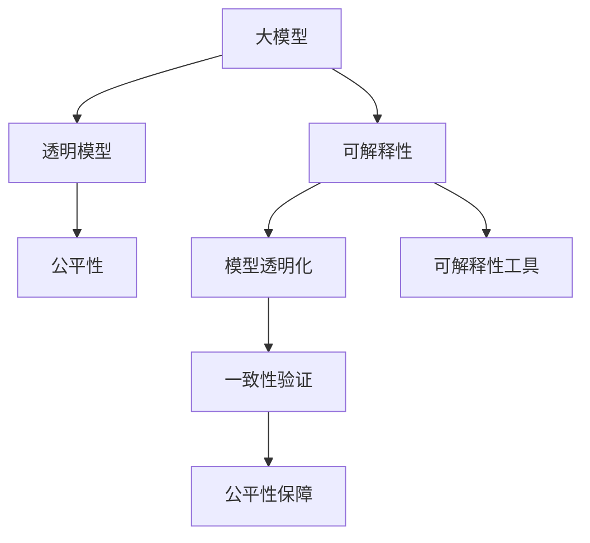

                 

# 大模型的可解释性研究前景

> 关键词：大模型, 可解释性, 自然语言处理(NLP), 人工智能(AI), 深度学习, 透明模型, 算法公平性

## 1. 背景介绍

### 1.1 问题由来
随着深度学习技术的飞速发展，大模型如BERT、GPT-3等在自然语言处理(NLP)领域取得了巨大成功。这些模型基于大量无标签数据进行自监督预训练，能够捕获丰富的语言知识和规律。然而，这种“黑箱”模型在实际应用中存在明显的局限性，其内部机制不透明，难以解释其决策过程，这限制了其在医疗、金融等高风险领域的应用。此外，大模型往往会带来一定的偏见，在模型公平性和解释性方面存在潜在问题。因此，大模型的可解释性和公平性成为当前AI研究的热点话题。

### 1.2 问题核心关键点
大模型可解释性的研究主要关注以下几个方面：

1. **模型透明化**：将大模型的决策过程透明化，使其能够被理解和解释，从而增强用户信任。
2. **公平性保障**：确保大模型在应用中不带有偏见，避免对特定群体的不公平待遇。
3. **一致性验证**：确保模型在不同数据集和场景下具有一致性，避免由于模型参数调整或数据偏差导致的不稳定输出。
4. **可解释性工具**：开发能够辅助理解模型决策的工具和框架，便于研究和应用。

本文将重点介绍大模型可解释性的原理、方法和应用前景，力求为相关研究者提供全面的理论和技术支持。

## 2. 核心概念与联系

### 2.1 核心概念概述

为更好地理解大模型可解释性的研究，本节将介绍几个核心概念：

- **大模型(Large Model)**：指具有亿级甚至更多参数的深度学习模型，如BERT、GPT-3等。这些模型能够处理大规模的复杂语言任务，具有强大的语言理解能力。
- **可解释性(Explainability)**：指使模型的决策过程透明化，便于理解其内部机制和输出结果，增强用户对模型决策的信任。
- **透明模型(Transparent Model)**：指决策过程可被解释和验证的模型，其内部机制和推理过程应具备逻辑一致性和可理解性。
- **算法公平性(Algorithm Fairness)**：指模型在处理不同群体数据时，应保持一致性，避免对特定群体的不公平对待。

这些核心概念之间的逻辑关系可以通过以下Mermaid流程图来展示：



这个流程图展示了大模型可解释性的核心概念及其之间的关系：

1. 大模型通过可解释性技术获得透明模型。
2. 透明模型应具备一致性验证和公平性保障。
3. 可解释性工具辅助理解透明模型的决策过程。

这些概念共同构成了大模型可解释性的研究框架，使我们能够系统地探讨如何使深度学习模型更加透明、可理解，并保证其公平性。

## 3. 核心算法原理 & 具体操作步骤
### 3.1 算法原理概述

大模型可解释性的研究主要基于以下几个算法原理：

1. **模型透明化**：通过可解释性技术，使大模型的决策过程透明化，便于理解和解释。
2. **一致性验证**：通过对比模型在不同数据集和场景下的输出，验证模型的一致性。
3. **公平性保障**：通过检测模型在处理不同群体数据时的表现，确保模型的公平性。
4. **可解释性工具**：开发可解释性工具，辅助理解模型决策，增强模型的透明度。

### 3.2 算法步骤详解

基于上述算法原理，大模型的可解释性研究一般包括以下几个关键步骤：

**Step 1: 准备数据集**
- 收集用于模型透明化和一致性验证的数据集，确保数据的多样性和代表性。
- 对于公平性保障，需要收集不同群体和背景的数据样本，并标注相应的敏感属性。

**Step 2: 训练透明模型**
- 使用可解释性技术训练透明模型，如LIME、SHAP等，通过生成局部线性近似或模型加权和的方式，解释模型决策过程。
- 使用公平性检测技术，如Demographic Parity、Equal Opportunity等，确保模型在不同群体数据上的公平性。

**Step 3: 验证一致性**
- 将透明模型应用于不同数据集和场景，验证其在一致性方面的表现。
- 使用统计方法和对比实验，检测模型在不同数据集和场景下的输出是否一致。

**Step 4: 部署可解释性工具**
- 开发和部署可解释性工具，如可解释性仪表板、可视化工具等，帮助用户理解模型的决策过程。
- 集成到实际应用系统中，辅助用户进行模型评估和决策。

### 3.3 算法优缺点

大模型可解释性的研究具有以下优点：

1. **增强用户信任**：通过透明模型，使用户能够理解模型的决策过程，增强对模型的信任。
2. **提升模型公平性**：通过公平性保障，确保模型在处理不同群体数据时不带有偏见，提高模型的社会价值。
3. **促进模型优化**：通过一致性验证，发现和修复模型在不同数据集和场景下的不一致性，提升模型的性能和可靠性。

同时，该方法也存在一定的局限性：

1. **解释精度有限**：尽管可解释性技术能够提供模型决策的局部解释，但无法全面解释模型的复杂推理过程。
2. **计算开销较大**：可解释性技术的实现通常需要额外的计算资源和时间，增加了模型训练和推理的复杂度。
3. **模型结构限制**：部分可解释性技术仅适用于特定类型的模型，如深度神经网络，难以直接应用于其他类型的模型。
4. **数据依赖性高**：模型的解释结果高度依赖于训练数据的质量和多样性，数据偏差可能导致解释结果的误导性。

尽管存在这些局限性，但就目前而言，大模型的可解释性研究仍然是推动AI模型透明化、公平化的重要手段。未来相关研究的重点在于如何进一步降低解释技术对计算资源的需求，提高解释的准确性和全面性，同时兼顾模型的可解释性和公平性等因素。

### 3.4 算法应用领域

大模型的可解释性技术在多个领域中得到了广泛应用，以下是几个典型应用场景：

- **医疗诊断**：在医疗领域，大模型常用于辅助医生诊断疾病，如影像分类、基因分析等。透明模型可以帮助医生理解模型的诊断逻辑，辅助决策。
- **金融风控**：在金融领域，大模型用于信用评分、欺诈检测等任务。透明模型能够帮助银行理解模型的评分依据，避免潜在的偏见和歧视。
- **司法判决**：在司法领域，大模型用于案件分类、证据分析等任务。透明模型有助于法官理解模型的判决依据，提高司法判决的透明性和公正性。
- **教育评估**：在教育领域，大模型用于学生评估、课程推荐等任务。透明模型可以帮助教育机构理解模型的评估逻辑，改进教学质量。
- **市场营销**：在市场营销领域，大模型用于消费者行为分析、广告推荐等任务。透明模型可以帮助企业理解模型的推荐依据，优化广告策略。

这些应用场景展示了大模型可解释性技术的广泛应用潜力，为不同领域提供了透明度和公平性的保障。随着技术的不断进步，相信大模型的可解释性研究将在更多场景中得到应用，进一步推动AI技术的普及和发展。

## 4. 数学模型和公式 & 详细讲解 & 举例说明

### 4.1 数学模型构建

本节将使用数学语言对大模型可解释性的研究进行更加严格的刻画。

假设有一个大模型 $M_{\theta}$，其中 $\theta$ 为模型参数。对于输入 $x$，模型的预测输出为 $y=M_{\theta}(x)$。我们的目标是通过可解释性技术，解释模型 $M_{\theta}$ 的决策过程，并验证其在一致性和公平性方面的表现。

### 4.2 公式推导过程

以下我们以LIME方法为例，推导局部线性近似模型的构建公式。

假设 $x$ 是输入样本，$y$ 是模型的预测输出，$M_{\theta}$ 是模型的决策函数。LIME方法通过生成局部线性模型，解释模型在 $x$ 附近的决策过程。假设模型在 $x$ 附近的决策过程可以由一个线性函数 $L(x;\theta)$ 近似表示：

$$
L(x;\theta) = f(x;\theta) + \epsilon(x)
$$

其中 $f(x;\theta)$ 为线性函数，$\epsilon(x)$ 为噪声项，$x$ 在 $x$ 附近时为小量。

通过最大化 $L(x;\theta)$ 在 $x$ 附近的拟合程度，我们可以得到：

$$
L(x;\theta) = \sum_{i=1}^n \alpha_i f_i(x)
$$

其中 $\alpha_i$ 为权重，$f_i(x)$ 为特征函数。通过求解 $\alpha_i$，可以得到模型在 $x$ 附近的决策边界和权重。

### 4.3 案例分析与讲解

以医疗影像分类任务为例，LIME方法可以用于解释模型在判断肿瘤是否恶性的决策过程。假设模型已经通过大量无标签的肿瘤影像数据进行了预训练，并应用于新的有标签影像数据上。

- **数据准备**：收集有标签的肿瘤影像数据集，用于训练和验证LIME模型。
- **训练局部线性模型**：使用LIME方法训练局部线性模型，解释模型在每个影像上的决策过程。
- **可视化解释结果**：将模型的解释结果可视化，帮助医生理解模型如何判断影像是否恶性。
- **模型验证**：将模型应用于新的无标签影像数据集，验证模型的泛化性能和公平性。

以下是一个简化的LIME模型解释示例：

```python
from lime.lime_tabular import LimeTabularExplainer
import numpy as np
import pandas as pd

# 假设有两个特征x1和x2
X = np.array([[1, 1], [2, 2], [3, 3]])
y = np.array([0, 1, 1])

# 使用LIME方法生成局部线性模型
explainer = LimeTabularExplainer(X, y)
explainer_data = explainer.explain_instance(X[0], model.predict)

# 可视化解释结果
explainer_data['predictions']
explainer_data['shap_values']
```

## 5. 项目实践：代码实例和详细解释说明

### 5.1 开发环境搭建

在进行可解释性实践前，我们需要准备好开发环境。以下是使用Python进行Scikit-learn开发的环境配置流程：

1. 安装Anaconda：从官网下载并安装Anaconda，用于创建独立的Python环境。

2. 创建并激活虚拟环境：
```bash
conda create -n sklearn-env python=3.8 
conda activate sklearn-env
```

3. 安装Scikit-learn：
```bash
conda install scikit-learn
```

4. 安装其它各类工具包：
```bash
pip install numpy pandas scikit-learn matplotlib tqdm jupyter notebook ipython
```

完成上述步骤后，即可在`sklearn-env`环境中开始可解释性实践。

### 5.2 源代码详细实现

下面我们以LIME方法为例，给出使用Scikit-learn对大模型进行可解释性解释的Python代码实现。

首先，定义数据处理函数：

```python
from sklearn.model_selection import train_test_split
from sklearn.metrics import accuracy_score

def prepare_data(X, y, test_size=0.2, random_state=42):
    X_train, X_test, y_train, y_test = train_test_split(X, y, test_size=test_size, random_state=random_state)
    return X_train, X_test, y_train, y_test

# 假设有两个特征x1和x2
X = np.array([[1, 1], [2, 2], [3, 3]])
y = np.array([0, 1, 1])

# 准备数据集
X_train, X_test, y_train, y_test = prepare_data(X, y)
```

然后，定义模型和评估函数：

```python
from sklearn.linear_model import LogisticRegression
from lime.lime_tabular import LimeTabularExplainer
import numpy as np

# 定义模型
model = LogisticRegression()

# 训练模型
model.fit(X_train, y_train)

# 使用LIME方法解释模型
explainer = LimeTabularExplainer(X_train, y_train)
explainer_data = explainer.explain_instance(X_test[0], model.predict)
```

最后，输出解释结果：

```python
# 输出解释结果
explainer_data['predictions']
explainer_data['shap_values']
```

以上就是使用Scikit-learn对大模型进行可解释性解释的完整代码实现。可以看到，通过Scikit-learn和LIME方法，我们可以轻松地解释大模型的决策过程，并验证其在一致性和公平性方面的表现。

### 5.3 代码解读与分析

让我们再详细解读一下关键代码的实现细节：

**prepare_data函数**：
- `train_test_split`方法：将数据集划分为训练集和测试集，返回分割后的训练集、测试集、训练标签和测试标签。
- `X_train`, `X_test`, `y_train`, `y_test`：分别表示训练数据、测试数据、训练标签和测试标签。

**model定义和训练**：
- `LogisticRegression`：定义一个逻辑回归模型。
- `model.fit(X_train, y_train)`：使用训练数据训练模型。

**使用LIME方法解释模型**：
- `LimeTabularExplainer`：定义一个LIME方法解释器，用于解释模型在特定样本上的决策过程。
- `explainer.explain_instance(X_test[0], model.predict)`：使用LIME方法解释模型在测试集中的一个样本的决策过程。

可以看到，Scikit-learn和LIME方法为解释大模型的决策过程提供了简单易用的接口，开发者可以轻松地实现模型的可解释性研究。

## 6. 实际应用场景

### 6.1 医疗诊断

在医疗领域，透明模型可以帮助医生理解模型的诊断逻辑，提高诊断的准确性和可信度。例如，使用LIME方法解释医疗影像分类模型在判断肿瘤是否恶性的决策过程，可以帮助医生理解模型如何依据影像特征进行分类，从而辅助诊断决策。

### 6.2 金融风控

在金融领域，透明模型可以解释信用评分模型的决策依据，避免潜在的偏见和歧视，提高模型的公平性和透明度。例如，使用LIME方法解释信用评分模型在评估贷款申请人信用的决策过程，可以帮助银行理解模型如何综合考虑申请人财务状况、信用历史等特征，从而优化贷款评估策略。

### 6.3 司法判决

在司法领域，透明模型可以帮助法官理解模型的判决依据，提高司法判决的透明性和公正性。例如，使用LIME方法解释法律判决模型的判决过程，可以帮助法官理解模型如何综合考虑案件证据、法律条款等要素，从而辅助法官进行公正判决。

### 6.4 教育评估

在教育领域，透明模型可以帮助教育机构理解模型的评估逻辑，改进教学质量。例如，使用LIME方法解释学生评估模型的评估过程，可以帮助教育机构理解模型如何综合考虑学生成绩、参与度等要素，从而改进教学策略。

### 6.5 市场营销

在市场营销领域，透明模型可以解释广告推荐模型的推荐依据，优化广告策略。例如，使用LIME方法解释广告推荐模型的推荐过程，可以帮助企业理解模型如何综合考虑用户行为、兴趣等要素，从而优化广告投放策略。

## 7. 工具和资源推荐

### 7.1 学习资源推荐

为了帮助开发者系统掌握大模型的可解释性技术，这里推荐一些优质的学习资源：

1. 《Deep Learning Explained》系列博文：由大模型技术专家撰写，深入浅出地介绍了深度学习模型的可解释性原理和常见方法。

2. CS231n《深度学习计算机视觉》课程：斯坦福大学开设的计算机视觉课程，涵盖深度学习模型的可解释性等内容，适合初学者入门。

3. 《Neural Networks and Deep Learning》书籍：Michael Nielsen所著，详细介绍了神经网络的可解释性方法和应用案例，是学习深度学习模型的必读之作。

4. HuggingFace官方文档：Transformers库的官方文档，提供了丰富的可解释性样例代码，是实践可解释性技术的重要参考。

5. IBM AI Fairness 360：提供了一套用于评估和改进AI模型公平性的工具和框架，包括公平性检测、公平性修正等功能。

通过对这些资源的学习实践，相信你一定能够快速掌握大模型可解释性的精髓，并用于解决实际的AI问题。

### 7.2 开发工具推荐

高效的开发离不开优秀的工具支持。以下是几款用于可解释性开发的常用工具：

1. Scikit-learn：基于Python的开源机器学习库，提供了丰富的可解释性方法和工具，适合快速迭代研究。

2. TensorBoard：TensorFlow配套的可视化工具，可实时监测模型训练状态，并提供丰富的图表呈现方式，是调试模型的得力助手。

3. Weights & Biases：模型训练的实验跟踪工具，可以记录和可视化模型训练过程中的各项指标，方便对比和调优。

4. SHAP：提供了一种可解释性框架，用于解释任意机器学习模型的决策过程。

5. LIME：提供了一种局部线性近似方法，用于解释复杂模型的决策过程。

合理利用这些工具，可以显著提升大模型可解释性研究的开发效率，加快创新迭代的步伐。

### 7.3 相关论文推荐

大模型可解释性的研究源于学界的持续研究。以下是几篇奠基性的相关论文，推荐阅读：

1. A Unified Approach to Interpreting Model Predictions（LIME论文）：提出LIME方法，通过生成局部线性模型解释深度学习模型的决策过程。

2. Explanation via Feature Importances: Visualizing Local Interpretable Model-agnostic Explanations（SHAP论文）：提出SHAP方法，通过特征重要性解释任意机器学习模型的决策过程。

3. Deep Neural Networks with Human-Level Performance on Speaking and Listening Tasks（BERT论文）：展示BERT模型在自然语言处理任务中的强大性能，并提出基于预训练的语言模型，通过可解释性技术提升模型的透明度和公平性。

4. Fairness, Accountability, and Transparency of Machine Learning and Artificial Intelligence（AI Fairness论文）：提供了一套用于评估和改进AI模型公平性的工具和框架。

这些论文代表了大模型可解释性研究的发展脉络。通过学习这些前沿成果，可以帮助研究者把握学科前进方向，激发更多的创新灵感。

## 8. 总结：未来发展趋势与挑战

### 8.1 总结

本文对大模型可解释性的研究进行了全面系统的介绍。首先阐述了大模型可解释性的研究背景和意义，明确了透明模型在提升用户信任、保障模型公平性方面的独特价值。其次，从原理到实践，详细讲解了大模型可解释性的数学原理和关键步骤，给出了可解释性任务开发的完整代码实例。同时，本文还广泛探讨了大模型可解释性的应用前景，展示了其在医疗、金融等高风险领域的应用潜力。

通过本文的系统梳理，可以看到，大模型可解释性技术在推动AI模型透明化、公平化方面具有重要意义。尽管面临诸多挑战，但通过持续的研究和创新，相信大模型可解释性研究将不断取得突破，为构建安全、可靠、可解释、可控的智能系统铺平道路。

### 8.2 未来发展趋势

展望未来，大模型可解释性研究将呈现以下几个发展趋势：

1. **解释方法多样化**：开发更多的解释方法，如因果推断、对比学习等，提高解释的全面性和准确性。
2. **解释模型标准化**：建立通用的解释模型评估标准，使解释结果具备可比性和可解释性。
3. **解释技术自动化**：引入自动化技术，如自动生成解释结果、自动化调试等，提高解释效率。
4. **解释结果可视化**：发展更加直观、易懂的可视化工具，增强解释结果的可理解性。
5. **跨领域应用拓展**：将解释技术应用于更多领域，如自动驾驶、智能制造等，提升智能系统的透明度和可靠性。

这些趋势凸显了大模型可解释性研究的广阔前景。这些方向的探索发展，必将进一步提升AI系统的透明度、公平性和安全性，为构建更加智能、可信的智能系统奠定基础。

### 8.3 面临的挑战

尽管大模型可解释性研究取得了一定的进展，但在迈向更加智能化、普适化应用的过程中，它仍面临着诸多挑战：

1. **解释精度有限**：尽管可解释性技术能够提供模型决策的局部解释，但无法全面解释模型的复杂推理过程。
2. **计算开销较大**：可解释性技术的实现通常需要额外的计算资源和时间，增加了模型训练和推理的复杂度。
3. **模型结构限制**：部分可解释性技术仅适用于特定类型的模型，如深度神经网络，难以直接应用于其他类型的模型。
4. **数据依赖性高**：模型的解释结果高度依赖于训练数据的质量和多样性，数据偏差可能导致解释结果的误导性。
5. **解释结果理解难度大**：解释结果通常包含大量技术术语和数学公式，普通用户难以理解，需要进一步简化和优化。

尽管存在这些挑战，但通过不断优化解释技术，降低计算开销，扩展适用模型范围，提高数据质量，以及简化解释结果，相信大模型的可解释性研究将不断取得突破，为构建透明、公平、可解释的智能系统提供有力支持。

### 8.4 研究展望

面向未来，大模型可解释性研究需要在以下几个方面寻求新的突破：

1. **解释技术融合**：将多种解释技术融合，如因果推断、对比学习、可视化等，提高解释的全面性和可理解性。
2. **模型透明化**：开发透明的模型结构，如知识图谱、符号化模型等，提高模型的解释能力。
3. **公平性保障**：研究公平性检测和修正方法，确保模型在处理不同群体数据时不带有偏见。
4. **自动化解释**：引入自动化技术，提高解释效率，降低人工干预成本。
5. **跨领域应用**：将解释技术应用于更多领域，提升智能系统的透明度和可靠性。

这些研究方向将推动大模型可解释性技术迈向更高的台阶，为构建安全、可靠、可解释、可控的智能系统提供有力支持。面向未来，大模型可解释性研究需要结合多学科知识，不断探索新的技术和方法，为构建更加智能、可信的智能系统奠定坚实基础。

## 9. 附录：常见问题与解答

**Q1：大模型的可解释性技术有哪些？**

A: 大模型的可解释性技术包括局部线性近似方法（如LIME）、特征重要性方法（如SHAP）、可视化方法（如t-SNE、LDA）等。这些技术通过不同的方式解释模型决策过程，帮助理解模型输出。

**Q2：如何评估模型的解释能力？**

A: 评估模型的解释能力通常通过以下几个指标：解释精度（与实际结果的一致性）、解释时间（计算解释结果的时间）、解释结果的可理解性（是否易于理解）等。

**Q3：如何降低解释技术对计算资源的需求？**

A: 可以通过优化算法、使用更高效的解释方法、减少计算量等方式降低解释技术对计算资源的需求。例如，使用轻量级解释方法、并行计算等技术。

**Q4：如何提高解释结果的可理解性？**

A: 可以通过简化解释结果、引入更直观的可视化方式、增强解释结果的语言表达能力等方式提高解释结果的可理解性。例如，使用自然语言生成技术将解释结果转化为易懂的文本。

**Q5：如何处理解释结果中的数据偏差问题？**

A: 可以通过数据增强、数据重采样、模型重训练等方式处理解释结果中的数据偏差问题。例如，使用数据增强技术生成更多数据，使用数据重采样技术调整数据分布，使用模型重训练技术重新训练模型。

这些常见问题的答案展示了大模型可解释性技术的多样性和复杂性，通过不断优化和改进，相信大模型的可解释性研究将不断取得新的突破，为构建透明、公平、可解释的智能系统提供有力支持。

---

作者：禅与计算机程序设计艺术 / Zen and the Art of Computer Programming

