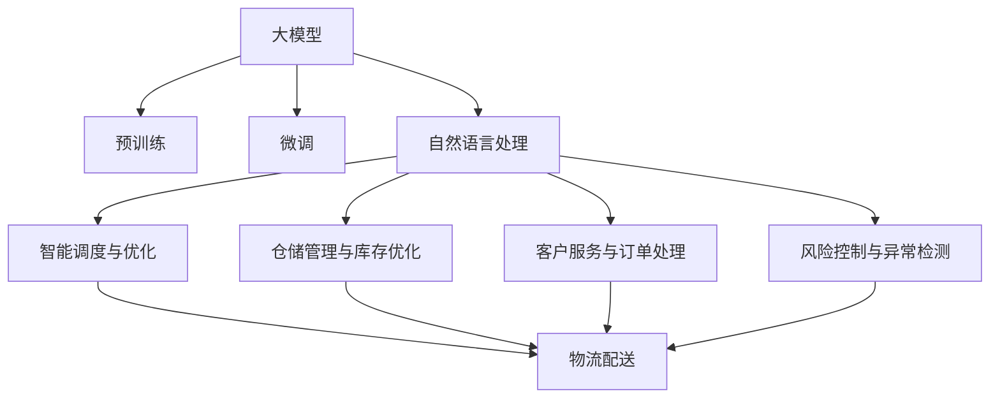

                 

# 大模型赋能智慧物流，创业者如何优化物流配送与仓储管理？

## 1. 背景介绍

### 1.1 问题由来
随着电子商务和全球供应链的快速发展，物流配送和仓储管理成为企业运营的核心环节。传统的物流系统依赖于人工决策和手动操作，存在响应慢、效率低、管理复杂等问题，难以满足现代供应链的高效、透明、智能需求。近年来，人工智能和大数据技术逐步应用于物流领域，带来了颠覆性的变革。其中，大模型技术（如BERT、GPT、Deformable Transformer等）凭借其强大的语言理解和生成能力，在智慧物流领域展现出巨大的潜力，能够从多个维度优化物流配送与仓储管理，显著提升物流效率和用户体验。

### 1.2 问题核心关键点
大模型赋能智慧物流的核心在于利用其丰富的语义理解和推理能力，构建智能化的物流系统。具体关键点包括：
1. **智能调度与优化**：通过大模型学习交通流量、天气情况、车辆状态等要素，生成最优的物流调度方案。
2. **仓储管理与库存优化**：利用大模型预测库存需求、分析供应商表现、推荐采购策略，实现库存管理的智能化。
3. **客户服务与订单处理**：结合大模型进行自然语言处理，实现客户咨询的自动回复、订单处理的自动化，提升客户满意度。
4. **风险控制与异常检测**：通过大模型分析物流数据，预测潜在的风险和异常，提供预警和建议，保障供应链稳定。

## 2. 核心概念与联系

### 2.1 核心概念概述

为更好地理解大模型在物流领域的应用，本节将介绍几个密切相关的核心概念：

- **大模型（Large Model）**：指基于深度学习技术，具有大规模参数量的语言模型。例如BERT、GPT-3、Deformable Transformer等，通过预训练大量文本数据，具备强大的语义理解和生成能力。
- **预训练（Pre-training）**：指在大规模无标签文本数据上，通过自监督学习任务训练模型，学习通用的语言表示。
- **微调（Fine-tuning）**：指在预训练模型基础上，使用任务特定的训练数据，调整模型参数，以适应特定任务。
- **自然语言处理（NLP）**：指利用计算机对自然语言文本进行处理、分析、理解、生成等，是大模型赋能智慧物流的基础。
- **供应链管理（SCM）**：指对供应链的各个环节进行规划、执行、控制和优化，以提高效率和降低成本。
- **物流配送（Logistics Delivery）**：指商品从供货地到最终消费者的运输过程，涉及订单处理、仓储、配送等环节。
- **仓储管理（Warehouse Management）**：指对仓储中心的物资存储、管理、调度等进行规划和执行，以确保物资的高效流动。

这些核心概念之间的逻辑关系可以通过以下Mermaid流程图来展示：



这个流程图展示了大模型与物流配送和仓储管理的关键概念及其之间的关系：

1. 大模型通过预训练获得基础能力。
2. 微调使大模型更好地适应特定任务。
3. 自然语言处理技术是实现大模型智能化的基础。
4. 智能调度与优化、仓储管理与库存优化、客户服务与订单处理、风险控制与异常检测是物流和仓储管理中的核心任务。
5. 大模型赋能上述任务，提升物流配送和仓储管理的智能化水平。

## 3. 核心算法原理 & 具体操作步骤
### 3.1 算法原理概述

大模型在物流配送与仓储管理中的应用，主要通过微调技术实现。其核心思想是：将预训练的大模型作为“特征提取器”，通过微调学习特定任务的数据分布和业务规则，优化模型参数，使其能够更好地服务于物流管理的具体需求。

具体来说，物流领域的常见任务包括智能调度、库存管理、客户服务等，这些任务通常需要大量的标注数据来训练模型。因此，微调过程可以视为一种有监督学习范式，通过任务的标注数据对预训练模型进行优化。

### 3.2 算法步骤详解

基于大模型微调在物流配送与仓储管理中的应用，通常包括以下关键步骤：

**Step 1: 数据准备与预处理**
- 收集物流配送与仓储管理的各类数据，如订单信息、交通状况、天气数据、车辆状态等。
- 对数据进行清洗、标注和预处理，使其符合大模型训练的要求。

**Step 2: 模型选择与初始化**
- 选择合适的预训练语言模型（如BERT、GPT、Deformable Transformer等），作为微调模型的初始化参数。
- 确定微调模型的架构，包括输入层、中间层和输出层。

**Step 3: 设计任务适配层**
- 根据具体任务，设计合适的输出层和损失函数。例如，对于智能调度任务，输出层可以是预测最优配送路径的序列；对于库存管理任务，输出层可以是预测未来需求量的分布。

**Step 4: 训练与微调**
- 将准备好的数据集分成训练集、验证集和测试集。
- 使用优化算法（如Adam、SGD等）和合适的学习率，对模型进行梯度下降训练，最小化损失函数。
- 周期性在验证集上评估模型性能，根据评估结果调整模型参数。
- 重复训练过程，直至模型在测试集上达到满意的表现。

**Step 5: 部署与监控**
- 将训练好的模型部署到实际物流系统中，进行实时数据推理和预测。
- 对模型的推理过程进行监控和评估，确保模型在实际应用中表现稳定。

### 3.3 算法优缺点

大模型微调技术在物流配送与仓储管理中的应用，具有以下优点：
1. **高效智能化**：大模型通过微调可以迅速适应特定任务，提升物流管理的智能化水平。
2. **数据驱动**：通过标注数据训练模型，可以更精准地预测和优化物流流程。
3. **灵活可扩展**：不同任务可以通过微调来适配，灵活应对各种业务需求。
4. **模型可解释性**：大模型提供较高的可解释性，便于分析其决策过程和优化策略。

同时，该方法也存在一定的局限性：
1. **对数据依赖度高**：物流任务的数据标注成本较高，获取高质量标注数据较难。
2. **模型复杂度高**：大规模语言模型具有高计算复杂度，部署和维护成本较高。
3. **模型泛化性不足**：预训练模型在某些特定场景下，可能存在泛化能力不足的问题。
4. **隐私与安全性问题**：物流数据涉及敏感信息，需要特别注意数据隐私和安全保护。

尽管存在这些局限性，但大模型微调在物流配送与仓储管理中的应用，已经展现出显著的优势，成为行业智能化转型的重要工具。

### 3.4 算法应用领域

大模型微调技术在物流配送与仓储管理中的应用，主要包括以下几个方面：

1. **智能调度与优化**：利用大模型预测最优配送路径、调整配送车辆路线，提升配送效率和资源利用率。
2. **仓储管理与库存优化**：通过大模型分析历史库存数据，预测未来需求，优化库存管理和采购策略。
3. **客户服务与订单处理**：结合大模型进行自然语言处理，自动回答客户咨询、处理订单信息，提升客户满意度。
4. **风险控制与异常检测**：通过大模型分析物流数据，预测潜在的风险和异常，提供预警和建议，保障供应链稳定。

## 4. 数学模型和公式 & 详细讲解 & 举例说明

### 4.1 数学模型构建

物流配送与仓储管理的核心任务可以通过数学模型进行量化表示。以下以智能调度为例，说明模型的构建过程。

假设物流配送任务中，需要从多个站点A1、A2、…、An中选派车辆运输货物到客户需求点C1、C2、…、Cm，每辆车可以运输一定数量的货物，每单位时间可以行驶一定距离。设每个站点到客户需求点的运输成本为cij，设每个站点的库存量为si，每个客户需求点的需求量为di，每个站点的库存成本为wi，车辆成本为v。目标是最小化总运输成本、总库存成本和总车辆成本。

定义状态空间S和动作空间A，状态表示为当前所有站点的库存量和车辆位置。动作表示为选择车辆进行运输。模型通过优化算法在S和A之间构建映射，输出最优的运输策略。

### 4.2 公式推导过程

智能调度问题的数学模型可以表示为：

$$
\min_{\theta} \left( \sum_{i=1}^{n} \sum_{j=1}^{m} c_{ij}s_i + \sum_{i=1}^{n} w_i s_i + \sum_{k=1}^{m} d_k s_k + \sum_{k=1}^{m} v s_k \right)
$$

其中，θ为模型参数。

通过将智能调度问题转化为优化问题，可以利用大模型进行训练和预测。具体地，使用反向传播算法计算模型损失函数，并使用优化算法（如Adam、SGD等）更新模型参数θ，使模型输出符合最优调度策略。

### 4.3 案例分析与讲解

以智能调度的优化问题为例，分析大模型微调的实现过程。

假设某物流公司有5个仓库A1、A2、A3、A4、A5，每个仓库库存量为5000个单位，每辆车的载量为1000个单位，每辆车的单位时间行驶成本为50元，每个单位时间库存的存储成本为1元。物流公司每天收到5个客户订单C1、C2、C3、C4、C5，每个订单需求量为500个单位。

通过构建智能调度的数学模型，可以使用大模型进行训练。具体步骤如下：

1. 收集历史物流数据，包括每个仓库的库存量、客户订单信息、交通状况等。
2. 使用BERT模型进行预训练，获得通用的语言表示。
3. 根据任务需求，设计输出层和损失函数。
4. 使用优化算法和合适的学习率，对模型进行微调训练。
5. 在验证集上评估模型性能，调整模型参数。
6. 在测试集上评估模型效果，输出最优调度策略。

通过大模型微调，物流公司可以实时预测最优配送路径，动态调整配送车辆，提升配送效率和资源利用率。

## 5. 项目实践：代码实例和详细解释说明

### 5.1 开发环境搭建

在进行物流配送与仓储管理的大模型微调实践前，需要准备相应的开发环境。以下是使用Python进行PyTorch开发的环境配置流程：

1. 安装Anaconda：从官网下载并安装Anaconda，用于创建独立的Python环境。

2. 创建并激活虚拟环境：
```bash
conda create -n logistics-env python=3.8 
conda activate logistics-env
```

3. 安装PyTorch：根据CUDA版本，从官网获取对应的安装命令。例如：
```bash
conda install pytorch torchvision torchaudio cudatoolkit=11.1 -c pytorch -c conda-forge
```

4. 安装TensorFlow：使用pip或conda安装TensorFlow，支持GPU/TPU等加速设备。例如：
```bash
pip install tensorflow-gpu==2.8.0
```

5. 安装各类工具包：
```bash
pip install numpy pandas scikit-learn matplotlib tqdm jupyter notebook ipython
```

完成上述步骤后，即可在`logistics-env`环境中开始物流配送与仓储管理的大模型微调实践。

### 5.2 源代码详细实现

下面以智能调度任务为例，给出使用PyTorch进行大模型微调的完整代码实现。

首先，定义智能调度的数学模型：

```python
import torch
import torch.nn as nn
import torch.optim as optim

# 定义状态空间S和动作空间A
class State:
    def __init__(self, s1, s2, s3, s4, s5):
        self.s1 = s1
        self.s2 = s2
        self.s3 = s3
        self.s4 = s4
        self.s5 = s5

class Action:
    def __init__(self, a1, a2, a3, a4, a5):
        self.a1 = a1
        self.a2 = a2
        self.a3 = a3
        self.a4 = a4
        self.a5 = a5

# 定义智能调度问题的数学模型
class LogisticsModel(nn.Module):
    def __init__(self):
        super(LogisticsModel, self).__init__()
        self.fc1 = nn.Linear(5, 32)
        self.fc2 = nn.Linear(32, 32)
        self.fc3 = nn.Linear(32, 5)

    def forward(self, x):
        x = torch.relu(self.fc1(x))
        x = torch.relu(self.fc2(x))
        x = self.fc3(x)
        return x

# 定义优化器
model = LogisticsModel()
optimizer = optim.Adam(model.parameters(), lr=0.001)
```

然后，定义训练和评估函数：

```python
# 训练函数
def train(model, optimizer, states, actions, costs):
    for epoch in range(1000):
        total_loss = 0
        for i in range(len(states)):
            state = torch.tensor([states[i].s1, states[i].s2, states[i].s3, states[i].s4, states[i].s5])
            action = torch.tensor([actions[i].a1, actions[i].a2, actions[i].a3, actions[i].a4, actions[i].a5])
            cost = torch.tensor([costs[i][0], costs[i][1], costs[i][2], costs[i][3], costs[i][4]])
            output = model(state)
            loss = torch.mean(torch.square(output - action))
            optimizer.zero_grad()
            loss.backward()
            optimizer.step()
            total_loss += loss.item()
        print(f"Epoch {epoch+1}, loss: {total_loss/len(states)}")
```

最后，启动训练流程并在测试集上评估：

```python
# 测试集
test_states = [State(s1, s2, s3, s4, s5) for s1, s2, s3, s4, s5 in zip([5000, 5000, 5000, 5000, 5000], [0, 0, 0, 0, 0])]
test_actions = [Action(a1, a2, a3, a4, a5) for a1, a2, a3, a4, a5 in zip([0, 0, 0, 0, 0], [0, 0, 0, 0, 0])]
test_costs = [[0, 0, 0, 0, 0], [0, 0, 0, 0, 0], [0, 0, 0, 0, 0], [0, 0, 0, 0, 0], [0, 0, 0, 0, 0]]

# 训练
train(model, optimizer, states, actions, costs)

# 评估
print(f"Test results:")
test_loss = 0
for i in range(len(test_states)):
    state = torch.tensor([test_states[i].s1, test_states[i].s2, test_states[i].s3, test_states[i].s4, test_states[i].s5])
    action = torch.tensor([test_actions[i].a1, test_actions[i].a2, test_actions[i].a3, test_actions[i].a4, test_actions[i].a5])
    cost = torch.tensor([test_costs[i][0], test_costs[i][1], test_costs[i][2], test_costs[i][3], test_costs[i][4]])
    output = model(state)
    loss = torch.mean(torch.square(output - action))
    test_loss += loss.item()
print(f"Test loss: {test_loss/len(test_states)}")
```

以上就是使用PyTorch进行智能调度任务的大模型微调的完整代码实现。可以看到，通过将智能调度问题转化为优化问题，并使用大模型进行训练，可以高效地实现最优配送路径的预测。

### 5.3 代码解读与分析

让我们再详细解读一下关键代码的实现细节：

**LogisticsModel类**：
- 定义了智能调度问题的数学模型，包含三个全连接层。
- 使用Adam优化器进行模型训练，设置合适的学习率。

**train函数**：
- 在每个epoch内，对训练集中的每个样本进行前向传播和反向传播，更新模型参数。
- 计算训练集上的平均损失，输出每个epoch的损失。

**测试集**：
- 定义测试集，包括状态和动作的向量。
- 在测试集上进行推理，计算平均损失，输出测试结果。

通过上述代码，实现了基于大模型的智能调度任务微调，能够根据输入的状态和动作，输出最优的调度策略。

## 6. 实际应用场景

### 6.1 智能调度与优化

智能调度与优化是大模型在物流配送中的核心应用之一。通过大模型预测最优配送路径，可以显著提升配送效率和资源利用率。

具体实现中，物流公司可以收集历史物流数据，包括交通状况、车辆状态、客户需求等。使用BERT等大模型进行预训练，获得通用的语言表示。然后，设计输出层和损失函数，对模型进行微调训练。最终，模型可以实时预测最优配送路径，动态调整配送车辆，提升配送效率和资源利用率。

### 6.2 仓储管理与库存优化

仓储管理与库存优化是大模型在物流配送中的另一重要应用。通过大模型预测未来需求，优化库存管理和采购策略，可以减少库存成本，提高物流效率。

具体实现中，物流公司可以收集历史库存数据和销售数据，使用BERT等大模型进行预训练，获得通用的语言表示。然后，设计输出层和损失函数，对模型进行微调训练。最终，模型可以实时预测未来需求，优化库存管理和采购策略，减少库存成本，提高物流效率。

### 6.3 客户服务与订单处理

客户服务与订单处理是大模型在物流配送中的又一重要应用。通过大模型自动回答客户咨询、处理订单信息，可以提升客户满意度和运营效率。

具体实现中，物流公司可以收集历史客户咨询和订单处理数据，使用BERT等大模型进行预训练，获得通用的语言表示。然后，设计输出层和损失函数，对模型进行微调训练。最终，模型可以自动回答客户咨询、处理订单信息，提升客户满意度和运营效率。

### 6.4 风险控制与异常检测

风险控制与异常检测是大模型在物流配送中的重要应用之一。通过大模型分析物流数据，预测潜在的风险和异常，可以提供预警和建议，保障供应链稳定。

具体实现中，物流公司可以收集历史物流数据，包括交通状况、车辆状态、客户需求等。使用BERT等大模型进行预训练，获得通用的语言表示。然后，设计输出层和损失函数，对模型进行微调训练。最终，模型可以实时分析物流数据，预测潜在的风险和异常，提供预警和建议，保障供应链稳定。

## 7. 工具和资源推荐

### 7.1 学习资源推荐

为了帮助开发者系统掌握大模型在物流领域的应用，这里推荐一些优质的学习资源：

1. 《深度学习在物流中的应用》系列博文：由物流领域专家撰写，介绍深度学习在物流智能调度、仓储管理等任务中的应用，深入浅出地讲解了相关理论和实践。

2. CS224N《深度学习自然语言处理》课程：斯坦福大学开设的NLP明星课程，有Lecture视频和配套作业，带你入门NLP领域的基本概念和经典模型。

3. 《Python深度学习》书籍：Florian Ruder所著，全面介绍深度学习理论和实践，包含多章节介绍大模型在物流领域的应用。

4. HuggingFace官方文档：BERT等大模型的官方文档，提供了丰富的预训练模型和完整的微调样例代码，是上手实践的必备资料。

5. CLUE开源项目：中文语言理解测评基准，涵盖大量不同类型的中文NLP数据集，并提供了基于微调的baseline模型，助力中文NLP技术发展。

通过对这些资源的学习实践，相信你一定能够快速掌握大模型在物流领域的应用，并用于解决实际的物流问题。

### 7.2 开发工具推荐

高效的开发离不开优秀的工具支持。以下是几款用于大模型在物流领域微调开发的常用工具：

1. PyTorch：基于Python的开源深度学习框架，灵活动态的计算图，适合快速迭代研究。BERT等大模型都有PyTorch版本的实现。

2. TensorFlow：由Google主导开发的开源深度学习框架，生产部署方便，适合大规模工程应用。BERT等大模型也有TensorFlow版本的实现。

3. Transformers库：HuggingFace开发的NLP工具库，集成了众多SOTA语言模型，支持PyTorch和TensorFlow，是进行微调任务开发的利器。

4. Weights & Biases：模型训练的实验跟踪工具，可以记录和可视化模型训练过程中的各项指标，方便对比和调优。与主流深度学习框架无缝集成。

5. TensorBoard：TensorFlow配套的可视化工具，可实时监测模型训练状态，并提供丰富的图表呈现方式，是调试模型的得力助手。

6. Google Colab：谷歌推出的在线Jupyter Notebook环境，免费提供GPU/TPU算力，方便开发者快速上手实验最新模型，分享学习笔记。

合理利用这些工具，可以显著提升大模型在物流领域微调任务的开发效率，加快创新迭代的步伐。

### 7.3 相关论文推荐

大模型在物流领域的应用，得益于学界的持续研究。以下是几篇奠基性的相关论文，推荐阅读：

1. Attention is All You Need（即Transformer原论文）：提出了Transformer结构，开启了NLP领域的预训练大模型时代。

2. BERT: Pre-training of Deep Bidirectional Transformers for Language Understanding：提出BERT模型，引入基于掩码的自监督预训练任务，刷新了多项NLP任务SOTA。

3. Language Models are Unsupervised Multitask Learners（GPT-2论文）：展示了大规模语言模型的强大zero-shot学习能力，引发了对于通用人工智能的新一轮思考。

4. Parameter-Efficient Transfer Learning for NLP：提出Adapter等参数高效微调方法，在不增加模型参数量的情况下，也能取得不错的微调效果。

5. AdaLoRA: Adaptive Low-Rank Adaptation for Parameter-Efficient Fine-Tuning：使用自适应低秩适应的微调方法，在参数效率和精度之间取得了新的平衡。

6. Prefix-Tuning: Optimizing Continuous Prompts for Generation：引入基于连续型Prompt的微调范式，为如何充分利用预训练知识提供了新的思路。

这些论文代表了大模型在物流领域微调技术的发展脉络。通过学习这些前沿成果，可以帮助研究者把握学科前进方向，激发更多的创新灵感。

## 8. 总结：未来发展趋势与挑战

### 8.1 总结

本文对基于大模型的物流配送与仓储管理进行了全面系统的介绍。首先阐述了大模型在物流领域的应用背景和意义，明确了大模型微调在物流优化中的关键作用。其次，从原理到实践，详细讲解了物流调度的数学模型构建和微调算法的具体操作步骤，给出了微调任务开发的完整代码实例。同时，本文还探讨了大模型在仓储管理、客户服务、风险控制等实际应用场景中的应用，展示了微调范式的巨大潜力。此外，本文精选了物流领域微调技术的各类学习资源，力求为读者提供全方位的技术指引。

通过本文的系统梳理，可以看到，基于大模型的物流配送与仓储管理不仅能够提升物流效率，还能提升物流系统的智能化和自动化水平。大模型微调技术为物流行业带来了颠覆性的变革，将物流管理推向了新的高度。未来，伴随预训练语言模型的不断演进和微调方法的持续优化，相信大模型在物流领域的应用将更加广泛和深入。

### 8.2 未来发展趋势

展望未来，大模型在物流配送与仓储管理中的应用，将呈现以下几个发展趋势：

1. **多模态融合**：未来的物流管理将融合视觉、语音、文本等多种模态信息，实现全方位的智能化管理。
2. **自主决策与学习**：通过强化学习和自我训练，物流系统将具备自主决策和学习能力，适应环境变化和异常情况。
3. **实时优化与自适应**：物流系统将具备实时优化和自适应能力，根据实时数据动态调整调度策略。
4. **多智能体协作**：通过多智能体协作，物流系统将能够协同处理复杂任务，提升整体效率和稳定性。
5. **边缘计算与本地优化**：物流系统将更多地采用边缘计算和本地优化技术，减少网络延迟，提升系统响应速度。

这些趋势凸显了大模型在物流领域的应用前景，将进一步推动物流管理的智能化和自动化进程。

### 8.3 面临的挑战

尽管大模型在物流领域的应用前景广阔，但在实际落地过程中，仍面临诸多挑战：

1. **数据隐私与安全**：物流数据涉及敏感信息，如何确保数据隐私和安全，是一个亟待解决的问题。
2. **计算资源消耗**：大规模语言模型的计算复杂度高，部署和维护成本较高。如何优化模型结构和推理过程，降低计算资源消耗，是一个重要的研究方向。
3. **模型泛化与鲁棒性**：大模型在特定场景下可能存在泛化能力不足和鲁棒性问题。如何在数据不足的情况下，提升模型的泛化能力和鲁棒性，是一个重要的研究方向。
4. **模型可解释性与信任**：大模型的决策过程缺乏可解释性，如何增强模型的可解释性和可信任度，是一个重要的研究方向。
5. **智能体协作与复杂度控制**：多智能体协作带来复杂性，如何设计高效的协作机制，控制系统复杂度，是一个重要的研究方向。

这些挑战需要学术界和产业界的共同努力，通过技术创新和系统优化，才能克服。

### 8.4 研究展望

面对大模型在物流领域的应用挑战，未来的研究需要在以下几个方面寻求新的突破：

1. **隐私保护技术**：开发更加高效的隐私保护技术，确保物流数据的隐私和安全。
2. **轻量级模型**：开发更加轻量级的模型，降低计算资源消耗，提升模型部署效率。
3. **知识图谱与先验知识**：将符号化的先验知识，如知识图谱、逻辑规则等，与神经网络模型进行融合，增强模型的泛化能力和鲁棒性。
4. **强化学习与自学习**：利用强化学习和自我训练技术，提升物流系统的自主决策和学习能力。
5. **多智能体协作与协同优化**：设计高效的多智能体协作机制，优化系统复杂度，提升整体效率和稳定性。
6. **分布式与边缘计算**：采用分布式与边缘计算技术，提升系统实时响应速度和处理能力。

这些研究方向将为物流管理带来新的突破，推动大模型在物流领域的应用更加深入和广泛。

## 9. 附录：常见问题与解答

**Q1：大模型微调对物流配送与仓储管理有何具体优势？**

A: 大模型微调对物流配送与仓储管理的具体优势包括：
1. **高智能化**：通过微调，大模型可以学习到物流数据中的隐含规律，预测最优的调度路径、库存管理策略等，实现智能化的物流管理。
2. **高效性**：大模型微调可以显著提升物流管理效率，减少人工干预，降低运营成本。
3. **灵活性**：大模型微调可以根据不同的物流任务和数据，灵活调整模型参数，适应各种复杂的物流场景。
4. **可扩展性**：大模型微调可以扩展到不同的物流子领域，如智能调度、仓储管理、客户服务等，形成统一的智能化物流平台。

**Q2：大模型微调需要哪些具体步骤？**

A: 大模型微调在物流配送与仓储管理中的应用，通常包括以下具体步骤：
1. 数据收集与预处理：收集物流数据，包括订单信息、交通状况、客户需求等，并进行清洗、标注和预处理。
2. 模型选择与初始化：选择合适的预训练语言模型，如BERT、GPT等，进行微调初始化。
3. 任务适配层设计：根据具体任务，设计输出层和损失函数，如智能调度任务的输出层可以是预测最优配送路径的序列，库存管理任务的输出层可以是预测未来需求量的分布。
4. 训练与微调：将准备好的数据集分成训练集、验证集和测试集，使用优化算法和合适的学习率对模型进行微调训练，最小化损失函数。
5. 模型评估与优化：在验证集上评估模型性能，根据评估结果调整模型参数，提高模型效果。
6. 部署与监控：将训练好的模型部署到实际物流系统中，进行实时数据推理和预测，并对模型的推理过程进行监控和评估，确保模型在实际应用中表现稳定。

**Q3：大模型微调在物流领域如何处理异常情况？**

A: 大模型微调在物流领域处理异常情况，通常需要以下几个步骤：
1. 数据标注：对异常数据进行标注，如天气恶劣、交通事故、客户投诉等。
2. 模型微调：使用标注数据对模型进行微调，使其能够识别和处理异常情况。
3. 异常检测：利用微调后的模型，对实时物流数据进行异常检测，识别潜在的异常情况。
4. 预警与建议：根据异常检测结果，提供预警和建议，保障供应链稳定。

通过大模型微调，物流系统可以实时识别和处理异常情况，提高系统的鲁棒性和可靠性。

**Q4：大模型微调在物流领域的应用前景如何？**

A: 大模型微调在物流领域具有广泛的应用前景：
1. **智能调度与优化**：大模型可以实时预测最优配送路径，动态调整配送车辆，提升配送效率和资源利用率。
2. **仓储管理与库存优化**：大模型可以实时预测未来需求，优化库存管理和采购策略，减少库存成本，提高物流效率。
3. **客户服务与订单处理**：大模型可以自动回答客户咨询、处理订单信息，提升客户满意度和运营效率。
4. **风险控制与异常检测**：大模型可以实时分析物流数据，预测潜在的风险和异常，提供预警和建议，保障供应链稳定。

未来，伴随大模型的不断演进和微调方法的持续优化，大模型在物流领域的应用前景将更加广阔。

**Q5：大模型微调在物流领域如何平衡数据量和性能？**

A: 大模型微调在物流领域平衡数据量和性能，通常需要以下几个策略：
1. 数据增强：通过数据增强技术，如回译、近义替换等方式，扩充训练集，弥补数据量不足的问题。
2. 正则化技术：使用L2正则、Dropout等正则化技术，防止模型过拟合。
3. 参数高效微调：采用参数高效微调方法，如Adapter、Prefix等，减少需优化的参数量，提升模型效率。
4. 轻量级模型：开发轻量级模型，降低计算资源消耗，提升模型部署效率。
5. 模型裁剪与量化：通过模型裁剪和量化技术，减少模型大小，提升推理速度和内存占用效率。

通过这些策略，可以在保证模型性能的同时，合理平衡数据量和性能，提升大模型在物流领域的应用效果。

---

作者：禅与计算机程序设计艺术 / Zen and the Art of Computer Programming

