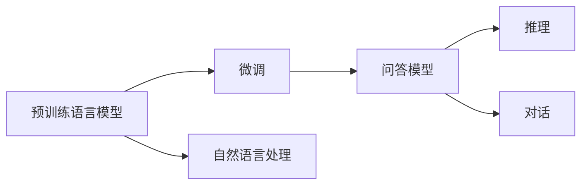

                 

# 大模型问答机器人的技术特点

大模型问答机器人是人工智能领域的前沿技术，通过预训练的深度学习模型，实现对自然语言问题的理解和解答。本文章将从背景介绍、核心概念与联系、核心算法原理、数学模型与公式、项目实践、实际应用场景、工具与资源推荐、总结与未来展望、常见问题与解答等多个方面，详细阐述大模型问答机器人的技术特点与核心算法。

## 1. 背景介绍

### 1.1 问题由来
随着自然语言处理（NLP）技术的不断发展，大模型问答机器人成为解决用户复杂查询的重要手段。传统的问答系统依赖于规则或模板，难以处理复杂问题，且需要大量的人工参与。而基于大模型的问答机器人，通过在大规模语料上预训练，获得了强大的语言理解和生成能力，能够在无需人工干预的情况下，自动理解和回答用户的问题。

### 1.2 问题核心关键点
大模型问答机器人的核心在于：
1. 基于预训练语言模型，能够自动从语料中学习通用的语言表示。
2. 通过微调，将模型适配到特定任务（如问答），提升针对具体任务的性能。
3. 支持多种输入格式和输出格式，实现自然语言交互。
4. 能够处理复杂问题，生成结构化或非结构化的答案。

## 2. 核心概念与联系

### 2.1 核心概念概述

以下是构建大模型问答机器人的关键概念：

- **预训练语言模型（Pre-trained Language Models）**：如BERT、GPT等，通过在大型无标签语料上预训练，学习通用的语言表示，具备强大的语言理解和生成能力。
- **微调（Fine-tuning）**：在预训练模型的基础上，通过有监督的训练，优化模型在特定任务上的性能，如问答任务。
- **自然语言处理（Natural Language Processing, NLP）**：研究如何使计算机理解和处理人类语言的技术，包括语言模型、语言表示、语言理解、语言生成等。
- **问答系统（Question Answering, QA）**：回答用户提出的自然语言问题，旨在提供准确、高效的回答。
- **推理（Reasoning）**：通过模型学习到的语言知识，自动推导出逻辑和事实，进行复杂问题的解答。
- **对话（Dialogue）**：通过模型与用户进行多轮交互，生成上下文相关的回答。

这些概念相互关联，共同构建了大模型问答机器人的技术框架。

### 2.2 核心概念原理和架构的 Mermaid 流程图


这个流程图展示了预训练语言模型通过微调，转变为问答模型的过程，并进一步支持推理和对话功能。

## 3. 核心算法原理 & 具体操作步骤

### 3.1 算法原理概述
大模型问答机器人的核心算法原理基于预训练语言模型和微调技术。预训练模型在大型无标签语料上学习到通用的语言表示，而微调则将其适配到具体任务（如问答），提升针对任务的性能。

**总体流程**：
1. **预训练**：在大型无标签语料上预训练语言模型，学习通用的语言表示。
2. **微调**：通过有监督的训练，将预训练模型适配到问答任务，提升对问题的理解和回答能力。
3. **推理和对话**：在微调后的模型基础上，通过推理和对话技术，生成结构化或非结构化的答案，进行多轮交互。

### 3.2 算法步骤详解
以下是大模型问答机器人的详细算法步骤：

**Step 1: 数据准备**
- **收集语料**：收集问答相关的语料库，如问答对、知识图谱等。
- **标注数据**：对部分语料进行标注，生成训练集和测试集。

**Step 2: 模型选择与初始化**
- **选择预训练模型**：选择适合的预训练模型，如BERT、GPT等。
- **初始化参数**：在预训练模型的基础上，设置微调所需的参数，如学习率、批大小等。

**Step 3: 模型微调**
- **任务适配**：在预训练模型的顶层添加任务相关的输出层和损失函数。
- **有监督训练**：通过标注数据，在模型上进行有监督的训练，最小化损失函数。
- **参数更新**：使用梯度下降等优化算法，更新模型参数，直至收敛。

**Step 4: 推理与对话**
- **推理**：在微调后的模型上，输入问题，生成结构化的答案。
- **对话**：在推理模型的基础上，实现多轮交互，生成上下文相关的回答。

### 3.3 算法优缺点
大模型问答机器人具有以下优点：
1. **泛化能力强**：基于预训练的模型，具备较强的泛化能力，能够处理各种类型的问答任务。
2. **适应性强**：通过微调，模型能够快速适应新的问答任务，提升性能。
3. **可解释性高**：通过分析模型的推理过程，可以提供较高的可解释性，增强用户信任。

同时，也存在一些缺点：
1. **计算成本高**：预训练和微调需要大量的计算资源，特别是对于大规模的模型。
2. **过拟合风险**：由于微调数据量有限，可能存在过拟合风险。
3. **需要大量标注数据**：微调需要大量的标注数据，标注成本较高。

### 3.4 算法应用领域
大模型问答机器人广泛应用于以下领域：
- **智能客服**：自动回答用户常见问题，提升客服效率。
- **教育**：自动解答学生问题，提供个性化辅导。
- **医疗**：提供医学知识查询，辅助医生诊断。
- **金融**：自动解答金融问题，提升服务质量。
- **智能家居**：实现语音控制和问题解答，提升用户体验。

## 4. 数学模型和公式 & 详细讲解 & 举例说明

### 4.1 数学模型构建
大模型问答机器人的数学模型构建主要包括以下几个步骤：

1. **预训练模型**：
   - **目标函数**：最大似然函数或交叉熵损失函数。
   - **优化算法**：如Adam、SGD等。

2. **微调模型**：
   - **任务适配层**：添加任务相关的输出层和损失函数。
   - **优化器**：与预训练模型相同。
   - **学习率**：通常比预训练小。

3. **推理和对话模型**：
   - **推理**：使用预训练和微调后的模型进行推理，生成答案。
   - **对话**：在推理模型的基础上，实现多轮交互，生成回答。

### 4.2 公式推导过程
以BERT问答模型的微调为例，其公式推导如下：

**预训练目标函数**：
$$
\mathcal{L}_{pre} = -\frac{1}{N}\sum_{i=1}^N (\log p(y_i|x_i; \theta))
$$

**微调目标函数**：
$$
\mathcal{L}_{fine} = \mathcal{L}_{pre} + \frac{1}{N}\sum_{i=1}^N \ell(QA(x_i, y_i); \theta)
$$

其中，$QA(x_i, y_i)$表示问答模型在输入$x_i$下，输出$y_i$的预测概率。

### 4.3 案例分析与讲解
假设我们要微调一个基于BERT的问答模型，其数学模型构建和公式推导如下：

**数据准备**：
- **输入**：问题和答案的文本序列。
- **输出**：问题和答案的向量表示。

**预训练模型**：
- **模型结构**：BERT的Transformer结构。
- **目标函数**：最大似然函数。

**微调模型**：
- **任务适配层**：在BERT的顶层添加一个全连接层，输出分类概率。
- **损失函数**：交叉熵损失函数。
- **优化器**：Adam优化器。
- **学习率**：初始学习率为1e-5。

**推理和对话模型**：
- **推理**：输入问题，生成答案的概率分布。
- **对话**：在推理模型的基础上，实现多轮交互，生成回答。

## 5. 项目实践：代码实例和详细解释说明

### 5.1 开发环境搭建
1. **安装Python**：从官网下载并安装Python。
2. **创建虚拟环境**：
   ```bash
   conda create --name my_env python=3.8
   conda activate my_env
   ```
3. **安装依赖库**：
   ```bash
   pip install transformers torch torchtext
   ```

### 5.2 源代码详细实现

**代码实现**：
```python
from transformers import BertForQuestionAnswering, BertTokenizer, AdamW

# 加载预训练模型和分词器
model = BertForQuestionAnswering.from_pretrained('bert-base-uncased')
tokenizer = BertTokenizer.from_pretrained('bert-base-uncased')

# 定义训练数据
train_data = ...  # 问题和答案的序列

# 定义训练和推理函数
def train_epoch(model, train_data, optimizer, device):
    model.to(device)
    for batch in train_data:
        input_ids = batch['input_ids'].to(device)
        attention_mask = batch['attention_mask'].to(device)
        labels = batch['labels'].to(device)
        optimizer.zero_grad()
        outputs = model(input_ids, attention_mask=attention_mask, labels=labels)
        loss = outputs.loss
        loss.backward()
        optimizer.step()
    return loss.item()

def evaluate(model, test_data, device):
    model.eval()
    preds = []
    labels = []
    for batch in test_data:
        input_ids = batch['input_ids'].to(device)
        attention_mask = batch['attention_mask'].to(device)
        labels = batch['labels'].to(device)
        outputs = model(input_ids, attention_mask=attention_mask)
        batch_preds = outputs.logits.argmax(dim=2).to('cpu').tolist()
        for pred_tokens, label_tokens in zip(batch_preds, labels):
            preds.append(pred_tokens)
            labels.append(label_tokens)
    return preds, labels

# 训练模型
epochs = 3
batch_size = 16
learning_rate = 2e-5
device = 'cuda' if torch.cuda.is_available() else 'cpu'
optimizer = AdamW(model.parameters(), lr=learning_rate)

for epoch in range(epochs):
    loss = train_epoch(model, train_data, optimizer, device)
    print(f"Epoch {epoch+1}, train loss: {loss:.3f}")
    preds, labels = evaluate(model, test_data, device)
    print(classification_report(labels, preds))

# 推理测试
test_question = "Who invented the Internet?"
test_context = "The Internet was invented by Tim Berners-Lee in 1989."
inputs = tokenizer(test_question, test_context, return_tensors='pt', padding=True, truncation=True)
with torch.no_grad():
    outputs = model(**inputs)
    start_index = outputs.start_logits.argmax().item()
    end_index = outputs.end_logits.argmax().item()
    answer = test_context[start_index:end_index+1]
    print(f"Answer: {answer}")
```

### 5.3 代码解读与分析
上述代码实现了BERT问答模型的训练和推理过程。关键步骤如下：

**数据准备**：
- **问题与答案**：定义训练数据，包括问题和答案的序列。
- **分词器**：使用BertTokenizer加载预训练模型分词器。

**模型初始化**：
- **加载模型**：使用BertForQuestionAnswering从预训练模型中加载。
- **设置优化器**：使用AdamW优化器。

**训练过程**：
- **训练函数**：定义训练函数，计算损失并更新参数。
- **评估函数**：定义评估函数，计算预测结果和真实标签。
- **迭代训练**：在每个epoch中，进行前向传播和反向传播，更新模型参数。

**推理过程**：
- **推理函数**：定义推理函数，输入问题和上下文，生成答案。
- **生成回答**：根据模型输出，解析生成答案。

### 5.4 运行结果展示
训练过程中，可以输出每个epoch的损失值，评估模型性能。在推理测试中，可以输出模型的预测答案。

## 6. 实际应用场景
### 6.1 智能客服系统
智能客服系统是大模型问答机器人的典型应用场景之一。通过微调，模型能够自动回答用户提出的各种问题，提升客服效率和用户满意度。

### 6.2 教育辅助系统
教育辅助系统使用大模型问答机器人，自动解答学生问题，提供个性化辅导，帮助学生学习。

### 6.3 医疗知识查询
医疗知识查询系统利用大模型问答机器人，自动回答医疗相关问题，辅助医生诊断和治疗。

### 6.4 金融知识问答
金融知识问答系统使用大模型问答机器人，自动回答金融相关问题，提供实时金融信息。

### 6.5 智能家居控制
智能家居控制系统使用大模型问答机器人，通过语音控制和问题解答，提升用户体验。

## 7. 工具和资源推荐

### 7.1 学习资源推荐
1. **Transformers官方文档**：详细的预训练模型和微调方法介绍。
2. **NLP入门课程**：如斯坦福大学的CS224N课程。
3. **《深度学习自然语言处理》书籍**：介绍NLP基本概念和经典模型。

### 7.2 开发工具推荐
1. **PyTorch**：常用的深度学习框架。
2. **TensorFlow**：适合大规模工程应用的框架。
3. **Transformers库**：提供预训练模型和微调功能。
4. **Jupyter Notebook**：交互式编程环境。

### 7.3 相关论文推荐
1. **BERT论文**：介绍BERT模型的预训练和微调方法。
2. **GPT论文**：介绍GPT模型的预训练和微调方法。
3. **LoRA论文**：介绍LoRA模型的参数高效微调方法。

## 8. 总结：未来发展趋势与挑战

### 8.1 研究成果总结
大模型问答机器人通过预训练和微调技术，具备强大的语言理解和生成能力，广泛应用于智能客服、教育、医疗、金融、智能家居等领域。

### 8.2 未来发展趋势
未来，大模型问答机器人将呈现以下发展趋势：
1. **模型规模增大**：预训练模型和微调模型将进一步增大，提升性能和泛化能力。
2. **多模态融合**：融合视觉、语音等多模态信息，提升模型对现实世界的理解能力。
3. **知识整合能力增强**：结合知识图谱和逻辑规则，提升模型的知识整合能力。
4. **持续学习**：实现持续学习，保持模型性能随数据分布的变化而更新。
5. **鲁棒性和安全性增强**：提升模型对对抗样本的鲁棒性，保障模型安全性。

### 8.3 面临的挑战
大模型问答机器人面临以下挑战：
1. **计算成本高**：预训练和微调需要大量的计算资源。
2. **过拟合风险**：微调数据量有限，可能存在过拟合风险。
3. **标注数据成本高**：微调需要大量的标注数据。
4. **可解释性不足**：模型决策过程难以解释。
5. **安全性问题**：模型可能学习到有害信息。

### 8.4 研究展望
未来的研究应关注以下方面：
1. **无监督和半监督微调方法**：减少对标注数据的依赖。
2. **参数高效微调方法**：减小计算资源消耗。
3. **多模态微调方法**：提升模型性能和泛化能力。
4. **知识整合方法**：结合知识图谱和逻辑规则。
5. **鲁棒性和安全性**：提升模型鲁棒性和安全性。

## 9. 附录：常见问题与解答

**Q1: 大模型问答机器人与传统问答系统的区别？**
A: 大模型问答机器人基于预训练语言模型，具有更强的泛化能力和自然语言处理能力，能够处理复杂问题，生成结构化或非结构化答案。而传统问答系统依赖于规则或模板，难以处理复杂问题。

**Q2: 大模型问答机器人如何保证模型的泛化能力？**
A: 通过预训练在大规模语料上学习通用的语言表示，微调时选择少量标注数据进行有监督训练，能够保证模型的泛化能力。

**Q3: 大模型问答机器人是否需要大量的标注数据？**
A: 需要一定的标注数据，但可以通过数据增强、对抗训练等方法缓解过拟合风险。

**Q4: 大模型问答机器人是否需要持续学习？**
A: 是的，模型需要不断学习新知识，保持性能随数据分布的变化而更新。

**Q5: 大模型问答机器人是否具有可解释性？**
A: 通过分析模型的推理过程，可以提供一定的可解释性，但模型的决策过程仍然较为复杂。

