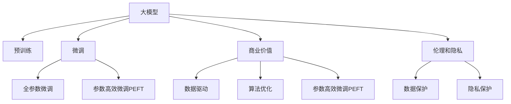

                 

# 大模型：从数据到商业价值的实现

> 关键词：大模型, 数据利用, 商业价值, 数据驱动, AI商业化, 深度学习

## 1. 背景介绍

### 1.1 问题由来
在过去的十年中，人工智能（AI）技术取得了飞速发展，尤其是深度学习和机器学习领域。其中，大模型（Big Models），如GPT-3、BERT等，以其庞大的参数量、广泛的语义理解能力和生成能力，成为当前AI技术的重要支柱。然而，尽管大模型在学术界取得了诸多突破，但在实际商业化应用中，大模型的应用效果和商业价值如何转化，始终是业界和学术界关心的焦点问题。

### 1.2 问题核心关键点
当前，大模型在商业应用中的落地效果和价值转化，主要依赖于以下核心要素：

1. **数据驱动**：大模型通过大量无标签数据进行预训练，学习到通用的语言表示。在微调阶段，进一步利用下游任务的数据，优化模型在特定任务上的性能。

2. **算法优化**：优化算法如AdamW、SGD等在大模型微调中的高效收敛能力，保证了模型在不同任务上的泛化性能。

3. **参数高效微调**：通过只微调顶层，或使用如Adapter、Prefix等参数高效技术，有效降低微调过程对计算资源的消耗，提升模型部署的灵活性。

4. **商业价值**：如何将大模型的预训练和微调能力转化为实际商业应用，需要考虑成本效益、用户体验、业务场景等多方面的因素。

5. **伦理和隐私**：在大模型商业应用中，如何保护用户隐私、避免数据滥用，也是不可忽视的重要问题。

本文将从以上几个关键点出发，系统地介绍大模型从数据到商业价值的实现路径，为AI技术的实际落地提供参考。

## 2. 核心概念与联系

### 2.1 核心概念概述

要全面理解大模型从数据到商业价值的实现过程，首先需要了解几个核心概念：

- **大模型（Big Models）**：如GPT-3、BERT等，通过在大量无标签数据上进行预训练，学习到丰富的语言表示和通用知识。

- **预训练（Pre-training）**：使用无标签数据进行自监督学习，学习到语言表示的基础能力。

- **微调（Fine-tuning）**：在大模型基础上，利用下游任务的标注数据，通过有监督学习进一步优化模型，适应特定任务需求。

- **参数高效微调（Parameter-Efficient Fine-tuning, PEFT）**：在微调过程中，只更新极少量的模型参数，保持大部分预训练参数不变，以降低计算成本。

- **商业价值（Business Value）**：通过大模型在实际业务场景中的应用，如客服、舆情监测、推荐系统等，实现业务价值最大化。

- **伦理和隐私（Ethics and Privacy）**：在数据收集、处理和使用的过程中，确保用户隐私保护和数据伦理，避免数据滥用和偏见。

这些核心概念之间通过下图的Mermaid流程图来展示，帮助读者更好地理解其联系：



此流程图展示了从大模型的预训练到微调，再到商业价值的实现，以及数据保护和隐私保护的核心环节，帮助我们理解大模型从数据到商业价值的实现路径。

## 3. 核心算法原理 & 具体操作步骤
### 3.1 算法原理概述

大模型从数据到商业价值的实现过程，本质上是从数据驱动、算法优化和参数高效微调等多个层面协同推进的。

- **数据驱动**：通过在大规模无标签数据上进行预训练，学习到语言的通用表示。
- **算法优化**：优化算法如AdamW、SGD等在微调过程中确保模型的快速收敛和泛化性能。
- **参数高效微调**：通过只更新少数参数，保持大部分预训练参数不变，降低计算成本，提高模型部署的灵活性。

### 3.2 算法步骤详解

大模型从数据到商业价值的实现步骤如下：

1. **数据准备**：收集并清洗用于预训练和微调的数据集，确保数据的质量和多样性。

2. **预训练**：使用大模型架构（如Transformer），在无标签数据上学习通用语言表示。

3. **微调**：选择适当的下游任务，利用标注数据微调模型，优化特定任务的表现。

4. **参数高效微调**：在微调过程中，只更新少量关键参数，保留大部分预训练参数不变。

5. **商业价值转化**：将微调后的模型应用到具体的商业场景中，如客服、舆情监测、推荐系统等，实现业务价值最大化。

6. **伦理和隐私保护**：确保数据收集、处理和使用的合法性和隐私保护，避免数据滥用和偏见。

### 3.3 算法优缺点

大模型从数据到商业价值的实现，具有以下优点：

1. **通用性强**：大模型在预训练阶段学习到通用的语言表示，适用于多种下游任务。
2. **泛化能力强**：微调过程中，通过有监督学习优化模型，适应特定任务。
3. **参数高效**：通过参数高效微调，降低计算成本，提升模型部署的灵活性。
4. **业务价值高**：将大模型的预训练和微调能力转化为实际商业应用，提升用户体验和业务效益。

同时，也存在以下缺点：

1. **依赖高质量数据**：预训练和微调的效果高度依赖于数据的质量和多样性。
2. **计算资源消耗大**：大模型的预训练和微调需要大量的计算资源。
3. **模型复杂度高**：大模型的结构复杂，难以解释和调试。
4. **伦理和隐私风险**：数据收集和处理过程中可能存在伦理和隐私问题。

### 3.4 算法应用领域

大模型从数据到商业价值的实现，已经在多个领域得到应用，例如：

- **自然语言处理（NLP）**：如文本分类、命名实体识别、问答系统等。
- **机器翻译**：将源语言文本翻译成目标语言。
- **语音识别和合成**：将语音转换为文本，或将文本转换为语音。
- **图像处理**：如图像分类、物体检测等。
- **推荐系统**：根据用户的历史行为和偏好，推荐合适的商品或内容。
- **金融风控**：利用大模型进行欺诈检测、信用评分等。

## 4. 数学模型和公式 & 详细讲解 & 举例说明

### 4.1 数学模型构建

大模型的从数据到商业价值的实现，涉及以下数学模型：

1. **预训练模型**：使用无标签数据进行自监督学习，构建预训练模型。
2. **微调模型**：在特定任务上，利用标注数据进行有监督学习，构建微调模型。
3. **损失函数**：定义适当的损失函数，衡量模型输出与真实标签之间的差异。

### 4.2 公式推导过程

以下以二分类任务为例，推导微调模型的损失函数及其梯度计算公式：

假设模型 $M_{\theta}$ 在输入 $x$ 上的输出为 $\hat{y}=M_{\theta}(x) \in [0,1]$，表示样本属于正类的概率。真实标签 $y \in \{0,1\}$。则二分类交叉熵损失函数定义为：

$$
\ell(M_{\theta}(x),y) = -[y\log \hat{y} + (1-y)\log (1-\hat{y})]
$$

将其代入经验风险公式，得：

$$
\mathcal{L}(\theta) = -\frac{1}{N}\sum_{i=1}^N [y_i\log M_{\theta}(x_i)+(1-y_i)\log(1-M_{\theta}(x_i))]
$$

根据链式法则，损失函数对参数 $\theta_k$ 的梯度为：

$$
\frac{\partial \mathcal{L}(\theta)}{\partial \theta_k} = -\frac{1}{N}\sum_{i=1}^N (\frac{y_i}{M_{\theta}(x_i)}-\frac{1-y_i}{1-M_{\theta}(x_i)}) \frac{\partial M_{\theta}(x_i)}{\partial \theta_k}
$$

其中 $\frac{\partial M_{\theta}(x_i)}{\partial \theta_k}$ 可进一步递归展开，利用自动微分技术完成计算。

### 4.3 案例分析与讲解

假设有一家电商平台，希望利用大模型优化其推荐系统。

- **数据准备**：收集用户的历史浏览、点击、购买等行为数据，构建训练集。
- **预训练**：使用大模型（如BERT）在无标签商品描述上学习商品表示。
- **微调**：在用户行为数据上微调大模型，学习用户兴趣表示。
- **参数高效微调**：仅更新微调过程的顶层参数，保持大部分预训练参数不变。
- **商业价值转化**：将微调后的模型应用于实时推荐系统，提升推荐效果。
- **伦理和隐私保护**：确保用户数据的合法收集和隐私保护，避免数据滥用。

## 5. 项目实践：代码实例和详细解释说明

### 5.1 开发环境搭建

以下是使用Python进行PyTorch开发的环境配置流程：

1. 安装Anaconda：从官网下载并安装Anaconda，用于创建独立的Python环境。

2. 创建并激活虚拟环境：
```bash
conda create -n pytorch-env python=3.8 
conda activate pytorch-env
```

3. 安装PyTorch：根据CUDA版本，从官网获取对应的安装命令。例如：
```bash
conda install pytorch torchvision torchaudio cudatoolkit=11.1 -c pytorch -c conda-forge
```

4. 安装Transformers库：
```bash
pip install transformers
```

5. 安装各类工具包：
```bash
pip install numpy pandas scikit-learn matplotlib tqdm jupyter notebook ipython
```

完成上述步骤后，即可在`pytorch-env`环境中开始项目实践。

### 5.2 源代码详细实现

以下是一个使用PyTorch对大模型进行推荐系统微调的示例代码：

```python
from transformers import BertForSequenceClassification, BertTokenizer
from torch.utils.data import Dataset, DataLoader
import torch

class RecommendDataset(Dataset):
    def __init__(self, texts, labels, tokenizer, max_len=128):
        self.texts = texts
        self.labels = labels
        self.tokenizer = tokenizer
        self.max_len = max_len
        
    def __len__(self):
        return len(self.texts)
    
    def __getitem__(self, item):
        text = self.texts[item]
        label = self.labels[item]
        
        encoding = self.tokenizer(text, return_tensors='pt', max_length=self.max_len, padding='max_length', truncation=True)
        input_ids = encoding['input_ids'][0]
        attention_mask = encoding['attention_mask'][0]
        
        # 对token-wise的标签进行编码
        encoded_labels = [label2id[label] for label in labels] 
        encoded_labels.extend([label2id['0']] * (self.max_len - len(encoded_labels)))
        labels = torch.tensor(encoded_labels, dtype=torch.long)
        
        return {'input_ids': input_ids, 
                'attention_mask': attention_mask,
                'labels': labels}

# 标签与id的映射
label2id = {'1': 0, '0': 1}
id2label = {v: k for k, v in label2id.items()}

# 创建dataset
tokenizer = BertTokenizer.from_pretrained('bert-base-cased')

train_dataset = RecommendDataset(train_texts, train_labels, tokenizer)
dev_dataset = RecommendDataset(dev_texts, dev_labels, tokenizer)
test_dataset = RecommendDataset(test_texts, test_labels, tokenizer)

# 定义模型和优化器
model = BertForSequenceClassification.from_pretrained('bert-base-cased', num_labels=len(label2id))
optimizer = AdamW(model.parameters(), lr=2e-5)

# 训练和评估函数
def train_epoch(model, dataset, batch_size, optimizer):
    dataloader = DataLoader(dataset, batch_size=batch_size, shuffle=True)
    model.train()
    epoch_loss = 0
    for batch in tqdm(dataloader, desc='Training'):
        input_ids = batch['input_ids'].to(device)
        attention_mask = batch['attention_mask'].to(device)
        labels = batch['labels'].to(device)
        model.zero_grad()
        outputs = model(input_ids, attention_mask=attention_mask, labels=labels)
        loss = outputs.loss
        epoch_loss += loss.item()
        loss.backward()
        optimizer.step()
    return epoch_loss / len(dataloader)

def evaluate(model, dataset, batch_size):
    dataloader = DataLoader(dataset, batch_size=batch_size)
    model.eval()
    preds, labels = [], []
    with torch.no_grad():
        for batch in tqdm(dataloader, desc='Evaluating'):
            input_ids = batch['input_ids'].to(device)
            attention_mask = batch['attention_mask'].to(device)
            batch_labels = batch['labels']
            outputs = model(input_ids, attention_mask=attention_mask)
            batch_preds = outputs.logits.argmax(dim=2).to('cpu').tolist()
            batch_labels = batch_labels.to('cpu').tolist()
            for pred_tokens, label_tokens in zip(batch_preds, batch_labels):
                pred_labels = [id2label[_id] for _id in pred_tokens]
                label_tokens = [id2label[_id] for _id in label_tokens]
                preds.append(pred_labels[:len(label_tokens)])
                labels.append(label_tokens)
                
    print(classification_report(labels, preds))
```

### 5.3 代码解读与分析

**RecommendDataset类**：
- `__init__`方法：初始化文本、标签、分词器等关键组件。
- `__len__`方法：返回数据集的样本数量。
- `__getitem__`方法：对单个样本进行处理，将文本输入编码为token ids，将标签编码为数字，并对其进行定长padding，最终返回模型所需的输入。

**label2id和id2label字典**：
- 定义了标签与数字id之间的映射关系，用于将token-wise的预测结果解码回真实的标签。

**训练和评估函数**：
- 使用PyTorch的DataLoader对数据集进行批次化加载，供模型训练和推理使用。
- 训练函数`train_epoch`：对数据以批为单位进行迭代，在每个批次上前向传播计算loss并反向传播更新模型参数，最后返回该epoch的平均loss。
- 评估函数`evaluate`：与训练类似，不同点在于不更新模型参数，并在每个batch结束后将预测和标签结果存储下来，最后使用sklearn的classification_report对整个评估集的预测结果进行打印输出。

**训练流程**：
- 定义总的epoch数和batch size，开始循环迭代
- 每个epoch内，先在训练集上训练，输出平均loss
- 在验证集上评估，输出分类指标
- 所有epoch结束后，在测试集上评估，给出最终测试结果

可以看到，PyTorch配合Transformers库使得大模型微调的代码实现变得简洁高效。开发者可以将更多精力放在数据处理、模型改进等高层逻辑上，而不必过多关注底层的实现细节。

当然，工业级的系统实现还需考虑更多因素，如模型的保存和部署、超参数的自动搜索、更灵活的任务适配层等。但核心的微调范式基本与此类似。

## 6. 实际应用场景

### 6.1 智能客服系统

大模型的推荐系统能力，可以应用于智能客服系统的构建。传统客服往往需要配备大量人力，高峰期响应缓慢，且一致性和专业性难以保证。而利用微调后的推荐系统，可以7x24小时不间断服务，快速响应客户咨询，用自然流畅的语言解答各类常见问题。

在技术实现上，可以收集企业内部的历史客服对话记录，将问题和最佳答复构建成监督数据，在此基础上对预训练推荐系统进行微调。微调后的推荐系统能够自动理解用户意图，匹配最合适的答复模板进行回复。对于客户提出的新问题，还可以接入检索系统实时搜索相关内容，动态组织生成回答。如此构建的智能客服系统，能大幅提升客户咨询体验和问题解决效率。

### 6.2 金融舆情监测

金融机构需要实时监测市场舆论动向，以便及时应对负面信息传播，规避金融风险。传统的人工监测方式成本高、效率低，难以应对网络时代海量信息爆发的挑战。基于大模型的推荐系统，可以用于金融舆情监测。

具体而言，可以收集金融领域相关的新闻、报道、评论等文本数据，并对其进行主题标注和情感标注。在此基础上对预训练语言模型进行微调，使其能够自动判断文本属于何种主题，情感倾向是正面、中性还是负面。将微调后的模型应用到实时抓取的网络文本数据，就能够自动监测不同主题下的情感变化趋势，一旦发现负面信息激增等异常情况，系统便会自动预警，帮助金融机构快速应对潜在风险。

### 6.3 个性化推荐系统

当前的推荐系统往往只依赖用户的历史行为数据进行物品推荐，无法深入理解用户的真实兴趣偏好。基于大模型微调技术的推荐系统，可以更好地挖掘用户行为背后的语义信息，从而提供更精准、多样的推荐内容。

在实践中，可以收集用户浏览、点击、评论、分享等行为数据，提取和用户交互的物品标题、描述、标签等文本内容。将文本内容作为模型输入，用户的后续行为（如是否点击、购买等）作为监督信号，在此基础上微调预训练语言模型。微调后的模型能够从文本内容中准确把握用户的兴趣点。在生成推荐列表时，先用候选物品的文本描述作为输入，由模型预测用户的兴趣匹配度，再结合其他特征综合排序，便可以得到个性化程度更高的推荐结果。

### 6.4 未来应用展望

随着大模型和微调方法的不断发展，基于微调范式将在更多领域得到应用，为传统行业带来变革性影响。

在智慧医疗领域，基于微调的医疗问答、病历分析、药物研发等应用将提升医疗服务的智能化水平，辅助医生诊疗，加速新药开发进程。

在智能教育领域，微调技术可应用于作业批改、学情分析、知识推荐等方面，因材施教，促进教育公平，提高教学质量。

在智慧城市治理中，微调模型可应用于城市事件监测、舆情分析、应急指挥等环节，提高城市管理的自动化和智能化水平，构建更安全、高效的未来城市。

此外，在企业生产、社会治理、文娱传媒等众多领域，基于大模型微调的人工智能应用也将不断涌现，为NLP技术带来全新的突破。相信随着预训练语言模型和微调方法的持续演进，NLP技术将在更广阔的应用领域大放异彩，深刻影响人类的生产生活方式。

## 7. 工具和资源推荐

### 7.1 学习资源推荐

为了帮助开发者系统掌握大模型微调的理论基础和实践技巧，这里推荐一些优质的学习资源：

1. 《Transformer from Understanding to Practical》系列博文：由大模型技术专家撰写，深入浅出地介绍了Transformer原理、BERT模型、微调技术等前沿话题。

2. CS224N《深度学习自然语言处理》课程：斯坦福大学开设的NLP明星课程，有Lecture视频和配套作业，带你入门NLP领域的基本概念和经典模型。

3. 《Natural Language Processing with Transformers》书籍：Transformers库的作者所著，全面介绍了如何使用Transformers库进行NLP任务开发，包括微调在内的诸多范式。

4. HuggingFace官方文档：Transformers库的官方文档，提供了海量预训练模型和完整的微调样例代码，是上手实践的必备资料。

5. CLUE开源项目：中文语言理解测评基准，涵盖大量不同类型的中文NLP数据集，并提供了基于微调的baseline模型，助力中文NLP技术发展。

通过对这些资源的学习实践，相信你一定能够快速掌握大模型微调的精髓，并用于解决实际的NLP问题。

### 7.2 开发工具推荐

高效的开发离不开优秀的工具支持。以下是几款用于大模型微调开发的常用工具：

1. PyTorch：基于Python的开源深度学习框架，灵活动态的计算图，适合快速迭代研究。大部分预训练语言模型都有PyTorch版本的实现。

2. TensorFlow：由Google主导开发的开源深度学习框架，生产部署方便，适合大规模工程应用。同样有丰富的预训练语言模型资源。

3. Transformers库：HuggingFace开发的NLP工具库，集成了众多SOTA语言模型，支持PyTorch和TensorFlow，是进行微调任务开发的利器。

4. Weights & Biases：模型训练的实验跟踪工具，可以记录和可视化模型训练过程中的各项指标，方便对比和调优。与主流深度学习框架无缝集成。

5. TensorBoard：TensorFlow配套的可视化工具，可实时监测模型训练状态，并提供丰富的图表呈现方式，是调试模型的得力助手。

6. Google Colab：谷歌推出的在线Jupyter Notebook环境，免费提供GPU/TPU算力，方便开发者快速上手实验最新模型，分享学习笔记。

合理利用这些工具，可以显著提升大模型微调任务的开发效率，加快创新迭代的步伐。

### 7.3 相关论文推荐

大模型和微调技术的发展源于学界的持续研究。以下是几篇奠基性的相关论文，推荐阅读：

1. Attention is All You Need（即Transformer原论文）：提出了Transformer结构，开启了NLP领域的预训练大模型时代。

2. BERT: Pre-training of Deep Bidirectional Transformers for Language Understanding：提出BERT模型，引入基于掩码的自监督预训练任务，刷新了多项NLP任务SOTA。

3. Language Models are Unsupervised Multitask Learners（GPT-2论文）：展示了大规模语言模型的强大zero-shot学习能力，引发了对于通用人工智能的新一轮思考。

4. Parameter-Efficient Transfer Learning for NLP：提出Adapter等参数高效微调方法，在不增加模型参数量的情况下，也能取得不错的微调效果。

5. Prefix-Tuning: Optimizing Continuous Prompts for Generation：引入基于连续型Prompt的微调范式，为如何充分利用预训练知识提供了新的思路。

6. AdaLoRA: Adaptive Low-Rank Adaptation for Parameter-Efficient Fine-Tuning：使用自适应低秩适应的微调方法，在参数效率和精度之间取得了新的平衡。

这些论文代表了大模型微调技术的发展脉络。通过学习这些前沿成果，可以帮助研究者把握学科前进方向，激发更多的创新灵感。

## 8. 总结：未来发展趋势与挑战

### 8.1 总结

本文对基于大模型的推荐系统从数据到商业价值的实现进行了全面系统的介绍。首先阐述了数据驱动、算法优化、参数高效微调、商业价值转化等关键要素，明确了大模型在实际应用中的核心价值。其次，从原理到实践，详细讲解了推荐系统的数学模型和算法步骤，给出了完整的代码实现，并针对实际应用场景进行了系统分析。同时，本文还推荐了相关的学习资源和开发工具，为读者提供了全面的技术指引。

通过本文的系统梳理，可以看到，大模型微调技术在大规模推荐系统中的应用，不仅提升了推荐效果，还显著降低了成本，实现了商业价值的最大化。未来，随着预训练语言模型和微调方法的不断发展，基于微调范式将在更多领域得到应用，为传统行业带来变革性影响。

### 8.2 未来发展趋势

展望未来，大模型微调技术将呈现以下几个发展趋势：

1. **多模态融合**：推荐系统将更加注重多模态数据的融合，如文本、图像、视频等，提高系统理解能力和推荐效果。

2. **个性化推荐**：推荐系统将更加注重个性化推荐，根据用户的多维度行为和偏好，提供更加精准和个性化的推荐内容。

3. **实时性要求提升**：实时性将成为推荐系统的重要指标，需要在大模型微调过程中进行优化，以支持实时推荐。

4. **模型压缩和优化**：随着模型规模的不断增大，模型压缩和优化将成为推荐系统发展的必然趋势，以提升模型的部署效率和计算速度。

5. **数据隐私保护**：数据隐私保护将成为推荐系统的重要保障，需要在大模型微调过程中进行优化，以确保用户数据的隐私安全。

6. **业务场景扩展**：推荐系统将进一步扩展到更多业务场景，如医疗、教育、金融等，为用户提供更多价值。

### 8.3 面临的挑战

尽管大模型微调技术已经取得了显著进展，但在实际应用中，仍面临以下挑战：

1. **数据质量问题**：推荐系统的效果高度依赖于数据的质量和多样性，如何确保数据的准确性和代表性，是一个重要问题。

2. **计算资源消耗**：大模型的预训练和微调需要大量的计算资源，如何在资源受限的情况下进行优化，是一个重要挑战。

3. **算法复杂度**：推荐系统算法复杂度高，如何简化算法，提高算法效率，是一个重要问题。

4. **业务场景适配**：推荐系统需要在不同业务场景中进行适配，如何实现跨场景的通用化和定制化，是一个重要挑战。

5. **用户隐私保护**：推荐系统需要保护用户隐私，避免数据滥用，是一个重要问题。

6. **系统稳定性**：推荐系统需要保证系统稳定性和鲁棒性，避免模型过拟合和参数不稳定性，是一个重要问题。

### 8.4 研究展望

面对大模型微调技术面临的挑战，未来的研究需要在以下几个方面寻求新的突破：

1. **数据增强和质量控制**：探索更多数据增强方法，提高数据质量和多样性。

2. **计算资源优化**：开发更高效的模型压缩和优化技术，降低计算成本。

3. **算法简化和优化**：简化推荐算法，提高算法效率。

4. **跨场景适配**：实现跨场景的通用化和定制化，提高系统适配性。

5. **用户隐私保护**：开发更加安全可靠的数据保护技术，确保用户隐私安全。

6. **系统稳定性提升**：提高模型稳定性和鲁棒性，确保系统稳定性。

这些研究方向的探索，必将引领大模型微调技术迈向更高的台阶，为推荐系统的发展提供新动力。面向未来，大模型微调技术还需要与其他人工智能技术进行更深入的融合，如知识表示、因果推理、强化学习等，多路径协同发力，共同推动推荐系统的发展和进步。只有勇于创新、敢于突破，才能不断拓展推荐系统的边界，让智能技术更好地造福人类社会。

## 9. 附录：常见问题与解答

**Q1：如何评估大模型的推荐效果？**

A: 评估大模型的推荐效果通常采用以下几个指标：

1. **准确率（Accuracy）**：推荐系统预测的准确性，即推荐结果与真实结果相符的比例。

2. **召回率（Recall）**：推荐系统能够覆盖用户兴趣的全面性，即推荐结果中包含真实兴趣的比例。

3. **F1值（F1 Score）**：准确率和召回率的综合指标，用于评估推荐系统的整体效果。

4. **平均推荐数（Average Recommendations）**：每个用户接收到的推荐数量，用于评估推荐系统的覆盖能力。

5. **用户满意度（User Satisfaction）**：用户对推荐结果的满意度，通常通过用户反馈或行为数据进行评估。

6. **多样性（Diversity）**：推荐结果的多样性，避免重复推荐同一类内容，提升用户体验。

7. **新颖性（Novelty）**：推荐结果的创新性，避免推荐用户已经尝试过的内容，提升用户探索欲望。

这些指标可以帮助评估大模型的推荐效果，选择合适的推荐策略和模型。

**Q2：如何选择合适的大模型进行微调？**

A: 选择合适的大模型进行微调，需要考虑以下几个方面：

1. **任务类型**：不同任务类型适合不同的大模型。例如，文本分类适合BERT，问答适合GPT-3。

2. **数据规模**：大数据集适合预训练后的大模型，小数据集适合预训练-微调（Transfer Learning）的方法。

3. **计算资源**：计算资源丰富的场景适合使用大模型，资源受限的场景可以考虑使用参数高效微调（Parameter-Efficient Fine-tuning）技术。

4. **模型性能**：选择已有研究成果中性能最好的大模型，避免重复研究。

5. **应用场景**：根据具体应用场景选择合适的大模型，确保模型能够满足业务需求。

**Q3：在微调过程中如何避免过拟合？**

A: 在微调过程中，避免过拟合可以采取以下措施：

1. **数据增强**：通过回译、近义替换等方式扩充训练集，增加数据的多样性。

2. **正则化**：使用L2正则、Dropout、Early Stopping等技术，防止模型过度适应小规模训练集。

3. **对抗训练**：引入对抗样本，提高模型的鲁棒性，减少过拟合风险。

4. **参数高效微调**：通过只微调顶层，或使用如Adapter、Prefix等参数高效技术，保持大部分预训练参数不变，降低过拟合风险。

5. **多模型集成**：训练多个微调模型，取平均输出，抑制过拟合。

6. **学习率调度**：使用学习率衰减策略，逐渐降低学习率，避免模型过早收敛。

这些措施可以结合使用，根据具体任务和数据特点进行优化，以最大限度地避免过拟合。

**Q4：如何在商业应用中保护用户隐私？**

A: 在商业应用中保护用户隐私，可以采取以下措施：

1. **数据匿名化**：对用户数据进行匿名化处理，确保用户身份无法识别。

2. **数据加密**：对数据进行加密存储和传输，防止数据泄露。

3. **访问控制**：限制数据访问权限，确保只有授权人员可以访问用户数据。

4. **隐私保护算法**：使用差分隐私、联邦学习等隐私保护算法，确保数据隐私不被滥用。

5. **合规性审查**：定期进行合规性审查，确保数据使用符合法律法规要求。

6. **用户透明度**：提高用户对数据使用和保护的透明度，让用户了解数据的使用情况和保护措施。

这些措施可以结合使用，确保在商业应用中保护用户隐私，建立用户信任。

**Q5：大模型微调的计算资源如何优化？**

A: 优化大模型微调的计算资源，可以采取以下措施：

1. **模型压缩和剪枝**：使用模型压缩、剪枝等技术，减少模型参数量和计算量。

2. **模型并行**：使用模型并行技术，将模型分布在多个GPU/TPU上，提高计算效率。

3. **梯度累加**：使用梯度累加技术，减小计算图大小，提高计算效率。

4. **混合精度训练**：使用混合精度训练技术，减少计算量和内存占用，提高训练速度。

5. **自动混合精度（AMP）**：使用自动混合精度（Automatic Mixed Precision, AMP）技术，自动调整张量精度，提高计算效率。

6. **异构计算**：使用异构计算技术，将计算任务分配到不同硬件上，提高计算效率。

这些措施可以结合使用，优化大模型微调的计算资源，提升模型训练和推理速度。

**Q6：如何实现跨场景的通用化和定制化？**

A: 实现跨场景的通用化和定制化，可以采取以下措施：

1. **模型迁移学习**：在新的场景中使用迁移学习技术，利用已有模型的知识和经验。

2. **自适应微调**：在新的场景中进行自适应微调，根据新数据和新需求调整模型。

3. **多任务学习**：在新的场景中进行多任务学习，同时学习多个任务的共同特征和差异特征。

4. **知识图谱融合**：将外部知识图谱与模型融合，增强模型的知识表示能力。

5. **领域适应**：根据新场景的特点，调整模型的架构和参数，实现领域适应。

6. **模型重构**：根据新场景的需求，重构模型的结构，提升模型的适应性。

这些措施可以结合使用，实现跨场景的通用化和定制化，提升模型的泛化能力和适用性。

---

作者：禅与计算机程序设计艺术 / Zen and the Art of Computer Programming

