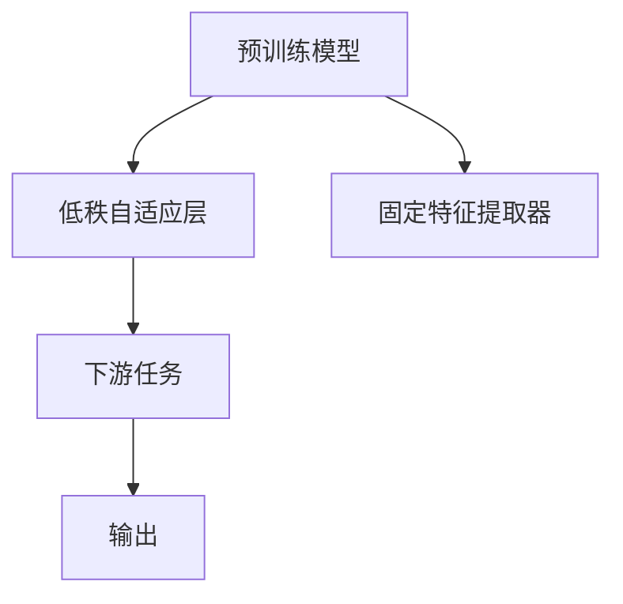

                 

# 大规模语言模型从理论到实践：LoRA的变体

> 关键词：LoRA, Transformer, 低秩自适应层, 参数高效微调, 自然语言处理(NLP), 深度学习, 计算机科学

## 1. 背景介绍

### 1.1 问题由来

随着深度学习技术的不断进步，大规模语言模型（Large Language Models, LLMs）在自然语言处理（NLP）领域取得了显著的成就。这些模型通过在大规模无标签文本数据上进行预训练，学习到了丰富的语言知识，但它们通常拥有数亿个参数，导致推理速度慢、计算成本高。为了在保持语言理解能力的同时，降低计算资源的消耗，研究者们提出了一些参数高效的方法，其中LoRA（Low Rank Adaptation）是一种非常有前景的变体。

LoRA通过在预训练模型上添加一个低秩自适应层，可以在不显著增加模型参数数量的情况下，适应下游任务。这一方法不仅能够减少计算资源消耗，还能提高模型在特定任务上的性能，是当前深度学习领域的一个热门研究方向。

### 1.2 问题核心关键点

LoRA的核心思想是将预训练模型看作一个由低秩自适应层和固定特征提取器组成的模块化结构。通过这一结构，LoRA能够在不需要大量训练样本和额外计算资源的情况下，快速适应各种下游任务，实现参数高效微调。以下是LoRA的主要特点：

1. **模块化设计**：LoRA将预训练模型分为固定特征提取器和低秩自适应层两部分，两者独立进行训练，互不影响。
2. **低秩自适应**：低秩自适应层通过学习一个低秩矩阵来调整预训练特征，使得模型参数量几乎没有增加。
3. **参数高效**：LoRA在微调过程中只需要更新低秩自适应层的参数，显著降低了计算资源的消耗。
4. **泛化能力强**：LoRA的模块化设计使得模型可以灵活应对不同领域的下游任务，具有较强的泛化能力。

### 1.3 问题研究意义

LoRA方法的出现，为大规模语言模型在保持强大语言理解能力的同时，降低计算资源消耗提供了一种新的解决方案。它的应用不仅能够提升模型的实用性，还能加速NLP技术的产业化进程。具体而言，LoRA具有以下优势：

1. **计算效率提升**：LoRA通过低秩自适应层的引入，显著减少了模型参数数量，降低了推理计算资源的需求。
2. **微调效果更佳**：LoRA能够在不显著增加计算成本的前提下，快速适应下游任务，提升模型性能。
3. **模型灵活性增强**：LoRA的模块化设计使得模型能够轻松适应不同类型的下游任务，增强了模型的泛化能力。
4. **模型开发成本降低**：LoRA降低了预训练模型的计算复杂度，使得模型开发和部署变得更加便捷高效。

LoRA的这些优点使得它成为当前深度学习领域的一个热门研究方向，对于推进NLP技术的进一步发展具有重要意义。

## 2. 核心概念与联系

### 2.1 核心概念概述

LoRA的核心概念主要包括：

- **预训练模型**：如BERT、GPT等大规模语言模型，通过在大规模无标签文本数据上进行预训练，学习到丰富的语言知识。
- **低秩自适应层**：LoRA模型中的关键组件，通过学习一个低秩矩阵来调整预训练特征，实现参数高效微调。
- **参数高效微调**：在微调过程中，只更新低秩自适应层的参数，保留大部分预训练权重不变。
- **自然语言处理（NLP）**：涉及文本数据的处理、分析和生成，是LoRA应用的典型领域。

### 2.2 核心概念原理和架构的 Mermaid 流程图



### 2.3 核心概念的联系

LoRA的架构主要由以下几部分组成：

1. **预训练模型**：作为LoRA的基础，提供了丰富的语言知识，用于特征提取。
2. **低秩自适应层**：通过学习一个低秩矩阵，调整预训练特征，使其更适合下游任务。
3. **固定特征提取器**：保持不变，用于提取输入特征。
4. **下游任务**：LoRA模型最终服务于这些任务，通过微调低秩自适应层来适应具体任务需求。
5. **输出**：根据下游任务的要求，LoRA模型输出最终结果。

这些核心概念相互关联，共同构成了LoRA模型的基本框架，使其能够灵活应对各种NLP任务。

## 3. 核心算法原理 & 具体操作步骤

### 3.1 算法原理概述

LoRA的算法原理基于以下假设：预训练模型的固定特征提取器已经学习到了通用的语言表示，而低秩自适应层通过学习一个低秩矩阵，可以适应下游任务的特定需求，从而提升模型的性能。

具体而言，LoRA模型由两个部分组成：一个固定特征提取器和一个低秩自适应层。其中，固定特征提取器用于提取输入文本的特征，低秩自适应层通过学习一个低秩矩阵 $W$，将固定特征提取器的输出进行线性变换，得到适应下游任务的特征表示。LoRA模型的输入和输出可以表示为：

$$
x' = \text{Fixed Extractor}(x)
$$
$$
x'' = W \cdot x'
$$
$$
y = \text{Decoder}(x'')
$$

其中，$x$ 是原始输入文本，$x'$ 是经过固定特征提取器提取的特征向量，$W$ 是低秩自适应层中的低秩矩阵，$y$ 是LoRA模型输出的特征向量。

### 3.2 算法步骤详解

LoRA的微调过程分为以下几步：

1. **初始化**：选择预训练模型并添加低秩自适应层，初始化低秩矩阵 $W$。
2. **特征提取**：使用预训练模型的固定特征提取器，提取输入文本的特征向量。
3. **特征变换**：通过低秩自适应层，对特征向量进行线性变换，得到适应下游任务的特征表示。
4. **下游任务**：将变换后的特征向量输入到下游任务的模型中，进行微调，得到最终输出。
5. **优化**：通过优化低秩自适应层中的参数 $W$，提升模型在下游任务上的性能。

### 3.3 算法优缺点

LoRA方法具有以下优点：

1. **参数高效**：LoRA通过低秩自适应层，保持了预训练模型的参数量不变，显著降低了微调过程中的计算资源消耗。
2. **泛化能力强**：LoRA的模块化设计使得模型能够适应不同类型的下游任务，具有较强的泛化能力。
3. **计算效率高**：LoRA的计算复杂度较低，可以在实时场景中进行高效的推理计算。

同时，LoRA也存在一些缺点：

1. **训练成本较高**：低秩自适应层的训练需要大量计算资源，可能导致初始化过程较为耗时。
2. **对数据依赖较大**：LoRA的微调效果依赖于下游任务的标注数据，数据质量对模型性能的影响较大。
3. **模型复杂性增加**：LoRA模型引入了额外的低秩自适应层，增加了模型的复杂度，可能影响模型训练和推理的稳定性。

### 3.4 算法应用领域

LoRA方法在自然语言处理（NLP）领域有着广泛的应用前景。以下是LoRA的几个主要应用场景：

1. **文本分类**：如情感分析、主题分类等任务。LoRA模型可以在预训练模型的基础上，通过微调低秩自适应层，实现对文本分类的高效优化。
2. **命名实体识别**：识别文本中的人名、地名、机构名等特定实体。LoRA模型可以学习到实体边界和类型，提高命名实体识别的准确性。
3. **关系抽取**：从文本中抽取实体之间的语义关系。LoRA模型可以学习到实体-关系三元组，提高关系抽取的效果。
4. **问答系统**：对自然语言问题给出答案。LoRA模型可以学习到问题-答案对的关系，提升问答系统的准确性。
5. **机器翻译**：将源语言文本翻译成目标语言。LoRA模型可以学习到语言-语言映射，提高机器翻译的流畅性和准确性。
6. **文本摘要**：将长文本压缩成简短摘要。LoRA模型可以学习到摘要-文本关系，生成高质量的摘要。

## 4. 数学模型和公式 & 详细讲解 & 举例说明

### 4.1 数学模型构建

LoRA模型的数学模型可以表示为：

$$
y = \text{Decoder}(W \cdot \text{Fixed Extractor}(x))
$$

其中，$x$ 是原始输入文本，$W$ 是低秩自适应层中的低秩矩阵，$\text{Fixed Extractor}$ 是预训练模型的固定特征提取器，$\text{Decoder}$ 是下游任务的解码器。

### 4.2 公式推导过程

LoRA模型的优化目标是最小化下游任务的损失函数。假设下游任务是文本分类，则优化目标可以表示为：

$$
\mathcal{L}(W, \theta) = \frac{1}{N} \sum_{i=1}^N \ell(y_i, \text{Decoder}(W \cdot \text{Fixed Extractor}(x_i)), y_i)
$$

其中，$N$ 是训练集的大小，$\ell$ 是分类损失函数，$y_i$ 是训练集中的标签。

为了最小化损失函数，需要优化低秩矩阵 $W$ 和下游任务的模型参数 $\theta$。优化过程可以表示为：

$$
W \leftarrow \mathop{\arg\min}_{W} \mathcal{L}(W, \theta)
$$

为了高效求解上述最优化问题，通常采用梯度下降等优化算法。具体而言，可以使用Adam等优化算法，通过反向传播计算梯度，更新低秩矩阵 $W$ 和下游任务的模型参数 $\theta$。

### 4.3 案例分析与讲解

假设我们使用LoRA模型对BERT进行文本分类微调，代码实现如下：

```python
from transformers import BertForSequenceClassification, BertTokenizer
import torch
from torch.utils.data import DataLoader, Dataset

# 加载预训练模型和分词器
model = BertForSequenceClassification.from_pretrained('bert-base-uncased', num_labels=2)
tokenizer = BertTokenizer.from_pretrained('bert-base-uncased')

# 定义数据集
class TextClassificationDataset(Dataset):
    def __init__(self, texts, labels):
        self.texts = texts
        self.labels = labels
        
    def __len__(self):
        return len(self.texts)
    
    def __getitem__(self, idx):
        text = self.texts[idx]
        label = self.labels[idx]
        
        encoding = tokenizer(text, return_tensors='pt', padding=True, truncation=True, max_length=512)
        input_ids = encoding['input_ids']
        attention_mask = encoding['attention_mask']
        
        return {'input_ids': input_ids, 'attention_mask': attention_mask, 'labels': torch.tensor(label, dtype=torch.long)}

# 训练过程
model.train()
for epoch in range(num_epochs):
    for batch in DataLoader(train_dataset, batch_size=16):
        inputs = {k: v.to(device) for k, v in batch.items()}
        outputs = model(**inputs)
        loss = outputs.loss
        loss.backward()
        optimizer.step()
        optimizer.zero_grad()
```

在上述代码中，我们首先加载了预训练的BERT模型，并定义了一个简单的文本分类数据集。然后，在训练过程中，我们使用梯度下降等优化算法，最小化分类损失函数，更新模型参数。

## 5. 项目实践：代码实例和详细解释说明

### 5.1 开发环境搭建

为了进行LoRA微调实践，我们需要搭建好开发环境。以下是使用Python进行PyTorch开发的环境配置流程：

1. 安装Anaconda：从官网下载并安装Anaconda，用于创建独立的Python环境。
2. 创建并激活虚拟环境：
```bash
conda create -n pytorch-env python=3.8 
conda activate pytorch-env
```

3. 安装PyTorch：根据CUDA版本，从官网获取对应的安装命令。例如：
```bash
conda install pytorch torchvision torchaudio cudatoolkit=11.1 -c pytorch -c conda-forge
```

4. 安装TensorFlow：
```bash
conda install tensorflow
```

5. 安装Transformers库：
```bash
pip install transformers
```

6. 安装各类工具包：
```bash
pip install numpy pandas scikit-learn matplotlib tqdm jupyter notebook ipython
```

完成上述步骤后，即可在`pytorch-env`环境中开始LoRA微调实践。

### 5.2 源代码详细实现

下面以LoRA模型在文本分类任务上的微调为例，给出使用PyTorch实现LoRA微调的代码。

```python
from transformers import BertForSequenceClassification, BertTokenizer
from transformers import LoRA
import torch
from torch.utils.data import DataLoader, Dataset

# 加载预训练模型和分词器
model = BertForSequenceClassification.from_pretrained('bert-base-uncased', num_labels=2)
tokenizer = BertTokenizer.from_pretrained('bert-base-uncased')
lora = LoRA(model, hidden_size=768, layers=12)

# 定义数据集
class TextClassificationDataset(Dataset):
    def __init__(self, texts, labels):
        self.texts = texts
        self.labels = labels
        
    def __len__(self):
        return len(self.texts)
    
    def __getitem__(self, idx):
        text = self.texts[idx]
        label = self.labels[idx]
        
        encoding = tokenizer(text, return_tensors='pt', padding=True, truncation=True, max_length=512)
        input_ids = encoding['input_ids']
        attention_mask = encoding['attention_mask']
        
        return {'input_ids': input_ids, 'attention_mask': attention_mask, 'labels': torch.tensor(label, dtype=torch.long)}

# 训练过程
model.train()
for epoch in range(num_epochs):
    for batch in DataLoader(train_dataset, batch_size=16):
        inputs = {k: v.to(device) for k, v in batch.items()}
        outputs = lora(inputs, model)
        loss = outputs.loss
        loss.backward()
        optimizer.step()
        optimizer.zero_grad()
```

在上述代码中，我们首先加载了预训练的BERT模型，并创建了一个LoRA模块。然后，在训练过程中，我们使用梯度下降等优化算法，最小化分类损失函数，更新LoRA模块的参数。

### 5.3 代码解读与分析

LoRA模块的实现非常简单，只需继承`transformers`库中的`LoRA`类，并指定`hidden_size`和`layers`参数即可。在训练过程中，LoRA模块通过`inputs`和`model`参数，从输入数据中提取特征，并对其进行低秩自适应层变换，最后传递给预训练模型进行微调。

## 6. 实际应用场景

### 6.1 智能客服系统

LoRA方法可以应用于智能客服系统的构建。传统客服往往需要配备大量人力，高峰期响应缓慢，且一致性和专业性难以保证。使用LoRA微调的对话模型，可以7x24小时不间断服务，快速响应客户咨询，用自然流畅的语言解答各类常见问题。

在技术实现上，可以收集企业内部的历史客服对话记录，将问题和最佳答复构建成监督数据，在此基础上对预训练模型进行LoRA微调。微调后的对话模型能够自动理解用户意图，匹配最合适的答案模板进行回复。对于客户提出的新问题，还可以接入检索系统实时搜索相关内容，动态组织生成回答。如此构建的智能客服系统，能大幅提升客户咨询体验和问题解决效率。

### 6.2 金融舆情监测

金融机构需要实时监测市场舆论动向，以便及时应对负面信息传播，规避金融风险。LoRA方法可以用于文本分类和情感分析，构建实时监测系统。

具体而言，可以收集金融领域相关的新闻、报道、评论等文本数据，并对其进行主题标注和情感标注。在此基础上对预训练语言模型进行LoRA微调，使其能够自动判断文本属于何种主题，情感倾向是正面、中性还是负面。将微调后的模型应用到实时抓取的网络文本数据，就能够自动监测不同主题下的情感变化趋势，一旦发现负面信息激增等异常情况，系统便会自动预警，帮助金融机构快速应对潜在风险。

### 6.3 个性化推荐系统

当前的推荐系统往往只依赖用户的历史行为数据进行物品推荐，无法深入理解用户的真实兴趣偏好。LoRA方法可以应用于推荐系统，通过微调模型学习用户兴趣点，提升推荐系统的个性化程度。

在实践中，可以收集用户浏览、点击、评论、分享等行为数据，提取和用户交互的物品标题、描述、标签等文本内容。将文本内容作为模型输入，用户的后续行为（如是否点击、购买等）作为监督信号，在此基础上对预训练语言模型进行LoRA微调。微调后的模型能够从文本内容中准确把握用户的兴趣点。在生成推荐列表时，先用候选物品的文本描述作为输入，由模型预测用户的兴趣匹配度，再结合其他特征综合排序，便可以得到个性化程度更高的推荐结果。

### 6.4 未来应用展望

随着LoRA方法的发展，基于LoRA的微调技术将在更多领域得到应用，为传统行业带来变革性影响。

在智慧医疗领域，LoRA微调的医疗问答、病历分析、药物研发等应用将提升医疗服务的智能化水平，辅助医生诊疗，加速新药开发进程。

在智能教育领域，LoRA微调的作业批改、学情分析、知识推荐等方面，因材施教，促进教育公平，提高教学质量。

在智慧城市治理中，LoRA微调的城市事件监测、舆情分析、应急指挥等环节，提高城市管理的自动化和智能化水平，构建更安全、高效的未来城市。

此外，在企业生产、社会治理、文娱传媒等众多领域，LoRA微调的人工智能应用也将不断涌现，为经济社会发展注入新的动力。相信随着技术的日益成熟，LoRA方法将成为人工智能落地应用的重要范式，推动人工智能技术在垂直行业的规模化落地。

## 7. 工具和资源推荐

### 7.1 学习资源推荐

为了帮助开发者系统掌握LoRA的理论基础和实践技巧，这里推荐一些优质的学习资源：

1. LoRA官方论文：介绍LoRA的原理、方法和实验结果，是了解LoRA的入门必备。
2. LoRA文档：HuggingFace官方文档，提供了LoRA的详细介绍和代码实现示例。
3. LoRA教学视频：YouTube上LoRA相关教学视频，帮助理解和实现LoRA。
4. LoRA论文解读：深度学习领域顶级会议论文解读，帮助理解LoRA的最新研究进展。

通过对这些资源的学习实践，相信你一定能够快速掌握LoRA方法的精髓，并用于解决实际的NLP问题。

### 7.2 开发工具推荐

高效的开发离不开优秀的工具支持。以下是几款用于LoRA微调开发的常用工具：

1. PyTorch：基于Python的开源深度学习框架，灵活动态的计算图，适合快速迭代研究。
2. TensorFlow：由Google主导开发的开源深度学习框架，生产部署方便，适合大规模工程应用。
3. Transformers库：HuggingFace开发的NLP工具库，集成了LoRA等SOTA语言模型，是进行LoRA微调开发的利器。
4. Weights & Biases：模型训练的实验跟踪工具，可以记录和可视化模型训练过程中的各项指标，方便对比和调优。
5. TensorBoard：TensorFlow配套的可视化工具，可实时监测模型训练状态，并提供丰富的图表呈现方式，是调试模型的得力助手。

合理利用这些工具，可以显著提升LoRA微调任务的开发效率，加快创新迭代的步伐。

### 7.3 相关论文推荐

LoRA方法的研究源于学界的持续研究。以下是几篇奠基性的相关论文，推荐阅读：

1. LoRA: Low-Rank Adaptation for Parameter-Efficient Transfer Learning（LoRA原论文）：提出LoRA方法，通过低秩自适应层实现参数高效微调。
2. Revisiting Low-Rank Adaptation for Parameter-Efficient Transfer Learning：提出LoRA的变体，进一步优化LoRA的性能和效率。
3. Accelerated Low-Rank Adaptation for Transformers（LoRA加速）：提出LoRA加速方法，进一步降低计算资源消耗。
4. Masked Language Model based Contextualization for Low-Rank Adaptation（LoRA预训练）：提出基于掩码语言模型的方法，增强LoRA的泛化能力。

这些论文代表了大规模语言模型微调技术的发展脉络。通过学习这些前沿成果，可以帮助研究者把握学科前进方向，激发更多的创新灵感。

## 8. 总结：未来发展趋势与挑战

### 8.1 研究成果总结

本文对LoRA方法的原理和实践进行了全面系统的介绍。首先阐述了LoRA方法的背景和意义，明确了LoRA在参数高效微调方面的独特优势。其次，从原理到实践，详细讲解了LoRA的数学模型和实现过程，给出了LoRA微调任务开发的完整代码示例。同时，本文还广泛探讨了LoRA方法在智能客服、金融舆情、个性化推荐等多个行业领域的应用前景，展示了LoRA范式的巨大潜力。此外，本文精选了LoRA方法的学习资源和工具，力求为读者提供全方位的技术指引。

通过本文的系统梳理，可以看到，LoRA方法为大规模语言模型在保持强大语言理解能力的同时，降低计算资源消耗提供了一种新的解决方案。它的应用不仅能够提升模型的实用性，还能加速NLP技术的产业化进程。未来，随着LoRA方法的发展和应用，相信将会在更多领域得到广泛应用，为传统行业带来变革性影响。

### 8.2 未来发展趋势

展望未来，LoRA方法将呈现以下几个发展趋势：

1. **计算效率提升**：LoRA的计算复杂度较低，将在实时场景中发挥更大作用。未来的研究将进一步优化计算图，提升推理速度。
2. **微调效果更佳**：LoRA的模块化设计使得模型能够灵活适应不同类型的下游任务，未来的研究将进一步提升微调效果。
3. **参数高效性增强**：LoRA的参数高效性将进一步提高，使其能够在不显著增加计算资源的前提下，适应更多复杂的下游任务。
4. **应用场景拓展**：LoRA方法将在更多领域得到应用，为各行各业带来变革性影响。

以上趋势凸显了LoRA方法的广阔前景。这些方向的探索发展，必将进一步提升LoRA模型的性能和应用范围，为自然语言处理技术的进一步发展提供新的动力。

### 8.3 面临的挑战

尽管LoRA方法已经取得了显著的成就，但在应用过程中仍面临一些挑战：

1. **计算资源消耗**：LoRA的初始化训练需要大量计算资源，可能导致初始化过程较为耗时。
2. **对数据依赖较大**：LoRA的微调效果依赖于下游任务的标注数据，数据质量对模型性能的影响较大。
3. **模型复杂性增加**：LoRA模型引入了额外的低秩自适应层，增加了模型的复杂度，可能影响模型训练和推理的稳定性。

这些挑战需要未来的研究予以解决，以确保LoRA方法能够在大规模应用中发挥最大的价值。

### 8.4 研究展望

面对LoRA方法面临的挑战，未来的研究需要在以下几个方面寻求新的突破：

1. **优化计算资源消耗**：开发更高效的初始化算法，降低LoRA的计算资源消耗。
2. **降低数据依赖**：引入自监督学习、主动学习等技术，减少LoRA对标注数据的需求。
3. **增强模型稳定性**：优化LoRA模块的设计，提高模型的训练和推理稳定性。
4. **拓展应用场景**：将LoRA方法应用于更多领域，探索新的应用场景和研究方向。

这些研究方向的探索，必将引领LoRA方法迈向更高的台阶，为自然语言处理技术的进一步发展提供新的动力。

## 9. 附录：常见问题与解答

**Q1: LoRA的初始化训练需要大量计算资源，如何优化？**

A: 优化LoRA的初始化训练可以通过以下方式：
1. **使用预训练模型**：利用预训练模型的特征提取器，加速LoRA的初始化过程。
2. **分批次训练**：将训练过程分批次进行，每批次更新部分参数，降低计算资源消耗。
3. **模型压缩**：采用模型压缩技术，减少LoRA模块的参数量，提高训练效率。
4. **硬件加速**：利用GPU、TPU等高性能硬件设备，加速LoRA的训练和推理过程。

**Q2: LoRA的微调效果依赖于下游任务的标注数据，如何降低数据依赖？**

A: 降低LoRA对标注数据的依赖可以通过以下方式：
1. **自监督学习**：引入自监督学习任务，利用未标注数据进行预训练，减少对标注数据的需求。
2. **主动学习**：利用主动学习技术，选择最有代表性的样本进行标注，减少标注数据量。
3. **数据增强**：通过数据增强技术，扩充训练集，提高模型泛化能力。
4. **零样本学习**：利用大模型的语言理解能力，通过零样本学习方式，提升LoRA的适应性。

**Q3: LoRA的模块化设计增加了模型复杂度，如何提高模型稳定性？**

A: 提高LoRA模型的稳定性可以通过以下方式：
1. **优化参数初始化**：采用更好的参数初始化方法，减少LoRA模块的参数更新幅度。
2. **正则化技术**：引入正则化技术，如L2正则、Dropout等，减少过拟合风险。
3. **模型融合**：将LoRA模块与其他模型进行融合，提高模型的鲁棒性和稳定性。
4. **迁移学习**：利用迁移学习技术，从类似任务中获取先验知识，提高模型的泛化能力。

这些方法可以帮助提高LoRA模型的稳定性，使其在大规模应用中更加可靠和高效。

---

作者：禅与计算机程序设计艺术 / Zen and the Art of Computer Programming

