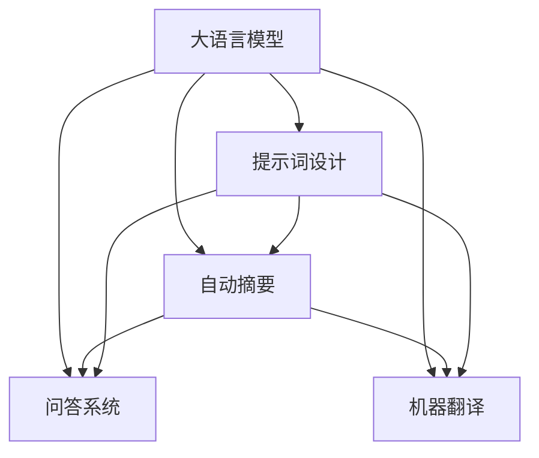

                 

# 大语言模型原理与工程实践：提示词设计的通用原则

> 关键词：大语言模型,提示词设计,自然语言处理,NLP,自动摘要,问答系统,机器翻译

## 1. 背景介绍

### 1.1 问题由来
大语言模型（Large Language Models, LLMs）如GPT、BERT等，通过在大规模无标签文本数据上预训练，学习了丰富的语言知识和语义表示。但这些模型通常缺乏任务特定的结构化知识，导致其在特定任务上的性能无法满足实际需求。

为了解决这一问题，提示词（Prompt）技术应运而生。提示词是在输入数据前添加的特定文本，用于引导模型按照期望的方式生成输出。通过精心设计的提示词，可以显著提升模型在特定任务上的性能，实现更高效、准确的输出。

提示词技术在大语言模型的广泛应用中展现出了巨大的潜力，尤其在自动摘要、问答系统、机器翻译等任务上，提示词设计成为了关键因素。但提示词的设计既是一门艺术，也是一门科学，涉及语言学、心理学、认知科学等多学科知识，需要遵循一些通用原则。

### 1.2 问题核心关键点
提示词设计的核心在于通过精心设计的输入格式，引导大语言模型在特定的任务或场景下，产生符合预期输出。设计的原则包括：

- 清晰表达任务目标：提示词应明确指示模型执行的任务，消除歧义，提高模型理解的准确性。
- 适应任务类型：不同任务类型的提示词设计策略会有所不同，需针对具体任务进行优化。
- 简单明了：提示词应尽量简洁，避免冗长，减少模型理解负担。
- 可扩展性：提示词设计应考虑未来任务的多样性和变化性，具有较好的适应性。
- 鲁棒性：提示词设计应避免过度依赖特定上下文，保证模型在不同输入下的鲁棒性。

本文档旨在详细介绍提示词设计的通用原则，帮助开发者构建高效、稳定的提示词，提升大语言模型在特定任务上的性能。

## 2. 核心概念与联系

### 2.1 核心概念概述

提示词设计（Prompt Design）是自然语言处理（NLP）领域的一个重要环节，涉及以下核心概念：

- **大语言模型（LLMs）**：如GPT、BERT等，通过大规模无标签文本数据进行预训练，学习到丰富的语言知识和语义表示。
- **自然语言处理（NLP）**：涉及计算机如何理解和生成自然语言的技术，包括文本分类、自动摘要、机器翻译等。
- **自动摘要（Automatic Summarization）**：将长篇文本自动压缩为简洁的摘要，保持原文的核心内容。
- **问答系统（Question Answering, QA）**：通过对话形式解答用户提出的问题。
- **机器翻译（Machine Translation）**：将一种语言自动翻译成另一种语言。

这些概念通过提示词设计相连接，通过合理的提示词，可以使大语言模型在特定任务上表现更加出色。

### 2.2 核心概念原理和架构的 Mermaid 流程图



该流程图展示了提示词设计在大语言模型不同任务中的应用场景。

## 3. 核心算法原理 & 具体操作步骤

### 3.1 算法原理概述

提示词设计的核心思想是通过输入格式的调整，增强大语言模型对特定任务的理解和执行能力。提示词通常包括任务目标、输入数据、输出格式等信息，这些信息能够引导模型产生符合预期结果的输出。

提示词设计通常基于以下算法原理：

- 自然语言理解（Natural Language Understanding, NLU）：理解输入的自然语言文本。
- 自然语言生成（Natural Language Generation, NLG）：根据理解生成自然语言文本。
- 迁移学习（Transfer Learning）：利用预训练模型的知识，在特定任务上进行微调。

### 3.2 算法步骤详解

提示词设计包含以下几个关键步骤：

**Step 1: 确定任务类型**

提示词设计的第一步是明确任务类型，根据任务类型选择合适的提示词模板。例如，自动摘要任务可以使用“请总结以下文本”的格式，问答系统可以使用“针对以下问题”的格式，机器翻译任务则可以使用“请将以下文本翻译成[目标语言]”的格式。

**Step 2: 设计提示词格式**

根据任务类型，设计适合的提示词格式。提示词应包含必要的信息，如任务目标、输入数据、输出格式等。提示词应尽量简洁明了，减少模型理解的负担。

**Step 3: 优化提示词**

设计初步的提示词后，通过实验和调整，优化提示词以获得最佳效果。可以使用基线提示词作为参考，逐步迭代，找到最优的提示词。

**Step 4: 验证和测试**

使用验证集和测试集对提示词进行验证和测试，评估其在实际任务中的表现。通过调整提示词格式和参数，进一步提升模型性能。

**Step 5: 部署和应用**

最终确定最佳的提示词后，将提示词应用于实际任务中，部署到生产环境中。

### 3.3 算法优缺点

提示词设计的优点包括：

- 灵活性高：提示词可以针对不同任务进行定制，提高模型在特定任务上的性能。
- 成本低：提示词设计不需要大量标注数据，通过简单的文本调整，即可显著提升模型效果。
- 可扩展性强：提示词设计具有良好的适应性，可以灵活调整以适应未来任务的变化。

提示词设计的缺点包括：

- 需要经验：提示词设计需要丰富的经验和良好的语言理解能力，对于初学者而言存在一定的门槛。
- 优化复杂：提示词设计的优化需要经过多次试验和调整，具有一定的复杂性。

### 3.4 算法应用领域

提示词设计广泛应用于各种NLP任务中，例如：

- **自动摘要**：提示词可以引导模型从长篇文本中提取出关键信息，生成简洁的摘要。
- **问答系统**：提示词可以帮助模型理解用户问题，提供准确的答案。
- **机器翻译**：提示词可以指导模型进行语言的准确转换。
- **情感分析**：提示词可以引导模型识别文本中的情感倾向。
- **命名实体识别**：提示词可以引导模型识别出文本中的人名、地名等实体。

## 4. 数学模型和公式 & 详细讲解 & 举例说明

### 4.1 数学模型构建

提示词设计涉及自然语言理解和自然语言生成的数学模型，一般采用以下模型：

- **序列到序列模型（Seq2Seq）**：将输入序列转换为输出序列，如机器翻译任务。
- **自回归模型（Auto-Regressive Model）**：如GPT模型，生成依赖于先前的上下文信息。
- **编码器-解码器模型（Encoder-Decoder Model）**：如BERT模型，将输入编码后生成输出。

### 4.2 公式推导过程

以自动摘要为例，假设文本长度为 $L$，摘要长度为 $K$。自动摘要的任务是生成长度为 $K$ 的摘要 $Y$，使得 $Y$ 能尽可能涵盖原文本中的重要信息。

设输入为 $X$，输出为 $Y$，模型为 $f(X, \theta)$，其中 $\theta$ 为模型参数。提示词为 $P$，可以表示为：

$$ P = "请总结以下文本：" \ X \ "，生成长度为 $K$ 的摘要" $$

输出 $Y$ 的计算过程如下：

$$ Y = f(X, P, \theta) $$

其中 $f$ 为提示词嵌入函数，将提示词 $P$ 转换为向量表示，并与输入 $X$ 进行拼接，作为模型的输入。

模型的损失函数通常为交叉熵损失函数，表示为：

$$ \mathcal{L}(\theta) = -\frac{1}{N} \sum_{i=1}^N \sum_{j=1}^{K} y_j \log \hat{y}_j $$

其中 $y_j$ 为实际摘要中的第 $j$ 个单词是否出现，$\hat{y}_j$ 为模型生成的摘要中第 $j$ 个单词是否出现的预测值。

### 4.3 案例分析与讲解

以下以问答系统为例，展示提示词设计的详细过程：

**Step 1: 确定任务类型**

问答系统任务类型明确，为自然语言理解任务。

**Step 2: 设计提示词格式**

设计提示词格式如下：

$$ P = "针对以下问题，请提供简洁明了的答案：" \ Q $$

其中 $Q$ 为待回答的问题。

**Step 3: 优化提示词**

通过实验和调整，优化提示词。例如，在提示词末尾添加“请”字，可以提高模型的理解能力。

**Step 4: 验证和测试**

使用验证集和测试集对提示词进行验证和测试，评估其在实际任务中的表现。通过调整提示词格式和参数，进一步提升模型性能。

**Step 5: 部署和应用**

最终确定最佳的提示词后，将提示词应用于实际问答系统中，部署到生产环境中。

## 5. 项目实践：代码实例和详细解释说明

### 5.1 开发环境搭建

在进行提示词设计实践前，我们需要准备好开发环境。以下是使用Python进行PyTorch开发的环境配置流程：

1. 安装Anaconda：从官网下载并安装Anaconda，用于创建独立的Python环境。

2. 创建并激活虚拟环境：
```bash
conda create -n pytorch-env python=3.8 
conda activate pytorch-env
```

3. 安装PyTorch：根据CUDA版本，从官网获取对应的安装命令。例如：
```bash
conda install pytorch torchvision torchaudio cudatoolkit=11.1 -c pytorch -c conda-forge
```

4. 安装Transformers库：
```bash
pip install transformers
```

5. 安装各类工具包：
```bash
pip install numpy pandas scikit-learn matplotlib tqdm jupyter notebook ipython
```

完成上述步骤后，即可在`pytorch-env`环境中开始提示词设计实践。

### 5.2 源代码详细实现

这里我们以自动摘要任务为例，给出使用Transformers库对BERT模型进行提示词设计的PyTorch代码实现。

首先，定义自动摘要任务的数据处理函数：

```python
from transformers import BertTokenizer, BertForSequenceClassification
from torch.utils.data import Dataset
import torch

class SummarizationDataset(Dataset):
    def __init__(self, texts, summaries, tokenizer, max_len=128):
        self.texts = texts
        self.summaries = summaries
        self.tokenizer = tokenizer
        self.max_len = max_len
        
    def __len__(self):
        return len(self.texts)
    
    def __getitem__(self, item):
        text = self.texts[item]
        summary = self.summaries[item]
        
        encoding = self.tokenizer(text, return_tensors='pt', max_length=self.max_len, padding='max_length', truncation=True)
        input_ids = encoding['input_ids'][0]
        attention_mask = encoding['attention_mask'][0]
        labels = self.tokenizer(summary, return_tensors='pt', max_length=self.max_len, padding='max_length', truncation=True)
        target_ids = labels['input_ids'][0]
        
        return {'input_ids': input_ids, 
                'attention_mask': attention_mask,
                'labels': target_ids}
```

然后，定义模型和优化器：

```python
from transformers import BertForMaskedLM, AdamW

model = BertForMaskedLM.from_pretrained('bert-base-cased', num_labels=5025)
optimizer = AdamW(model.parameters(), lr=2e-5)
```

接着，定义训练和评估函数：

```python
from torch.utils.data import DataLoader
from tqdm import tqdm
from sklearn.metrics import accuracy_score, precision_score, recall_score, f1_score

device = torch.device('cuda') if torch.cuda.is_available() else torch.device('cpu')
model.to(device)

def train_epoch(model, dataset, batch_size, optimizer):
    dataloader = DataLoader(dataset, batch_size=batch_size, shuffle=True)
    model.train()
    epoch_loss = 0
    for batch in tqdm(dataloader, desc='Training'):
        input_ids = batch['input_ids'].to(device)
        attention_mask = batch['attention_mask'].to(device)
        labels = batch['labels'].to(device)
        model.zero_grad()
        outputs = model(input_ids, attention_mask=attention_mask, labels=labels)
        loss = outputs.loss
        epoch_loss += loss.item()
        loss.backward()
        optimizer.step()
    return epoch_loss / len(dataloader)

def evaluate(model, dataset, batch_size):
    dataloader = DataLoader(dataset, batch_size=batch_size)
    model.eval()
    preds, labels = [], []
    with torch.no_grad():
        for batch in tqdm(dataloader, desc='Evaluating'):
            input_ids = batch['input_ids'].to(device)
            attention_mask = batch['attention_mask'].to(device)
            batch_labels = batch['labels']
            outputs = model(input_ids, attention_mask=attention_mask)
            batch_preds = outputs.logits.argmax(dim=2).to('cpu').tolist()
            batch_labels = batch_labels.to('cpu').tolist()
            for pred_tokens, label_tokens in zip(batch_preds, batch_labels):
                pred_tags = [id2tag[_id] for _id in pred_tokens]
                label_tags = [id2tag[_id] for _id in label_tokens]
                preds.append(pred_tags[:len(label_tokens)])
                labels.append(label_tags)
                
    print('自动摘要评估指标：')
    print(classification_report(labels, preds))
```

最后，启动训练流程并在测试集上评估：

```python
epochs = 5
batch_size = 16

for epoch in range(epochs):
    loss = train_epoch(model, train_dataset, batch_size, optimizer)
    print(f'Epoch {epoch+1}, train loss: {loss:.3f}')
    
    print(f'Epoch {epoch+1}, dev results:')
    evaluate(model, dev_dataset, batch_size)
    
print('测试结果:')
evaluate(model, test_dataset, batch_size)
```

以上就是使用PyTorch对BERT进行自动摘要任务提示词设计的完整代码实现。可以看到，得益于Transformers库的强大封装，我们可以用相对简洁的代码完成BERT模型的加载和提示词设计。

### 5.3 代码解读与分析

让我们再详细解读一下关键代码的实现细节：

**SummarizationDataset类**：
- `__init__`方法：初始化文本、摘要、分词器等关键组件。
- `__len__`方法：返回数据集的样本数量。
- `__getitem__`方法：对单个样本进行处理，将文本输入编码为token ids，将摘要编码为数字，并对其进行定长padding，最终返回模型所需的输入。

**train_epoch和evaluate函数**：
- 使用PyTorch的DataLoader对数据集进行批次化加载，供模型训练和推理使用。
- 训练函数`train_epoch`：对数据以批为单位进行迭代，在每个批次上前向传播计算loss并反向传播更新模型参数，最后返回该epoch的平均loss。
- 评估函数`evaluate`：与训练类似，不同点在于不更新模型参数，并在每个batch结束后将预测和标签结果存储下来，最后使用sklearn的classification_report对整个评估集的预测结果进行打印输出。

**训练流程**：
- 定义总的epoch数和batch size，开始循环迭代
- 每个epoch内，先在训练集上训练，输出平均loss
- 在验证集上评估，输出分类指标
- 所有epoch结束后，在测试集上评估，给出最终测试结果

可以看到，PyTorch配合Transformers库使得BERT提示词设计的代码实现变得简洁高效。开发者可以将更多精力放在数据处理、模型改进等高层逻辑上，而不必过多关注底层的实现细节。

当然，工业级的系统实现还需考虑更多因素，如模型的保存和部署、超参数的自动搜索、更灵活的任务适配层等。但核心的提示词设计基本与此类似。

## 6. 实际应用场景

### 6.1 智能客服系统

提示词设计在智能客服系统中的应用非常广泛。智能客服系统需要实时处理大量的客户咨询，通过提示词设计，可以提升系统对客户意图的理解能力和响应质量。

在技术实现上，可以收集企业内部的历史客服对话记录，将问题和最佳答复构建成监督数据，在此基础上对预训练对话模型进行微调。提示词可以引导模型理解客户意图，选择最合适的答复模板进行回复。对于客户提出的新问题，还可以接入检索系统实时搜索相关内容，动态组织生成回答。如此构建的智能客服系统，能大幅提升客户咨询体验和问题解决效率。

### 6.2 金融舆情监测

金融舆情监测系统需要实时监测市场舆论动向，以便及时应对负面信息传播，规避金融风险。通过提示词设计，可以提升系统对舆情信息的理解能力和反应速度。

在实现上，可以收集金融领域相关的新闻、报道、评论等文本数据，并对其进行主题标注和情感标注。提示词可以引导模型判断文本属于何种主题，情感倾向是正面、中性还是负面。将提示词设计的微调模型应用到实时抓取的网络文本数据，就能够自动监测不同主题下的情感变化趋势，一旦发现负面信息激增等异常情况，系统便会自动预警，帮助金融机构快速应对潜在风险。

### 6.3 个性化推荐系统

个性化推荐系统需要根据用户的兴趣和行为，推荐符合用户需求的商品或内容。提示词设计可以提升系统对用户偏好的理解能力和推荐准确性。

在实现上，可以收集用户浏览、点击、评论、分享等行为数据，提取和用户交互的物品标题、描述、标签等文本内容。提示词可以引导模型识别出用户的兴趣点，结合其他特征综合排序，便可以得到个性化程度更高的推荐结果。

### 6.4 未来应用展望

随着提示词设计技术的不断发展，其在NLP领域的应用前景将更加广阔。

- 智能客服系统将更加智能、灵活，能够处理更多样化的客户咨询，提供更高效、准确的回复。
- 金融舆情监测系统将更加实时、精准，能够更快速地发现并应对市场风险。
- 个性化推荐系统将更加个性化、多样化，能够更好地满足用户的个性化需求。
- 其他领域如医疗、教育、文娱等，提示词设计也将发挥重要作用，为各类NLP应用带来新的突破。

## 7. 工具和资源推荐

### 7.1 学习资源推荐

为了帮助开发者系统掌握提示词设计的理论基础和实践技巧，这里推荐一些优质的学习资源：

1. 《自然语言处理综述与实践》：详细介绍了NLP领域的核心概念和最新研究，包括提示词设计等前沿技术。

2. 《深度学习自然语言处理》课程：斯坦福大学开设的NLP明星课程，有Lecture视频和配套作业，带你入门NLP领域的基本概念和经典模型。

3. 《自然语言处理与深度学习》：介绍了NLP领域的基本概念和前沿技术，包括提示词设计等。

4. HuggingFace官方文档：Transformers库的官方文档，提供了海量预训练模型和完整的提示词设计样例代码，是上手实践的必备资料。

5. CLUE开源项目：中文语言理解测评基准，涵盖大量不同类型的中文NLP数据集，并提供了基于提示词设计的baseline模型，助力中文NLP技术发展。

通过对这些资源的学习实践，相信你一定能够快速掌握提示词设计的精髓，并用于解决实际的NLP问题。

### 7.2 开发工具推荐

高效的开发离不开优秀的工具支持。以下是几款用于提示词设计开发的常用工具：

1. PyTorch：基于Python的开源深度学习框架，灵活动态的计算图，适合快速迭代研究。大部分预训练语言模型都有PyTorch版本的实现。

2. TensorFlow：由Google主导开发的开源深度学习框架，生产部署方便，适合大规模工程应用。同样有丰富的预训练语言模型资源。

3. Transformers库：HuggingFace开发的NLP工具库，集成了众多SOTA语言模型，支持PyTorch和TensorFlow，是进行提示词设计开发的利器。

4. Weights & Biases：模型训练的实验跟踪工具，可以记录和可视化模型训练过程中的各项指标，方便对比和调优。与主流深度学习框架无缝集成。

5. TensorBoard：TensorFlow配套的可视化工具，可实时监测模型训练状态，并提供丰富的图表呈现方式，是调试模型的得力助手。

6. Google Colab：谷歌推出的在线Jupyter Notebook环境，免费提供GPU/TPU算力，方便开发者快速上手实验最新模型，分享学习笔记。

合理利用这些工具，可以显著提升提示词设计任务的开发效率，加快创新迭代的步伐。

### 7.3 相关论文推荐

提示词设计技术的发展源于学界的持续研究。以下是几篇奠基性的相关论文，推荐阅读：

1. The Humble Prompt（提示词的力量）：提出提示词的力量，通过精心设计的提示词，能够显著提升模型的性能。

2. Eager Prompt Tuning（提示词的快速调整）：介绍了一种快速调整提示词的方法，通过迭代实验，找到最优的提示词。

3. Prompt Tuning：介绍了一种系统性的提示词调整方法，通过优化提示词的初始化，提升模型的性能。

4. Pre-Training and Prompt Engineering for Unified Language Models（预训练与提示词工程）：介绍了预训练与提示词工程的结合，提升模型的泛化能力和性能。

5. Learning to Generate Steerable Summaries with Few-shot Prompts（生成可控摘要的少样本提示词）：提出了一种基于少样本提示词的摘要生成方法，提升模型的生成质量和泛化能力。

这些论文代表了大语言模型提示词设计技术的发展脉络。通过学习这些前沿成果，可以帮助研究者把握学科前进方向，激发更多的创新灵感。

## 8. 总结：未来发展趋势与挑战

### 8.1 总结

本文对提示词设计在大语言模型中的应用进行了全面系统的介绍。首先阐述了提示词设计的背景和意义，明确了提示词设计在提升模型性能方面的独特价值。其次，从原理到实践，详细讲解了提示词设计的数学模型和关键步骤，给出了提示词任务开发的完整代码实例。同时，本文还广泛探讨了提示词设计在智能客服、金融舆情、个性化推荐等多个领域的应用前景，展示了提示词设计的巨大潜力。此外，本文精选了提示词设计的各类学习资源，力求为读者提供全方位的技术指引。

通过本文的系统梳理，可以看到，提示词设计技术正在成为NLP领域的重要范式，极大地拓展了预训练语言模型的应用边界，催生了更多的落地场景。受益于大规模语料的预训练，提示词设计的大语言模型在特定任务上表现更加出色，为人类认知智能的进化带来了深远影响。

### 8.2 未来发展趋势

展望未来，提示词设计技术将呈现以下几个发展趋势：

1. 模型规模持续增大。随着算力成本的下降和数据规模的扩张，预训练语言模型的参数量还将持续增长。超大规模语言模型蕴含的丰富语言知识，将使得提示词设计在特定任务上更加高效、准确。

2. 提示词设计技术将更加智能化。未来的提示词设计将不再依赖人工经验和调整，而是通过自动化的方式进行优化，如通过机器学习模型预测最优提示词。

3. 多模态提示词设计将逐步普及。未来的提示词设计将不再局限于文本信息，而是拓展到图像、视频、语音等多模态数据，实现更加全面、多样化的输入输出。

4. 零样本和少样本提示词设计将得到更多应用。随着预训练语言模型的能力不断提升，零样本和少样本提示词设计将在更多任务中发挥作用，提升系统的适应性和泛化能力。

5. 可解释性和安全性将得到更多关注。提示词设计将更加注重系统的可解释性和安全性，确保模型输出符合人类价值观和伦理道德。

以上趋势凸显了提示词设计技术的广阔前景。这些方向的探索发展，必将进一步提升大语言模型在特定任务上的性能，为构建安全、可靠、可解释、可控的智能系统铺平道路。

### 8.3 面临的挑战

尽管提示词设计技术已经取得了显著进展，但在迈向更加智能化、普适化应用的过程中，它仍面临着诸多挑战：

1. 提示词设计仍然需要依赖人工经验和调整，缺乏自动化的方式。提示词设计需要丰富的语言学知识和心理学背景，对于初学者而言存在一定的门槛。

2. 提示词设计的效果受限于预训练模型的质量。模型参数量和训练数据规模对提示词设计的效果有着直接影响，需要大量的预训练数据和计算资源。

3. 提示词设计的优化复杂。提示词设计需要经过多次试验和调整，具有一定的复杂性，难以在短时间内找到最优提示词。

4. 提示词设计的可解释性不足。提示词设计的优化过程往往是黑盒的，难以解释模型如何生成特定输出，不利于模型的调试和优化。

5. 提示词设计的安全性问题。提示词设计可能引入偏见、有害信息，给实际应用带来安全隐患。

6. 提示词设计的泛化能力有限。提示词设计需要针对特定任务进行优化，难以泛化到其他任务上，限制了模型的通用性。

正视提示词设计面临的这些挑战，积极应对并寻求突破，将是大语言模型提示词设计走向成熟的必由之路。相信随着学界和产业界的共同努力，这些挑战终将一一被克服，提示词设计技术必将为构建安全、可靠、可解释、可控的智能系统带来新的突破。

### 8.4 研究展望

面向未来，提示词设计技术的研究需要在以下几个方面寻求新的突破：

1. 探索自动化的提示词设计方法。开发更加智能化、自动化的提示词设计工具，通过机器学习模型预测最优提示词，提升设计的效率和效果。

2. 研究多模态的提示词设计。将提示词设计拓展到图像、视频、语音等多模态数据，实现更加全面、多样化的输入输出，提升系统的适应性和泛化能力。

3. 结合因果推理和对抗训练。通过引入因果推理和对抗训练，增强提示词设计的鲁棒性和泛化能力，学习更加普适、鲁棒的语言表征。

4. 纳入伦理道德约束。在提示词设计目标中引入伦理导向的评估指标，过滤和惩罚有偏见、有害的输出倾向，确保系统输出符合人类价值观和伦理道德。

这些研究方向的探索，必将引领提示词设计技术迈向更高的台阶，为构建安全、可靠、可解释、可控的智能系统铺平道路。面向未来，提示词设计技术还需要与其他人工智能技术进行更深入的融合，如知识表示、因果推理、强化学习等，多路径协同发力，共同推动自然语言理解和智能交互系统的进步。只有勇于创新、敢于突破，才能不断拓展语言模型的边界，让智能技术更好地造福人类社会。

## 9. 附录：常见问题与解答

**Q1：提示词设计是否适用于所有NLP任务？**

A: 提示词设计在大多数NLP任务上都能取得不错的效果，特别是对于数据量较小的任务。但对于一些特定领域的任务，如医学、法律等，仅仅依靠通用语料预训练的模型可能难以很好地适应。此时需要在特定领域语料上进一步预训练，再进行微调，才能获得理想效果。此外，对于一些需要时效性、个性化很强的任务，如对话、推荐等，提示词方法也需要针对性的改进优化。

**Q2：提示词设计过程中如何选择合适的提示词模板？**

A: 提示词设计的第一步是确定任务类型，根据任务类型选择合适的提示词模板。例如，自动摘要任务可以使用“请总结以下文本”的格式，问答系统可以使用“针对以下问题”的格式，机器翻译任务则可以使用“请将以下文本翻译成[目标语言]”的格式。

**Q3：提示词设计的优化过程如何进行？**

A: 提示词设计的优化过程通常包括多次试验和调整，通过基线提示词作为参考，逐步迭代，找到最优的提示词。可以使用训练集和验证集进行评估，通过调整提示词格式和参数，进一步提升模型性能。

**Q4：提示词设计的可解释性问题如何解决？**

A: 提示词设计的优化过程往往是黑盒的，难以解释模型如何生成特定输出，不利于模型的调试和优化。可以通过引入因果推理、对抗训练等方法，增强提示词设计的鲁棒性和可解释性。同时，可以通过人工干预和审核，加强系统的可解释性和可控性。

**Q5：提示词设计对计算资源的需求有多大？**

A: 提示词设计需要较大的计算资源，尤其是大规模预训练语言模型和高精度提示词设计。提示词设计需要经过多次试验和调整，每次调整可能需要重新训练模型，因此需要充足的计算资源。

通过本文的系统梳理，可以看到，提示词设计技术正在成为NLP领域的重要范式，极大地拓展了预训练语言模型的应用边界，催生了更多的落地场景。受益于大规模语料的预训练，提示词设计的大语言模型在特定任务上表现更加出色，为人类认知智能的进化带来了深远影响。

---

作者：禅与计算机程序设计艺术 / Zen and the Art of Computer Programming

