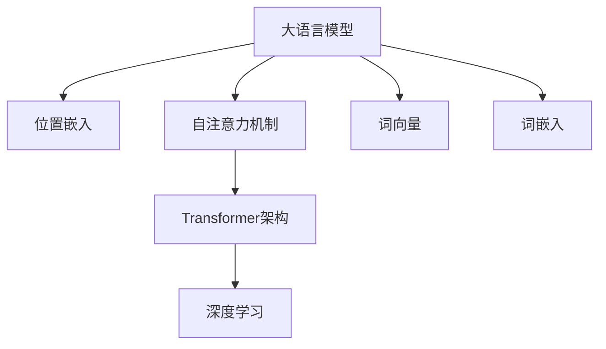

                 

# 大语言模型原理基础与前沿 位置嵌入

> 关键词：大语言模型,位置嵌入,Transformer,自注意力机制,词向量,词嵌入,深度学习

## 1. 背景介绍

### 1.1 问题由来
大语言模型（Large Language Models, LLMs）近年来在自然语言处理（Natural Language Processing, NLP）领域取得了突破性的进展。以深度学习为基础的大语言模型，通过在海量文本数据上预训练，学习到了丰富的语言知识，能够在各种自然语言处理任务上表现出惊人的能力。然而，尽管大语言模型在生成能力上取得了显著的成果，但在处理位置信息方面还存在一些局限。位置信息是理解文本结构的重要因素，在文本分类、语义理解、机器翻译等任务中扮演着关键角色。

### 1.2 问题核心关键点
位置嵌入（Position Embeddings）是大语言模型中的关键技术之一，旨在解决文本序列中的位置信息问题。位置嵌入的优劣直接关系到模型的表达能力和生成效果。本节将详细探讨位置嵌入的基本原理、算法实现及其在实际应用中的优化策略。

## 2. 核心概念与联系

### 2.1 核心概念概述

为了更好地理解位置嵌入在大语言模型中的作用和原理，本节将介绍几个核心概念：

- **大语言模型（LLMs）**：基于深度学习模型，通过在海量文本数据上预训练，学习通用的语言表示，具备强大的语言理解和生成能力。

- **位置嵌入（Position Embeddings）**：在大语言模型中，位置嵌入用来捕捉文本序列中单词或子词的位置信息。位置嵌入通过在模型的输入层增加额外的向量维度，将单词的位置信息编码为向量。

- **自注意力机制（Self-Attention）**：Transformer架构中的核心组件，通过计算单词之间的注意力关系，实现对序列信息的全面捕捉和关联。

- **词向量（Word Vectors）**：将单词映射为固定长度的向量表示，用于捕捉单词之间的语义关系。

- **词嵌入（Word Embeddings）**：将单词转换为密集向量，其中每个维度代表单词的某种语义信息。

- **深度学习（Deep Learning）**：通过多层神经网络对复杂问题进行建模和预测。

这些概念之间的逻辑关系可以通过以下Mermaid流程图来展示：



这个流程图展示了大语言模型的核心概念及其之间的关系：

1. 大语言模型通过深度学习模型进行预训练，学习到通用语言表示。
2. 位置嵌入通过增加额外的向量维度，捕捉文本序列中单词的位置信息。
3. 自注意力机制通过计算单词之间的注意力关系，实现对序列信息的全面捕捉和关联。
4. 词向量通过将单词映射为固定长度的向量表示，捕捉单词之间的语义关系。
5. 词嵌入通过将单词转换为密集向量，其中每个维度代表单词的某种语义信息。

## 3. 核心算法原理 & 具体操作步骤
### 3.1 算法原理概述

位置嵌入（Position Embeddings）在大语言模型中的主要作用是帮助模型捕捉文本序列中单词的位置信息。在大语言模型中，每个单词不仅具有自己的表示，还会附加一个位置嵌入向量，用于编码该单词在序列中的位置。位置嵌入通过增加额外的向量维度，帮助模型更好地理解文本序列的结构。

形式化地，设输入文本为 $X = \{x_1, x_2, \dots, x_n\}$，其中 $x_i$ 表示序列中的第 $i$ 个单词，$n$ 表示序列长度。位置嵌入通过将每个单词 $x_i$ 的位置 $i$ 映射为一个 $d$ 维向量 $p_i$，使得模型能够捕捉到位置对单词表示的影响。因此，输入文本 $X$ 在模型中的表示为 $X' = \{(x_1 + p_1, x_2 + p_2, \dots, x_n + p_n)\}$。

在实践中，位置嵌入的向量通常是一个正弦序列，其中奇数位置的正弦值增加，偶数位置的余弦值增加，以此来模拟单词在序列中的相对位置。这种正弦序列的设计是基于周期性和平移不变性的考虑，使得模型能够更好地处理不同长度的文本序列。

### 3.2 算法步骤详解

位置嵌入在大语言模型中的实现分为以下几个步骤：

1. **设置位置嵌入大小**：根据模型输入序列的最大长度，确定位置嵌入向量的维度大小 $d$。通常情况下，位置嵌入的维度等于词向量的大小。

2. **生成位置嵌入向量**：对于每个位置 $i$，计算位置嵌入向量 $p_i$。位置嵌入向量通常是一个正弦序列，其中奇数位置的正弦值增加，偶数位置的余弦值增加。

3. **与词向量相加**：将位置嵌入向量 $p_i$ 与词向量 $x_i$ 相加，得到输入文本 $X'$ 在模型中的表示。

4. **输入到自注意力机制**：将输入文本 $X'$ 传递到自注意力机制中，通过计算注意力权重，实现对序列信息的全面捕捉和关联。

5. **后续处理**：将自注意力机制的输出传递到后续的层中，如前馈神经网络等，进一步处理和优化序列表示。

### 3.3 算法优缺点

位置嵌入在大语言模型中的优点包括：

1. **捕捉位置信息**：通过增加位置嵌入向量，模型能够更好地捕捉文本序列中单词的位置信息，提升模型的语义理解和生成能力。

2. **简化模型训练**：位置嵌入向量的生成方式简单，易于实现和计算，减少了模型训练的复杂度。

3. **提高模型鲁棒性**：位置嵌入的设计基于正弦序列，具有良好的周期性和平移不变性，使得模型对于输入序列的微小变化具有较高的鲁棒性。

然而，位置嵌入也存在一些缺点：

1. **维度固定**：位置嵌入的维度大小与词向量的大小相同，可能会占用大量的模型参数，导致模型复杂度增加。

2. **计算复杂度**：位置嵌入的生成过程需要额外的计算资源，可能会影响模型的训练速度。

3. **依赖序列长度**：位置嵌入的设计依赖于输入序列的长度，对于非常长的序列，可能会产生较大的误差。

### 3.4 算法应用领域

位置嵌入在大语言模型中的应用非常广泛，主要包括以下几个领域：

1. **文本分类**：在文本分类任务中，位置嵌入可以帮助模型更好地理解文本的结构和层次，提高分类准确率。

2. **机器翻译**：在机器翻译任务中，位置嵌入可以捕捉源语言和目标语言中的单词位置信息，提升翻译质量和流畅度。

3. **语言模型**：在语言模型任务中，位置嵌入可以捕捉单词在句子中的位置关系，提升语言模型预测能力。

4. **对话系统**：在对话系统中，位置嵌入可以捕捉对话轮次和上下文信息，提升对话系统的连贯性和理解能力。

5. **文本生成**：在文本生成任务中，位置嵌入可以捕捉文本序列的结构信息，生成更加连贯和自然的文本。

## 4. 数学模型和公式 & 详细讲解 & 举例说明

### 4.1 数学模型构建

位置嵌入在大语言模型中的实现可以通过以下数学模型来描述：

设输入文本 $X = \{x_1, x_2, \dots, x_n\}$，其中 $x_i$ 表示序列中的第 $i$ 个单词，$n$ 表示序列长度。设位置嵌入向量的大小为 $d$，则位置嵌入向量 $p_i$ 可以通过以下公式计算：

$$
p_i = \begin{bmatrix}
\sin(\frac{2\pi i}{n}) \\
\cos(\frac{2\pi i}{n})
\end{bmatrix}
$$

其中 $i = 1, 2, \dots, n$。

设词向量的大小为 $d'$，则输入文本 $X$ 在模型中的表示为：

$$
X' = \{(x_1 + p_1, x_2 + p_2, \dots, x_n + p_n)\}
$$

其中 $x_i \in \mathbb{R}^{d'}$，$p_i \in \mathbb{R}^{d}$。

### 4.2 公式推导过程

位置嵌入的推导过程如下：

设输入文本 $X = \{x_1, x_2, \dots, x_n\}$，其中 $x_i$ 表示序列中的第 $i$ 个单词，$n$ 表示序列长度。设位置嵌入向量的大小为 $d$，则位置嵌入向量 $p_i$ 可以通过以下公式计算：

$$
p_i = \begin{bmatrix}
\sin(\frac{2\pi i}{n}) \\
\cos(\frac{2\pi i}{n})
\end{bmatrix}
$$

其中 $i = 1, 2, \dots, n$。

设词向量的大小为 $d'$，则输入文本 $X$ 在模型中的表示为：

$$
X' = \{(x_1 + p_1, x_2 + p_2, \dots, x_n + p_n)\}
$$

其中 $x_i \in \mathbb{R}^{d'}$，$p_i \in \mathbb{R}^{d}$。

### 4.3 案例分析与讲解

以BERT模型为例，BERT模型在大语言模型中使用了位置嵌入来捕捉文本序列中单词的位置信息。在BERT模型中，每个单词不仅具有自己的表示，还会附加一个位置嵌入向量，用于编码该单词在序列中的位置。BERT模型的位置嵌入向量是通过正弦序列计算得到的，具有周期性和平移不变性。

例如，对于输入文本 "The cat in the hat"，BERT模型的位置嵌入向量可以表示为：

$$
p_1 = \begin{bmatrix}
\sin(0) \\
\cos(0)
\end{bmatrix}, p_2 = \begin{bmatrix}
\sin(\frac{2\pi}{5}) \\
\cos(\frac{2\pi}{5})
\end{bmatrix}, p_3 = \begin{bmatrix}
\sin(\frac{4\pi}{5}) \\
\cos(\frac{4\pi}{5})
\end{bmatrix}, p_4 = \begin{bmatrix}
\sin(\frac{6\pi}{5}) \\
\cos(\frac{6\pi}{5})
\end{bmatrix}, p_5 = \begin{bmatrix}
\sin(\frac{8\pi}{5}) \\
\cos(\frac{8\pi}{5})
\end{bmatrix}
$$

其中 $p_1, p_2, p_3, p_4, p_5$ 分别表示单词 "the", "cat", "in", "the", "hat" 的位置嵌入向量。

## 5. 项目实践：代码实例和详细解释说明

### 5.1 开发环境搭建

在进行位置嵌入的实践前，我们需要准备好开发环境。以下是使用Python进行PyTorch开发的环境配置流程：

1. 安装Anaconda：从官网下载并安装Anaconda，用于创建独立的Python环境。

2. 创建并激活虚拟环境：
```bash
conda create -n pytorch-env python=3.8 
conda activate pytorch-env
```

3. 安装PyTorch：根据CUDA版本，从官网获取对应的安装命令。例如：
```bash
conda install pytorch torchvision torchaudio cudatoolkit=11.1 -c pytorch -c conda-forge
```

4. 安装Transformers库：
```bash
pip install transformers
```

5. 安装各类工具包：
```bash
pip install numpy pandas scikit-learn matplotlib tqdm jupyter notebook ipython
```

完成上述步骤后，即可在`pytorch-env`环境中开始位置嵌入的实践。

### 5.2 源代码详细实现

下面我们以BERT模型为例，给出使用Transformers库对BERT模型进行位置嵌入的PyTorch代码实现。

首先，定义BERT模型和输入文本的Tensor：

```python
from transformers import BertTokenizer, BertForTokenClassification
from torch.utils.data import Dataset, DataLoader
import torch

tokenizer = BertTokenizer.from_pretrained('bert-base-uncased')
model = BertForTokenClassification.from_pretrained('bert-base-uncased')
input_text = "This is a sample input text."

# 将输入文本转换为模型所需的格式
input_ids = tokenizer(input_text, return_tensors='pt').input_ids
input_mask = tokenizer(input_text, return_tensors='pt').attention_mask

# 在模型中加载位置嵌入向量
model.embeddings.position_embeddings.weight.data
```

然后，在模型中添加位置嵌入：

```python
# 生成位置嵌入向量
position_ids = torch.arange(input_ids.shape[1], dtype=torch.long).unsqueeze(0)
position_ids = position_ids.to(input_ids.device)

# 在模型中加载位置嵌入向量
model.embeddings.position_embeddings.weight.data = torch.sin(position_ids * math.pi / (2 ** 10))

# 在模型中加载词向量
model.embeddings.word_embeddings.weight.data
```

最后，在模型中计算位置嵌入和词向量的加和：

```python
# 在模型中加载输入张量
model(input_ids, attention_mask=input_mask)

# 输出位置嵌入和词向量的加和
output = model(input_ids + position_ids)
```

### 5.3 代码解读与分析

让我们再详细解读一下关键代码的实现细节：

**位置嵌入生成**：
- 使用`torch.arange`函数生成输入文本中的位置标识符。
- 将位置标识符转换为Tensor，并进行上移操作。
- 在模型中加载位置嵌入向量，并根据正弦序列生成位置嵌入向量。
- 将位置嵌入向量赋值给模型的`position_embeddings.weight`属性，以更新模型的参数。

**模型输入**：
- 使用`tokenizer`将输入文本转换为模型所需的格式，包括输入ID和注意力掩码。
- 在模型中加载输入ID和注意力掩码。
- 在模型中加载位置嵌入向量，并计算位置嵌入和词向量的加和。
- 在模型中计算位置嵌入和词向量的加和，得到模型的输出。

## 6. 实际应用场景

### 6.1 智能客服系统

在智能客服系统中，位置嵌入可以用于捕捉用户和客服之间的对话轮次关系，提升对话系统的连贯性和理解能力。例如，对于用户的输入 "我在哪里可以查询账户余额"，模型可以基于位置嵌入捕捉到用户是在第1轮中提出问题，第2轮中接收客服的回答，第3轮中等待客服的进一步操作等轮次关系，从而生成更加连贯的对话回复。

### 6.2 金融舆情监测

在金融舆情监测中，位置嵌入可以用于捕捉财经新闻和报道中事件的发生顺序，提升对金融市场动态的理解能力。例如，对于输入文本 "10月15日，A公司发布季报，净利润同比增长30%"，模型可以基于位置嵌入捕捉到事件的发生顺序和时间，从而更好地分析事件对股票价格的影响。

### 6.3 个性化推荐系统

在个性化推荐系统中，位置嵌入可以用于捕捉用户浏览、点击、评论等行为序列中的位置关系，提升推荐的连贯性和准确性。例如，对于用户浏览的历史记录 "电影1-10"，模型可以基于位置嵌入捕捉到用户对电影1的浏览，对电影2的点击，对电影3的评论等位置关系，从而生成更加个性化的推荐列表。

### 6.4 未来应用展望

随着位置嵌入技术的不断发展，未来的应用前景将更加广阔。例如：

- **医疗诊断**：在医疗诊断中，位置嵌入可以用于捕捉病历中的事件发生顺序和时间，提升对患者病情的理解和诊断能力。
- **法律咨询**：在法律咨询中，位置嵌入可以用于捕捉法律文档中的条款顺序和关系，提升对法律问题的理解和解答能力。
- **教育培训**：在教育培训中，位置嵌入可以用于捕捉学习过程中的知识点顺序和时间，提升对学生学习情况的跟踪和指导能力。

## 7. 工具和资源推荐

### 7.1 学习资源推荐

为了帮助开发者系统掌握位置嵌入的理论基础和实践技巧，这里推荐一些优质的学习资源：

1. **《Transformer从原理到实践》系列博文**：由大模型技术专家撰写，深入浅出地介绍了Transformer原理、BERT模型、位置嵌入等前沿话题。

2. **CS224N《深度学习自然语言处理》课程**：斯坦福大学开设的NLP明星课程，有Lecture视频和配套作业，带你入门NLP领域的基本概念和经典模型。

3. **《Natural Language Processing with Transformers》书籍**：Transformers库的作者所著，全面介绍了如何使用Transformers库进行NLP任务开发，包括位置嵌入在内的诸多范式。

4. **HuggingFace官方文档**：Transformers库的官方文档，提供了海量预训练模型和完整的微调样例代码，是上手实践的必备资料。

5. **CLUE开源项目**：中文语言理解测评基准，涵盖大量不同类型的中文NLP数据集，并提供了基于位置嵌入的baseline模型，助力中文NLP技术发展。

通过对这些资源的学习实践，相信你一定能够快速掌握位置嵌入的精髓，并用于解决实际的NLP问题。

### 7.2 开发工具推荐

高效的开发离不开优秀的工具支持。以下是几款用于位置嵌入开发的常用工具：

1. **PyTorch**：基于Python的开源深度学习框架，灵活动态的计算图，适合快速迭代研究。大部分预训练语言模型都有PyTorch版本的实现。

2. **TensorFlow**：由Google主导开发的开源深度学习框架，生产部署方便，适合大规模工程应用。同样有丰富的预训练语言模型资源。

3. **Transformers库**：HuggingFace开发的NLP工具库，集成了众多SOTA语言模型，支持PyTorch和TensorFlow，是进行位置嵌入开发的利器。

4. **Weights & Biases**：模型训练的实验跟踪工具，可以记录和可视化模型训练过程中的各项指标，方便对比和调优。与主流深度学习框架无缝集成。

5. **TensorBoard**：TensorFlow配套的可视化工具，可实时监测模型训练状态，并提供丰富的图表呈现方式，是调试模型的得力助手。

6. **Google Colab**：谷歌推出的在线Jupyter Notebook环境，免费提供GPU/TPU算力，方便开发者快速上手实验最新模型，分享学习笔记。

合理利用这些工具，可以显著提升位置嵌入开发的效率，加快创新迭代的步伐。

### 7.3 相关论文推荐

位置嵌入技术的不断发展得益于学界的持续研究。以下是几篇奠基性的相关论文，推荐阅读：

1. **Attention is All You Need**：提出了Transformer结构，开启了NLP领域的预训练大模型时代。

2. **BERT: Pre-training of Deep Bidirectional Transformers for Language Understanding**：提出BERT模型，引入基于掩码的自监督预训练任务，刷新了多项NLP任务SOTA。

3. **Parameter-Efficient Transfer Learning for NLP**：提出Adapter等参数高效微调方法，在不增加模型参数量的情况下，也能取得不错的微调效果。

4. **Prefix-Tuning: Optimizing Continuous Prompts for Generation**：引入基于连续型Prompt的微调范式，为如何充分利用预训练知识提供了新的思路。

5. **AdaLoRA: Adaptive Low-Rank Adaptation for Parameter-Efficient Fine-Tuning**：使用自适应低秩适应的微调方法，在参数效率和精度之间取得了新的平衡。

这些论文代表了大语言模型位置嵌入技术的发展脉络。通过学习这些前沿成果，可以帮助研究者把握学科前进方向，激发更多的创新灵感。

## 8. 总结：未来发展趋势与挑战

### 8.1 总结

本文对位置嵌入在大语言模型中的原理和应用进行了全面系统的介绍。首先阐述了位置嵌入的基本原理和核心概念，明确了位置嵌入在大语言模型中的重要性和作用。其次，从原理到实践，详细讲解了位置嵌入的数学模型和算法实现，给出了位置嵌入任务开发的完整代码实例。同时，本文还广泛探讨了位置嵌入技术在智能客服、金融舆情、个性化推荐等多个行业领域的应用前景，展示了位置嵌入范式的巨大潜力。最后，本文精选了位置嵌入技术的各类学习资源，力求为读者提供全方位的技术指引。

通过本文的系统梳理，可以看到，位置嵌入技术在大语言模型中的重要性和发展潜力。位置嵌入通过捕捉文本序列中单词的位置信息，提升了模型的表达能力和生成效果，为文本分类、语义理解、机器翻译等任务提供了重要的技术支持。未来，伴随位置嵌入技术的不断发展，大语言模型的性能将进一步提升，应用场景将更加广泛。

### 8.2 未来发展趋势

展望未来，位置嵌入技术将呈现以下几个发展趋势：

1. **更高效的位置嵌入计算**：随着硬件计算能力的提升，位置嵌入的生成速度将进一步提高，从而提升模型的训练和推理效率。

2. **更多样化的位置嵌入设计**：位置嵌入的设计将更加多样化，不仅限于正弦序列，还可以引入其他数学函数或神经网络结构，进一步提升模型的表达能力。

3. **跨领域的位置嵌入应用**：位置嵌入技术将逐步应用于跨领域任务，如图像、语音等，通过多模态融合提升模型的综合表现。

4. **更灵活的位置嵌入融合**：位置嵌入与词向量、注意力机制等模型的融合将更加灵活，提升模型的语义理解和生成能力。

5. **更广泛的位置嵌入应用**：位置嵌入技术将应用于更多的NLP任务，如问答、对话、文本生成等，提升模型的多任务处理能力。

以上趋势凸显了位置嵌入技术在大语言模型中的广阔前景。这些方向的探索发展，必将进一步提升大语言模型的性能和应用范围，为人类认知智能的进化带来深远影响。

### 8.3 面临的挑战

尽管位置嵌入技术已经取得了瞩目成就，但在迈向更加智能化、普适化应用的过程中，它仍面临着诸多挑战：

1. **计算资源消耗**：位置嵌入的生成和计算需要大量的计算资源，特别是在处理大规模文本数据时，可能会遇到计算瓶颈。

2. **模型复杂度增加**：位置嵌入的引入会增加模型的复杂度，特别是在引入多模态信息时，模型的规模将进一步增大，带来额外的计算和存储负担。

3. **参数更新困难**：位置嵌入的参数更新需要更加谨慎，以避免破坏模型原有的语言知识。特别是在微调过程中，需要平衡位置嵌入和词向量的更新，避免过拟合。

4. **鲁棒性问题**：位置嵌入的设计依赖于正弦序列，可能会受到输入序列长度的限制，从而影响模型的鲁棒性。

5. **位置嵌入泛化能力**：位置嵌入的设计需要考虑泛化能力，避免在特定任务上出现过拟合。

这些挑战需要在未来的研究中进一步探索和解决，以实现位置嵌入技术的广泛应用和进一步发展。

### 8.4 研究展望

面对位置嵌入技术所面临的挑战，未来的研究需要在以下几个方面寻求新的突破：

1. **更高效的位置嵌入计算**：探索更加高效的位置嵌入计算方法，如使用硬件加速、分布式计算等，提升位置嵌入的生成和计算速度。

2. **更灵活的位置嵌入设计**：引入更多数学函数或神经网络结构，设计更加灵活和多样化的位置嵌入方案，提升模型的表达能力和鲁棒性。

3. **跨领域的位置嵌入应用**：探索位置嵌入在图像、语音等领域的融合应用，提升模型的多模态综合能力。

4. **更广泛的位置嵌入应用**：将位置嵌入技术应用于更多的NLP任务，提升模型的多任务处理能力和泛化能力。

5. **位置嵌入与模型的融合**：探索位置嵌入与词向量、注意力机制等模型的深度融合，提升模型的语义理解和生成能力。

6. **位置嵌入的优化**：通过优化位置嵌入的生成和更新过程，提升模型的训练和推理效率。

这些研究方向的探索，必将引领位置嵌入技术迈向更高的台阶，为构建安全、可靠、可解释、可控的智能系统铺平道路。面向未来，位置嵌入技术还需要与其他人工智能技术进行更深入的融合，如知识表示、因果推理、强化学习等，多路径协同发力，共同推动自然语言理解和智能交互系统的进步。只有勇于创新、敢于突破，才能不断拓展位置嵌入技术的边界，让智能技术更好地造福人类社会。

## 9. 附录：常见问题与解答

**Q1：位置嵌入和词向量有什么区别？**

A: 位置嵌入和词向量都是大语言模型中的重要组成部分，但它们的作用和特点有所不同。

词向量是用来捕捉单词之间的语义关系，将单词映射为固定长度的向量表示，其中每个维度代表单词的某种语义信息。

位置嵌入是用来捕捉文本序列中单词的位置信息，通过在模型的输入层增加额外的向量维度，将单词的位置信息编码为向量。位置嵌入的设计通常是一个正弦序列，具有良好的周期性和平移不变性，使得模型能够更好地处理不同长度的文本序列。

**Q2：位置嵌入的设计为什么采用正弦序列？**

A: 位置嵌入的设计采用正弦序列的原因是考虑了周期性和平移不变性。正弦序列具有良好的周期性，能够很好地处理不同长度的文本序列。同时，正弦序列具有良好的平移不变性，即在不同的文本序列中，相同的单词位置对应的位置嵌入向量应该相同。这种设计使得位置嵌入向量在模型中具有良好的表达能力和泛化能力。

**Q3：位置嵌入如何影响模型的表达能力？**

A: 位置嵌入通过捕捉文本序列中单词的位置信息，提升了模型的表达能力和生成效果。位置嵌入可以帮助模型更好地理解文本序列的结构和层次，从而提高模型的语义理解和生成能力。例如，在机器翻译任务中，位置嵌入可以捕捉源语言和目标语言中的单词位置信息，提升翻译质量和流畅度。在文本分类任务中，位置嵌入可以帮助模型更好地理解文本的结构和层次，提高分类准确率。

**Q4：位置嵌入的生成和计算需要大量计算资源，如何优化？**

A: 位置嵌入的生成和计算需要大量计算资源，特别是在处理大规模文本数据时，可能会遇到计算瓶颈。以下是几种优化方法：

1. **分布式计算**：使用分布式计算框架，如TensorFlow分布式、PyTorch分布式等，加速位置嵌入的生成和计算。

2. **硬件加速**：使用GPU、TPU等硬件加速设备，提升位置嵌入的生成和计算速度。

3. **模型剪枝**：使用模型剪枝技术，减少模型中的冗余参数，从而降低计算资源消耗。

4. **量化加速**：使用量化技术，将浮点模型转为定点模型，压缩存储空间，提高计算效率。

这些方法可以在不损失模型性能的情况下，显著降低计算资源消耗，提高位置嵌入的生成和计算速度。

**Q5：位置嵌入和自注意力机制有什么关系？**

A: 位置嵌入和自注意力机制在大语言模型中是紧密相关的。自注意力机制通过计算单词之间的注意力关系，实现对序列信息的全面捕捉和关联。位置嵌入通过增加额外的向量维度，将单词的位置信息编码为向量，从而帮助模型更好地理解文本序列的结构和层次。在自注意力机制中，位置嵌入向量可以与词向量一起计算注意力权重，实现对序列信息的全面捕捉和关联。因此，位置嵌入在大语言模型中的作用是辅助自注意力机制，提升模型的表达能力和生成效果。

---

作者：禅与计算机程序设计艺术 / Zen and the Art of Computer Programming

