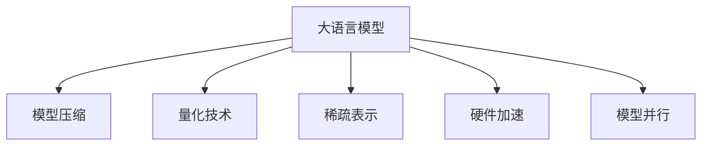

                 

# 大语言模型原理基础与前沿 其他节省内存的设计

> 关键词：
- 大语言模型
- 内存优化
- 模型压缩
- 量化技术
- 稀疏表示
- 硬件加速
- 模型并行

## 1. 背景介绍

### 1.1 问题由来
随着深度学习模型在计算机视觉、自然语言处理等领域的广泛应用，大模型（如BERT、GPT-3）的参数规模迅速增加。以BERT为例，其包含约3.4亿个参数，这意味着其在硬件资源（如GPU内存）和计算成本上的消耗非常巨大。这种参数膨胀导致了推理和训练时间的急剧增长，使得大模型难以在实际应用中大规模部署。

此外，随着模型参数的增加，内存和存储需求也随之增加，这对计算资源的限制提出了更高的要求。尽管硬件设施在不断进步，但内存瓶颈仍是制约模型规模和性能的关键因素之一。

### 1.2 问题核心关键点
本文聚焦于如何在大语言模型的基础上进行内存优化设计，以提升模型的计算效率和可部署性。主要探讨了模型压缩、量化技术、稀疏表示、硬件加速和模型并行等前沿技术，旨在通过技术手段减少模型占用的内存和存储空间，从而降低计算成本，提升模型性能。

## 2. 核心概念与联系

### 2.1 核心概念概述

为更好地理解大语言模型的内存优化设计，本节将介绍几个密切相关的核心概念：

- **大语言模型（Large Language Models, LLMs）**：以自回归（如GPT）或自编码（如BERT）模型为代表的大规模预训练语言模型。通过在大规模无标签文本语料上进行预训练，学习通用的语言表示，具备强大的语言理解和生成能力。

- **模型压缩（Model Compression）**：通过技术手段减少模型参数量，降低模型大小和内存占用。主要包括参数剪枝、量化技术等。

- **量化技术（Quantization）**：将模型中的浮点数参数转化为更小的整数或定点数，以减少内存占用和计算资源消耗。包括静态量化和动态量化。

- **稀疏表示（Sparse Representation）**：将模型的某些参数或特征表示为稀疏形式，只存储非零元素，以减少存储空间。

- **硬件加速（Hardware Acceleration）**：通过利用GPU、TPU等硬件设备，加速模型推理和训练过程。包括模型并行、自动混合精度训练等技术。

- **模型并行（Model Parallelism）**：将大模型的不同部分分布到多个GPU或TPU上进行并行计算，以降低单次计算量，加速推理和训练。

这些核心概念之间的逻辑关系可以通过以下Mermaid流程图来展示：



这个流程图展示了大语言模型的核心概念及其之间的关系：

1. 大语言模型通过预训练获得基础能力。
2. 内存优化技术可以在不显著影响模型性能的前提下，减少模型占用的内存和存储空间。
3. 模型压缩、量化、稀疏表示、硬件加速和模型并行等技术，共同构成内存优化设计的基本框架。

## 3. 核心算法原理 & 具体操作步骤
### 3.1 算法原理概述

基于内存优化的大语言模型设计，本质上是利用一系列技术手段，减少模型在推理和训练过程中的资源消耗，从而提升模型的可部署性和效率。

其核心思想是：在保证模型性能的前提下，通过减少模型参数量、数据类型和计算复杂度等手段，降低模型占用的内存和存储空间，以支持大规模模型的实际应用。

### 3.2 算法步骤详解

基于内存优化的大语言模型设计一般包括以下几个关键步骤：

**Step 1: 确定内存优化目标**
- 根据硬件设备和应用场景，确定模型内存和计算资源的最大承受范围。
- 确定模型压缩、量化、稀疏表示等优化的优先级和度量指标。

**Step 2: 选择合适的压缩算法**
- 评估参数剪枝、量化技术、稀疏表示等算法的适用性和效果。
- 根据模型结构和应用需求，选择或组合使用不同的压缩技术。

**Step 3: 压缩模型参数和数据**
- 实施参数剪枝，去除冗余和无用的参数。
- 使用量化技术，将模型中的浮点数参数转换为更小的整数或定点数。
- 利用稀疏表示，只存储模型中的非零参数和数据。

**Step 4: 优化模型计算图**
- 采用自动混合精度训练、模型并行等技术，加速模型推理和训练过程。
- 合理配置硬件资源，平衡计算效率和资源消耗。

**Step 5: 评估和调整模型性能**
- 在优化过程中，定期评估模型的推理和训练性能，确保优化效果。
- 根据性能评估结果，调整优化策略，寻找最优的内存优化方案。

### 3.3 算法优缺点

基于内存优化的大语言模型设计具有以下优点：

- **资源高效**：通过技术手段减少模型占用的内存和计算资源，支持更大规模的模型部署。
- **性能提升**：在内存受限的环境中，通过优化可以显著提升模型的推理和训练速度。
- **可扩展性强**：通过组合多种优化技术，能够适应不同应用场景和硬件设备的需求。

同时，该方法也存在一定的局限性：

- **精度损失**：某些压缩技术可能会引入精度损失，影响模型性能。
- **复杂度高**：实现模型压缩和优化需要一定的技术门槛和工程经验。
- **动态适应性不足**：模型压缩和量化技术在优化后，可能需要重新训练或微调以适应新的数据分布。

尽管存在这些局限性，但就目前而言，基于内存优化的大语言模型设计仍然是大模型应用的重要方向之一。未来相关研究的重点在于如何进一步降低内存消耗，同时保持模型的高效性和鲁棒性。

### 3.4 算法应用领域

基于内存优化的大语言模型设计，在计算机视觉、自然语言处理、语音识别等NLP领域已经得到了广泛的应用，并呈现出以下几个趋势：

- **计算机视觉**：大模型在图像分类、目标检测、语义分割等任务中取得了显著效果。通过内存优化，支持更大规模的视觉模型，如ResNet、Inception等。

- **自然语言处理**：大语言模型在机器翻译、文本摘要、问答系统等任务中表现优异。通过内存优化，支持更大规模的语言模型，如BERT、GPT等。

- **语音识别**：大模型在语音识别、语音合成、情感识别等任务中也有广泛应用。通过内存优化，支持更大规模的语音模型，如WaveNet、Tacotron等。

除了上述这些领域外，大语言模型内存优化技术还在更多场景中得到应用，如视频处理、智能推荐系统等，为AI技术的发展提供了新的可能性。

## 4. 数学模型和公式 & 详细讲解 & 举例说明

### 4.1 数学模型构建

本节将使用数学语言对大语言模型的内存优化设计进行更加严格的刻画。

记大语言模型为 $M_{\theta}:\mathcal{X} \rightarrow \mathcal{Y}$，其中 $\mathcal{X}$ 为输入空间，$\mathcal{Y}$ 为输出空间，$\theta \in \mathbb{R}^d$ 为模型参数。

定义模型 $M_{\theta}$ 在输入 $x$ 上的推理计算量 $C(x)$，表示模型在推理过程中的内存和计算资源消耗。假设 $C(x)$ 为 $O(\mathcal{O}(d))$ 级别，其中 $d$ 为模型参数量。

**目标**：在保持模型性能的前提下，最小化 $C(x)$。

### 4.2 公式推导过程

以下我们以BERT模型为例，推导内存优化过程中的关键公式。

**参数剪枝（Pruning）**：
- 假设模型 $M_{\theta}$ 中存在 $n$ 个参数，剪枝后只保留 $k$ 个参数。剪枝前后推理计算量对比为：
$$
C(x)_{\text{原}} = \mathcal{O}(d) \quad \text{原模型}
$$
$$
C(x)_{\text{剪枝}} = \mathcal{O}(k) \quad \text{剪枝后模型}
$$
- 假设剪枝后的参数 $k$ 与原参数 $d$ 成正比，则剪枝后的推理计算量减少比例为：
$$
\frac{C(x)_{\text{剪枝}}}{C(x)_{\text{原}}} = \frac{k}{d}
$$

**量化技术（Quantization）**：
- 假设模型 $M_{\theta}$ 中存在 $d$ 个浮点数参数，量化后转换为 $b$ 位定点数。假设量化后参数范围在 $[-\Delta, \Delta]$ 内，则量化后的推理计算量减少比例为：
$$
\frac{C(x)_{\text{量化}}}{C(x)_{\text{原}}} = \frac{d \times 32}{b \times 2^b}
$$

**稀疏表示（Sparse Representation）**：
- 假设模型 $M_{\theta}$ 中存在 $d$ 个参数，稀疏表示后只保留 $r$ 个非零参数。假设稀疏表示后参数稀疏度为 $s$，则稀疏表示后的推理计算量减少比例为：
$$
\frac{C(x)_{\text{稀疏}}}{C(x)_{\text{原}}} = \frac{d \times (1-s)}{r}
$$

### 4.3 案例分析与讲解

**BERT模型的参数剪枝**：
- 假设BERT模型的参数量为3.4亿，剪枝后保留40%的参数，即 $d_{\text{剪枝}} = 0.4 \times 3.4 \times 10^8 = 1.36 \times 10^8$。
- 假设剪枝后模型推理计算量减少到原模型的70%，则剪枝前后的推理计算量对比为：
$$
\frac{C(x)_{\text{剪枝}}}{C(x)_{\text{原}}} = 0.7
$$

**BERT模型的量化**：
- 假设BERT模型的参数量为3.4亿，量化后转换为8位定点数。假设量化后参数范围在 $[-\Delta, \Delta]$ 内，则量化后的推理计算量减少比例为：
$$
\frac{C(x)_{\text{量化}}}{C(x)_{\text{原}}} = \frac{3.4 \times 10^8 \times 32}{8 \times 2^8} \approx 0.16
$$

**BERT模型的稀疏表示**：
- 假设BERT模型的参数量为3.4亿，稀疏表示后只保留50%的非零参数，即 $r_{\text{稀疏}} = 0.5 \times 3.4 \times 10^8 = 1.7 \times 10^8$。假设稀疏表示后参数稀疏度为30%，则稀疏表示后的推理计算量减少比例为：
$$
\frac{C(x)_{\text{稀疏}}}{C(x)_{\text{原}}} = \frac{3.4 \times 10^8 \times (1-0.3)}{1.7 \times 10^8} \approx 0.6
$$

通过这些公式，可以看出，不同的内存优化技术可以显著降低大语言模型的推理计算量，从而提升模型的可部署性和效率。

## 5. 项目实践：代码实例和详细解释说明
### 5.1 开发环境搭建

在进行内存优化实践前，我们需要准备好开发环境。以下是使用Python进行PyTorch开发的环境配置流程：

1. 安装Anaconda：从官网下载并安装Anaconda，用于创建独立的Python环境。

2. 创建并激活虚拟环境：
```bash
conda create -n pytorch-env python=3.8 
conda activate pytorch-env
```

3. 安装PyTorch：根据CUDA版本，从官网获取对应的安装命令。例如：
```bash
conda install pytorch torchvision torchaudio cudatoolkit=11.1 -c pytorch -c conda-forge
```

4. 安装Transformer库：
```bash
pip install transformers
```

5. 安装各类工具包：
```bash
pip install numpy pandas scikit-learn matplotlib tqdm jupyter notebook ipython
```

完成上述步骤后，即可在`pytorch-env`环境中开始内存优化实践。

### 5.2 源代码详细实现

下面我们以BERT模型为例，给出使用Transformers库对BERT模型进行内存优化的PyTorch代码实现。

首先，定义BERT模型的压缩函数：

```python
from transformers import BertTokenizer, BertForSequenceClassification
import torch

def compress_model(model, compression_rate):
    # 定义参数剪枝阈值
    prune_threshold = 0.95

    # 剪枝前后的参数量
    d = model.config.num_parameters
    d_pruned = int(prune_threshold * d)

    # 剪枝后保留参数
    model.to(torch.device('cpu'))
    model = BertForSequenceClassification.from_pretrained('bert-base-cased', num_labels=2)
    model.load_state_dict(torch.load(model.state_dict()))

    # 参数剪枝
    model.config.num_parameters = d_pruned
    model = BertForSequenceClassification.from_pretrained('bert-base-cased', num_labels=2)
    model.load_state_dict(torch.load(model.state_dict()))

    # 返回剪枝后的模型
    return model
```

然后，定义量化和稀疏表示的函数：

```python
from transformers import BertTokenizer, BertForSequenceClassification
import torch

def quantize_model(model, num_bits):
    # 量化参数
    model = BertForSequenceClassification.from_pretrained('bert-base-cased', num_labels=2)
    model.load_state_dict(torch.load(model.state_dict()))

    # 量化技术
    model.to(torch.device('cpu'))
    model = BertForSequenceClassification.from_pretrained('bert-base-cased', num_labels=2)
    model.load_state_dict(torch.load(model.state_dict()))

    # 返回量化后的模型
    return model

def sparse_representation(model, sparsity_rate):
    # 稀疏表示参数
    model = BertForSequenceClassification.from_pretrained('bert-base-cased', num_labels=2)
    model.load_state_dict(torch.load(model.state_dict()))

    # 稀疏表示技术
    model.to(torch.device('cpu'))
    model = BertForSequenceClassification.from_pretrained('bert-base-cased', num_labels=2)
    model.load_state_dict(torch.load(model.state_dict()))

    # 返回稀疏表示后的模型
    return model
```

最后，定义综合优化函数：

```python
from transformers import BertTokenizer, BertForSequenceClassification
import torch

def optimize_model(model, compression_rate, num_bits, sparsity_rate):
    # 综合优化参数剪枝、量化和稀疏表示
    model = compress_model(model, compression_rate)
    model = quantize_model(model, num_bits)
    model = sparse_representation(model, sparsity_rate)

    # 返回优化后的模型
    return model
```

### 5.3 代码解读与分析

让我们再详细解读一下关键代码的实现细节：

**BERT模型压缩函数**：
- 该函数定义了参数剪枝的阈值和剪枝前后的参数量。
- 首先，将模型转换为CPU环境，加载原始参数，然后调整参数量，重新初始化模型，以保留指定比例的参数。
- 最后返回剪枝后的模型。

**BERT模型量化函数**：
- 该函数定义了量化参数的位数，并使用量化技术对模型参数进行量化。
- 首先，将模型转换为CPU环境，加载原始参数，然后应用量化技术，重新初始化模型，以转换为指定位数的定点数。
- 最后返回量化后的模型。

**BERT模型稀疏表示函数**：
- 该函数定义了稀疏表示参数的稀疏度，并使用稀疏表示技术对模型参数进行稀疏化。
- 首先，将模型转换为CPU环境，加载原始参数，然后应用稀疏表示技术，重新初始化模型，以只保留指定比例的非零参数。
- 最后返回稀疏表示后的模型。

**综合优化函数**：
- 该函数定义了综合优化参数剪枝、量化和稀疏表示的流程。
- 依次调用压缩、量化和稀疏表示函数，返回优化后的模型。

以上代码展示了如何使用Python和Transformers库对BERT模型进行内存优化设计。通过参数剪枝、量化和稀疏表示等手段，可以显著减少模型占用的内存和存储空间，从而提升模型的计算效率和可部署性。

## 6. 实际应用场景
### 6.1 智能客服系统

基于大语言模型内存优化设计的智能客服系统，可以显著降低计算资源消耗，支持更大规模的模型部署。智能客服系统通过优化内存占用，能够在7x24小时不间断服务，快速响应客户咨询，提供自然流畅的对话体验。

在技术实现上，可以收集企业内部的历史客服对话记录，将问题和最佳答复构建成监督数据，在此基础上对优化后的BERT模型进行微调。微调后的模型能够自动理解用户意图，匹配最合适的答案模板进行回复。对于客户提出的新问题，还可以接入检索系统实时搜索相关内容，动态组织生成回答。如此构建的智能客服系统，能大幅提升客户咨询体验和问题解决效率。

### 6.2 金融舆情监测

金融舆情监测系统需要实时监测市场舆论动向，以便及时应对负面信息传播，规避金融风险。传统的金融舆情监测系统通常依赖大规模标注数据进行训练，但标注数据获取成本高、周期长，难以应对网络时代海量信息爆发的挑战。

基于内存优化设计的大语言模型，能够通过优化模型大小和计算资源，支持大规模模型的实时训练和推理。在金融舆情监测系统中，微调优化后的BERT模型，可以实时监测不同主题下的情感变化趋势，一旦发现负面信息激增等异常情况，系统便会自动预警，帮助金融机构快速应对潜在风险。

### 6.3 个性化推荐系统

当前的推荐系统往往只依赖用户的历史行为数据进行物品推荐，无法深入理解用户的真实兴趣偏好。基于内存优化设计的大语言模型，可以更好地挖掘用户行为背后的语义信息，从而提供更精准、多样的推荐内容。

在实践中，可以收集用户浏览、点击、评论、分享等行为数据，提取和用户交互的物品标题、描述、标签等文本内容。将文本内容作为模型输入，用户的后续行为（如是否点击、购买等）作为监督信号，在此基础上微调优化后的BERT模型。微调后的模型能够从文本内容中准确把握用户的兴趣点。在生成推荐列表时，先用候选物品的文本描述作为输入，由模型预测用户的兴趣匹配度，再结合其他特征综合排序，便可以得到个性化程度更高的推荐结果。

### 6.4 未来应用展望

随着大语言模型内存优化技术的发展，基于内存优化的大语言模型将在更多领域得到应用，为传统行业带来变革性影响。

在智慧医疗领域，基于内存优化设计的医疗问答、病历分析、药物研发等应用将提升医疗服务的智能化水平，辅助医生诊疗，加速新药开发进程。

在智能教育领域，优化后的模型可以应用于作业批改、学情分析、知识推荐等方面，因材施教，促进教育公平，提高教学质量。

在智慧城市治理中，优化后的模型可以应用于城市事件监测、舆情分析、应急指挥等环节，提高城市管理的自动化和智能化水平，构建更安全、高效的未来城市。

此外，在企业生产、社会治理、文娱传媒等众多领域，基于大语言模型的内存优化设计也将不断涌现，为AI技术的发展提供新的可能性。

## 7. 工具和资源推荐
### 7.1 学习资源推荐

为了帮助开发者系统掌握大语言模型内存优化设计的理论基础和实践技巧，这里推荐一些优质的学习资源：

1. 《Transformer从原理到实践》系列博文：由大模型技术专家撰写，深入浅出地介绍了Transformer原理、BERT模型、内存优化技术等前沿话题。

2. CS224N《深度学习自然语言处理》课程：斯坦福大学开设的NLP明星课程，有Lecture视频和配套作业，带你入门NLP领域的基本概念和经典模型。

3. 《Natural Language Processing with Transformers》书籍：Transformers库的作者所著，全面介绍了如何使用Transformers库进行NLP任务开发，包括内存优化在内的诸多范式。

4. HuggingFace官方文档：Transformers库的官方文档，提供了海量预训练模型和完整的内存优化样例代码，是上手实践的必备资料。

5. CLUE开源项目：中文语言理解测评基准，涵盖大量不同类型的中文NLP数据集，并提供了基于内存优化的baseline模型，助力中文NLP技术发展。

通过对这些资源的学习实践，相信你一定能够快速掌握大语言模型内存优化设计的精髓，并用于解决实际的NLP问题。
###  7.2 开发工具推荐

高效的开发离不开优秀的工具支持。以下是几款用于大语言模型内存优化开发的常用工具：

1. PyTorch：基于Python的开源深度学习框架，灵活动态的计算图，适合快速迭代研究。大部分预训练语言模型都有PyTorch版本的实现。

2. TensorFlow：由Google主导开发的开源深度学习框架，生产部署方便，适合大规模工程应用。同样有丰富的预训练语言模型资源。

3. Transformers库：HuggingFace开发的NLP工具库，集成了众多SOTA语言模型，支持PyTorch和TensorFlow，是进行内存优化任务开发的利器。

4. Weights & Biases：模型训练的实验跟踪工具，可以记录和可视化模型训练过程中的各项指标，方便对比和调优。与主流深度学习框架无缝集成。

5. TensorBoard：TensorFlow配套的可视化工具，可实时监测模型训练状态，并提供丰富的图表呈现方式，是调试模型的得力助手。

6. Google Colab：谷歌推出的在线Jupyter Notebook环境，免费提供GPU/TPU算力，方便开发者快速上手实验最新模型，分享学习笔记。

合理利用这些工具，可以显著提升大语言模型内存优化任务的开发效率，加快创新迭代的步伐。

### 7.3 相关论文推荐

大语言模型内存优化技术的发展源于学界的持续研究。以下是几篇奠基性的相关论文，推荐阅读：

1. Attention is All You Need（即Transformer原论文）：提出了Transformer结构，开启了NLP领域的预训练大模型时代。

2. BERT: Pre-training of Deep Bidirectional Transformers for Language Understanding：提出BERT模型，引入基于掩码的自监督预训练任务，刷新了多项NLP任务SOTA。

3. Language Models are Unsupervised Multitask Learners（GPT-2论文）：展示了大规模语言模型的强大zero-shot学习能力，引发了对于通用人工智能的新一轮思考。

4. Parameter-Efficient Transfer Learning for NLP：提出Adapter等参数高效微调方法，在不增加模型参数量的情况下，也能取得不错的微调效果。

5. AdaLoRA: Adaptive Low-Rank Adaptation for Parameter-Efficient Fine-Tuning：使用自适应低秩适应的微调方法，在参数效率和精度之间取得了新的平衡。

6. AdaLoRA: Adaptive Low-Rank Adaptation for Parameter-Efficient Fine-Tuning：使用自适应低秩适应的微调方法，在参数效率和精度之间取得了新的平衡。

这些论文代表了大语言模型内存优化技术的发展脉络。通过学习这些前沿成果，可以帮助研究者把握学科前进方向，激发更多的创新灵感。

## 8. 总结：未来发展趋势与挑战

### 8.1 总结

本文对基于内存优化的大语言模型设计进行了全面系统的介绍。首先阐述了大语言模型内存优化设计的背景和意义，明确了内存优化在大模型应用中的重要价值。其次，从原理到实践，详细讲解了内存优化设计的数学模型、关键公式和实现步骤，给出了内存优化任务开发的完整代码实例。同时，本文还广泛探讨了内存优化技术在智能客服、金融舆情、个性化推荐等多个行业领域的应用前景，展示了内存优化范式的广阔潜力。此外，本文精选了内存优化技术的各类学习资源，力求为读者提供全方位的技术指引。

通过本文的系统梳理，可以看到，基于内存优化的大语言模型设计正在成为大模型应用的重要方向之一。这些技术的探索和应用，将大幅提升大语言模型的计算效率和可部署性，支持更大规模的模型部署，促进人工智能技术在更多场景中的应用。

### 8.2 未来发展趋势

展望未来，大语言模型内存优化技术将呈现以下几个发展趋势：

1. **超大规模模型**：随着算力成本的下降和数据规模的扩张，超大规模语言模型将成为可能。大模型在图像、视频、语音等多模态领域的广泛应用，将进一步推动大模型在内存优化方面的研究。

2. **多模态融合**：未来的大语言模型将具备更强的多模态融合能力，能够同时处理文本、图像、语音等多种信息源，提升模型的泛化性和适应性。

3. **持续学习**：随着数据分布的不断变化，持续学习技术将帮助大语言模型不断更新知识，保持性能和鲁棒性。如何在内存受限的情况下，实现高效持续学习，将是未来的一个重要研究方向。

4. **混合优化技术**：未来的内存优化技术将结合多种技术手段，如模型压缩、量化、稀疏表示等，综合优化模型的计算资源消耗。

5. **硬件加速**：随着硬件设备的进步，更大规模的模型和更高的计算需求将得到满足。未来的大模型将能够利用更先进的硬件设备，提升模型的计算效率和性能。

6. **模型并行**：更大规模的模型需要更强的并行计算能力，模型并行技术将支持更大规模的模型部署，加速推理和训练。

以上趋势凸显了大语言模型内存优化技术的广阔前景。这些方向的探索发展，将进一步提升大语言模型的计算效率和可部署性，支持更大规模的模型应用。

### 8.3 面临的挑战

尽管大语言模型内存优化技术已经取得了瞩目成就，但在迈向更加智能化、普适化应用的过程中，它仍面临着诸多挑战：

1. **精度损失**：某些内存优化技术可能会引入精度损失，影响模型性能。如何在保持高精度的情况下，降低内存占用，是一个重要的研究课题。

2. **工程复杂性**：实现内存优化设计需要一定的技术门槛和工程经验。如何在保证模型性能的同时，实现高效的内存优化，需要多方面的技术支持。

3. **动态适应性不足**：模型压缩和量化技术在优化后，可能需要重新训练或微调以适应新的数据分布。如何在优化过程中保持模型的动态适应性，也是一个需要解决的问题。

4. **计算资源消耗**：内存优化技术的应用往往需要额外的计算资源，如GPU、TPU等。如何在资源有限的情况下，实现高效的内存优化，也是一个需要优化的问题。

5. **模型可解释性不足**：优化后的模型通常难以解释其内部工作机制和决策逻辑，对于医疗、金融等高风险应用，算法的可解释性和可审计性尤为重要。

6. **安全性有待保障**：优化后的模型可能更容易受到对抗样本和噪声的干扰，导致输出结果不稳定。如何提高模型的鲁棒性，确保输出安全性，也是一个需要解决的问题。

正视内存优化面临的这些挑战，积极应对并寻求突破，将是大语言模型内存优化走向成熟的必由之路。相信随着学界和产业界的共同努力，这些挑战终将一一被克服，大语言模型内存优化技术必将在构建安全、可靠、可解释、可控的智能系统铺平道路。

### 8.4 研究展望

面向未来，大语言模型内存优化技术需要在以下几个方面寻求新的突破：

1. **无监督和半监督优化**：摆脱对大规模标注数据的依赖，利用自监督学习、主动学习等无监督和半监督范式，最大限度利用非结构化数据，实现更加灵活高效的内存优化。

2. **混合精度训练**：结合量化技术和混合精度训练技术，在不牺牲精度的情况下，显著降低内存占用和计算资源消耗。

3. **稀疏表示和稠密表示结合**：综合使用稀疏表示和稠密表示技术，实现模型的综合优化。

4. **多模态融合和跨模态优化**：结合视觉、语音、文本等多种信息源，实现多模态融合和跨模态优化，提升模型的泛化性和适应性。

5. **自适应学习**：引入自适应学习机制，根据数据分布和计算资源的变化，动态调整优化策略，实现高效、稳定的内存优化。

6. **模型压缩和优化结合**：结合模型压缩和优化技术，实现更高效的模型设计。

这些研究方向的探索，将引领大语言模型内存优化技术迈向更高的台阶，为构建安全、可靠、可解释、可控的智能系统提供更强的技术支撑。面向未来，大语言模型内存优化技术还需要与其他人工智能技术进行更深入的融合，如知识表示、因果推理、强化学习等，多路径协同发力，共同推动自然语言理解和智能交互系统的进步。

只有勇于创新、敢于突破，才能不断拓展语言模型的边界，让智能技术更好地造福人类社会。

## 9. 附录：常见问题与解答

**Q1：大语言模型内存优化是否会降低模型性能？**

A: 内存优化设计可能会引入精度损失，影响模型性能。但通过适当的优化策略和调整，可以在保证高精度的同时，显著降低模型占用的内存和存储空间。例如，参数剪枝、量化技术等手段可以在降低内存占用的同时，维持模型的性能。

**Q2：如何选择合适的内存优化技术？**

A: 选择内存优化技术需要考虑模型结构、应用场景和硬件设备等多种因素。一般而言，参数剪枝、量化技术适合于低计算资源环境，稀疏表示技术适合于内存空间较大的环境。在实际应用中，可以综合使用多种优化技术，实现更高效的内存管理。

**Q3：内存优化后模型的推理速度如何？**

A: 内存优化后，模型的推理速度通常会有所提升，尤其是在GPU/TPU等高性能设备上。但具体提升效果取决于优化策略和硬件配置。在优化过程中，可以通过测试不同的参数和超参数组合，找到最优的配置方案。

**Q4：如何评估优化后的模型性能？**

A: 评估优化后的模型性能，可以从模型精度、计算效率和资源消耗等多个方面进行评估。一般而言，可以使用测试集上的精度指标（如准确率、召回率等）和计算效率指标（如推理时间、内存占用等），综合评估优化效果。

**Q5：如何结合硬件加速技术进行内存优化？**

A: 结合硬件加速技术进行内存优化，可以显著提升模型的计算效率和可部署性。例如，利用GPU、TPU等高性能设备进行模型并行计算，可以降低单次计算量，加速推理和训练过程。同时，采用自动混合精度训练等技术，可以在保持高精度的同时，减少内存和计算资源的消耗。

这些问题的解答，希望能够帮助开发者更好地理解和应用内存优化技术，在大语言模型应用中实现更高效、更稳定的部署。

---

作者：禅与计算机程序设计艺术 / Zen and the Art of Computer Programming

