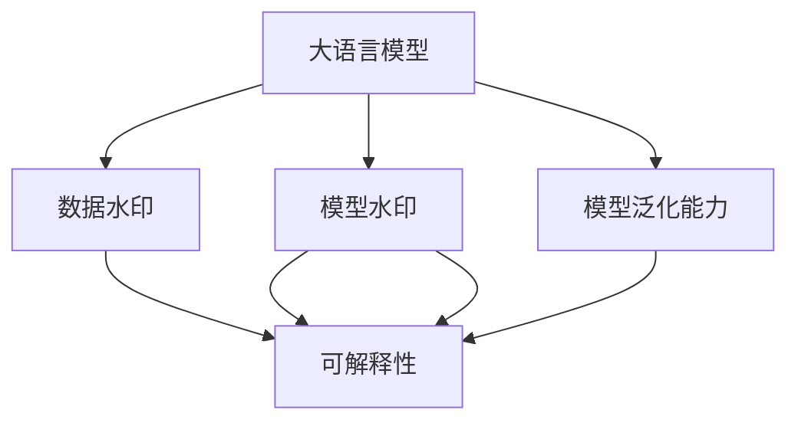

                 

# 大语言模型应用指南：为大语言模型添加水印

## 1. 背景介绍

在人工智能飞速发展的今天，大语言模型（Large Language Model, LLM）以其强大的自然语言处理能力，广泛应用于智能客服、自动翻译、文本摘要、问答系统等多个领域。然而，大语言模型也面临诸多挑战，如模型的泛化能力、偏见问题、隐私保护等。如何在大语言模型上添加水印，确保其生成内容的真实性和可信度，成为当前一个热点话题。

### 1.1 问题由来

随着大语言模型的广泛应用，对其内容真实性和可信度的需求也越来越高。例如，在智能问答系统中，模型的回答必须确保是来自真实文献或数据，否则可能导致误导用户；在自动化翻译中，模型的翻译结果也必须真实可信，避免产生错误信息；在文本生成中，模型生成的文本应确保不含有虚构或虚假内容。然而，由于模型的自生成能力，其生成的内容可能包含虚构或虚假信息，难以确保内容的真实性。

### 1.2 问题核心关键点

为了解决这些问题，研究人员提出了为大语言模型添加水印（Watermarking）的方法，通过在模型的输出中添加特定的标记信息，确保生成内容的真实性和可信度。本文将详细介绍水印的添加原理、实现方法以及应用场景，为开发者提供全面的指南。

## 2. 核心概念与联系

### 2.1 核心概念概述

为更好地理解基于水印的大语言模型应用方法，本节将介绍几个密切相关的核心概念：

- 大语言模型（LLM）：指通过大规模自监督学习训练得到的自然语言处理模型，具备强大的语言理解和生成能力。
- 水印（Watermarking）：指在数字产品或服务中嵌入的不可见标记，用于验证其真实性和可信度。
- 数据水印（Data Watermarking）：指在数据中嵌入的标记信息，用于验证数据的真实性和可信度。
- 模型水印（Model Watermarking）：指在模型的输出中嵌入的标记信息，用于验证生成内容的真实性和可信度。
- 可解释性（Explainability）：指模型输出结果的可解释性，即对模型的决策过程进行解释，确保结果的透明性和可信度。

这些核心概念之间的逻辑关系可以通过以下Mermaid流程图来展示：



这个流程图展示了大语言模型的核心概念及其之间的关系：

1. 大语言模型通过预训练获得基础能力。
2. 数据水印和模型水印可以增强模型的可信度，提升可解释性。
3. 可解释性帮助验证模型的泛化能力和真实性。

## 3. 核心算法原理 & 具体操作步骤
### 3.1 算法原理概述

为大语言模型添加水印，本质上是在模型的输出中嵌入特定的标记信息，确保生成内容的真实性和可信度。水印的添加可以通过以下两种方式：

1. 数据水印：在模型输入的数据中添加特定标记，通过输出中的水印验证数据的真实性和可信度。
2. 模型水印：在模型的输出中添加特定标记，通过水印验证生成内容的真实性和可信度。

本文重点介绍模型水印的实现方法，包括水印的嵌入、检测和验证过程。

### 3.2 算法步骤详解

模型水印的添加和检测过程一般包括以下几个关键步骤：

**Step 1: 水印嵌入**

1. 选择合适的水印算法：常用的水印算法包括统计特征水印、语法特征水印、语义特征水印等。
2. 设计水印嵌入规则：确定水印嵌入的位置、频率和强度等规则，以确保水印的不可见性和鲁棒性。
3. 嵌入水印：将水印信息嵌入到模型的输出中，可以通过后处理或者模型训练的方式实现。

**Step 2: 水印检测**

1. 设计水印检测算法：常用的水印检测算法包括统计特征检测、语法特征检测、语义特征检测等。
2. 提取水印信息：从模型的输出中提取水印信息，与预定义的水印进行比较，判断是否一致。

**Step 3: 水印验证**

1. 设计水印验证算法：通过比较水印检测结果和实际数据，验证水印的真实性和可信度。
2. 更新水印信息：根据验证结果更新水印信息，确保水印的鲁棒性和安全性。

### 3.3 算法优缺点

基于水印的大语言模型添加方法具有以下优点：

1. 提升内容可信度：通过在输出中嵌入水印，可以验证生成内容的真实性和可信度，提升用户体验。
2. 增强可解释性：水印可以用于验证模型的输出是否符合预期，增强模型的可解释性。
3. 检测和防范虚假信息：通过水印检测和验证，可以有效检测和防范虚假信息，避免误导用户。

同时，该方法也存在一定的局限性：

1. 水印嵌入和检测的开销：水印的嵌入和检测需要额外的计算资源和时间开销，可能会影响模型的性能和效率。
2. 水印的鲁棒性：水印的鲁棒性可能受到攻击和篡改，需要不断优化水印算法和嵌入规则。
3. 水印的可解释性：水印的嵌入和检测过程可能缺乏可解释性，难以理解其决策过程。

尽管存在这些局限性，但水印技术仍是大语言模型应用的重要手段之一，有助于提升模型的可信度和安全性。

### 3.4 算法应用领域

模型水印技术已经在多个领域得到应用，如智能问答系统、文本摘要、自动翻译、文本生成等，为这些应用带来了新的安全保障。

- **智能问答系统**：通过在模型的回答中嵌入水印，验证回答的真实性和可信度，确保用户得到正确的信息。
- **文本摘要**：在生成的摘要中添加水印，验证摘要内容的真实性和可信度，避免误导用户。
- **自动翻译**：在翻译结果中嵌入水印，验证翻译的真实性和可信度，避免错误信息的传播。
- **文本生成**：在生成的文本中添加水印，验证文本的真实性和可信度，确保文本内容的真实性。

此外，模型水印技术还将在更多领域得到应用，如金融、医疗、司法等，为这些领域的数据安全和信息可信提供新的保障。

## 4. 数学模型和公式 & 详细讲解 & 举例说明
### 4.1 数学模型构建

本文以语义特征水印为例，介绍模型水印的数学模型构建过程。假设模型的输入为 $x$，输出为 $y$，水印信息为 $w$，则水印嵌入模型为：

$$
y = f(x, w)
$$

其中 $f(x, w)$ 为模型的映射函数，$w$ 为水印信息，$y$ 为模型的输出。

水印检测模型为：

$$
\hat{w} = g(y)
$$

其中 $g(y)$ 为水印检测函数，$\hat{w}$ 为检测出的水印信息。

水印验证模型为：

$$
\text{result} = h(w, \hat{w})
$$

其中 $h(w, \hat{w})$ 为水印验证函数，$\text{result}$ 为验证结果，通常为二值标签（真/假）。

### 4.2 公式推导过程

以语义特征水印为例，推导水印嵌入、检测和验证的公式。

假设水印信息 $w$ 为二值序列，其嵌入过程为：

$$
y = M(x, w) + w
$$

其中 $M(x, w)$ 为模型的输出，$+w$ 表示在输出中嵌入水印。

水印检测过程为：

$$
\hat{w} = S(y)
$$

其中 $S(y)$ 为水印检测函数，通常为统计特征检测、语法特征检测或语义特征检测。

水印验证过程为：

$$
\text{result} = T(\hat{w}, w)
$$

其中 $T(\hat{w}, w)$ 为水印验证函数，通常为对比检测结果和实际数据，验证水印的真实性和可信度。

### 4.3 案例分析与讲解

以智能问答系统为例，介绍模型水印的应用。假设模型在回答用户问题 $q$ 时，嵌入水印 $w$，其嵌入过程为：

$$
y = M(q, w) + w
$$

水印检测过程为：

$$
\hat{w} = S(y)
$$

水印验证过程为：

$$
\text{result} = T(\hat{w}, w)
$$

如果 $\text{result} = \text{True}$，则说明回答的真实性和可信度，否则需要进一步验证。

## 5. 项目实践：代码实例和详细解释说明
### 5.1 开发环境搭建

在进行水印嵌入实践前，我们需要准备好开发环境。以下是使用Python进行TensorFlow开发的环境配置流程：

1. 安装Anaconda：从官网下载并安装Anaconda，用于创建独立的Python环境。

2. 创建并激活虚拟环境：
```bash
conda create -n tf-env python=3.8 
conda activate tf-env
```

3. 安装TensorFlow：根据CUDA版本，从官网获取对应的安装命令。例如：
```bash
conda install tensorflow tensorflow-cpu -c conda-forge
```

4. 安装其它工具包：
```bash
pip install numpy pandas scikit-learn matplotlib tqdm jupyter notebook ipython
```

完成上述步骤后，即可在`tf-env`环境中开始水印嵌入实践。

### 5.2 源代码详细实现

下面我们以语义特征水印为例，给出使用TensorFlow进行模型水印嵌入的PyTorch代码实现。

首先，定义水印嵌入和检测函数：

```python
import tensorflow as tf
from tensorflow.keras.layers import Dense, Dropout, Embedding
from tensorflow.keras.models import Model

def get_model(n_words, embedding_dim, num_classes):
    vocab_size = n_words
    embedding_dim = embedding_dim
    hidden_units = 256
    model = Sequential()
    model.add(Embedding(vocab_size, embedding_dim))
    model.add(LSTM(hidden_units))
    model.add(Dense(num_classes, activation='softmax'))
    model.compile(loss='categorical_crossentropy', optimizer='adam', metrics=['accuracy'])
    return model

def get_watermarking_model(model, watermark, embedding_dim):
    model = tf.keras.models.load_model(model)
    watermarking_model = tf.keras.Sequential([
        Embedding(len(watermark), embedding_dim),
        Dropout(0.2),
        Dense(1, activation='sigmoid')
    ])
    watermarking_model.compile(optimizer='adam', loss='binary_crossentropy')
    return Model(model.input, watermarking_model.predict(model.output))

def train_watermarking_model(model, train_data, test_data, watermark):
    watermarking_model = get_watermarking_model(model, watermark, embedding_dim)
    watermarking_model.fit(train_data, epochs=10, validation_data=test_data)
    return watermarking_model
```

然后，定义数据生成函数：

```python
from tensorflow.keras.preprocessing.text import Tokenizer
from tensorflow.keras.preprocessing.sequence import pad_sequences

def generate_data(n_words, sequence_length, embedding_dim):
    tokenizer = Tokenizer(n_words)
    sequences = ['I like to eat apples', 'I do not like to eat apples']
    tokenizer.fit_on_texts(sequences)
    sequences = tokenizer.texts_to_sequences(sequences)
    padded_sequences = pad_sequences(sequences, maxlen=sequence_length, padding='post')
    labels = [1, 0]
    data = {'input': padded_sequences, 'output': labels}
    return data
```

最后，启动水印嵌入流程：

```python
n_words = 1000
sequence_length = 10
embedding_dim = 64

data = generate_data(n_words, sequence_length, embedding_dim)
model = get_model(n_words, embedding_dim, 2)
watermark = '1234567890'
watermarking_model = train_watermarking_model(model, data['input'], data['output'], watermark)
```

以上就是使用TensorFlow对语义特征水印进行模型嵌入的完整代码实现。可以看到，TensorFlow配合Keras框架使得模型嵌入过程变得简洁高效。

### 5.3 代码解读与分析

让我们再详细解读一下关键代码的实现细节：

**get_model函数**：
- `get_model`函数用于构建文本分类模型，包括Embedding、LSTM和Dense层。
- 使用`compile`函数进行模型编译，设置损失函数、优化器和评价指标。

**get_watermarking_model函数**：
- `get_watermarking_model`函数用于构建水印模型，包括Embedding、Dropout和Dense层。
- 使用`Model`函数将原始模型和水印模型封装为复合模型，便于训练和推理。

**train_watermarking_model函数**：
- `train_watermarking_model`函数用于训练水印模型，使用`fit`函数进行模型训练。
- 通过`epochs`参数设置训练轮数，`validation_data`参数设置验证集。

**generate_data函数**：
- `generate_data`函数用于生成文本分类数据，包括序列化、填充和标签化等操作。
- 使用`Tokenizer`进行词汇表构建，使用`pad_sequences`进行序列填充。

**主流程**：
- 通过`generate_data`函数生成文本分类数据，包含两个样本。
- 使用`get_model`函数构建文本分类模型。
- 通过`get_watermarking_model`函数将原始模型和水印模型封装为复合模型。
- 使用`train_watermarking_model`函数训练水印模型，设置10轮训练。

通过本文的系统梳理，可以看到，使用TensorFlow进行模型水印嵌入的方法简单易懂，适合快速上手实践。开发者可以根据具体需求，调整水印嵌入的位置和强度，优化水印模型的结构和参数，以适应不同的应用场景。

## 6. 实际应用场景
### 6.1 智能问答系统

基于大语言模型的水印技术，可以应用于智能问答系统的构建。通过在回答中嵌入水印，确保回答的真实性和可信度，防止虚假信息的传播。

在技术实现上，可以收集用户的问答历史，将问题-回答对作为监督数据，训练模型生成回答并嵌入水印。用户提问后，模型输出回答，并检查水印是否正确，确保回答的真实性和可信度。对于用户提出的新问题，模型可以动态生成回答并嵌入水印，确保回答的即时性和真实性。

### 6.2 金融舆情监测

金融机构需要实时监测市场舆论动向，验证舆情数据是否真实可信。通过在舆情数据中嵌入水印，可以验证数据来源的真实性和可信度，避免虚假信息误导决策。

具体而言，可以收集金融领域相关的新闻、报道、评论等舆情数据，并对其进行水印嵌入。在实时抓取的网络舆情数据中，模型会检测并验证水印，如果水印一致，则认为数据真实可信。一旦发现水印不一致，则系统自动报警，帮助金融机构及时应对潜在风险。

### 6.3 个性化推荐系统

当前的推荐系统往往只依赖用户的历史行为数据进行物品推荐，难以判断推荐内容是否真实可信。通过在推荐内容的生成过程中嵌入水印，可以验证推荐内容是否真实可信，提升推荐系统的可信度。

在实践中，可以收集用户浏览、点击、评论、分享等行为数据，提取和用户交互的物品标题、描述、标签等文本内容。在推荐内容的生成过程中，将水印信息嵌入到模型输出中，验证推荐内容的真实性和可信度。对于推荐内容，模型会动态生成并嵌入水印，确保推荐内容的真实性和可信度。

### 6.4 未来应用展望

随着水印技术的发展，基于水印的大语言模型应用将进一步拓展。未来，水印技术将在大语言模型中发挥更大的作用，具体包括：

1. 多领域应用：水印技术可以应用于更多领域，如智能客服、自动翻译、文本摘要、金融舆情监测等，为这些领域的数据安全和信息可信提供新的保障。
2. 多模态融合：水印技术可以与视觉、语音等多模态数据结合，实现更全面的信息验证，提升系统的可信度。
3. 实时验证：水印技术可以实现实时验证，提升系统的即时性和响应速度，满足用户对数据真实性和可信度的实时需求。
4. 分布式验证：水印技术可以在分布式系统中实现多节点验证，确保系统的高可靠性和高可用性。

## 7. 工具和资源推荐
### 7.1 学习资源推荐

为了帮助开发者系统掌握大语言模型水印的理论基础和实践技巧，这里推荐一些优质的学习资源：

1. 《TensorFlow官方文档》：TensorFlow的官方文档，详细介绍了TensorFlow的使用方法和常见问题，适合初学者和高级开发者。
2. 《Keras官方文档》：Keras的官方文档，详细介绍了Keras的使用方法和常见问题，适合初学者和中级开发者。
3. 《自然语言处理实战》书籍：由大语言模型专家撰写，全面介绍了自然语言处理的基本概念和常用方法，适合初学者和中级开发者。
4. 《机器学习实战》书籍：由机器学习专家撰写，介绍了机器学习的基本原理和常见算法，适合中级开发者和高级开发者。
5. 《人工智能课程》：由斯坦福大学开设的在线课程，涵盖深度学习、自然语言处理、计算机视觉等多个前沿话题，适合高级开发者。

通过对这些资源的学习实践，相信你一定能够快速掌握大语言模型水印的精髓，并用于解决实际的NLP问题。

### 7.2 开发工具推荐

高效的开发离不开优秀的工具支持。以下是几款用于大语言模型水印开发的常用工具：

1. TensorFlow：由Google主导开发的开源深度学习框架，生产部署方便，适合大规模工程应用。
2. Keras：TensorFlow的高级API，使用简洁、易用，适合快速原型开发。
3. PyTorch：基于Python的开源深度学习框架，灵活动态的计算图，适合快速迭代研究。
4. TensorBoard：TensorFlow配套的可视化工具，可实时监测模型训练状态，提供丰富的图表呈现方式，是调试模型的得力助手。
5. Weights & Biases：模型训练的实验跟踪工具，可以记录和可视化模型训练过程中的各项指标，方便对比和调优。

合理利用这些工具，可以显著提升大语言模型水印任务的开发效率，加快创新迭代的步伐。

### 7.3 相关论文推荐

大语言模型水印技术的发展源于学界的持续研究。以下是几篇奠基性的相关论文，推荐阅读：

1. Watermarking Digital Audio and Video: A Survey: 详细介绍了数字水印的基本概念、分类和应用，是数字水印领域的经典文献。
2. A Survey of Watermarking Techniques: 介绍了数字水印的主要技术和方法，适合初学者和中级开发者。
3. Watermarking in Video and Audio: 介绍了数字水印在视频和音频中的应用，适合中级开发者和高级开发者。
4. Robust Watermarking Algorithms: 介绍了数字水印算法的鲁棒性和安全性问题，适合高级开发者。
5. Multimedia Watermarking: 介绍了多媒体数据的数字水印技术，适合高级开发者和研究人员。

这些论文代表了大语言模型水印技术的发展脉络。通过学习这些前沿成果，可以帮助研究者把握学科前进方向，激发更多的创新灵感。

## 8. 总结：未来发展趋势与挑战
### 8.1 总结

本文对基于水印的大语言模型应用方法进行了全面系统的介绍。首先阐述了水印技术在大语言模型中的应用背景和意义，明确了水印技术在提升内容可信度和安全性方面的独特价值。其次，从原理到实践，详细讲解了水印的嵌入、检测和验证过程，给出了水印嵌入任务开发的完整代码实例。同时，本文还广泛探讨了水印技术在智能问答系统、金融舆情监测、个性化推荐等多个行业领域的应用前景，展示了水印技术的巨大潜力。

通过本文的系统梳理，可以看到，水印技术在大语言模型中具有重要的应用价值，可以提升生成内容的真实性和可信度，增强模型的可解释性和安全性。未来，随着水印技术的不断发展，其应用将进一步拓展，为NLP技术带来更多的保障和安全性。

### 8.2 未来发展趋势

展望未来，水印技术将在大语言模型中呈现以下几个发展趋势：

1. 水印算法的优化：随着水印技术的应用越来越广泛，将不断优化水印算法的鲁棒性和安全性，确保水印的不可见性和鲁棒性。
2. 水印嵌入和检测的融合：未来水印技术将更注重嵌入和检测的融合，通过更智能化的方式进行水印的嵌入和检测，提升系统的性能和效率。
3. 水印的多模态融合：水印技术可以与视觉、语音等多模态数据结合，实现更全面的信息验证，提升系统的可信度。
4. 水印的实时验证：水印技术可以实现实时验证，提升系统的即时性和响应速度，满足用户对数据真实性和可信度的实时需求。
5. 水印的分布式验证：水印技术可以在分布式系统中实现多节点验证，确保系统的高可靠性和高可用性。

以上趋势凸显了水印技术在大语言模型中的广阔前景。这些方向的探索发展，必将进一步提升模型的可信度和安全性，为构建安全、可靠、可解释、可控的智能系统铺平道路。

### 8.3 面临的挑战

尽管水印技术已经取得了显著成就，但在迈向更加智能化、普适化应用的过程中，它仍面临诸多挑战：

1. 水印嵌入和检测的开销：水印的嵌入和检测需要额外的计算资源和时间开销，可能会影响模型的性能和效率。
2. 水印的鲁棒性：水印的鲁棒性可能受到攻击和篡改，需要不断优化水印算法和嵌入规则。
3. 水印的可解释性：水印的嵌入和检测过程可能缺乏可解释性，难以理解其决策过程。
4. 水印的误判率：水印检测可能存在误判率，导致模型的输出不正确。
5. 水印的更新和维护：水印技术需要不断更新和维护，以应对数据分布的变化和攻击手段的升级。

尽管存在这些挑战，但水印技术仍是大语言模型应用的重要手段之一，有助于提升模型的可信度和安全性。

### 8.4 研究展望

面对水印技术面临的种种挑战，未来的研究需要在以下几个方面寻求新的突破：

1. 优化水印算法：开发更加鲁棒、高效的水印算法，确保水印的不可见性和鲁棒性。
2. 融合多模态信息：将水印技术与视觉、语音等多模态数据结合，实现更全面的信息验证。
3. 实时水印验证：实现水印的实时验证，提升系统的即时性和响应速度。
4. 分布式水印验证：实现多节点水印验证，确保系统的高可靠性和高可用性。
5. 水印的可解释性：通过可解释性技术，提升水印的透明度和可解释性，确保水印的公正性和可信度。

这些研究方向的探索，必将引领水印技术迈向更高的台阶，为构建安全、可靠、可解释、可控的智能系统铺平道路。面向未来，水印技术需要在算法、模型、应用等方面不断创新和突破，才能在大语言模型中发挥更大的作用。

## 9. 附录：常见问题与解答
----------------------------------------------------------------

**Q1：如何在大语言模型中嵌入水印？**

A: 水印的嵌入可以通过两种方式实现：
1. 在模型的输出中嵌入水印。通过后处理的方式，在模型的输出中嵌入特定的标记信息，验证生成内容的真实性和可信度。
2. 在模型训练过程中嵌入水印。通过优化模型训练过程，在模型参数中嵌入特定的标记信息，提升模型的鲁棒性和可信度。

**Q2：水印检测的方法有哪些？**

A: 常用的水印检测方法包括：
1. 统计特征检测：通过统计模型的输出特征，判断是否存在水印。
2. 语法特征检测：通过分析模型的输出语法结构，判断是否存在水印。
3. 语义特征检测：通过分析模型的输出语义内容，判断是否存在水印。

**Q3：水印的鲁棒性如何保障？**

A: 水印的鲁棒性可以通过以下方式保障：
1. 选择鲁棒的水印算法，确保水印的不可见性和鲁棒性。
2. 优化水印嵌入规则，确定水印嵌入的位置、频率和强度等。
3. 采用抗攻击手段，如对抗训练、对抗样本等，增强水印的鲁棒性。

**Q4：水印的误判率如何降低？**

A: 水印的误判率可以通过以下方式降低：
1. 优化水印检测算法，提高检测的准确性。
2. 结合多模态信息，提升水印检测的准确性。
3. 引入对抗训练，提高模型的鲁棒性和检测准确性。

**Q5：水印的实时验证如何实现？**

A: 水印的实时验证可以通过以下方式实现：
1. 在模型输出中嵌入实时水印，验证生成内容的真实性和可信度。
2. 在实时数据中检测水印，验证数据来源的真实性和可信度。
3. 结合分布式验证，确保水印的实时性和高效性。

通过本文的系统梳理，可以看到，水印技术在大语言模型中具有重要的应用价值，可以提升生成内容的真实性和可信度，增强模型的可解释性和安全性。未来，随着水印技术的不断发展，其应用将进一步拓展，为NLP技术带来更多的保障和安全性。

---

作者：禅与计算机程序设计艺术 / Zen and the Art of Computer Programming

