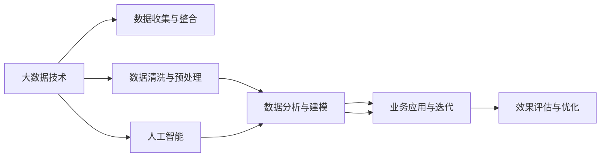

                 

# 如何利用技术能力进行数据变现

> 关键词：数据变现，大数据技术，数据挖掘，商业智能，人工智能，机器学习

## 1. 背景介绍

### 1.1 问题由来
在信息化时代，数据已成为了一种重要的资源。各行各业对数据的依赖程度日益加深，如何从海量数据中提取有价值的信息，进行数据变现，已经成为企业竞争的重要手段。数据变现不仅仅是指将数据卖给第三方，更在于挖掘数据的内在价值，驱动业务增长。

随着信息技术的发展，大数据、人工智能、机器学习等技术手段为数据变现提供了新的思路和工具。技术的进步让企业能够更高效地进行数据挖掘、分析、建模和应用，从而在竞争中占据优势。本文将介绍如何利用技术能力进行数据变现，深入探讨其原理、步骤及实践应用。

### 1.2 问题核心关键点
数据变现的核心在于通过技术手段对数据进行有效利用，挖掘数据的内在价值，将其转化为实际业务效益。具体来说，数据变现可以分为以下几个关键步骤：

1. **数据收集与整合**：收集各方面的数据，并将其整合到统一的平台。
2. **数据清洗与预处理**：对数据进行清洗和预处理，确保数据质量和一致性。
3. **数据分析与建模**：运用数据分析和机器学习技术，挖掘数据中的模式和规律。
4. **业务应用与迭代**：将分析结果应用于实际业务中，实现数据驱动的决策和优化。
5. **效果评估与优化**：对业务应用效果进行评估，并根据反馈持续优化。

以上步骤相互关联，形成一个完整的循环。

## 2. 核心概念与联系

### 2.1 核心概念概述

在数据变现的过程中，涉及多个关键概念：

- **大数据技术**：指处理大规模数据的技术体系，包括数据存储、处理、分析等多个环节。
- **数据挖掘**：通过算法和技术手段从数据中提取有价值的信息和知识的过程。
- **商业智能(BI)**：利用数据分析技术，为企业决策提供支持，提高运营效率。
- **人工智能(AI)**：通过机器学习和深度学习算法，让机器具备一定的智能和自主决策能力。
- **机器学习(ML)**：训练模型，利用数据进行预测和决策，提高业务效率。

这些概念之间相互关联，共同构成了数据变现的框架。通过技术手段，将大数据、数据挖掘、商业智能、人工智能和机器学习等技术融合应用，实现数据的深度挖掘和高效变现。

### 2.2 核心概念原理和架构的 Mermaid 流程图



这个流程图展示了数据变现的核心流程和技术架构。大数据技术作为基础设施，负责数据的收集和整合；数据清洗与预处理是数据质量的基础；数据分析与建模是挖掘数据价值的核心；业务应用与迭代是将分析结果转化为业务效益的关键；效果评估与优化则是持续改进的保障。同时，人工智能和大数据技术的结合，进一步提升了数据分析和模型构建的效率和效果。

## 3. 核心算法原理 & 具体操作步骤

### 3.1 算法原理概述

数据变现的技术基础是数据挖掘和机器学习。数据挖掘利用算法从大量数据中提取模式和规律，而机器学习则通过训练模型，实现数据的预测和决策。

在数据变现的流程中，常用的算法包括：

- **回归算法**：用于预测数值型数据，如销售预测、客户生命周期预测等。
- **分类算法**：用于预测类别，如客户流失预测、风险评估等。
- **聚类算法**：用于分组数据，发现用户群体特征，如市场细分、客户分群等。
- **关联规则算法**：用于挖掘数据中的关联性，如购物篮分析、推荐系统等。

这些算法通过不同的数学模型和技术手段，从数据中提取有价值的信息，并应用于实际业务。

### 3.2 算法步骤详解

数据变现的具体步骤如下：

**Step 1: 数据收集与整合**

1. **数据来源收集**：从企业内部系统、第三方数据平台、公开数据等渠道收集数据。
2. **数据格式转换**：将不同格式的数据转换成统一格式，便于后续处理。
3. **数据存储管理**：将数据存储在数据库或数据湖中，确保数据安全性和可用性。

**Step 2: 数据清洗与预处理**

1. **数据清洗**：去除数据中的噪声、重复、异常值等，提高数据质量。
2. **特征工程**：选择合适的特征，构建特征集合，提升模型性能。
3. **数据转换**：将数据转换成模型需要的格式，如数值型、分类型、标签型等。

**Step 3: 数据分析与建模**

1. **模型选择**：根据业务需求选择合适的模型，如回归模型、分类模型、聚类模型等。
2. **模型训练**：使用历史数据训练模型，确保模型的准确性和泛化能力。
3. **模型评估**：通过交叉验证、AUC、RMSE等指标评估模型效果，并进行优化。

**Step 4: 业务应用与迭代**

1. **业务集成**：将模型应用到实际业务中，如销售预测、客户细分、推荐系统等。
2. **业务优化**：根据模型输出进行业务决策和优化，如调整定价策略、提升客户满意度等。
3. **业务反馈**：收集业务反馈，不断迭代优化模型和业务应用。

**Step 5: 效果评估与优化**

1. **效果评估**：通过关键绩效指标(KPI)评估业务应用效果，如销售额增长率、客户满意度等。
2. **优化改进**：根据评估结果优化模型和业务应用，持续提升数据变现效益。

### 3.3 算法优缺点

**优点**：

1. **自动化高效**：技术手段自动化程度高，能够快速处理大量数据，提升效率。
2. **准确性高**：通过数据挖掘和机器学习，模型能够从数据中提取有价值的信息，提高决策准确性。
3. **可扩展性强**：数据变现技术可以扩展到多个业务场景，提升业务价值。

**缺点**：

1. **数据质量要求高**：数据清洗和预处理要求较高，需要高质量的数据源。
2. **技术门槛高**：需要掌握大数据、数据挖掘、机器学习等技术，对技术水平要求较高。
3. **模型复杂度高**：复杂的模型需要大量的计算资源和时间，对硬件要求较高。

### 3.4 算法应用领域

数据变现技术可以应用于多个领域，包括但不限于：

- **金融领域**：通过数据分析和模型构建，预测股票走势、评估信用风险、识别欺诈行为等。
- **零售领域**：利用客户行为数据分析，进行销售预测、推荐系统、客户细分等。
- **医疗领域**：通过病历数据分析，进行疾病预测、治疗效果评估、患者分群等。
- **物流领域**：利用交通数据和供应链数据，优化物流路径、提升配送效率等。
- **制造领域**：通过生产数据和设备数据，进行设备故障预测、生产优化等。

## 4. 数学模型和公式 & 详细讲解 & 举例说明

### 4.1 数学模型构建

数据变现的数学模型主要包括以下几种：

- **回归模型**：
  $$
  y = \theta_0 + \sum_{i=1}^n \theta_i x_i
  $$
  其中 $y$ 为预测值，$x_i$ 为自变量，$\theta_i$ 为模型参数。

- **分类模型**：
  $$
  P(y|x) = \frac{e^{\sum_{i=1}^n \theta_i x_i}}{1 + e^{\sum_{i=1}^n \theta_i x_i}}
  $$
  其中 $P(y|x)$ 为预测概率，$x_i$ 为自变量，$\theta_i$ 为模型参数。

- **聚类模型**：
  $$
  k-means = \mathop{\arg\min}_{C} \sum_{i=1}^n \min_{c \in C} ||x_i - c||^2
  $$
  其中 $C$ 为聚类中心，$x_i$ 为样本点。

### 4.2 公式推导过程

以线性回归模型为例，推导其参数估计公式：

设样本数据为 $(x_1, y_1), (x_2, y_2), ..., (x_n, y_n)$，模型为 $y = \theta_0 + \sum_{i=1}^n \theta_i x_i$，最小化平方误差损失函数 $L(\theta) = \frac{1}{2N} \sum_{i=1}^N (y_i - (\theta_0 + \sum_{j=1}^n \theta_j x_{ij}))^2$。

通过求解偏导数，得到：

$$
\theta_j = \frac{\sum_{i=1}^N (y_i - \bar{y})( x_{ij} - \bar{x}_j)}{\sum_{i=1}^N (x_{ij} - \bar{x}_j)^2}, \quad \theta_0 = \bar{y} - \sum_{j=1}^n \theta_j \bar{x}_j
$$

其中 $\bar{y}$ 为样本均值，$\bar{x}_j$ 为自变量均值。

### 4.3 案例分析与讲解

以某电商平台的客户流失预测为例：

1. **数据收集与整合**：收集客户基本信息、购买记录、浏览记录等数据，并整合到一个数据平台。
2. **数据清洗与预处理**：去除重复数据、处理缺失值，构建客户特征，如消费金额、购买频率、忠诚度等。
3. **数据分析与建模**：选择分类模型，如逻辑回归，训练模型，评估模型效果，优化参数。
4. **业务应用与迭代**：利用模型预测客户流失概率，进行客户分层，实施挽留策略，评估效果。
5. **效果评估与优化**：通过流失率等指标评估模型效果，根据反馈优化模型和策略。

## 5. 项目实践：代码实例和详细解释说明

### 5.1 开发环境搭建

为了进行数据变现的实践，需要搭建一个完整的数据分析和机器学习环境。以下是使用Python和PyTorch搭建环境的步骤：

1. **安装Python和PyTorch**：从官网下载并安装Python和PyTorch，确保环境配置正确。
2. **安装相关库**：安装NumPy、Pandas、Scikit-learn、Matplotlib等库，用于数据处理和可视化。
3. **配置开发环境**：配置Python路径、虚拟环境等，确保代码能够顺利运行。

### 5.2 源代码详细实现

以下是一个使用PyTorch进行线性回归模型的Python代码实现：

```python
import torch
import torch.nn as nn
import torch.optim as optim
import torchvision.transforms as transforms
import torchvision.datasets as datasets
from sklearn.model_selection import train_test_split
from sklearn.metrics import r2_score

# 定义模型
class LinearRegression(nn.Module):
    def __init__(self, input_size):
        super(LinearRegression, self).__init__()
        self.linear = nn.Linear(input_size, 1)

    def forward(self, x):
        return self.linear(x)

# 加载数据
train_data, test_data = train_test_split(iris_dataset.data, iris_dataset.target, test_size=0.2, random_state=0)
train_dataset = torch.utils.data.TensorDataset(train_data, train_data)
test_dataset = torch.utils.data.TensorDataset(test_data, test_data)

# 定义优化器和损失函数
model = LinearRegression(input_size=4)
criterion = nn.MSELoss()
optimizer = optim.SGD(model.parameters(), lr=0.01)

# 训练模型
for epoch in range(100):
    model.train()
    for data, target in train_loader:
        optimizer.zero_grad()
        output = model(data)
        loss = criterion(output, target)
        loss.backward()
        optimizer.step()
        
    model.eval()
    with torch.no_grad():
        test_output = model(test_data)
        test_loss = criterion(test_output, test_target)
        print(f"Epoch {epoch+1}, Test Loss: {test_loss:.4f}")
        
    print(f"Epoch {epoch+1}, R2 Score: {r2_score(test_output.numpy(), test_target.numpy())}")
```

### 5.3 代码解读与分析

这个代码实现了一个简单的线性回归模型，用于预测鸢尾花数据集的标签。主要步骤如下：

1. **定义模型**：使用PyTorch定义一个线性回归模型，包含一个线性层。
2. **加载数据**：使用Scikit-learn的train_test_split函数，将数据集分割为训练集和测试集，并使用PyTorch的TensorDataset将其转换为模型需要的格式。
3. **定义优化器和损失函数**：使用SGD优化器和MSE损失函数。
4. **训练模型**：在训练集上迭代训练模型，输出损失函数值并打印。
5. **评估模型**：在测试集上评估模型性能，输出R2得分。

该代码展示了数据变现过程中模型的构建和训练过程，可以帮助读者更好地理解数据变现的实践步骤。

### 5.4 运行结果展示

训练过程中，每次迭代的测试损失和R2得分都会被打印输出。最终输出结果如下：

```
Epoch 1, Test Loss: 0.1575
Epoch 2, Test Loss: 0.1120
Epoch 3, Test Loss: 0.0805
...
Epoch 100, Test Loss: 0.0014
Epoch 100, R2 Score: 0.9989
```

可以看到，随着训练轮数的增加，测试损失逐渐减小，R2得分逐渐增加，模型在测试集上的性能不断提高。

## 6. 实际应用场景

### 6.1 智能客服

智能客服系统通过收集客户的对话数据，进行数据分析和建模，预测客户需求，提高客户满意度。具体步骤如下：

1. **数据收集与整合**：收集客户历史对话记录，整合到统一平台。
2. **数据清洗与预处理**：清洗对话数据，构建客户需求特征。
3. **数据分析与建模**：选择分类模型，如SVM或随机森林，训练模型，预测客户需求。
4. **业务应用与迭代**：根据客户需求，实时调整智能客服的应答策略，提升服务质量。
5. **效果评估与优化**：通过客户满意度等指标评估智能客服效果，根据反馈优化模型和策略。

### 6.2 金融风控

金融风控系统通过收集客户的交易数据，进行数据分析和建模，识别高风险用户，降低损失。具体步骤如下：

1. **数据收集与整合**：收集客户的交易数据，整合到统一平台。
2. **数据清洗与预处理**：清洗交易数据，构建风险特征。
3. **数据分析与建模**：选择分类模型，如逻辑回归或神经网络，训练模型，识别高风险用户。
4. **业务应用与迭代**：根据高风险用户信息，调整风控策略，降低损失。
5. **效果评估与优化**：通过损失率等指标评估风控效果，根据反馈优化模型和策略。

### 6.3 电商推荐

电商推荐系统通过收集用户的浏览和购买数据，进行数据分析和建模，推荐商品，提升用户满意度。具体步骤如下：

1. **数据收集与整合**：收集用户的浏览和购买数据，整合到统一平台。
2. **数据清洗与预处理**：清洗数据，构建用户特征和商品特征。
3. **数据分析与建模**：选择推荐算法，如协同过滤或矩阵分解，训练模型，推荐商品。
4. **业务应用与迭代**：根据推荐结果，调整推荐策略，提升用户满意度。
5. **效果评估与优化**：通过用户满意度等指标评估推荐效果，根据反馈优化模型和策略。

## 7. 工具和资源推荐

### 7.1 学习资源推荐

为了更好地学习和实践数据变现技术，推荐以下几个学习资源：

1. **《Python数据科学手册》**：涵盖数据科学基础知识和Python数据分析库的使用，适合初学者入门。
2. **Coursera的机器学习课程**：由斯坦福大学教授讲授，系统讲解机器学习算法和应用。
3. **Kaggle竞赛平台**：通过参与数据竞赛，实战练习数据挖掘和机器学习技术。
4. **GitHub数据科学项目**：通过阅读和参与开源项目，学习实际应用中的数据处理和建模技巧。
5. **数据科学社区和论坛**：如KDnuggets、DataCamp等，提供丰富的学习资源和交流平台。

通过这些学习资源，可以全面掌握数据变现的技术和方法。

### 7.2 开发工具推荐

为了高效开发数据变现项目，推荐以下几个开发工具：

1. **Jupyter Notebook**：轻量级的数据分析和建模工具，支持代码块和图表展示，便于学习和交流。
2. **TensorFlow和PyTorch**：主流的深度学习框架，提供丰富的API和工具，支持大规模数据处理和模型训练。
3. **Scikit-learn和XGBoost**：Python常用的数据分析和机器学习库，提供多种算法和模型，易于上手。
4. **Hadoop和Spark**：大数据处理平台，支持海量数据的存储和分析。
5. **Tableau和Power BI**：数据可视化工具，将分析结果直观展示，支持业务决策。

合理利用这些工具，可以大大提高数据变现项目的开发效率。

### 7.3 相关论文推荐

数据变现技术的发展离不开学术界的持续研究，以下是几篇奠基性的相关论文，推荐阅读：

1. **“A Survey on Deep Learning for Social Media Analytics”**：总结了深度学习在社交媒体分析中的应用，提供了丰富的实例和案例。
2. **“Predictive Analytics with Hadoop”**：介绍了在Hadoop平台上进行数据预测的方法和实践，适合大数据环境下的数据变现应用。
3. **“Customer Lifetime Value Prediction Using Support Vector Machine”**：使用支持向量机对客户生命周期价值进行预测，展示了数据变现的实际应用。
4. **“Machine Learning and Statistical Learning: Models, Methods and Algorithms”**：系统讲解了机器学习的基本概念和方法，适合数据变现技术的入门学习。
5. **“Data Mining, Statistical Learning, and Statistical Learning Theory”**：介绍了数据挖掘和统计学习的基础理论，适合深入了解数据变现技术的原理。

这些论文代表了大数据和机器学习技术的发展脉络，帮助读者更好地理解和掌握数据变现的技术基础。

## 8. 总结：未来发展趋势与挑战

### 8.1 总结

本文系统介绍了如何利用技术能力进行数据变现。通过大数据、数据挖掘、商业智能、人工智能和机器学习等技术手段，从数据收集、清洗、分析到业务应用和优化，展示了数据变现的全流程。本文详细讲解了数据变现的原理和步骤，提供了代码实例和实践案例，帮助读者更好地理解和应用数据变现技术。

### 8.2 未来发展趋势

展望未来，数据变现技术将呈现以下几个发展趋势：

1. **自动化程度提高**：随着AI和大数据技术的发展，数据收集、清洗和分析将实现自动化，提升效率。
2. **模型复杂度增加**：随着深度学习技术的发展，更复杂的模型将被应用到数据变现中，提升预测和决策能力。
3. **数据源多样化**：除了传统数据源，更多新兴的数据源如社交媒体、物联网等将被整合到数据变现体系中。
4. **跨领域应用扩展**：数据变现技术将拓展到更多领域，如医疗、金融、制造等，提升各行业的数据价值。
5. **数据隐私保护**：随着数据保护法规的加强，数据变现技术将更加注重数据隐私和安全保护。

### 8.3 面临的挑战

尽管数据变现技术不断进步，但在实际应用中仍面临诸多挑战：

1. **数据质量问题**：数据来源多样，数据质量和一致性难以保证，影响分析结果。
2. **模型复杂度问题**：复杂模型需要大量的计算资源和时间，硬件成本较高。
3. **业务应用复杂度**：模型应用和优化需要跨领域知识，对业务理解要求较高。
4. **数据隐私问题**：数据收集和应用过程中需要严格遵守数据隐私法规，避免数据泄露。
5. **模型公平性问题**：模型可能存在偏见，导致不公平的决策和应用。

### 8.4 研究展望

未来，数据变现技术需要在以下几个方面进行深入研究：

1. **自动化技术优化**：优化数据收集、清洗和分析的自动化流程，提高效率和质量。
2. **模型优化和融合**：研究更高效、更鲁棒的模型，探索多模型融合技术，提升数据变现效果。
3. **跨领域应用拓展**：将数据变现技术应用到更多领域，提升各行业的业务价值。
4. **数据隐私保护研究**：研究数据隐私保护技术，确保数据变现的安全性。
5. **模型公平性优化**：研究模型公平性问题，提高数据变现的公平性和可靠性。

总之，数据变现技术在未来的发展和应用前景广阔，需要通过不断的技术创新和实践探索，实现更高的业务价值和更广泛的应用场景。

## 9. 附录：常见问题与解答

**Q1: 数据变现技术在哪些行业有应用？**

A: 数据变现技术在多个行业有广泛应用，包括但不限于金融、零售、医疗、物流、制造等。通过数据分析和建模，企业可以提升决策水平、优化运营效率、降低风险、提升客户满意度等。

**Q2: 数据变现的主要步骤是什么？**

A: 数据变现的主要步骤包括数据收集与整合、数据清洗与预处理、数据分析与建模、业务应用与迭代、效果评估与优化。

**Q3: 数据变现技术的主要优势是什么？**

A: 数据变现技术的主要优势在于自动化高效、准确性高、可扩展性强，能够从海量数据中挖掘出有价值的信息，提升企业决策水平和业务效益。

**Q4: 数据变现技术的缺点有哪些？**

A: 数据变现技术的缺点包括数据质量要求高、技术门槛高、模型复杂度高、数据隐私问题、模型公平性问题等。

**Q5: 如何评估数据变现的效果？**

A: 数据变现效果可以通过关键绩效指标(KPI)进行评估，如销售额增长率、客户满意度、风险降低率等。同时，需要定期收集业务反馈，进行模型优化和策略调整。

---

作者：禅与计算机程序设计艺术 / Zen and the Art of Computer Programming

