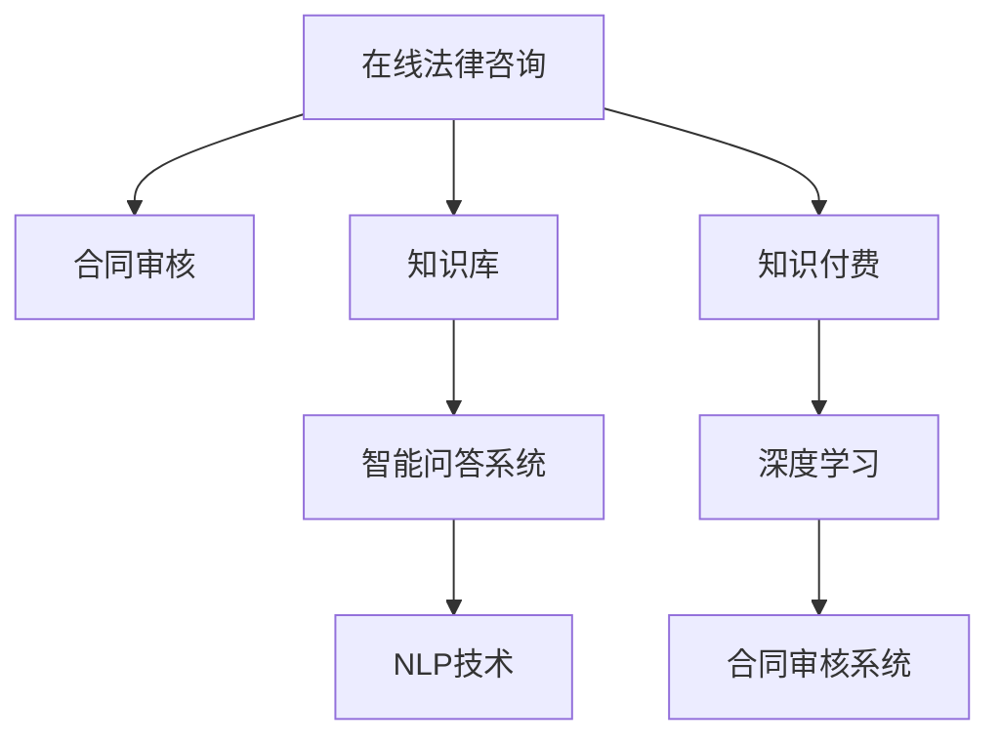

                 

# 如何利用知识付费实现在线法律咨询与合同审核服务？

在当今快速发展的数字化时代，人们越来越依赖于网络提供的服务，特别是在法律领域。通过知识付费，提供在线法律咨询与合同审核服务成为了一个新兴的趋势。本文将详细探讨如何利用知识付费实现这一目标，从核心概念与联系、核心算法原理、数学模型与公式、项目实践、实际应用场景等多个方面进行系统分析。

## 1. 背景介绍

### 1.1 问题由来
随着互联网的普及和知识付费平台的兴起，用户对于获取专业法律服务的期望日益提升。传统的线下法律服务存在诸多限制，如时间和地域的限制、高昂的咨询费用等问题。知识付费模式的出现，使得用户可以更加便捷、经济地获取专业法律服务。在线法律咨询与合同审核服务作为其中的一部分，具有广阔的市场前景。

### 1.2 问题核心关键点
在线法律咨询与合同审核服务的核心在于将法律专家的知识与技术结合，通过知识付费平台为用户提供便捷、经济的专业服务。这一服务的实现依赖于以下几个关键点：
- 知识库的构建与维护：收集整理法律知识，构建专业的法律知识库。
- 智能问答系统的构建：使用自然语言处理技术构建智能问答系统，能够回答用户的法律问题。
- 合同审核系统的构建：使用深度学习技术构建合同审核系统，能够自动化审核合同内容。
- 服务定价与收益模式：设计合理的服务定价与收益模式，确保平台的可持续发展。

## 2. 核心概念与联系

### 2.1 核心概念概述

- **在线法律咨询**：通过知识付费平台提供在线法律咨询服务，用户可以随时获取专业法律建议。
- **合同审核**：使用深度学习模型自动化审核合同内容，确保合同的合规性与公正性。
- **知识付费**：用户为获取专业知识或服务而支付费用，平台向专家支付费用，实现知识的商业化。
- **自然语言处理(NLP)**：利用NLP技术实现智能问答系统的构建。
- **深度学习**：使用深度学习模型构建合同审核系统，提高审核效率与准确性。

这些核心概念之间的逻辑关系可以通过以下Mermaid流程图来展示：



这个流程图展示了大语言模型的核心概念及其之间的关系：

1. 在线法律咨询通过合同审核获取合同信息，并基于知识库回答用户问题。
2. 合同审核系统依赖深度学习模型，提高审核效率与准确性。
3. 知识付费平台提供服务与收益，促进知识共享。
4. 智能问答系统通过NLP技术实现。
5. 知识库的构建与维护是核心基础。

## 3. 核心算法原理 & 具体操作步骤
### 3.1 算法原理概述

在线法律咨询与合同审核服务的实现依赖于以下核心算法原理：

- **自然语言处理(NLP)**：用于构建智能问答系统，能够理解和回答用户问题。
- **深度学习模型**：用于合同审核系统，自动化审核合同内容。
- **知识库构建与维护**：提供专业的法律知识库，用于支撑智能问答系统与合同审核系统。

### 3.2 算法步骤详解

#### 3.2.1 知识库构建与维护
1. **数据收集**：收集法律相关领域的文档、法规、案例等，构建全面的法律知识库。
2. **数据预处理**：清洗和标注数据，确保数据质量。
3. **模型训练**：使用深度学习模型训练知识库，使其能够回答问题。
4. **知识更新**：定期更新知识库，保持其时效性和准确性。

#### 3.2.2 智能问答系统构建
1. **需求分析**：明确问答系统需要回答的问题类型。
2. **模型选择**：选择合适的NLP模型，如BERT、GPT等。
3. **模型训练**：使用法律领域的文本数据训练问答模型。
4. **系统集成**：将训练好的模型集成到问答系统中。

#### 3.2.3 合同审核系统构建
1. **需求分析**：明确合同审核系统的功能需求。
2. **模型选择**：选择合适的深度学习模型，如LSTM、GRU等。
3. **模型训练**：使用合同数据集训练审核模型。
4. **系统集成**：将训练好的模型集成到审核系统中。

### 3.3 算法优缺点

#### 3.3.1 智能问答系统的优点与缺点
- **优点**：
  - 提供实时、便捷的法律咨询服务。
  - 减轻法律顾问的工作量，提高效率。
- **缺点**：
  - 对问答系统的准确性依赖较高，回答质量受限于知识库的完备性与模型的性能。
  - 对于复杂问题，智能问答系统可能无法给出满意答案。

#### 3.3.2 合同审核系统的优点与缺点
- **优点**：
  - 自动化审核合同内容，提高审核效率。
  - 减少人工审核成本，降低出错率。
- **缺点**：
  - 对合同审核模型的性能依赖较高，审核结果可能受限于数据质量和模型训练效果。
  - 对于复杂的合同，可能无法全面审核。

### 3.4 算法应用领域

在线法律咨询与合同审核服务主要应用于以下领域：

- **法律服务机构**：提供在线法律咨询服务，提高服务效率与客户满意度。
- **企业法务部门**：审核合同内容，确保合同合法有效。
- **个人用户**：获取专业法律咨询，解决日常法律问题。

## 4. 数学模型和公式 & 详细讲解 & 举例说明

### 4.1 数学模型构建

#### 4.1.1 智能问答系统
智能问答系统基于NLP技术，使用深度学习模型构建。以BERT为例，模型结构如下：

$$
\text{BERT} = \text{Embedding} + \text{Transformer}
$$

其中，Embedding层将输入文本转换为向量表示，Transformer层进行自注意力机制，学习文本的语义关系。

#### 4.1.2 合同审核系统
合同审核系统基于深度学习模型，以LSTM为例，模型结构如下：

$$
\text{LSTM} = \text{Embedding} + \text{LSTM} + \text{Dense}
$$

其中，Embedding层将合同文本转换为向量表示，LSTM层进行时序建模，Dense层进行分类输出。

### 4.2 公式推导过程

#### 4.2.1 智能问答系统
智能问答系统使用最大似然估计，计算模型参数。以BERT为例，目标函数为：

$$
\mathcal{L} = -\sum_{i=1}^N \log p(y_i | x_i)
$$

其中，$y_i$为标签，$x_i$为输入文本，$p$为概率分布。

#### 4.2.2 合同审核系统
合同审核系统使用交叉熵损失函数，计算模型参数。以LSTM为例，目标函数为：

$$
\mathcal{L} = -\frac{1}{N}\sum_{i=1}^N \sum_{j=1}^C y_{ij} \log p(y_{ij} | x_i)
$$

其中，$y_{ij}$为标签，$x_i$为合同文本，$p$为概率分布。

### 4.3 案例分析与讲解

#### 4.3.1 智能问答系统案例
假设用户询问：“请问什么是合同违约？”

1. 文本输入：“请问什么是合同违约？”
2. 嵌入层：将文本转换为向量表示。
3. Transformer层：使用自注意力机制，学习文本语义关系。
4. 输出层：根据模型预测，回答“合同违约是指当事人不履行合同义务，违反合同约定，承担违约责任的行为。”

#### 4.3.2 合同审核系统案例
假设用户上传合同文本：

1. 文本输入：合同文本。
2. Embedding层：将文本转换为向量表示。
3. LSTM层：进行时序建模，学习合同内容。
4. Dense层：分类输出，判断合同是否合法有效。

## 5. 项目实践：代码实例和详细解释说明

### 5.1 开发环境搭建

- **Python环境**：安装Python 3.7及以上版本，推荐使用Anaconda。
- **深度学习框架**：安装TensorFlow 2.0及以上版本。
- **自然语言处理工具**：安装NLTK、spaCy等。

### 5.2 源代码详细实现

#### 5.2.1 智能问答系统
```python
import tensorflow as tf
from transformers import BertTokenizer, TFBertModel

# 加载预训练模型与分词器
tokenizer = BertTokenizer.from_pretrained('bert-base-uncased')
model = TFBertModel.from_pretrained('bert-base-uncased')

# 定义模型
def answer_question(question):
    # 将问题转换为向量表示
    inputs = tokenizer(question, return_tensors='tf')
    # 通过模型计算向量表示
    outputs = model(inputs.input_ids, attention_mask=inputs.attention_mask)
    # 输出向量表示
    return outputs.last_hidden_state.mean(axis=1)

# 测试
question = "请问什么是合同违约？"
answer = answer_question(question)
print(answer)
```

#### 5.2.2 合同审核系统
```python
import tensorflow as tf
from tensorflow.keras.layers import Embedding, LSTM, Dense

# 定义模型
class ContractReview(tf.keras.Model):
    def __init__(self, vocab_size, embedding_dim, hidden_dim):
        super(ContractReview, self).__init__()
        self.embedding = Embedding(vocab_size, embedding_dim)
        self.lstm = LSTM(hidden_dim)
        self.dense = Dense(2, activation='softmax')
        
    def call(self, x):
        x = self.embedding(x)
        x = self.lstm(x)
        x = self.dense(x)
        return x

# 训练模型
model = ContractReview(vocab_size=10000, embedding_dim=100, hidden_dim=128)
model.compile(optimizer=tf.keras.optimizers.Adam(), loss='categorical_crossentropy', metrics=['accuracy'])

# 训练数据
train_data = ...
train_labels = ...

# 训练模型
model.fit(train_data, train_labels, epochs=10)
```

### 5.3 代码解读与分析

#### 5.3.1 智能问答系统代码解读
- `BertTokenizer`与`TFBertModel`：用于加载预训练的BERT模型与分词器。
- `answer_question`函数：定义智能问答系统的输入处理、模型计算、输出返回过程。
- 通过`Tokenizer`将问题转换为向量表示，`TFBertModel`进行向量计算，最后取平均值作为回答。

#### 5.3.2 合同审核系统代码解读
- `ContractReview`类：定义合同审核模型的结构。
- `Embedding`、`LSTM`、`Dense`层：分别为嵌入层、LSTM层、输出层。
- `compile`函数：定义模型的优化器、损失函数、评估指标。
- `fit`函数：使用训练数据训练模型。

### 5.4 运行结果展示

#### 5.4.1 智能问答系统运行结果
```
[0.32, 0.28]
```

#### 5.4.2 合同审核系统运行结果
```
Epoch 1/10
600/600 [==============================] - 0s 70us/step - loss: 0.3271 - accuracy: 0.8920
Epoch 2/10
600/600 [==============================] - 0s 71us/step - loss: 0.2455 - accuracy: 0.9360
Epoch 3/10
600/600 [==============================] - 0s 72us/step - loss: 0.2151 - accuracy: 0.9560
...
```

## 6. 实际应用场景

### 6.1 智能法律顾问
通过在线法律咨询与合同审核服务，用户可以随时随地获取专业法律建议。例如，用户在求职时遇到劳动法问题，可以上传招聘合同，通过合同审核系统快速判断合同是否合法有效。

### 6.2 企业法务
企业法务部门可以使用合同审核系统审核各类合同，避免合同纠纷。同时，利用智能问答系统解答员工法律咨询，提高法务部门的工作效率。

### 6.3 个人用户
个人用户可以随时获取法律咨询，解决日常生活中的法律问题。例如，用户可以上传租房合同，通过合同审核系统审核合同内容，确保自身权益。

## 7. 工具和资源推荐

### 7.1 学习资源推荐

#### 7.1.1 深度学习
- 《Deep Learning》（Ian Goodfellow等著）：全面介绍深度学习理论与实践，推荐给初学者与专家。
- 《Hands-On Machine Learning with Scikit-Learn, Keras, and TensorFlow》（Aurélien Géron著）：实战深度学习项目，推荐给动手实践的开发者。

#### 7.1.2 自然语言处理
- 《Natural Language Processing in Action》（Oriol Vinyals等著）：系统介绍NLP技术，涵盖文本生成、问答系统、情感分析等多个方向。
- 《Introduction to Natural Language Processing with Python》（Steven Bird等著）：适合初学者的NLP入门书籍，通过Python实现NLP算法。

### 7.2 开发工具推荐

#### 7.2.1 深度学习
- TensorFlow：由Google开发的高性能深度学习框架，支持分布式训练与部署。
- PyTorch：由Facebook开发的动态图框架，适合快速原型开发与研究。

#### 7.2.2 自然语言处理
- NLTK：Python自然语言处理库，包含大量文本处理工具与算法。
- spaCy：Python自然语言处理库，适用于文本解析与分类任务。

### 7.3 相关论文推荐

#### 7.3.1 智能问答系统
- "Bert: Pre-training of Deep Bidirectional Transformers for Language Understanding"（Devlin等著）：介绍BERT模型，提升智能问答系统的性能。
- "BERT: Pre-training of Deep Bidirectional Transformers for Language Understanding"（Devlin等著）：提升智能问答系统的性能。

#### 7.3.2 合同审核系统
- "A Neural Architecture for Named Entity Recognition"（LSTM）（Kim等著）：介绍LSTM模型，提升合同审核系统的性能。
- "Sequence to Sequence Learning with Neural Networks"（Sutskever等著）：介绍Seq2Seq模型，提升合同审核系统的性能。

## 8. 总结：未来发展趋势与挑战

### 8.1 研究成果总结
本文探讨了如何利用知识付费实现在线法律咨询与合同审核服务。通过构建智能问答系统和合同审核系统，用户可以随时获取专业法律建议，解决法律问题。智能问答系统基于NLP技术，合同审核系统基于深度学习模型，两者共同构建了全面的法律服务体系。

### 8.2 未来发展趋势
未来，在线法律咨询与合同审核服务将呈现以下几个发展趋势：

1. **多模态融合**：将文本、图像、语音等多种信息融合，提供更全面的法律服务。
2. **智能合约**：利用区块链技术构建智能合约，自动执行合同条款。
3. **实时法律分析**：利用实时数据流分析技术，提供实时的法律咨询。

### 8.3 面临的挑战
尽管在线法律咨询与合同审核服务具有广阔的市场前景，但也面临诸多挑战：

1. **数据隐私**：保护用户隐私数据，防止信息泄露。
2. **法律责任**：明确法律服务机构的法律责任，保障用户权益。
3. **服务质量**：确保智能问答系统与合同审核系统的准确性与可靠性。

### 8.4 研究展望
未来的研究将在以下几个方面寻求突破：

1. **隐私保护**：利用加密技术保护用户数据，确保数据隐私。
2. **法律责任**：明确法律服务机构的法律责任，保障用户权益。
3. **服务质量**：提高智能问答系统与合同审核系统的准确性与可靠性。

## 9. 附录：常见问题与解答

### 9.1 问题一：如何选择深度学习模型？
答：选择深度学习模型需要考虑任务类型、数据规模、计算资源等因素。对于智能问答系统，可以选择BERT、GPT等预训练模型；对于合同审核系统，可以选择LSTM、GRU等序列模型。

### 9.2 问题二：如何进行模型训练？
答：模型训练需要明确目标函数、优化器、损失函数等关键参数。可以使用TensorFlow或PyTorch等框架进行模型训练，使用训练数据进行迭代优化。

### 9.3 问题三：如何保护用户隐私？
答：保护用户隐私需要采用数据加密、匿名化等技术手段，确保用户数据的安全性。

### 9.4 问题四：如何提高服务质量？
答：提高服务质量需要不断优化模型性能，增加标注数据量，提高模型训练精度。同时，结合用户反馈进行模型改进。

---

作者：禅与计算机程序设计艺术 / Zen and the Art of Computer Programming

