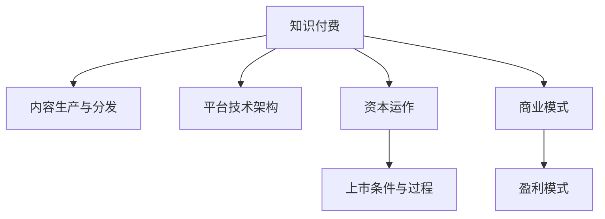

                 

# 如何利用知识付费实现资本运作与上市？

## 1. 背景介绍

在数字经济的浪潮中，知识付费成为了一种新兴的经济模式，通过在线课程、音频讲座、视频教程等形式，为知识消费者提供专业化、个性化、高质量的内容。知识付费行业不仅改变了内容消费的方式，更带来了前所未有的商业价值和资本运作机会。本文将探讨如何利用知识付费实现资本运作与上市。

### 1.1 问题由来

随着互联网和移动技术的飞速发展，越来越多的人开始通过网络获取知识，知识付费成为趋势。在知识付费行业中，内容生产者通过高质量的课程或内容吸引用户付费，从而实现盈利。随着行业的发展，越来越多的知识付费平台和内容创业者涌现，如何实现资本运作与上市，成为知识付费企业的重要课题。

### 1.2 问题核心关键点

1. **知识付费的商业模式**：知识付费的盈利模式主要依赖于订阅费、单次购买费、广告费等。
2. **平台构建与运营**：如何构建高效的知识付费平台，提供优质的内容，提升用户粘性。
3. **资本运作策略**：如何通过融资、并购、上市等方式实现资本增值。
4. **上市条件与过程**：满足上市条件，完成从预审、申报、审核、发行、上市等环节。

## 2. 核心概念与联系

### 2.1 核心概念概述

为更好地理解知识付费的资本运作与上市，本节将介绍几个密切相关的核心概念：

- **知识付费**：指通过互联网平台提供付费内容，满足用户对高质量、专业化、个性化内容的需求。
- **内容生产与分发**：包括内容策划、制作、发布、运营等环节，是知识付费的核心价值链。
- **平台技术架构**：涉及云计算、大数据、人工智能等技术，构建高性能、高安全性的知识付费平台。
- **资本运作**：包括融资、并购、上市等金融手段，提升企业的资本价值和市场影响力。
- **上市条件与过程**：满足证券监管要求，完成从预审、申报、审核、发行、上市等环节，实现资本市场公开上市。

这些核心概念之间的逻辑关系可以通过以下Mermaid流程图来展示：



这个流程图展示的知识付费的核心概念及其之间的关系：

1. 知识付费通过内容生产与分发，满足用户需求。
2. 平台技术架构支持平台的高效运行。
3. 资本运作提升企业资本价值。
4. 上市条件与过程实现公开上市，获取更多资本。
5. 商业模式决定盈利方式，盈利模式具体实现利润。

## 3. 核心算法原理 & 具体操作步骤

### 3.1 算法原理概述

知识付费的资本运作与上市，本质上是一个复杂的资本运作和商业战略问题。其核心在于通过高效的资本运作，提升企业的价值，最终实现上市。这一过程涉及多个环节，包括内容生产、平台运营、资本运作、上市筹划等。

### 3.2 算法步骤详解

知识付费的资本运作与上市一般包括以下几个关键步骤：

**Step 1: 构建高效的内容生态**

- 定位目标用户，设计多样化的内容形式，包括视频课程、音频讲座、电子书等。
- 招募优质内容创作者，提供合理的收益分配机制，保障内容质量。
- 优化内容分发策略，通过个性化推荐、社交分享等手段提升用户粘性。

**Step 2: 提升平台运营效率**

- 构建高性能的技术架构，包括CDN、大数据、云计算等，支持大规模内容分发。
- 引入人工智能技术，实现内容智能推荐、用户行为分析等。
- 建立高效的用户运营体系，包括客户服务、社群运营、用户反馈等，提升用户满意度。

**Step 3: 实施资本运作策略**

- 选择合适的融资渠道，包括天使投资、风险投资、众筹等，获取启动资金。
- 探索并购机会，通过收购行业内优秀企业，快速扩展市场份额。
- 制定上市计划，包括选择上市地点、制定财务计划、聘请中介机构等。

**Step 4: 准备上市条件**

- 满足上市要求，包括盈利能力、财务稳健性、公司治理结构等。
- 准备上市材料，包括招股说明书、审计报告、法律意见书等，提交证券监管机构审核。
- 进行路演推介，吸引投资者的关注，提升市场影响力。

**Step 5: 完成上市过程**

- 通过证券监管机构的审核，获得上市许可。
- 进行首次公开募股(IPO)，向公众发行股票，募集资金。
- 完成股票交易，实现企业资本市场的公开上市。

以上是知识付费资本运作与上市的一般流程。在实际应用中，还需要针对具体平台和企业的特点，对各环节进行优化设计，如进一步提升内容质量、探索更多融资渠道、优化上市计划等。

### 3.3 算法优缺点

知识付费的资本运作与上市方法具有以下优点：

1. 快速获取资本：通过资本运作，可以快速获取大规模的启动资金和运营资金。
2. 提升市场影响力：通过上市，可以提升企业的市场知名度和品牌价值。
3. 优化资源配置：通过并购、融资等手段，可以优化企业的资源配置，提升运营效率。

同时，该方法也存在一定的局限性：

1. 对内容质量依赖高：内容质量直接影响用户的付费意愿，内容生产成本较高。
2. 竞争激烈：知识付费市场竞争激烈，获取优质内容和用户粘性难度大。
3. 资本风险大：资本运作需要良好的市场判断和风险控制，投资回报不确定。
4. 上市门槛高：上市需要满足复杂的财务和法律要求，过程复杂且耗时。

尽管存在这些局限性，但就目前而言，知识付费的资本运作与上市方法仍是大势所趋。未来相关研究的重点在于如何进一步降低资本运作成本，提高市场竞争力，同时兼顾财务稳健性和企业可持续发展。

### 3.4 算法应用领域

知识付费的资本运作与上市方法已经广泛应用于诸多领域，例如：

- 在线教育：知识付费平台如Coursera、Udemy等，通过优质课程和高效运营，实现了大规模用户和收入增长。
- 专业培训：如CSDN、慕课网等，提供技术培训、职业技能培训等，帮助用户提升专业技能。
- 医疗健康：如丁香园、好大夫在线等，提供医学知识、健康咨询等，提升用户健康意识。
- 生活服务：如得到、分答等，提供生活技能、职场提升等，提升用户生活质量。

除了上述这些经典领域外，知识付费的资本运作与上市还将不断拓展到更多场景中，如金融、体育、旅游等，为更多行业带来数字化转型升级的机遇。

## 4. 数学模型和公式 & 详细讲解 & 举例说明

### 4.1 数学模型构建

本节将使用数学语言对知识付费的资本运作与上市过程进行更加严格的刻画。

假设知识付费平台的用户规模为 $U$，内容总数为 $C$，年营收为 $R$。设平台获取资金的渠道有 $N$ 种，每种渠道的融资金额为 $I_n$，年利率为 $r_n$。设平台通过并购获取的资金为 $M$，并购的年收益为 $P$。设平台上市时的市值为 $V$，上市融资的年利率为 $r$。

定义平台每年的净现金流为 $CF$，则有：

$$
CF = R - C - I - P
$$

其中 $I = \sum_{n=1}^{N} I_n \cdot r_n$ 为融资金额和利率的乘积之和，$P$ 为并购年收益。

定义平台的总资本成本为 $K$，则有：

$$
K = \sum_{n=1}^{N} I_n + M
$$

定义平台的净资产收益率为 $ROE$，则有：

$$
ROE = \frac{R}{V}
$$

定义平台的目标市值 $V^*$，则有：

$$
V^* = CF \cdot \frac{1}{r - ROE}
$$

### 4.2 公式推导过程

以IPO融资为例，推导知识付费平台上市的财务模型。

设知识付费平台上市时的融资额为 $F$，上市融资的年利率为 $r$，上市后的年营收为 $R'$。则上市后每年净现金流为：

$$
CF' = R' - C - F \cdot r
$$

设平台上市时的净资产为 $V'$，则有：

$$
V' = V - F
$$

设平台上市后的净资产收益率为 $ROE'$，则有：

$$
ROE' = \frac{R'}{V'}
$$

上市后的净资产收益率为：

$$
ROE' = \frac{R'}{V' + F}
$$

通过公式计算可知，上市后的净现金流 $CF'$ 和净资产收益 $ROE'$ 均与融资额 $F$ 有关，需权衡融资额与收益。

### 4.3 案例分析与讲解

以知识付费平台得到（DingTalk）为例，分析其资本运作与上市过程。

1. **内容生产与分发**：得到通过签约大量知名专家和学术机构，提供高质量的课程内容，同时通过个性化推荐系统，提升用户粘性。
2. **平台技术架构**：利用云计算和大数据技术，实现高效的内容分发和用户运营。
3. **资本运作策略**：得到在2016年获得3000万美元的A轮融资，2018年完成3.3亿美元的B轮融资。同时，通过并购提升市场份额，如收购豆瓣笔记等，优化内容生态。
4. **上市筹划**：得到在2019年启动上市计划，2021年5月正式登陆港交所，发行价为133港元/股。

得到通过高效的内容生产和优质的平台技术，吸引大量用户付费，实现营收增长。通过多轮融资和并购，提升市场竞争力。上市后，得到获得了更多资本支持，进一步提升市场影响力和品牌价值。

## 5. 项目实践：代码实例和详细解释说明

### 5.1 开发环境搭建

在进行知识付费的资本运作与上市实践前，我们需要准备好开发环境。以下是使用Python进行项目开发的环境配置流程：

1. 安装Anaconda：从官网下载并安装Anaconda，用于创建独立的Python环境。

2. 创建并激活虚拟环境：
```bash
conda create -n kf-dev python=3.8 
conda activate kf-dev
```

3. 安装相关Python库：
```bash
pip install pandas numpy scikit-learn statsmodels yfinance
```

4. 安装Flask：用于搭建知识付费平台API接口。
```bash
pip install flask
```

5. 安装Jinja2：用于渲染页面。
```bash
pip install jinja2
```

完成上述步骤后，即可在`kf-dev`环境中开始开发实践。

### 5.2 源代码详细实现

下面我们以在线教育平台为例，给出使用Python Flask进行知识付费平台API接口的开发实现。

首先，定义API接口的请求处理方法：

```python
from flask import Flask, jsonify

app = Flask(__name__)

@app.route('/api/course', methods=['GET'])
def get_course():
    # 查询课程信息
    course_data = {
        'id': 123,
        'name': 'Python编程入门',
        'price': 199,
        'description': '零基础学习Python，从基础语法到高级应用'
    }
    return jsonify(course_data)

@app.route('/api/user', methods=['POST'])
def user_login():
    # 用户登录
    user_data = {
        'id': 456,
        'name': '张三',
        'email': 'zhangsan@example.com'
    }
    return jsonify(user_data)
```

然后，启动API接口服务：

```python
if __name__ == '__main__':
    app.run(debug=True)
```

至此，一个简单的知识付费平台API接口已搭建完成，可以响应GET和POST请求，返回JSON格式的课程信息和用户数据。

### 5.3 代码解读与分析

让我们再详细解读一下关键代码的实现细节：

**Flask框架**：
- `Flask`：轻量级的Python Web框架，方便搭建API接口。
- `@app.route`：用于定义API接口的路由，支持GET和POST请求。
- `jsonify`：将Python数据结构转换为JSON格式响应。

**API接口实现**：
- `get_course`方法：查询课程信息，返回JSON格式的课程数据。
- `user_login`方法：用户登录，返回JSON格式的用户数据。

**启动API服务**：
- `app.run(debug=True)`：启动Flask应用，开启调试模式，自动重载应用。

可以看到，使用Python Flask搭建知识付费平台API接口的过程非常简单，只需要几步即可完成，非常适合快速迭代和测试。

## 6. 实际应用场景

### 6.1 在线教育平台

在线教育平台是知识付费的重要应用场景之一。通过优质的课程内容和高效的平台运营，在线教育平台可以吸引大量用户付费，实现规模化运营。

具体而言，在线教育平台可以与知名教育机构合作，提供高质量的专业课程，如编程、语言学习、职业技能等。同时，通过个性化推荐系统，提升用户粘性，增加复购率。平台还可以通过市场拓展、品牌合作等方式，扩大市场份额。

### 6.2 专业培训平台

专业培训平台提供职业技能培训，帮助用户提升职场竞争力。平台可以通过与企业和培训机构合作，提供实用课程，如项目管理、数据分析、软件开发等。

平台可以通过免费课程吸引用户注册，逐步转化为付费用户。同时，通过社区互动、在线考试等方式，提升用户学习体验。平台还可以根据用户需求，动态调整课程内容，提升平台竞争力。

### 6.3 健康医疗平台

健康医疗平台提供医学知识、健康咨询等，帮助用户提升健康意识。平台可以通过与医院和医生合作，提供专业的健康指导，如疾病预防、生活方式改善等。

平台可以通过免费健康知识普及吸引用户注册，逐步转化为付费用户。同时，通过在线问诊、健康检测等方式，提升用户健康管理水平。平台还可以根据用户健康数据，提供个性化健康建议，提升平台粘性。

### 6.4 未来应用展望

随着知识付费的不断发展，未来的应用场景将更加多样化。除了在线教育、专业培训、健康医疗等，还可以拓展到金融、法律、心理等领域，为更多行业带来数字化转型升级的机遇。

在金融领域，知识付费平台可以提供财经资讯、投资理财等，帮助用户提升财富管理能力。在法律领域，平台可以提供法律知识、律师咨询服务，提升用户法律意识。在心理领域，平台可以提供心理健康指导、心理咨询等，帮助用户提升心理健康水平。

## 7. 工具和资源推荐

### 7.1 学习资源推荐

为了帮助开发者系统掌握知识付费的资本运作与上市的理论基础和实践技巧，这里推荐一些优质的学习资源：

1. 《知识付费商业模式设计与运营》系列博文：由知识付费行业专家撰写，深入浅出地介绍了知识付费的商业模式、运营策略、资本运作等。

2. Coursera《商业分析与战略管理》课程：由哈佛大学开设的商业分析课程，涵盖商业策略、财务分析等内容，帮助理解知识付费的战略规划。

3. 《知识付费平台实战指南》书籍：详细介绍了知识付费平台的构建、运营、资本运作等环节，适合实践开发。

4. Investopedia金融词典：提供全面的金融知识学习，涵盖证券市场、投资工具、公司财务等内容，助力资本运作。

5. Udacity《金融科技》课程：涵盖金融科技领域的最新技术和应用，帮助理解知识付费平台融资和上市的金融逻辑。

通过对这些资源的学习实践，相信你一定能够快速掌握知识付费的资本运作与上市的精髓，并用于解决实际的商业问题。

### 7.2 开发工具推荐

高效的开发离不开优秀的工具支持。以下是几款用于知识付费资本运作与上市开发的常用工具：

1. Jupyter Notebook：用于数据科学和金融分析，支持Python编程和数学计算。
2. Pandas：数据处理和分析工具，支持大规模数据集的处理和分析。
3. NumPy：数值计算和科学计算库，支持高效的数学运算和数据处理。
4. SciPy：科学计算库，提供统计、优化、信号处理等工具。
5. Matplotlib：绘图库，支持丰富的数据可视化方式。
6. TensorFlow：深度学习框架，支持神经网络模型的构建和训练。
7. PyTorch：深度学习框架，支持高效的模型训练和推理。

合理利用这些工具，可以显著提升知识付费资本运作与上市的开发效率，加快创新迭代的步伐。

### 7.3 相关论文推荐

知识付费的资本运作与上市的发展源于学界的持续研究。以下是几篇奠基性的相关论文，推荐阅读：

1. Harnessing Financial Data for Knowledge Marketplaces（NBER报告）：分析了知识付费平台融资和上市的财务数据，揭示了平台资本运作的关键要素。
2. Revenue Model Strategy for Digital Content Platforms：探讨了知识付费平台的收入模型，包括广告、订阅、单次购买等，帮助理解盈利模式。
3. Valuation Models for Digital Startups（Stanford GSB报告）：提供了数字初创企业估值模型，帮助理解上市融资的估值方法。
4. Financial Strategies for Digital Businesses（Harvard Business Review）：探讨了数字企业的金融战略，包括融资、并购、上市等，提供了实践指导。
5. IPO Trends and Market Dynamics（Finra报告）：分析了IPO市场的趋势和动态，帮助理解上市过程中的市场风险和机会。

这些论文代表了大规模知识付费资本运作与上市技术的发展脉络。通过学习这些前沿成果，可以帮助研究者把握学科前进方向，激发更多的创新灵感。

## 8. 总结：未来发展趋势与挑战

### 8.1 总结

本文对知识付费的资本运作与上市方法进行了全面系统的介绍。首先阐述了知识付费的商业模式和资本运作方法，明确了平台构建、运营、资本运作、上市筹划等关键环节。其次，从原理到实践，详细讲解了知识付费的数学模型和核心步骤，给出了平台开发的完整代码实例。同时，本文还广泛探讨了知识付费在在线教育、专业培训、健康医疗等诸多领域的应用前景，展示了知识付费技术的巨大潜力。此外，本文精选了知识付费的学习资源，力求为读者提供全方位的技术指引。

通过本文的系统梳理，可以看到，知识付费的资本运作与上市技术正在成为数字经济的创新动力，极大地拓展了知识付费平台的业务边界，催生了更多的落地场景。未来，伴随技术进步和市场发展，知识付费平台将不断探索新的商业模式和资本运作方式，为社会创造更多的价值。

### 8.2 未来发展趋势

展望未来，知识付费的资本运作与上市技术将呈现以下几个发展趋势：

1. **多平台协同**：未来知识付费平台将与其他平台进行协同合作，通过内容互通、用户推荐等方式，扩大市场影响力。
2. **内容生态构建**：通过构建多维度的内容生态，提升内容的丰富度和多样性，满足用户多元化的需求。
3. **技术创新**：利用AI、大数据、区块链等技术，提升平台的智能化和安全性，优化用户体验。
4. **全球化布局**：平台将向全球市场拓展，提升国际影响力，获取更多用户和收入。
5. **社会价值**：知识付费平台将更多关注社会公益，通过平台助力教育普及、健康促进等，提升平台的社会价值。

这些趋势将进一步推动知识付费平台的创新发展，为知识付费技术带来更广阔的应用前景。

### 8.3 面临的挑战

尽管知识付费的资本运作与上市技术已经取得了显著进展，但在迈向更加智能化、全球化的过程中，它仍面临诸多挑战：

1. **内容质量控制**：优质内容的生产成本较高，如何保障内容质量，提升用户满意度，是平台长期面临的挑战。
2. **市场竞争激烈**：知识付费市场竞争激烈，如何保持创新优势，提高用户粘性，是平台持续发展的关键。
3. **融资难度大**：知识付费平台的盈利模式相对单一，融资渠道有限，如何拓宽融资渠道，获取更多资本支持，是平台发展的难点。
4. **合规风险**：知识付费平台需满足复杂的法律法规要求，如何合规运营，降低法律风险，是平台运营的重要课题。
5. **技术复杂度**：知识付费平台涉及的技术复杂度较高，如何优化技术架构，提高平台运营效率，是平台发展的核心挑战。

这些挑战需要知识付费平台从内容、市场、技术、法律等多个维度进行全面优化，才能实现健康稳定的发展。

### 8.4 研究展望

面对知识付费平台面临的诸多挑战，未来的研究需要在以下几个方面寻求新的突破：

1. **内容质量提升**：通过算法优化和智能推荐，提升内容质量，满足用户需求。
2. **市场拓展策略**：探索新的市场细分和用户群体，拓展市场空间。
3. **融资渠道多样化**：拓宽融资渠道，引入更多资本支持。
4. **技术创新应用**：利用最新的AI、大数据等技术，提升平台智能化水平。
5. **合规运营机制**：制定合规运营机制，降低法律风险，保障平台健康运营。
6. **用户参与机制**：建立用户参与机制，提升用户粘性和平台忠诚度。

这些研究方向的探索，必将引领知识付费平台迈向更高的台阶，为知识付费技术的未来发展提供新的动力。

## 9. 附录：常见问题与解答

**Q1: 知识付费平台的资本运作主要有哪些方式？**

A: 知识付费平台的资本运作方式主要包括融资、并购、上市等。

1. **融资**：通过天使投资、风险投资、众筹等渠道获取启动资金和运营资金。
2. **并购**：通过收购行业内优秀企业，快速扩展市场份额。
3. **上市**：通过首次公开募股(IPO)，向公众发行股票，募集更多资本。

这些方式可以有效提升平台的资本价值和市场影响力。

**Q2: 知识付费平台如何进行上市筹划？**

A: 知识付费平台进行上市筹划一般需要以下几个步骤：

1. **选择合适的上市地点**：根据平台市场覆盖范围和资本需求，选择证券交易所。
2. **制定财务计划**：进行详细的财务预测和分析，准备上市材料。
3. **聘请中介机构**：包括会计师、律师、投资银行等，协助完成上市工作。
4. **进行路演推介**：向投资者展示平台优势和未来前景，吸引投资者的关注。
5. **提交上市申请**：向证券监管机构提交上市申请，接受审核。
6. **完成发行和上市**：通过证券监管机构的审核，完成股票发行和上市。

上市筹划需要长期的规划和准备，平台需提前布局，确保上市成功。

**Q3: 知识付费平台的资本运作面临哪些风险？**

A: 知识付费平台的资本运作面临以下风险：

1. **融资风险**：融资渠道有限，融资难度大，需防范资金不足的风险。
2. **市场风险**：市场竞争激烈，需防范市场份额下滑的风险。
3. **技术风险**：平台涉及技术复杂，需防范技术故障和数据安全风险。
4. **法律风险**：需遵守相关法律法规，防范法律合规风险。
5. **财务风险**：需控制财务成本，防范财务风险。

平台需综合考虑各方面风险，制定合理的资本运作策略，保障平稳发展。

**Q4: 知识付费平台上市后如何保持持续增长？**

A: 知识付费平台上市后需通过以下措施保持持续增长：

1. **拓展内容生态**：引入更多优质内容创作者，提升内容质量。
2. **优化用户体验**：通过技术创新和用户运营，提升用户体验。
3. **多元化融资**：引入更多融资渠道，获取更多资本支持。
4. **全球化布局**：向全球市场拓展，扩大市场影响力。
5. **创新商业模式**：探索新的盈利模式，提高平台盈利能力。

保持持续增长需平台不断创新，提升竞争力和市场地位。

---

作者：禅与计算机程序设计艺术 / Zen and the Art of Computer Programming

