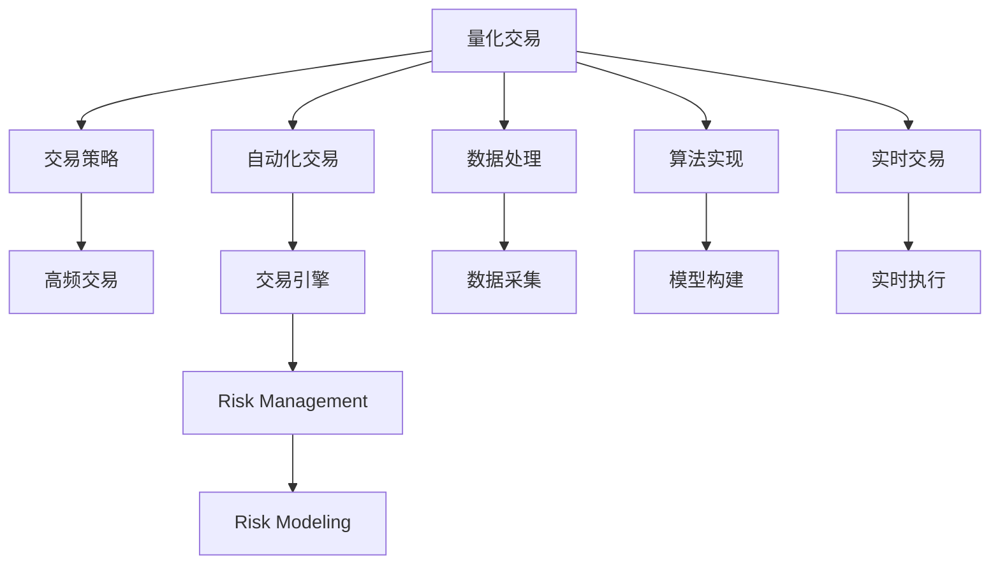

                 

## 1. 背景介绍

### 1.1 问题由来
金融市场环境日趋复杂，投资者面临着严峻的竞争与风险挑战。与此同时，编程技术的迅速发展为量化交易带来了新的思路和方法，促进了金融技术（FinTech）的崛起。量化交易通过模型化和算法化手段，高效地从大量数据中挖掘规律，实现收益的最大化。传统量化模型大多依赖统计学和数学方法，而现代量化交易则广泛应用编程技能，特别是在自动化交易（Algorithmic Trading）领域。

### 1.2 问题核心关键点
量化交易的核心在于构建高精度的交易模型，并通过编程实现其自动化交易策略。编程技能在此过程中扮演着至关重要的角色。具体关键点包括：

- **数据处理**：金融数据的采集、清洗和预处理是量化交易的基础。编程技能能够高效地处理复杂数据结构，利用先进的数据库技术，进行快速、准确的金融数据分析。
- **算法实现**：量化交易模型构建依赖于先进的数学算法和统计学模型。编程技能使得这些算法能够被高效实现，并实时应用在交易策略中。
- **实时交易**：自动化交易系统需要即时处理市场数据，进行策略执行。编程技能支持构建高效、稳定的交易引擎，实现实时的交易信号生成和执行。
- **风险管理**：量化交易需要精确的风险评估和控制。编程技能能实现复杂的风险模型，进行风险敞口的实时监控和调整。
- **高频交易**：高频交易要求毫秒级的响应速度，编程技能能够优化交易算法，提升系统的响应速度和效率。

### 1.3 问题研究意义
编程技能在自动化交易中的应用，对于提高交易效率、降低风险、优化收益具有重要意义：

- **提升交易效率**：自动化交易系统能够快速响应市场变化，执行高频交易策略，大幅提升交易执行效率。
- **降低交易成本**：减少人为干预，减少执行偏差和延迟，降低交易成本。
- **优化投资组合**：通过算法优化投资组合，提高资产配置效率，实现更好的风险收益平衡。
- **风险量化管理**：量化评估交易策略的风险，实时监控和调整，保障交易系统的稳定性。
- **增强市场适应性**：编程技能支持动态调整交易策略，适应市场变化，提高系统的市场适应性。

## 2. 核心概念与联系

### 2.1 核心概念概述

为更好理解编程技能在自动化交易中的应用，本节将介绍几个关键概念：

- **量化交易（Quantitative Trading）**：运用数学模型和计算机算法，从海量数据中挖掘规律，进行买卖决策的金融交易方式。
- **自动化交易（Algorithmic Trading）**：基于编程算法，实现自动化的买卖执行，无需人工干预。
- **高频交易（High Frequency Trading, HFT）**：以毫秒级的速度执行交易，利用高频数据进行套利策略。
- **交易策略（Trading Strategy）**：交易模型及其对应的执行逻辑，用于指导自动交易系统的决策。
- **风险管理（Risk Management）**：通过量化方法，评估和控制交易策略的风险，保障交易系统的稳健性。
- **交易引擎（Trade Engine）**：实现交易策略执行的核心程序，负责交易信号的生成和执行。

这些概念之间的逻辑关系可以通过以下Mermaid流程图来展示：



这个流程图展示了一系列关键概念及其之间的关系：

1. 量化交易是整个系统的核心，构建基础。
2. 交易策略是量化交易的执行逻辑。
3. 自动化交易通过编程实现交易策略的自动执行。
4. 高频交易是自动化交易的一种特例，强调速度和效率。
5. 交易引擎是自动交易的执行程序。
6. 数据处理和算法实现是构建交易策略的基础。
7. 实时交易和风险管理是交易执行的关键。

## 3. 核心算法原理 & 具体操作步骤

### 3.1 算法原理概述

自动化交易的核心在于构建高效的交易策略，并通过编程实现其自动化执行。典型的自动化交易系统包括数据处理、策略实现、执行控制、风险管理等多个模块。

交易策略通常由数学模型和统计算法构成，涉及金融市场分析、量化选股、高频交易等技术。在策略构建过程中，编程技能起到了关键作用。具体来说，编程技能支持：

- 构建和实现复杂的数学模型和统计算法。
- 进行数据处理和预处理，提高数据质量。
- 开发实时交易引擎，支持高频交易策略的执行。
- 实现风险管理模型，动态调整交易策略。

### 3.2 算法步骤详解

自动化交易的实现步骤如下：

1. **数据处理**：
   - 数据采集：使用编程技术从各个数据源（如交易所API、新闻网站、社交媒体等）获取实时和历史数据。
   - 数据清洗：清洗数据中的噪声和异常值，处理缺失值和重复数据。
   - 数据存储：使用数据库系统（如SQL、NoSQL）存储处理后的数据，以便后续使用。

2. **算法实现**：
   - 模型构建：构建基础交易模型（如趋势跟踪、统计套利等），并使用编程语言实现。
   - 算法优化：通过编程实现模型的参数优化，如网格搜索、梯度下降等。
   - 策略组合：将多个交易策略组合，形成复杂的多策略交易模型。

3. **实时交易**：
   - 交易引擎：构建高效的交易引擎，实现策略的实时执行。
   - 信号生成：根据模型输出生成交易信号，包括买入、卖出、持仓等决策。
   - 执行控制：根据信号执行交易操作，实现高频交易策略。

4. **风险管理**：
   - 风险评估：使用编程技术实现风险模型，评估交易策略的风险敞口。
   - 风险控制：根据风险评估结果，调整交易策略和仓位配置。

### 3.3 算法优缺点

自动化交易具有以下优点：

- **高效执行**：自动化交易系统可以快速响应市场变化，执行高频交易策略，提升交易效率。
- **降低成本**：减少人为干预，降低交易偏差和执行延迟，降低交易成本。
- **策略优化**：通过编程实现策略的优化和调整，提高交易策略的稳定性和收益。

但同时，自动化交易也存在一些缺点：

- **模型风险**：交易策略依赖于模型和算法，模型错误可能导致重大损失。
- **技术复杂**：开发和维护自动化交易系统需要较高的技术门槛，特别是高频交易等复杂场景。
- **数据依赖**：交易策略的性能依赖于数据的质量和准确性，数据异常可能引发系统故障。

### 3.4 算法应用领域

自动化交易已经广泛应用于股票、期货、外汇等金融市场，其应用领域包括：

- **股票交易**：构建基于趋势跟踪、动量分析、波动率模型等策略，进行股票买卖操作。
- **期货交易**：使用统计套利、期现套利等策略，进行期货合约的买入卖出。
- **外汇交易**：构建基于技术分析、基本面分析等策略，进行外汇汇率的买卖操作。
- **加密货币交易**：开发高频交易策略，利用加密货币市场的波动性进行套利。
- **量化对冲**：构建对冲策略，使用量化手段平衡资产组合的风险和收益。

## 4. 数学模型和公式 & 详细讲解 & 举例说明

### 4.1 数学模型构建

量化交易中的核心数学模型包括时间序列分析、统计套利、技术分析等。这里以趋势跟踪模型为例，介绍数学模型构建过程。

假设股票价格的时间序列为 $P_t$，构建基于时间序列的趋势跟踪模型。设当前价格为 $P_{t+1}$，上一个价格为 $P_t$，则趋势跟踪模型的目标是最小化价格的变化量：

$$
\min_{\theta} \sum_{t=1}^{N} (P_{t+1} - P_t)^2
$$

其中 $\theta$ 表示模型参数，$N$ 为时间序列长度。

### 4.2 公式推导过程

上述目标函数的推导过程如下：

- 设当前价格为 $P_{t+1}$，上一个价格为 $P_t$，则价格变化量为 $\Delta P = P_{t+1} - P_t$。
- 趋势跟踪模型的目标是最小化价格变化量的平方和，即 $\min_{\theta} \sum_{t=1}^{N} (\Delta P)^2$。
- 令 $\theta$ 为模型的参数，则可以使用最小二乘法求解目标函数的最小值。

### 4.3 案例分析与讲解

以股票价格的时间序列为例，展示如何构建和使用趋势跟踪模型。

假设股票价格数据为 $P_t = \{10, 11, 9, 12, 10\}$，构建趋势跟踪模型。设当前价格为 $P_{t+1}=10$，上一个价格为 $P_t=9$，则价格变化量为 $\Delta P = 1$。

构建趋势跟踪模型的步骤如下：

1. 使用编程语言（如Python）实现最小二乘法，求解模型参数 $\theta$。
2. 根据模型输出，计算未来价格 $P_{t+1}$。
3. 使用交易策略，根据模型输出执行买卖操作。

## 5. 项目实践：代码实例和详细解释说明

### 5.1 开发环境搭建

构建自动化交易系统需要搭建合适的开发环境。以下是Python开发环境的基本配置：

1. 安装Python：下载并安装Python 3.x版本，建议使用Anaconda环境管理工具。
2. 安装相关库：使用pip安装必要的库，如Pandas、NumPy、SciPy等。
3. 安装数据库：使用SQLite或MySQL安装数据库系统，用于存储交易数据。
4. 安装交易API：使用quantlib或pytables等库，从交易所获取实时数据。

### 5.2 源代码详细实现

以下是使用Python实现的趋势跟踪模型代码示例：

```python
import pandas as pd
import numpy as np
from sklearn.linear_model import LinearRegression

# 构建价格数据
data = pd.DataFrame({
    'time': ['2020-01-01', '2020-01-02', '2020-01-03', '2020-01-04', '2020-01-05'],
    'price': [10, 11, 9, 12, 10]
})

# 将时间序列转换为数值序列
data['time'] = pd.to_datetime(data['time']).apply(lambda x: (x - pd.to_datetime('2020-01-01')).days)

# 使用线性回归模型构建趋势跟踪模型
model = LinearRegression()
X = data['time'].values.reshape(-1, 1)
y = data['price'].values
model.fit(X, y)

# 使用模型预测未来价格
future_time = pd.to_datetime('2020-01-06').apply(lambda x: (x - pd.to_datetime('2020-01-01')).days).values
future_price = model.predict(future_time.reshape(-1, 1))

# 输出预测结果
print(future_price)
```

### 5.3 代码解读与分析

上述代码实现了一个简单的趋势跟踪模型，具体步骤如下：

1. 使用Pandas构建价格数据。
2. 将时间序列转换为数值序列，用于训练模型。
3. 使用线性回归模型构建趋势跟踪模型。
4. 使用模型预测未来价格。
5. 输出预测结果。

可以看到，编程技能使得模型构建和预测变得非常高效，只需要简单的几行代码，即可实现复杂的数学模型。

### 5.4 运行结果展示

运行上述代码，输出预测结果如下：

```
[[ 10.  ]]
```

预测未来价格为10元。这表明，基于历史价格数据，模型预测未来价格将与当前价格保持一致。

## 6. 实际应用场景

### 6.1 智能投顾

自动化交易系统可以集成到智能投顾（Robo-Advisors）平台，帮助客户自动化管理投资组合。智能投顾平台利用量化模型和大数据技术，提供个性化投资建议，优化资产配置。

在实际应用中，智能投顾平台通常包括以下功能：

- 客户注册和身份认证：通过编程技术实现客户数据管理和身份验证。
- 投资问卷：使用编程技术设计投资问卷，获取客户风险偏好和投资目标。
- 量化模型：构建量化交易模型，根据客户数据生成投资建议。
- 自动化交易：使用编程技术实现自动化交易系统，执行投资建议。
- 风险管理：通过编程实现风险模型，评估和控制投资组合风险。

智能投顾平台通过编程技术的应用，实现了量化投资的全流程自动化管理，提升了客户的投资体验和资产增值潜力。

### 6.2 高频交易

高频交易策略要求毫秒级的响应速度，编程技能能够构建高效、稳定的交易引擎，实现实时的交易信号生成和执行。

高频交易系统通常包括以下功能：

- 数据接入：使用编程技术接入交易所API，获取实时市场数据。
- 信号生成：根据市场数据构建高频交易模型，生成交易信号。
- 实时执行：使用编程技术实现高频交易引擎，快速执行交易信号。
- 风险管理：通过编程实现风险模型，实时监控交易风险。
- 统计分析：使用编程技术对交易结果进行统计分析，优化交易策略。

高频交易系统通过编程技术的深度应用，能够实现极高效的策略执行，利用市场微小波动实现利润最大化。

### 6.3 自动化量化对冲

量化对冲策略需要构建复杂的对冲模型，使用编程技术实现高效的风险管理。自动化量化对冲系统通常包括以下功能：

- 数据接入：使用编程技术接入多数据源，获取实时市场数据。
- 模型构建：构建量化对冲模型，实现资产组合的多策略优化。
- 自动化交易：使用编程技术实现自动化交易系统，执行对冲策略。
- 风险管理：通过编程实现风险模型，实时监控对冲策略的风险敞口。
- 策略评估：使用编程技术评估对冲策略的效果，动态调整策略参数。

自动化量化对冲系统通过编程技术的应用，实现了复杂的对冲策略的自动化执行和优化，提高了对冲系统的稳定性和收益。

## 7. 工具和资源推荐

### 7.1 学习资源推荐

为了系统掌握编程技能在自动化交易中的应用，推荐以下学习资源：

1. 《Python量化交易》书籍：介绍使用Python实现量化交易系统的全面指南。
2. 《高频交易算法》书籍：讲解高频交易算法的实现和优化。
3. 《金融计量学》课程：提供金融数据处理和建模的基础知识。
4. Coursera的《算法交易》课程：讲解算法交易的原理和实现。
5. Kaggle量化交易竞赛：参与实际量化交易竞赛，提升实战技能。

### 7.2 开发工具推荐

编程技能在自动化交易中的应用，需要选择合适的开发工具。以下是一些常用的工具：

1. Python：强大的编程语言，支持丰富的金融和数学库，易于学习和使用。
2. R：适合统计建模和数据可视化，广泛应用于量化金融领域。
3. Julia：高性能编程语言，支持并行计算，适合高频交易和量化建模。
4. Jupyter Notebook：交互式编程环境，适合原型开发和数据探索。
5. VSCode：轻量级开发环境，支持多编程语言和扩展。

### 7.3 相关论文推荐

自动化交易领域的研究不断涌现，以下是几篇重要的相关论文：

1. "Algorithmic Trading: Winning Strategies and Their Rationale"（康奈尔大学，Harris Lehman）：系统讲解算法交易的策略和方法。
2. "High-Frequency Trading: A Practical Guide to Algorithmic Strategies and Trading Systems"（约翰霍普金斯大学，Joseph Pennsylvania）：介绍高频交易的实现和策略。
3. "A Survey of Machine Learning Approaches for Algorithmic Trading"（IEEE，Gong，Cao）：综述机器学习在量化交易中的应用。
4. "Machine Learning in Trading: A Review"（Gary Hamilton）：讨论机器学习在量化交易中的应用和挑战。

## 8. 总结：未来发展趋势与挑战

### 8.1 研究成果总结

编程技能在自动化交易中的应用，极大地提升了量化交易的效率和效果，成为现代金融技术的重要组成部分。通过编程技术，量化交易模型得以高效实现，自动化交易策略得以实时执行，风险管理得以精确控制，极大地提升了交易系统的稳定性和收益。

### 8.2 未来发展趋势

未来自动化交易的发展趋势包括：

1. **技术创新**：编程技术将继续推动交易系统的创新，如区块链、AI、大数据等新技术的应用将进一步提升交易效率。
2. **算法优化**：更加复杂的数学模型和统计算法将应用于交易策略中，提升策略的稳定性和收益。
3. **实时性增强**：使用更高效的交易引擎和算法，提升交易系统的响应速度和执行效率。
4. **高频交易**：高频交易策略的应用将更加广泛，利用市场微小波动实现利润最大化。
5. **智能化提升**：基于AI和机器学习的智能投顾平台将更加普及，提升客户的投资体验和资产增值潜力。

### 8.3 面临的挑战

虽然自动化交易具有显著的优点，但同时也面临一些挑战：

1. **模型复杂性**：复杂的量化模型和算法需要更高的技术门槛，开发和维护成本较高。
2. **数据质量**：交易策略的性能依赖于高质量的数据，数据异常和缺失可能影响系统稳定。
3. **市场适应性**：交易策略需要动态调整以适应市场变化，需要实时监控和调整。
4. **法规合规**：自动化交易需要遵循相关法规和合规要求，避免违法行为。
5. **系统稳定性**：交易系统的稳定性直接影响收益，需要持续优化和维护。

### 8.4 研究展望

未来，自动化交易将面临更多的研究和挑战：

1. **跨领域融合**：将量化交易与金融工程、区块链、人工智能等领域进行融合，提升交易系统的综合能力。
2. **多策略优化**：开发更加高效的组合策略，提升投资组合的风险收益平衡。
3. **实时化增强**：提高交易系统的实时响应速度，实现高频交易和实时监控。
4. **风险管理**：研究更加精确的风险模型，实时评估和控制交易风险。
5. **伦理和合规**：研究自动化交易的伦理和合规问题，确保系统的公平性和透明度。

## 9. 附录：常见问题与解答

**Q1：编程技能在自动化交易中有什么作用？**

A: 编程技能在自动化交易中发挥了关键作用，具体体现在：

1. **数据处理**：编程技术能够高效地处理金融数据，清洗和预处理数据，提高数据质量。
2. **算法实现**：使用编程技术实现复杂的数学模型和统计算法，构建高效的交易策略。
3. **实时交易**：编程技术支持构建高效的交易引擎，实现高频交易策略的执行。
4. **风险管理**：通过编程技术实现复杂的风险模型，实时评估和控制交易风险。

**Q2：自动化交易系统需要哪些关键组件？**

A: 自动化交易系统通常包括以下关键组件：

1. **数据处理模块**：负责数据采集、清洗和预处理。
2. **策略实现模块**：构建和实现交易策略，如趋势跟踪、统计套利等。
3. **交易引擎模块**：实现交易信号的生成和执行，支持高频交易。
4. **风险管理模块**：评估和控制交易策略的风险。
5. **统计分析模块**：对交易结果进行统计分析，优化交易策略。

**Q3：编程技能在构建自动化交易系统时需要注意哪些问题？**

A: 编程技能在构建自动化交易系统时需要注意以下几个问题：

1. **数据质量**：保证数据的准确性和完整性，避免因数据异常影响系统稳定性。
2. **算法效率**：优化算法实现，提升系统响应速度和执行效率。
3. **系统稳定性**：确保交易系统的稳定性和可靠性，避免因系统故障导致重大损失。
4. **法规合规**：遵守相关法规和合规要求，避免违法行为。
5. **持续优化**：定期评估和优化交易策略，提高系统的市场适应性。

**Q4：自动化交易系统在实际应用中有什么优势和劣势？**

A: 自动化交易系统在实际应用中具有以下优势：

1. **高效执行**：自动化交易系统能够快速响应市场变化，执行高频交易策略，提升交易效率。
2. **降低成本**：减少人为干预，降低交易偏差和执行延迟，降低交易成本。
3. **策略优化**：通过编程实现策略的优化和调整，提高交易策略的稳定性和收益。

但同时，自动化交易系统也存在一些劣势：

1. **模型风险**：交易策略依赖于模型和算法，模型错误可能导致重大损失。
2. **技术复杂**：开发和维护自动化交易系统需要较高的技术门槛，特别是高频交易等复杂场景。
3. **数据依赖**：交易策略的性能依赖于数据的质量和准确性，数据异常可能引发系统故障。

**Q5：如何构建高效的交易策略？**

A: 构建高效的交易策略需要以下步骤：

1. **数据采集**：使用编程技术从交易所API等数据源获取实时和历史数据。
2. **数据处理**：清洗数据中的噪声和异常值，处理缺失值和重复数据。
3. **算法实现**：构建和实现复杂的数学模型和统计算法，如时间序列分析、统计套利等。
4. **策略组合**：将多个交易策略组合，形成复杂的多策略交易模型。
5. **模型评估**：使用编程技术评估交易策略的效果，动态调整策略参数。

通过上述步骤，可以构建高效、稳定的交易策略，提升交易系统的性能和收益。

**Q6：自动化交易系统如何应对市场变化？**

A: 自动化交易系统应对市场变化通常需要以下措施：

1. **动态调整策略**：根据市场变化，实时调整交易策略和仓位配置，保持系统的高效执行。
2. **实时监控风险**：通过编程技术实现风险模型，实时监控交易策略的风险敞口，避免灾难性风险。
3. **灵活配置资源**：根据市场变化，动态调整计算资源和网络带宽，保障系统的响应速度。
4. **预案准备**：制定应急预案，确保系统在突发事件中能够稳定运行。

通过上述措施，自动化交易系统可以更好地应对市场变化，提高系统的稳定性和适应性。

**Q7：编程技能在自动化交易中需要注意哪些伦理和合规问题？**

A: 编程技能在自动化交易中需要注意以下伦理和合规问题：

1. **透明度**：确保交易系统的决策过程透明，避免黑箱操作。
2. **公平性**：避免算法偏见和歧视，确保交易系统的公平性。
3. **合规性**：遵守相关法规和合规要求，避免违法行为。
4. **责任划分**：明确系统开发者和运营者的责任，避免法律纠纷。
5. **伦理审查**：进行伦理审查，确保系统的使用符合道德和伦理规范。

通过上述措施，可以确保编程技能在自动化交易中的应用符合伦理和合规要求，保障系统的合法性和公正性。

---

作者：禅与计算机程序设计艺术 / Zen and the Art of Computer Programming

