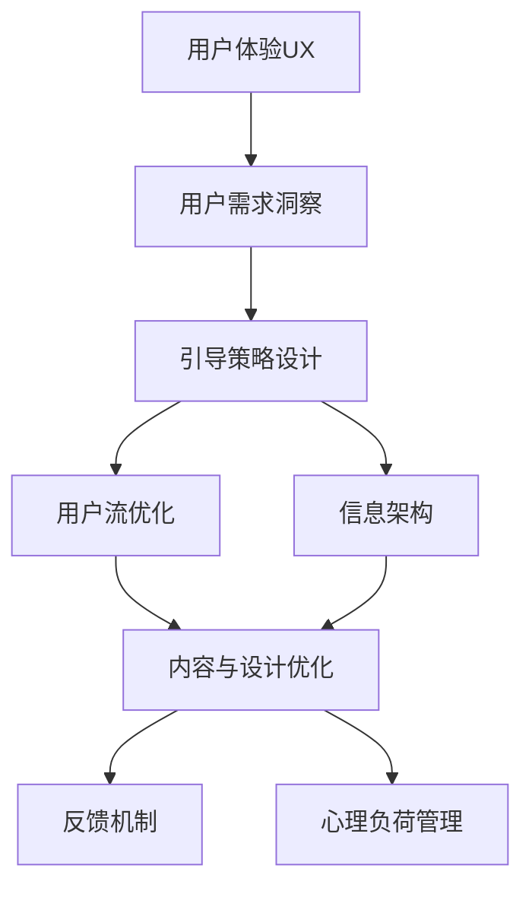

                 

## 1. 背景介绍

在数字化时代，用户体验（User Experience, UX）成为决定产品成败的关键因素之一。无论你是软件开发者、UI/UX设计师、内容创作者，还是市场营销专家，都需深刻理解用户体验的重要性。

### 1.1 问题由来
在互联网和移动互联网的浪潮中，用户体验被赋予了前所未有的重要性。如今，用户期望从各类应用中获得无缝、流畅、个性化的交互体验，而要想实现这一点，有效的用户引导成为不可或缺的一环。好的用户引导不仅能提升用户满意度，还能提高产品转化率，减少用户流失，具有深远的商业价值。

### 1.2 问题核心关键点
进行有效的用户引导，主要涉及以下几个关键点：

- **目标用户群体分析**：明确目标用户群体的特性，如年龄、性别、职业、兴趣等。
- **用户需求洞察**：深入理解用户在使用产品时的核心需求和痛点。
- **引导策略设计**：基于用户行为和心理特征，设计有针对性的引导策略。
- **反馈机制建立**：建立有效的用户反馈和纠错机制，帮助用户纠正错误，增强体验。
- **内容与设计优化**：提供清晰、准确、友好的内容和设计，减少用户心理负担。

通过详细分析这些关键点，可以制定出更加科学有效的用户引导策略，从而显著提升用户体验。

## 2. 核心概念与联系

### 2.1 核心概念概述

为更好地理解如何进行有效的用户引导，本节将介绍几个密切相关的核心概念：

- **用户体验（UX）**：定义用户在产品使用过程中所获得的所有体验。
- **用户引导（User Guidance）**：通过合理的指示、提示和交互设计，帮助用户快速理解和使用产品。
- **用户流（User Flow）**：用户在使用产品时的行为路径，通过优化用户流可以提升整体体验。
- **心理负荷（Psychological Load）**：用户在完成任务时的心理负担，好的用户引导可以减轻心理负荷，提升用户满意度。
- **信息架构（Information Architecture）**：合理组织和管理信息，使用户能够快速找到所需内容，减少时间成本。

这些概念之间存在紧密联系，共同构成了用户引导设计的理论基础。

### 2.2 核心概念原理和架构的 Mermaid 流程图



这个流程图展示了用户引导设计的基本流程：从理解用户需求，到设计引导策略，优化用户流，完善信息架构，改善内容与设计，最终通过反馈机制管理心理负荷，实现整体体验的提升。

## 3. 核心算法原理 & 具体操作步骤

### 3.1 算法原理概述

有效的用户引导本质上是一个交互设计过程，其目的是在用户与产品之间建立一种高效、易用的交互模式。通过合理的引导，用户可以更快地掌握产品功能，完成目标任务，从而提升整体满意度。

设计有效的用户引导，需要考虑以下几个关键因素：

- **用户心理模型**：理解用户的心理预期和行为模式。
- **交互效率**：通过简化操作流程，提升用户的操作效率。
- **界面一致性**：保持界面风格和元素位置的一致性，减少用户学习成本。
- **信息清晰度**：提供准确、简洁的信息，帮助用户快速做出决策。

### 3.2 算法步骤详解

以下是一个典型的用户引导设计流程：

**Step 1: 目标用户群体分析**

- **收集数据**：通过问卷调查、用户访谈等方式，收集目标用户群体的基本信息，如年龄、性别、职业、兴趣等。
- **数据处理**：使用数据分析工具（如Google Analytics、Mixpanel），对收集的数据进行分析，找出用户行为模式和需求热点。
- **用户画像构建**：基于分析结果，构建用户画像，描述典型用户的心理特征和行为特征。

**Step 2: 用户需求洞察**

- **任务分析**：列出用户在产品中需要完成的所有任务，如注册、登录、搜索、购物等。
- **痛点识别**：识别用户在执行每个任务时可能遇到的困难和障碍，如操作复杂、界面混乱等。
- **优先级排序**：根据用户调研和行为数据，对各个任务的优先级进行排序，确定哪些任务需要优先优化。

**Step 3: 引导策略设计**

- **任务分解**：将复杂任务分解为若干简单子任务，设计详细的引导步骤。
- **提示设计**：设计提示语和说明文字，明确告知用户如何完成每个子任务。
- **反馈机制**：设置错误提示和成功提示，帮助用户及时纠正错误或确认操作成功。

**Step 4: 用户流优化**

- **流程图绘制**：绘制用户流图，展示用户从进入产品到完成任务的完整路径。
- **瓶颈识别**：识别用户流中的瓶颈和阻塞点，进行优化设计。
- **路径简化**：尽量简化用户流，减少操作步骤，提升整体效率。

**Step 5: 信息架构优化**

- **内容组织**：根据用户需求，合理组织产品内容，使其易于查找和使用。
- **标签和分类**：使用标签和分类方式，帮助用户快速定位到所需信息。
- **搜索优化**：优化搜索功能，使其能够精准匹配用户需求。

**Step 6: 内容与设计优化**

- **界面设计**：设计简洁、美观、易用的界面，符合用户习惯和审美。
- **文本清晰度**：提供清晰、准确、简明的文本说明，帮助用户理解操作流程和功能特点。
- **交互设计**：优化交互方式，提升用户的操作体验。

**Step 7: 反馈机制建立**

- **错误提示**：设计详细的错误提示，指出用户操作中的问题。
- **成功提示**：提供成功提示，让用户确信操作已正确完成。
- **反馈渠道**：建立多渠道反馈机制，收集用户反馈信息，进行持续改进。

### 3.3 算法优缺点

**优点**：

- **提高用户满意度**：通过合理的引导，用户能够快速理解和使用产品，提升整体满意度。
- **减少用户流失**：用户引导可以减少操作复杂度和心理负担，降低用户流失率。
- **提升操作效率**：简化的操作流程和优化的用户流，能够显著提升用户的操作效率。

**缺点**：

- **设计成本较高**：有效的用户引导需要详细分析用户行为和心理，设计工作复杂且耗时。
- **用户接受度**：用户习惯和需求多变，并非所有引导策略都能被所有用户接受。
- **灵活性不足**：固定的引导策略可能难以适应新用户和新场景。

### 3.4 算法应用领域

有效的用户引导在多个领域中得到了广泛应用，以下是几个典型应用场景：

- **电商应用**：帮助用户快速找到商品、完成下单流程。
- **在线教育**：指导用户完成课程注册、学习进度跟踪等任务。
- **社交网络**：引导新用户完成注册、搜索好友、发布内容等操作。
- **金融产品**：提供理财账户创建、交易操作、风险提示等引导。
- **健康管理**：帮助用户完成健康记录、饮食管理、运动跟踪等任务。

以上场景只是冰山一角，有效的用户引导可以应用于任何需要用户操作和决策的场景。

## 4. 数学模型和公式 & 详细讲解 & 举例说明

### 4.1 数学模型构建

在进行用户引导设计时，可以使用量化指标来评估和优化用户体验。例如，可以使用任务完成率（Task Completion Rate）、任务完成时间（Time to Complete Task）、错误率（Error Rate）等指标。

设用户完成某任务所需的操作数量为 $n$，完成该任务所需的时间为 $t$，完成该任务所犯的错误数量为 $e$。定义任务完成率 $C$、任务完成时间 $T$、错误率 $E$ 分别为：

$$
C = \frac{N_c}{N} \times 100\%
$$

$$
T = \frac{N_t}{N} \times \frac{1}{t}
$$

$$
E = \frac{N_e}{N} \times 100\%
$$

其中 $N_c$ 为完成任务的用户数量，$N_t$ 为完成任务所需的时间总和，$N_e$ 为完成任务所犯错误的总和。

### 4.2 公式推导过程

通过上述公式，可以计算出用户在任务完成过程中的一系列关键指标。这些指标可以用于评估用户引导设计的有效性，并进行优化调整。例如，如果任务完成率较低，说明用户可能存在操作困难；如果任务完成时间较长，说明用户流可能存在瓶颈；如果错误率高，说明用户可能对某些提示语或操作不熟悉。

### 4.3 案例分析与讲解

假设某电商应用的用户在购买商品时，面临操作步骤繁琐、提示语模糊不清的问题，导致任务完成率仅为 70%，任务完成时间较长（平均 5 分钟），且错误率较高（20%）。根据上述公式，可以推导出以下结果：

- 任务完成率 $C = 70\%$
- 任务完成时间 $T = 0.14$
- 错误率 $E = 20\%$

通过分析这些数据，可以发现问题集中在任务提示和错误处理上。为了优化用户体验，可以采取以下措施：

1. **简化操作流程**：将购买步骤分解为多个小步骤，并设计详细的提示语和操作界面。
2. **优化提示语**：提供更清晰、简洁的操作说明，减少用户操作时的心理负担。
3. **增强错误提示**：在用户犯错误时，提供详细的错误提示和操作建议。
4. **进行 A/B 测试**：通过 A/B 测试，比较不同引导策略的效果，选择最优方案。

通过这些优化措施，可以显著提升用户引导的效果，提高整体用户体验。

## 5. 项目实践：代码实例和详细解释说明

### 5.1 开发环境搭建

在进行用户引导设计时，通常需要搭建一个完整的开发环境，以便进行迭代和优化。以下是一个典型的开发环境搭建流程：

1. **选择开发工具**：选择适合团队使用的开发工具，如 Visual Studio Code、Atom、PyCharm 等。
2. **配置开发环境**：安装必要的开发环境和库，如 Node.js、npm、Python、Django、Flask 等。
3. **版本控制**：使用 Git 进行版本控制，方便团队协作和代码管理。
4. **持续集成**：配置持续集成工具（如 Jenkins、Travis CI 等），自动构建和测试代码。
5. **文档管理**：使用文档工具（如 Swagger、API Blueprint 等）管理 API 文档，方便开发和测试。

### 5.2 源代码详细实现

以下是一个简单的用户引导系统示例，通过 Django 框架实现：

**用户引导页面代码**

```python
from django.shortcuts import render
from django.http import HttpResponse

def guide(request):
    # 获取当前用户的信息
    user = request.user
    
    # 根据用户画像和行为数据，返回相应的引导信息
    guide_info = get_guide_info(user)
    
    # 渲染引导页面
    return render(request, 'guide.html', {'guide_info': guide_info})

def get_guide_info(user):
    # 根据用户画像和行为数据，获取引导信息
    # 这里仅为示例，实际实现需要根据具体业务逻辑
    return {
        'info': '欢迎使用我们的产品！请按照以下步骤进行操作：\n1. 注册账号\n2. 完成个人信息设置\n3. 选择产品类别\n4. 开始使用产品\n如有疑问，请参考下方帮助文档。',
        'help_doc': 'https://example.com/help'
    }
```

**用户引导页面模板**

```html
<!DOCTYPE html>
<html>
<head>
    <title>用户引导</title>
</head>
<body>
    <h1>欢迎使用我们的产品！</h1>
    
        <p>{{ guide_info.info }}</p>
        <a href="{{ guide_info.help_doc }}">查看帮助文档</a>
    
</body>
</html>
```

### 5.3 代码解读与分析

上述代码实现了简单的用户引导页面。在用户访问页面时，系统会根据用户画像和行为数据，返回相应的引导信息，并渲染到页面上。

用户引导系统设计的关键是根据用户画像和行为数据，生成个性化的引导信息。这可以通过数据分析、机器学习等手段来实现。在实际开发中，需要结合具体业务逻辑，设计更复杂、更智能的用户引导系统。

### 5.4 运行结果展示

运行上述代码后，用户可以在页面上看到个性化的引导信息，如欢迎语、操作步骤和帮助链接等。这些信息可以帮助用户快速上手，提升整体用户体验。

## 6. 实际应用场景

### 6.1 智能客服系统

智能客服系统通过自动化处理用户咨询，大幅提升了客户服务效率和满意度。有效的用户引导系统可以在用户在与客服对话前，提供详细的引导信息，帮助用户快速找到相关问题和解决方案。

**应用场景**：

- **首次注册**：引导用户完成账户注册，设置初始信息。
- **常见问题**：提供常见问题解答，减少人工干预。
- **操作指引**：提供详细的操作指引，帮助用户解决具体问题。

**效果评估**：

- **用户满意度**：通过用户反馈和满意度调查，评估用户对引导系统的满意度。
- **用户留存率**：统计用户在首次使用后是否继续使用智能客服系统，评估引导效果。
- **任务完成率**：统计用户完成操作的比例，评估引导系统的有效性。

### 6.2 金融理财应用

金融理财应用需要确保用户在使用过程中不犯错，以保证用户资金安全。通过用户引导系统，金融理财应用可以提供详细的交易步骤、风险提示和操作指引，减少用户犯错的可能性。

**应用场景**：

- **账户设置**：引导用户完成账户信息设置，确保账户安全。
- **投资操作**：提供详细的投资操作指引和风险提示，确保用户操作合规。
- **交易审核**：提供交易审核提示，避免用户误操作导致资金损失。

**效果评估**：

- **操作准确率**：统计用户在操作过程中犯错的比例，评估引导系统的有效性。
- **资金安全**：统计用户因操作错误导致的资金损失比例，评估引导系统的安全性。
- **用户信任度**：通过用户信任调查，评估用户对引导系统的信任度。

### 6.3 在线教育平台

在线教育平台需要提供清晰、易用的操作界面和引导信息，帮助用户快速完成注册、选课、学习进度跟踪等操作。通过用户引导系统，在线教育平台可以提升用户的学习体验和留存率。

**应用场景**：

- **注册和登录**：提供详细的注册和登录指引，确保用户能够顺利完成注册。
- **选课和课程安排**：提供详细的选课和课程安排指引，帮助用户选择合适的课程。
- **学习进度跟踪**：提供学习进度跟踪指引，帮助用户掌握学习进度。

**效果评估**：

- **注册完成率**：统计用户注册成功的比例，评估引导系统的有效性。
- **选课满意度**：通过用户调查和反馈，评估用户对选课流程的满意度。
- **学习进度跟踪**：统计用户学习进度跟踪的准确性和满意度，评估引导系统的有效性。

### 6.4 未来应用展望

未来，随着人工智能技术的发展，用户引导系统将进一步智能化、个性化和自动化。以下是一个未来应用展望：

1. **智能推荐系统**：通过分析用户行为和心理特征，智能推荐用户最感兴趣的引导信息。
2. **情感分析**：使用情感分析技术，根据用户情绪状态提供相应的引导信息，提升用户满意度。
3. **多渠道引导**：在多个渠道（如短信、邮件、APP 内消息）提供引导信息，确保用户能够及时获取指引。
4. **自然语言处理**：使用自然语言处理技术，提供基于自然语言的引导信息，提升用户体验。
5. **个性化推荐**：根据用户个性化需求，提供定制化的引导信息，提升用户体验。

这些未来应用展望，将进一步提升用户引导系统的智能化和个性化水平，为用户带来更优质的体验。

## 7. 工具和资源推荐

### 7.1 学习资源推荐

为帮助开发者系统掌握用户引导理论基础和实践技巧，以下是一些优质的学习资源：

1. **《设计心理学》（Don Norman 著）**：深入浅出地介绍了设计心理学的基本概念和应用，是用户引导设计的必读之作。
2. **《用户体验设计（UX）指南》（Jesse James Garrett 著）**：详细介绍了用户体验设计的全过程，包括用户研究和设计实践。
3. **《用户界面设计（UI）基础》（Google 设计指导文档）**：Google 设计团队撰写的 UI 设计指南，覆盖了 UI 设计的各个方面。
4. **《用户体验指南》（Nielsen Norman Group）**：提供丰富的用户体验研究和设计资源，帮助开发者提升用户体验。
5. **《用户引导设计（UX Design）入门》（Udemy 课程）**：Udemy 平台提供的 UX 设计课程，涵盖了从入门到高级的各个方面。

通过对这些资源的学习实践，相信你一定能够快速掌握用户引导设计的精髓，并用于解决实际的 NLP 问题。

### 7.2 开发工具推荐

高效的开发离不开优秀的工具支持。以下是几款用于用户引导开发的常用工具：

1. **Sketch**：业界领先的 UI/UX 设计工具，支持原型设计和界面设计。
2. **Adobe XD**： Adobe 推出的设计工具，支持设计原型和交互设计。
3. **Figma**：云端设计工具，支持多人协作设计，适用于团队合作。
4. **InVision**：设计原型和用户测试工具，支持高保真设计。
5. **Balsamiq**：快速原型设计工具，支持低保真设计。
6. **Axure**：原型设计和用户测试工具，支持动态原型和交互设计。

合理利用这些工具，可以显著提升用户引导开发的效率，加快创新迭代的步伐。

### 7.3 相关论文推荐

用户引导系统的发展源于学界的持续研究。以下是几篇奠基性的相关论文，推荐阅读：

1. **《用户界面设计原则》（Don Norman 著）**：Don Norman 的著作，介绍了用户界面设计的原则和最佳实践。
2. **《用户引导设计模型》（Ben Shneiderman 等著）**：介绍了用户引导设计的理论模型和实践方法。
3. **《用户体验设计流程》（Jesse James Garrett 著）**：详细介绍了用户体验设计的全过程，包括用户研究、设计实践和测试评估。
4. **《交互设计模式》（Jesse James Garrett 著）**：介绍了交互设计的常见模式和最佳实践。
5. **《情感计算与用户体验》（Pantelis P. Anastasiades 等著）**：介绍了情感计算在用户体验设计中的应用。

这些论文代表了大用户引导设计的发展脉络。通过学习这些前沿成果，可以帮助研究者把握学科前进方向，激发更多的创新灵感。

## 8. 总结：未来发展趋势与挑战

### 8.1 研究成果总结

本文对用户引导设计进行了全面系统的介绍。首先阐述了用户引导设计的重要性，明确了用户引导在提升用户体验、降低用户流失、提升操作效率等方面的关键作用。其次，从原理到实践，详细讲解了用户引导设计的数学模型和具体操作步骤，给出了详细的代码实例。同时，本文还广泛探讨了用户引导设计在多个行业领域的应用前景，展示了用户引导设计的巨大潜力。最后，精选了用户引导设计的各类学习资源，力求为读者提供全方位的技术指引。

### 8.2 未来发展趋势

展望未来，用户引导设计将呈现以下几个发展趋势：

1. **智能化和自动化**：随着人工智能技术的发展，用户引导系统将进一步智能化和自动化，提供更加个性化和智能化的引导信息。
2. **多渠道融合**：用户引导系统将突破单一渠道的限制，在多个渠道（如短信、邮件、APP 内消息）提供引导信息，确保用户能够及时获取指引。
3. **情感计算**：通过情感计算技术，根据用户情绪状态提供相应的引导信息，提升用户满意度。
4. **自然语言处理**：使用自然语言处理技术，提供基于自然语言的引导信息，提升用户体验。
5. **多模态交互**：结合视觉、听觉、触觉等多模态信息，提升用户引导系统的交互效果。

这些趋势凸显了用户引导设计的广阔前景。这些方向的探索发展，必将进一步提升用户体验，推动产品设计创新。

### 8.3 面临的挑战

尽管用户引导设计已经取得了瞩目成就，但在迈向更加智能化、普适化应用的过程中，它仍面临着诸多挑战：

1. **用户需求多样性**：不同用户群体的需求和习惯各不相同，难以设计出统一的引导策略。
2. **用户接受度**：用户引导系统需要在用户接受度上有所突破，才能真正提升用户体验。
3. **数据隐私和安全**：在提供个性化引导信息时，需要严格遵守数据隐私和安全法规。
4. **技术复杂性**：用户引导系统涉及多个技术领域，如自然语言处理、机器学习、情感计算等，技术实现复杂。

这些挑战需要开发者从多方面进行探索和突破，以实现更好的用户体验和产品设计。

### 8.4 研究展望

面对用户引导设计所面临的挑战，未来的研究需要在以下几个方面寻求新的突破：

1. **数据驱动设计**：利用大数据和人工智能技术，进行用户需求分析和行为预测，提供更加个性化的引导信息。
2. **跨模态交互**：结合视觉、听觉、触觉等多模态信息，提升用户引导系统的交互效果。
3. **情感计算和认知计算**：结合情感计算和认知计算技术，提供更加智能化的引导信息。
4. **用户自适应设计**：通过用户反馈和行为数据，动态调整引导策略，提升用户体验。
5. **多学科融合**：结合心理学、设计学、计算机科学等多个学科的知识，提升用户引导系统的设计和应用效果。

这些研究方向的探索，必将引领用户引导设计技术迈向更高的台阶，为构建更加智能、人性化的用户体验系统提供新的思路和方向。

## 9. 附录：常见问题与解答

**Q1：用户引导系统如何处理用户反馈和错误？**

A: 用户引导系统需要建立有效的反馈机制，及时处理用户反馈和错误，以提升用户体验。常见的处理方式包括：

1. **错误提示**：在用户犯错时，提供详细的错误提示和操作建议，帮助用户纠正错误。
2. **成功提示**：在用户成功完成操作时，提供成功的提示信息，增强用户信心。
3. **帮助文档**：提供详细的操作帮助文档，帮助用户解决操作问题。
4. **自动纠正**：在用户输入错误时，系统自动纠正错误，减少用户负担。

**Q2：如何进行用户画像构建？**

A: 用户画像构建是用户引导设计的重要环节，以下是构建用户画像的步骤：

1. **数据收集**：通过问卷调查、用户访谈等方式，收集用户的基本信息和行为数据。
2. **数据处理**：使用数据分析工具（如 Google Analytics、Mixpanel），对收集的数据进行分析，找出用户行为模式和需求热点。
3. **用户画像绘制**：根据分析结果，绘制用户画像，描述典型用户的心理特征和行为特征。
4. **用户画像验证**：通过用户测试和反馈，验证用户画像的准确性和有效性。

**Q3：如何优化用户引导信息设计？**

A: 用户引导信息设计的关键在于简洁、清晰、易用。以下是优化用户引导信息设计的几个要点：

1. **简化操作流程**：将复杂任务分解为多个简单步骤，并提供详细的操作提示。
2. **提供简洁说明**：使用简洁、准确、易懂的语言，说明每个步骤的目的和操作方式。
3. **多渠道支持**：在多个渠道（如短信、邮件、APP 内消息）提供引导信息，确保用户能够及时获取指引。
4. **动态调整**：根据用户反馈和行为数据，动态调整引导信息，提升用户体验。

**Q4：如何评估用户引导系统的有效性？**

A: 用户引导系统的有效性可以通过以下指标进行评估：

1. **任务完成率**：统计用户完成操作的比例，评估引导系统的有效性。
2. **操作时间**：统计用户完成任务所需的时间，评估引导系统的效率。
3. **用户满意度**：通过用户反馈和满意度调查，评估用户对引导系统的满意度。
4. **错误率**：统计用户在操作过程中犯错的比例，评估引导系统的准确性。

通过这些指标的评估，可以不断优化用户引导系统，提升用户体验。

---

作者：禅与计算机程序设计艺术 / Zen and the Art of Computer Programming

