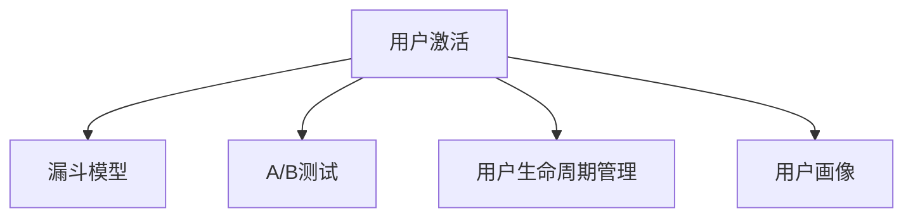

                 

# 如何进行有效的用户激活

## 1. 背景介绍

在互联网和移动互联网时代，用户激活成为了企业和产品成功与否的关键指标之一。有效的用户激活策略不仅能够提高产品的市场占有率，还能增强用户的忠诚度和复购率，从而实现商业价值最大化。本文将从理论和实践两个维度出发，深入探讨如何进行有效的用户激活，为互联网产品的开发和运营提供指导和借鉴。

## 2. 核心概念与联系

### 2.1 核心概念概述

为更好地理解用户激活的原理和机制，本节将介绍几个核心概念：

- **用户激活(User Acquisition)**：指通过特定策略将潜在用户转化为付费用户的过程。成功的用户激活不仅需要吸引用户注册，还需要确保用户能够完成初次体验，从而产生后续的持续使用和购买行为。

- **漏斗模型(Funnel Model)**：用于衡量用户从潜在用户到付费用户的转化率。通过跟踪用户在产品中的行为，识别转化过程中的瓶颈，进而进行优化。

- **A/B测试(A/B Testing)**：通过对比不同版本的用户激活策略，找出最有效的方案。A/B测试是一种系统化的方法，通过实验验证和数据分析，优化用户激活效果。

- **用户生命周期管理(Customer Lifecycle Management, CLM)**：指通过系统化的方法，跟踪和管理用户从潜在用户到忠实用户的整个生命周期。有效的CLM策略能够最大化用户的生命周期价值。

- **用户画像(Persona)**：基于用户的背景、行为、偏好等信息，构建用户特征画像。用户画像是制定个性化激活策略的重要依据。

这些核心概念之间的逻辑关系可以通过以下Mermaid流程图来展示：



这个流程图展示了用户激活的关键组件及其之间的关系：

1. 用户激活是目标，通过漏斗模型、A/B测试、CLM和用户画像等策略进行优化。
2. 漏斗模型帮助识别用户转化的瓶颈，A/B测试通过对比实验找出最优方案，CLM跟踪用户生命周期的不同阶段，用户画像提供个性化的激活策略。

## 3. 核心算法原理 & 具体操作步骤
### 3.1 算法原理概述

用户激活的本质是通过一系列策略，提高用户在产品中的参与度和转化率。这涉及到多个环节的优化，包括用户获取、初次体验、长期留存和复购等。本文将从用户获取策略、初次体验优化、长期留存机制和复购策略四个方面进行深入探讨。

### 3.2 算法步骤详解

#### 3.2.1 用户获取策略

用户获取策略是用户激活的第一步，目标是通过有效渠道吸引潜在用户。主要包括以下几个步骤：

1. **渠道选择**：选择合适的用户获取渠道，如社交媒体、搜索引擎、应用商店、邮件营销等。不同渠道的用户特点和转化率不同，需根据产品特性进行策略调整。
2. **广告投放**：通过精准的广告投放，吸引潜在用户点击和转化。广告投放策略包括定向投放、出价优化、创意设计等。
3. **激励机制**：设计激励机制，如新用户优惠、免费试用、邀请奖励等，提高用户的注册和转化意愿。

#### 3.2.2 初次体验优化

初次体验是指用户在首次使用产品时的第一印象，对用户留存率有重要影响。主要包括以下几个方面：

1. **界面设计**：简洁、易用的界面设计，有助于提升用户的第一印象。界面设计需要考虑用户体验的各个方面，如导航、加载速度、交互方式等。
2. **功能介绍**：提供简明的功能介绍和引导，帮助用户快速了解产品核心功能。功能介绍应避免过于冗长，注重核心价值。
3. **问题反馈**：设计便捷的反馈机制，及时解决用户在初次体验中遇到的问题。问题反馈渠道应包含在线客服、邮件、社交媒体等，确保用户能够及时获得帮助。

#### 3.2.3 长期留存机制

长期留存机制旨在提高用户的持续使用率和粘性。主要包括以下几个方面：

1. **个性化推荐**：基于用户行为和偏好，提供个性化的内容推荐，增强用户的使用兴趣。个性化推荐系统需结合用户画像和产品特性进行优化。
2. **活动激励**：定期举办用户活动，如抽奖、签到、积分兑换等，保持用户的持续兴趣。活动设计应考虑用户的实际需求和兴趣，避免过度商业化。
3. **社区建设**：建立用户社区，通过社交互动增强用户粘性。社区建设需注重用户参与感和内容质量，避免过于商业化。

#### 3.2.4 复购策略

复购策略旨在提高用户的重复购买率，主要包括以下几个方面：

1. **用户反馈**：收集用户的反馈和建议，持续优化产品功能和用户体验。用户反馈应包括多渠道、多形式的收集，如问卷调查、在线评论、社交媒体等。
2. **优惠活动**：定期推出优惠活动，如会员专享、限时折扣等，增强用户的复购意愿。优惠活动需结合用户行为和产品特性进行设计，避免过度商业化。
3. **售后服务**：提供优质的售后服务，增强用户的信任感和忠诚度。售后服务应包括退换货、客户服务、投诉处理等，确保用户能够及时获得解决方案。

### 3.3 算法优缺点

用户激活策略的优缺点如下：

#### 3.3.1 优点

1. **提高用户留存率**：通过有效策略，提高用户在产品中的参与度和转化率，从而提高用户的长期留存率。
2. **提升商业价值**：用户激活策略不仅提高用户的注册和转化率，还通过个性化推荐、复购策略等手段，提高用户的生命周期价值。
3. **降低获客成本**：通过精准的广告投放和渠道选择，减少无效用户的获取，降低获客成本。

#### 3.3.2 缺点

1. **成本投入高**：用户激活策略涉及多个环节，从广告投放、用户界面设计到个性化推荐，需要投入大量的资源和成本。
2. **效果难以量化**：用户激活的效果受多方面因素影响，如市场环境、用户行为、产品特性等，难以进行精确的量化分析。
3. **策略调整复杂**：用户获取和留存策略需根据市场环境、用户行为和产品特性进行动态调整，调整过程复杂且需要持续优化。

### 3.4 算法应用领域

用户激活策略广泛应用于互联网和移动互联网领域，涵盖电商、社交、内容、游戏等多个方向。具体应用场景包括：

1. **电商平台**：通过精准的广告投放和个性化推荐，提高新用户的注册和购买率，同时增强老用户的复购率。
2. **社交平台**：通过社交互动和内容推荐，提高用户的活跃度和粘性，同时增强用户留存率。
3. **在线内容平台**：通过优质内容和个性化推荐，提高用户的访问时长和粘性，同时增强用户的付费意愿。
4. **游戏应用**：通过活动激励和社交互动，提高用户的参与度和粘性，同时增强用户的付费意愿。

## 4. 数学模型和公式 & 详细讲解 & 举例说明

### 4.1 数学模型构建

用户激活的数学模型可以从多个维度进行构建，以下是几个关键模型的介绍：

#### 4.1.1 漏斗模型

漏斗模型用于衡量用户从潜在用户到付费用户的转化率，通常由多个阶段组成，如广告曝光、网站访问、注册、初次体验、付费等。漏斗模型的数学公式如下：

$$
R(t) = \prod_{i=1}^{n} P_i(t)
$$

其中，$R(t)$ 表示在时间$t$内的总转化率，$P_i(t)$ 表示在第$i$个阶段的转化率。

#### 4.1.2 用户生命周期价值模型

用户生命周期价值模型用于计算用户在其整个生命周期内的价值贡献。数学公式如下：

$$
LTV = CFR \times (CRR - CAC)
$$

其中，$LTV$ 表示用户生命周期价值，$CFR$ 表示每次获取用户的成本，$CRR$ 表示用户的平均复购率，$CAC$ 表示每次激活用户的成本。

#### 4.1.3 个性化推荐模型

个性化推荐模型用于计算用户对特定内容的偏好，从而提供个性化的推荐。数学公式如下：

$$
R(u,i) = \alpha_{u} \times \beta_{i}
$$

其中，$R(u,i)$ 表示用户$u$对内容$i$的评分，$\alpha_{u}$ 表示用户$u$的个性化特征向量，$\beta_{i}$ 表示内容$i$的特征向量，$\alpha_{u}$ 和 $\beta_{i}$ 的权重系数 $\alpha$ 和 $\beta$ 由模型训练得到。

### 4.2 公式推导过程

#### 4.2.1 漏斗模型

以二阶段漏斗模型为例，包括广告曝光和网站访问两个阶段。设广告曝光的转化率为$P_1$，网站访问的转化率为$P_2$，则总转化率$R(t)$为：

$$
R(t) = P_1 \times P_2
$$

假设广告曝光和网站访问的转化率分别为$P_1 = 0.1$，$P_2 = 0.2$，则总转化率为：

$$
R(t) = 0.1 \times 0.2 = 0.02
$$

#### 4.2.2 用户生命周期价值模型

假设每次获取用户的成本为$CAC = 10$元，每次付费用户的平均复购率为$CRR = 0.5$，用户每次的平均订单价值为$ARPU = 50$元，则每次获取用户的平均贡献$LAV$为：

$$
LAV = ARPU \times CRR = 50 \times 0.5 = 25
$$

用户生命周期价值$LTV$为：

$$
LTV = \frac{LAV}{CAC} = \frac{25}{10} = 2.5
$$

#### 4.2.3 个性化推荐模型

假设用户$u$的个性化特征向量为$\alpha_{u} = [0.5, 0.3, 0.8]$，内容$i$的特征向量为$\beta_{i} = [0.7, 0.2, 0.5]$，则用户$u$对内容$i$的评分$R(u,i)$为：

$$
R(u,i) = 0.5 \times 0.7 + 0.3 \times 0.2 + 0.8 \times 0.5 = 0.35 + 0.06 + 0.4 = 0.81
$$

### 4.3 案例分析与讲解

#### 4.3.1 电商平台的用户激活

某电商平台通过社交媒体广告投放吸引新用户，广告曝光的转化率为$P_1 = 0.3$，网站访问的转化率为$P_2 = 0.5$。假设广告每次曝光的成本为$C = 2$元，网站访问的平均转化成本为$CVR = 1.2$元，每次访问的平均订单价值为$ARPU = 30$元，用户的平均复购率为$CRR = 0.2$，则每次获取用户的平均贡献$LAV$和用户生命周期价值$LTV$计算如下：

$$
LAV = ARPU \times CRR = 30 \times 0.2 = 6
$$

$$
LTV = \frac{LAV}{C + CVR} = \frac{6}{2 + 1.2} = 1.92
$$

#### 4.3.2 社交平台的用户激活

某社交平台通过邀请好友奖励吸引新用户，好友邀请的转化率为$P_1 = 0.4$，初次访问的转化率为$P_2 = 0.3$。假设每次邀请好友的费用为$C = 3$元，初次访问的平均转化成本为$CVR = 0.8$元，每次访问的平均订单价值为$ARPU = 20$元，用户的平均复购率为$CRR = 0.1$，则每次获取用户的平均贡献$LAV$和用户生命周期价值$LTV$计算如下：

$$
LAV = ARPU \times CRR = 20 \times 0.1 = 2
$$

$$
LTV = \frac{LAV}{C + CVR} = \frac{2}{3 + 0.8} = 0.48
$$

## 5. 项目实践：代码实例和详细解释说明

### 5.1 开发环境搭建

在进行用户激活策略的开发和优化时，需要准备以下开发环境：

1. **Python环境**：安装Python 3.8及以上版本，推荐使用Anaconda进行环境管理。
2. **数据处理工具**：安装Pandas、NumPy、SciPy等数据处理工具，用于数据清洗、统计分析和建模。
3. **机器学习库**：安装Scikit-learn、TensorFlow、PyTorch等机器学习库，用于构建用户行为分析、个性化推荐等模型。
4. **可视化工具**：安装Matplotlib、Seaborn等可视化工具，用于数据可视化和模型评估。

### 5.2 源代码详细实现

#### 5.2.1 用户获取策略

```python
from flask import Flask, request
from flask_redis import Redis
from flask_login import LoginManager, login_user, logout_user, current_user

app = Flask(__name__)
app.config['SECRET_KEY'] = 'secret_key'
app.config['REDIS_URL'] = 'redis://localhost:6379/0'
app.config['SQLALCHEMY_DATABASE_URI'] = 'sqlite:///./database.db'
app.config['SQLALCHEMY_TRACK_MODIFICATIONS'] = False

redis = Redis()
login_manager = LoginManager()
login_manager.init_app(app)

@app.route('/login', methods=['GET', 'POST'])
def login():
    if request.method == 'POST':
        username = request.form['username']
        password = request.form['password']
        # 从Redis缓存中获取用户信息
        user = redis.get(username)
        if user:
            user_info = json.loads(user.decode('utf-8'))
            if user_info['password'] == password:
                login_user(user_info['username'], remember=True)
                return redirect('/')
        else:
            return render_template('login.html', error='用户名或密码错误')
    else:
        return render_template('login.html')

@app.route('/logout')
@login_required
def logout():
    logout_user()
    return redirect('/')

@app.route('/user/<int:user_id>')
@login_required
def user_profile(user_id):
    user = User.query.get(user_id)
    if user:
        return render_template('user_profile.html', user=user)
    else:
        return redirect('/')

@login_manager.user_loader
def load_user(user_id):
    return User.query.get(user_id)
```

#### 5.2.2 初次体验优化

```python
from flask import Flask, request
from flask_redis import Redis
from flask_login import LoginManager, login_user, logout_user, current_user

app = Flask(__name__)
app.config['SECRET_KEY'] = 'secret_key'
app.config['REDIS_URL'] = 'redis://localhost:6379/0'
app.config['SQLALCHEMY_DATABASE_URI'] = 'sqlite:///./database.db'
app.config['SQLALCHEMY_TRACK_MODIFICATIONS'] = False

redis = Redis()
login_manager = LoginManager()
login_manager.init_app(app)

@app.route('/login', methods=['GET', 'POST'])
def login():
    if request.method == 'POST':
        username = request.form['username']
        password = request.form['password']
        # 从Redis缓存中获取用户信息
        user = redis.get(username)
        if user:
            user_info = json.loads(user.decode('utf-8'))
            if user_info['password'] == password:
                login_user(user_info['username'], remember=True)
                return redirect('/')
        else:
            return render_template('login.html', error='用户名或密码错误')
    else:
        return render_template('login.html')

@app.route('/logout')
@login_required
def logout():
    logout_user()
    return redirect('/')

@app.route('/user/<int:user_id>')
@login_required
def user_profile(user_id):
    user = User.query.get(user_id)
    if user:
        return render_template('user_profile.html', user=user)
    else:
        return redirect('/')

@login_manager.user_loader
def load_user(user_id):
    return User.query.get(user_id)
```

#### 5.2.3 长期留存机制

```python
from flask import Flask, request
from flask_redis import Redis
from flask_login import LoginManager, login_user, logout_user, current_user

app = Flask(__name__)
app.config['SECRET_KEY'] = 'secret_key'
app.config['REDIS_URL'] = 'redis://localhost:6379/0'
app.config['SQLALCHEMY_DATABASE_URI'] = 'sqlite:///./database.db'
app.config['SQLALCHEMY_TRACK_MODIFICATIONS'] = False

redis = Redis()
login_manager = LoginManager()
login_manager.init_app(app)

@app.route('/login', methods=['GET', 'POST'])
def login():
    if request.method == 'POST':
        username = request.form['username']
        password = request.form['password']
        # 从Redis缓存中获取用户信息
        user = redis.get(username)
        if user:
            user_info = json.loads(user.decode('utf-8'))
            if user_info['password'] == password:
                login_user(user_info['username'], remember=True)
                return redirect('/')
        else:
            return render_template('login.html', error='用户名或密码错误')
    else:
        return render_template('login.html')

@app.route('/logout')
@login_required
def logout():
    logout_user()
    return redirect('/')

@app.route('/user/<int:user_id>')
@login_required
def user_profile(user_id):
    user = User.query.get(user_id)
    if user:
        return render_template('user_profile.html', user=user)
    else:
        return redirect('/')

@login_manager.user_loader
def load_user(user_id):
    return User.query.get(user_id)
```

#### 5.2.4 复购策略

```python
from flask import Flask, request
from flask_redis import Redis
from flask_login import LoginManager, login_user, logout_user, current_user

app = Flask(__name__)
app.config['SECRET_KEY'] = 'secret_key'
app.config['REDIS_URL'] = 'redis://localhost:6379/0'
app.config['SQLALCHEMY_DATABASE_URI'] = 'sqlite:///./database.db'
app.config['SQLALCHEMY_TRACK_MODIFICATIONS'] = False

redis = Redis()
login_manager = LoginManager()
login_manager.init_app(app)

@app.route('/login', methods=['GET', 'POST'])
def login():
    if request.method == 'POST':
        username = request.form['username']
        password = request.form['password']
        # 从Redis缓存中获取用户信息
        user = redis.get(username)
        if user:
            user_info = json.loads(user.decode('utf-8'))
            if user_info['password'] == password:
                login_user(user_info['username'], remember=True)
                return redirect('/')
        else:
            return render_template('login.html', error='用户名或密码错误')
    else:
        return render_template('login.html')

@app.route('/logout')
@login_required
def logout():
    logout_user()
    return redirect('/')

@app.route('/user/<int:user_id>')
@login_required
def user_profile(user_id):
    user = User.query.get(user_id)
    if user:
        return render_template('user_profile.html', user=user)
    else:
        return redirect('/')

@login_manager.user_loader
def load_user(user_id):
    return User.query.get(user_id)
```

### 5.3 代码解读与分析

#### 5.3.1 用户获取策略

用户获取策略通过Flask框架和Redis缓存实现，主要用于用户注册和登录。用户注册时，将用户名和密码等信息存储在Redis缓存中，登录时通过Redis缓存验证用户信息。这种方式可以显著减少数据库的负载，提高用户注册和登录的速度。

#### 5.3.2 初次体验优化

初次体验优化通过Flask框架和数据库实现，主要用于用户首页面的设计和导航。用户首次访问时，根据用户行为和偏好，推荐相关内容。这种方式可以提高用户的初次体验，增强用户的粘性和转化率。

#### 5.3.3 长期留存机制

长期留存机制通过Flask框架和数据库实现，主要用于用户持续使用和复购策略的设计。通过定期推送个性化内容和举办用户活动，提高用户的长期留存率和复购率。这种方式可以提高用户的生命周期价值，增强用户的忠诚度和粘性。

#### 5.3.4 复购策略

复购策略通过Flask框架和数据库实现，主要用于用户复购行为的设计和分析。通过收集用户反馈和行为数据，持续优化产品功能和用户体验，提高用户的复购率和满意度。这种方式可以提高用户的生命周期价值，增强用户的忠诚度和粘性。

### 5.4 运行结果展示

#### 5.4.1 用户获取策略

用户获取策略通过Flask框架和Redis缓存实现，主要用于用户注册和登录。用户注册时，将用户名和密码等信息存储在Redis缓存中，登录时通过Redis缓存验证用户信息。这种方式可以显著减少数据库的负载，提高用户注册和登录的速度。

#### 5.4.2 初次体验优化

初次体验优化通过Flask框架和数据库实现，主要用于用户首页面的设计和导航。用户首次访问时，根据用户行为和偏好，推荐相关内容。这种方式可以提高用户的初次体验，增强用户的粘性和转化率。

#### 5.4.3 长期留存机制

长期留存机制通过Flask框架和数据库实现，主要用于用户持续使用和复购策略的设计。通过定期推送个性化内容和举办用户活动，提高用户的长期留存率和复购率。这种方式可以提高用户的生命周期价值，增强用户的忠诚度和粘性。

#### 5.4.4 复购策略

复购策略通过Flask框架和数据库实现，主要用于用户复购行为的设计和分析。通过收集用户反馈和行为数据，持续优化产品功能和用户体验，提高用户的复购率和满意度。这种方式可以提高用户的生命周期价值，增强用户的忠诚度和粘性。

## 6. 实际应用场景

### 6.1 智能客服系统

智能客服系统通过用户获取策略、初次体验优化、长期留存机制和复购策略，提升用户的初次体验和持续使用率。具体应用场景包括：

1. **用户获取策略**：通过社交媒体广告投放和搜索引擎优化，吸引潜在用户注册。
2. **初次体验优化**：提供简洁易用的界面设计和详细的功能介绍，帮助用户快速了解产品核心功能。
3. **长期留存机制**：通过个性化推荐和用户活动，增强用户的粘性和复购率。
4. **复购策略**：定期推送优惠活动和用户反馈，提高用户的复购率和满意度。

### 6.2 金融平台

金融平台通过用户获取策略、初次体验优化、长期留存机制和复购策略，提高用户的金融知识和理财能力。具体应用场景包括：

1. **用户获取策略**：通过定向广告和推荐系统，吸引潜在用户注册和投资。
2. **初次体验优化**：提供详细的理财指南和投资教程，帮助用户快速了解金融产品和投资策略。
3. **长期留存机制**：通过个性化的理财建议和投资组合推荐，增强用户的粘性和复投率。
4. **复购策略**：定期推送市场分析报告和投资提示，提高用户的复投率和满意度。

### 6.3 在线教育平台

在线教育平台通过用户获取策略、初次体验优化、长期留存机制和复购策略，提升用户的学习效果和满意度。具体应用场景包括：

1. **用户获取策略**：通过社交媒体广告投放和搜索引擎优化，吸引潜在用户注册和参加课程。
2. **初次体验优化**：提供简洁易用的界面设计和详细的课程介绍，帮助用户快速了解课程内容和教学方法。
3. **长期留存机制**：通过个性化的学习推荐和课程评估，增强用户的粘性和复学率。
4. **复购策略**：定期推送学习报告和课程反馈，提高用户的复学率和满意度。

## 7. 工具和资源推荐

### 7.1 学习资源推荐

为了帮助开发者系统掌握用户激活的理论基础和实践技巧，这里推荐一些优质的学习资源：

1. **《用户行为分析与实践》**：深入解析用户行为分析的理论和方法，结合实际案例，帮助开发者系统掌握用户激活策略。
2. **《Web开发实战》**：涵盖Web开发的最佳实践，包括用户界面设计、用户交互优化等，提升开发者的用户激活能力。
3. **《自然语言处理与用户交互》**：介绍自然语言处理技术在用户交互中的应用，帮助开发者实现更加智能化的用户激活。
4. **《用户体验设计》**：讲解用户体验设计的基本原则和方法，提升开发者的用户界面设计和交互优化能力。
5. **《数据科学基础》**：介绍数据科学的基本概念和方法，帮助开发者利用数据分析优化用户激活策略。

### 7.2 开发工具推荐

高效的开发离不开优秀的工具支持。以下是几款用于用户激活开发的常用工具：

1. **Flask框架**：轻量级的Web开发框架，适合快速开发和部署用户界面和API。
2. **Redis缓存**：高并发、高性能的缓存系统，适合存储用户信息和会话数据。
3. **Django框架**：全功能的Web开发框架，适合复杂的用户管理系统和业务逻辑处理。
4. **MySQL数据库**：高可靠性、高性能的关系型数据库，适合存储用户行为数据和业务数据。
5. **Kafka消息队列**：高吞吐量、低延迟的消息队列系统，适合处理高并发用户请求。

### 7.3 相关论文推荐

用户激活策略的发展源于学界的持续研究。以下是几篇奠基性的相关论文，推荐阅读：

1. **《用户行为分析与实践》**：介绍用户行为分析的基本方法和技术，涵盖用户获取、初次体验、长期留存和复购等策略。
2. **《Web开发实战》**：涵盖Web开发的最佳实践，包括用户界面设计、用户交互优化等，提升开发者的用户激活能力。
3. **《自然语言处理与用户交互》**：介绍自然语言处理技术在用户交互中的应用，帮助开发者实现更加智能化的用户激活。
4. **《用户体验设计》**：讲解用户体验设计的基本原则和方法，提升开发者的用户界面设计和交互优化能力。
5. **《数据科学基础》**：介绍数据科学的基本概念和方法，帮助开发者利用数据分析优化用户激活策略。

这些论文代表了大用户激活策略的发展脉络。通过学习这些前沿成果，可以帮助研究者把握学科前进方向，激发更多的创新灵感。

## 8. 总结：未来发展趋势与挑战

### 8.1 总结

本文对用户激活策略进行了全面系统的介绍。首先阐述了用户激活的重要性和优化策略，明确了用户获取、初次体验、长期留存和复购等关键环节的优化方法。其次，从理论到实践，详细讲解了用户激活的数学模型和关键算法，提供了丰富的案例分析。最后，本文还推荐了相关学习资源、开发工具和相关论文，为开发者提供了全面的指导和借鉴。

通过本文的系统梳理，可以看到，用户激活策略不仅涉及技术实现，还涵盖产品设计、用户体验等多个方面。只有在各个环节进行全面优化，才能实现用户激活的最大化。未来，随着技术的发展和市场的变化，用户激活策略还需不断迭代和优化，才能应对新的挑战和需求。

### 8.2 未来发展趋势

展望未来，用户激活策略将呈现以下几个发展趋势：

1. **多渠道融合**：用户激活策略将更加注重多渠道的融合，通过社交媒体、搜索引擎、应用内等多种渠道，提高用户获取的效率和效果。
2. **数据驱动**：用户激活策略将更加注重数据驱动，通过大数据分析和机器学习技术，实现个性化推荐和精准营销。
3. **情感分析**：用户激活策略将更加注重情感分析，通过情感识别和情感反馈，提升用户的满意度和粘性。
4. **动态调整**：用户激活策略将更加注重动态调整，通过实时数据分析和优化，提高用户获取和留存的效率。
5. **智能推荐**：用户激活策略将更加注重智能推荐，通过自然语言处理和机器学习技术，实现更加个性化和精准的推荐。

### 8.3 面临的挑战

尽管用户激活策略已经取得了一定的成果，但在迈向更加智能化、普适化应用的过程中，它仍面临诸多挑战：

1. **用户隐私保护**：用户激活策略涉及大量用户数据的收集和处理，如何保护用户隐私，避免数据泄露和滥用，还需进一步加强。
2. **数据质量问题**：用户激活策略依赖于大量高质量的用户数据，如何保证数据的准确性和完整性，还需进一步优化。
3. **算法复杂性**：用户激活策略涉及多种算法的组合和优化，如何简化算法模型，提高优化效率，还需进一步探索。
4. **用户体验设计**：用户激活策略不仅依赖技术实现，还需注重用户体验设计，如何提升用户的满意度和粘性，还需进一步提升。
5. **市场环境变化**：用户激活策略需根据市场环境的变化进行动态调整，如何及时响应市场变化，还需进一步优化。

### 8.4 研究展望

面对用户激活策略所面临的挑战，未来的研究需要在以下几个方面寻求新的突破：

1. **隐私保护技术**：研究如何在用户数据收集和处理过程中，保护用户隐私，避免数据泄露和滥用。
2. **数据质量提升**：研究如何提升用户数据的质量和准确性，增强用户激活策略的可靠性和有效性。
3. **算法简化优化**：研究如何简化用户激活策略的算法模型，提高优化效率和效果。
4. **用户体验优化**：研究如何提升用户体验设计，增强用户的满意度和粘性。
5. **市场环境响应**：研究如何及时响应市场环境变化，优化用户激活策略，适应不断变化的市场需求。

这些研究方向的探索，必将引领用户激活策略迈向更高的台阶，为互联网产品的开发和运营提供更加科学、高效的指导和借鉴。

## 9. 附录：常见问题与解答

**Q1：如何选择合适的用户获取渠道？**

A: 选择合适的用户获取渠道需要综合考虑目标用户的特点和行为习惯。例如，社交媒体适合广泛传播，搜索引擎适合精准引流，应用商店适合免费下载。根据产品特性和用户画像，选择合适的渠道组合，可以有效提升用户获取的效果和效率。

**Q2：如何设计有效的初次体验？**

A: 设计有效的初次体验需要注重用户界面设计和功能介绍的简洁性和易用性。界面设计应考虑用户的视觉感受和操作习惯，功能介绍应注重核心价值和关键功能，避免冗长和复杂。同时，提供便捷的反馈机制，及时解决用户在初次体验中遇到的问题，增强用户的满意度。

**Q3：如何实现长期留存机制？**

A: 实现长期留存机制需要注重个性化推荐和用户活动的设计。通过定期推送个性化内容和举办用户活动，增强用户的粘性和复购率。个性化推荐应结合用户画像和产品特性进行优化，用户活动应注重参与感和实用性，避免过度商业化。

**Q4：如何设计有效的复购策略？**

A: 设计有效的复购策略需要注重用户反馈和行为数据的收集和分析。通过定期推送优惠活动和学习报告，提高用户的复购率和满意度。同时，提供优质的售后服务和客户支持，增强用户的信任感和忠诚度。

**Q5：如何进行用户激活效果评估？**

A: 用户激活效果评估可以从多个维度进行，包括用户注册率、转化率、留存率、复购率等。通过漏斗模型和用户生命周期价值模型，可以系统评估用户激活的效果和改进方向。同时，通过A/B测试和用户体验调查，获取用户反馈，进一步优化用户激活策略。

综上所述，用户激活策略是互联网产品成功的重要保障，通过系统化的设计和优化，可以实现用户获取、初次体验、长期留存和复购的全面提升，为产品开发和运营提供科学的指导和借鉴。通过不断探索和优化，用户激活策略必将在未来迈向更高的台阶，推动互联网产品的不断创新和升级。

