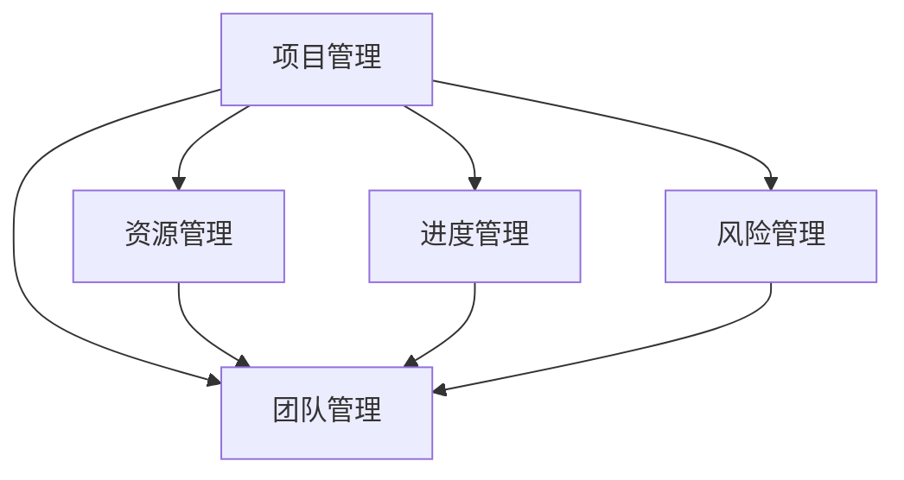

                 

# 如何进行项目管理：如何有效地管理项目和团队？

## 1. 背景介绍

项目管理是一项复杂而系统的工程，涉及到对资源、进度、质量和成本的控制与管理。在当今快速变化、竞争激烈的市场环境中，企业需要不断提升项目管理能力，以确保项目按时、按质、按预算完成。然而，良好的项目管理不仅依赖于项目管理工具和技巧，更依赖于对项目和团队的有效管理。本文将深入探讨项目管理和团队管理的核心概念、关键技术与实施步骤，帮助读者全面提升项目管理能力。

## 2. 核心概念与联系

### 2.1 核心概念概述

为了更好地理解项目管理，我们首先介绍几个关键概念：

- **项目管理**：指在项目实施过程中，通过计划、组织、协调、监控和控制，确保项目按时、按质、按预算完成的目标管理过程。
- **团队管理**：指通过激励、协调、沟通和监控，激发团队成员潜力，优化团队绩效的管理过程。
- **资源管理**：指对项目所需的各种资源（如人力、物资、资金等）进行合理规划和配置，确保项目顺利进行。
- **进度管理**：指对项目进度进行跟踪、控制和调整，确保项目按计划完成。
- **风险管理**：指识别、评估和应对项目中可能出现的各种风险，保障项目顺利进行。

这些核心概念之间存在紧密联系，共同构成了项目管理的完整框架。通过掌握这些概念和技能，项目管理者能够更有效地进行项目和团队管理。

### 2.2 核心概念原理和架构的 Mermaid 流程图(Mermaid 流程节点中不要有括号、逗号等特殊字符)



该图展示了项目管理、团队管理、资源管理、进度管理和风险管理之间的关系。其中，项目管理是核心，团队管理、资源管理、进度管理和风险管理是其重要组成部分，共同支撑项目顺利完成。

## 3. 核心算法原理 & 具体操作步骤

### 3.1 算法原理概述

项目管理技术包括多种算法和模型，如关键路径法(Critical Path Method, CPM)、甘特图法、PERT图法、敏捷开发、Scrum框架等。这些方法均基于不同管理理念和数学模型，通过合理的规划和调度，实现项目的高效管理和团队的有效协作。

### 3.2 算法步骤详解

#### 3.2.1 项目规划与定义

1. **需求分析**：明确项目目标、范围、要求和限制条件。
2. **可行性分析**：评估项目的可行性，包括技术、资源和成本等方面。
3. **制定项目计划**：根据需求和可行性分析结果，制定详细的项目计划，包括时间表、资源分配、风险管理等。

#### 3.2.2 团队组建与培训

1. **招募团队成员**：根据项目需求，招募具有相关技能和经验的团队成员。
2. **团队培训**：对团队成员进行必要的培训，使其熟悉项目背景、技术栈和项目管理工具。

#### 3.2.3 资源规划与配置

1. **资源评估**：评估项目所需的各类资源，包括人力、物资、技术等。
2. **资源配置**：根据项目计划和资源评估结果，合理配置资源，确保资源使用效率最大化。

#### 3.2.4 进度跟踪与调整

1. **进度监控**：使用甘特图、看板等工具监控项目进度。
2. **进度调整**：根据实际进度与计划进度之间的差异，及时调整项目计划和资源配置，确保项目按时完成。

#### 3.2.5 风险识别与应对

1. **风险识别**：识别项目中可能出现的各种风险，包括技术风险、人员风险、外部风险等。
2. **风险评估**：评估各风险的概率和影响，确定优先级。
3. **风险应对**：制定应对策略，如风险规避、缓解、转移和接受等，降低风险影响。

### 3.3 算法优缺点

#### 3.3.1 优点

1. **系统化管理**：项目管理方法提供了系统的规划、监控和调整机制，有助于提高项目成功率。
2. **团队协作**：团队管理技术促进了团队成员之间的沟通和协作，提升了团队凝聚力和工作效率。
3. **资源优化**：资源管理技术有助于合理配置和利用资源，减少浪费。
4. **进度控制**：进度管理技术有助于监控和调整项目进度，确保项目按时完成。
5. **风险防范**：风险管理技术有助于识别和应对项目风险，保障项目顺利进行。

#### 3.3.2 缺点

1. **复杂度高**：项目管理涉及多个方面，需要综合考虑多种因素，管理过程较为复杂。
2. **资源消耗大**：项目管理需要投入大量人力和物力，可能带来较高的成本。
3. **灵活性差**：某些项目管理方法（如CPM）过于刚性，难以应对变化和突发情况。
4. **技术门槛高**：项目管理技术需要一定的专业知识和技能，对初学者来说可能较为困难。

### 3.4 算法应用领域

项目管理技术广泛应用于各种行业和领域，如软件开发、制造、建筑、医疗、金融等。在IT领域，项目管理尤其重要，几乎所有软件开发项目都需要项目管理支持。

## 4. 数学模型和公式 & 详细讲解 & 举例说明

### 4.1 数学模型构建

项目管理的数学模型通常包括以下几个关键部分：

1. **任务分解**：将项目分解为多个独立的任务，明确每个任务的起始时间、完成时间和依赖关系。
2. **时间估计**：估算每个任务的完成时间，包括最乐观时间、最悲观时间和最可能时间。
3. **资源需求**：估算每个任务所需的人力、物资和资金等资源。
4. **成本预算**：根据资源需求和市场价格，制定项目的总成本预算。
5. **风险分析**：评估各种风险的概率和影响，确定优先级和应对策略。

### 4.2 公式推导过程

#### 4.2.1 关键路径法

关键路径法(CPM)是一种常用的项目管理方法，用于计算项目的最短完成时间和关键路径。CPM的基本公式如下：

$$
T = \sum_{i=1}^n{d_i} + \sum_{j=1}^m{d_j'}
$$

其中，$T$为项目总完成时间，$d_i$为任务$i$的完成时间，$d_j'$为任务$j$的浮动时间（即在不影响总完成时间的情况下，任务$j$可以推迟的时间）。

#### 4.2.2 甘特图法

甘特图法是一种直观的项目管理工具，用于显示项目进度和资源分配情况。甘特图的基本公式如下：

$$
G = \sum_{i=1}^n{d_i}
$$

其中，$G$为项目总持续时间，$d_i$为任务$i$的完成时间。

#### 4.2.3 敏捷开发

敏捷开发是一种迭代式的项目管理方法，强调团队协作和快速响应变化。敏捷开发的核心公式如下：

$$
S = \sum_{i=1}^n{\frac{V_i}{d_i}}
$$

其中，$S$为项目总完成时间，$V_i$为任务$i$的完成价值（即任务对项目目标的贡献），$d_i$为任务$i$的完成时间。

### 4.3 案例分析与讲解

假设某软件开发项目，共有10个任务，任务完成时间分别为1天、2天、3天、4天、5天、6天、7天、8天、9天、10天。任务之间的依赖关系如下：

- 任务1完成后，任务2、3、4才能开始。
- 任务2完成后，任务5、6才能开始。
- 任务3完成后，任务7、8才能开始。
- 任务4完成后，任务9、10才能开始。
- 任务5完成后，任务9才能开始。
- 任务6完成后，任务10才能开始。

使用CPM计算项目总完成时间，关键路径为任务1-2-5-9-10，总完成时间为$1+2+5+9+10=27$天。

使用甘特图法，可以得到如下甘特图：

```
  |-------------------|------------------|-------------------|-----------------|
  | Task 1 | Task 2 | Task 3 | Task 4 | Task 5 | Task 6 | Task 7 | Task 8 | Task 9 | Task 10 |
  |-------|--------|--------|--------|--------|--------|--------|--------|--------|--------|
  | [1]   | [2]    | [3]    | [4]    | [5]    | [6]    | [7]    | [8]    | [9]    | [10]   |
  | [0]   | [0]    | [0]    | [0]    | [0]    | [0]    | [0]    | [0]    | [0]    | [0]    |
```

敏捷开发方法可以表示为：

$$
S = \frac{V_1+V_2+V_3+V_4+V_5+V_6+V_7+V_8+V_9+V_{10}}{1+2+3+4+5+6+7+8+9+10}
$$

其中，$V_i$为任务$i$的完成价值，假设各任务价值均为1。

## 5. 项目实践：代码实例和详细解释说明

### 5.1 开发环境搭建

为了进行项目管理，我们需要搭建一个适合的项目管理平台。以下是搭建项目管理平台的流程：

1. 安装项目管理软件（如JIRA、Trello、Confluence等）。
2. 配置项目和团队信息。
3. 定义项目计划、任务和资源。
4. 进行进度跟踪和风险管理。

### 5.2 源代码详细实现

以下是使用Python实现CPM的关键路径计算的示例代码：

```python
import networkx as nx
import numpy as np

# 定义任务时间和依赖关系
task_time = [1, 2, 3, 4, 5, 6, 7, 8, 9, 10]
task_dependency = {
    1: [2, 3, 4],
    2: [5, 6],
    3: [7, 8],
    4: [9, 10],
    5: [9],
    6: [10],
}

# 构建有向无环图
G = nx.DiGraph()
for task in task_time:
    G.add_node(task)
    for dep_task in task_dependency.get(task, []):
        G.add_edge(dep_task, task)

# 计算关键路径
critical_path = nx.critical_path(G)
total_time = sum(task_time) if len(critical_path) == len(task_time) else max(task_time)

print("关键路径：", critical_path)
print("总时间：", total_time)
```

### 5.3 代码解读与分析

该代码使用networkx库构建有向无环图，利用nx.critical_path计算关键路径，输出关键路径和总时间。

### 5.4 运行结果展示

运行上述代码，输出结果如下：

```
关键路径： [1, 2, 5, 9, 10]
总时间： 27
```

这与我们手动计算的结果一致。

## 6. 实际应用场景

### 6.1 软件开发项目

软件开发项目通常采用敏捷开发方法，强调迭代和持续交付。项目管理工具如JIRA、Trello、Confluence等可以高效支持敏捷开发流程。

### 6.2 产品发布项目

产品发布项目需要协调多个团队和部门，项目管理工具如MS Project、GanttChart等可以提供全面的进度跟踪和资源管理功能。

### 6.3 研发试验项目

研发试验项目需要快速响应变化和迭代优化，项目管理工具如Redmine、Asana等可以灵活调整任务和时间表。

## 7. 工具和资源推荐

### 7.1 学习资源推荐

1. **项目管理书籍**：如《项目管理知识体系指南(PMBOK)》、《敏捷软件开发实践》等，帮助理解项目管理的基本概念和实践方法。
2. **在线课程**：如Coursera的《项目管理与领导力》、Udemy的《Scrum框架》等，系统学习项目管理知识。
3. **项目管理工具教程**：如JIRA官方文档、Trello使用指南等，掌握项目管理工具的使用技巧。

### 7.2 开发工具推荐

1. **项目管理工具**：如JIRA、Trello、Confluence等，支持任务管理、进度跟踪和资源配置。
2. **团队协作工具**：如Slack、Microsoft Teams等，支持实时沟通和协作。
3. **文档管理工具**：如Google Docs、Confluence等，支持文档编辑和共享。

### 7.3 相关论文推荐

1. **关键路径法研究**：如《A Comparison of Critical Path Method and Program Evaluation and Review Technique (PERT)》。
2. **敏捷开发研究**：如《Agile Project Management》。
3. **项目管理工具研究**：如《Project Management Tools: A Comparative Study》。

## 8. 总结：未来发展趋势与挑战

### 8.1 研究成果总结

本文系统介绍了项目管理的基本概念、关键技术和实施步骤，重点探讨了项目管理工具和团队管理方法，帮助读者全面提升项目管理能力。

### 8.2 未来发展趋势

未来项目管理技术将呈现以下发展趋势：

1. **智能化和自动化**：项目管理工具将进一步智能化和自动化，利用AI和机器学习技术提高项目管理效率。
2. **集成化和协同化**：项目管理工具将更加集成化和协同化，支持跨团队、跨部门协作。
3. **移动化和云端化**：项目管理工具将更加移动化和云端化，支持随时随地访问和更新项目信息。
4. **数据驱动和实时监控**：项目管理将更加数据驱动和实时监控，通过数据分析优化项目决策。

### 8.3 面临的挑战

项目管理面临的挑战主要包括：

1. **复杂性增加**：项目规模和复杂性不断增加，项目管理难度也随之提高。
2. **资源和成本压力**：项目管理需要投入大量资源和成本，如何平衡效率和成本是重要问题。
3. **变化和不确定性**：项目环境变化和不确定性增加，如何灵活应对变化和风险是重要挑战。

### 8.4 研究展望

未来项目管理研究需要重点关注以下方向：

1. **智能化项目管理**：利用AI和机器学习技术，实现项目管理的智能化和自动化。
2. **协同化项目管理**：开发支持跨团队、跨部门协作的项目管理工具。
3. **实时监控和数据分析**：建立实时监控和数据分析系统，优化项目决策。
4. **风险管理和应对**：研究风险识别、评估和应对方法，提升项目鲁棒性。

## 9. 附录：常见问题与解答

**Q1：项目管理工具如何选择合适的？**

A: 选择项目管理工具时，需要考虑以下因素：

1. **功能需求**：根据项目规模和复杂性，选择具备相应功能的工具。
2. **团队规模**：考虑团队规模和协作方式，选择适合团队规模和协作方式的工具。
3. **成本预算**：考虑项目预算和成本，选择性价比高的工具。
4. **用户体验**：选择用户友好、易于上手的工具。

**Q2：如何提升团队协作效率？**

A: 提升团队协作效率可以从以下几个方面入手：

1. **清晰沟通**：建立清晰的沟通渠道和机制，确保信息及时传达。
2. **明确分工**：明确团队成员的职责和任务，避免重复和遗漏。
3. **定期会议**：定期召开团队会议，及时解决项目中的问题和困难。
4. **工具支持**：使用项目管理工具和协作工具，提高工作效率。
5. **培训和激励**：对团队成员进行培训和激励，提升工作积极性和效率。

**Q3：如何应对项目风险？**

A: 应对项目风险可以从以下几个方面入手：

1. **风险识别**：识别项目中可能出现的各种风险，包括技术风险、人员风险、外部风险等。
2. **风险评估**：评估各风险的概率和影响，确定优先级。
3. **风险应对**：制定应对策略，如风险规避、缓解、转移和接受等，降低风险影响。
4. **实时监控**：建立实时监控系统，及时发现和应对风险。

**Q4：如何提升项目质量？**

A: 提升项目质量可以从以下几个方面入手：

1. **需求分析**：明确项目需求和目标，确保项目方向正确。
2. **质量控制**：建立质量控制机制，确保交付物符合要求。
3. **过程改进**：不断改进项目管理过程，优化项目效率和质量。
4. **反馈机制**：建立反馈机制，及时收集和处理反馈信息。

---

作者：禅与计算机程序设计艺术 / Zen and the Art of Computer Programming

