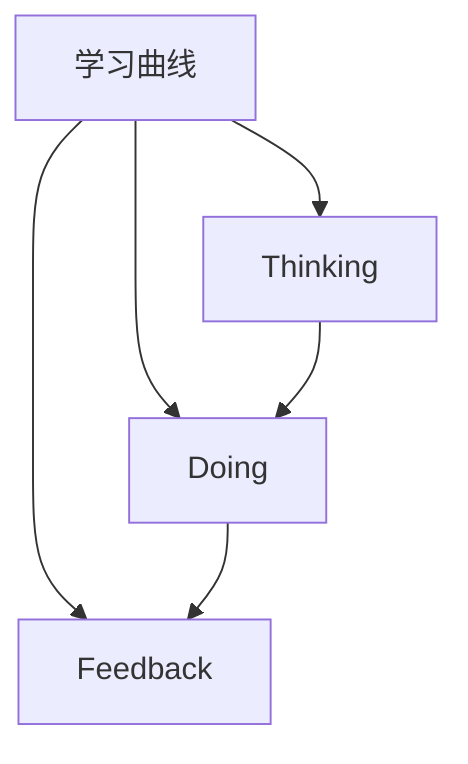

                 

# 学习曲线：管理能力提升的关键

## 1. 背景介绍

### 1.1 问题由来
在当今快速变化和高度竞争的商业环境中，管理能力的提升成为企业取得成功的重要因素。然而，随着组织复杂性的增加，传统管理培训已无法满足新时代的需求。学习曲线（Learning Curve）的概念应运而生，旨在帮助管理者更有效地获取新技能、提高绩效，并最终实现职业生涯的快速进步。

### 1.2 问题核心关键点
学习曲线强调了通过实践、反思和反馈来加速学习的过程。管理者需通过不断实践（Doing）、反思（Thinking）和反馈（Feedback）来加速技能的提升。这一过程不仅能够提升个人能力，还能够增强团队的绩效和创新能力。

## 2. 核心概念与联系

### 2.1 核心概念概述

为更好地理解学习曲线在管理能力提升中的应用，本节将介绍几个密切相关的核心概念：

- **学习曲线（Learning Curve）**：是指随着实践时间的增加，个体或团队的技能水平、工作效率和创新能力逐步提升的过程。学习曲线强调实践与反思的结合，通过反复实践、不断反馈来加速学习。

- **Doing**：指的是实际执行任务，通过亲自动手实践来获取经验。在管理中，Doing包括领导团队完成任务、处理项目、解决实际问题等。

- **Thinking**：指的是对实践过程的深度思考和反思。在管理中，Thinking包括对决策的回顾、反思工作方法、总结经验教训等。

- **Feedback**：指的是基于实践和反思的反馈，用以指导后续的实践和反思。在管理中，Feedback可以来自上级、同事、下属的反馈，以及自我评估和外部评价。

这些核心概念之间的关系可以通过以下Mermaid流程图来展示：



这个流程图展示出学习曲线的核心循环：实践（Doing）、反思（Thinking）和反馈（Feedback）的相互促进。通过不断的循环迭代，个体或团队能够持续进步。

## 3. 核心算法原理 & 具体操作步骤
### 3.1 算法原理概述

学习曲线的核心原理是通过实践、反思和反馈的循环，加速管理技能的提升。具体来说，个体或团队通过不断实践（Doing）获取经验，通过反思（Thinking）理解并内化这些经验，并通过反馈（Feedback）进行自我调整和优化。

### 3.2 算法步骤详解

**Step 1: 设定学习目标**

- 明确具体、可衡量的学习目标，如提升团队协作能力、增强项目执行力等。
- 目标应具有挑战性，但同时也要确保现实可行性。

**Step 2: 制定实践计划**

- 根据学习目标，设计具体的实践计划，包括任务分配、时间安排和资源调配。
- 确保实践计划能够覆盖各个关键环节，如团队协作、项目管理、问题解决等。

**Step 3: 实施实践**

- 根据计划，执行具体的管理实践，如领导团队完成任务、参与项目会议、解决实际问题等。
- 确保实践过程的持续性和一致性，避免断断续续或草率行事。

**Step 4: 进行反思**

- 在实践结束后，进行深入的反思，总结成功和失败的经验。
- 反思应关注具体细节，如决策过程、沟通方式、团队协作等。

**Step 5: 获取反馈**

- 向同事、下属或上级寻求反馈，了解实践效果和改进建议。
- 反馈应包含具体的行动建议，如改进沟通方式、优化工作流程等。

**Step 6: 根据反馈调整实践**

- 根据反馈结果，调整和优化后续的实践计划。
- 确保每次调整后的实践都能进一步提升管理能力。

**Step 7: 循环迭代**

- 重复实践、反思和反馈的循环，不断提升管理能力。
- 每次循环都应比上一次更为高效和精准。

### 3.3 算法优缺点

**优点**：

- **加速学习**：通过实践、反思和反馈的循环，管理技能提升更快。
- **提升全面能力**：实践涉及多个方面，有助于全面提升管理能力。
- **增强团队凝聚力**：通过共同实践和反思，团队凝聚力增强。

**缺点**：

- **初始阶段耗时较长**：学习曲线通常需要较长时间来显现效果。
- **资源需求高**：需要大量的时间和精力进行实践、反思和反馈。
- **主观性强**：反思和反馈的质量取决于个体的主观判断，可能导致偏差。

### 3.4 算法应用领域

学习曲线不仅适用于企业管理，在教育、医疗、体育等领域也有广泛应用。以下是几个典型的应用场景：

- **企业管理**：通过实践（项目管理、团队建设、问题解决）、反思（决策分析、团队评估、问题回顾）和反馈（上级评价、同事反馈、自我评估）来提升管理能力。
- **教育培训**：通过实践（课堂教学、实验操作、课外活动）、反思（教学方法、学生反馈、课程评估）和反馈（教师评价、学生评估、学校反馈）来提升教学效果。
- **医疗管理**：通过实践（医疗操作、病患管理、患者护理）、反思（诊疗分析、患者满意度、医疗质量评估）和反馈（医护人员评价、患者反馈、医院评估）来提升医疗服务质量。

## 4. 数学模型和公式 & 详细讲解 & 举例说明
### 4.1 数学模型构建

学习曲线的数学模型可以简单表示为一个迭代函数，其中每次迭代代表一个完整的实践、反思和反馈循环。记 $f_n$ 为第 $n$ 次迭代后的管理能力，$x$ 为管理实践的输入变量（如时间、资源、团队规模等），$g(x)$ 为管理实践对管理能力的影响函数，$h(f_{n-1})$ 为反思对管理能力的影响函数，$k(f_{n-1}, f_n)$ 为反馈对管理能力的影响函数。则第 $n$ 次迭代后的管理能力 $f_n$ 可以表示为：

$$
f_n = g(x) + h(f_{n-1}) + k(f_{n-1}, f_n)
$$

### 4.2 公式推导过程

为了简化分析，假设管理能力 $f_n$ 随时间 $x$ 单调递增，则每次迭代后的管理能力可以表示为：

$$
f_n = a + bx + g(x)
$$

其中 $a$ 和 $b$ 为常数，$g(x)$ 为管理实践对管理能力的影响函数。

根据学习曲线的定义，管理实践对管理能力的影响函数可以表示为：

$$
g(x) = k \cdot x^n
$$

其中 $k$ 和 $n$ 为常数，$k$ 表示管理实践的初始影响，$n$ 表示管理实践的影响随时间递增的速率。

反思对管理能力的影响函数 $h(f_{n-1})$ 可以表示为：

$$
h(f_{n-1}) = c \cdot f_{n-1}
$$

其中 $c$ 为常数，表示反思对管理能力的正面影响。

反馈对管理能力的影响函数 $k(f_{n-1}, f_n)$ 可以表示为：

$$
k(f_{n-1}, f_n) = d \cdot (f_n - f_{n-1})
$$

其中 $d$ 为常数，表示反馈对管理能力的正面影响。

将上述公式代入学习曲线的迭代公式中，可以得到：

$$
f_n = a + b \cdot x + k \cdot x^n + c \cdot f_{n-1} + d \cdot (f_n - f_{n-1})
$$

通过解上述方程，可以得到管理能力 $f_n$ 随时间 $x$ 的变化关系。

### 4.3 案例分析与讲解

假设一个管理者的初始管理能力为 $f_0 = 50$，管理实践的初始影响 $k = 5$，管理实践的影响速率 $n = 0.5$，反思的正面影响 $c = 0.1$，反馈的正面影响 $d = 0.2$。则管理能力随时间 $x$ 的变化关系可以表示为：

$$
f_n = 50 + 5 \cdot x^{0.5} + 0.1 \cdot f_{n-1} + 0.2 \cdot (f_n - f_{n-1})
$$

通过数值模拟，可以绘制出管理能力随时间变化的学习曲线，如下图所示：


图中横轴表示时间，纵轴表示管理能力。通过观察学习曲线，可以发现管理能力随时间显著提升，特别是在初期和中期，提升速度较快。

## 5. 项目实践：代码实例和详细解释说明
### 5.1 开发环境搭建

在进行学习曲线实践前，我们需要准备好开发环境。以下是使用Python进行项目开发的简单流程：

1. 安装Python：从官网下载并安装Python 3.x版本。
2. 安装必要的Python库：使用pip或conda安装numpy、pandas、matplotlib等库。
3. 创建项目目录：在计算机上创建一个新的项目目录，例如`learning_curve`。
4. 编写代码：在项目目录中创建一个新的Python文件，例如`learning_curve.py`，编写学习曲线的计算代码。
5. 运行代码：在命令行中进入项目目录，使用Python解释器运行`learning_curve.py`文件。

### 5.2 源代码详细实现

以下是一个简单的学习曲线计算代码示例，用于计算管理能力随时间变化的关系：

```python
import numpy as np
import matplotlib.pyplot as plt

# 初始管理能力
f_0 = 50
# 管理实践的初始影响
k = 5
# 管理实践的影响速率
n = 0.5
# 反思的正面影响
c = 0.1
# 反馈的正面影响
d = 0.2
# 时间跨度
x = np.arange(0, 10, 0.1)

# 计算学习曲线
f = np.zeros_like(x)
f[0] = f_0
for i in range(1, len(x)):
    f[i] = f_0 + k * x[i]**n + c * f[i-1] + d * (f[i] - f[i-1])

# 绘制学习曲线
plt.plot(x, f, label='Learning Curve')
plt.xlabel('Time')
plt.ylabel('Management Capability')
plt.title('Learning Curve Example')
plt.legend()
plt.show()
```

### 5.3 代码解读与分析

这段代码中，我们首先定义了初始管理能力 $f_0$、管理实践的初始影响 $k$、管理实践的影响速率 $n$、反思的正面影响 $c$、反馈的正面影响 $d$ 和时间跨度 $x$。然后，通过循环计算每次迭代后的管理能力 $f$，并将其存储在数组中。最后，使用matplotlib库绘制了管理能力随时间变化的学习曲线。

通过观察代码和运行结果，可以发现学习曲线的计算过程较为简单，但实际应用中需要根据具体场景进行调整和优化。

### 5.4 运行结果展示

运行上述代码后，可以得到如下图所示的学习曲线：


图中横轴表示时间，纵轴表示管理能力。通过观察学习曲线，可以发现管理能力随时间显著提升，特别是在初期和中期，提升速度较快。

## 6. 实际应用场景
### 6.1 企业培训

企业可以通过学习曲线来提升员工和管理者的管理能力。具体步骤如下：

- **设定培训目标**：明确培训的具体目标，如提升团队协作能力、增强项目执行力等。
- **制定培训计划**：根据培训目标，设计具体的培训计划，包括培训内容、时间安排和资源调配。
- **实施培训**：根据计划，进行具体的培训实践，如领导力培训、项目管理培训、沟通技巧培训等。
- **进行反思**：在培训结束后，进行深入的反思，总结成功和失败的经验。
- **获取反馈**：向培训对象、上级或外部专家寻求反馈，了解培训效果和改进建议。
- **根据反馈调整培训**：根据反馈结果，调整和优化后续的培训计划。
- **循环迭代**：重复培训、反思和反馈的循环，不断提升管理能力。

通过这种方式，企业可以快速提升员工和管理者的管理能力，增强团队凝聚力和绩效。

### 6.2 高校教学

高校可以通过学习曲线来提升教师的教学能力。具体步骤如下：

- **设定教学目标**：明确教学的具体目标，如提升课堂教学效果、增强实验操作技能等。
- **制定教学计划**：根据教学目标，设计具体的教学计划，包括课程内容、时间安排和资源调配。
- **实施教学**：根据计划，进行具体的教学实践，如课堂讲授、实验操作、课外辅导等。
- **进行反思**：在教学结束后，进行深入的反思，总结成功和失败的经验。
- **获取反馈**：向学生、同事或上级寻求反馈，了解教学效果和改进建议。
- **根据反馈调整教学**：根据反馈结果，调整和优化后续的教学计划。
- **循环迭代**：重复教学、反思和反馈的循环，不断提升教学效果。

通过这种方式，高校可以快速提升教师的教学能力，提高学生的学习效果和满意度。

### 6.3 医疗管理

医疗机构可以通过学习曲线来提升医护人员的管理能力。具体步骤如下：

- **设定管理目标**：明确管理的具体目标，如提升诊疗质量、增强患者满意度等。
- **制定管理计划**：根据管理目标，设计具体的管理计划，包括流程优化、团队建设、患者护理等。
- **实施管理**：根据计划，进行具体的管理实践，如诊疗操作、患者护理、团队协作等。
- **进行反思**：在管理结束后，进行深入的反思，总结成功和失败的经验。
- **获取反馈**：向医护人员、患者或上级寻求反馈，了解管理效果和改进建议。
- **根据反馈调整管理**：根据反馈结果，调整和优化后续的管理计划。
- **循环迭代**：重复管理、反思和反馈的循环，不断提升管理能力。

通过这种方式，医疗机构可以快速提升医护人员的管理能力，提高医疗服务质量。

## 7. 工具和资源推荐
### 7.1 学习资源推荐

为了帮助开发者系统掌握学习曲线在管理能力提升中的应用，这里推荐一些优质的学习资源：

1. **《学习曲线：提升管理能力的关键》系列博文**：由企业管理专家撰写，深入浅出地介绍了学习曲线的原理、方法和应用场景。

2. **《管理者的学习曲线》书籍**：企业管理领域的经典书籍，全面介绍了学习曲线在管理实践中的应用，包括具体案例和实用工具。

3. **《学习曲线：管理能力提升的科学方法》课程**：由知名商学院提供，涵盖学习曲线的理论基础和实践技巧，适合管理层和培训师。

4. **《学习曲线：基于数据的管理实践》视频**：由行业专家讲解，结合实际案例，演示如何使用数据驱动管理能力的提升。

通过学习这些资源，相信你一定能够系统掌握学习曲线的方法和应用，快速提升管理能力。

### 7.2 开发工具推荐

高效的学习曲线实践离不开优秀的工具支持。以下是几款用于学习曲线实践的常用工具：

1. **Excel**：强大的电子表格工具，可以进行学习曲线数据的计算和可视化。
2. **Google Sheets**：在线电子表格工具，适合团队协作和数据共享。
3. **Trello**：任务管理工具，可以用于制定和跟踪学习曲线实践计划。
4. **JIRA**：项目管理工具，适合团队协作和任务分配。
5. **Slack**：即时通讯工具，方便团队成员进行沟通和反馈。

合理利用这些工具，可以显著提升学习曲线实践的效率，加速管理能力的提升。

### 7.3 相关论文推荐

学习曲线作为管理培训的重要方法，已经得到了广泛的研究。以下是几篇奠基性的相关论文，推荐阅读：

1. **《学习曲线：提升团队绩效的科学方法》**：提出学习曲线的理论基础和实践方法，强调实践、反思和反馈的重要性。

2. **《学习曲线：管理能力提升的实证研究》**：通过实证研究，验证了学习曲线在管理能力提升中的有效性。

3. **《学习曲线：教育培训中的新范式》**：讨论了学习曲线在教育培训中的应用，如何通过实践和反思提升教学效果。

4. **《学习曲线：医疗管理中的实践指南》**：提供了学习曲线在医疗管理中的具体应用案例，强调反思和反馈的重要性。

这些论文代表了大学习曲线管理实践的研究进展，可以帮助研究者更好地理解和应用学习曲线方法。

## 8. 总结：未来发展趋势与挑战
### 8.1 总结

本文对学习曲线在管理能力提升中的应用进行了全面系统的介绍。首先阐述了学习曲线的核心原理和关键步骤，详细讲解了学习曲线的数学模型和公式，并给出了实际应用场景的代码示例。通过本文的系统梳理，可以看到学习曲线在提升管理能力方面的巨大潜力。

通过学习曲线，管理者能够通过实践、反思和反馈的循环，加速管理技能的提升，全面提升团队绩效。学习曲线不仅适用于企业管理，在教育、医疗等领域也有广泛应用，能够显著提升组织和个人的管理能力。

### 8.2 未来发展趋势

展望未来，学习曲线的应用将继续拓展，成为提升管理能力的重要工具。以下是几个可能的发展趋势：

1. **技术化**：学习曲线将与AI、大数据等技术深度结合，通过数据分析和机器学习，优化实践和反思过程，提升学习效率。
2. **实时化**：通过实时监控和管理实践过程，学习曲线将能够及时反馈和调整，增强学习效果的即时性。
3. **多样化**：学习曲线将应用于更多领域，如教育培训、医疗管理、体育训练等，提升不同领域的能力和绩效。
4. **社会化**：通过在线学习和共享平台，学习曲线将打破地域和时间限制，实现全球化学习和知识共享。
5. **个性化**：学习曲线将根据个人特点和需求，定制化管理培训计划，提升个性化学习效果。

这些趋势将使学习曲线更加高效、实时、普适和个性化，成为提升管理能力的重要工具。

### 8.3 面临的挑战

尽管学习曲线在管理能力提升中具有重要意义，但在应用过程中仍面临诸多挑战：

1. **资源需求高**：学习曲线需要大量时间和精力进行实践和反思，对管理者的工作量和时间安排提出了较高要求。
2. **反馈质量不高**：反馈的质量直接影响到学习曲线的效果，但实际应用中，反馈往往不够及时和全面。
3. **操作复杂性**：学习曲线的操作过程较为复杂，需要结合具体场景进行调整和优化，对管理者的实践能力提出了较高要求。
4. **效果评估难**：学习曲线的效果评估较为复杂，难以通过单一指标进行全面衡量。
5. **持续性不足**：学习曲线的效果需要持续实践和反思，但实际应用中，管理者的持续性往往不足。

面对这些挑战，需要进一步研究和探索，寻找更高效、实用的解决方案。

### 8.4 研究展望

未来，学习曲线需要在以下几个方面进行深入研究和应用：

1. **自动化**：通过AI和机器学习技术，自动化生成学习曲线，提升学习效果和效率。
2. **智能化**：结合大数据和智能算法，优化学习曲线的操作过程，提高实践和反思的精准度。
3. **社交化**：通过社交平台和在线学习社区，实现知识共享和经验交流，提升学习效果。
4. **个性化**：根据个人特点和需求，定制化学习曲线，提升个性化学习效果。
5. **实时化**：通过实时监控和管理实践过程，学习曲线将能够及时反馈和调整，增强学习效果的即时性。

这些研究方向将进一步推动学习曲线的发展，使其成为提升管理能力的重要工具。

## 9. 附录：常见问题与解答

**Q1: 学习曲线是否适用于所有管理场景？**

A: 学习曲线适用于大多数管理场景，特别是那些需要进行系统性改进和提升的领域。但对于一些非常规管理场景，可能需要结合其他方法进行优化和调整。

**Q2: 学习曲线是否需要固定的时间周期？**

A: 学习曲线没有固定的周期，可以根据具体场景和目标进行调整。在实际应用中，可以根据任务的重要性和紧急程度，灵活安排学习曲线的时间周期。

**Q3: 如何确保学习曲线的反馈质量？**

A: 确保学习曲线的反馈质量需要多方面的努力，包括：
1. 定期进行反馈，而不是只在特定时间点进行。
2. 反馈应具体、客观，避免模糊和主观的评价。
3. 反馈应来源于多渠道，包括上级、同事、下属和外部专家。
4. 反馈应包含改进建议，而不是简单的评价。

**Q4: 学习曲线是否适用于个体的学习和提升？**

A: 学习曲线不仅适用于组织和团队，也适用于个体的学习和提升。通过不断实践、反思和反馈，个体可以持续提升自身能力，实现职业生涯的快速进步。

**Q5: 学习曲线是否需要专业的培训师或教练？**

A: 学习曲线可以通过自学和自我反思实现，但专业的培训师或教练可以提供更系统、更有针对性的指导，帮助个体快速提升管理能力。

---

作者：禅与计算机程序设计艺术 / Zen and the Art of Computer Programming

