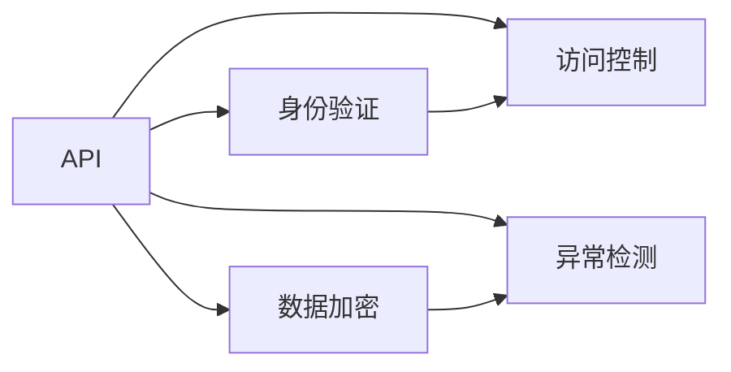

                 

# 安全 API 设计的详细步骤

> 关键词：API设计, 安全机制, 身份验证, 数据加密, 访问控制, 异常检测

## 1. 背景介绍

### 1.1 问题由来

随着互联网的迅猛发展，API（应用程序接口）在现代软件开发中的应用越来越广泛，从简单的数据查询到复杂的业务逻辑处理，API已成为连接不同系统、组件和服务的重要桥梁。然而，API也面临各种安全威胁，如SQL注入、跨站脚本攻击（XSS）、拒绝服务攻击（DDoS）等，攻击者通过这些手段获取敏感信息、破坏系统功能、甚至控制整个系统。因此，设计一个安全可靠的API系统，对于保障系统的完整性、可用性和机密性至关重要。

### 1.2 问题核心关键点

安全 API 设计需关注的核心关键点主要包括：

- 身份验证：确保只有经过授权的用户可以访问 API。
- 数据加密：保护 API 传输过程中的数据安全。
- 访问控制：限制 API 的访问权限，确保用户只能访问其被授权的数据和功能。
- 异常检测：实时监控 API 的使用情况，及时发现并阻止异常行为。

本文档将系统地介绍安全 API 设计的详细步骤，为开发者提供了一套全面、可靠的参考方案。

## 2. 核心概念与联系

### 2.1 核心概念概述

为更好地理解安全 API 设计，我们首先介绍几个关键概念：

- API：应用程序接口，是不同系统间交互的接口，提供了一组标准的接口和协议，用于实现不同系统间的数据交换和功能调用。
- 身份验证（Authentication）：验证用户身份的过程，确保只有经过认证的用户才能访问 API。
- 数据加密（Data Encryption）：通过加密算法对数据进行保护，防止数据在传输过程中被窃取或篡改。
- 访问控制（Access Control）：根据用户身份和角色，控制其对 API 的访问权限。
- 异常检测（Anomaly Detection）：实时监控 API 的使用情况，识别并阻止异常行为，防止恶意攻击。

这些概念之间相互关联，共同构成了安全 API 设计的技术框架。下面将通过 Mermaid 流程图来展示它们之间的关系：



## 3. 核心算法原理 & 具体操作步骤

### 3.1 算法原理概述

安全 API 设计是一个多层次的、复杂的过程，涉及身份验证、数据加密、访问控制和异常检测等多个方面。其基本原理是通过严格的访问控制机制和数据加密技术，确保 API 系统只能被经过认证、授权的用户访问，同时保证数据在传输和存储过程中的安全性。

### 3.2 算法步骤详解

#### 3.2.1 身份验证

身份验证是安全 API 设计的第一步，旨在确保只有经过认证的用户才能访问 API。常见的身份验证方法包括：

- 用户名和密码认证：用户提供用户名和密码，系统通过验证其正确性来确定用户的身份。
- OAuth2认证：通过第三方认证服务（如Google、Facebook等）来验证用户身份，并获取访问令牌。
- 多因素认证（MFA）：结合多种身份验证手段（如短信验证码、指纹识别等），提高身份验证的安全性。

#### 3.2.2 数据加密

数据加密是保护 API 传输过程中数据安全的核心技术。常见的数据加密方法包括：

- 对称加密：使用相同的密钥进行加密和解密，如AES、DES等算法。
- 非对称加密：使用公钥加密，私钥解密，如RSA、ECC等算法。
- 散列函数：将数据转换为固定长度的散列值，如MD5、SHA等算法。

#### 3.2.3 访问控制

访问控制是限制 API 访问权限的重要手段，确保用户只能访问其被授权的数据和功能。常见的访问控制机制包括：

- 基于角色的访问控制（RBAC）：根据用户的角色分配权限，如管理员、普通用户等。
- 基于属性的访问控制（ABAC）：根据用户属性（如地理位置、设备类型等）来分配权限。
- 基于资源的访问控制（RBAC）：根据资源（如数据库表、文件夹等）来分配权限。

#### 3.2.4 异常检测

异常检测是实时监控 API 使用情况，识别并阻止异常行为的重要手段。常见的异常检测方法包括：

- 日志分析：通过分析日志文件，识别异常访问和操作行为。
- 异常检测算法：如机器学习算法、规则引擎等，实时监控 API 的使用情况，识别并阻止异常行为。

### 3.3 算法优缺点

#### 3.3.1 身份验证

身份验证技术的优缺点如下：

- 优点：
  - 提供了一种简单、有效的用户身份验证方法。
  - 可结合多因素认证提高安全性。
- 缺点：
  - 存在暴力破解、钓鱼攻击等风险。
  - 用户需要记住用户名和密码，增加了记忆负担。

#### 3.3.2 数据加密

数据加密技术的优缺点如下：

- 优点：
  - 确保数据在传输和存储过程中的安全性。
  - 可用于敏感数据加密，保护用户隐私。
- 缺点：
  - 加密和解密过程增加了计算开销。
  - 加密算法的选择和密钥管理需要慎重考虑。

#### 3.3.3 访问控制

访问控制技术的优缺点如下：

- 优点：
  - 确保用户只能访问其被授权的数据和功能。
  - 可根据用户角色和属性灵活分配权限。
- 缺点：
  - 复杂度高，实现和维护成本高。
  - 权限管理复杂，容易导致权限失控。

#### 3.3.4 异常检测

异常检测技术的优缺点如下：

- 优点：
  - 实时监控 API 使用情况，及时发现异常行为。
  - 可以结合机器学习等技术提高异常检测的准确性。
- 缺点：
  - 需要实时监控和分析大量数据，资源消耗大。
  - 误报和漏报现象可能存在，需要进一步优化算法。

### 3.4 算法应用领域

安全 API 设计在多个领域中都有广泛应用，例如：

- 金融行业：API 用于实现交易、支付等功能，需要进行严格的身份验证、数据加密和访问控制。
- 医疗行业：API 用于医疗数据的查询和处理，需要保护患者隐私，防止数据泄露。
- 电子商务：API 用于商品查询、订单处理等功能，需要进行身份验证和数据加密，防止恶意攻击。
- 物联网：API 用于设备间的通信和数据交互，需要保护设备和数据的安全性。

## 4. 数学模型和公式 & 详细讲解 & 举例说明

### 4.1 数学模型构建

为了更好地理解安全 API 设计的数学模型，我们引入几个数学概念：

- 对称加密算法：假设加密算法为E，解密算法为D，明文为M，密文为C，密钥为K。加密过程为C=E(K,M)，解密过程为M=D(K,C)。
- 非对称加密算法：假设公钥为PK，私钥为SK，明文为M，密文为C。加密过程为C=E(PK,M)，解密过程为M=D(SK,C)。
- 散列函数：假设散列函数为H，明文为M，散列值为H(M)。

### 4.2 公式推导过程

#### 4.2.1 对称加密

对称加密过程可以用以下公式表示：

$$
C=E(K,M)=K\oplus M
$$

其中，$\oplus$表示异或运算。解密过程为：

$$
M=D(K,C)=K\oplus C
$$

#### 4.2.2 非对称加密

非对称加密过程可以用以下公式表示：

$$
C=E(PK,M)=M^{PK} \mod N
$$

其中，$M$为明文，$PK$为公钥，$N$为模数。解密过程为：

$$
M=D(SK,C)=C^{SK} \mod N
$$

#### 4.2.3 散列函数

散列函数过程可以用以下公式表示：

$$
H(M)=M^{H}
$$

其中，$H$为散列函数，$M$为明文，$H(M)$为散列值。

### 4.3 案例分析与讲解

假设一个电商平台API需要进行身份验证和数据加密。

#### 4.3.1 身份验证

- 用户提交用户名和密码。
- 系统调用数据库查询，验证用户名和密码是否匹配。
- 若验证成功，返回访问令牌（JWT）。
- 用户每次访问API时，需要在请求头中携带访问令牌。

#### 4.3.2 数据加密

- 用户提交订单信息。
- 系统对订单信息进行加密，生成密文。
- 将密文作为请求体发送给API。
- API接收到密文后，使用相同的密钥进行解密，获取订单信息。

## 5. 项目实践：代码实例和详细解释说明

### 5.1 开发环境搭建

#### 5.1.1 环境准备

1. 安装Python和相关依赖：
   ```
   pip install flask flask-restful jose PyJWT
   ```

2. 创建虚拟环境：
   ```
   virtualenv venv
   source venv/bin/activate
   ```

3. 创建API项目目录，编写代码：
   ```
   mkdir api-project
   cd api-project
   ```

### 5.2 源代码详细实现

#### 5.2.1 Flask API

```python
from flask import Flask, request
from flask_restful import Resource, Api
from jose import jwt, JWTError

app = Flask(__name__)
api = Api(app)

# 用户数据库，存储用户名和密码
users = {'alice': 'password', 'bob': 'password'}

# 生成JWT令牌
def generate_jwt(username):
    payload = {'user': username}
    secret_key = 'my_secret_key'
    token = jwt.encode(payload, secret_key, algorithm='HS256')
    return token

# 验证JWT令牌
def validate_jwt(token):
    try:
        payload = jwt.decode(token, 'my_secret_key', algorithms=['HS256'])
        return payload['user']
    except JWTError:
        return None

# 加密函数，使用AES算法
def encrypt(data, key):
    from Crypto.Cipher import AES
    cipher = AES.new(key.encode(), AES.MODE_ECB)
    encrypted = cipher.encrypt(pad(data.encode(), 16))
    return encrypted

# 解密函数，使用AES算法
def decrypt(encrypted, key):
    from Crypto.Cipher import AES
    cipher = AES.new(key.encode(), AES.MODE_ECB)
    decrypted = cipher.decrypt(unpad(encrypted, 16))
    return decrypted.decode()

# 商品列表API
class GoodsList(Resource):
    def get(self):
        if not request.headers.get('Authorization'):
            return {'message': '缺少授权信息'}, 401
        token = request.headers.get('Authorization').split()[1]
        username = validate_jwt(token)
        if not username:
            return {'message': '无效令牌'}, 401
        return {'data': '商品列表'}

api.add_resource(GoodsList, '/goods')

if __name__ == '__main__':
    app.run(debug=True)
```

#### 5.2.2 异常检测

##### 5.2.2.1 日志分析

在API日志中，可以记录所有请求的信息，包括IP地址、请求方法、请求路径、请求参数等。通过分析日志，可以识别出异常访问行为。

##### 5.2.2.2 异常检测算法

```python
import numpy as np
from sklearn.ensemble import IsolationForest

# 构建异常检测模型
def build_anomaly_detector():
    data = np.loadtxt('api_logs.csv', delimiter=',')
    X = data[:, :-1]  # 特征矩阵
    y = data[:, -1]   # 标签
    model = IsolationForest(n_estimators=100, contamination=0.01)
    model.fit(X)
    return model

# 检测异常请求
def detect_anomaly(model, new_data):
    return model.predict(new_data)

# 示例：检测API请求是否异常
model = build_anomaly_detector()
new_data = np.array([[1.0, 2.0, 3.0, 4.0]])
is_anomaly = detect_anomaly(model, new_data)
if is_anomaly[0] == -1:
    print('这是一个异常请求')
else:
    print('这是一个正常请求')
```

### 5.3 代码解读与分析

#### 5.3.1 Flask API实现

- 使用Flask框架创建API服务。
- 创建`GoodsList`资源，用于处理商品列表的GET请求。
- 在`get`方法中，首先验证请求头中的JWT令牌，获取用户信息。
- 如果令牌有效，返回商品列表数据。

#### 5.3.2 异常检测算法

- 使用Isolation Forest算法构建异常检测模型。
- 通过训练模型，学习API请求的正常特征分布。
- 使用模型预测新的API请求是否异常，返回预测结果。

## 6. 实际应用场景

### 6.1 智能合约平台

智能合约平台提供了一个安全、透明的环境，用于编写、部署和执行智能合约。智能合约API需要进行严格的访问控制和数据加密，防止恶意攻击和数据泄露。

### 6.2 区块链应用

区块链应用中的API需要确保数据传输和存储的安全性，防止重放攻击和数据篡改。同时，需要对API请求进行身份验证，防止非授权访问。

### 6.3 云服务提供商

云服务提供商需要提供安全的API，用于用户创建、删除和管理云资源。云服务API需要进行严格的访问控制和数据加密，确保用户数据的安全性。

## 7. 工具和资源推荐

### 7.1 学习资源推荐

#### 7.1.1 Flask官方文档

Flask官方文档提供了详细的API开发指南和示例代码，是入门Flask框架的必备资源。

#### 7.1.2 Python标准库文档

Python标准库文档包含了大量API开发常用的模块和函数，是开发API的强大工具。

#### 7.1.3 Flask-RESTful文档

Flask-RESTful是Flask框架的扩展库，提供了RESTful API开发的支持，是构建API服务的必备工具。

### 7.2 开发工具推荐

#### 7.2.1 Postman

Postman是一款流行的API开发工具，支持HTTP请求的发送和测试，可以方便地进行API测试和调试。

#### 7.2.2 Insomnia

Insomnia是另一款流行的API开发工具，支持HTTP请求的发送和测试，提供了丰富的插件和扩展功能。

#### 7.2.3 Swagger

Swagger是一款流行的API文档工具，用于生成API文档和自动生成API测试代码，方便开发者进行API设计和测试。

### 7.3 相关论文推荐

#### 7.3.1 "API Security"论文

该论文详细介绍了API安全设计的基本概念和常见威胁，提供了实用的安全建议和解决方案。

#### 7.3.2 "Machine Learning for Anomaly Detection in API Services"论文

该论文介绍了使用机器学习算法进行API异常检测的方法，提供了实验结果和性能评估。

## 8. 总结：未来发展趋势与挑战

### 8.1 研究成果总结

安全 API 设计是一个不断演进的领域，需要不断更新和优化。主要研究成果包括：

- 身份验证技术：包括用户名密码认证、OAuth2认证、多因素认证等，确保用户身份的真实性和安全性。
- 数据加密技术：包括对称加密、非对称加密、散列函数等，保护数据在传输和存储过程中的安全性。
- 访问控制技术：包括基于角色的访问控制（RBAC）、基于属性的访问控制（ABAC）等，确保用户只能访问其被授权的数据和功能。
- 异常检测技术：包括日志分析、异常检测算法等，实时监控API的使用情况，识别并阻止异常行为。

### 8.2 未来发展趋势

未来的安全 API 设计将呈现以下几个发展趋势：

- 身份验证技术的融合：身份验证将与多因素认证、生物识别等技术相结合，提高身份验证的准确性和安全性。
- 数据加密技术的演进：随着量子计算的发展，基于量子加密的数据加密技术将逐渐成熟，为API提供更高的安全性。
- 访问控制技术的升级：基于区块链、人工智能等技术的访问控制技术将逐渐应用，提供更细粒度和更灵活的权限控制。
- 异常检测技术的深化：结合机器学习、深度学习等技术，实现更精准的异常检测和实时防护。

### 8.3 面临的挑战

尽管安全 API 设计已经取得了一定的进展，但在实际应用中仍面临诸多挑战：

- 身份验证技术的复杂性：多因素认证、生物识别等技术的应用，增加了身份验证的复杂性。
- 数据加密技术的开销：对称加密、非对称加密等技术的应用，增加了计算开销和资源消耗。
- 访问控制技术的复杂性：权限管理、角色分配等技术的应用，增加了系统的复杂性和维护成本。
- 异常检测技术的误报和漏报：机器学习等技术的误报和漏报现象，可能影响API的安全性。

### 8.4 研究展望

未来的研究将在以下几个方向寻求新的突破：

- 身份验证技术的优化：结合区块链、人工智能等技术，实现更简单、更安全的身份验证方案。
- 数据加密技术的提升：基于量子计算的数据加密技术将逐步成熟，提供更高的安全性。
- 访问控制技术的创新：基于区块链、人工智能等技术的访问控制技术将逐渐应用，提供更细粒度和更灵活的权限控制。
- 异常检测技术的深度学习：结合深度学习等技术，实现更精准的异常检测和实时防护。

## 9. 附录：常见问题与解答

### 9.1 问题1：API设计时，如何保证数据安全性？

答案：
- 使用加密算法对数据进行加密，确保数据在传输和存储过程中的安全性。
- 使用访问控制技术，确保用户只能访问其被授权的数据和功能。

### 9.2 问题2：API设计时，如何实现高效的访问控制？

答案：
- 使用基于角色的访问控制（RBAC），根据用户角色分配权限。
- 使用基于属性的访问控制（ABAC），根据用户属性（如地理位置、设备类型等）分配权限。

### 9.3 问题3：API设计时，如何实现高效的异常检测？

答案：
- 使用日志分析，通过分析日志文件，识别异常访问和操作行为。
- 使用异常检测算法，如机器学习算法、规则引擎等，实时监控API的使用情况，识别并阻止异常行为。

作者：禅与计算机程序设计艺术 / Zen and the Art of Computer Programming

